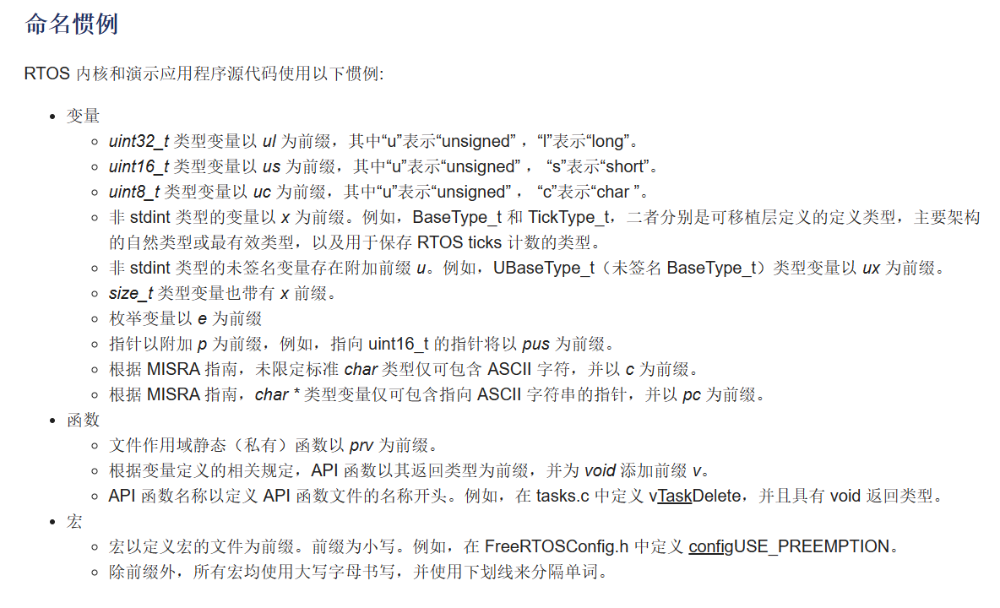
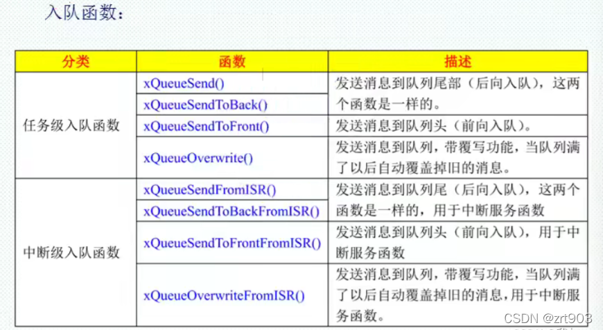

## FreeRTOS的教程和文档

[韦东山freeRTOS快速入门 (100ask.net)](https://www.100ask.net/p/t_pc/course_pc_detail/column/p_626b6273e4b0812e17932906)

[STM32CubeMX学习笔记（32）——FreeRTOS实时操作系统使用（事件） - 简书 (jianshu.com)](https://www.jianshu.com/p/8187bd2a1ca7)

## FreeRTOS编码规范



与SGA库的命名规范有相似之处，下面是图片的出处，有更加详细的说明。

[FreeRTOS - 免费 RTOS 编码标准和风格指南](https://www.freertos.org/zh-cn-cmn-s/FreeRTOS-Coding-Standard-and-Style-Guide.html)

## FreeRTOS与RT-Thread的区别

- 创建线程的方式与RT-Thread十分相似，需要注意的是在优先级设置上，FreeRTOS是**值越大优先级越大**，而RT-Thread则恰恰相反。
- FreeRTOS默认使用的是抢占式调度，还支持协程调度，RT-Thread也是抢占式调度（时间片），但不支持协程调度。

## CMSIS_V1和CMSIS_V2的区别

使用STM32CubeMx生成代码时，可以选择两者之一的版本。

V2版本相比于V1具有更多的功能，占用的RAM和FLASH也更多。

主要是增加了以os前缀的API，封装了FreeRTOS的原生接口。

## FreeRTOS的移植

在使用STM32CubeMX时可以直接在该软件中选择添加中间层，里面提供了FreeRTOS的资源包。

如果是移植到SGA库需要进行适当的裁剪。具体操作和RT-Thread相似。

注意一个很重要的地方，FreeRTOS已经提供了PendSV_Handler()，如果原来库中存在该函数需要屏蔽掉。还有是SysTick_Handler()，需要使用FreeRTOS特定的系统滴答中断函数，如下

```c
#ifdef FREERTOS_ENABLE
#include "task.h"
/**
 * @brief 应用于FreeRTOS的系统滴答中断
 * @param Null
 * @retval Null
*/
void SysTick_Handler(void)
{
	HAL_IncTick();
#if (INCLUDE_xTaskGetSchedulerState == 1 )
	if (xTaskGetSchedulerState() != taskSCHEDULER_NOT_STARTED)
	{
#endif /* INCLUDE_xTaskGetSchedulerState */
	xPortSysTickHandler();
#if (INCLUDE_xTaskGetSchedulerState == 1 )
	}
#endif /* INCLUDE_xTaskGetSchedulerState */
}
#endif
```


下面是一些系统设置宏定义：

**Kernel settings：**

- **USE_PREEMPTION：** `Enabled`：RTOS使用抢占式调度器；Disabled：RTOS使用协作式调度器（时间片）。
- **TICK_RATE_HZ：** 值设置为`1000`，即周期就是1ms。RTOS系统节拍中断的频率，单位为HZ。
- **MAX_PRIORITIES：** 可使用的最大优先级数量。设置好以后任务就可以使用从0到（MAX_PRIORITIES - 1）的优先级，其中0位最低优先级，（MAX_PRIORITIES - 1）为最高优先级。
- **MINIMAL_STACK_SIZE：** 设置空闲任务的最小任务堆栈大小，以字为单位，而不是字节。如该值设置为`128` Words，那么真正的堆栈大小就是 128*4 = 512 Byte。
- **MAX_TASK_NAME_LEN：** 设置任务名最大长度。
- **IDLE_SHOULD_YIELD：** `Enabled` 空闲任务放弃CPU使用权给其他同优先级的用户任务。
- **USE_MUTEXES：** 为1时使用互斥信号量，相关的API函数会被编译。
- **USE_RECURSIVE_MUTEXES：** 为1时使用递归互斥信号量，相关的API函数会被编译。
- **USE_COUNTING_SEMAPHORES：** 为1时启用计数型信号量， 相关的API函数会被编译。
- **QUEUE_REGISTRY_SIZE：** 设置可以注册的队列和信号量的最大数量，在使用内核调试器查看信号量和队列的时候需要设置此宏，而且要先将消息队列和信号量进行注册，只有注册了的队列和信号量才会在内核调试器中看到，如果不使用内核调试器的话次宏设置为0即可。
- **USE_APPLICATION_TASK_TAG：** 为1时可以使用vTaskSetApplicationTaskTag函数。
- **ENABLE_BACKWARD_COMPATIBILITY：** 为1时可以使V8.0.0之前的FreeRTOS用户代码直接升级到V8.0.0之后，而不需要做任何修改。
- **USE_PORT_OPTIMISED_TASK_SELECTION：** FreeRTOS有两种方法来选择下一个要运行的任务，一个是通用的方法，另外一个是特殊的方法，也就是硬件方法，使用MCU自带的硬件指令来实现。STM32有计算前导零指令吗，所以这里强制置1。
- **USE_TICKLESS_IDLE：** 置1：使能低功耗tickless模式；置0：保持系统节拍（tick）中断一直运行。假设开启低功耗的话可能会导致下载出现问题，因为程序在睡眠中，可用ISP下载办法解决。
- **USE_TASK_NOTIFICATIONS：** 为1时使用任务通知功能，相关的API函数会被编译。开启了此功能，每个任务会多消耗8个字节。
- **RECORD_STACK_HIGH_ADDRESS：** 为1时栈开始地址会被保存到每个任务的TCB中（假如栈是向下生长的）。

**Memory management settings：**

- **Memory Allocation：** `Dynamic/Static` 支持动态/静态内存申请
- **TOTAL_HEAP_SIZE：** 设置堆大小，如果使用了动态内存管理，FreeRTOS在创建 task, queue, mutex, software timer or semaphore的时候就会使用heap_x.c(x为1~5)中的内存申请函数来申请内存。这些内存就是从堆ucHeap[configTOTAL_HEAP_SIZE]中申请的。
- **Memory Management scheme：** 内存管理策略 `heap_4`。

**Hook function related definitions：**

- **USE_IDLE_HOOK：** 置1：使用空闲钩子（Idle Hook类似于回调函数）；置0：忽略空闲钩子。
- **USE_TICK_HOOK：** 置1：使用时间片钩子（Tick Hook）；置0：忽略时间片钩子。
- **USE_MALLOC_FAILED_HOOK：** 使用内存申请失败钩子函数。
- **CHECK_FOR_STACK_OVERFLOW：** 大于0时启用堆栈溢出检测功能，如果使用此功能用户必须提供一个栈溢出钩子函数，如果使用的话此值可以为1或者2，因为有两种栈溢出检测方法。

**Run time and task stats gathering related definitions：**

- **GENERATE_RUN_TIME_STATS：** 启用运行时间统计功能。
- **USE_TRACE_FACILITY：** 启用可视化跟踪调试。
- **USE_STATS_FORMATTING_FUNCTIONS：** 与宏configUSE_TRACE_FACILITY同时为1时会编译下面3个函数prvWriteNameToBuffer()、vTaskList()、vTaskGetRunTimeStats()。

**Co-routine related definitions：**

- **USE_CO_ROUTINES：** 启用协程。
- **MAX_CO_ROUTINE_PRIORITIES：** 协程的有效优先级数目。

**Software timer definitions：**

- **USE_TIMERS：** 启用软件定时器。

**Interrupt nesting behaviour configuration：**

- **LIBRARY_LOWEST_INTERRUPT_PRIORITY：** 中断最低优先级。
- **LIBRARY_LOWEST_INTERRUPT_PRIORITY：** 系统可管理的最高中断优先级。

## 串口重定向

FreeRTOS中并没有类似RT-Thread的rt_kprintf()打印函数，只能使用普通的printf()函数，其重定向方法与裸机相同。

此部分在SGA库已经存在，位于drv_hal.c中。

```c
int fputc(int ch, FILE *f)
{      
    uint16_t usCnt=0;
	/* F1系列 */
	while((PRINTF_UART->SR&0X40)==0)	/* 循环发送,直到发送完毕 */  
    {
		/* 防止异常超时退出 */
        if((usCnt++)>60000)
        {
            break;
        }          
    }
    /* F1系列 */
    PRINTF_UART->DR = (uint8_t) ch; 
	return ch;
}
```

## 任务

### 动态创建任务

例如在V2版本创建线程（任务）时使用os前缀API，先创建一个属性句柄用来配置线程名、栈大小、优先级。在放入osThreadNew()函数中创建线程。

```c
osThreadId_t defaultTaskHandle;
const osThreadAttr_t defaultTask_attributes = {
  .name = "defaultTask",
  .stack_size = 128 * 4,
  .priority = (osPriority_t) osPriorityNormal,
};

defaultTaskHandle = osThreadNew(StartDefaultTask, NULL, &defaultTask_attributes);
```

在V1版本中可直接调用xTaskCreate()函数填入程序配置参数。这个与RT-Thread创建线程相似。

```c
xTaskCreate( (TaskFunction_t )start_task,            //Task function   //任务函数
		    (const char*    )"start_task",          //Task name       //任务名称
			(uint16_t       )START_STK_SIZE,        //Task stack size //任务堆栈大小
			(void*          )NULL,                  //Arguments passed to the task function //传递给任务函数的参数
			(UBaseType_t    )START_TASK_PRIO,       //Task priority   //任务优先级
			TaskHandle_t*  )&StartTask_Handler);   //Task handle     //任务句柄  
```

在V2版本中也可以直接使用原来的API，其实os前缀API就是在原API基础上套了层皮。

### 静态创建任务

静态创建任务API为xTaskCreateStatic();，参数相比动态创建多了下面两个入口参数，需要手动配置。

`StackType_t * const puxStackBuffer,
StaticTask_t * const pxTaskBuffer，`

使用前需在FreeRTOSconfig.h中将`configSUPPORT_STATIC_ALLOCATION`宏定义配置为1（启用）。

同时可能要加入下面改函数，用于提供RTOS空闲任务的内存。

```c
static StaticTask_t xIdleTaskTCBBuffer;
static StackType_t xIdleStack[configMINIMAL_STACK_SIZE];

void vApplicationGetIdleTaskMemory( StaticTask_t **ppxIdleTaskTCBBuffer, StackType_t **ppxIdleTaskStackBuffer, uint32_t *pulIdleTaskStackSize )
{
  *ppxIdleTaskTCBBuffer = &xIdleTaskTCBBuffer;
  *ppxIdleTaskStackBuffer = &xIdleStack[0];
  *pulIdleTaskStackSize = configMINIMAL_STACK_SIZE;
}
```

### 优先级

可选值在`osPriority_t`结构体中。

FreeRTOS中高优先级任务不主动释放CPU，低优先级将永远不能运行。

## 线程切换

FreeRTOS是每一个tick判断一次是否切换，RT-Thread是根据时间片判断。

## 任务删除

自杀任务无法清理自己使用的内存，由空闲任务清理。对于被杀的任务，在vTaskDelete函数中清理。

## 钩子函数

使用方法：

1. 将宏定义`configUSE_IDLE_HOOK`
2. 实现`vApplicationIdleHook`()函数

空闲任务的钩子函数的限制：

- 不能导致空闲任务进入阻塞或者暂停状态。
- 钩子函数要非常高效的执行，否则无法删除任务，导致无法释放内存。

## 调度算法

1. 能否抢占？高优先级能否优先执行（配置项configUSE_PREEMPTION）
    - 可以，可抢占调度。
    - 不可以，合作调度模式。高优先级任务就绪了也不能马上运行，需要等其他任务主动让出CPU
2. 同优先级任务能否轮流执行（配置项：configUSE_TIME_SLICING）

    - 时间片轮转：按照时间片执行
    - 任务会一直执行，直到主动放弃或者被高优先级抢占
3. IDLE任务能否主动让步（配置项：configIDLE_SHOULD_YIELD）

    1为礼让，0为不礼让

## FIFO队列

### 队列创建函数

```c
QueueHandle_t xQueueCreate(UBaseType_t uxQueueLength,
UBaseType_t uxItemSize)
```

uxQueueLength：要创建的队列的*队列长度*，这里是队列的数量
uxItemSize： 队列中每个项目(消息)的长度，单位为字节 队列创捷成功以后返回的队列句柄！
NULL: 队列创建失败

### 入队函数



前三个任务级入队函数不用使用在中断服务函数中，应当使用下面的中断级入队函数。

返回值：
pdPASS： 向队列发送消息成功！
errQUEUE_FULL: 队列已经满了，消息发送失败。

队列可以做为信号量使用，一个任务随意写入队列任意值，另一个任务去读取队列是否有值。

## 信号量

### 创建

|          |              二进制信号量               |          技术型信号量          |
| :------: | :-------------------------------------: | :----------------------------: |
| 动态创建 |         xSemaphoreCreateBinary          |    xSemaphoreCreateCounting    |
|          | vSemaphoreCreateBinary(初始为1，已过时) |                                |
| 静态创建 |      xSemaphoreCreateBinaryStatic       | xSemaphoreCreateCountingStatic |

### 获取和释放信号量

|      |  在任务中使用  |     在中断中使用      |
| :--: | :------------: | :-------------------: |
| 释放 | xSemaphoreGive | xSemaphoreGiveFromISR |
| 获得 | xSemaphoreTake | xSemaphoreTakeFromISR |

## 互斥量

### API

|      |             递归锁             |      一般互斥量       |
| :--: | :----------------------------: | :-------------------: |
| 创建 | xSemaphoreCreateRecursiveMutex | xSemaphoreCreateMutex |
| 获得 |    xSemaphoreTakeRecursive     |    xSemaphoreTake     |
| 释放 |    xSemaphoreGiveRecursive     |    xSemaphoreGive     |

### 与信号量相比的优势

- 解决优先级反转的问题

- 能解决递归上锁/解锁的问题

### 互斥量的缺陷

- FreeRTOS并没有实现谁持有，谁释放。需要编程人员自己保证。

### 递归锁

谁持有，谁释放。

递归上锁/解锁。

## 事件组

创建事件组

`EventGroupHandle_t xEventGroupCreate( void );`

设置事件组事件位

`EventBits_t xEventGroupSetBits( EventGroupHandle_t xEventGroup, const EventBits_t uxBitsToSet );`

设置事件组事件位中断安全版本

`BaseType_t xEventGroupSetBitsFromISR( EventGroupHandle_t xEventGroup,const EventBits_t uxBitsToSet,BaseType_t *pxHigherPriorityTaskWoken );`

等待事件位

`EventBits_t xEventGroupWaitBits( const EventGroupHandle_t xEventGroup,const EventBits_t uxBitsToWaitFor,const BaseType_t xClearOnExit,const BaseType_t xWaitForAllBits,TickType_t xTicksToWait );`

事件同步点

`EventBits_t xEventGroupSync( EventGroupHandle_t xEventGroup,const EventBits_t uxBitsToSet,const EventBits_t uxBitsToWaitFor,TickType_t xTicksToWait );`

## 任务通知

任务通知在FreeRTOS中是一个可选的功能，要使用任务通知的话就需要将宏configUSE_TASK_NOTIFICATIONS定义为1。

使用任务通知来实现二值信号量功能的时候，解除任务阻塞的时间比直接使用二值信号量要快45%，并且使用的RAM更少！

限制：

- FreeRTOS的任务通知只能有一个接收任务，其实大多数的应用都是这种情况。
- 接收任务可以因为接收任务通知而进入阻塞态，但是发送任务不会因为任务通知发送失败而阻塞。

|             函数             |                             描述                             |
| :--------------------------: | :----------------------------------------------------------: |
|        xTaskNotify()         | 发送通知，带有通知值并且不保留接收任务原通知值，用在任务中。 |
|     xTaskNotifyFromISR()     |           发送通知，函数xTaskNotify()的中断版本。            |
|      xTaskNotifyGive()       | 发送通知，不带通知值并且不保留接收任务的通知值，此函数会将接收任务的通知值加一，用于任务中。 |
|   vTaskNotifyGiveFromISR()   |         发送通知，函数xTaskNotifyGive()的中断版本。          |
|    xTaskNotifyAndQuery()     | 发送通知，带有通知值并且保留接收任务的原通知值，用在任务中。 |
| XTaskNotiryAndQueryFromISR() | 发送通知，函数xTaskNotifyAndQuery()的中断版本，用在中断服务函数中。 |

任务通知可以实现轻量级信号量、轻量级队列、轻量级事件组。

## 定时器

### 定时器三要素

1. 超时时间

2. 函数

3. 单次触发还是周期性触发

### API

|   功能   |       函数名       |
| :------: | :----------------: |
|   创建   |    xTimerCreate    |
|   启动   |    xTimerStart     |
|   重置   |    xTimerReset     |
| 改变周期 | xTimerChangePeriod |
|   停止   |     xTimerStop     |

在守护任务中执行Timer函数

守护任务的优先级一定要非常高，才不会被其他任务抢占，保证定时器回调函数的执行成功。

### 定时器防抖

- 在中断函数中启动、复位定时器

- 每次抖动都会推迟定时器的超时时间

- 多次抖动只导致定时器超时一次：消除了抖动

## 中断管理

FreeRTOS对于任务使用的函数与中断使用的函数并不相同

## 资源管理

### 临界区访问

#### 屏蔽中断

- 任务中使用：taskENTER_CRITICAL()/taskEXIT_CRITICAL()
- 在中断中使用：taskENTER_CRITICAL_FROM_ISR()/taskEXIT_CRITICAL_FROM_ISR()

#### 暂停和恢复调度器

- 暂停调度器 vTaskSuspendAll();

- 恢复调度器 xTaskResumeAll();
