# 简要说明

本教程将讲解GitHub云端仓库的创建，本地仓库的创建，附加一些Git的常用指令。Git获取SSH、固定、提交、推送，都将会使用Bash和GUI两种方式讲解。

# Git的安装

下面是Git的网址，下载并且安装，基本只需要按next，如果有需求可以根据所给英文自选。

> [Git (git-scm.com)](https://git-scm.com/)

# GitHub云端仓库的创建

## GitHub账号创建

进入GitHub，点击sign up进行账号创建，这里就不详细讲解了。如果遇到电脑无法连接GitHub，就需要使用特殊方法了，我使用的是一个名叫FastGitHub的软件。我把Gitee上面的镜像链接放在下面，下载下来，双击.exe文件启动即可。

> [FastGithub: 源地址https://github.com/dotnetcore/FastGithub，考虑到Github有时候连不上，所以搬运一份镜像。 github加速神器，解决github打不开、用户头像无法加载、releases无法上传下载、git-clone、git-pull、git-push失败等问题。 (gitee.com)](https://gitee.com/XingYuan55/FastGithub?_from=gitee_search)

## GitHub仓库创建

在GitHub的个人界面点击**New**，填写**Repository name**，**Description**可写可不写。如果要分享给其他人就选择Public。剩下的看自己要不要加，比如README。

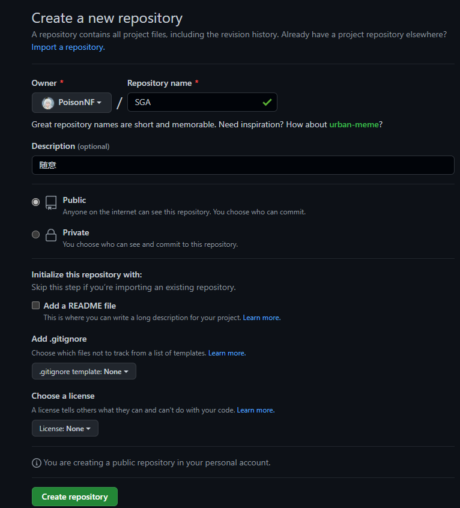

点击创建即可，创建完成显示如下图即可，下面有很多关于git的指令，后面会讲到，属于是非常常用的指令。

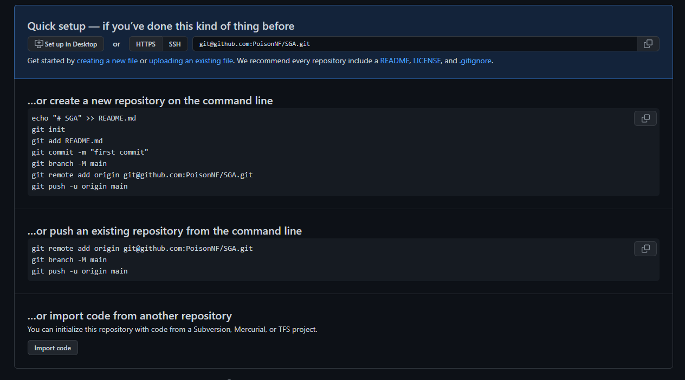

# Git本地仓库的创建

## 创建仓库

创建完成后，在文件夹内会有一个.git的隐藏文件夹，说明仓库创建完成。

### Bash方式

在需要作为仓库的文件夹下右键，选择**Git Bash Here**，输入`git init`，即可创建仓库。

### GUI方式

在需要作为仓库的文件夹下右键，选择**Git GUI Here**，选择**Create New Repository**，选择路径即可。

## 在Git中登录GitHub账号

### Bash方式

在任意位置鼠标右键，选择**Git Bash Here**,在命令行内输入下列指令

```
git config --global user.email "邮箱"
git config --global user.name "用户名"
```


### GUI方式

在GUI顶部菜单栏中选择**Edit->options**，在下图所在位置填入自己邮箱和用户名即可，点击确认。


## 获取SSH

### Bash方式

由于你的本地 Git 仓库和 GitHub 仓库之间的传输是通过SSH加密的，所以我们需要配置验证信息：

使用以下命令生成 SSH Key：

```
$ ssh-keygen -t rsa -C "youremail@example.com"
```

后面的 **your_email@youremail.com** 改为你在 Github 上注册的邮箱，之后会要求确认路径和输入密码，我们这使用默认的一路回车就行。

成功的话会在 **~/** 下生成 **.ssh** 文件夹，进去，打开 **id_rsa.pub**，复制里面的 **key**。生成的**key**类似下面的形式

```
$ ssh-keygen -t rsa -C "**********@qq.com"
Generating public/private rsa key pair.
Enter file in which to save the key (/Users/tianqixin/.ssh/id_rsa): 
Enter passphrase (empty for no passphrase):    # 直接回车
Enter same passphrase again:                   # 直接回车
Your identification has been saved in /Users/tianqixin/.ssh/id_rsa.
Your public key has been saved in /Users/tianqixin/.ssh/id_rsa.pub.
The key fingerprint is:
SHA256:MDKVidPTDXIQoJwoqUmI4LBAsg5XByBlrOEzkxrwARI 429240967@qq.com
The key's randomart image is:
+---[RSA 3072]----+
|E*+.+=**oo       |
|%Oo+oo=o. .      |
|%**.o.o.         |
|OO.  o o         |
|+o+     S        |
|.                |
|                 |
|                 |
|                 |
+----[SHA256]-----+
```

### GUI方式

在GUI顶部菜单栏中选择**Help->Show SSH Key**，然后点击**Generate Key**,在下方框中生成SSH，复制即可。


# SSH在GitHub中的使用

回到 github 上，进入 Account => Settings（账户配置）。


左边选择 **SSH and GPG keys**，然后点击 **New SSH key** 按钮,title 设置标题，可以随便填，粘贴在你电脑上生成的 key。


添加成功后界面如下所示，图中所显示的SSH为我的两台电脑，**注意在不同的设备上需要单独链接SSH**。


# 关联云端仓库和本地仓库

### Bash方式

```
git remote add origin 仓库SSH地址
```

origin是远程地址的别名，可以修改，一般默认使用就是这个。

### GUI方式

在GUI顶部菜单栏中选择**Remote->add**，填入name和location即可。

==最后可以使用git remote -v查看链接是否完成==

# Git从本地上传云端


### Bash方式

1.先`git add`将 添加文件到暂存区

2.提交暂存区到本地仓库中:

```
git commit -m [message]
```

[message] 可以是一些备注信息。

3.`git push <远程主机名> <本地分支名>`推送到云端仓库

### GUI方式

1. 在Git Gui中，如果Unstaged Changes（未缓存的改动）中包含文件，则先点击Stage Changed，将未缓存的改动加入缓存，再点击Commit；否则需要先点击Rescan扫描项目中进行过改动的文件。注：提交描述必须要填写，不然无法提交。
2. 再点击Push即可完成上传操作

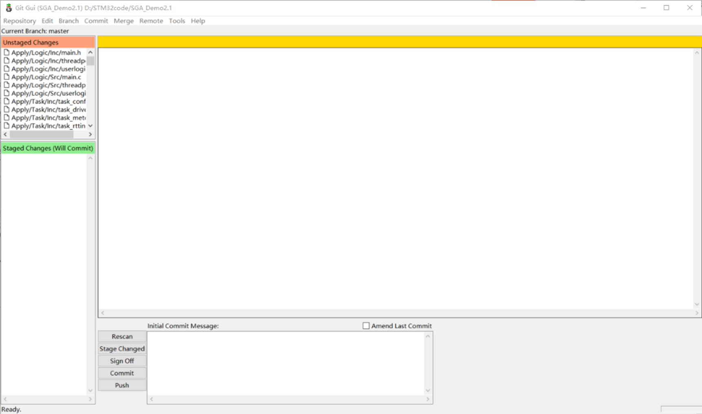

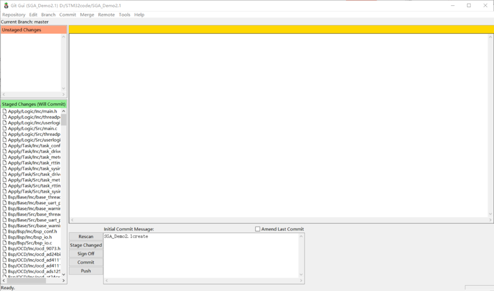

# Git与他人协作

## Fork项目

想要参与他人项目，首先要去对应项目的主仓库，fork一份仓库。fork可以让主仓库同时存在你的个人账号下。

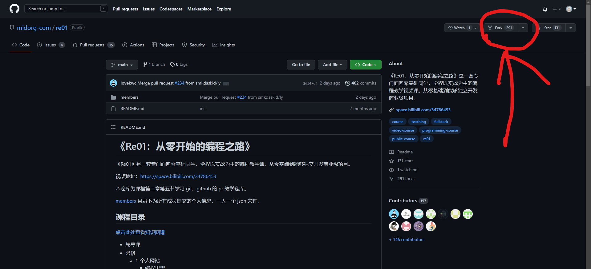

点击Fork，可以不勾选`Copy the main branch only`,再点击Create fork，此时，该仓库就出现你的个人账号中了。

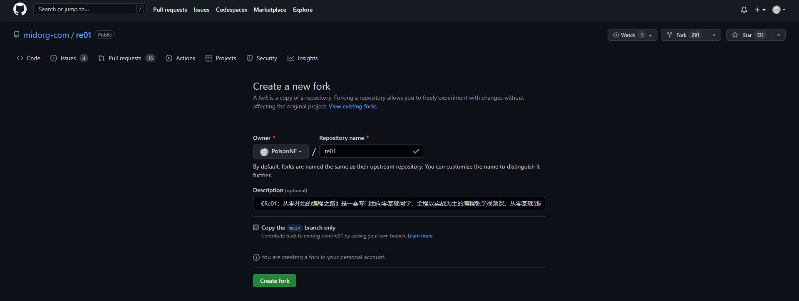

## Clone项目与设置

fork完成后，使用Https进行克隆，语句是`git clone <https链接> .`

这样就克隆到本地了。

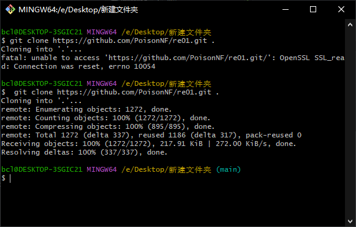

目前查看`git remote -v`会发现只和自己的仓库关联，我们需要关联一下上游仓库，回到被fork的仓库，复制https链接

执行`git remote add upstream <原仓库的https链接>`

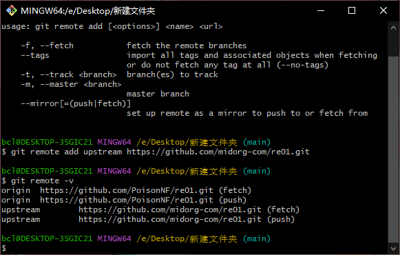

如图所示，完成了关联，接下来就是进行修改了。建议==自己创建一个分支==，完成修改后还是commit，然后push 。

## Pull request

完成push操作后，去个人仓库界面找到Pull request，点击new pull request，查看一下需要提交的分支和更改情况，如果没有问题就点击Create pull request，填写一下修改信息，等待管理员审核。

注意图中的==Able to merge==，如果不显示绿色，说明本地仓库并不是最新的，上游仓库可能进行了更改，需要从新拉取一下上游仓库

依次执行

1.`git fetch upstream` 

2.`git merge upstream/main`

完成更新

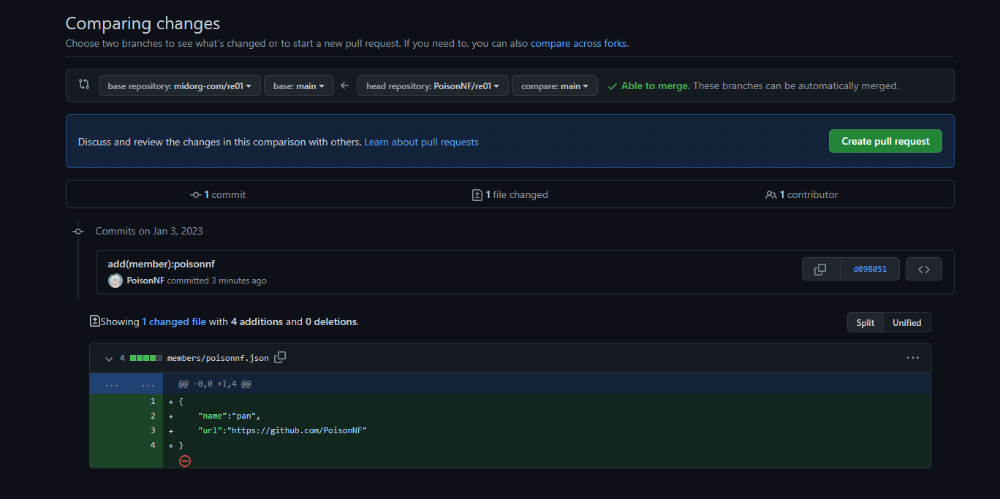

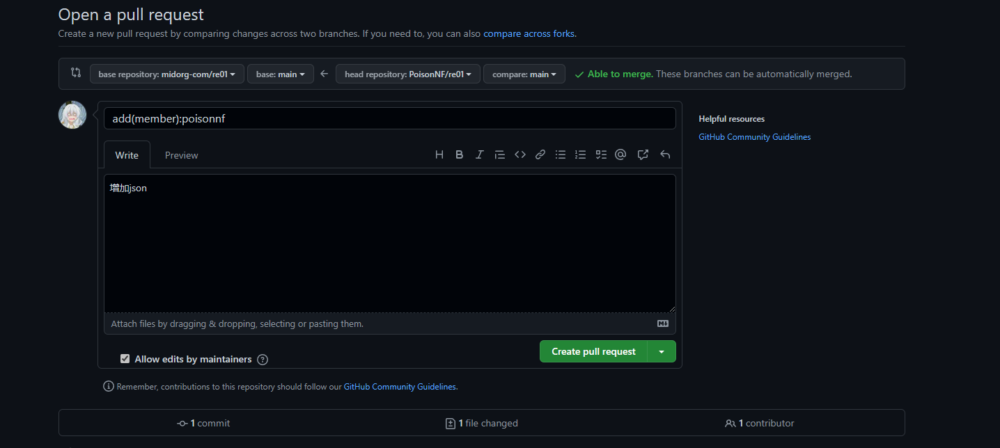

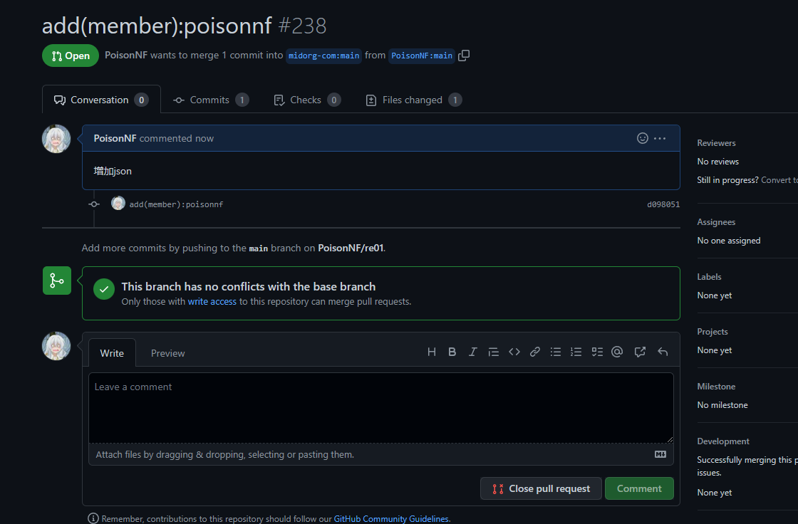

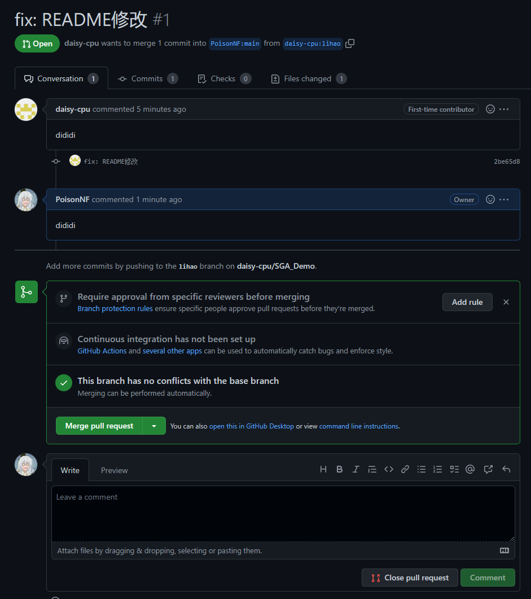

# Git常用的指令

查看登录用户 git config --global -l

更改branch的名字 git branch -m master main

 

连接远程库git remote add origin git@github.com:PoisonNF/SGA_Demo.git (origin为name 可以换成其他名字)

提交最新工程 git push origin main


查看库是否关联 git remote -v

切换到main分支 git checkout main

合并某个分支 git merge xxx

从远程获取代码并合并本地的版本 git pull origin


进行已修改或者暂存，但未提交文件的回退  git reset --hard

进行已提交，但未推送的版本回退  git reset –hard orgin/master

如果已推送，首先使用git reset --hard HEAD^先回退到上一个版本，

再使用git push -f是进行强制推送，覆盖远程分支。


# 常见问题

1. git remote -v 无法找到对应的库，需要重新登录。

2. 如果是SSH问题，例如出现“fatal: Could not read from remote repository”,需要重新添加SSH，使用ssh-keygen -t rsa -C “邮箱名“命令，在c盘用户底下.ssh中生成pub文件，使用该pub文件在GitHub中重新添加SSH KEY

3. 出现下图的问题需要将master修改成main，输入git branch -m master main

修改完成后在使用git push origin main上传。

（由于受到"Black Lives Matter"运动的影响，GitHub 从今年 10 月 1 日起，在该平台上创建的所有新的源代码仓库将默认被命名为 “main”，而不是原先的"master"。）

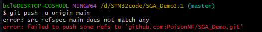

4.上传本地仓库时warning: LF will be replaced by CRLF in。解决的办法就是桌面右键打开git bash here的然后输入git config --global core.autocrlf false (全局有效）

# 参考教程

[(5条消息) Git可视化教程——Git Gui的使用_廿半的博客-CSDN博客_git gui使用](https://blog.csdn.net/qq_34842671/article/details/70916587)

[(5条消息) 解决 “fatal: Could not read from remote repository.“_I'm George的博客-CSDN博客](https://blog.csdn.net/weixin_40922744/article/details/107576748)

[git登陆 - feiquan - 博客园 (cnblogs.com)](https://www.cnblogs.com/feiquan/p/11249727.html)

[(5条消息) Git 常见错误 之 error: src refspec xxx does not match any / error: failed to push some refs to 简单解决方法_仙魁XAN的博客-CSDN博客_error:src refspec](https://blog.csdn.net/u014361280/article/details/109703556?spm=1001.2101.3001.6661.1&utm_medium=distribute.pc_relevant_t0.none-task-blog-2~default~CTRLIST~default-1-109703556-blog-109518100.pc_relevant_multi_platform_whitelistv3&depth_1-utm_source=distribute.pc_relevant_t0.none-task-blog-2~default~CTRLIST~default-1-109703556-blog-109518100.pc_relevant_multi_platform_whitelistv3&utm_relevant_index=1)

 

[Git工作流和核心原理 | GitHub基本操作 | VS Code里使用Git和关联GitHub_哔哩哔哩_bilibili](https://www.bilibili.com/video/BV1r3411F7kn?spm_id_from=333.851.b_7265636f6d6d656e64.3&vd_source=6057f993f0b528310b130bbca1e824fa)

[(4条消息) git进行版本回退（文件恢复、恢复误提交、已提交）_木鸟飞的博客-CSDN博客_git 回退版本](https://blog.csdn.net/qing040513/article/details/109150075)

[git、github 保姆级教程入门，工作和协作必备技术，github提交pr - pull request](https://www.bilibili.com/video/BV1s3411g7PS?vd_source=b861809de5579169c2e8682cde41b2cd)