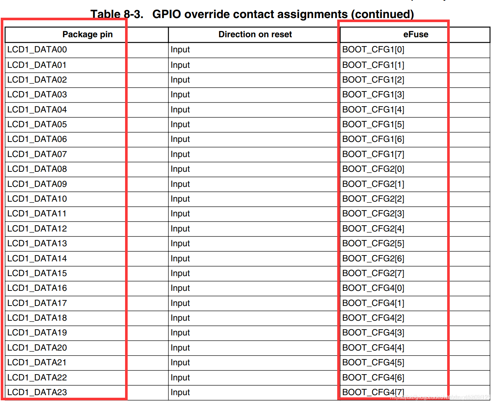

# 环境搭建与开发板操作

## 三端配网

Ubuntu 192.168.5.11


Windows 192.168.5.10


开发板 192.168.5.9


使用命令`ifconfig eth0 192.168.5.9`设置开发板IP

可以通过修改interfaces文件固定IP

1. `vi /etc/network/interfaces`

2. 输入下面的内容

```shell
auto lo
iface lo inet loopback
auto eth0
iface eth0 inet static
 address 192.168.5.9
 netmask 255.255.255.0
 gateway 192.168.5.1
```

3. 按下键盘 ESC，然后输入执行 :wq 保存并退出
4. 执行韦东山为`/etc/init.d/S40network restart `正点原子为`/etc/init.d/networking restart`重启网络服务。

## 下载BSP以及配置工具链

### 配置 repo

```shell
git config --global user.email "user@100ask.com"
git config --global user.name "100ask"

```

### 下载 BSP

```shell
git clone https://e.coding.net/codebug8/repo.git

mkdir -p 100ask_imx6ull-sdk && cd 100ask_imx6ull-sdk

../repo/repo init -u https://gitee.com/weidongshan/manifests.git -b linux-sdk -m imx6ull/100ask_imx6ull_linux4.9.88_release.xml --no-repo-verify

../repo/repo sync -j4

```

在~/100ask_imx6ull-sdk目录下执行`../repo/repo sync -c`更新代码。

### 配置交叉编译工具链

#### 永久生效（推荐）

```shell
vim ~/.bashrc 或者 gedit ~/.bashrc

export ARCH=arm
export CROSS_COMPILE=arm-buildroot-linux-gnueabihf-
export PATH=$PATH:/home/book/100ask_imx6ull-sdk/ToolChain/arm-buildroot-linux-gnueabihf_sdk-buildroot/bin

source ~/.bashrc
arm-buildroot-linux-gnueabihf-gcc -v
```

#### 临时生效

只对当前终端有效，另开一个终端需要再次设置

```shell
export ARCH=arm
export CROSS_COMPILE=arm-buildroot-linux-gnueabihf-
export PATH=$PATH:/home/book/100ask_imx6ull-sdk/ToolChain/arm-buildroot-linux-gnueabihf_sdk-buildroot/bin
```

### 压缩Linux源码传回Windows

使用命令对Linux源码进行压缩`tar cjf Linux-4.9.88.tar.bz2 Linux-4.9.88`

使用FileZilla传回Windows

### NFS挂载

在韦东山开发板中输入`mount -t nfs -o nolock,vers=3 192.168.5.11:/home/book/nfs_rootfs /mnt`

-t nfs 表示使用nfs服务 nolock,vers=3 不锁定，使用第三个版本 

将192.168.5.11:/home/book/nfs_rootfs 挂载到本地/mnt目录下

正点原子则为`mount -t nfs -o nolock,vers=3 192.168.5.11:/home/bcl/nfs /mnt`

## 第一个应用实验

使用例程01_hello，将文件拷贝到Ubuntu->nfs_rootfs目录下。

执行`arm-buildroot-linux-gnueabihf-gcc -o hello hello.c`即可编译代码。

在开发板上执行`./hello`，就可以看到实验效果。

在传统X86上使用的是gcc编译，在开发板ARM架构上需要使用交叉编译器，也就是开头这个arm-buildroot-linux-gnueabihf-gcc。

## 第一个驱动程序

### 配置编译：内核、设备树、驱动

#### 编译内核

```shell
cd /home/book/100ask_imx6ull-sdk/Linux-4.9.88	#移到内核源码下
make mrproper					#清除内核源代码目录下的所有已编译对象及配置文件，以便重新编译。
make 100ask_imx6ull_defconfig	#加载 i.MX6ULL 开发板的默认编译配置文件，以便编译正确的内核镜像。
make zImage -j4					#编译内核镜像 -j4 参数指定使用 4 个 CPU 核心
make dtbs						#编译设备树二进制文件
cp arch/arm/boot/zImage ~/nfs_rootfs
cp arch/arm/boot/dts/100ask_imx6ull-14x14.dtb ~/nfs_rootfs
```

#### 编译内核模块

`make modules`

#### 安装内核模块到 Ubuntu 某个目录下备用

`make ARCH=arm INSTALL_MOD_PATH=/home/book/nfs_rootfs modules_install`

### 放到开发板上

```shell
cp /mnt/zImage /boot
cp /mnt/100ask_imx6ull-14x14.dtb /boot
cp /mnt/lib/modules /lib -rfd
sync
```

### 编译测试驱动程序

进入 100ask_imx6ull_src_bin 目录 ， 修改Makefile 文 件 “KERN_DIR”为自己的内核所在路径。

`/home/book/100ask_imx6ull-sdk/Linux-4.9.88`

make编译生成驱动文件.ko和测试文件

`insmod hello_drv.ko`装载驱动

通过lsmod命令查看安装的模块

## 解压编译 bootloader

#### 编译u-boot

```shel
cd /home/book/100ask_imx6ull-sdk
cd Uboot-2017.03
make distclean
make mx6ull_14x14_evk_defconfig
make
```

生成u-boot-dtb.imx

#### 构建 IMX6ULL Pro 版的根文件系统

```shell
cd /home/book/100ask_imx6ull-sdk
cd Buildroot_2020.02.x
make clean
make 100ask_imx6ull_pro_ddr512m_systemV_qt5_defconfig
make all -j4
```

编译需要很久，编译成功后文件输出路径为 output/images 

100ask-imx6ull-pro512d-systemv-v1.img重命名为emmc.img(或sdcard.img)，把emmc.img(或sdcard.img) 放到“100ask_imx6ull 烧写工具”的 files 目录里，就可以使用工具烧写。

## 烧写EMMC、SD卡

NFS根文件系统、插USB OTG线配合软件烧录、用读卡器插入SD卡烧录

## 通过Uboot使用网络启动系统

需要在uboot中设置一下bootargs和bootcmd

```shell
#bootcmd 从网络tftp启动
setenv bootcmd 'tftp 80800000 zImage;tftp 83000000 imx6ull-alientek-emmc.dtb;bootz 80800000 - 83000000;'
saveenv
#bootargs 设置根文件系统放在EMMC的分区2下
setenv bootargs 'console=ttymxc0,115200 root=/dev/mmcblk1p2 rootwait rw'
saveenv
```

### 遇到的tftp报错

配置tftp，新建文件/etc/xinetd.d/tftp

加入以下内容：

```shell
service tftp
{
        socket_type = dgram
        wait = yes
        disable = no
        user = root
        protocol = udp
        server = /usr/sbin/in.tftpd
        server_args = -s /home/bcl/tftpboot
        disable = no
        per_source = 11
        cps =100 2
        flags =IPv4
}
```

如果u-boot 中能ping通主机，但是tftp下载失败：service tftpd-hpa restart 重启一下tftp服务器

[tftp的安装以及使用_xinetd 配置tftp_星火(star&fire)的博客-CSDN博客](https://blog.csdn.net/neuzhangno/article/details/126510177)

### 遇到的nfs报错

[u-boot NFS下载文件报错：Loading: *** ERROR: File lookup fail解决方法_uboot nfs loading:*_polaris_zgx的博客-CSDN博客](https://blog.csdn.net/polaris_zgx/article/details/103571725)

### 教程资料

[Imx6ull 开发板通过Uboot使用网络启动系统_正点原子imx6ull网络启动_TrueDei的博客-CSDN博客](https://blog.csdn.net/qq_17623363/article/details/120472730)

# **嵌入式Linux应用开发基础知识**

gcc适用于x86-64，不能直接在ARM开发板上使用。通过交叉编译生成的可执行文件才能在开发板上使用。

|    选项     |                     说明                     |              示例              |
| :---------: | :------------------------------------------: | :----------------------------: |
|     -E      |  预处理指定的源文件，不进行编译，生成.i文件  |  gcc -E circle.c -o circle.i   |
|     -S      | 编译指定的源文件，但是不进行汇编，生成.s文件 |                                |
|     -c      |       编译、汇编但是不连接，生成.o文件       | gcc -c test1.c test2.c test3.c |
|     -o      |                  编译，输出                  |  gcc main.c func.c -o app.out  |
|   -I dir    |       指定 include 包含文件的搜索目录        |    gcc test.c -I ./testdir/    |
|     -g      |     生成调试信息，该程序可以被调试器调试     |                                |
| -save-temps |             不删除生成的中间文件             |                                |


[Makefile教程（绝对经典，所有问题看这一篇足够了）_GUYUEZHICHENG的博客-CSDN博客](https://blog.csdn.net/weixin_38391755/article/details/80380786)

在路径01_all_series_quickstart\04_嵌入式Linux应用开发基础知识\source\05_general_Makefile中有通用Makefile的模板。

## 指定编码格式

-finput-charset=XXXX 指定输入编码格式

-fexec-charset=XXXX 指定可执行文件的编码格式

## **交叉编译程序的万能命令**

./configure --host=arm-buildroot-linux-gnueabihf --prefix=$PWD/tmp

## 输入系统

Linux 系统为了统一管理这些输入设备，实现了一套能兼容所有输入设备的框架：输入系统。

所谓输入事件就是一个“struct input_event”结构体

```c
struct input_event {
	struct timeval time;
	__u16 type;
	__u16 code;
	__s32 value;
};
```

type：表示哪类事件

code：表示该类事件下的哪一个事件

value：表示事件值

同步事件也是一个 input_event 结构体，它的 type、code、value 三项都是 0，APP 已经读到了完整的数据。

## 网络编程

TCP：可靠，重传

UDP：不可靠

[Linux下TCP/IP网络编程示例——实现服务器/客户端通信（一）_linux tcp/ip编程例子_Mr_XJC的博客-CSDN博客](https://blog.csdn.net/Mr_XJC/article/details/106788694)

## 串口

### TTY

在 Linux 或 UNIX 中，TTY 变为了一个抽象设备。有时它指的是一个物理输入设备，例如串口，有时它指的是一个允许用户和系统交互的虚拟 TTY。

TTY 是 Linux 或 UNIX 的一个子系统，它通过 TTY 驱动程序在内核级别实现进程管理、行编辑和会话管理。

在大多数 *发行版* 中，你可以使用以下键盘快捷键来得到 TTY 屏幕：

- `CTRL + ALT + F1` – 锁屏
- `CTRL + ALT + F2` – 桌面环境
- `CTRL + ALT + F3` – TTY3
- `CTRL + ALT + F4` – TTY4
- `CTRL + ALT + F5` – TTY5
- `CTRL + ALT + F6` – TTY6

TTY0指向前台程序。

使用/dev/tty找到当前程序所使用的终端

### Terminal和Console的区别

Terminal含有远端的意思，Console为控制台，具有更大的权限，能查看更多的信息。

- 某一个Terminal可以是Console
- 不是所有Terminal都是Console

可以通过内核的cmdline指定控制台，比如console=ttyS0 console=tty，当console有多个取值时，使用最后一个取值来判断。

可以在Ubuntu启动时按住Esc进入内核设置界面，选择第二项Advanced options for Ubuntu，按E进入。找到带有quiet splash 的Linux那行，quiet可以删掉，然后显示出完整的内核启动过程，可以加上console=ttyS0来选择控制台。按F10保存重启。


行规程Line discipline

`stty -a `命令显示终端行规程的配置

[Linux终端和Line discipline图解_dog250的博客-CSDN博客](https://blog.csdn.net/dog250/article/details/78818612#:~:text=行规程规定了键盘,给出相应的输出。)

## I2C

在命令行中使用`i2cdetect -l`可以显示所有I2C总线

```shell
[root@imx6ull:~]# i2cdetect -l
i2c-1   i2c             21a4000.i2c                             I2C adapter
i2c-0   i2c             21a0000.i2c                             I2C adapter
```

`i2cdetect -y 1`显示I2C1上挂载的设备

```shell
[root@imx6ull:~]# i2cdetect -y 1
     0  1  2  3  4  5  6  7  8  9  a  b  c  d  e  f
00:          -- -- -- -- -- -- -- -- -- -- -- -- --
10: -- -- -- -- -- -- -- -- -- -- UU -- -- -- -- --
20: -- -- -- -- -- -- -- -- -- -- -- -- -- -- -- --
30: -- -- -- -- -- -- -- -- -- UU -- -- -- -- -- --
40: -- -- -- -- -- -- -- -- -- -- -- -- -- -- -- --
50: -- -- -- -- -- -- -- -- -- -- -- -- -- -- -- --
60: 60 -- -- -- -- -- -- -- -- -- -- -- -- -- -- --
70: -- -- -- -- -- -- -- --

```

在开发板上有AP3216C三合一（红外、光强、距离）传感器

- 复位：往寄存器0写入0x4
- 使能：往寄存器0写入0x3
- 读光强：读寄存器0xc、0xd得到2字节的数据
- 读距离：读寄存器0xe、0xf得到2字节的数据

AP3216C设备地址为0x1e，在i2c0上

- 使用SMBus协议

    ```shell
    [root@imx6ull:~]# i2cset -f -y 0 0x1e 0 0x4
    [root@imx6ull:~]# i2cset -f -y 0 0x1e 0 0x3
    [root@imx6ull:~]# i2cget -f -y 0 0x1e 0xc 2
    [root@imx6ull:~]# i2cget -f -y 0 0x1e 0xc w
    ```

- 使用I2C协议

    ```shell
    [root@imx6ull:~]# i2ctransfer -f -y 0 w2@0x1e 0 0x4
    [root@imx6ull:~]# i2ctransfer -f -y 0 w2@0x1e 0 0x3
    [root@imx6ull:~]# i2ctransfer -f -y 0 w1@0x1e 0xc r2
    [root@imx6ull:~]# i2ctransfer -f -y 0 w1@0x1e 0xe r2
    ```

    

# 自制IMX6ULL板

## 关于IMX6ULL的启动方式

启动方式的选择主要分为4种，类似于STM32的BOOT0和BOOT1。

一般我们会选择内部BOOT模式，也就是BOOT_MODE1为1，BOOT_MODE0为0。

### 启动设备的类型

当 BOOT_MODE 设置为内部 BOOT 模式以后，可以从以下设备中启动：

①、接到 EIM 接口的 CS0 (片选0)上的 16 位 NOR Flash。
②、接到 EIM 接口的 CS0 (片选0)上的 OneNAND Flash。
③、接到 GPMI 接口上的 MLC/SLC NAND Flash， NAND Flash 页大小支持 2KByte、 4KByte和 8KByte， 8 位宽。
④、 Quad SPI Flash。
⑤、接到 USDHC 接口上的 SD/MMC/eSD/SDXC/EMMC 等设备。
⑥、 SPI 接口的 EEPROM。

| BOOT_MODE[1:0] | BOOT类型       |
| -------------- | -------------- |
| 00             | 从 FUSE 启动   |
| 01             | 串行下载       |
| 10             | 内部 BOOT 模式 |
| 11             | 保留(无效)     |

**这些启动设备如何选择呢？通过BOOT_CFG选择**

I.MX6U 同样提供了 eFUSE 和 GPIO 配置两种， eFUSE 就不讲解了。我们重点看如何通过 GPIO 来选择启动设备，因为所有的 I.MX6U 开发板都是通过 GPIO来配置启动设备的。

正如启动模式由BOOT_MODE[1:0]来选择一样，启动设备是通过 BOOT_CFG1[7:0]、 BOOT_CFG2[7:0]和 BOOT_CFG4[7:0] （每个8位）这 24 个配置 IO，这 24 个配置 IO 刚好对应着 LCD 的 24 根数据线 LCD_DATA0~LCDDATA23，当启动完成以后这 24 个 IO 就可以作为 LCD 的数据线使用。这 24 根线和 BOOT_MODE1、 BOOT_MODE0 共同组成了 I.MX6U的启动选择引脚。



一共有24个IO，但是在核心板中都使用下拉电阻接地了，只需要将对应的IO拉高电平即可。


[【精选】ARM（IMX6U）裸机之I.MX6ULL硬件启动方式的选择_行稳方能走远的博客-CSDN博客](https://blog.csdn.net/zhuguanlin121/article/details/118899296)

### 关于100M速率MAC接口

需要和底板上的 PHY 芯片以及网络接口 （HR911105A），三者才能形成完整的网口。

正点原子V2.2使用的是LAN8720A，V2.4使用的是SR8201F。

注意要点：PHY 芯片和核心板之间的布线不能过长，尽量将 PHY 芯片靠近核心板。由于核心板会通过一根引脚给 PHY 芯片提供 50MHz 时钟，该引脚的布线过长的话会导致信号质量不佳，PHY 不能正常识别。核心板通过 MDIO 和 MDC 两个引脚对 PHY 芯片进行管理和通信，数据的传输是通过 TX 和 RX 相关引脚。PHY 芯片和网络接口的数据线需要走差分线。走线最好满足一下相关的走线标准需求。

## 修改Uboot和内核的控制台波特率

因为在实际使用中可能不会用到115200bps这么高的波特率，在采用RS232或RS485时，需要降低波特率，所以需要对Uboot和内核中的波特率进行更改。

### 更改Uboot中控制台波特率

a. 进入 U-Boot 命令行界面。通常可以通过串口连接到设备，在启动时按下相应的键（如空格键或回车键）进入 U-Boot 命令行。
b. 使用 `printenv` 命令检查当前的环境变量，找到 `baudrate` 变量，该变量表示当前的波特率设置。记录下当前的波特率值。
c. 使用 `setenv baudrate <新的波特率>` 命令设置新的波特率值，例如：`setenv baudrate 115200`。
d. 使用 `saveenv` 命令保存更改后的环境变量。
e. 重新启动设备，U-Boot 控制台的波特率将会使用新的设置。

<font color=red>Tips:</font>但是这边我遇到了一个问题，在MobaXterm中修改完波特率要求按下回车键确定，但是切换了MobaXterm的波特率按下回车无效果，一直卡住，后面我使用XCOM完成了修改。

最后发现，MobaXterm对打开的串口设置波特率是没有效果的，需要关闭界面，新建一个终端即可。

### 更改内核中控制台波特率

因为内核中会读取bootargs环境变量，bootargs环境变量中存放了控制台信息。本质上就是更改Uboot中的bootargs环境变量。

假设原来的bootargs为`setenv bootargs 'console=ttymxc0,115200 rw nfsroot=192.168.5.11:/home/bcl/nfs/rootfs ip=192.168.5.9:192.168.5.11:192.168.5.1:255.255.255.0::eth0:off'`

这边很明显能看见控制台为串口1，波特率115200，如果要改成9600波特率只需要在对应位置上更改即可。

### 更改内核中控制台选择

a. 确保你有内核的源代码和编译环境。
b. 进入内核源代码目录，找到设备树文件 (Device Tree)。一般情况下，该文件的路径是 `arch/arm/boot/dts/<device>.dts`，其中 `<device>` 是设备的名字。
c. 使用文本编辑器打开设备树文件，查找 `chosen` 节点下的 `stdout-path` 属性。该属性描述了控制台输出设备的路径。
d. 修改 `stdout-path` 属性中的串口和波特率设置，例如从 `&uart1` 修改为 `&uart2`
e. 保存并关闭设备树文件，重启设备，在Uboot中更改bootargs中串口的选择。

## 制作过程中遇到的问题

### BTB附近的磁珠电路无效


该图为BTB供电部分的原理图，在实际焊接过程中发现L2磁珠靠近CORE_5V端电压一直在波动，最后为了给核心板供电，选择将L2短路，VCC_5V直接接入核心板。

### 能识别PHY芯片但是无法ping通

我发现在uboot阶段无法通过TFTP下载内核镜像和设备树，后面对I.MX6u底板BTB接口重新加锡焊接，解决了这个问题，如果再次遇到还是要先检查硬件焊接。SMT可以跳过此步骤。

### 原有模块无法加载

```shell
/lib/modules/4.1.15 # modprobe gpioled.ko
gpioled: disagrees about version of symbol device_create
gpioled: Unknown symbol device_create (err -22)
gpioled: disagrees about version of symbol device_destroy
gpioled: Unknown symbol device_destroy (err -22)
gpioled: disagrees about version of symbol device_create
gpioled: Unknown symbol device_create (err -22)
gpioled: disagrees about version of symbol device_destroy
gpioled: Unknown symbol device_destroy (err -22)
modprobe: can't load module gpioled.ko (gpioled.ko): Invalid argument
```

**解决核心思想**：`内核版本与模块版本不一致造成，更改版本一致即可解决`。

如上所示的gpioled.ko模块，在Ubuntu中重新编译发送到开发板根文件系统后可以正常加载。

[解决disagrees about version of symbol device_create_CinzWS的博客-CSDN博客](https://blog.csdn.net/qq_37619128/article/details/124346470)

## 8路UART复用

所有串口的测试都使用minicom

### UART1(ttymxc0)

系统默认配置，做调试串口使用，不需要修改。

### UART2(ttymxc1)

1. 屏蔽掉 MX6UL_PAD_UART2_TX_DATA 和 MX6UL_PAD_UART2_RX_DATA 其他复用功能，只保留 TX_DATA 和 RX_DATA 功能

```
		pinctrl_uart2: uart2grp {
			fsl,pins = <
				MX6UL_PAD_UART2_TX_DATA__UART2_DCE_TX	0x1b0b1
				MX6UL_PAD_UART2_RX_DATA__UART2_DCE_RX	0x1b0b1
			/*	MX6UL_PAD_UART3_RX_DATA__UART2_DCE_RTS	0x1b0b1
				MX6UL_PAD_UART3_TX_DATA__UART2_DCE_CTS	0x1b0b1 */
			>;
		};

		pinctrl_uart2dte: uart2dtegrp {
			fsl,pins = <
			/*	MX6UL_PAD_UART2_TX_DATA__UART2_DTE_RX	0x1b0b1
				MX6UL_PAD_UART2_RX_DATA__UART2_DTE_TX	0x1b0b1
				MX6UL_PAD_UART3_RX_DATA__UART2_DTE_CTS	0x1b0b1
				MX6UL_PAD_UART3_TX_DATA__UART2_DTE_RTS	0x1b0b1	*/
			>;
		};
```

2. 添加/修改节点标签&uart2，只使用 pinctrl_uart2，注释掉 fsl,uart-has-rtscts; status 修改为 "okay"，修改完如下

```
&uart2 {
	pinctrl-names = "default";
	pinctrl-0 = <&pinctrl_uart2>;
	/* fsl,uart-has-rtscts; */
	/* for DTE mode, add below change */
	/* fsl,dte-mode; */
	/* pinctrl-0 = <&pinctrl_uart2dte>; */
	status = "okay";
};
```

3. 在Linux源码目录下使用make dtbs命令重新编译设备树，使用cp arch/arm/boot/dts/imx6ull-alientek-emmc.dtb /home/bcl/tftpboot -f 将新设备树放到tftp目录下

4. 重启开发板，检查/dev目录下是否有ttymxc1设备

### UART3(ttymxc2)

1. 屏蔽掉 MX6UL_PAD_UART3_TX_DATA 和 MX6UL_PAD_UART3_RX_DATA 其他复用功能，只保留 TX_DATA 和 RX_DATA 功能

```
		pinctrl_uart2: uart2grp {
			fsl,pins = <
				MX6UL_PAD_UART2_TX_DATA__UART2_DCE_TX	0x1b0b1
				MX6UL_PAD_UART2_RX_DATA__UART2_DCE_RX	0x1b0b1
			/*	MX6UL_PAD_UART3_RX_DATA__UART2_DCE_RTS	0x1b0b1
				MX6UL_PAD_UART3_TX_DATA__UART2_DCE_CTS	0x1b0b1 */
			>;
		};

		pinctrl_uart2dte: uart2dtegrp {
			fsl,pins = <
			/*	MX6UL_PAD_UART2_TX_DATA__UART2_DTE_RX	0x1b0b1
				MX6UL_PAD_UART2_RX_DATA__UART2_DTE_TX	0x1b0b1
				MX6UL_PAD_UART3_RX_DATA__UART2_DTE_CTS	0x1b0b1
				MX6UL_PAD_UART3_TX_DATA__UART2_DTE_RTS	0x1b0b1	*/
			>;
		};

		pinctrl_uart3: uart3grp {
			fsl,pins = <
				MX6UL_PAD_UART3_TX_DATA__UART3_DCE_TX	0x1b0b1
				MX6UL_PAD_UART3_RX_DATA__UART3_DCE_RX	0x1b0b1
			>;
		};
```

2. 添加/修改节点标签&uart3，只使用 pinctrl_uart3，注释掉 fsl,uart-has-rtscts; status 修改为 "okay"，修改完如下

```
&uart3 {
	pinctrl-names = "default";
	pinctrl-0 = <&pinctrl_uart3>;
	status = "okay";
};
```

3. 在Linux源码目录下使用make dtbs命令重新编译设备树，使用cp arch/arm/boot/dts/imx6ull-alientek-emmc.dtb /home/bcl/tftpboot -f 将新设备树放到tftp目录下

4. 重启开发板，检查/dev目录下是否有ttymxc2设备

### UART4(ttymxc3)

1. 屏蔽掉 MX6UL_PAD_UART4_TX_DATA 和 MX6UL_PAD_UART4_RX_DATA 其他复用功能，只保留 TX_DATA 和 RX_DATA 功能

```
		pinctrl_uart4: uart4grp {
			fsl,pins = <
				MX6UL_PAD_UART4_TX_DATA__UART4_DCE_TX	0x1b0b1
				MX6UL_PAD_UART4_RX_DATA__UART4_DCE_RX	0x1b0b1
			>;
		};
```

2. 因为在i2c1节点中使用到了串口4的IO，所以要屏蔽一下i2c1，disable掉。

```
&i2c1 {
	clock-frequency = <100000>;
	pinctrl-names = "default";
	pinctrl-0 = <&pinctrl_i2c1>;
	status = "disabled";
};
```

3. 添加/修改节点标签&uart4，只使用 pinctrl_uart4，注释掉 fsl,uart-has-rtscts; status 修改为 "okay"，修改完如下

```
&uart3 {
	pinctrl-names = "default";
	pinctrl-0 = <&pinctrl_uart3>;
	status = "okay";
};
```

3. 在Linux源码目录下使用make dtbs命令重新编译设备树，使用cp arch/arm/boot/dts/imx6ull-alientek-emmc.dtb /home/bcl/tftpboot -f 将新设备树放到tftp目录下

4. 重启开发板，检查/dev目录下是否有ttymxc3设备

# 正点原子IMX6ULL应用编程

## Poky 交叉编译工具链

1. 使用命令`source /opt/fsl-imx-x11/4.1.15-2.1.0/environment-setup-cortexa7hf-neon-poky-linux-gnueabi`使能环境变量，切换终端或者用户，需要重新使能。
2. 可以使用env命令查看环境变量有无交叉编译工具链
3. `arm-poky-linux-gnueabi-gcc -v`指令可以查看 gcc 版本，表明环境变量已经生效

设置完环境变量后，可以使用${CC} -o xxx xxx.c进行编译C文件

## 通用交叉编译工具链

1. 在/usr/local/arm下放入gcc-linaro-4.9.4- 2017.01-x86_64_arm-linux-gnueabihf.tar.xz

2. 解压该工具链
3. 修改环境变量sudo vi /etc/profile，加入export PATH=$PATH:/usr/local/arm/gcc-linaro-4.9.4-2017.01-x86_64_arm-linux-gnueabihf/bin
4. 重启系统，验证是否安装成功arm-linux-gnueabihf-gcc -v

工具链压缩包在资料5、开发工具->1、交叉编译器中。

额外的库sudo apt-get install lsb-core lib32stdc++6


如果使用可执行文件出现`syntax error: unterminated quoted string`报错，可能是使用了gcc编译器，并没有使用交叉编译器。


如果出现这个问题说明ncurses库没装，不能使用图形配置Linux

```shell
HOSTCC  scripts/kconfig/mconf.o
<command-line>: fatal error: curses.h: No such file or directory
compilation terminated.
make[1]: *** [scripts/Makefile.host:108: scripts/kconfig/mconf.o] Error 1
```

需要sudo apt-get install libncurses5-dev安装

[Linux下make menuconfig命令出现[scripts/kconfig/mconf.o\] Error 1......错误的解决办法_make menuconfig报错_西岸贤的博客-CSDN博客](https://blog.csdn.net/weixin_42570192/article/details/120678754)

## 点亮LED实验

LED的驱动位于/sys/class/leds下

在/sys/class/leds/sys-led中有三个属性文件：

1. brightness：亮度，0为灭，数值越大越亮，对于led而言只有亮和灭的区别
2. max_brightness：用于获取 LED 设备的最大亮度等级
3. trigger：触发模式，通过 cat 命令查看该属性文件，可获取 LED 支持的所有触发模式以及 LED 当前被设置的触发模式

方括号（[heartbeat]）括起来的表示当前 LED 对应的触发模式，none 表示无触发，常用的触发模式包括 none（无触发）、mmc0（当对 mmc0 设备发起读写操作的时候 LED 会闪烁）、timer（LED 会有规律的一 亮一灭，被定时器控制住）、heartbeat（心跳呼吸模式，LED 模仿人的心跳呼吸那样亮灭变化）。

```shell
echo timer > trigger //将 LED 触发模式设置为 timer
echo none > trigger //将 LED 触发模式设置为 none
echo 1 > brightness //点亮 LED echo 0 > brightness//熄灭 LED
```

## GPIO实验

GPIO的驱动位于/sys/class/gpio下

为 GPIO1、GPIO2、GPIO3、GPIO4、GPIO5，在这里分别对应 gpiochip0、gpiochip32、 gpiochip64、gpiochip96、gpiochip128

export（只写）：用于将指定编号的 GPIO 引脚导出。会在目录下生成一个对应名字的文件夹。

unexport（只写）：将导出的 GPIO 引脚删除。文件夹会消失。

[poll函数详解_青季的博客-CSDN博客](https://blog.csdn.net/skypeng57/article/details/82743681)

## KEY实验

```c
struct input_event {
 struct timeval time;
 __u16 type;
 __u16 code;
 __s32 value;
};
```

分析 3 个成员变量 type、code、value。得到输入设备数据。

查看/proc/bus/input/devices，看key设备节点。


type 等于 1，表示按键类事件，code 等于 114、value 等于1，所以表示按键 KEY_VOLUMEDOWN 被按下。value 等于0表示松开。value 等于 2，表示长按状态。

EV_SYN 同步类事件（type=0）中的 SYN_REPORT 事件（code=0），表示本轮数 据已经完整、报告同步。

## 串口实验

终端的分类 

⚫ 本地终端：例如对于我们的个人 PC 机来说，PC 机连接了显示器、键盘以及鼠标等设备，这样的 一个显示器/键盘组合就是一个本地终端；同样对于开发板来说也是如此，开发板也可以连接一个 LCD 显示器、键盘和鼠标等，同样可以构成本地终端。 /dev/ttyX

⚫ 用串口连接的远程终端：对于嵌入式 Linux 开发来说，这是最常见的终端—串口终端。譬如我们的 开发板通过串口线连接到一个带有显示器和键盘的 PC 机，在 PC 机通过运行一个终端模拟程序， 譬如 Windows 超级终端、putty、MobaXterm、SecureCRT 等来获取并显示开发板通过串口发出的 数据、同样还可以通过这些终端模拟程序将用户数据通过串口发送给开发板 Linux 系统，系统接收 到数据之后便会进行相应的处理、譬如执行某个命令，这就是一种人机交互！ /dev/pts/X

⚫ 基于网络的远程终端：譬如我们可以通过 ssh、Telnet 这些协议登录到一个远程主机。/dev/ttymxcX

```c
struct termios
{
 tcflag_t c_iflag; /* input mode flags */
 tcflag_t c_oflag; /* output mode flags */
 tcflag_t c_cflag; /* control mode flags */
 tcflag_t c_lflag; /* local mode flags */
 cc_t c_line; /* line discipline */
 cc_t c_cc[NCCS]; /* control characters */
 speed_t c_ispeed; /* input speed */
 speed_t c_ospeed; /* output speed */
};
```

## 看门狗实验

看门狗实验只需要用到ioctl()函数。

|    ioctl指令     |          说明          |
| :--------------: | :--------------------: |
| WDIOC_GETSUPPORT | 获取看门狗支持哪些功能 |
| WDIOC_SETOPTIONS |  用于开启或关闭看门狗  |
| WDIOC_KEEPALIVE  |        喂狗操作        |
| WDIOC_SETTIMEOUT |   设置看门狗超时时间   |
| WDIOC_GETTIMEOUT |   获取看门狗超时时间   |

```c
struct watchdog_info {
 __u32 options; /* Options the card/driver supports */
 __u32 firmware_version; /* Firmware version of the card */
 __u8 identity[32]; /* Identity of the board */
};
```

# 正点原子IMX6ULL系统移植和根文件构建

## Uboot相关

### 编译Uboot

将uboot放入到一个文件夹中解压，执行make命令如下：

```shell
make ARCH=arm CROSS_COMPILE=arm-linux-gnueabihf- distclean
make ARCH=arm CROSS_COMPILE=arm-linux-gnueabihf- mx6ull_14x14_ddr512_emmc_defconfig
make V=1 ARCH=arm CROSS_COMPILE=arm-linux-gnueabihf- -j12
```

生成一个u-boot.bin，通过./tools/mkimage软件添加头部信息，生成u-boot.imx

### Uboot命令的使用

使用“？”查看所有命令的使用方法，使用“？ cmd”查询某个命令的信息

### Uboot更新Uboot

EMMC

```shell
mmc dev 1 0               //切换到 EMMC 分区 0
tftp 80800000 u-boot.imx  //下载 u-boot.imx 到 DRAM
mmc write 80800000 2 2EE  //烧写 u-boot.imx 到 EMMC 中 2EE由u-boot.imx的大小决定
mmc partconf 1 1 0 0      //分区配置，EMMC 需要这一步！
```

- `mmc dev 0` ：选择SD卡设备
- `mmc dev 1` ：选择EMMC 设备

千万不要写 SD 卡或者 EMMC 的前两个块(扇区)，里面保存着分区表！ 

### 将Uboot烧录到SD卡中

使用imxdownload下载uboot，使用命令 ./imxdownload u-boot.bin /dev/sdb (看具体名称)

[嵌入式Linux--U-Boot（九）通过TFT/NFS网络更新U-Boot、Kernel、DTB文件_liefyuan的博客-CSDN博客](https://blog.csdn.net/qq_28877125/article/details/111148590)

### 从EMMC启动Linux

首先查看EMMC中是否有系统，zImage和dtb。

mmc dev 1 //切换到EMMC

fatls mmc 1:1 //查看EMMC分区1中的文件

fatload mmc 1:1 80800000 zImage //下载镜像到ddr的0x80800000处

fatload mmc 1:1 83000000 dtb //下载设备树到ddr的0x83000000处

bootz 80800000 - 83000000	//启动内核


分区0(mmc 1:0) Uboot 

分区1(mmc 1:1) zImage 和 dtb 

分区2(mmc 1:2) 根文件系统


默认Uboot启动bootcmd为

```
bootcmd=run findfdt;mmc dev ${mmcdev};mmc dev ${mmcdev}; if mmc rescan; then if run loadbootscript; then run bootscript; else if run loadimage; then run mmcboot; else run netboot; fi; fi; else run netboot; fi

setenv bootcmd 'run findfdt;mmc dev ${mmcdev};mmc dev ${mmcdev}; if mmc rescan; then if run loadbootscript; then run bootscript; else if run loadimage; then run mmcboot; else run netboot; fi; fi; else run netboot; fi'
```

### 使用网络启动Linux

bootz、bootm、boot

需要准备Linux镜像文件和设备树。（设备树需要有权限，比如777）

#### bootz

使用 tftp 命令 将zImage 下载到DRAM的0X80800000地址处，然后将设备树imx6ull-14x14-emmc-7-1024x600- c.dtb 下载到 DRAM 中的 0X83000000 地址处，最后之后命令 bootz 启动，命令如下：

```shell
tftp 80800000 zImage
tftp 83000000 imx6ull-14x14-emmc-7-1024x600-c.dtb	#根据实际使用的设备树更改
bootz 80800000 - 83000000
```

#### bootm

用于uImage镜像启动，一般不用

#### boot

将bootz中的操作进行打包存放在bootcmd中

```shell
setenv bootcmd 'tftp 80800000 zImage; tftp 83000000 imx6ull-14x14-emmc-7-1024x600-c.dtb; 
bootz 80800000 - 83000000'
saveenv
boot
```

#### run

使用run配合自己写的环境变量也可以启动系统

```shell
setenv mybootnet 'tftp 80800000 zImage; tftp 83000000imx6ull-14x14-emmc-7-1024x600-c.dtb; 
bootz 80800000 - 83000000'
saveenv
```

比如run mybootemmc 、run mytoobnand

### Uboot源码目录分析

1. 分析之前要先编译Uboot
2. arch/arm/cpu/u-boot.lds是整个Uboot的链接脚本
3. board/freescale/mx6ullevk是重点
4. config目录是uboot是默认配置文件目录。配置文件对应不同的板子。自己板子配置文件名字应该有所区分。
5. 移植Uboot需要重点关注./board/freescale ./configs

### NXP官方Uboot移植

[i.MX6ULL系统移植 | 移植NXP官方uboot 2016.03版本（2022.04.06更新）_nxp uboot仓库_Mculover666的博客-CSDN博客](https://blog.csdn.net/Mculover666/article/details/120537028)

拷贝官方的Uboot压缩包，解压到某个目录下

执行下面的命令

```shell
make ARCH=arm CROSS_COMPILE=arm-linux-gnueabihf- mx6ull_14x14_evk_emmc_defconfig
make V=1 ARCH=arm CROSS_COMPILE=arm-linux-gnueabihf- -j16
```

或者参考之前编译写一个脚本文件

编译完成后，将.imx文件烧写进SD卡或者EMMC中，然后启动

1. uboot能正常启动
2. LCD驱动要更改，显示的是NXP官方的
3. NET初始化失败

#### 在Uboot中加入ALPHA开发板或者自己的开发板

#### 修改默认配置文件

借鉴NXP官方6ULL EVK开发板，在官方的配置文件上修改即可

所使用的是mx6ull_14x14_evk_emmc_defconfig，复制并修改名称

#### 添加板子对应的头文件

在自己的配置文件中加入头文件，比如

CONFIG_SYS_EXTRA_OPTIONS="IMX_CONFIG=board/freescale/mx6ull_alientek_ emmc/imximage.cfg,MX6ULL_EVK_EMMC_REWORK"

 CONFIG_TARGET_MX6ULL_ALIENTEK_EMMC=y

不同的板子有一些需要配置的信息，一般是在一个头文件里面配置，每个板子有一个

官方NXP的头文件路径为/home/bcl/uboot/uboot-imx-rel_imx_4.1.15_2.1.0_ga_alientek/include/configs/mx6sllevk.h

拷贝该头文件，并且改名mx6ull_alientek_emmc.h，更改条件编译宏定义

#### 添加板子对应的板级文件夹

使用cp mx6ullevk/ mx6ull_alientek_emmc -r命令复制一份板级文件夹来修改

修改内部的mx6ullevk.c文件的名字，同时要更改Makefile里面的变量名

修改imximage.cfg中PLUGIN，将文件夹路径修改

修改Kconfig中的目标文件名，与配置文件中相同，下面关于evk相关的都要更改

修改MAINTAINERS中的evk相关东西

#### 修改Uboot的配置界面

修改./arch/arm/cpu/armv7/mx6/Kconfig

在207行加入如下内容：

```shell
config TARGET_MX6ULL_ALIENTEK_EMMC
	bool "Support mx6ull_alientek_emmc"
	select MX6ULL
	select DM
	select DM_THERMAL
```

在最后一行的 endif 的前一行添加如下内容：

source "board/freescale/mx6ull_alientek_emmc/Kconfig"

### LCD驱动修改

Uboot修改驱动都是在xxxx.c和xxxx.h中修改，xxxx为板子名称

重点关注

1. LCD使用的GPIO，查看Uboot中的LCDIO配置是否正确 iomux_v3_cfg_t const lcd_pads[]
2. LCD背光引脚GPIO的配置
3. LCD配置参数是否正确 display_info_t const displays[]

还要修改头文件中panel对应的屏幕名称

pixclock像素时钟计算方法：pixclock=(1/lcdclk)*10^12=19531

以正点原子的 7 寸 1024*600 分辨率的屏幕(ATK7016)为例， 屏幕要求的像素时钟为 51.2MHz，因此：

pixclock=(1/51200000)*10^12=19531

### 网络驱动修改

重点：

1. ENET1 复位引脚初始化
2. LAN8720A 的器件 ID
3. LAN8720 驱动

#### 网络 PHY 地址修改

在mx6ull_alientek_emmc.h中修改ENET1 和 ENET2 的 PHY 地址和驱动

根据原理图正点原子的 I.MX6U-ALPHA 开发板 ENET1 的 PHY 地址为 0X0，ENET2 的 PHY 地址为 0X1，所以需要将第 335 行的宏 CONFIG_FEC_MXC_PHYADDR 改为 0x0。

```c
#if (CONFIG_FEC_ENET_DEV == 0)
#define IMX_FEC_BASE ENET_BASE_ADDR
#define CONFIG_FEC_MXC_PHYADDR 0x0
#define CONFIG_FEC_XCV_TYPE RMII
#elif (CONFIG_FEC_ENET_DEV == 1)
#define IMX_FEC_BASE ENET2_BASE_ADDR
#define CONFIG_FEC_MXC_PHYADDR 0x1
#define CONFIG_FEC_XCV_TYPE RMII
#endif
#define CONFIG_ETHPRIME			"FEC"

#define CONFIG_PHYLIB
#define CONFIG_PHY_SMSC
#endif
```

#### 删除 uboot 中 74LV595 的驱动代码

删除代码替换为

```c
#define ENET1_RESET IMX_GPIO_NR(5, 7)
#define ENET2_RESET IMX_GPIO_NR(5, 8)
```

将74LV595的初始化代码都删掉

#### 添加 I.MX6U-ALPHA 开发板网络复位引脚驱动

结构体数组 fec1_pads 和 fec2_pads 是 ENET1 和 ENET2 这两个网口的 IO 配置参数

```c
MX6_PAD_SNVS_TAMPER7__GPIO5_IO07 | MUX_PAD_CTRL(NO_PAD_CTRL),
MX6_PAD_SNVS_TAMPER8__GPIO5_IO08 | MUX_PAD_CTRL(NO_PAD_CTRL),
```

setup_iomux_fec函数添加

```c
static void setup_iomux_fec(int fec_id)
{
	if (fec_id == 0)
	{
		imx_iomux_v3_setup_multiple_pads(fec1_pads,
		ARRAY_SIZE(fec1_pads));
		gpio_direction_output(ENET1_RESET, 1);
		gpio_set_value(ENET1_RESET, 0);
		mdelay(20);
		gpio_set_value(ENET1_RESET, 1);
	}
	else
	{
		imx_iomux_v3_setup_multiple_pads(fec2_pads,
		ARRAY_SIZE(fec2_pads));
		gpio_direction_output(ENET2_RESET, 1);
		gpio_set_value(ENET2_RESET, 0);
		mdelay(20);
		gpio_set_value(ENET2_RESET, 1);
	}
}
```

#### 修改 drivers/net/phy/phy.c 文件中的函数 genphy_update_link

打开文件 drivers/net/phy/phy.c，找到函数 genphy_update_link，这是个通用 PHY 驱动函数，此函数用于更新 PHY 的连接状态和速度。使用 LAN8720A 的时候需要在此函数中添加一些代码，修改后的函数 genphy_update_link 函数如下所示：

```c
int genphy_update_link(struct phy_device *phydev)
{
	unsigned int mii_reg;

#ifdef CONFIG_PHY_SMSC
	static int lan8720_flag = 0;
	int bmcr_reg = 0;
	if (lan8720_flag == 0) {
		bmcr_reg = phy_read(phydev, MDIO_DEVAD_NONE, MII_BMCR); 
		phy_write(phydev, MDIO_DEVAD_NONE, MII_BMCR, BMCR_RESET); 
		while(phy_read(phydev, MDIO_DEVAD_NONE, MII_BMCR) & 0X8000) {
			udelay(100); 
	}
	phy_write(phydev, MDIO_DEVAD_NONE, MII_BMCR, bmcr_reg); 
	lan8720_flag = 1;
}
#endif

	/*
	* Wait if the link is up, and autonegotiation is in progress
	* (ie - we're capable and it's not done)
	*/
	mii_reg = phy_read(phydev, MDIO_DEVAD_NONE, MII_BMSR);
......

	return 0;
}

```

### bootcmd 和 bootargs 环境变量

bootcmd用于配置镜像和设备树，将镜像和设备树放在对应的地址中，然后启动

CONFIG_BOOTCOMMAND设置默认bootcmd 

bootargs是命令行参数，用于传递给Linux kernel

CONFIG_BOOTARGS设置bootargs 

```shell
#bootcmd 从网络tftp启动
setenv bootcmd 'tftp 80800000 zImage;tftp 83000000 imx6ull-alientek-emmc.dtb;bootz 80800000 - 83000000;'
saveenv
#bootargs 设置根文件系统放在EMMC的分区2下
setenv bootargs 'console=ttymxc0,115200 root=/dev/mmcblk1p2 rootwait rw'
saveenv
```

### Uboot DDR初始化

#### 裸机

imxdownload软件下载，会在bin文件头添加IVT DCD数据

#### Uboot

编译生成u-boot.imx，已经包含了IVT DCD数据

头部信息怎么添加的？

./tools/mkimage -n board/freescale/mx6ull_alientek_emmc/imximage.cfg.cfgtmp -T imximage -e 0x87800000 -d u-boot.bin u-boot.imx

在imximage.cfg中保存的就是DCD数据

如何修改DCD数据？

修改imximage.cfg，默认是给512MB写的。需要先对DDR进行校准，在裸机教程中的DDR校准、超频中。

### Uboot 图形化配置

uboot 或 Linux 内核可以通过输入“make menuconfig”来打开图形化配置界面，需要先安装ncurses 库。

```shell
sudo apt-get install build-essential 
sudo apt-get install libncurses5-dev
```

在打开图形化配置界面之前，要先使用“make xxx_defconfig”对 uboot 进行一次默认配置

```shell
make ARCH=arm CROSS_COMPILE=arm-linux-gnueabihf- mx6ull_alientek_emmc_defconfig
make ARCH=arm CROSS_COMPILE=arm-linux-gnueabihf- menuconfig
```

图形化配置操作方式：

后按下“Y”键就会将相应的代码编译进 Uboot 中，菜单前面变为“< * >”。

按下 “N”键不编译相应的代码。

按下“M”键就会将相应的代码编译为模块，菜单前面变为“< M >”。常用于Linux内核中。

按下“?”键查看此菜单的帮助信息，按下“/”键打开搜索框，可以在搜索框输入要搜索的内容。


因为 mx6ull_alientek_emmc.sh 在编译之前会清理工程，会删除掉.config 文件！

所以使用make ARCH=arm CROSS_COMPILE=arm-linux-gnueabihf- -j16编译Uboot

## Linux内核相关

### Linux内核编译

先安装lzop 库，sudo apt-get install lzop

选择一个合适的内核压缩包，例如linux-imx-rel_imx_4.1.15_2.1.1_ga_alientek_v2.2.tar.bz2

解压到某个目录下，新建名为 “mx6ull_alientek_emmc.sh”的 shell 脚本，然后在这个 shell 脚本里面输入如下所示内容：

```shell
#!/bin/sh
make ARCH=arm CROSS_COMPILE=arm-linux-gnueabihf- distclean
make ARCH=arm CROSS_COMPILE=arm-linux-gnueabihf- imx_v7_defconfig
make ARCH=arm CROSS_COMPILE=arm-linux-gnueabihf- menuconfig
make ARCH=arm CROSS_COMPILE=arm-linux-gnueabihf- all -j16
```

执行该脚本完成编译，可能需要先赋予权限。

编译好的dtb和zImage在./linux-imx-rel_imx_4.1.15_2.1.1_ga_alientek_v2.2/arch/arm/boot下

### Linux源码目录分析

arch/arm/boot下有zImage

arch/arm/boot/dts下有dts和dtb

Documentation/devicetree/bindings目录下的文档很重要，设备树绑定信息

### NXP官方Linux内核移植

#### 官方开发板Linux内核编译

1. 将NXP的Linux内核压缩包拷贝到Ubuntu下
2. 解压
3. 编译NXP官方的EVK开发板内核，得到镜像和设备树

defconfig文件默认放在arch/arm/configs下，教程使用imx6ull-14x14-evk-emmc.dtb和zImage

将imx6ull-14x14-evk-emmc.dtb和zImage拷贝到tftpboot下，使用网络启动

显示Kernel panic - not syncing: VFS: Unable to mount root fs on unknown-block(0,0)说明没有根文件系统。

#### 在Linux中添加自己的开发板

#### 添加开发板默认配置文件

1. 将 arch/arm/configs 目录下的imx_v7_mfg_defconfig 重新复制一份imx_alientek_emmc_defconfig

2. 屏蔽“CONFIG_ARCH_MULTI_V6=y“这一行，因为 I.MX6ULL 是 ARMV7 架构的，因此要屏蔽掉 V6 相关选项，否则后续驱动模块可能无法加载。

#### 添加开发板对应的设备树文件

1. 进入目录 arch/arm/boot/dts 中，复制一 份 imx6ull-14x14-evk.dts，然后将其重命名为 imx6ull-alientek-emmc.dts

2. 修改arch/arm/boot/dts/Makefile，找到”dtb- $(CONFIG_SOC_IMX6ULL)”配置项，加入imx6ull-alientek-emmc.dtb

#### CPU主频修改

1. 修改驱动之前，要保证板子能够正常启动

2. 根文件系统处理好，使用现成的根文件系统，保证emmc烧写了系统。设置bootcmd和bootargs

    ```shell
    #bootcmd 从网络tftp启动
    setenv bootcmd 'tftp 80800000 zImage;tftp 83000000 imx6ull-alientek-emmc.dtb;bootz 80800000 - 83000000;'
    saveenv
    #bootargs 设置根文件系统放在EMMC的分区2下
    setenv bootargs 'console=ttymxc0,115200 root=/dev/mmcblk1p2 rootwait rw'
    saveenv
    ```

3. EMMC驱动修补，在imx6ull-alientek-emmc.dts中找到usdhc2节点，改为

    ```shell
    &usdhc2 {
    	pinctrl-names = "default", "state_100mhz", "state_200mhz";
    	pinctrl-0 = <&pinctrl_usdhc2_8bit>;
    	pinctrl-1 = <&pinctrl_usdhc2_8bit_100mhz>;
    	pinctrl-2 = <&pinctrl_usdhc2_8bit_200mhz>;
    	bus-width = <8>;
    	non-removable;
    	no-1-8-v; #关闭 EMMC 1.8V 供电选项
    	status = "okay";
    };
    ```

输入cat /proc/cpuinfo查看cpu信息

BogoMIPS 是 Linux 系统中 衡量处理器运行速度的一个“尺子”，处理器性能越强，主频越高，BogoMIPS 值就越大。

/sys/bus/cpu/devices/cpu0/cpufreq查看详细信息


在menuconfig图形化配置中选择Ondemand模式来动态调节cpu频率，需要重新编译内核。

```shell
#图形化配置路径
CPU Power Management 
 -> CPU Frequency scaling 
 -> Default CPUFreq governor
```

#### 网络驱动修改

都是修改设备树

##### 使能 8 线 EMMC 驱动

```
&usdhc2 {
	pinctrl-names = "default", "state_100mhz", "state_200mhz";
	pinctrl-0 = <&pinctrl_usdhc2_8bit>;
	pinctrl-1 = <&pinctrl_usdhc2_8bit_100mhz>;
	pinctrl-2 = <&pinctrl_usdhc2_8bit_200mhz>;
	bus-width = <8>;
	non-removable;
	no-1-8-v;
	status = "okay";
};
```

##### 修改 LAN8720 的复位以及网络时钟引脚驱动

删除pinctrl_spi4: spi4grp下关于SNVS_TAMPER7和SNVS_TAMPER8相关的代码

删除spi4中pinctrl-assert-gpios = <&gpio5 8 GPIO_ACTIVE_LOW>;和cs-gpios = <&gpio5 7 0>;

修改iomuxc_snvs

```
&iomuxc_snvs {
	pinctrl-names = "default_snvs";
        pinctrl-0 = <&pinctrl_hog_2>;
        imx6ul-evk {
        
        	/*省略掉其他，在该节点最下面添加*/
        	
			/*enet1 reset zuozhongkai*/
			pinctrl_enet1_reset: enet1resetgrp {
				fsl,pins = <
					/* used for enet1 reset */
					MX6ULL_PAD_SNVS_TAMPER7__GPIO5_IO07 0x10B0 
				>;
			};
		
			/*enet2 reset zuozhongkai*/
			pinctrl_enet2_reset: enet2resetgrp {
				fsl,pins = <
					/* used for enet2 reset */
					MX6ULL_PAD_SNVS_TAMPER8__GPIO5_IO08 0x10B0 
				>;
			};
        };
};
```

修改pinctrl_enet1: enet1grp和pinctrl_enet2: enet2grp，修改为

MX6UL_PAD_ENET1_TX_CLK__ENET1_REF_CLK1 0x4001b009

MX6UL_PAD_ENET2_TX_CLK__ENET2_REF_CLK2 0x4001b009

原来默认值为 0x4001b031

##### 修改 fec1 和 fec2 节点的 pinctrl-0 属性

修改fec1和fec2两个节点

```
&fec1 {
	pinctrl-names = "default";
	pinctrl-0 = <&pinctrl_enet1
				 &pinctrl_enet1_reset>;
	phy-mode = "rmii";
	phy-handle = <&ethphy0>;
	phy-reset-gpios = <&gpio5 7 GPIO_ACTIVE_LOW>;
	phy-reset-duration = <200>;
	status = "okay";
};

&fec2 {
	pinctrl-names = "default";
	pinctrl-0 = <&pinctrl_enet2
				 &pinctrl_enet2_reset>;
	phy-mode = "rmii";
	phy-handle = <&ethphy1>;
	phy-reset-gpios = <&gpio5 8 GPIO_ACTIVE_LOW>;
	phy-reset-duration = <200>;
	status = "okay";

	mdio {
		#address-cells = <1>;
		#size-cells = <0>;

		ethphy0: ethernet-phy@0 {
			compatible = "ethernet-phy-ieee802.3-c22";
			smsc,disable-energy-detect;
			reg = <0>;
		};

		ethphy1: ethernet-phy@1 {
			compatible = "ethernet-phy-ieee802.3-c22";
			smsc,disable-energy-detect;
			reg = <1>;
		};
	};
};
```

至此Linux通用PHY驱动已经完成，剩下就是驱动LAN8720A

```shell
Configuring network interfaces... fec 20b4000.ethernet eth0: Freescale FEC PHY driver [Generic PHY] (mii_bus:phy_addr=20b4000.ethernet:01, irq=-1)
```

启动会显示Generic PHY，代表通用PHY驱动成功使用

##### 修改 fec_main.c 文件

drivers/net/ethernet/freescale/fec_main.c

在3452行加入以下内容

```c
/* 设置 MX6UL_PAD_ENET1_TX_CLK 和 MX6UL_PAD_ENET2_TX_CLK
 * 这两个 IO 的复用寄存器的 SION 位为 1。
 */
void __iomem *IMX6U_ENET1_TX_CLK;
void __iomem *IMX6U_ENET2_TX_CLK;

IMX6U_ENET1_TX_CLK = ioremap(0X020E00DC, 4);
writel(0X14, IMX6U_ENET1_TX_CLK);

IMX6U_ENET2_TX_CLK = ioremap(0X020E00FC, 4);
writel(0X14, IMX6U_ENET2_TX_CLK);
```

修改完最好先重新编译一次Linux内核

##### 配置 Linux 内核，使能 LAN8720 驱动

make menuconfig打开图形化配置界面，按照下述步骤使能LA

```
-> Device Drivers 
	-> Network device support 
 		-> PHY Device support and infrastructure 
			-> Drivers for SMSC PHYs
```

##### 修改 smsc.c 文件

drivers/net/phy/smsc.c

需要添加\#include <linux/of_gpio.h> #include <linux/io.h>

```c
static int smsc_phy_reset(struct phy_device *phydev)
{
	int err, phy_reset;
	int msec = 1;
	struct device_node *np;
	int timeout = 50000;

	if(phydev->addr == 0) /* FEC1 */ {
		np = of_find_node_by_path("/soc/aips-bus@02100000/ethernet@
							02188000");
		if(np == NULL) {
			return -EINVAL;
		}
 	}

 	if(phydev->addr == 1) /* FEC2 */ {
 		np = of_find_node_by_path("/soc/aips-bus@02000000/ethernet@
							020b4000");
		if(np == NULL) {
			return -EINVAL;
		}
	}

	err = of_property_read_u32(np, "phy-reset-duration", &msec);
	/* A sane reset duration should not be longer than 1s */
	if (!err && msec > 1000)
		msec = 1;
	phy_reset = of_get_named_gpio(np, "phy-reset-gpios", 0);
	if (!gpio_is_valid(phy_reset))
		return;

	gpio_direction_output(phy_reset, 0);
	gpio_set_value(phy_reset, 0);
	msleep(msec);
	gpio_set_value(phy_reset, 1);

	int rc = phy_read(phydev, MII_LAN83C185_SPECIAL_MODES);
	if (rc < 0)
		return rc;

	/* If the SMSC PHY is in power down mode, then set it
	 * in all capable mode before using it.
	 */
	if ((rc & MII_LAN83C185_MODE_MASK) == MII_LAN83C185_MODE_POWERDOWN) {
		int timeout = 50000;

		/* set "all capable" mode and reset the phy */
		rc |= MII_LAN83C185_MODE_ALL;
		phy_write(phydev, MII_LAN83C185_SPECIAL_MODES, rc);
	}
		phy_write(phydev, MII_BMCR, BMCR_RESET);
		/* wait end of reset (max 500 ms) */
	do {
		udelay(10);
		if (timeout-- == 0)
			return -1;
		rc = phy_read(phydev, MII_BMCR);
	} while (rc & BMCR_RESET);
	
	return 0;
}
```

启动后显示如下代表修改完成

```shell
fec 20b4000.ethernet eth0: Freescale FEC PHY driver [SMSC LAN8710/LAN8720] (mii_bus:phy_addr=20b4000.ethernet:01, irq=-1)
```

## 根文件系统构建

根文件系统首先是内核启动时所mount的第一个文件系统，内核代码映像文件保存在根文件系统中，而系统引导启动程序会在根文件系统挂载之后从中把一些基本的初始化脚本和服务等加载到内存中去运行。

/etc/：存储重要的配置文件。 

/bin/：存储常用且开机时必须用到的执行文件。 

/sbin/：存储着开机过程中所需的系统执行文件。 

/lib/：存储/bin/及/sbin/的执行文件所需的链接库，以及Linux的内核模块。 

/dev/：存储设备文件。

五大目录必须存储在根文件系统上，缺一不可。

### BusyBox 构建根文件系统

一般我们在 Linux 驱动开发的时候都是通过 nfs 挂载根文件系统的，当产品最终上市开卖的时候才会将根文件系统烧写到 EMMC 或者 NAND 中。

#### 编译 BusyBox 构建根文件系统

1. 在nfs服务器目录下创建一个rootfs的文件夹

2. 将busybox-1.29.0.tar.bz2的源码放入并解压

3. 修改makefile，添加交叉编译器，设置ARCH 和 CROSS_COMPILE

    ```
    CROSS_COMPILE ?= /usr/local/arm/gcc-linaro-4.9.4-2017.01- x86_64_arm-linux-gnueabihf/bin/arm-linux-gnueabihf-
    
    ARCH ?= arm
    ```

4. busybox支持中文字符

    修改busybox-1.29.0/libbb/printable_string.c

    ```c
    const char* FAST_FUNC printable_string(uni_stat_t *stats, const char *str)
    {
    	char *dst;
    	const char *s;
    
    	s = str;
    	while (1) {
    		unsigned char c = *s;
    		if (c == '\0') {
    			/* 99+% of inputs do not need conversion */
    			if (stats) {
    				stats->byte_count = (s - str);
    				stats->unicode_count = (s - str);
    				stats->unicode_width = (s - str);
    			}
    			return str;
    		}
    		if (c < ' ')
    			break;
    		/* 注释掉下面这两行代码 */
    		/*if (c >= 0x7f)
    			break;*/
    		s++;
    	}
    
    #if ENABLE_UNICODE_SUPPORT
    	dst = unicode_conv_to_printable(stats, str);
    #else
    	{
    		char *d = dst = xstrdup(str);
    		while (1) {
    			unsigned char c = *d;
    			if (c == '\0')
    				break;
    			/* 修改下面代码 */
    			/* if (c < ' ' || c >= 0x7f) */
    			if (c < ' ')
    				*d = '?';
    			d++;
    		}
    		if (stats) {
    			stats->byte_count = (d - dst);
    			stats->unicode_count = (d - dst);
    			stats->unicode_width = (d - dst);
    		}
    	}
    #endif
    	return auto_string(dst);
    }
    ```

    修改busybox-1.29.0/libbb/unicode.c

    ```c
    static char* FAST_FUNC unicode_conv_to_printable2(uni_stat_t *stats, const char *src, unsigned width, int flags)
    {
    	char *dst;
    	unsigned dst_len;
    	unsigned uni_count;
    	unsigned uni_width;
    
    	if (unicode_status != UNICODE_ON) {
    		char *d;
    		if (flags & UNI_FLAG_PAD) {
    			d = dst = xmalloc(width + 1);
    			while ((int)--width >= 0) {
    				unsigned char c = *src;
    				if (c == '\0') {
    					do
    						*d++ = ' ';
    					while ((int)--width >= 0);
    					break;
    				}
    				/* 修改下面一行代码 */
    				/* *d++ = (c >= ' ' && c < 0x7f) ? c : '?'; */
    				*d++ = (c >= ' ') ? c : '?';
    				src++;
    			}
    			*d = '\0';
    		} else {
    			d = dst = xstrndup(src, width);
    			while (*d) {
    				unsigned char c = *d;
    				/* 修改下面一行代码 */
    				/* if (c < ' ' || c >= 0x7f) */
    				if(c < ' ')
    					*d = '?';
    				d++;
    			}
    		}
    ```

5. 配置busybox

    有下面三种配置选择，defconfig，缺省配置；allyesconfig，全选配置；allnoconfig，最小配置

    make defconfig

    make menuconfig

```
Location: 
   -> Settings 
    	-> Build static binary (no shared libs) #不要选中，要使用动态编译
```

```
Location: 
	-> Settings 
		-> vi-style line editing commands	#选中
```

```
Location: 
	-> Linux Module Utilities
		-> Simplified modutils	#取消勾选

```

```
Location: 
	-> Linux System Utilities 
 		-> mdev (16 kb) #确保下面的全部选中，默认都是选中的
```

```
Location: 
 -> Settings
 -> Support Unicode #选中
-> Check $LC_ALL, $LC_CTYPE and $LANG environment variables #选中
```

6. 编译busybox

```shell
make install CONFIG_PREFIX=/home/bcl/nfs/rootfs
```

### 向根文件系统添加 lib 库

#### 向 rootfs 的“/lib”目录添加库文件

1. 在rootfs下创建lib文件夹 mkdir lib

2. 拷贝交叉编译器目录下的动态库拷贝到lib下

```shell
cd /usr/local/arm/gcc-linaro-4.9.4-2017.01-x86_64_arm-linux-gnueabihf/arm-linux-gnueabihf/libc/lib
cp *so* *.a /home/bcl/nfs/rootfs/lib/ -d #拷贝符号连接
```

3. ld-linux-armhf.so.3本身就是一个软连接文件，所以需要拷贝原始文件

```shell
rm /home/bcl/nfs/rootfs/lib/ld-linux-armhf.so.3
cd /usr/local/arm/gcc-linaro-4.9.4-2017.01-x86_64_arm-linux-gnueabihf/arm-linux-gnueabihf/libc/lib
cp ld-linux-armhf.so.3 /home/bcl/nfs/rootfs/lib/ 
```

4. 拷贝另一个文件夹中的动态库

```shell
cd /usr/local/arm/gcc-linaro-4.9.4-2017.01-x86_64_arm-linux-gnueabihf/arm-linux-gnueabihf/lib
cp *so* *.a /home/bcl/nfs/rootfs/lib/ -d
```

#### 向 rootfs 的“usr/lib”目录添加库文件

```shell
cd /usr/local/arm/gcc-linaro-4.9.4-2017.01-x86_64_arm-linux-gnueabihf/arm-linux-gnueabihf/libc/usr/lib
cp *so* *.a /home/bcl/nfs/rootfs/usr/lib/ -d
```

最后使用du命令查看rootfs的大小

```shell
cd /home/bcl/nfs/rootfs //进入根文件系统目录
du ./lib ./usr/lib/ -sh //查看 lib 和 usr/lib 这两个目录的大小
```

```shell
bcl@bcl-virtual-machine:~/nfs/rootfs$ du ./lib ./usr/lib/ -sh
57M	./lib
67M	./usr/lib/
```

#### 创建其他文件夹

创建 dev、proc、mnt、sys、tmp 和 root文件夹

```shell
bcl@bcl-virtual-machine:~/nfs/rootfs$ mkdir dev
bcl@bcl-virtual-machine:~/nfs/rootfs$ mkdir proc
bcl@bcl-virtual-machine:~/nfs/rootfs$ mkdir mnt
bcl@bcl-virtual-machine:~/nfs/rootfs$ mkdir sys
bcl@bcl-virtual-machine:~/nfs/rootfs$ mkdir tmp
bcl@bcl-virtual-machine:~/nfs/rootfs$ mkdir root
```

#### 设置Uboot的root值关联nfs下的rootfs

```shell
setenv bootargs 'console=ttymxc0,115200 root=/dev/nfs nfsroot=192.168.5.11:
/home/bcl/nfs/rootfs,proto=tcp rw ip=192.168.5.9:192.168.5.11:192.168.5.1:
255.255.255.0::eth0:off' //设置 bootargs
saveenv //保存环境变量
```

使用boot命令启动

会显示can't run '/etc/init.d/rcS': No such file or directory，需要继续完善。

### 完善根文件系统

#### 创建/etc/init.d/rcS文件

rcS 是个 shell 脚本，Linux 内核启动以后需要启动一些服务，而 rcS 就是规定启动哪些文件的脚本文件。

```shell
#!/bin/sh

PATH=/sbin:/bin:/usr/sbin:/usr/bin:$PATH
LD_LIBRARY_PATH=$LD_LIBRARY_PATH:/lib:/usr/lib
export PATH LD_LIBRARY_PATH

mount -a
mkdir /dev/pts
mount -t devpts devpts /dev/pts

echo /sbin/mdev > /proc/sys/kernel/hotplug	#热插拔
mdev -s
```

要给可执行权限！

#### 创建/etc/fstab 文件

在 rootfs 中创建/etc/fstab 文件，fstab 在 Linux 开机以后自动配置哪些需要自动挂载的分区。

```shell
#<file system>  <mount point> 	<type> 	<options> 	<dump> 	<pass>
proc		/proc		proc	defaults	0	0
tmpfs		/tmp		tmpfs	defaults	0	0
sysfs		/sys		sysfs	defaults	0	0
```

#### 创建/etc/inittab 文件

inittab 的详细内容可以参考 busybox 下的文件 examples/inittab。init 程序会读取/etc/inittab

```shell
#etc/inittab
::sysinit:/etc/init.d/rcS #系统启动以后运行/etc/init.d/rcS 这个脚本文件
console::askfirst:-/bin/sh #将 console 作为控制台终端，也就是 ttymxc0
::restart:/sbin/init	#重启的话运行/sbin/init
::ctrlaltdel:/sbin/reboot#按下 ctrl+alt+del 组合键的话就运行/sbin/reboot
::shutdown:/bin/umount -a -r#关机的时候执行/bin/umount，也就是卸载各个文件系统
::shutdown:/sbin/swapoff -a#关机的时候执行/sbin/swapoff，也就是关闭交换分区
```

至此！根文件系统要创建的文件就已经全部完成了。

### 根文件系统其他功能测试

#### 开机自启动测试

/etc/init.d/rcS这个脚本中添加命令，例如需要开始直接开始hello world！可以下面这样写

```shell
.....
#开机自启动
cd /
./hello &
```

#### 外网连接测试

ping www.baidu.com会显示bad address，原因是地址解析失败了，并没有解析出其对应的 IP 地址。

在 rootfs 中新建文件/etc/resolv.conf，然后在里面输入如下内容：

```shell
nameserver 114.114.114.114
nameserver 192.168.5.1 #网关
```

重启开发板

## Ubuntu-base 根文件系统构建

### 下载根文件系统

Ubuntu 的移植非常简单，不需要我们编译任何东西，因为 Ubuntu 官方已经将根文件系统制作好了！

根文件系统下载地址：http://cdimage.ubuntu.com/

点击Ubuntu-base，再点击release，根据不同CPU架构选择不同的根文件系统。

I.MX6ULL 是 Cortex-A 内核的 CPU，并且有硬件浮点运算单元，因此选择 armhf 版本。

教程使用的是\>ubuntu-base-16.04.5-base-armhf.tar.gz，位于开发板光盘->8、系统镜像->2、教程系统镜像->3、 文件系统->1、Ubuntu base 根文件系统中。

### 解压缩根文件系统

在PC的Ubuntu中的nf目录下创建一个名为ubuntu_rootfs的目录，用于保存根文件系统

`sudo tar -vzxf ubuntu-base-16.04.5-base-armhf.tar.gz`进行解压

### PC安装qemu工具

命令为`sudo apt-get install qemu-user-static`

将刚刚安装的 qemu-user-static 拷贝到刚刚解压出来的 ubuntu base 目录中，也就是 ubuntu_rootfs/usr/bin 目录下

```shell
cd /home/bcl/nfs/ubuntu_rootfs #进入到 ubuntu_rootfs 目录下
sudo cp /usr/bin/qemu-arm-static ./usr/bin/ #拷贝 qemu-arm-static
```

### 设置软件源

在设置软件源之前先将 Ubuntu 主机下的 DNS 配置文件/etc/resolv.conf 拷贝到根文件系统中，命令如下：

```shell
cd /home/bcl/nfs/ubuntu_rootfs #进入到 ubuntu_rootfs 目录下
sudo cp /etc/resolv.conf ./etc/resolv.conf #拷贝 resolv.conf
```

设置软件源，打开根文件系统中的 ubuntu_rootfs/etc/apt/sources.list 文件，在此文件最后面添加软件源，这里添加中科大Ubuntu16.04ARM源

```shell
#中科大源
deb http://mirrors.ustc.edu.cn/ubuntu-ports/ xenial main multiverse restricted universe
deb http://mirrors.ustc.edu.cn/ubuntu-ports/ xenial-backports main multiverse restricted universe
deb http://mirrors.ustc.edu.cn/ubuntu-ports/ xenial-proposed main multiverse restricted universe
deb http://mirrors.ustc.edu.cn/ubuntu-ports/ xenial-security main multiverse restricted universe
deb http://mirrors.ustc.edu.cn/ubuntu-ports/ xenial-updates main multiverse restricted universe
deb-src http://mirrors.ustc.edu.cn/ubuntu-ports/ xenial main multiverse restricted universe
deb-src http://mirrors.ustc.edu.cn/ubuntu-ports/ xenial-backports main multiverse restricted universe
deb-src http://mirrors.ustc.edu.cn/ubuntu-ports/ xenial-proposed main multiverse restricted universe
deb-src http://mirrors.ustc.edu.cn/ubuntu-ports/ xenial-security main multiverse restricted universe
deb-src http://mirrors.ustc.edu.cn/ubuntu-ports/ xenial-updates main multiverse restricted universe
```

### 在主机挂载并配置根文件系统

#### 在主机挂载根文件系统

接下来将上面制作的根文件系统挂载到主机上，需要挂载 proc、sys、dev、dev/pts 等文件 系统，最后使用 chroot 将主机的根文件系统切换到我们前面制作的根文件系统中。

在 ubuntu_rootfs 目录下创建一个名为 mount.sh 的 shell 脚本

```shell
#!/bin/bash
echo "MOUNTING"
sudo mount -t proc /proc /home/bcl/nfs/ubuntu_rootfs/proc
sudo mount -t sysfs /sys /home/bcl/nfs/ubuntu_rootfs/sys
sudo mount -o bind /dev /home/bcl/nfs/ubuntu_rootfs/dev
sudo mount -o bind /dev/pts /home/bcl/nfs/ubuntu_rootfs/dev/pts
sudo chroot /home/bcl/nfs/ubuntu_rootfs
```

再编写一个卸载的脚本文件，新建名为 unmount.sh 的 shell 脚本

```shell
!/bin/bash
echo "UNMOUNTING"
sudo umount /home/bcl/nfs/ubuntu_rootfs/proc
sudo umount /home/bcl/nfs/ubuntu_rootfs/sys
sudo umount /home/bcl/nfs/ubuntu_rootfs/dev/pts
sudo umount /home/bcl/nfs/ubuntu_rootfs/dev
```

最后给予 mount.sh 和 unmount.sh 这两个 shell 脚本可执行权限

```shell
sudo chmod 777 mount.sh unmount.sh
```

执行./mount.sh即可将根文件系统挂载在主机下

#### 安装常用的命令和软件

由于 ubuntu base 是一个最小根文件系统，很多命令和软件都没有，因此我们需要先安装一下常用的命令和软件，输入如下命令**（注意！是在电脑的 Ubuntu 下输入这些命令，因为现在电脑的 Ubuntu 正挂载着我们移植的 Ubuntu-base 根文件系统）**：

```shell
apt update
apt install sudo
apt install vim
apt install kmod
apt install net-tools
apt install ethtool
apt install ifupdown
apt install language-pack-en-base
apt install rsyslog
apt install htop
apt install iputils-ping
```

#### 设置 root 用户密码

设置一下 root 用户的密码，我这里root用户密码也设置为“root”。

经实测==不建议设置root用户密码==，在板子上可能无法登录，可见后文**Ubuntu-base根文件系统无法登录系统**，使用 `passwd -d root` 让root用户密码为空。

```shell
passwd root #设置 root 用户密码

passwd -d root #设置 root 用户为空密码
```

#### 设置本机名称和 IP 地址

输入如下命令设置本机名称和 IP 地址：

```shell
echo "alientek_imx6ul" > /etc/hostname
echo "127.0.0.1 localhost" >> /etc/hosts
echo "127.0.0.1 alientek_imx6ul" >> /etc/hosts
```

#### 设置串口终端

首先确定自己所使用的串口设备文件，比如正点原子的 ALPHA 开发板使用的 UART1 对应的串口设备文件为 ttymxc0 ， 我们需要添加一个名为 getty@ttymxc0.service 的链接，链接到 getty@.service 服务上，输入如下命令:

```shell
ln -s /lib/systemd/system/getty@.service /etc/systemd/system/getty.target.wants/getty@ttymxc0.service
```

设置好以后就可以退出根文件系统了，输入如下命令退出：

```shell
exit
```

退出以后再执行一下 unmount.sh 脚本取消挂载，命令如下：

```shell
./unmount.sh
```

至此，ubuntu base 根文件系统就已经制作好了，接下来就是挂载到开发板上去测试。

### ubuntu nfs挂载测试

在uboot中设置

```
setenv bootargs 'console=tty1 console=ttymxc0,115200 root=/dev/nfs nfsroot=192.168.5.11:/home/bcl/nfs/ubuntu_rootfs rw ip=192.168.5.9:192.168.5.11:192.168.5.1:255.255.255.0::eth0:off'

saveenv #保存环境变量
```

### ubuntu根文件系统烧写

使用如下命令进行打包

```shell
cd ubuntu_rootfs #进入到 ubuntu 根文件系统
tar -vcjf ubuntu_rootfs.tar.bz2 * #打包根文件系统
```

再使用mfgtool进行烧写

### Ubuntu-base的使用

#### 添加新用户

```shell
adduser bcl #添加普通用户
```

#### 设置新用户可以使用 sudo 命令

```shell
su

#给该文件增加写权限
chmod u+w /etc/sudoers 

#在最底下增加一行
bcl ALL=(ALL:ALL) ALL

#修改完成后，重新恢复该文件的只读属性
chmod u-w /etc/sudoers

```

如果在使用sudo的时候遇到`sudo: unable to resolve host imx6ull: Connection refused`，需要去检查一下主机名是否错误，使用命令`sudo vim /etc/hosts`，确保文件中的主机名与使用的主机名相同。

#### 网络 DHCP 配置

```shell
su #切换到 root 用户
echo auto eth0 > /etc/network/interfaces.d/eth0
echo iface eth0 inet dhcp >> /etc/network/interfaces.d/eth0
/etc/init.d/networking restart
```

设置好以后重启开发板，eth0 网卡就会默认打开，可以直接上网。eth1 网卡同理，支持将上述命令中的 eth0 换为 eth1 即可。

#### 开启Ubuntu下的FTP服务

```shell
sudo apt-get install vsftpd
sudo vi /etc/vsftpd.conf

#找到local_enable=YES 和 write_enable=YES 确保上面两行前面没有“#”，有的话就取消掉

sudo /etc/init.d/vsftpd restart
```

#### gcc和make工具安装

```shell
sudo apt-get install gcc #安装 gcc 编译器
sudo apt-get install make #安装 make 工具
```

### SSH安装

[如何在Ubuntu上开启SSH服务 并开机启动_ubuntu 开启ssh-CSDN博客](https://blog.csdn.net/hwt0101/article/details/112527027)

###  WIFI模块驱动库安装

内核方面的配置就和正点原子IMX6ULL驱动编程中——Linux WIFI驱动实验相同。

主要是一些库的安装。

在Ubuntu下安装就很方便了，如果开发板无法连接外网就需要通过PC去挂载根文件系统。

```shell
sudo apt-get install wireless-tools
sudo apt-get install wpasupplicant
sudo apt-get install udhcpc
```

安装完这三个依赖就可以驱动WiFi模块了。

后面的联网操作与Linux WIFI驱动实验中相同。

### 系统启动自动运行

`/etc/rc.local` 文件：这个文件是一个脚本启动文件，可以在系统引导时执行。可以将自己的脚本添加到这个文件中，并确保给予执行权限。

## MfgTool烧写工具

MfgTool 工具是 NXP 提供的专门用于给 I.MX 系列 CPU 烧写系统的软件，此软件在 Windows 下使用。

解压压缩包，选择with-rootfs的压缩包。

EMMC版本只会用到 mfgtool2-yocto-mx-evk-emmc.vbs 这个烧写脚本

### 基本原理

先开发板烧系统分两部分：

1. 先向开发板的DDR下载一个Linux系统
2. 通过前面下载到DDR中的Linux系统完成最终的烧写工作

L4.1.15_2.0.0-ga_mfg-tools\mfgtools-with-rootfs\mfgtools\Profiles\Linux\OS Firmware下有：

files和firmware两个文件夹

files里面保存着最终烧写到开发板里面的uboot.imx、zImage、dtb和rootfs

firmware里面保存着第一步的uboot.imx、zImage、dtb。

### 烧写脚本就是各种.vbs文件

L4.1.15_2.0.0-ga_mfg-tools\mfgtools-with-rootfs\mfgtools下有很多.vbs文件

imx6ull的EMMC版本使用mfgtool2-yocto-mx-evk-emmc.vbs进行烧写官方系统

mfgtool2-yocto-mx-evk-emmc.vbs的内容

```
Set wshShell = CreateObject("WScript.shell")
wshShell.run "mfgtool2.exe -c ""linux"" -l ""eMMC"" -s ""board=sabresd"" -s ""mmc=1"" -s ""6uluboot=14x14evk"" -s ""6uldtb=14x14-evk"""
Set wshShell = Nothing
```

### ucl2.xml文件

负责在files和firmware里面选择合适的文件

### 烧写自己的系统

#### 系统烧写

可以改代码或者更改自己uboot和dtb的文件名

Uboot   u-boot-imx6ull14x14evk_emmc.imx

kernel   zImage

dtb        zImage-imx6ull-14x14-evk-emmc.dtb

rootfs    rootfs_nogpu.tar.bz2

==重点！重点！重点！==

这里打包文件时，切记一定要在rootfs文件夹内打包。不能在文件夹外部打包，因为tar打包命令默认是不会打包隐藏文件的。直接在文件夹外面打包的根文件系统在后期烧写进I.MX6ull时会导致系统内核崩溃，不能正常进入。

```shell
cd rootfs/
tar -vcjf rootfs.tar.bz2 *
```

将4个文件都拷贝到files目录下，将除了根文件系统以外的三个拷贝到firmware目录下。（覆盖）

使用mfgtool2-yocto-mx-evk-emmc.vbs烧写

#### 网络开机自启动设置

不使用NFS挂载根文件系统，Linux就不会自动打开eth0网卡，所以需要ifconfig -a查看eth0和eth1是否存在。

ifconfig eth0 up 使能eth0网卡


如果你的开发板连接的路由器，那么可以通过路由器自动分配 IP 地址

udhcpc -i eth0 //通过路由器分配 IP 地址


如果你的开发板连接着电脑，那么就可以手动设置 IP 地址

```shell
ifconfig eth0 192.168.5.9 netmask 255.255.255.0 //设置 IP 地址和子网掩码 
route add default gw 192.168.5.1 //添加默认网关
```


可以对rcS文件进行修改，使得网络开机自启动。

```shell
#网络开机自启动设置
ifconfig eth0 up
#udhcpc -i eth0 #通过路由器分配 IP 地址
ifconfig eth0 192.168.5.9 netmask 255.255.255.0
route add default gw 192.168.5.1
```

### 改造自己的烧写工具

这个看正点原子视频


# 正点原子IMX6ULL驱动编程

## 调试时Uboot配置

调试时使用tftp下载镜像和设备树，使用nfs挂载根文件系统，uboot设置如下

```shell
#设置网络参数
setenv serverip 192.168.5.11
setenv ipaddr 192.168.5.9
setenv ethaddr b8:ae:1d:01:00:00
setenv gatewayip 192.168.5.1
setenv netmask 255.255.255.0

#bootcmd 从网络tftp启动
setenv bootcmd 'tftp 80800000 zImage;tftp 83000000 imx6ull-alientek-emmc.dtb;bootz 80800000 - 83000000;'
saveenv
#bootargs 设置根文件系统放在EMMC的分区2下
setenv bootargs 'console=ttymxc0,115200 rw nfsroot=192.168.5.11:/home/bcl/nfs/rootfs ip=192.168.5.9:192.168.5.11:192.168.5.1:255.255.255.0::eth0:off'
saveenv
```

## 字符设备驱动开发步骤

### 驱动模块的加载和卸载

Linux 驱动有两种运行方式，第一种就是将驱动编译进 Linux 内核中，这样当 Linux 内核启动的时候就会自动运行驱动程序。第二种就是将驱动编译成模块(Linux 下模块扩展名为.ko)，在 Linux 内核启动以后使用“insmod”命令加载驱动模块。

```c
/* 驱动入口函数 */
static int __init chrdevbase_init(void)
{
    /* 入口函数具体内容 */
    return 0;
}

/* 驱动出口函数 */
static void __exit chrdevbase_exit(void)
{
    /* 出口函数具体内容 */
}

/**
 * 模块入口与出口
*/
module_init(chrdevbase_init);
module_exit(chrdevbase_exit);
```

#### 加载

insmod和modprobe都可以加载模块，区别在于insmod 命令不能解决模块的依赖关系，modprobe可以。推荐使用modprobe加载，默认路径为/lib/modules/\<kernel-version>。

自己制作的根文件系统不会有这个目录，需要手动创建。

注意一个新模块首次加载想使用modprobe，需要先输入depmod命令生成modules.dep文件。

modprobe xxx（不需要.ko后缀）

insmod xxx（需要.ko后缀）

#### 卸载

rmmod和modprobe -r都可以卸载模块，一般推荐使用rmmod。

### 字符设备注册与注销

对于字符设备驱动而言，当驱动模块加载成功以后需要注册字符设备，同样，卸载驱动模块的时候也需要注销掉字符设备。

位于linux/fs.h下

```c
static inline int register_chrdev(unsigned int major, const char *name,
const struct file_operations *fops)
static inline void unregister_chrdev(unsigned int major, const char *name)
```

“cat /proc/devices”可以查看当前已经被使用掉的设备号

major填0会自动分配主设备号

### 实现设备的具体操作函数

能够对 chrtest 进行打开和关闭操作

chrtest_open

chrtest_release

对 chrtest 进行读写操作

chrtest_read

chrtest_write

### 添加 LICENSE 和作者信息

最后我们需要在驱动中加入 LICENSE 信息和作者信息，其中 LICENSE 是必须添加的，否则的话编译的时候会报错，作者信息可以添加也可以不添加。LICENSE 和作者信息的添加使用

```c
MODULE_LICENSE("GPL");//添加模块 LICENSE 信息
MODULE_AUTHOR("bcl");//添加模块作者信息
```

[各种开源协议介绍 | 菜鸟教程 (runoob.com)](https://www.runoob.com/w3cnote/open-source-license.html)

## Linux 设备号

### 设备号的组成

设备号是一个无符号32位整型，32位数据分为主设备号和次设备号，其中高 12 位为主设备号，低 20 位为次设备号。所以主设备号为0~4095。使用cat /proc/devices查看主设备号或者使用ls -l /dev查看主次设备号。

### 设备号的分配

#### 静态分配设备号

有一些常用的设备号已经被 Linux 内核开发者给分配掉了，具体分配的内容可以查看文档 Documentation/devices.txt。具体能不能用还得看我们的硬件平台运行过程中有没有使用这个主设备号，选择一个没使用的即可。

#### 动态分配设备号

设备号的申请函数

int alloc_chrdev_region(dev_t *dev, unsigned baseminor, unsigned count, const char *name)

设备号释放函数

void unregister_chrdev_region(dev_t from, unsigned count)

## chrdevbase 字符设备驱动开发实验

[linux驱动开发--copy_to_user 、copy_from_user函数实现内核空间数据与用户空间数据的相互访问-阿里云开发者社区 (aliyun.com)](https://developer.aliyun.com/article/30152)

### 代码框架

```c
#include <linux/module.h>
#include <linux/kernel.h>
#include <linux/init.h>
#include <linux/fs.h>

#define CHRDEVBASE_MAJOR    0               //主设备号
#define CHRDEVBASE_NAME     "chrdevbase"    //设备名

static int chrdevbase_open(struct inode *inode,struct file *filp)
{
    printk("chrdevbase_open\n");
    return 0;
}

static int chrdevbase_release(struct inode *inode,struct file *file)
{
    printk("chrdevbase_release\n");
    return 0;
}

static ssize_t chrdevbase_read(struct file *file, char __user *buf, size_t count, loff_t *ppos)
{
    printk("chrdevbase_read\n");
    return 0;
}

static ssize_t chrdevbase_write(struct file *file, const char __user *buf, size_t count, loff_t *ppos)
{
    printk("chrdevbase_write\n");
    return 0;
}

struct file_operations chrdevbase_fops = {
    .owner = THIS_MODULE,
    .open = chrdevbase_open,
    .release = chrdevbase_release,
    .read = chrdevbase_read,
    .write = chrdevbase_write,
};

static int __init chrdevbase_init(void)
{
    int ret = 0;
    printk("chrdevbase_init\n");
    ret = register_chrdev(CHRDEVBASE_MAJOR,CHRDEVBASE_NAME,
                  &chrdevbase_fops);

    if(ret < 0){
        printk("chrdevbase init failed\n");
    }
    return 0;
}

static void __exit chrdevbase_exit(void)
{
    printk("chrdevbase_exit\n");
    unregister_chrdev(CHRDEVBASE_MAJOR,CHRDEVBASE_NAME);
}

/**
 * 模块入口与出口
*/
module_init(chrdevbase_init);
module_exit(chrdevbase_exit);

MODULE_LICENSE("GPL");
MODULE_AUTHOR("bcl");

```

### 编写和编译驱动程序

##### 编写驱动程序

驱动给应用传递数据的时候需要用到copy_to_user函数（read中），内核空间数据到用户空间的复制。

应用给驱动传递数据的时候需要用到copy_from_user函数（write中），用户空间数据到内核空间的复制。

**unsigned long copy_from_user(void \*to, const void \*from, unsigned long n);**
to:目标地址（内核空间）
from:源地址（用户空间）
n:将要拷贝数据的字节数
返回：成功返回0，失败返回没有拷贝成功的数据字节数

**unsigned long copy_to_user(void \*to, const void \*from, unsigned long n)**
to:目标地址（用户空间）
from:源地址（内核空间）
n:将要拷贝数据的字节数
返回：成功返回0，失败返回没有拷贝成功的数据字节数

```c
#include <linux/module.h>
#include <linux/kernel.h>
#include <linux/init.h>
#include <linux/fs.h>
#include <linux/uaccess.h>

#define CHRDEVBASE_MAJOR    200               //主设备号
#define CHRDEVBASE_NAME     "chrdevbase"    //设备名

static char readBuf[100];   /* 读缓冲 */
static char writeBuf[100];  /* 写缓冲 */
static char kernelData[] = {"kernel data!\n"};

static int chrdevbase_open(struct inode *inode,struct file *filp)
{
    printk("chrdevbase_open\n");
    return 0;
}

static int chrdevbase_release(struct inode *inode,struct file *file)
{
    printk("chrdevbase_release\n");
    return 0;
}

static ssize_t chrdevbase_read(struct file *file, char __user *buf, size_t count, loff_t *ppos)
{
    int ret = 0;

    printk("chrdevbase_read\n");
    memcpy(readBuf,kernelData,sizeof(kernelData));
    ret = copy_to_user(buf,readBuf,count);  //内核空间数据到用户空间的复制
    if(ret != 0){
        printk("copy_to_user failed\n");
    }
    return ret;
}

static ssize_t chrdevbase_write(struct file *file, const char __user *buf, size_t count, loff_t *ppos)
{
    int ret = 0;

    printk("chrdevbase_write\n");
    ret = copy_from_user(writeBuf,buf,count);   //用户空间数据到内核空间的复制
    if(!ret){
        printk("kernel recevdata:%s\n",writeBuf);
    }else{
        printk("copy_from_user failed\n");
    }
    return ret;
}

struct file_operations chrdevbase_fops = {
    .owner = THIS_MODULE,
    .open = chrdevbase_open,
    .release = chrdevbase_release,
    .read = chrdevbase_read,
    .write = chrdevbase_write,
};

static int __init chrdevbase_init(void)
{
    int ret = 0;
    printk("chrdevbase_init\n");
    ret = register_chrdev(CHRDEVBASE_MAJOR,CHRDEVBASE_NAME,
                  &chrdevbase_fops);

    if(ret < 0){
        printk("chrdevbase init failed\n");
    }
    return 0;
}

static void __exit chrdevbase_exit(void)
{
    printk("chrdevbase_exit\n");
    unregister_chrdev(CHRDEVBASE_MAJOR,CHRDEVBASE_NAME);
}

/**
 * 模块入口与出口
*/
module_init(chrdevbase_init);
module_exit(chrdevbase_exit);

MODULE_LICENSE("GPL");
MODULE_AUTHOR("bcl");
```

##### 编译驱动程序

```makefile
KERNELDIR := /home/bcl/Linux_src/linux-imx-rel_imx_4.1.15_2.1.0_ga_alientek
CURRENT_PATH := $(shell pwd)
obj-m := chrdevbase.o

build: kernel_modules

kernel_modules:
	$(MAKE) -C $(KERNELDIR) M=$(CURRENT_PATH) modules
clean:
	$(MAKE) -C $(KERNELDIR) M=$(CURRENT_PATH) clean
```

KERNELDIR 表示开发板所使用的 Linux 内核源码目录

CURRENT_PATH 表示当前路径

obj-m 表示将 chrdevbase.c 这个文件编译为 chrdevbase.ko 模块

具体的编译命令，后面的 modules 表示编译模块，-C 表示将当前的工作目录切换到指定目录中，也就是 KERNERLDIR 目录。M 表示模块源码目录，“make modules”命令 中加入 M=dir 以后程序会自动到指定的 dir 目录中读取模块的源码并将其编译为.ko 文件。

使用make命令进行编译

### 编写和编译测试APP

##### 编写APP程序

```c
#include <fcntl.h>
#include <stdio.h>
#include <unistd.h>
#include <stdlib.h>
#include <string.h>

/**
 * ./chrdevbaseAPP <filename> <1:2> 1表示读，2表示写
 * ./chrdevbaseAPP /dev/chrdevbase 1 表示从驱动里面读数据
 * ./chrdevbaseAPP /dev/chrdevbase 2 表示从驱动里面写数据
*/
int main(int argc,char *argv[])
{
    int fd;
    int ret;
    char *filename;
    char readBuf[100],writeBuf[100];
    static char usrdata[] = {"usr data!\n"};

    filename = argv[1];

    if(argc != 3){
        printf("Error usage!\n");
        return -1;
    }

    /* open */
    fd = open(filename,O_RDWR);
    if(fd < 0){
        perror("open");
        return -1;
    }

    /* read */
    if(atoi(argv[2]) == 1)
    {
        ret = read(fd,readBuf,100);
        if(ret < 0){
            perror("read");
            return -1;
        }
        else{
            printf("APP read data:%s",readBuf);
        }
    }

    /* write */
    if(atoi(argv[2]) == 2)
    {
        memcpy(writeBuf,usrdata,sizeof(usrdata));   //拷贝usrdata数据
        ret = write(fd,writeBuf,100);
        if(ret < 0){
            perror("write");
            return -1;
        }
    }

    /* close */
    ret = close(fd);
    if(ret < 0){
        perror("close");
        return -1;
    }

    return 0;
}
```

##### 编译APP程序

交叉编译 `arm-linux-gnueabihf-gcc chrdevbaseApp.c -o chrdevbaseApp`

### 测试

1. 装载驱动.ko `modprobe chrdevbase.ko`
2. 进入/dev查看设备文件，但是实际没有/dev/chrdevbase。我们需要创建设备节点 `mknod /dev/chrdevbase c 200 0`。“c”表示这是个 字符设备，“200”是设备的主设备号，“0”是设备的次设备号。
3. 测试 `./chrdevbaseAPP /dev/chrdevbaseApp`

实现效果就是

```shell
/lib/modules/4.1.15 # ./chrdevbaseAPP /dev/chrdevbase
chrdevbase_open
chrdevbase_read
chrdevbase_write
chrdevbase_release
```

```shell
/lib/modules/4.1.15 # ./chrdevbaseAPP /dev/chrdevbase 1
chrdevbase_open
chrdevbase_read
APP read data:kernel data!chrdevbase_release

/lib/modules/4.1.15 # ./chrdevbaseAPP /dev/chrdevbase 2
chrdevbase_open
chrdevbase_write
kernel recevdata:usr data!

chrdevbase_release
```

## LED驱动实验（直接操作寄存器）

### 地址映射

MMU 全称叫做 Memory  Manage Unit，也就是内存管理单元。

1. 完成虚拟空间到物理空间的映射。

2. 内存保护，设置存储器的访问权限，设置虚拟存储空间的缓冲特性。

开发板物理内存只有 512MB，映射到整个 4GB 的虚拟空间

**ioremap 函数**

定义 在 arch/arm/include/asm/io.h 文件中

```c
#define ioremap(cookie,size)		__arm_ioremap((cookie), (size), MT_DEVICE)
void __iomem *__arm_ioremap(phys_addr_t phys_addr, size_t size,
			    unsigned int mtype)
{
	return (void __iomem *)phys_addr;
}
```

**iounmap 函数**

```c
#define iounmap				__arm_iounmap
void __arm_iounmap(volatile void __iomem *addr)
{
}
```

### I/O内存访问函数

```c
//读操作函数，分别对应8bit、16bit 和 32bit
u8 readb(const volatile void __iomem *addr)
u16 readw(const volatile void __iomem *addr)
u32 readl(const volatile void __iomem *addr)
    
//写操作函数，分别对应8bit、16bit 和 32bit
void writeb(u8 value, volatile void __iomem *addr)
void writew(u16 value, volatile void __iomem *addr)
void writel(u32 value, volatile void __iomem *addr)
```

### 编写和编译驱动程序

```c
#include <linux/module.h>
#include <linux/kernel.h>
#include <linux/init.h>
#include <linux/fs.h>
#include <linux/uaccess.h>
#include <linux/io.h>

#define LED_MAJOR   200
#define LED_NAME    "led"

/* 寄存器物理地址 */
#define CCM_CCGR1_BASE              (0X020C406C)
#define SW_MUX_GPIO1_IO03_BASE      (0X020E0068)
#define SW_PAD_GPIO1_IO03_BASE      (0X020E02F4)
#define GPIO1_DR_BASE               (0X0209C000)
#define GPIO1_GDIR_BASE             (0X0209C004)

/* 虚拟地址 */
static void __iomem *IMX6ULL_CCM_CCGR1;
static void __iomem *SW_MUX_GPIO1_IO03;
static void __iomem *SW_PAD_GPIO1_IO03;
static void __iomem *GPIO1_DR;
static void __iomem *GPIO1_GDIR;

#define LEDOFF 0 /* 关闭 */
#define LEDON  1 /* 开启 */

static void led_switch(u8 sta)
{
    u32 val = 0;

    if(sta == LEDON){
        val = readl(GPIO1_DR);
        val &= ~(1 << 3);  //bit3置0，点亮LED
        writel(val,GPIO1_DR);  
    }else{
        val = readl(GPIO1_DR);
        val |= (1 << 3);  //bit3置1，熄灭LED
        writel(val,GPIO1_DR);  
    }
}

static int led_open(struct inode *inode, struct file *filp)
{
    return 0;
}

static int led_close(struct inode *inode, struct file *filp)
{
    return 0;
}

static ssize_t led_write(struct file *filp, const char __user *buf,
			 size_t count, loff_t *ppos)
{
    u32 ret;
    u8 dataBuf[1];

    ret = copy_from_user(dataBuf,buf,count);
    if(ret != 0){
        printk("kernel write failed\n");
        return -EFAULT;
    }

    //根据dataBuf判断开灯还是关灯
    led_switch(dataBuf[0]);
    
    return 0;
}

static const struct file_operations led_fops = {
    .owner   = THIS_MODULE,
    .open    = led_open,
    .release = led_close,
    .write   = led_write,
};

/* 入口 */
static int __init led_init(void)
{
    u32 ret = 0;
    u32 val = 0;

    /* 初始化LED灯、地址映射、32位是4个字节 */
    IMX6ULL_CCM_CCGR1 = ioremap(CCM_CCGR1_BASE,4);
    SW_MUX_GPIO1_IO03 = ioremap(SW_MUX_GPIO1_IO03_BASE,4);
    SW_PAD_GPIO1_IO03 = ioremap(SW_PAD_GPIO1_IO03_BASE,4);
    GPIO1_DR = ioremap(GPIO1_DR_BASE,4);
    GPIO1_GDIR = ioremap(GPIO1_GDIR_BASE,4);

    /* 初始化时钟 */
    val = readl(IMX6ULL_CCM_CCGR1);
    val &= ~(3 << 26);  //先清除bit26、27位
    val |= (3 << 27);   //bit26、27位置1
    writel(val,IMX6ULL_CCM_CCGR1);

    writel(0x5,SW_MUX_GPIO1_IO03);  //设置复用
    writel(0x10b0,SW_PAD_GPIO1_IO03); //设置电气属性

    val = readl(GPIO1_GDIR);
    val |= 1 << 3;  //bit3置1，设置为输出
    writel(val,GPIO1_GDIR);

    val = readl(GPIO1_DR);
    val &= ~(1 << 3);  //bit3置0，点亮LED
    writel(val,GPIO1_DR);

    /* 注册字符设备 */
    ret = register_chrdev(LED_MAJOR,LED_NAME,&led_fops);
    if(ret < 0)
    {
        printk("register_chrdev failed!\n");
        return -EIO;
    }

    printk("led_init\n");
    return 0;
}

/* 出口 */
static void __exit led_exit(void)
{
    /* 取消地址映射 */
    iounmap(IMX6ULL_CCM_CCGR1);
    iounmap(SW_MUX_GPIO1_IO03);
    iounmap(SW_PAD_GPIO1_IO03);
    iounmap(GPIO1_DR);
    iounmap(GPIO1_GDIR);

    /* 注销字符设备 */
    unregister_chrdev(LED_MAJOR,LED_NAME);
    printk("led_exit\n");
}

/* 注册驱动加载和卸载 */
module_init(led_init);
module_exit(led_exit);

MODULE_LICENSE("GPL");
MODULE_AUTHOR("bcl");
```

### 编写和编译应用程序

```c
#include <fcntl.h>
#include <stdio.h>
#include <unistd.h>
#include <stdlib.h>
#include <string.h>

/**
 * ./ledAPP <filename> <0:1> 0表示关灯，1表示开灯
 * ./ledAPP /dev/ledAPP 0 关灯
 * ./ledAPP /dev/ledAPP 1 开灯
*/

#define LEDOFF 0 /* 关闭 */
#define LEDON  1 /* 开启 */

int main(int argc,char *argv[])
{
    int fd;
    int ret;
    int *ledStatus;
    char *filename;

    /* 参数数量检测 */
    if (argc != 3)
    {
        printf("Error usage\n");
        return -1;
    }

    filename = argv[1];

    /* 打开文件 */
    fd = open(filename,O_RDWR);
    if(fd < 0){
        perror("open");
        return -1;
    }

    /* 写入led状态 */
    *ledStatus = atoi(argv[2]);
    ret = write(fd,ledStatus,1);
    if(ret < 0){
        perror("write");
        close(fd);
        return -1;
    }

    /* 关闭文件 */
    ret = close(fd);
    if(ret){
        perror("read");
        return -1;
    }
    
    return 0;
}
```

## 新字符设备驱动实验

老的API为register_chrdev，驱动模块加载成功以后还需要手动使用 mknod 命令创建设备节点。

现在字符设备使用新的驱动API函数。

### 分配和释放设备号

```c
//没有指定设备号的话就使用如下函数来申请设备号
int alloc_chrdev_region(dev_t *dev, unsigned baseminor, unsigned count, const char *name)
    
//给定了设备的主设备号和次设备号就使用如下所示函数来注册设备号即可
//参数 from 是要申请的起始设备号，也就是给定的设备号；参数 count 是要申请的数量，一般都是一个；参数 name 是设备名字。
int register_chrdev_region(dev_t from, unsigned count, const char *name)

//统一使用如下释放函数
void unregister_chrdev_region(dev_t from, unsigned count)
```

```c
//示例代码
int major; /* 主设备号 */
int minor; /* 次设备号 */
dev_t devid; /* 设备号 */ 

if (major) { /* 定义了主设备号 */
	devid = MKDEV(major, 0); /* 大部分驱动次设备号都选择 0*/
	register_chrdev_region(devid, 1, "test");
} else { /* 没有定义设备号 */
	alloc_chrdev_region(&devid, 0, 1, "test"); /* 申请设备号 */
	major = MAJOR(devid); /* 获取分配号的主设备号 */
	minor = MINOR(devid); /* 获取分配号的次设备号 */
}
```

### **新的字符设备注册方法**

#### 字符设备结构

在 Linux 中使用 cdev 结构体表示一个字符设备，cdev 结构体在 include/linux/cdev.h 文件中

```c
struct cdev {
	struct kobject kobj;
	struct module *owner;
	const struct file_operations *ops;
	struct list_head list;
	dev_t dev;
	unsigned int count;
};
```

#### cdev_init 函数

void cdev_init(struct cdev *cdev, const struct file_operations *fops)

参数 cdev 就是要初始化的 cdev 结构体变量，参数 fops 就是字符设备文件操作函数集合。

#### cdev_add 函数

int cdev_add(struct cdev *p, dev_t dev, unsigned count)

参数 p 指向要添加的字符设备(cdev 结构体变量)，参数 dev 就是设备所使用的设备号，参数 count 是要添加的设备数量。

#### cdev_del 函数

void cdev_del(struct cdev *p)

参数 p 就是要删除的字符设备。

cdev_del 和 unregister_chrdev_region 这两个函数合起来的功能相当于 unregister_chrdev 函数。

### 自动创建设备节点

udev 是一个用户程序，在 Linux 下通过 udev 来实现设备文件的创建与删除，busybox 会创建一个 udev 的简化版本—mdev，所以在嵌入式 Linux 中我们使用mdev 来实现设备节点文件的自动创建与删除，Linux 系统中的热插拔事件也由 mdev 管理。

#### 创建和删除类

```c
//创建
#define class_create(owner, name)		\
({						\
	static struct lock_class_key __key;	\
	__class_create(owner, name, &__key);	\
})
struct class *__class_create(struct module *owner, const char *name,
			     struct lock_class_key *key)

//删除
void class_destroy(struct class *cls);
```

#### 创建设备

```c
struct device *device_create(struct class *cls, struct device *parent,
			     dev_t devt, void *drvdata,
			     const char *fmt, ...);

void device_destroy(struct class *class, dev_t devt)
```

device_create 是个可变参数函数，参数 class 就是设备要创建哪个类下面；参数 parent 是父设备，一般为 NULL，也就是没有父设备；参数 devt 是设备号；参数 drvdata 是设备可能会使用 的一些数据，一般为 NULL；参数 fmt 是设备名字，如果设置 fmt=xxx 的话，就会生成/dev/xxx 这个设备文件。返回值就是创建好的设备。

参数 class 是要删除的设备所处的类，参数 devt 是要删除的设备号。

### 设置文件私有数据

首先设备所有属性都设置为结构体，编写驱动 open 函数的时候将设备结构体作为私有数据添加到设备文件中。在 open 函数里面设置好私有数据以后，在 write、read、close 等函数中直接读取 private_data 即可得到设备结构体。

```c
struct test_dev testdev;

/* open 函数 */
static int test_open(struct inode *inode, struct file *filp)
{
	filp->private_data = &testdev; /* 设置私有数据 */
	return 0;
}

static ssize_t newchrled_write(struct file *filp, const char __user *buf,
			 size_t count, loff_t *ppos)
{
    struct test_dev *dev = (struct test_dev)filp->private_data;
}
```

### goto的对错误的用法

goto在内核和驱动中一般用于对错误的处理。最先出错的地方，goto指向的处理语句放在最下面。以保证后续错误可以将前面所做的操作进行反向还原。

### 编写和编译驱动程序

```c
#include <linux/module.h>
#include <linux/kernel.h>
#include <linux/init.h>
#include <linux/fs.h>
#include <linux/uaccess.h>
#include <linux/io.h>
#include <linux/cdev.h>
#include <linux/device.h>

#define NEWCHRLED_NAME "newchrled"

/* 寄存器物理地址 */
#define CCM_CCGR1_BASE              (0X020C406C)
#define SW_MUX_GPIO1_IO03_BASE      (0X020E0068)
#define SW_PAD_GPIO1_IO03_BASE      (0X020E02F4)
#define GPIO1_DR_BASE               (0X0209C000)
#define GPIO1_GDIR_BASE             (0X0209C004)

/* 虚拟地址 */
static void __iomem *IMX6ULL_CCM_CCGR1;
static void __iomem *SW_MUX_GPIO1_IO03;
static void __iomem *SW_PAD_GPIO1_IO03;
static void __iomem *GPIO1_DR;
static void __iomem *GPIO1_GDIR;

#define LEDOFF 0 /* 关闭 */
#define LEDON  1 /* 开启 */

/* LED设备结构体 */
struct newchrled_dev{
    struct cdev cdev;       /* 字符设备 */
    dev_t devid;            /* 设备号 */
    struct class *class;    /* 类 */
    struct device *device;  /* 设备 */
    int major;              /* 主设备号 */
    int minor;              /* 次设备号 */
};

struct newchrled_dev newchrled; /* led设备 */

static void led_switch(u8 sta)
{
    u32 val = 0;

    if(sta == LEDON){
        val = readl(GPIO1_DR);
        val &= ~(1 << 3);  //bit3置0，点亮LED
        writel(val,GPIO1_DR);  
    }else{
        val = readl(GPIO1_DR);
        val |= (1 << 3);  //bit3置1，熄灭LED
        writel(val,GPIO1_DR);  
    }
}

static int newchrled_open(struct inode *inode, struct file *filp)
{
    return 0;
}

static int newchrled_close(struct inode *inode, struct file *filp)
{
    return 0;
}

static ssize_t newchrled_write(struct file *filp, const char __user *buf,
			 size_t count, loff_t *ppos)
{
    u32 ret;
    u8 dataBuf[1];

    ret = copy_from_user(dataBuf,buf,count);
    if(ret != 0){
        printk("kernel write failed\n");
        return -EFAULT;
    }

    //根据dataBuf判断开灯还是关灯
    led_switch(dataBuf[0]);
    
    return 0;
}

/* 设备操作函数 */
static const struct file_operations newchrled_fops = {
    .owner   = THIS_MODULE,
    .open    = newchrled_open,
    .release = newchrled_close,
    .write   = newchrled_write,
};

/* 入口函数 */
static int __init newchrled_init(void)
{
    int ret = 0;
    u32 val = 0;

    printk("newchrled_init\n");

    /* 初始化LED灯、地址映射、32位是4个字节 */
    IMX6ULL_CCM_CCGR1 = ioremap(CCM_CCGR1_BASE,4);
    SW_MUX_GPIO1_IO03 = ioremap(SW_MUX_GPIO1_IO03_BASE,4);
    SW_PAD_GPIO1_IO03 = ioremap(SW_PAD_GPIO1_IO03_BASE,4);
    GPIO1_DR = ioremap(GPIO1_DR_BASE,4);
    GPIO1_GDIR = ioremap(GPIO1_GDIR_BASE,4);

    /* 初始化时钟 */
    val = readl(IMX6ULL_CCM_CCGR1);
    val &= ~(3 << 26);  //先清除bit26、27位
    val |= (3 << 27);   //bit26、27位置1
    writel(val,IMX6ULL_CCM_CCGR1);

    writel(0x5,SW_MUX_GPIO1_IO03);  //设置复用
    writel(0x10b0,SW_PAD_GPIO1_IO03); //设置电气属性

    val = readl(GPIO1_GDIR);
    val |= 1 << 3;  //bit3置1，设置为输出
    writel(val,GPIO1_GDIR);

    val = readl(GPIO1_DR);
    val &= ~(1 << 3);  //bit3置0，点亮LED
    writel(val,GPIO1_DR);

    /* 申请设备号 */
    if(newchrled.major)
    {
        newchrled.devid = MKDEV(newchrled.major,0);
        ret = register_chrdev_region(newchrled.devid,1,NEWCHRLED_NAME);
    }else{
        ret = alloc_chrdev_region(&newchrled.devid,0,1,NEWCHRLED_NAME);
        newchrled.major = MAJOR(newchrled.devid);
        newchrled.minor = MINOR(newchrled.devid);
    }

    if(ret < 0){
        printk("newchrled chrdev_region err!\n");
        goto fail_devid;
    }

    printk("newchrled major = %d,minor = %d\n",newchrled.major,newchrled.minor);
    
    /* 注册字符设备 */
    newchrled.cdev.owner = THIS_MODULE;
    cdev_init(&newchrled.cdev,&newchrled_fops);
    ret = cdev_add(&newchrled.cdev, newchrled.devid, 1);
    if(ret < 0)
        goto fail_cdev;

    /* 自动添加设备节点 */
    /* 添加类 */
    newchrled.class = class_create(THIS_MODULE,NEWCHRLED_NAME);
    if(IS_ERR(newchrled.class)){
        ret = PTR_ERR(newchrled.class);
        goto fail_class;
    }

    /* 添加设备 */
    newchrled.device =  device_create(newchrled.class, NULL,
			     newchrled.devid, NULL,
			     NEWCHRLED_NAME);
    if(IS_ERR(newchrled.device)){
        ret = PTR_ERR(newchrled.device);
        goto fail_device;
    }

    return 0;

fail_device:
    device_destroy(newchrled.class,newchrled.devid);
fail_class:
    class_destroy(newchrled.class);
fail_cdev:
    unregister_chrdev_region(newchrled.devid,1);
fail_devid:
    return ret;
}

/* 出口函数 */
static void __exit newchrled_exit(void)
{
    printk("newchrled_exit\n");

    /* 取消地址映射 */
    iounmap(IMX6ULL_CCM_CCGR1);
    iounmap(SW_MUX_GPIO1_IO03);
    iounmap(SW_PAD_GPIO1_IO03);
    iounmap(GPIO1_DR);
    iounmap(GPIO1_GDIR);

    /* 删除字符设备 */
    cdev_del(&newchrled.cdev);

    /* 注销设备号 */
    unregister_chrdev_region(newchrled.devid,1);

    /* 摧毁设备 */
    device_destroy(newchrled.class,newchrled.devid);

    /* 摧毁类 */
    class_destroy(newchrled.class);
}

/* 注册和卸载驱动 */
module_init(newchrled_init);
module_exit(newchrled_exit);
MODULE_LICENSE("GPL");
MODULE_AUTHOR("bcl");
```

## Linux设备树

### 什么是设备树？

[一文搞定 Linux 设备树 - 知乎 (zhihu.com)](https://zhuanlan.zhihu.com/p/425420889)

设备树(Device Tree)，将这个词分开就是“设备”和“树”，描述设备树的文件叫做 DTS(Device  Tree Source)，这个 DTS 文件采用树形结构描述板级设备，也就是开发板上的设备信息。

### DTS、DTB 和 DTC

设备树源文件扩展名为.dts。DTS 是设备树源码文件，DTB 是将 DTS 编译以后得到的二进制文件。

DTC 工具将.dts 编译为.dtb。DTC 工具源码在 Linux 内核的 scripts/dtc 目录下

如果只是编译设备树的话建议使用“make dtbs”命令。

编译指定的dtb使用“make xxxx.dtb”命令。

### DTS 语法

[[DTS\]设备树语法_dts设备树语法_曼巴精神传承人的博客-CSDN博客](https://blog.csdn.net/u012041204/article/details/88382686)

[42.设备树---DTS的语法_dts语法_凌琳天上的博客-CSDN博客](https://blog.csdn.net/LingLinTianShang/article/details/122759842)

设备树都是小写字符。

**label: node-name@unit-address**

unit-address一般都是外设寄存器的起始地址，或者是类似I2C设备地址

label为节点标签，引入 label 的目的就是为了方便访问节点，可以直接通过&label 来访问这个节点

#### .dtsi **头文件**

和 C 语言一样，设备树也支持头文件，设备树的头文件扩展名为.dtsi。

```
#include <dt-bindings/input/input.h>
#include "imx6ull.dtsi"
```

“#include”来引用.h、.dtsi 和.dts 文件。.dtsi一般都是芯片共有的信息。

#### 设备节点

1. “/”是根节点，每个设备树文件只有一个根节点。

2. 从/根节点开始描述设备信息

3. 在/根节点外有一些&cpu0这样的语句是“追加”

### 设备树在系统中的体现

系统启动后在根文件系统中可以看到设备树的节点信息。在/proc/device-tree目录下。节点类似于文件夹。

### 标准属性

#### compatible 属性

"manufacturer,model"其中 manufacturer 表示厂商，model 一般是模块对应的驱动名字。

根节点下的compatible属性用于检查内核是否支持该芯片启动。

#### model 属性

一般 model 属性描述设备模块信息，比如名字什么的。

#### status 属性

“okay” 表明设备是可操作的。

“disabled”表明设备当前是不可操作的，但是在未来可以变为可操作的，比如热插拔设备插入以后。至于 disabled 的具体含义还要看设备的绑定文档。

#### \#address-cells 和#size-cells 属性

\#address-cells 和#size-cells 表明了子节点应该如何编写 reg 属性值

reg = <address1 length1 address2 length2 address3 length3……>

#### ranges 属性

ranges属性值可以为空或者按照(child-bus-address,parent-bus-address,length)格式编写的数字矩阵，ranges 是一个地址映射/转换表。

### 特殊节点

在根节点“/”中有两个特殊的子节点：aliases 和 chosen。

单词 aliases 的意思是“别名”，因此 aliases 节点的主要功能就是定义别名，定义别名的目 的就是为了方便访问节点。

chosen 并不是一个真实的设备，chosen 节点主要是为了 uboot 向 Linux 内核传递数据，重点是 bootargs 参数。/proc/device-tree/chosen 目录里面会有bootargs属性。

fdt_support.c 文件中有个 fdt_chosen 函数，uboot 中的 fdt_chosen 函数在设备树的 chosen 节点中加入了 bootargs 属性，并且还设置了 bootargs 属性值。

### 绑定信息文档

在 Linux 内核源码中有详细的.txt 文档描述了如何添加节点，这些.txt 文档叫做绑定文档，路径为：Linux 源码目录/Documentation/devicetree/bindings

### Linux内核的OF函数

Linux 内核给我们提供了一系列的函数来获取设备树中的节点或者属性信息，这一系列的函数都有一个统一的前缀“of_”，所以在很多资料里面也被叫做 OF 函数。这些 OF 函数原型都定义在 include/linux/of.h 文件中。

kmalloc( ) 和 kfree( ) 都在linux/slab.h中。

OF函数的使用

```c
#include <linux/module.h>
#include <linux/kernel.h>
#include <linux/init.h>
#include <linux/fs.h>
#include <linux/uaccess.h>
#include <linux/io.h>
#include <linux/cdev.h>
#include <linux/device.h>
#include <linux/of.h>
#include <linux/slab.h>

/*
	backlight {
		compatible = "pwm-backlight";
		pwms = <&pwm1 0 5000000>;
		brightness-levels = <0 4 8 16 32 64 128 255>;
		default-brightness-level = <6>;
		status = "okay";
	};
*/

/* 模块入口 */
static int __init disof_init(void)
{
    int ret = 0;
    struct device_node *bl_nd = NULL; /* 节点 */
    struct property *comppro = NULL;
    const char *str;
    u32 def_value = 0;
    u32 elemsize;
    u32 *brival;
    u8 i = 0;

    printk("disof_init\n");

    /* 找到backlight节点 路径是:/backlight */
    bl_nd = of_find_node_by_path("/backlight");
    if(bl_nd == NULL){
        ret = -EINVAL;
        goto fail_findnd;
    }

    /* 获取字符串属性 */
    comppro = of_find_property(bl_nd,"compatible",NULL);
    if(comppro == NULL){
        ret = -EINVAL;
        goto fail_findpro;
    }else{
        printk("compatible = %s\n",(char *)comppro->value);
    }

    ret = of_property_read_string(bl_nd,"status",&str);
    if(ret < 0){
        goto fail_rs;
    }else{
        printk("status = %s\n",str);
    }

    /* 获取数字属性 */
    ret = of_property_read_u32(bl_nd,"default-brightness-level",&def_value);
    if(ret < 0){
        goto fail_read32;
    }else{
        printk("default-brightness-level = %d\n",def_value);
    }

    /* 获取数组属性 */
    elemsize = of_property_count_elems_of_size(bl_nd,"brightness-levels",sizeof(u32));
    if(elemsize < 0){
        ret = -EINVAL;
        goto fail_readele;
    }else{
        printk("brightness-levels elems size = %d\n",elemsize);
    }

    brival = kmalloc(elemsize*sizeof(u32),GFP_KERNEL);
    if(!brival){
        ret = -EINVAL;
        goto fail_mem;
    }

    ret = of_property_read_u32_array(bl_nd,"brightness-levels",brival,elemsize);
    if(ret < 0){
        goto fail_read32array;
    }else{
        for(i = 0;i < elemsize;i++)
            printk("brightness-levels[%d] = %d\n",i,*(brival+i));
    }
    kfree(brival);

    return 0;

fail_read32array:
    kfree(brival);
fail_mem:
fail_readele:
fail_read32:
fail_rs:
fail_findpro:
fail_findnd:
    return ret;
}

/* 模块出口 */
static void __exit disof_exit(void)
{
    printk("disof_exit\n");
    return;
}

/* 模块入口和出口 */
module_init(disof_init);
module_exit(disof_exit);

/* 注册模块入口和出口 */
MODULE_LICENSE("GPL");
MODULE_AUTHOR("bcl");
```

## 设备树下的 LED 驱动实验

①、在 imx6ull-alientek-emmc.dts 文件中创建相应的设备节点。

②、编写驱动程序(在第四十二章实验基础上完成)，获取设备树中的相关属性值。

③、使用获取到的有关属性值来初始化 LED 所使用的 GPIO。

### 修改设备树文件

```
/* alphaled */
alphaled {
	#address-cells = <1>;
	#size-cells = <1>;
	compatible = "atkalpha-led";
	status = "okay";
	reg = < 0X020C406C 0X04	/* CCM_CCGR1_BASE */
			0X020E0068 0X04	/* SW_MUX_GPIO1_IO03_BASE */
			0X020E02F4 0X04	/* SW_PAD_GPIO1_IO03_BASE */
			0X0209C000 0X04	/* GPIO1_DR_BASE */
			0X0209C004 0X04	/* GPIO1_GDIR_BASE */
	>;
};
```

修改设备树后，如果make时出现FATAL: section header offset=11259024840327220 in file 'vmlinux' is bigger than filesize=14007747，则需要重新编译内核./imx6ull_alientek_emmc.sh。

### 编写驱动程序

of_iomap函数位于linux/of_address.h中。

```c
#include <linux/module.h>
#include <linux/kernel.h>
#include <linux/init.h>
#include <linux/fs.h>
#include <linux/uaccess.h>
#include <linux/io.h>
#include <linux/cdev.h>
#include <linux/device.h>
#include <linux/of.h>
#include <linux/of_address.h>

#define DTSLED_CNT  1           /* 设备号个数 */
#define DTSLED_NAME "dtsled"    /* 设备名字 */

/* 虚拟地址 */
static void __iomem *IMX6ULL_CCM_CCGR1;
static void __iomem *SW_MUX_GPIO1_IO03;
static void __iomem *SW_PAD_GPIO1_IO03;
static void __iomem *GPIO1_DR;
static void __iomem *GPIO1_GDIR;

#define LEDOFF 0 /* 关闭 */
#define LEDON  1 /* 开启 */

/* led设备结构体 */
struct dtsled_dev{
    dev_t devid;            /* 设备号 */
    int major;              /* 主设备号 */
    int minor;              /* 次设备号 */
    struct cdev cdev;       /* 设备结构体 */
    struct class *class;    /* 类 */
    struct device *device;  /* 设备 */
    struct device_node *nd; /* 设备节点 */
};

struct dtsled_dev dtsled;   /* led设备 */

static void led_switch(u8 sta)
{
    u32 val = 0;

    if(sta == LEDON){
        val = readl(GPIO1_DR);
        val &= ~(1 << 3);  //bit3置0，点亮LED
        writel(val,GPIO1_DR);  
    }else{
        val = readl(GPIO1_DR);
        val |= (1 << 3);  //bit3置1，熄灭LED
        writel(val,GPIO1_DR);  
    }
}

static int dtsled_open(struct inode *inode, struct file *filp)
{
    filp->private_data = &dtsled;   //设置私有属性
    return 0;
}

static int dtsled_close(struct inode *inode, struct file *filp)
{
    return 0;
}

static ssize_t dtsled_write(struct file *filp, const char __user *buf,
			 size_t count, loff_t *ppos)
{
    u32 ret;
    u8 dataBuf[1];

    //struct dtsled_dev *dev = (struct dtsled_dev*)filp->private_data;

    ret = copy_from_user(dataBuf,buf,count);
    if(ret != 0){
        printk("kernel write failed\n");
        return -EFAULT;
    }

    //根据dataBuf判断开灯还是关灯
    led_switch(dataBuf[0]);
    
    return 0;
}

/* 设备操作函数 */
static const struct file_operations dtsled_fops = {
    .owner   = THIS_MODULE,
    .open    = dtsled_open,
    .release = dtsled_close,
    .write   = dtsled_write,
};

/* 入口 */
static int __init dtsled_init(void)
{
    int ret = 0;
    struct property *proper;
    const char *str;
    u32 regdata[14];
    u32 val;

    /* 注册字符设备 */
    /* 1.申请设备号 */
    dtsled.major = 0;   //由内核分配
    if(dtsled.major){   //给定设备号
        dtsled.devid = MKDEV(dtsled.major,0);
        ret = register_chrdev_region(dtsled.devid,DTSLED_CNT,DTSLED_NAME);
    }else{  //没有给定设备号
        ret = alloc_chrdev_region(&dtsled.devid,0,DTSLED_CNT,DTSLED_NAME);
        dtsled.major = MAJOR(dtsled.devid);
        dtsled.minor = MINOR(dtsled.devid);
    }
    printk("dtsled major = %d,minor = %d\n",dtsled.major,dtsled.minor);
    if(ret < 0){
        goto fail_devid;
    }

    /* 2.添加字符设备 */
    dtsled.cdev.owner = THIS_MODULE;
    cdev_init(&dtsled.cdev,&dtsled_fops);
    ret = cdev_add(&dtsled.cdev,dtsled.devid,DTSLED_CNT);
    if(ret < 0){
        goto fail_cdev;
    }

    /* 自动添加设备节点 */
    /* 1.添加类 */
    dtsled.class = class_create(THIS_MODULE,DTSLED_NAME);
    if(IS_ERR(dtsled.class)){
        ret = PTR_ERR(dtsled.class);
        goto fail_class;
    }
    /* 2.添加设备 */
    dtsled.device = device_create(dtsled.class,NULL,dtsled.devid,NULL,DTSLED_NAME);
    if(IS_ERR(dtsled.device)){
        ret = PTR_ERR(dtsled.device);
        goto fail_device;
    }

    /* 获取设备树内容 */
    /* 1.获取设备节点 */
    dtsled.nd = of_find_node_by_path("/alphaled");
    if(dtsled.nd == NULL){
        ret = -EINVAL;
        goto fail_findnd;
    }

    /* 2.获取compatible属性 */
    proper = of_find_property(dtsled.nd,"compatible",NULL);
    if(proper == NULL){
        printk("compatible property find failed\r\n");
        goto fail_rs;
    }else{
        printk("compatible = %s\n",(char *)proper->value);
    }

    /* 3.获取status属性 */
    ret = of_property_read_string(dtsled.nd,"status",&str);
    if(ret < 0){
        printk("status read failed\n");
        goto fail_rs;
    }else{
        printk("status = %s\n",str);
    }

    /* 4.获取reg属性 */
    ret = of_property_read_u32_array(dtsled.nd,"reg",regdata,10);
    if(ret < 0){
        printk("reg property read failed\n");
        goto fail_rs;
    }else{
        u8 i = 0;
        printk("reg data:\n");
        for(i = 0;i < 10;i++)
            printk("%#X ",regdata[i]);
        printk("\n");
    }

    /* 初始化LED灯、地址映射、32位是4个字节 */
#if 0
    IMX6ULL_CCM_CCGR1 = ioremap(regdata[0],regdata[1]);
    SW_MUX_GPIO1_IO03 = ioremap(regdata[2],regdata[3]);
    SW_PAD_GPIO1_IO03 = ioremap(regdata[4],regdata[5]);
    GPIO1_DR = ioremap(regdata[6],regdata[7]);
    GPIO1_GDIR = ioremap(regdata[8],regdata[9]);
#else
    IMX6ULL_CCM_CCGR1 = of_iomap(dtsled.nd,0);
    SW_MUX_GPIO1_IO03 = of_iomap(dtsled.nd,1);
    SW_PAD_GPIO1_IO03 = of_iomap(dtsled.nd,2);
    GPIO1_DR = of_iomap(dtsled.nd,3);
    GPIO1_GDIR = of_iomap(dtsled.nd,4);
#endif

    /* 使能 GPIO1 时钟 */
    val = readl(IMX6ULL_CCM_CCGR1);
    val &= ~(3 << 26);  //先清除bit26、27位
    val |= (3 << 27);   //bit26、27位置1
    writel(val,IMX6ULL_CCM_CCGR1);

    /* 设置 GPIO1_IO03 的复用功能，最后设置 IO 属性 */
    writel(0x5,SW_MUX_GPIO1_IO03);  //设置复用
    writel(0x10b0,SW_PAD_GPIO1_IO03); //设置电气属性

    /* 设置 GPIO1_IO03 为输出功能 */
    val = readl(GPIO1_GDIR);
    val |= 1 << 3;  //bit3置1，设置为输出
    writel(val,GPIO1_GDIR);

    /* 默认关闭 LED */
    val = readl(GPIO1_DR);
    val |= (1 << 3);  //bit3置1，默认熄灭LED
    writel(val,GPIO1_DR);

    return 0;

fail_rs:

fail_findnd:
    device_destroy(dtsled.class,dtsled.devid);  //摧毁设备
fail_device:
    class_destroy(dtsled.class);    //摧毁类
fail_class:
    cdev_del(&dtsled.cdev); //删除cdev
fail_cdev:
    unregister_chrdev_region(dtsled.devid,DTSLED_CNT);
fail_devid:
    return ret;
}

/* 出口 */
static void __exit dtsled_exit(void)
{
    /* 关闭LED */
    led_switch(LEDOFF);

    /* 取消地址映射 */
    iounmap(IMX6ULL_CCM_CCGR1);
    iounmap(SW_MUX_GPIO1_IO03);
    iounmap(SW_PAD_GPIO1_IO03);
    iounmap(GPIO1_DR);
    iounmap(GPIO1_GDIR);

    /* 注销字符设备驱动 */
    cdev_del(&dtsled.cdev); //删除cdev
    unregister_chrdev_region(dtsled.devid,DTSLED_CNT);  //注销设备号

    device_destroy(dtsled.class,dtsled.devid);  //摧毁设备
    class_destroy(dtsled.class);    //摧毁类

    return;
}

/* 注册驱动和卸载驱动 */
module_init(dtsled_init);
module_exit(dtsled_exit);
MODULE_LICENSE("GPL");
MODULE_AUTHOR("bcl");
```

## pinctrl 和 gpio 子系统实验

Linux 内核针对 PIN 的配置推出了 pinctrl 子系统，对于 GPIO 的配置推出了 gpio 子系统。借助 pinctrl 和 gpio 子系统来简化 GPIO 驱动开发。

### pinctrl 子系统

①、获取设备树中 pin 信息。

②、根据获取到的 pin 信息来设置 pin 的复用功能。

③、根据获取到的 pin 信息来设置 pin 的电气特性，比如上/下拉、速度、驱动能力等。

#### PIN 配置信息详解

在imx6ull.dtsi中，有下面这个节点，用于pin的复用。

```
iomuxc: iomuxc@020e0000 {
				compatible = "fsl,imx6ul-iomuxc";
				reg = <0x020e0000 0x4000>;
			};
iomuxc_snvs: iomuxc-snvs@02290000 {
				compatible = "fsl,imx6ull-iomuxc-snvs";
				reg = <0x02290000 0x10000>;
			};
gpr: iomuxc-gpr@020e4000 {
				compatible = "fsl,imx6ul-iomuxc-gpr",
					"fsl,imx6q-iomuxc-gpr", "syscon";
				reg = <0x020e4000 0x4000>;
			};
```

根据设备的类型，创建对应的子节点，然后设备所使用的PIN都放在此节点。

举例：

```
pinctrl_hog_1: hoggrp-1 {
			fsl,pins = <
				MX6UL_PAD_UART1_RTS_B__GPIO1_IO19	0x17059 /* SD1 CD */
				MX6UL_PAD_GPIO1_IO05__USDHC1_VSELECT	0x17059 /* SD1 VSELECT */
				MX6UL_PAD_GPIO1_IO09__GPIO1_IO09        0x17059 /* SD1 RESET */
			>;
		};
```

fsl名字的宏定义位于arch/arm/boot/dts/imx6ul-pinfunc.h中，imx6ull.dtsi会引用imx6ull-pinfunc.h，然后又会引用imx6ul-pinfunc.h

**MX6UL_PAD_UART1_RTS_B__GPIO1_IO19**表示将 UART1_RTS_B 这个 IO 复用为 GPIO1_IO19。

此宏定义后面跟着 5 个数字，mux_reg 寄存器偏移地址、conf_reg 寄存器偏移地址、input_reg 寄存器偏移地址、mux_reg 寄存器值、input_reg 寄存器值

0x0090         0x031C     0x0000             0x5              0x0

<mux_reg   conf_reg   input_reg    mux_mode   input_val>

**mux_reg：**

iomuxc 节点首地址0x020e0000，因此UART1_RTS_B这个PIN的mux寄存器地址就是：0x020e0000+0x0090

**conf_reg：**

0x020e0000+0x031c=0x020e031c，这个寄存器就是UART_RTS_B的电气属性配置寄存器

**input_reg：**

UART1_RTS_B 这个 PIN 在做 GPIO1_IO19 的时候是没有 input_reg 寄存器

**mux_mode：**

设置 UART1_RTS_B 这 个 PIN 复用为 GPIO1_IO19。

**input_val：**

写给input_reg的值，没有 input_reg 寄存器，无效

**0x17059**为PIN的电气属性配置寄存器的值。

#### PIN 驱动程序讲解

Linux根据compatible 属性的值“fsl,imx6ul-iomuxc”来匹配驱动，在drivers/pinctrl/freescale/pinctrl-imx6ul.c中有以下内容

```c
static struct of_device_id imx6ul_pinctrl_of_match[] = {
	{ .compatible = "fsl,imx6ul-iomuxc", .data = &imx6ul_pinctrl_info, },
	{ .compatible = "fsl,imx6ull-iomuxc-snvs", .data = &imx6ull_snvs_pinctrl_info, },
	{ /* sentinel */ }
};

static int imx6ul_pinctrl_probe(struct platform_device *pdev)
{
	const struct of_device_id *match;
	struct imx_pinctrl_soc_info *pinctrl_info;

	match = of_match_device(imx6ul_pinctrl_of_match, &pdev->dev);

	if (!match)
		return -ENODEV;

	pinctrl_info = (struct imx_pinctrl_soc_info *) match->data;

	return imx_pinctrl_probe(pdev, pinctrl_info);
}

static struct platform_driver imx6ul_pinctrl_driver = {
	.driver = {
		.name = "imx6ul-pinctrl",
		.owner = THIS_MODULE,
		.of_match_table = of_match_ptr(imx6ul_pinctrl_of_match),
	},
	.probe = imx6ul_pinctrl_probe,
	.remove = imx_pinctrl_remove,
};
```

####  设备树中添加 pinctrl 节点模板

1、创建对应的节点

```
pinctrl_test: testgrp {
}
```

2、添加“fsl,pins”属性 

```
pinctrl_test: testgrp {
	fsl,pins = <
	/* 设备所使用的 PIN 配置信息 */
	>;
};
```

3、在“fsl,pins”属性中添加 PIN 配置信息

```
pinctrl_test: testgrp {
	fsl,pins = <
	MX6UL_PAD_GPIO1_IO00__GPIO1_IO00 config /*config 是具体设置值*/
	>;
};
```

###  gpio 子系统

gpio 子系统顾名思义，就是用于初始化 GPIO 并且提供相应的 API 函数，比如设置 GPIO 为输入输出，读取 GPIO 的值等。gpio 子系统的主要目的就是方便驱动开发者使用 gpio，驱动开发者在设备树中添加 gpio 相关信息，然后就可以在驱动程序中使用 gpio 子系统提供的 API 函数来操作 GPIO

#### 设备树中的 gpio 信息

```
&usdhc1 {
	pinctrl-names = "default", "state_100mhz", "state_200mhz";
	pinctrl-0 = <&pinctrl_usdhc1>;
	pinctrl-1 = <&pinctrl_usdhc1_100mhz>;
	pinctrl-2 = <&pinctrl_usdhc1_200mhz>;
	cd-gpios = <&gpio1 19 GPIO_ACTIVE_LOW>;
	keep-power-in-suspend;
	enable-sdio-wakeup;
	vmmc-supply = <&reg_sd1_vmmc>;
	status = "okay";
};
```

cd-gpios = <&gpio1 19 GPIO_ACTIVE_LOW>;

属性“cd-gpios”描述了 SD 卡的 CD 引脚使用的哪个 IO。属性值一共有三个， 我们来看一下这三个属性值的含义，“&gpio1”表示 CD 引脚所使用的 IO 属于 GPIO1 组，“19” 表示 GPIO1 组的第 19 号 IO，通过这两个值 SD 卡驱动程序就知道 CD 引脚使用了 GPIO1_IO19 这 GPIO。如果为 0(GPIO_ACTIVE_HIGH) 的话表示高电平有效 ， 如果为 1(GPIO_ACTIVE_LOW)的话表示低电平有效。

关 于 I.MX 系 列 SOC 的 GPIO 控 制 器 绑 定 信 息 请 查 看 文 档 Documentation/devicetree/bindings/gpio/ fsl-imx-gpio.txt。

#### GPIO驱动程序讲解

Linux根据compatible 属性的值“fsl,imx6ul-gpio”，“fsl,imx35-gpio”来匹配驱动，查找 GPIO 驱动文件，drivers/gpio/gpio-mxc.c 就是 I.MX6ULL 的 GPIO 驱动文件

#### 设备树中添加 gpio 节点模板

1、创建 test 设备节点

```
test {
	/* 节点内容 */
};
```

2、添加 pinctrl 信息

```
test {
	pinctrl-names = "default";
	pinctrl-0 = <&pinctrl_test>;
	/* 其他节点内容 */
};
```

3、添加 GPIO 属性信息

```
test {
	pinctrl-names = "default";
	pinctrl-0 = <&pinctrl_test>;
	gpio = <&gpio1 0 GPIO_ACTIVE_LOW>;
}
```

#### GPIO操作步骤

驱动中对GPIO的操作函数

1. 获取GPIO所处的设备节点，比如of_find_node_by_path
2. 获取GPIO编号，of_get_named_gpio
3. 申请 GPIO 管脚，gpio_request
4. 设置GPIO为输入还是输出，gpio_direction_input或gpio_direction_output
5. 读取GPIO值或者设置GPIO值，gpio_get_value或gpio_set_value
6. 释放GPIO，gpio_free

### 驱动代码编写

#### 修改设备树文件

1、添加 pinctrl 节点

在 iomuxc 节点的 imx6ul-evk 子节点下创建一个名为“pinctrl_led”的子节点

```
pinctrl_led: ledgrp {
	fsl,pins = <
		MX6UL_PAD_GPIO1_IO03__GPIO1_IO03	0x10b0	/* LED0 */
	>;
};
```

2、添加 LED 设备节点

在根节点“/”下创建 LED 灯节点，节点名为“gpioled”

```
/* gpioled */
gpioled {	
	#address-cells = <1>;
	#size-cells = <1>;
	compatible = "atkalpha-gpioled";
	pinctrl-names = "default";
	pinctrl-0 = <&pinctrl_led>;
	led-gpio = <&gpio1 3 GPIO_ACTIVE_LOW>;
	status = "okay";
};
```

编写驱动程序的时候会获取 led-gpio 属性的内容来得到 GPIO 编号

3、检查 PIN 是否被其他外设使用

半导体厂商提供的设备树是根据自己官方开发板编写，所以存在已经将IO使用掉的情况，需要检查是否被使用。

比如本次实验中GPIO_IO03被TSC电阻触摸屏接口使用，需要屏蔽相关代码。

在imx6ull-alientek-emmc.dts 中搜索“gpio1 3”。

#### LED驱动编写

```c
#include <linux/module.h>
#include <linux/kernel.h>
#include <linux/init.h>
#include <linux/fs.h>
#include <linux/uaccess.h>
#include <linux/io.h>
#include <linux/cdev.h>
#include <linux/device.h>
#include <linux/of.h>
#include <linux/of_address.h>
#include <linux/of_gpio.h>

#define GPIOLED_CNT     1           /* 设备号个数 */
#define GPIOLED_NAME    "gpioled"   /* 名字 */
#define LEDOFF          0           /* 关灯 */
#define LEDON           1           /* 开灯 */

/* led设备结构体 */
struct gpioled_dev{
    dev_t devid;                /* 设备号 */
    int major;                  /* 主设备号 */
    int minor;                  /* 次设备号 */
    struct cdev cdev;           /* cdev */
    struct class *class;        /* 类 */
    struct device *device;      /* 设备 */
    struct device_node *nd;     /* 设备节点 */
    int led_gpio;               /* led使用的GPIO编号 */
};

struct gpioled_dev gpioled; /* led设备 */

static int gpioled_open(struct inode *inode, struct file *filp)
{
    filp->private_data = &gpioled;   //设置私有属性
    return 0;
}

static int gpioled_close(struct inode *inode, struct file *filp)
{
    return 0;
}

static ssize_t gpioled_write(struct file *filp, const char __user *buf,
			 size_t count, loff_t *ppos)
{
    u32 ret;
    u8 dataBuf[1];
    struct gpioled_dev *dev = (struct gpioled_dev *)filp->private_data;

    //struct gpioled_dev *dev = (struct gpioled_dev*)filp->private_data;

    ret = copy_from_user(dataBuf,buf,count);
    if(ret != 0){
        printk("kernel write failed\n");
        return -EFAULT;
    }

    //根据dataBuf判断开灯还是关灯
    if(dataBuf[0] == LEDON){
        gpio_set_value(dev->led_gpio,0);
    }else{
        gpio_set_value(dev->led_gpio,1);
    }

    return 0;
}

/* 设备操作函数 */
static const struct file_operations gpioled_fops = {
    .owner   = THIS_MODULE,
    .open    = gpioled_open,
    .release = gpioled_close,
    .write   = gpioled_write,
};

/* 驱动入口函数 */
static int __init led_init(void)
{
    int ret;

    /* 申请设备号 */
    gpioled.major = 0;  //由内核分配
    if(gpioled.major){  //给定设备号
        gpioled.devid = MKDEV(gpioled.major,0);
        ret = register_chrdev_region(gpioled.devid,GPIOLED_CNT,GPIOLED_NAME);
    }else{
        ret = alloc_chrdev_region(&gpioled.devid,0,GPIOLED_CNT,GPIOLED_NAME);
        gpioled.major = MAJOR(gpioled.devid);
        gpioled.minor = MINOR(gpioled.devid);
    }
    printk("gpioled major = %d,minor = %d\n",gpioled.major,gpioled.minor);
    if(ret < 0){
        goto fail_devid;
    }

    /* 2.添加字符设备 */
    gpioled.cdev.owner = THIS_MODULE;
    cdev_init(&gpioled.cdev,&gpioled_fops);
    ret = cdev_add(&gpioled.cdev,gpioled.devid,GPIOLED_CNT);
    if(ret < 0){
        goto fail_cdev;
    }

    /* 自动添加设备节点 */
    /* 1.添加类 */
    gpioled.class = class_create(THIS_MODULE,GPIOLED_NAME);
    if(IS_ERR(gpioled.class)){
        ret = PTR_ERR(gpioled.class);
        goto fail_class;
    }

    /* 2.添加设备 */
    gpioled.device = device_create(gpioled.class,NULL,gpioled.devid,NULL,GPIOLED_NAME);
    if(IS_ERR(gpioled.device)){
        ret = PTR_ERR(gpioled.device);
        goto fail_device;
    }

    /* 设置LED所使用的GPIO */
    /* 1.获取设备节点：gpioled */
    gpioled.nd = of_find_node_by_path("/gpioled");  //设备节点名
    if(gpioled.nd == NULL){
        printk("gpioled node can't not found\n");
        ret = -EINVAL;
        goto fail_node;
    }else{
        printk("gpioled node has been found\n");
    }

    /* 2.获取设备树中的gpio属性，得到LED的编号 */
    gpioled.led_gpio = of_get_named_gpio(gpioled.nd,"led-gpio",0);//根据设备树实际命名更改
    if(gpioled.led_gpio < 0){
        printk("can't get led-gpio\n");
        ret = -EINVAL;
        goto fail_node;
    }
    printk("led-gpio num = %d\n",gpioled.led_gpio);

    /* 3.请求gpio */
    ret = gpio_request(gpioled.led_gpio,"led-gpio");
    if(ret){
        printk("can't request led-gpio\n");
        goto fail_node;
    }

    /* 4.设置 GPIO1_IO03 为输出，并且输出高电平，默认关闭 LED 灯 */
    ret = gpio_direction_output(gpioled.led_gpio,1);
    if(ret < 0){
        printk("can't set gpio\n");
        goto fail_setoutput;
    }

    return 0;

fail_setoutput:
    gpio_free(gpioled.led_gpio);
fail_node:
    device_destroy(gpioled.class,gpioled.devid);
fail_device:
    class_destroy(gpioled.class);
fail_class:
    cdev_del(&gpioled.cdev);
fail_cdev:
    unregister_chrdev_region(gpioled.devid,GPIOLED_CNT);
fail_devid:
    return ret;
}

/* 驱动出口函数 */
static void __exit led_exit(void)
{
    /* 关闭LED */
    gpio_set_value(gpioled.led_gpio,LEDOFF);
    gpio_free(gpioled.led_gpio);

    /* 注销字符设备驱动 */
    cdev_del(&gpioled.cdev);    //删除cdev
    unregister_chrdev_region(gpioled.devid,GPIOLED_CNT);    //注销设备号


    device_destroy(gpioled.class,gpioled.devid);    //摧毁设备
    class_destroy(gpioled.class);   //摧毁类

    return;
}

/* 注册驱动和卸载驱动 */
module_init(led_init);
module_exit(led_exit);
MODULE_LICENSE("GPL");
MODULE_AUTHOR("bcl");
```

## 蜂鸣器实验

蜂鸣器的驱动与LED类似，所以只需按照上面使用pinctrl和GPIO子系统写的代码稍作修改即可。

正点原子ALPHA开发板Beep的IO为SNVS_TAMPER1，作为GPIO5_IO01。

注意！在设备树中，6UL和6ULL的SNVS组的IO地址是不同的！注意区分！重点关注imx6ull-pinfunc-snvs.h。

### 修改设备树文件

1. 添加pinctrl节点

    ```
     pinctrl_beep: beepgrp {
    	fsl,pins = <
    		MX6ULL_PAD_SNVS_TAMPER1__GPIO5_IO01 0x10B0 /* Beep */ 
    	>;
    };
    ```

2. 添加 BEEP 设备节点

    ```
    beep {
    	#address-cells = <1>;
    	#size-cells = <1>;
    	compatible = "atkalpha-beep";
    	pinctrl-names = "default";
    	pinctrl-0 = <&pinctrl_beep>;
    	beep-gpio = <&gpio5 1 GPIO_ACTIVE_HIGH>;
    	status = "okay";
    };
    ```

3. 检查 PIN 是否被其他外设使用

在设备树中全局搜索SNVS_TAMPER1查看有无其他地方使用了这个IO，如果有就需要进行屏蔽。

### Beep驱动代码编写

主要是从led驱动改过来的，稍作修改。

```c
#include <linux/module.h>
#include <linux/kernel.h>
#include <linux/init.h>
#include <linux/fs.h>
#include <linux/uaccess.h>
#include <linux/io.h>
#include <linux/cdev.h>
#include <linux/device.h>
#include <linux/of.h>
#include <linux/of_address.h>
#include <linux/of_gpio.h>

#define BEEP_CNT     1              /* 设备号个数 */
#define BEEP_NAME    "beep"         /* 名字 */
#define BEEPOFF      0              /* 关蜂鸣器 */
#define BEEPON       1              /* 开蜂鸣器 */

/* beep设备结构体 */
struct beep_dev{
    dev_t devid;                /* 设备号 */
    int major;                  /* 主设备号 */
    int minor;                  /* 次设备号 */
    struct cdev cdev;           /* cdev */
    struct class *class;        /* 类 */
    struct device *device;      /* 设备 */
    struct device_node *nd;     /* 设备节点 */
    int beep_gpio;               /* beep使用的GPIO编号 */
};

struct beep_dev beep; /* beep设备 */

static int beep_open(struct inode *inode, struct file *filp)
{
    filp->private_data = &beep;   //设置私有属性
    return 0;
}

static int beep_close(struct inode *inode, struct file *filp)
{
    return 0;
}

static ssize_t beep_write(struct file *filp, const char __user *buf,
			 size_t count, loff_t *ppos)
{
    u32 ret;
    u8 dataBuf[1];
    struct beep_dev *dev = (struct beep_dev *)filp->private_data;

    //struct beep_dev *dev = (struct beep_dev*)filp->private_data;

    ret = copy_from_user(dataBuf,buf,count);
    if(ret != 0){
        printk("kernel write faibeep\n");
        return -EFAULT;
    }

    //根据dataBuf判断开蜂鸣器还是关蜂鸣器
    if(dataBuf[0] == BEEPON){
        gpio_set_value(dev->beep_gpio,0);
    }else{
        gpio_set_value(dev->beep_gpio,1);
    }

    return 0;
}

/* 设备操作函数 */
static const struct file_operations beep_fops = {
    .owner   = THIS_MODULE,
    .open    = beep_open,
    .release = beep_close,
    .write   = beep_write,
};

/* 驱动入口函数 */
static int __init beep_init(void)
{
    int ret;

    /* 申请设备号 */
    beep.major = 0;  //由内核分配
    if(beep.major){  //给定设备号
        beep.devid = MKDEV(beep.major,0);
        ret = register_chrdev_region(beep.devid,BEEP_CNT,BEEP_NAME);
    }else{
        ret = alloc_chrdev_region(&beep.devid,0,BEEP_CNT,BEEP_NAME);
        beep.major = MAJOR(beep.devid);
        beep.minor = MINOR(beep.devid);
    }
    printk("beep major = %d,minor = %d\n",beep.major,beep.minor);
    if(ret < 0){
        goto fail_devid;
    }

    /* 2.添加字符设备 */
    beep.cdev.owner = THIS_MODULE;
    cdev_init(&beep.cdev,&beep_fops);
    ret = cdev_add(&beep.cdev,beep.devid,BEEP_CNT);
    if(ret < 0){
        goto fail_cdev;
    }

    /* 自动添加设备节点 */
    /* 1.添加类 */
    beep.class = class_create(THIS_MODULE,BEEP_NAME);
    if(IS_ERR(beep.class)){
        ret = PTR_ERR(beep.class);
        goto fail_class;
    }

    /* 2.添加设备 */
    beep.device = device_create(beep.class,NULL,beep.devid,NULL,BEEP_NAME);
    if(IS_ERR(beep.device)){
        ret = PTR_ERR(beep.device);
        goto fail_device;
    }

    /* 设置Beep所使用的GPIO */
    /* 1.获取设备节点：beep */
    beep.nd = of_find_node_by_path("/beep");  //设备节点名
    if(beep.nd == NULL){
        printk("beep node can't not found\n");
        ret = -EINVAL;
        goto fail_node;
    }else{
        printk("beep node has been found\n");
    }

    /* 2.获取设备树中的gpio属性，得到Beep的编号 */
    beep.beep_gpio = of_get_named_gpio(beep.nd,"beep-gpio",0);//根据设备树实际命名更改
    if(beep.beep_gpio < 0){
        printk("can't get beep-gpio\n");
        ret = -EINVAL;
        goto fail_node;
    }
    printk("beep-gpio num = %d\n",beep.beep_gpio);

    /* 3.请求gpio */
    ret = gpio_request(beep.beep_gpio,"beep-gpio");
    if(ret){
        printk("can't request beep-gpio\n");
        goto fail_node;
    }

    /* 4.设置 GPIO5_IO01 为输出，并且输出高电平，默认关闭 BEEP */
    ret = gpio_direction_output(beep.beep_gpio,1);
    if(ret < 0){
        printk("can't set gpio\n");
        goto fail_setoutput;
    }

    return 0;

fail_setoutput:
    gpio_free(beep.beep_gpio);
fail_node:
    device_destroy(beep.class,beep.devid);
fail_device:
    class_destroy(beep.class);
fail_class:
    cdev_del(&beep.cdev);
fail_cdev:
    unregister_chrdev_region(beep.devid,BEEP_CNT);
fail_devid:
    return ret;
}

/* 驱动出口函数 */
static void __exit beep_exit(void)
{
    /* 关闭BEEP */
    gpio_set_value(beep.beep_gpio,BEEPOFF);
    gpio_free(beep.beep_gpio);

    /* 注销字符设备驱动 */
    cdev_del(&beep.cdev);    //删除cdev
    unregister_chrdev_region(beep.devid,BEEP_CNT);    //注销设备号


    device_destroy(beep.class,beep.devid);    //摧毁设备
    class_destroy(beep.class);   //摧毁类

    return;
}

/* 注册驱动和卸载驱动 */
module_init(beep_init);
module_exit(beep_exit);
MODULE_LICENSE("GPL");
MODULE_AUTHOR("bcl");
```

## Linux并发与竞争

Linux是一个多任务操作系统，肯定会存在多个任务共同操作同一段内存或者设备的情况，多个任务甚至中断都能访问的资源叫做共享资源。在驱动开发中要注意对共享资源的保护，也就是要处理对共享资源的并发访问。

现在的 Linux 系统并发产生的原因很复杂，总结一下有下面几个主要原因：

①、多线程并发访问，Linux 是多任务(线程)的系统，所以多线程访问是最基本的原因。

②、抢占式并发访问，从 2.6 版本内核开始，Linux 内核支持抢占，也就是说调度程序可以 在任意时刻抢占正在运行的线程，从而运行其他的线程。

③、中断程序并发访问，这个无需多说，STM32 中硬件中断的权利可是很大的。

④、SMP(多核)核间并发访问，现在 ARM 架构的多核 SOC 很常见，多核 CPU 存在核间并发访问。

### 原子操作

原子操作就是指不能再进一步分割的操作，一般原子操作用于变量或者位操作。

Linux 内核 提供了一组原子操作 API 函数来完成此功能，Linux 内核提供了两组原子操作 API 函数，一组是对整形变量进行操作的，一组是对位进行操作的，我们接下来看一下这些 API 函数。

#### 原子操作API

```c
typedef struct {
	int counter;
} atomic_t;	//64位SOC使用atomic64_t
```

此结构体定义在 include/linux/types.h 文件中

atomic_t b = ATOMIC_INIT(0); //定义原子变量 b 并赋初值为 0

**原子整型操作API**

|                    函数                     |                     描述                     |
| :-----------------------------------------: | :------------------------------------------: |
|             ATOMIC_INIT(int i)              |        定义原子变量的时候对其初始化。        |
|        int atomic_read(atomic_t *v)         |           读取 v 的值，并且返回。            |
|     void atomic_set(atomic_t *v, int i)     |               向 v 写入 i 值。               |
|     void atomic_add(int i, atomic_t *v)     |               给 v 加上 i 值。               |
|     void atomic_sub(int i, atomic_t *v)     |               从 v 减去 i 值。               |
|        void atomic_inc(atomic_t *v)         |           给 v 加 1，也就是自增。            |
|        void atomic_dec(atomic_t *v)         |           从 v 减 1，也就是自减。            |
|     int atomic_dec_return(atomic_t *v)      |         从 v 减 1，并且返回 v 的值。         |
|     int atomic_inc_return(atomic_t *v)      |         给 v 加 1，并且返回 v 的值。         |
| int atomic_sub_and_test(int i, atomic_t *v) | 从 v 减 i，如果结果为 0 就返回真，否则返回假 |
|    int atomic_dec_and_test(atomic_t *v)     | 从 v 减 1，如果结果为 0 就返回真，否则返回假 |
|    int atomic_inc_and_test(atomic_t *v)     | 给 v 加 1，如果结果为 0 就返回真，否则返回假 |
| int atomic_add_negative(int i, atomic_t *v) | 给 v 加 i，如果结果为负就返回真，否则返回假  |

**原子位操作API**

|                   函数                   |                       描述                        |
| :--------------------------------------: | :-----------------------------------------------: |
|      void set_bit(int nr, void *p)       |             将 p 地址的第 nr 位置 1。             |
|      void clear_bit(int nr,void *p)      |             将 p 地址的第 nr 位清零。             |
|     void change_bit(int nr, void *p)     |           将 p 地址的第 nr 位进行翻转。           |
|      int test_bit(int nr, void *p)       |            获取 p 地址的第 nr 位的值。            |
|  int test_and_set_bit(int nr, void *p)   | 将 p 地址的第 nr 位置 1，并且返回 nr 位原来的值。 |
| int test_and_clear_bit(int nr, void *p)  | 将 p 地址的第 nr 位清零，并且返回 nr 位原来的值。 |
| int test_and_change_bit(int nr, void *p) | 将 p 地址的第 nr 位翻转，并且返回 nr 位原来的值。 |

### 自旋锁

原子操作只能对整形变量或者位进行保护，但是，在实际的使用环境中怎么可能只有整形变量或位这么简单的临界区。

对于自旋锁而言，如果自旋锁正在被线程 A 持有，线程 B 想要获取自旋锁，那么线程 B 就会处于忙循环-旋转-等待状态，线程 B 不会进入休眠状态或者说去做其他的处理，而是会一直傻傻的在那里“转圈圈”的等待锁可用。

**自旋锁的缺点**：等待自旋锁的线程会一直处于自旋状态，这样会浪费处理器时间，降低系统性能，所以自旋锁的持有时间不能太长。

```c
typedef struct spinlock {
	union {
		struct raw_spinlock rlock;

#ifdef CONFIG_DEBUG_LOCK_ALLOC
# define LOCK_PADSIZE (offsetof(struct raw_spinlock, dep_map))
		struct {
			u8 __padding[LOCK_PADSIZE];
			struct lockdep_map dep_map;
		};
#endif
	};
} spinlock_t;
```

#### 自旋锁API

**自旋锁基本 API 函数表**

|                 函数                 |                             描述                             |
| :----------------------------------: | :----------------------------------------------------------: |
|   DEFINE_SPINLOCK(spinlock_t lock)   |                  定义并初始化一个自选变量。                  |
| int spin_lock_init(spinlock_t *lock) |                        初始化自旋锁。                        |
|   void spin_lock(spinlock_t *lock)   |                获取指定的自旋锁，也叫做加锁。                |
|  void spin_unlock(spinlock_t *lock)  |                      释放指定的自旋锁。                      |
|  int spin_trylock(spinlock_t *lock)  |         尝试获取指定的自旋锁，如果没有获取到就返回 0         |
| int spin_is_locked(spinlock_t *lock) | 检查指定的自旋锁是否被获取，如果没有被获取就返回非 0，否则返回 0。 |

上述这些API适用于线程之间的并发访问，被自旋锁保护的临界区一定不能调用任何能够引起睡眠和阻塞的 API 函数，否则的话会可能会导致死锁现象的发生。

线程之间的并发访问，中断有时候也会插手，在中断里也可以使用自旋锁，在获取锁之前一定要先禁止本地中断（也就是本 CPU 中断，对于多核 SOC 来说会有多个 CPU 核）。

**线程与中断并发访问处理 API 函数**

|                             函数                             |                            描述                             |
| :----------------------------------------------------------: | :---------------------------------------------------------: |
|             void spin_lock_irq(spinlock_t *lock)             |                禁止本地中断，并获取自旋锁。                 |
|            void spin_unlock_irq(spinlock_t *lock)            |                激活本地中断，并释放自旋锁。                 |
| void spin_lock_irqsave(spinlock_t *lock,  unsigned long flags) |         保存中断状态，禁止本地中断，并获取自旋锁。          |
| void spin_unlock_irqrestore(spinlock_t  *lock, unsigned long flags) | 将中断状态恢复到以前的状态，并且激活本地中断， 释放自旋锁。 |

建议使用 spin_lock_irqsave/spin_unlock_irqrestore，因为这一组函数会保存中断状态，在释放锁的时候会恢复中断状态。一般在线程中使用 spin_lock_irqsave/ spin_unlock_irqrestore，在中断中使用 spin_lock/spin_unlock。

```c
DEFINE_SPINLOCK(lock) /* 定义并初始化一个锁 */

/* 线程 A */
void functionA (){
	unsigned long flags; /* 中断状态 */
	spin_lock_irqsave(&lock, flags) /* 获取锁 */
	/* 临界区 */
	spin_unlock_irqrestore(&lock, flags) /* 释放锁 */
}

/* 中断服务函数 */
void irq() {
	spin_lock(&lock) /* 获取锁 */
	/* 临界区 */
	spin_unlock(&lock) /* 释放锁 */
}
```

**下半部竞争处理函数**

|                 函数                  |            描述            |
| :-----------------------------------: | :------------------------: |
|  void spin_lock_bh(spinlock_t *lock)  | 关闭下半部，并获取自旋锁。 |
| void spin_unlock_bh(spinlock_t *lock) | 打开下半部，并释放自旋锁。 |

下半部(BH)也会竞争共享资源，有些资料也会将下半部叫做底半部。

#### 其他类型的锁

读写自旋锁

顺序锁

#### 自旋锁使用注意事项

①、因为在等待自旋锁的时候处于“自旋”状态，因此锁的持有时间不能太长，一定要短，否则的话会降低系统性能。如果临界区比较大，运行时间比较长的话要选择其他的并发处理方式，比如稍后要讲的信号量和互斥体。

②、自旋锁保护的临界区内不能调用任何可能导致线程休眠的 API 函数，否则的话可能导致死锁。 

③、不能递归申请自旋锁，因为一旦通过递归的方式申请一个你正在持有的锁，那么你就必须“自旋”，等待锁被释放，然而你正处于“自旋”状态，根本没法释放锁。结果就是自己把自己锁死了！ 

④、在编写驱动程序的时候我们必须考虑到驱动的可移植性，因此不管你用的是单核的还是多核的 SOC，都将其当做多核 SOC 来编写驱动程序。

### 信号量

信号量的特点：
①、因为信号量可以使等待资源线程进入休眠状态，因此适用于那些占用资源比较久的场合。

②、因此**信号量不能用于中断**中，因为信号量会引起休眠，中断不能休眠。

 ③、如果共享资源的持有时间比较短，那就不适合使用信号量了，因为频繁的休眠、切换线程引起的开销要远大于信号量带来的那点优势。

#### 信号量API

```c
struct semaphore {
 	raw_spinlock_t lock;
 	unsigned int count;
 	struct list_head wait_list;
};
```

|                      函数                      |                             描述                             |
| :--------------------------------------------: | :----------------------------------------------------------: |
|             DEFINE_SEAMPHORE(name)             |           定义一个信号量，并且设置信号量的值为 1。           |
| void sema_init(struct semaphore *sem, int val) |            初始化信号量 sem，设置信号量值为 val。            |
|        void down(struct semaphore *sem)        |      获取信号量，因为会导致休眠，因此不能在中断中使用。      |
|    int down_trylock(struct semaphore *sem);    | 尝试获取信号量，如果能获取到信号量就获取，并且返回 0。如果不能就返回非 0，并且 不会进入休眠。 |
| int down_interruptible(struct semaphore *sem)  | 获取信号量，和 down 类似，只是使用 down 进入休眠状态的线程不能被信号打断。而使用此函数进入休眠以后是可以被信号打断的。 |
|         void up(struct semaphore *sem)         |                          释放信号量                          |

```c
/* 信号量使用示例 */
struct semaphore sem; /* 定义信号量 */
sema_init(&sem, 1); /* 初始化信号量 */
down(&sem); /* 申请信号量 */
/* 临界区 */
up(&sem); /* 释放信号量 */
```

### 互斥体

```c
struct mutex {
 	/* 1: unlocked, 0: locked, negative: locked, possible waiters */
 	atomic_t count;
 	spinlock_t wait_lock;
};
```

使用 mutex 的时候要注意如下几点：

①、mutex 可以导致休眠，因此不能在中断中使用 mutex，中断中只能使用自旋锁。 

②、和信号量一样，mutex 保护的临界区可以调用引起阻塞的 API 函数。 

③、因为一次只有一个线程可以持有 mutex，因此，必须由 mutex 的持有者释放 mutex。并且 mutex 不能递归上锁和解锁。

#### 互斥体API

|                       函数                       |                          描述                           |
| :----------------------------------------------: | :-----------------------------------------------------: |
|                DEFINE_MUTEX(name)                |              定义并初始化一个 mutex 变量。              |
|           void mutex_init(mutex *lock)           |                     初始化 mutex。                      |
|       void mutex_lock(struct mutex *lock)        | 获取 mutex，也就是给 mutex 上锁。如果获取不到就进休眠。 |
|      void mutex_unlock(struct mutex *lock)       |             释放 mutex，也就给 mutex 解锁。             |
|      int mutex_trylock(struct mutex *lock)       |  尝试获取 mutex，如果成功就返回 1，如果失败就返回 0。   |
|     int mutex_is_locked(struct mutex *lock)      | 判断 mutex 是否被获取，如果是的话就返回 1，否则返回 0。 |
| int mutex_lock_interruptible(struct mutex *lock) |  使用此函数获取信号量失败进入休眠以后可以被信号打断。   |

```c
/* 互斥体使用示例 */
struct mutex lock; /* 定义一个互斥体 */
mutex_init(&lock); /* 初始化互斥体 */

mutex_lock(&lock); /* 上锁 */
/* 临界区 */
mutex_unlock(&lock); /* 解锁 */
```

## Linux并发与竞争实验

### 原子操作实验

拷贝gpioled文件夹，更改内部的文件名，稍作修改。详细见代码。

### 自旋锁实验

拷贝gpioled文件夹，更改内部的文件名，稍作修改。详细见代码。

### 信号量实验

拷贝gpioled文件夹，更改内部的文件名，稍作修改。详细见代码。

### 互斥体实验

拷贝gpioled文件夹，更改内部的文件名，稍作修改。详细见代码。

## Linux输入按键实验

只是演示LinuxGPIO输入驱动的编写，实际按键驱动会使用input子系统。

### 修改设备树

#### 添加pinctrl节点

```
		pinctrl_key: keygrp {
			fsl,pins = <
				MX6UL_PAD_UART1_CTS_B__GPIO1_IO18	0xf080	/* KEY0 */
			>;
		};
```

#### 添加key设备节点

```
	/* key */
	key {
		#address-cells = <1>;
		#size-cells = <1>;
		compatible = "atkalpha-key";
		pinctrl-names = "default";
		pinctrl-0 = <&pinctrl_key>;
		key-gpio = <&gpio1 18 GPIO_ACTIVE_LOW>;
		status = "okay";
	};
```

### 编写驱动代码

```c
#include <linux/module.h>
#include <linux/kernel.h>
#include <linux/init.h>
#include <linux/fs.h>
#include <linux/uaccess.h>
#include <linux/io.h>
#include <linux/cdev.h>
#include <linux/device.h>
#include <linux/of.h>
#include <linux/of_address.h>
#include <linux/of_gpio.h>

#define KEY_CNT     1           /* 设备号个数 */
#define KEY_NAME    "key"       /* 名字 */

/* 定义按键值 */
#define KEY0VALUE         0xf0           /* 按键值 */
#define INVAKEY           0x00           /* 无效按键值 */

/* key设备结构体 */
struct key_dev{
    dev_t devid;                /* 设备号 */
    int major;                  /* 主设备号 */
    int minor;                  /* 次设备号 */
    struct cdev cdev;           /* cdev */
    struct class *class;        /* 类 */
    struct device *device;      /* 设备 */
    struct device_node *nd;     /* 设备节点 */
    int key_gpio;               /* key使用的GPIO编号 */
    atomic_t key_value;         /* 按键值 */
};

struct key_dev keydev; /* key设备 */

static int key_open(struct inode *inode, struct file *filp)
{
    filp->private_data = &keydev;   //设置私有属性
    return 0;
}

static int key_close(struct inode *inode, struct file *filp)
{
    return 0;
}

static ssize_t key_read(struct file *filp, char __user *buf, size_t count, loff_t *ppos)
{
    int ret = 0;
    unsigned char value;
    struct key_dev *dev = (struct key_dev *)filp->private_data;

    if(gpio_get_value(dev->key_gpio) == 0){     /* key0按下 */
        while(!gpio_get_value(dev->key_gpio));  /* 等待按键释放 */
        atomic_set(&dev->key_value,KEY0VALUE);
    }else{
        atomic_set(&dev->key_value,INVAKEY);
    }

    value = atomic_read(&dev->key_value);       /* 保存按键值 */
    ret = copy_to_user(buf,&value,sizeof(value));
    
    return ret;
}

/* 设备操作函数 */
static const struct file_operations key_fops = {
    .owner   = THIS_MODULE,
    .open    = key_open,
    .release = key_close,
    .read    = key_read,
};

/* 驱动入口函数 */
static int __init key_init(void)
{
    int ret;

    /* 初始化原子变量 */
    atomic_set(&keydev.key_value,INVAKEY);

    /* 申请设备号 */
    keydev.major = 0;  //由内核分配
    if(keydev.major){  //给定设备号
        keydev.devid = MKDEV(keydev.major,0);
        ret = register_chrdev_region(keydev.devid,KEY_CNT,KEY_NAME);
    }else{
        ret = alloc_chrdev_region(&keydev.devid,0,KEY_CNT,KEY_NAME);
        keydev.major = MAJOR(keydev.devid);
        keydev.minor = MINOR(keydev.devid);
    }
    printk("key major = %d,minor = %d\n",keydev.major,keydev.minor);
    if(ret < 0){
        goto fail_devid;
    }

    /* 2.添加字符设备 */
    keydev.cdev.owner = THIS_MODULE;
    cdev_init(&keydev.cdev,&key_fops);
    ret = cdev_add(&keydev.cdev,keydev.devid,KEY_CNT);
    if(ret < 0){
        goto fail_cdev;
    }

    /* 自动添加设备节点 */
    /* 1.添加类 */
    keydev.class = class_create(THIS_MODULE,KEY_NAME);
    if(IS_ERR(keydev.class)){
        ret = PTR_ERR(keydev.class);
        goto fail_class;
    }

    /* 2.添加设备 */
    keydev.device = device_create(keydev.class,NULL,keydev.devid,NULL,KEY_NAME);
    if(IS_ERR(keydev.device)){
        ret = PTR_ERR(keydev.device);
        goto fail_device;
    }

    /* 设置KEY所使用的GPIO */
    /* 1.获取设备节点：key */
    keydev.nd = of_find_node_by_path("/key");  //设备节点名
    if(keydev.nd == NULL){
        printk("key node can't not found\n");
        ret = -EINVAL;
        goto fail_node;
    }else{
        printk("key node has been found\n");
    }

    /* 2.获取设备树中的gpio属性，得到KEY的编号 */
    keydev.key_gpio = of_get_named_gpio(keydev.nd,"key-gpio",0);//根据设备树实际命名更改
    if(keydev.key_gpio < 0){
        printk("can't get key-gpio\n");
        ret = -EINVAL;
        goto fail_node;
    }
    printk("key-gpio num = %d\n",keydev.key_gpio);

    /* 3.请求gpio */
    ret = gpio_request(keydev.key_gpio,"key-gpio");
    if(ret){
        printk("can't request key-gpio\n");
        goto fail_node;
    }

    /* 4.设置 GPIO1_IO018 为输入 */
    ret = gpio_direction_input(keydev.key_gpio);
    if(ret < 0){
        printk("can't set gpio\n");
        goto fail_setoutput;
    }

    return 0;

fail_setoutput:
    gpio_free(keydev.key_gpio);
fail_node:
    device_destroy(keydev.class,keydev.devid);
fail_device:
    class_destroy(keydev.class);
fail_class:
    cdev_del(&keydev.cdev);
fail_cdev:
    unregister_chrdev_region(keydev.devid,KEY_CNT);
fail_devid:
    return ret;
}

/* 驱动出口函数 */
static void __exit key_exit(void)
{
    /* 释放KEY的gpio */
    gpio_free(keydev.key_gpio);

    /* 注销字符设备驱动 */
    cdev_del(&keydev.cdev);    //删除cdev
    unregister_chrdev_region(keydev.devid,KEY_CNT);    //注销设备号


    device_destroy(keydev.class,keydev.devid);    //摧毁设备
    class_destroy(keydev.class);   //摧毁类

    return;
}

/* 注册驱动和卸载驱动 */
module_init(key_init);
module_exit(key_exit);
MODULE_LICENSE("GPL");
MODULE_AUTHOR("bcl");
```

```c
#include <fcntl.h>
#include <stdio.h>
#include <unistd.h>
#include <stdlib.h>
#include <string.h>

/** 应用代码
 * ./keyAPP <filename> 
 * ./keyAPP /dev/key 
*/

/* 定义按键值 */
#define KEY0VALUE         0xf0           /* 按键值 */
#define INVAKEY           0x00           /* 无效按键值 */

int main(int argc,char *argv[])
{
    int fd;
    int ret;
    char *filename;
    unsigned char keyvalue;

    /* 参数数量检测 */
    if (argc != 2)
    {
        printf("Error usage\n");
        return -1;
    }

    filename = argv[1];

    /* 打开文件 */
    fd = open(filename,O_RDWR);
    if(fd < 0){
        perror("open");
        return -1;
    }

    /* 循环读取按键值数据！ */
    while(1)
    {
        read(fd,&keyvalue,sizeof(keyvalue));
        if(keyvalue == KEY0VALUE)
        {
            printf("KEY0 Press, value = %#X\r\n",keyvalue);
        }
        
    }

    /* 关闭文件 */
    ret = close(fd);
    if(ret){
        perror("close");
        return -1;
    }
    
    return 0;
}
```

## Linux内核定时器实验

### Linux 时间管理和内核定时器简介

Linux 内核中有大量的函数需要时间管理，中断周期性产生的频率就是系统频率， 也叫做节拍率(tick rate)(有的资料也叫系统频率)，比如 1000Hz，100Hz 等等说的就是系统节拍率。系统节拍率是可以设置的，单位是 Hz，我们在编译 Linux 内核的时候可以通过图形化界面设置系统节拍率，按照如下路径打开配置界面：

```
-> Kernel Features 
 -> Timer frequency (<choice> [=y]) 
```

高节拍率和低节拍率的优缺点：

①、高节拍率会提高系统时间精度。高精度时钟的好处有很多，对于那些对时间要求严格的函数来说，能够以更高的精度运行，时间测量也更加准确。

②、高节拍率会导致中断的产生更加频繁，频繁的中断会加剧系统的负担。但是现在的处理器性能都很强大，所以采用 1000Hz 的系统节拍率并不会增加太大的负载压力。

Linux 内核使用全局变量 jiffies 来记录系统从启动以来的系统节拍数，系统启动的时候会 将 jiffies 初始化为 0，jiffies 定义在文件 include/linux/jiffies.h

jiffies 分为32位和64位，32位需要考虑绕回问题，64位则不需要。

所以有以下几个API来比较：

|             函数              |
| :---------------------------: |
|   time_after(unkown, known)   |
|  time_before(unkown, known)   |
| time_after_eq(unkown, known)  |
| time_before_eq(unkown, known) |

unkown 通常为 jiffies，known 通常是需要对比的值。 

为了方便开发，Linux 内核提供了几个 jiffies 和 ms、us、ns 之间的转换函数

|                    函数                     |                      描述                      |
| :-----------------------------------------: | :--------------------------------------------: |
| int jiffies_to_msecs(const unsigned long j) |  将 jiffies 类型的参数 j 分别转换为对应的毫秒  |
| int jiffies_to_usecs(const unsigned long j) | 将 jiffies 类型的参数 j 分别转换为对应的微秒。 |
| u64 jiffies_to_nsecs(const unsigned long j) | 将 jiffies 类型的参数 j 分别转换为对应的纳秒。 |
| long msecs_to_jiffies(const unsigned int m) |          将毫秒转换为 jiffies 类型。           |
| long usecs_to_jiffies(const unsigned int u) |          将微秒转换为 jiffies 类型。           |
|    unsigned long nsecs_to_jiffies(u64 n)    |          将纳秒转换为 jiffies 类型。           |


Linux 内核使用 timer_list 结构体表示内核定时器，timer_list 定义在文件 include/linux/timer.h 中

```c
struct timer_list {
 	struct list_head entry;
 	unsigned long expires; /* 定时器超时时间，单位是节拍数 */
 	struct tvec_base *base;
 	void (*function)(unsigned long); /* 定时处理函数 */
 	unsigned long data; /* 要传递给 function 函数的参数 */
 	int slack;
};
```

内核定时器不是周期性的，一次定时时间到了之后就会关闭，需要重新打开。

比如我们现在需要定义一个周期为 2 秒的定时器，那么这个定时器的超时时间就是 jiffies+(2*HZ)，因此 expires=jiffies+(2*HZ)。

function 就是定时器超时以后的定时处理函数，我们要做的工作就放到这个函数里面，需要我们编写这个定时处理函数。

定义好定时器以后还需要通过一系列的 API 函数来初始化此定时器

1. **init_timer 函数**

    init_timer 函数负责初始化 timer_list 类型变量，当我们定义了一个 timer_list 变量以后一定要先用 init_timer 初始化一下。

2. **add_timer 函数**

    dd_timer 函数用于向 Linux 内核注册定时器，使用 add_timer 函数向内核注册定时器以后，定时器就会开始运行。

3. **del_timer 函数**

    del_timer 函数用于删除一个定时器，不管定时器有没有被激活，都可以使用此函数删除。 在多处理器系统上，定时器可能会在其他的处理器上运行，因此在调用 del_timer 函数删除定时 器之前要先等待其他处理器的定时处理器函数退出。

4. **del_timer_sync 函数**

    del_timer_sync 函数是 del_timer 函数的同步版，会等待其他处理器使用完定时器再删除， del_timer_sync 不能使用在中断上下文中。

5. **mod_timer 函数**

    mod_timer 函数用于修改定时值，如果定时器还没有激活的话，mod_timer 函数会激活定时器！

有时候我们需要在内核中实现短延时，尤其是在 Linux 驱动中。Linux 内核提供了毫秒、微秒和纳秒延时函数

|               函数                |      描述      |
| :-------------------------------: | :------------: |
| void ndelay(unsigned long nsecs)  | 纳秒延时函数。 |
| void udelay(unsigned long usecs)  | 微秒延时函数。 |
| void mdelay(unsigned long mseces) | 毫秒延时函数。 |

### 使用内核定时器周期性点灯

程序中使用了ioctl函数，在驱动中需要在设备操作函数file_operations中添加unlocked_ioctl

这里会涉及到下面两个函数的使用。

```c
long (*unlocked_ioctl) (struct file *, unsigned int, unsigned long);
long (*compat_ioctl) (struct file *, unsigned int, unsigned long);
```

unlocked_ioctl在无大内核锁（BKL）的情况下调用。64位用户程序运行在64位的kernel，或32位的用户程序运行在32位的kernel上，都是调用unlocked_ioctl函数。

compat_ioctl是64位系统提供32位ioctl的兼容方法，也在无大内核锁的情况下调用。即如果是32位的用户程序调用64位的kernel，则会调用compat_ioctl。如果驱动程序没有实现compat_ioctl，则用户程序在执行ioctl时会返回错误Not a typewriter。

[linux驱动开发(四)：ioctl()函数_ioctl函数_精致的螺旋线的博客-CSDN博客](https://blog.csdn.net/baidu_38797690/article/details/123690825)

### 编写驱动代码

```c
#include <linux/module.h>
#include <linux/kernel.h>
#include <linux/init.h>
#include <linux/fs.h>
#include <linux/uaccess.h>
#include <linux/io.h>
#include <linux/cdev.h>
#include <linux/device.h>
#include <linux/of.h>
#include <linux/of_address.h>
#include <linux/of_gpio.h>
#include <linux/atomic.h>

#define TIMER_CNT       1               /* 设备号个数 */
#define TIMER_NAME      "timer"         /* 名字 */

#define CLOSE_CMD       (_IO(0XEF,0x1)) /* 关闭定时器 */
#define OPEN_CMD        (_IO(0XEF,0x2)) /* 打开定时器 */
#define SETPERIOD_CMD   (_IO(0XEF,0x3)) /* 设置定时器周期命令 */

#define LEDOFF          0           /* 关灯 */
#define LEDON           1           /* 开灯 */

/* led设备结构体 */
struct timer_dev{
    dev_t devid;                /* 设备号 */
    int major;                  /* 主设备号 */
    int minor;                  /* 次设备号 */
    struct cdev cdev;           /* cdev */
    struct class *class;        /* 类 */
    struct device *device;      /* 设备 */
    struct device_node *nd;     /* 设备节点 */
    int led_gpio;               /* led使用的GPIO编号 */
    atomic_t timeperiod;        /* 定时周期，单位为ms */
    struct timer_list timer;    /* 定义一个定时器 */
};

struct timer_dev timerdev; /* timer设备 */

static int timer_open(struct inode *inode, struct file *filp)
{
    filp->private_data = &timerdev;   //设置私有属性

    atomic_set(&timerdev.timeperiod,1000); /* 默认周期为1s */
    //add_timer(&timerdev.timer);
    mod_timer(&timerdev.timer,jiffies + msecs_to_jiffies(atomic_read(&timerdev.timeperiod)));
    return 0;
}

static int timer_close(struct inode *inode, struct file *filp)
{
    return 0;
}

static long timer_unlocked_ioctl(struct file *filp, unsigned int cmd, unsigned long arg)
{
    struct timer_dev *dev = (struct timer_dev *)filp->private_data;

    switch(cmd)
    {
        case CLOSE_CMD:     /* 关闭定时器 */
            del_timer_sync(&dev->timer);
            gpio_set_value(timerdev.led_gpio,LEDOFF);
        case OPEN_CMD:      /* 开启定时器 */
            mod_timer(&dev->timer,jiffies + msecs_to_jiffies(atomic_read(&dev->timeperiod)));
        case SETPERIOD_CMD: /* 设置定时器 */
            atomic_set(&dev->timeperiod,arg);
            mod_timer(&dev->timer,jiffies + msecs_to_jiffies(atomic_read(&dev->timeperiod)));
        default:
            break;
    }

    return 0;
}

/* 设备操作函数 */
static const struct file_operations timer_fops = {
    .owner   = THIS_MODULE,
    .open    = timer_open,
    .release = timer_close,
    .unlocked_ioctl = timer_unlocked_ioctl,
};


/* 定时器回调函数 */
void timer_function(unsigned long arg)
{
    struct timer_dev *dev = (struct timer_dev *)arg;
    static int sta = 1;
    int timerperiod;

    sta = !sta; /* 每次都取反，实现LED翻转 */
    gpio_set_value(dev->led_gpio,sta);

    /* 重启定时器 */
    timerperiod = atomic_read(&dev->timeperiod);
    mod_timer(&dev->timer,jiffies + msecs_to_jiffies(atomic_read(&dev->timeperiod)));
}

/* 驱动入口函数 */
static int __init timer_init(void)
{
    int ret;

    /* 申请设备号 */
    timerdev.major = 0;  //由内核分配
    if(timerdev.major){  //给定设备号
        timerdev.devid = MKDEV(timerdev.major,0);
        ret = register_chrdev_region(timerdev.devid,TIMER_CNT,TIMER_NAME);
    }else{
        ret = alloc_chrdev_region(&timerdev.devid,0,TIMER_CNT,TIMER_NAME);
        timerdev.major = MAJOR(timerdev.devid);
        timerdev.minor = MINOR(timerdev.devid);
    }
    printk("timer major = %d,minor = %d\n",timerdev.major,timerdev.minor);
    if(ret < 0){
        goto fail_devid;
    }

    /* 2.添加字符设备 */
    timerdev.cdev.owner = THIS_MODULE;
    cdev_init(&timerdev.cdev,&timer_fops);
    ret = cdev_add(&timerdev.cdev,timerdev.devid,TIMER_CNT);
    if(ret < 0){
        goto fail_cdev;
    }

    /* 自动添加设备节点 */
    /* 1.添加类 */
    timerdev.class = class_create(THIS_MODULE,TIMER_NAME);
    if(IS_ERR(timerdev.class)){
        ret = PTR_ERR(timerdev.class);
        goto fail_class;
    }

    /* 2.添加设备 */
    timerdev.device = device_create(timerdev.class,NULL,timerdev.devid,NULL,TIMER_NAME);
    if(IS_ERR(timerdev.device)){
        ret = PTR_ERR(timerdev.device);
        goto fail_device;
    }

    /* 设置LED所使用的GPIO */
    /* 1.获取设备节点：gpioled */
    timerdev.nd = of_find_node_by_path("/gpioled");  //设备节点名
    if(timerdev.nd == NULL){
        printk("gpioled node can't not found\n");
        ret = -EINVAL;
        goto fail_node;
    }else{
        printk("gpioled node has been found\n");
    }

    /* 2.获取设备树中的gpio属性，得到LED的编号 */
    timerdev.led_gpio = of_get_named_gpio(timerdev.nd,"led-gpio",0);//根据设备树实际命名更改
    if(timerdev.led_gpio < 0){
        printk("can't get led-gpio\n");
        ret = -EINVAL;
        goto fail_node;
    }
    printk("led-gpio num = %d\n",timerdev.led_gpio);

    /* 3.请求gpio */
    ret = gpio_request(timerdev.led_gpio,"led-gpio");
    if(ret){
        printk("can't request led-gpio\n");
        goto fail_node;
    }

    /* 4.设置 GPIO1_IO03 为输出，并且输出高电平，默认关闭 LED 灯 */
    ret = gpio_direction_output(timerdev.led_gpio,1);
    if(ret < 0){
        printk("can't set gpio\n");
        goto fail_setoutput;
    }

    /* 初始化定时器，设置定时器处理函数，未设置周期，不会激活定时器 */
    init_timer(&timerdev.timer);
    timerdev.timer.function = timer_function;
    timerdev.timer.data = (unsigned long)&timerdev;

    return 0;

fail_setoutput:
    gpio_free(timerdev.led_gpio);
fail_node:
    device_destroy(timerdev.class,timerdev.devid);
fail_device:
    class_destroy(timerdev.class);
fail_class:
    cdev_del(&timerdev.cdev);
fail_cdev:
    unregister_chrdev_region(timerdev.devid,TIMER_CNT);
fail_devid:
    return ret;
}

/* 驱动出口函数 */
static void __exit timer_exit(void)
{
    /* 关闭LED */
    gpio_set_value(timerdev.led_gpio,LEDOFF);
    gpio_free(timerdev.led_gpio);

    /* 删除定时器 */
    del_timer_sync(&timerdev.timer);

    /* 注销字符设备驱动 */
    cdev_del(&timerdev.cdev);    //删除cdev
    unregister_chrdev_region(timerdev.devid,TIMER_CNT);    //注销设备号


    device_destroy(timerdev.class,timerdev.devid);    //摧毁设备
    class_destroy(timerdev.class);   //摧毁类

    return;
}

/* 注册驱动和卸载驱动 */
module_init(timer_init);
module_exit(timer_exit);
MODULE_LICENSE("GPL");
MODULE_AUTHOR("bcl");
```

```c
#include <fcntl.h>
#include <stdio.h>
#include <unistd.h>
#include <stdlib.h>
#include <string.h>
#include <sys/ioctl.h>

/**
 * ./timerAPP <filename>    //定时器测试程序
 * ./timerAPP /dev/timer
*/

/* 命令值 */
#define CLOSE_CMD       (_IO(0XEF,0x1)) /* 关闭定时器 */
#define OPEN_CMD        (_IO(0XEF,0x2)) /* 打开定时器 */
#define SETPERIOD_CMD   (_IO(0XEF,0x3)) /* 设置定时器周期命令 */

int main(int argc,char *argv[])
{
    int fd;
    int ret;
    char *filename;

    unsigned int cmd;
    unsigned int arg;
    unsigned char str[100];

    /* 参数数量检测 */
    if (argc != 2)
    {
        printf("Error usage\n");
        return -1;
    }

    filename = argv[1];

    /* 打开文件 */
    fd = open(filename,O_RDWR);
    if(fd < 0){
        perror("open");
        return -1;
    }

    while(1)
    {
        printf("Input CMD:");
        ret = scanf("%d",&cmd);
        if(ret != 1){       //参数输入错误
            gets(str);      //防止卡死
        }

        if(cmd == 1)
            cmd = CLOSE_CMD;
        else if(cmd == 2)
            cmd = OPEN_CMD;
        else if(cmd == 3){
            cmd = SETPERIOD_CMD;
            printf("Input Timer Period:");
            ret = scanf("%d",&arg);

            if(ret != 1){       //参数输入错误
                gets(str);      //防止卡死
            }
        }

        ioctl(fd,cmd,arg);

    }

    /* 关闭文件 */
    ret = close(fd);
    if(ret){
        perror("close");
        return -1;
    }
    
    return 0;
}
```

## Linux中断实验

### Linux中断API函数

1. 中断号

    每个中断都有一个中断号，通过中断号即可区分不同的中断，Linux内核使用int变量表示中断号

2. request_irq 函数

    request_irq 函数用于申请中断，request_irq 函数可能会导致睡眠，因此不能在中断上下文或者其他禁止睡眠的代码段中使用 request_irq 函 数。request_irq 函数会激活(使能)中断，所以不需要我们手动去使能中断

    ```c
    int request_irq(unsigned int irq, 
    				irq_handler_t handler, 
    				unsigned long flags,
     				const char *name, 
    				void *dev)
    ```

    irq：要申请中断的中断号。 

    handler：中断处理函数，当中断发生以后就会执行此中断处理函数。 

    flags：中断标志，可以在文件 include/linux/interrupt.h 里面查看所有的中断标志。

    name：中断名字，设置以后可以在/proc/interrupts 文件中看到对应的中断名字。 

    dev：如果将 flags 设置为 IRQF_SHARED 的话，dev 用来区分不同的中断，一般情况下将 dev 设置为设备结构体，dev 会传递给中断处理函数 irq_handler_t 的第二个参数。

    返回值：0 中断申请成功，其他负值 中断申请失败，如果返回-EBUSY 的话表示中断已经被申请了。

    |         标志         |                             描述                             |
    | :------------------: | :----------------------------------------------------------: |
    |     IRQF_SHARED      | 多个设备共享一个中断线，共享的所有中断都必须指定此标志。 如果使用共享中断的话，request_irq 函数的 dev 参数就是唯一 区分他们的标志。 |
    |     IRQF_ONESHOT     |                单次中断，中断执行一次就结束。                |
    |  IRQF_TRIGGER_NONE   |                           无触发。                           |
    | IRQF_TRIGGER_RISING  |                         上升沿触发。                         |
    | IRQF_TRIGGER_FALLING |                         下降沿触发。                         |
    |  IRQF_TRIGGER_HIGH   |                         高电平触发。                         |
    |   IRQF_TRIGGER_LOW   |                         低电平触发。                         |

3. free_irq 函数

    使用中断的时候需要通过 request_irq 函数申请，使用完成以后就要通过 free_irq 函数释放掉相应的中断。

4. 中断处理函数

    `irqreturn_t (*irq_handler_t) (int, void *)`

    第一个参数是要中断处理函数要相应的中断号。第二个参数是一个指向 void 的指针，也就是个通用指针，需要与 request_irq 函数的 dev 参数保持一致。

5. 中断使能与禁止函数

    `void enable_irq(unsigned int irq) `

    `void disable_irq(unsigned int irq)`

    这两个函数需要等待中断处理函数结束才返回。

​	`void disable_irq_nosync(unsigned int irq)`函数调用以后立即返回，不会等待当前中断处理程序执行完毕。

​	`local_irq_enable() local_irq_disable()`关闭或打开全局中断

​	`local_irq_save(flags) local_irq_restore(flags)`关闭或打开全局中断，并且将中断状态保存在 flags 中

### 上半部与下半部

中断处理函数一定要快点执行完毕，越短越好

上半部：上半部就是中断处理函数，那些处理过程比较快，不会占用很长时间的处理就可以放在上半部完成。 

下半部：如果中断处理过程比较耗时，那么就将这些比较耗时的代码提出来，交给下半部去执行，这样中断处理函数就会快进快出。

#### 软中断

一开始 Linux 内核提供了“bottom half”机制来实现下半部，简称“BH”。已经被抛弃了。

Linux 内核使用结构体 softirq_action 表示软中断， softirq_action 结构体定义在文件 include/linux/interrupt.h 中

```c
enum
{
 HI_SOFTIRQ=0, /* 高优先级软中断 */
 TIMER_SOFTIRQ, /* 定时器软中断 */
 NET_TX_SOFTIRQ, /* 网络数据发送软中断 */
 NET_RX_SOFTIRQ, /* 网络数据接收软中断 */
 BLOCK_SOFTIRQ, 
 BLOCK_IOPOLL_SOFTIRQ, 
 TASKLET_SOFTIRQ, /* tasklet 软中断 */
 SCHED_SOFTIRQ, /* 调度软中断 */
 HRTIMER_SOFTIRQ, /* 高精度定时器软中断 */
 RCU_SOFTIRQ, /* RCU 软中断 */
 NR_SOFTIRQS
};
```

一共有 10 个软中断，softirq_action 结构体中的 action 成员变量就是软中断的服务函数

要使用软中断，必须先使用 open_softirq 函数注册对应的软中断处理函数

`void open_softirq(int nr, void (*action)(struct softirq_action *))`

注册好软中断以后需要通过 raise_softirq 函数触发

`void raise_softirq(unsigned int nr)`

软中断必须在编译的时候静态注册！！Linux 内核使用 softirq_init 函数初始化软中断， softirq_init 函数定义在 kernel/softirq.c 文件里面

#### tasklet

tasklet 是利用软中断来实现的另外一种下半部机制，在软中断和 tasklet 之间，建议大家使用 tasklet。

```c
struct tasklet_struct
{
	struct tasklet_struct *next; /* 下一个 tasklet */
	unsigned long state; /* tasklet 状态 */
	atomic_t count; /* 计数器，记录对 tasklet 的引用数 */
	void (*func)(unsigned long); /* tasklet 执行的函数 */
	unsigned long data; /* 函数 func 的参数 */
};
```

如果要使用 tasklet，必须先定义一个 tasklet，然后使用 tasklet_init 函数初始化 tasklet

也可以使用宏 DECLARE_TASKLET 来一次性完成 tasklet 的定义和初始化

`DECLARE_TASKLET(name, func, data)`

在上半部，也就是中断处理函数中调用 tasklet_schedule 函数就能使 tasklet 在合适的时间运行

```c
//使用tasklet示例
/* 定义 taselet */
struct tasklet_struct testtasklet;
/* tasklet 处理函数 */
void testtasklet_func(unsigned long data)
{
 /* tasklet 具体处理内容 */
}
/* 中断处理函数 */
irqreturn_t test_handler(int irq, void *dev_id)
{
 ......
 /* 调度 tasklet */
 tasklet_schedule(&testtasklet);
 ......
}
/* 驱动入口函数 */
static int __init xxxx_init(void)
{
 ......
 /* 初始化 tasklet */
tasklet_init(&testtasklet, testtasklet_func, data);
 /* 注册中断处理函数 */
 request_irq(xxx_irq, test_handler, 0, "xxx", &xxx_dev);
 ......
}
```

#### 工作队列

工作队列是另外一种下半部执行方式，工作队列在进程上下文执行，工作队列将要推后的工作交给一个内核线程去执行。

Linux 内核使用 work_struct 结构体表示一个工作。

这些工作组织成工作队列，工作队列使用 workqueue_struct 结构体表示。

```c
//工作队列示例
/* 定义工作(work) */
struct work_struct testwork;
/* work 处理函数 */
void testwork_func_t(struct work_struct *work);
{
 /* work 具体处理内容 */
}
/* 中断处理函数 */
irqreturn_t test_handler(int irq, void *dev_id)
{
 ......
 /* 调度 work */
 schedule_work(&testwork);
 ......
}
/* 驱动入口函数 */
static int __init xxxx_init(void)
{
 ......
 /* 初始化 work */
 INIT_WORK(&testwork, testwork_func_t);
 /* 注册中断处理函数 */
 request_irq(xxx_irq, test_handler, 0, "xxx", &xxx_dev);
 ......
}
```

### 设备树中断信息节点

打开 imx6ull.dtsi 文件，其中的 intc 节点就是 I.MX6ULL 的中断控制器节点

```
intc: interrupt-controller@00a01000 {
	compatible = "arm,cortex-a7-gic";
	#interrupt-cells = <3>;
	interrupt-controller;
	reg = 	<0x00a01000 0x1000>,
			<0x00a02000 0x100>;
};
```

\#interrupt-cells描述了interrupts属性的cells大小，对于ARM的GIC一共是三个cells

第一个 cells：中断类型，0 表示 SPI 中断，1 表示 PPI 中断。 

第二个 cells：中断号，对于 SPI 中断来说中断号的范围为 0~987，对于 PPI 中断来说中断 号的范围为 0~15。 

第三个 cells：标志，bit[3:0]表示中断触发类型，为 1 的时候表示上升沿触发，为 2 的时候 表示下降沿触发，为 4 的时候表示高电平触发，为 8 的时候表示低电平触发。bit[15:8]为 PPI 中 断的 CPU 掩码。

```
gpio5: gpio@020ac000 {
	compatible = "fsl,imx6ul-gpio", "fsl,imx35-gpio";
	reg = <0x020ac000 0x4000>;
	interrupts = <GIC_SPI 74 IRQ_TYPE_LEVEL_HIGH>,
				<GIC_SPI 75 IRQ_TYPE_LEVEL_HIGH>;
	gpio-controller;
	#gpio-cells = <2>;
	interrupt-controller;
	#interrupt-cells = <2>;
};
```

对于 gpio5 来说一共有两条信息，中断类型都是 SPI，触发电平都是 IRQ_TYPE_LEVEL_HIGH。

不同之处在于中断源，一个是 74，一个是 75。其中 74 对应 GPIO5_IO00~GPIO5_IO15 这低 16 个 IO，75 对应 GPIO5_IO16~GPIOI5_IO31 这高 16 位 IO。


fxls8471 是 NXP 官方的 6ULL 开发板上的一个磁力计芯片，fxls8471 有一个中断引脚链接到了 I.MX6ULL 的 SNVS_TAMPER0 因脚上，这个引脚可以复用为 GPIO5_IO00。

```
fxls8471@1e {
	compatible = "fsl,fxls8471";
	reg = <0x1e>;
	position = <0>;
	interrupt-parent = <&gpio5>;
	interrupts = <0 8>;
};
```

interrupt-parent 属性指定父中断使用 gpio5 作为中断控制器。

interrupts 设置中断信息，0 表示 GPIO5_IO00，8 表示低电平触发。

这里为什么是8呢？可以查看内核文件\Documentation\devicetree\bindings\gpio\gpio-mxs.txt

#interrupt-cells : Should be 2.  The first cell is the GPIO number.
The second cell bits[3:0] is used to specify trigger type and level flags:
    1 = low-to-high edge triggered.
    2 = high-to-low edge triggered.
    4 = active high level-sensitive.
    8 = active low level-sensitive.

### 获取中断号

```c
//位于Linux/of_irq.h中
unsigned int irq_of_parse_and_map(struct device_node *dev,
 								int index)
```

dev：设备节点。 

index：索引号，interrupts 属性可能包含多条中断信息，通过 index 指定要获取的信息。 

返回值：中断号。

```c
int gpio_to_irq(unsigned int gpio)
```

如果使用 GPIO 的话，可以使用 gpio_to_irq 函数来获取 gpio 对应的中断号。

gpio：要获取的 GPIO 编号。 返回值：GPIO 对应的中断号。

### Linux container_of宏

```c
#define offsetof(TYPE, MEMBER) ((size_t) &((TYPE *)0)->MEMBER)
#define  container_of(ptr, type, member) ({    \
     const typeof( ((type *)0)->member ) *__mptr = (ptr); \
     (type *)( (char *)__mptr - offsetof(type,member) );})
```

根据结构体某一成员的地址，获取这个结构体的首地址。根据宏定义，我们可以看到，这个宏有三个参数，它们分别是：

- type：结构体类型
- member：结构体内的成员
- ptr：结构体内成员member的地址

[嵌入式C语言自我修养 04：Linux 内核第一宏：container_of - 知乎 (zhihu.com)](https://zhuanlan.zhihu.com/p/55768425)

### 修改设备树

在key节点下增加两行

interrupt-parent = <&gpio1>; 

interrupts = <18 IRQ_TYPE_EDGE_BOTH>; /* FALLING RISING */

设置 KEY0 的 GPIO 中断控制器为 gpio1，

第一个 cells 的 18 表示 GPIO1 组的 18 号 IO。第二个 cells 表示IRQ_TYPE_EDGE_BOTH 表示上升沿和下降沿同时有效。定义位于include/linux/irq.h

### 编写驱动代码

```c
#include <linux/module.h>
#include <linux/kernel.h>
#include <linux/init.h>
#include <linux/fs.h>
#include <linux/uaccess.h>
#include <linux/io.h>
#include <linux/cdev.h>
#include <linux/device.h>
#include <linux/of.h>
#include <linux/of_address.h>
#include <linux/of_gpio.h>
#include <linux/of_irq.h>
#include <linux/ide.h>

#define IMX6UIRQ_CNT     1                  /* 设备号个数 */
#define IMX6UIRQ_NAME    "imx6uirq"         /* 名字 */

/* 定义按键值 */
#define KEY0VALUE         0x00              /* 按键值 */
#define INVAKEY           0xff              /* 无效按键值 */
#define KEY_NUM           1                 /* 按键数量 */

/* 中断IO描述结构体 */
struct irq_keydesc{
    int gpio;                               /* key使用的GPIO编号 */
    int irqnum;                             /* 中断号 */
    unsigned char value;                    /* 按键对应的键值 */
    char name[10];                          /* 名字 */
    irqreturn_t (*handler)(int,void *);     /* 中断服务函数 */
};

/* imx6uirq设备结构体 */
struct imx6uirq_dev{
    dev_t devid;                            /* 设备号 */
    int major;                              /* 主设备号 */
    int minor;                              /* 次设备号 */

    struct cdev cdev;                       /* cdev */
    struct class *class;                    /* 类 */
    struct device *device;                  /* 设备 */
    struct device_node *nd;                 /* 设备节点 */

    atomic_t keyvalue;                      /* 按键值 */
    atomic_t releasekey;                    /* 标记是否完成一次完成的按键 */
    struct irq_keydesc irqkeydesc[KEY_NUM]; /* 按键描述数组 */
    unsigned char curkeynum;                /* 当前按键号 */

    struct timer_list timer;                /* 定义一个定时器 */
};

struct imx6uirq_dev imx6uirq; /* irq设备 */

/* key0中断服务函数 */
static irqreturn_t key0_handler(int irq,void *dev_id)
{
    struct imx6uirq_dev *dev = (struct imx6uirq_dev *)dev_id;

    dev->curkeynum = 0; //当前为0号按键
    dev->timer.data = (volatile unsigned long)dev_id;   //将设备结构体传入定时器服务函数
    mod_timer(&dev->timer,jiffies + msecs_to_jiffies(10));  //延时10ms

    return IRQ_RETVAL(IRQ_HANDLED);
}

/* 定时器服务函数 */
void timer_function(unsigned long arg)
{
    unsigned char value;
    unsigned char num;
    struct irq_keydesc *keydesc;
    struct imx6uirq_dev *dev = (struct imx6uirq_dev *)arg;  //类型变换

    num = dev->curkeynum;
    keydesc = &dev->irqkeydesc[num];

    value = gpio_get_value(keydesc->gpio);  //读取io值
    if(value == 0){ //按下按键
        atomic_set(&dev->keyvalue,keydesc->value);
    }else{          //松开按键
        atomic_set(&dev->keyvalue,0x80|keydesc->value);
        atomic_set(&dev->releasekey,1); //标记一次按键完成
    }
}

/* 按键初始化函数 */
static int keyio_init(void)
{
    u8 i = 0;
    int ret = 0;

    /* 获取设备节点 */
    imx6uirq.nd = of_find_node_by_path("/key");
    if(imx6uirq.nd == NULL){
        printk("key node not find!\n");
        return -EINVAL;
    }

    /* 提取GPIO */
    for(i = 0;i < KEY_NUM;i++){
        imx6uirq.irqkeydesc[i].gpio = of_get_named_gpio(imx6uirq.nd,"key-gpio",i);
        if(imx6uirq.irqkeydesc[i].gpio < 0){
            printk("can't get key%d\n",i);
        }
    }

    /* 初始化 key 所使用的 IO，并且设置成中断模式 */
    for(i = 0;i < KEY_NUM;i++){
        memset(imx6uirq.irqkeydesc[i].name,0,sizeof(imx6uirq.irqkeydesc[i].name));
        sprintf(imx6uirq.irqkeydesc[i].name,"KEY%d",i);

        //请求gpio
        gpio_request(imx6uirq.irqkeydesc[i].gpio,imx6uirq.irqkeydesc[i].name);
        //指定为输入模式
        gpio_direction_input(imx6uirq.irqkeydesc[i].gpio);
        //获取中断号
        imx6uirq.irqkeydesc[i].irqnum = irq_of_parse_and_map(imx6uirq.nd,i);
#if 0    
        imx6uirq.irqkeydesc[i].irqnum = gpio_to_irq(imx6uirq.irqkeydesc[i].gpio);
#endif

        printk("key%d:gpio=%d,irqmun=%d\n",i,
                                imx6uirq.irqkeydesc[i].gpio,
                                imx6uirq.irqkeydesc[i].irqnum);
    }

    /* 申请中断 */
    //指定对应的中断服务函数
    imx6uirq.irqkeydesc[0].handler = key0_handler;
    imx6uirq.irqkeydesc[0].value = KEY0VALUE;

    for(i = 0;i < KEY_NUM;i++){
        ret = request_irq(imx6uirq.irqkeydesc[i].irqnum,
                          imx6uirq.irqkeydesc[i].handler,
                          IRQF_TRIGGER_FALLING|IRQF_TRIGGER_RISING,
                          imx6uirq.irqkeydesc[i].name,&imx6uirq);
        if(ret < 0){
            printk("irq %d request failed!\n",imx6uirq.irqkeydesc[i].irqnum);
            return -EFAULT;
        }
    }

    /* 创建定时器 */
    init_timer(&imx6uirq.timer);
    imx6uirq.timer.function = timer_function;

    return 0;
}


static int imx6uirq_open(struct inode *inode, struct file *filp)
{
    filp->private_data = &imx6uirq;   //设置私有属性
    return 0;
}

static int imx6uirq_close(struct inode *inode, struct file *filp)
{
    return 0;
}

static ssize_t imx6uirq_read(struct file *filp, char __user *buf, size_t count, loff_t *ppos)
{
    int ret = 0;
    unsigned char keyvalue = 0;
    unsigned char releasekey = 0;
    struct imx6uirq_dev *dev = (struct imx6uirq_dev *)filp->private_data;

    keyvalue = atomic_read(&dev->keyvalue);
    releasekey = atomic_read(&dev->releasekey);

    //如果按键按下
    if(releasekey){
        if(keyvalue & 0x80){
            keyvalue &= ~0x80;
            ret = copy_to_user(buf,&keyvalue,sizeof(keyvalue));
        }else{
            goto data_error;
        }

        atomic_set(&dev->releasekey,0); //标志位清零
    }else{
        goto data_error;
    }

    return ret;

data_error:
    return -EINVAL;
}

/* 设备操作函数 */
static const struct file_operations imx6uirq_fops = {
    .owner   = THIS_MODULE,
    .open    = imx6uirq_open,
    .release = imx6uirq_close,
    .read    = imx6uirq_read,
};

/* 驱动入口函数 */
static int __init imx6uirq_init(void)
{
    int ret;

    /* 申请设备号 */
    imx6uirq.major = 0;  //由内核分配
    if(imx6uirq.major){  //给定设备号
        imx6uirq.devid = MKDEV(imx6uirq.major,0);
        ret = register_chrdev_region(imx6uirq.devid,IMX6UIRQ_CNT,IMX6UIRQ_NAME);
    }else{
        ret = alloc_chrdev_region(&imx6uirq.devid,0,IMX6UIRQ_CNT,IMX6UIRQ_NAME);
        imx6uirq.major = MAJOR(imx6uirq.devid);
        imx6uirq.minor = MINOR(imx6uirq.devid);
    }
    printk("key major = %d,minor = %d\n",imx6uirq.major,imx6uirq.minor);
    if(ret < 0){
        goto fail_devid;
    }

    /* 2.添加字符设备 */
    imx6uirq.cdev.owner = THIS_MODULE;
    cdev_init(&imx6uirq.cdev,&imx6uirq_fops);
    ret = cdev_add(&imx6uirq.cdev,imx6uirq.devid,IMX6UIRQ_CNT);
    if(ret < 0){
        goto fail_cdev;
    }

    /* 自动添加设备节点 */
    /* 1.添加类 */
    imx6uirq.class = class_create(THIS_MODULE,IMX6UIRQ_NAME);
    if(IS_ERR(imx6uirq.class)){
        ret = PTR_ERR(imx6uirq.class);
        goto fail_class;
    }

    /* 2.添加设备 */
    imx6uirq.device = device_create(imx6uirq.class,NULL,imx6uirq.devid,NULL,IMX6UIRQ_NAME);
    if(IS_ERR(imx6uirq.device)){
        ret = PTR_ERR(imx6uirq.device);
        goto fail_device;
    }

    /* 初始化按键，初始化原子变量 */
    atomic_set(&imx6uirq.keyvalue,INVAKEY);
    atomic_set(&imx6uirq.releasekey,0);
    keyio_init();

    return 0;

fail_device:
    class_destroy(imx6uirq.class);
fail_class:
    cdev_del(&imx6uirq.cdev);
fail_cdev:
    unregister_chrdev_region(imx6uirq.devid,IMX6UIRQ_CNT);
fail_devid:
    return ret;
}

/* 驱动出口函数 */
static void __exit imx6uirq_exit(void)
{
    u8 i = 0;
    /* 删除定时器 */
    del_timer_sync(&imx6uirq.timer);

    /* 释放中断和gpio */
    for(i = 0;i < KEY_NUM;i++){
        free_irq(imx6uirq.irqkeydesc[i].irqnum,&imx6uirq);
        gpio_free(imx6uirq.irqkeydesc[i].gpio);
    }

    /* 注销字符设备驱动 */
    cdev_del(&imx6uirq.cdev);    //删除cdev
    unregister_chrdev_region(imx6uirq.devid,IMX6UIRQ_CNT);    //注销设备号
    device_destroy(imx6uirq.class,imx6uirq.devid);    //摧毁设备
    class_destroy(imx6uirq.class);   //摧毁类

    return;
}

/* 注册驱动和卸载驱动 */
module_init(imx6uirq_init);
module_exit(imx6uirq_exit);
MODULE_LICENSE("GPL");
MODULE_AUTHOR("bcl");
```

```c
#include <fcntl.h>
#include <stdio.h>
#include <unistd.h>
#include <stdlib.h>
#include <string.h>

/**
 * ./imx6uirqAPP <filename> 
 * ./imx6uirqAPP /dev/imx6uirq
*/

int main(int argc,char *argv[])
{
    int fd;
    int ret;
    char *filename;
    unsigned char keyvalue;

    /* 参数数量检测 */
    if (argc != 2)
    {
        printf("Error usage\n");
        return -1;
    }

    filename = argv[1];

    /* 打开文件 */
    fd = open(filename,O_RDWR);
    if(fd < 0){
        perror("open");
        return -1;
    }

    /* 循环读取按键值数据！ */
    while(1)
    {
        ret = read(fd,&keyvalue,sizeof(keyvalue));
        if(ret < 0){

        }else{
            printf("key value = %#X\n",keyvalue);
        }
    }

    /* 关闭文件 */
    ret = close(fd);
    if(ret){
        perror("close");
        return -1;
    }
    
    return 0;
}
```

## Linux阻塞和非阻塞IO实验

### 阻塞与非阻塞

阻塞式 IO 就会将应用程序对应的线程挂起，直到设备资源可以获取为止。

非阻塞 IO 应用程序对应的线程不会挂起，它要么一直轮询等待，直到设备资源可以使用，要么就直接放弃。

在open函数中添加参数O_NONBLOCK即可以非阻塞的方式打开设备。

### 等待队列

#### 等待队列头

阻塞访问，可以在设备文件不可操作时进入休眠态，将CPU让出。

Linux 内核提供了等待队列(wait queue)来实现阻塞进程的唤醒工作，如果我们要在驱动中使用等待队列，必须创建并初始化一个等待队列头。

等待队列头使用结构体 wait_queue_head_t 表示，在文件 include/linux/wait.h中。

使用`void init_waitqueue_head(wait_queue_head_t *q)`初始化等待队列头，或者使用DECLARE_WAIT_QUEUE_HEAD一次性完成队列头的定义初始化。

#### 等待队列项

每个访问设备的进程都是一个队列项，当设备不可用的时候就要将这些进程对应的等待队列项添加到等待队列里面。结构体 wait_queue_t 表示等待队列项。

使用宏 DECLARE_WAITQUEUE 定义并初始化一个等待队列项，位于linux/wait.h中。

`DECLARE_WAITQUEUE(name, tsk)`其中name 就是等待队列项的名字，tsk 表示这个等待队列项属于哪个任务(进程)，一般设置为 current。

#### 将队列项添加/移除等待队列头

```c
void add_wait_queue(wait_queue_head_t *q, 
 					wait_queue_t *wait)
void remove_wait_queue(wait_queue_head_t *q, 
					wait_queue_t *wait)
```

函数参数和返回值含义如下： 

q：等待队列项要加入的等待队列头。 

wait：要加入的等待队列项。

#### 等待唤醒

```c
void wake_up(wait_queue_head_t *q)
void wake_up_interruptible(wait_queue_head_t *q)
```

两个函数的区别在于能否唤醒非中断状态的进程。

wake_up 函数可以唤醒处于 TASK_INTERRUPTIBLE 和 TASK_UNINTERRUPTIBLE 状态的进程。

wake_up_interruptible 函数只能唤醒处于 TASK_INTERRUPTIBLE 状态的进程。

#### 等待事件

等待唤醒是主动唤醒的方式，也可以设置等待队列等待某个事件，满足事件后就会自动唤醒进程。

|                           函数                            |                             描述                             |
| :-------------------------------------------------------: | :----------------------------------------------------------: |
|                 wait_event(wq, condition)                 | 等待以 wq 为等待队列头的等待队列被唤醒，前提是 condition 条件必须满足(为真)，否则一直阻塞。此函数会将进程设置为 TASK_UNINTERRUPTIBLE 状态 |
|        wait_event_timeout(wq, condition, timeout)         | 功能和 wait_event 类似，但是此函数可以添加超时时间，以 jiffies 为单位。此函数有返回值，如果返回 0 的话表示超时时间到，而且 condition 为假。为 1 的话表示 condition 为真，也就是条件满足了。 |
|          wait_event_interruptible(wq, condition)          | 与 wait_event 函数类似，但是此函数将进程设置为 TASK_INTERRUPTIBLE，就是可以被信号打断。 |
| wait_event_interruptible_timeout(wq,  condition, timeout) | 与 wait_event_timeout 函数类似，此函数也将进程设置为 TASK_INTERRUPTIBLE，可以被信号打断。 |

### 轮询

应用程序通过 select、epoll 或 poll 函数来 查询设备是否可以操作，如果可以操作的话就从设备读取或者向设备写入数据。当应用程序调 用 select、epoll 或 poll 函数的时候设备驱动程序中的 poll 函数就会执行，因此需要在设备驱动 程序中编写 poll 函数。

#### select函数

```c
int select(int nfds, 
	fd_set *readfds, 
	fd_set *writefds,
	fd_set *exceptfds, 
	struct timeval *timeout)
```

nfds：所要监视的这三类文件描述集合中，最大文件描述符加 1。

readfds、writefds 和 exceptfds：这三个指针指向描述符集合，读、写、异常。fd_set 类型变量的每一个位都代表了一个文件描述符。

```c
void FD_ZERO(fd_set *set)			//所有位清零
void FD_SET(int fd, fd_set *set)	//某个位置置1
void FD_CLR(int fd, fd_set *set)	//某个位置清零
int FD_ISSET(int fd, fd_set *set)	//测试一个文件是否属于某个集合
```

timeout：超时时间使用结构体 timeval

```c
void main(void)
{
    int ret, fd; /* 要监视的文件描述符 */
    fd_set readfds; /* 读操作文件描述符集 */
    struct timeval timeout; /* 超时结构体 */

    fd = open("dev_xxx", O_RDWR | O_NONBLOCK); /* 非阻塞式访问 */

    FD_ZERO(&readfds); /* 清除 readfds */
    FD_SET(fd, &readfds); /* 将 fd 添加到 readfds 里面 */

    /* 构造超时时间 */
    timeout.tv_sec = 0;
    timeout.tv_usec = 500000; /* 500ms */

    ret = select(fd + 1, &readfds, NULL, NULL, &timeout);
    switch (ret) {
    case 0: /* 超时 */
        printf("timeout!\r\n");
        break;
    case -1: /* 错误 */
        printf("error!\r\n");
        break;
    default: /* 可以读取数据 */
        if(FD_ISSET(fd, &readfds)) { /* 判断是否为 fd 文件描述符 */
        /* 使用 read 函数读取数据 */
        }
        break;
    } 
 }
```

#### poll函数

在单个线程中，select 函数能够监视的文件描述符数量有最大的限制，一般为 1024，可以修改内核将监视的文件描述符数量改大，但是这样会降低效率！这个时候就可以使用 poll 函数，poll函数没有最大文件描述符的限制。

```c
int poll(struct pollfd *fds, 
 		nfds_t nfds, 
 		int timeout)
```

fds：要监视的文件描述符集合以及要监视的事件,为一个数组，数组元素都是结构体 pollfd 类型的，pollfd 结构体如下所示：

```c
struct pollfd {
	int fd; /* 文件描述符 */
	short events; /* 请求的事件 */
 	short revents; /* 返回的事件 */
};
```

nfds：poll 函数要监视的文件描述符数量。 

timeout：超时时间，单位为 ms。

```c
void main(void)
{
    int ret; 
    int fd; /* 要监视的文件描述符 */
    struct pollfd fds; 

    fd = open(filename, O_RDWR | O_NONBLOCK); /* 非阻塞式访问 */

    /* 构造结构体 */
    fds.fd = fd;
    fds.events = POLLIN; /* 监视数据是否可以读取 */
    ret = poll(&fds, 1, 500); /* 轮询文件是否可操作，超时 500ms */
    
    if (ret) { /* 数据有效 */
        ......
        /* 读取数据 */
        ......
    } else if (ret == 0) { /* 超时 */
        ......
    } else if (ret < 0) { /* 错误 */
        ......
    }
}
```

#### epoll函数

传统的 selcet 和 poll 函数都会随着所监听的 fd 数量的增加，出现效率低下的问题。epoll 就是为处理大并发而准备的。

需要先使用 epoll_create 函数创建一个 epoll 句柄。

```c
int epoll_create(int size)
```

size：从 Linux2.6.8 开始此参数已经没有意义了，随便填写一个大于 0 的值就可以。


epoll 句柄创建成功以后使用 epoll_ctl 函数向其中添加要监视的文件描述符以及监视的事 件，epoll_ctl 函数原型如下所示：

```c
int epoll_ctl(int epfd, 
 	int op, 
 	int fd,
 	struct epoll_event *event)
```

epfd：要操作的 epoll 句柄，也就是使用 epoll_create 函数创建的 epoll 句柄。 

op：表示要对 epfd(epoll 句柄)进行的操作，可以设置为：

EPOLL_CTL_ADD 向 epfd 添加文件参数 fd 表示的描述符。 

EPOLL_CTL_MOD 修改参数 fd 的 event 事件。 

EPOLL_CTL_DEL 从 epfd 中删除 fd 描述符。

fd：要监视的文件描述符。 

event：要监视的事件类型，为 epoll_event 结构体类型指针


一切都设置好以后应用程序就可以通过 epoll_wait 函数来等待事件的发生

```c
int epoll_wait(int epfd, 
			struct epoll_event *events,
			int maxevents, 
			int timeout)
```

epfd：要等待的 epoll。 

events：指向 epoll_event 结构体的数组，当有事件发生的时候 Linux 内核会填写 events，调用者可以根据 events 判断发生了哪些事件。 

maxevents：events 数组大小，必须大于 0。 

timeout：超时时间，单位为 ms。 返回值：0，超时；-1，错误；其他值，准备就绪的文件描述符数量。

### Linux驱动下的poll操作函数

当应用程序调用 select 或 poll 函数来对驱动程序进行非阻塞访问的时候，驱动程序 file_operations 操作集中的 poll 函数就会执行。

```c
unsigned int (*poll) (struct file *filp, struct poll_table_struct *wait)
```

filp：要打开的设备文件(文件描述符)。 

wait：结构体 poll_table_struct 类型指针，由应用程序传递进来的。一般将此参数传递给 poll_wait 函数。 

返回值：向应用程序返回设备或者资源状态


我们需要在驱动程序的 poll 函数中调用 poll_wait 函数，将应用程序添加到 poll_table 中。

```c
void poll_wait(struct file * filp, wait_queue_head_t * wait_address, poll_table *p)
```

参数 wait_address 是要添加到 poll_table 中的等待队列头，参数 p 就是 poll_table，就是 file_operations 中 poll 函数的 wait 参数。

### 阻塞IO实验

#### 编写驱动代码

```c
#include <linux/module.h>
#include <linux/kernel.h>
#include <linux/init.h>
#include <linux/fs.h>
#include <linux/uaccess.h>
#include <linux/io.h>
#include <linux/cdev.h>
#include <linux/device.h>
#include <linux/of.h>
#include <linux/of_address.h>
#include <linux/of_gpio.h>
#include <linux/of_irq.h>
#include <linux/ide.h>
#include <linux/wait.h>

#define IMX6UIRQ_CNT     1                  /* 设备号个数 */
#define IMX6UIRQ_NAME    "blockio"          /* 名字 */

/* 定义按键值 */
#define KEY0VALUE         0x00              /* 按键值 */
#define INVAKEY           0xff              /* 无效按键值 */
#define KEY_NUM           1                 /* 按键数量 */

/* 中断IO描述结构体 */
struct irq_keydesc{
    int gpio;                               /* key使用的GPIO编号 */
    int irqnum;                             /* 中断号 */
    unsigned char value;                    /* 按键对应的键值 */
    char name[10];                          /* 名字 */
    irqreturn_t (*handler)(int,void *);     /* 中断服务函数 */
};

/* imx6uirq设备结构体 */
struct imx6uirq_dev{
    dev_t devid;                            /* 设备号 */
    int major;                              /* 主设备号 */
    int minor;                              /* 次设备号 */

    struct cdev cdev;                       /* cdev */
    struct class *class;                    /* 类 */
    struct device *device;                  /* 设备 */
    struct device_node *nd;                 /* 设备节点 */

    atomic_t keyvalue;                      /* 按键值 */
    atomic_t releasekey;                    /* 标记是否完成一次完成的按键 */
    struct irq_keydesc irqkeydesc[KEY_NUM]; /* 按键描述数组 */
    unsigned char curkeynum;                /* 当前按键号 */

    struct timer_list timer;                /* 定义一个定时器 */

    wait_queue_head_t   r_wait;             /* 读等待队列头 */
};

struct imx6uirq_dev imx6uirq; /* irq设备 */

/* key0中断服务函数 */
static irqreturn_t key0_handler(int irq,void *dev_id)
{
    struct imx6uirq_dev *dev = (struct imx6uirq_dev *)dev_id;

    dev->curkeynum = 0; //当前为0号按键
    dev->timer.data = (volatile unsigned long)dev_id;   //将设备结构体传入定时器服务函数
    mod_timer(&dev->timer,jiffies + msecs_to_jiffies(10));  //延时10ms

    return IRQ_RETVAL(IRQ_HANDLED);
}

/* 定时器服务函数 */
void timer_function(unsigned long arg)
{
    unsigned char value;
    unsigned char num;
    struct irq_keydesc *keydesc;
    struct imx6uirq_dev *dev = (struct imx6uirq_dev *)arg;  //类型变换

    num = dev->curkeynum;
    keydesc = &dev->irqkeydesc[num];

    value = gpio_get_value(keydesc->gpio);  //读取io值
    if(value == 0){ //按下按键
        atomic_set(&dev->keyvalue,keydesc->value);
    }else{          //松开按键
        atomic_set(&dev->keyvalue,0x80|keydesc->value);
        atomic_set(&dev->releasekey,1); //标记一次按键完成
    }

    /* 唤醒进程 */
    if(atomic_read(&dev->releasekey)){  //完成一次按键过程
        wake_up_interruptible(&dev->r_wait);
    }
}

/* 按键初始化函数 */
static int keyio_init(void)
{
    u8 i = 0;
    int ret = 0;

    /* 获取设备节点 */
    imx6uirq.nd = of_find_node_by_path("/key");
    if(imx6uirq.nd == NULL){
        printk("key node not find!\n");
        return -EINVAL;
    }

    /* 提取GPIO */
    for(i = 0;i < KEY_NUM;i++){
        imx6uirq.irqkeydesc[i].gpio = of_get_named_gpio(imx6uirq.nd,"key-gpio",i);
        if(imx6uirq.irqkeydesc[i].gpio < 0){
            printk("can't get key%d\n",i);
        }
    }

    /* 初始化 key 所使用的 IO，并且设置成中断模式 */
    for(i = 0;i < KEY_NUM;i++){
        memset(imx6uirq.irqkeydesc[i].name,0,sizeof(imx6uirq.irqkeydesc[i].name));
        sprintf(imx6uirq.irqkeydesc[i].name,"KEY%d",i);

        //请求gpio
        gpio_request(imx6uirq.irqkeydesc[i].gpio,imx6uirq.irqkeydesc[i].name);
        //指定为输入模式
        gpio_direction_input(imx6uirq.irqkeydesc[i].gpio);
        //获取中断号
        imx6uirq.irqkeydesc[i].irqnum = irq_of_parse_and_map(imx6uirq.nd,i);
#if 0    
        imx6uirq.irqkeydesc[i].irqnum = gpio_to_irq(imx6uirq.irqkeydesc[i].gpio);
#endif

        printk("key%d:gpio=%d,irqmun=%d\n",i,
                                imx6uirq.irqkeydesc[i].gpio,
                                imx6uirq.irqkeydesc[i].irqnum);
    }

    /* 申请中断 */
    //指定对应的中断服务函数
    imx6uirq.irqkeydesc[0].handler = key0_handler;
    imx6uirq.irqkeydesc[0].value = KEY0VALUE;

    for(i = 0;i < KEY_NUM;i++){
        ret = request_irq(imx6uirq.irqkeydesc[i].irqnum,
                          imx6uirq.irqkeydesc[i].handler,
                          IRQF_TRIGGER_FALLING|IRQF_TRIGGER_RISING,
                          imx6uirq.irqkeydesc[i].name,&imx6uirq);
        if(ret < 0){
            printk("irq %d request failed!\n",imx6uirq.irqkeydesc[i].irqnum);
            return -EFAULT;
        }
    }

    /* 创建定时器 */
    init_timer(&imx6uirq.timer);
    imx6uirq.timer.function = timer_function;

    /* 初始化等待队列头 */
    init_waitqueue_head(&imx6uirq.r_wait);

    return 0;
}


static int imx6uirq_open(struct inode *inode, struct file *filp)
{
    filp->private_data = &imx6uirq;   //设置私有属性
    return 0;
}

static int imx6uirq_close(struct inode *inode, struct file *filp)
{
    return 0;
}

static ssize_t imx6uirq_read(struct file *filp, char __user *buf, size_t count, loff_t *ppos)
{
    int ret = 0;
    unsigned char keyvalue = 0;
    unsigned char releasekey = 0;
    struct imx6uirq_dev *dev = (struct imx6uirq_dev *)filp->private_data;

#if 0
    /* 加入等待队列，等待被唤醒，也就是按键按下 */
    ret = wait_event_interruptible(dev->r_wait,atomic_read(&dev->releasekey));
    if(ret){
        goto wait_error;
    }
#endif

    DECLARE_WAITQUEUE(wait,current);                /* 定义一个等待队列 */
    if(atomic_read(&dev->releasekey) == 0){         /* 如果没有按键按下 */
        add_wait_queue(&dev->r_wait,&wait);         /* 添加到等待对列头 */
        set_current_state(TASK_INTERRUPTIBLE);      /* 设置任务状态 */
        schedule();                                 /* 进行一次任务切换 */
        if(signal_pending(current)){                /* 判断是否为信号引起的唤醒 */
            ret = -ERESTARTSYS;
            goto wait_error;
        }

        set_current_state(TASK_RUNNING);            /* 设置运行状态 */
        remove_wait_queue(&dev->r_wait,&wait);
    }

    keyvalue = atomic_read(&dev->keyvalue);
    releasekey = atomic_read(&dev->releasekey);

    //如果按键按下
    if(releasekey){
        if(keyvalue & 0x80){
            keyvalue &= ~0x80;
            ret = copy_to_user(buf,&keyvalue,sizeof(keyvalue));
        }else{
            goto data_error;
        }

        atomic_set(&dev->releasekey,0); //标志位清零
    }else{
        goto data_error;
    }

    return ret;

wait_error:
    set_current_state(TASK_RUNNING);                /* 设置任务为运行状态 */
    remove_wait_queue(&dev->r_wait,&wait);          /* 将等待队列删除 */
    return ret;
data_error:
    return -EINVAL;
}

/* 设备操作函数 */
static const struct file_operations imx6uirq_fops = {
    .owner   = THIS_MODULE,
    .open    = imx6uirq_open,
    .release = imx6uirq_close,
    .read    = imx6uirq_read,
};

/* 驱动入口函数 */
static int __init imx6uirq_init(void)
{
    int ret;

    /* 申请设备号 */
    imx6uirq.major = 0;  //由内核分配
    if(imx6uirq.major){  //给定设备号
        imx6uirq.devid = MKDEV(imx6uirq.major,0);
        ret = register_chrdev_region(imx6uirq.devid,IMX6UIRQ_CNT,IMX6UIRQ_NAME);
    }else{
        ret = alloc_chrdev_region(&imx6uirq.devid,0,IMX6UIRQ_CNT,IMX6UIRQ_NAME);
        imx6uirq.major = MAJOR(imx6uirq.devid);
        imx6uirq.minor = MINOR(imx6uirq.devid);
    }
    printk("key major = %d,minor = %d\n",imx6uirq.major,imx6uirq.minor);
    if(ret < 0){
        goto fail_devid;
    }

    /* 2.添加字符设备 */
    imx6uirq.cdev.owner = THIS_MODULE;
    cdev_init(&imx6uirq.cdev,&imx6uirq_fops);
    ret = cdev_add(&imx6uirq.cdev,imx6uirq.devid,IMX6UIRQ_CNT);
    if(ret < 0){
        goto fail_cdev;
    }

    /* 自动添加设备节点 */
    /* 1.添加类 */
    imx6uirq.class = class_create(THIS_MODULE,IMX6UIRQ_NAME);
    if(IS_ERR(imx6uirq.class)){
        ret = PTR_ERR(imx6uirq.class);
        goto fail_class;
    }

    /* 2.添加设备 */
    imx6uirq.device = device_create(imx6uirq.class,NULL,imx6uirq.devid,NULL,IMX6UIRQ_NAME);
    if(IS_ERR(imx6uirq.device)){
        ret = PTR_ERR(imx6uirq.device);
        goto fail_device;
    }

    /* 初始化按键，初始化原子变量 */
    atomic_set(&imx6uirq.keyvalue,INVAKEY);
    atomic_set(&imx6uirq.releasekey,0);
    keyio_init();

    return 0;

fail_device:
    class_destroy(imx6uirq.class);
fail_class:
    cdev_del(&imx6uirq.cdev);
fail_cdev:
    unregister_chrdev_region(imx6uirq.devid,IMX6UIRQ_CNT);
fail_devid:
    return ret;
}

/* 驱动出口函数 */
static void __exit imx6uirq_exit(void)
{
    u8 i = 0;

    /* 删除定时器 */
    del_timer_sync(&imx6uirq.timer);

    /* 释放中断和gpio */
    for(i = 0;i < KEY_NUM;i++){
        free_irq(imx6uirq.irqkeydesc[i].irqnum,&imx6uirq);
        gpio_free(imx6uirq.irqkeydesc[i].gpio);
    }

    /* 注销字符设备驱动 */
    cdev_del(&imx6uirq.cdev);    //删除cdev
    unregister_chrdev_region(imx6uirq.devid,IMX6UIRQ_CNT);    //注销设备号
    device_destroy(imx6uirq.class,imx6uirq.devid);    //摧毁设备
    class_destroy(imx6uirq.class);   //摧毁类

    return;
}

/* 注册驱动和卸载驱动 */
module_init(imx6uirq_init);
module_exit(imx6uirq_exit);
MODULE_LICENSE("GPL");
MODULE_AUTHOR("bcl");
```

应用代码与之前Linux中断实验中的相同，只需要把名字改成blockioAPP.c即可。

### 非阻塞IO实验

#### 编写驱动代码

```c
#include <linux/module.h>
#include <linux/kernel.h>
#include <linux/init.h>
#include <linux/fs.h>
#include <linux/uaccess.h>
#include <linux/io.h>
#include <linux/cdev.h>
#include <linux/device.h>
#include <linux/of.h>
#include <linux/of_address.h>
#include <linux/of_gpio.h>
#include <linux/of_irq.h>
#include <linux/ide.h>
#include <linux/wait.h>
#include <linux/poll.h>

#define IMX6UIRQ_CNT     1                  /* 设备号个数 */
#define IMX6UIRQ_NAME    "noblockio"        /* 名字 */

/* 定义按键值 */
#define KEY0VALUE         0x00              /* 按键值 */
#define INVAKEY           0xff              /* 无效按键值 */
#define KEY_NUM           1                 /* 按键数量 */

/* 中断IO描述结构体 */
struct irq_keydesc{
    int gpio;                               /* key使用的GPIO编号 */
    int irqnum;                             /* 中断号 */
    unsigned char value;                    /* 按键对应的键值 */
    char name[10];                          /* 名字 */
    irqreturn_t (*handler)(int,void *);     /* 中断服务函数 */
};

/* imx6uirq设备结构体 */
struct imx6uirq_dev{
    dev_t devid;                            /* 设备号 */
    int major;                              /* 主设备号 */
    int minor;                              /* 次设备号 */

    struct cdev cdev;                       /* cdev */
    struct class *class;                    /* 类 */
    struct device *device;                  /* 设备 */
    struct device_node *nd;                 /* 设备节点 */

    atomic_t keyvalue;                      /* 按键值 */
    atomic_t releasekey;                    /* 标记是否完成一次完成的按键 */
    struct irq_keydesc irqkeydesc[KEY_NUM]; /* 按键描述数组 */
    unsigned char curkeynum;                /* 当前按键号 */

    struct timer_list timer;                /* 定义一个定时器 */

    wait_queue_head_t   r_wait;             /* 读等待队列头 */
};

struct imx6uirq_dev imx6uirq; /* irq设备 */

/* key0中断服务函数 */
static irqreturn_t key0_handler(int irq,void *dev_id)
{
    struct imx6uirq_dev *dev = (struct imx6uirq_dev *)dev_id;

    dev->curkeynum = 0; //当前为0号按键
    dev->timer.data = (volatile unsigned long)dev_id;   //将设备结构体传入定时器服务函数
    mod_timer(&dev->timer,jiffies + msecs_to_jiffies(10));  //延时10ms

    return IRQ_RETVAL(IRQ_HANDLED);
}

/* 定时器服务函数 */
void timer_function(unsigned long arg)
{
    unsigned char value;
    unsigned char num;
    struct irq_keydesc *keydesc;
    struct imx6uirq_dev *dev = (struct imx6uirq_dev *)arg;  //类型变换

    num = dev->curkeynum;
    keydesc = &dev->irqkeydesc[num];

    value = gpio_get_value(keydesc->gpio);  //读取io值
    if(value == 0){ //按下按键
        atomic_set(&dev->keyvalue,keydesc->value);
    }else{          //松开按键
        atomic_set(&dev->keyvalue,0x80|keydesc->value);
        atomic_set(&dev->releasekey,1); //标记一次按键完成
    }

    /* 唤醒进程 */
    if(atomic_read(&dev->releasekey)){  //完成一次按键过程
        wake_up_interruptible(&dev->r_wait);
    }
}

/* 按键初始化函数 */
static int keyio_init(void)
{
    u8 i = 0;
    int ret = 0;

    /* 获取设备节点 */
    imx6uirq.nd = of_find_node_by_path("/key");
    if(imx6uirq.nd == NULL){
        printk("key node not find!\n");
        return -EINVAL;
    }

    /* 提取GPIO */
    for(i = 0;i < KEY_NUM;i++){
        imx6uirq.irqkeydesc[i].gpio = of_get_named_gpio(imx6uirq.nd,"key-gpio",i);
        if(imx6uirq.irqkeydesc[i].gpio < 0){
            printk("can't get key%d\n",i);
        }
    }

    /* 初始化 key 所使用的 IO，并且设置成中断模式 */
    for(i = 0;i < KEY_NUM;i++){
        memset(imx6uirq.irqkeydesc[i].name,0,sizeof(imx6uirq.irqkeydesc[i].name));
        sprintf(imx6uirq.irqkeydesc[i].name,"KEY%d",i);

        //请求gpio
        gpio_request(imx6uirq.irqkeydesc[i].gpio,imx6uirq.irqkeydesc[i].name);
        //指定为输入模式
        gpio_direction_input(imx6uirq.irqkeydesc[i].gpio);
        //获取中断号
        imx6uirq.irqkeydesc[i].irqnum = irq_of_parse_and_map(imx6uirq.nd,i);
#if 0    
        imx6uirq.irqkeydesc[i].irqnum = gpio_to_irq(imx6uirq.irqkeydesc[i].gpio);
#endif

        printk("key%d:gpio=%d,irqmun=%d\n",i,
                                imx6uirq.irqkeydesc[i].gpio,
                                imx6uirq.irqkeydesc[i].irqnum);
    }

    /* 申请中断 */
    //指定对应的中断服务函数
    imx6uirq.irqkeydesc[0].handler = key0_handler;
    imx6uirq.irqkeydesc[0].value = KEY0VALUE;

    for(i = 0;i < KEY_NUM;i++){
        ret = request_irq(imx6uirq.irqkeydesc[i].irqnum,
                          imx6uirq.irqkeydesc[i].handler,
                          IRQF_TRIGGER_FALLING|IRQF_TRIGGER_RISING,
                          imx6uirq.irqkeydesc[i].name,&imx6uirq);
        if(ret < 0){
            printk("irq %d request failed!\n",imx6uirq.irqkeydesc[i].irqnum);
            return -EFAULT;
        }
    }

    /* 创建定时器 */
    init_timer(&imx6uirq.timer);
    imx6uirq.timer.function = timer_function;

    /* 初始化等待队列头 */
    init_waitqueue_head(&imx6uirq.r_wait);

    return 0;
}


static int imx6uirq_open(struct inode *inode, struct file *filp)
{
    filp->private_data = &imx6uirq;   //设置私有属性
    return 0;
}

static int imx6uirq_close(struct inode *inode, struct file *filp)
{
    return 0;
}

static ssize_t imx6uirq_read(struct file *filp, char __user *buf, size_t count, loff_t *ppos)
{
    int ret = 0;
    unsigned char keyvalue = 0;
    unsigned char releasekey = 0;
    struct imx6uirq_dev *dev = (struct imx6uirq_dev *)filp->private_data;

    if(filp->f_flags & O_NONBLOCK){     /* 非阻塞访问 */
        if(atomic_read(&dev->releasekey) == 0)  /* 如果没有按键按下 */
            return -EAGAIN;
    }else{                              /* 阻塞访问 */
        /* 加入等待队列，等待被唤醒，也就是按键按下 */
        ret = wait_event_interruptible(dev->r_wait,atomic_read(&dev->releasekey));
        if(ret){
            goto wait_error;
        }
    }

    keyvalue = atomic_read(&dev->keyvalue);
    releasekey = atomic_read(&dev->releasekey);

    //如果按键按下
    if(releasekey){
        if(keyvalue & 0x80){
            keyvalue &= ~0x80;
            ret = copy_to_user(buf,&keyvalue,sizeof(keyvalue));
        }else{
            goto data_error;
        }

        atomic_set(&dev->releasekey,0); //标志位清零
    }else{
        goto data_error;
    }

    return ret;

wait_error:
    return ret;
data_error:
    return -EINVAL;
}

unsigned int imx6uirq_poll(struct file *filp, struct poll_table_struct *wait)
{
    unsigned int mask = 0;
    struct imx6uirq_dev *dev = (struct imx6uirq_dev *)filp->private_data;

    poll_wait(filp,&dev->r_wait,wait);
    if(atomic_read(&dev->releasekey)){  //如果按键按下
        mask = POLLIN | POLLRDNORM;     //返回POLLIN
    }

    return mask;
}

/* 设备操作函数 */
static const struct file_operations imx6uirq_fops = {
    .owner   = THIS_MODULE,
    .open    = imx6uirq_open,
    .release = imx6uirq_close,
    .read    = imx6uirq_read,
    .poll    = imx6uirq_poll,
};

/* 驱动入口函数 */
static int __init imx6uirq_init(void)
{
    int ret;

    /* 申请设备号 */
    imx6uirq.major = 0;  //由内核分配
    if(imx6uirq.major){  //给定设备号
        imx6uirq.devid = MKDEV(imx6uirq.major,0);
        ret = register_chrdev_region(imx6uirq.devid,IMX6UIRQ_CNT,IMX6UIRQ_NAME);
    }else{
        ret = alloc_chrdev_region(&imx6uirq.devid,0,IMX6UIRQ_CNT,IMX6UIRQ_NAME);
        imx6uirq.major = MAJOR(imx6uirq.devid);
        imx6uirq.minor = MINOR(imx6uirq.devid);
    }
    printk("key major = %d,minor = %d\n",imx6uirq.major,imx6uirq.minor);
    if(ret < 0){
        goto fail_devid;
    }

    /* 2.添加字符设备 */
    imx6uirq.cdev.owner = THIS_MODULE;
    cdev_init(&imx6uirq.cdev,&imx6uirq_fops);
    ret = cdev_add(&imx6uirq.cdev,imx6uirq.devid,IMX6UIRQ_CNT);
    if(ret < 0){
        goto fail_cdev;
    }

    /* 自动添加设备节点 */
    /* 1.添加类 */
    imx6uirq.class = class_create(THIS_MODULE,IMX6UIRQ_NAME);
    if(IS_ERR(imx6uirq.class)){
        ret = PTR_ERR(imx6uirq.class);
        goto fail_class;
    }

    /* 2.添加设备 */
    imx6uirq.device = device_create(imx6uirq.class,NULL,imx6uirq.devid,NULL,IMX6UIRQ_NAME);
    if(IS_ERR(imx6uirq.device)){
        ret = PTR_ERR(imx6uirq.device);
        goto fail_device;
    }

    /* 初始化按键，初始化原子变量 */
    atomic_set(&imx6uirq.keyvalue,INVAKEY);
    atomic_set(&imx6uirq.releasekey,0);
    keyio_init();

    return 0;

fail_device:
    class_destroy(imx6uirq.class);
fail_class:
    cdev_del(&imx6uirq.cdev);
fail_cdev:
    unregister_chrdev_region(imx6uirq.devid,IMX6UIRQ_CNT);
fail_devid:
    return ret;
}

/* 驱动出口函数 */
static void __exit imx6uirq_exit(void)
{
    u8 i = 0;

    /* 删除定时器 */
    del_timer_sync(&imx6uirq.timer);

    /* 释放中断和gpio */
    for(i = 0;i < KEY_NUM;i++){
        free_irq(imx6uirq.irqkeydesc[i].irqnum,&imx6uirq);
        gpio_free(imx6uirq.irqkeydesc[i].gpio);
    }

    /* 注销字符设备驱动 */
    cdev_del(&imx6uirq.cdev);    //删除cdev
    unregister_chrdev_region(imx6uirq.devid,IMX6UIRQ_CNT);    //注销设备号
    device_destroy(imx6uirq.class,imx6uirq.devid);    //摧毁设备
    class_destroy(imx6uirq.class);   //摧毁类

    return;
}

/* 注册驱动和卸载驱动 */
module_init(imx6uirq_init);
module_exit(imx6uirq_exit);
MODULE_LICENSE("GPL");
MODULE_AUTHOR("bcl");
```

```c
#include <fcntl.h>
#include <stdio.h>
#include <unistd.h>
#include <stdlib.h>
#include <string.h>
#include <poll.h>
#include <time.h>
#include <sys/types.h>
#include <sys/select.h>


/**
 * ./noblockioAPP <filename> 
 * ./noblockioAPP /dev/noblockio
*/

int main(int argc,char *argv[])
{
    int fd;
    int ret;
    char *filename;
    struct pollfd fds;
    fd_set readfds;
    struct timeval timeout;
    unsigned char data;

    /* 参数数量检测 */
    if (argc != 2)
    {
        printf("Error usage\n");
        return -1;
    }

    filename = argv[1];

    /* 打开文件 */
    fd = open(filename,O_RDWR | O_NONBLOCK);    //非阻塞访问
    if(fd < 0){
        perror("open");
        return -1;
    }

#if 0
    /* 使用poll函数 */
    /* 构造结构体 */
    fds.fd = fd;
    fds.events = POLLIN;

    while(1){
        ret = poll(&fds,1,500);  //监视文件描述符fds，监视的文件描述符个数为1，超时时间为500ms
        if(ret){    //数据有效
            ret = read(fd,&data,sizeof(data));
            if(ret < 0){
                //读取错误
            }else{
                printf("key value = %d\n",data);
            }
        }else if(ret == 0){     //超时

        }else if(ret < 0){      //错误

        }
    }
#endif

    /* 使用select函数 */
    while(1){
        FD_ZERO(&readfds);
        FD_SET(fd,&readfds);

        /* 构造超时时间 */
        timeout.tv_sec = 0;
        timeout.tv_usec = 500000;   //500ms

        ret = select(fd+1,&readfds,NULL,NULL,&timeout);

        switch(ret){
            case 0:     //超时
                /* 用户自定义超时处理 */
                break;
            case -1:    //错误
                /* 用户自定义错误处理 */
                break;
            default:    //可以读取数据
                if(FD_ISSET(fd,&readfds)){
                    ret = read(fd,&data,sizeof(data));
                    if(ret < 0){
                        //读取错误
                    }else{
                        printf("key value = %d\n",data);
                    }
                }
                break;
        }
    }

    /* 关闭文件 */
    ret = close(fd);
    if(ret){
        perror("close");
        return -1;
    }

    return 0;
}
```

## Linux异步通知实验

使用阻塞或者非阻塞的方式来读取驱动中按键值都是应用程序主动读取的，对于非阻塞方式来说还需要应用程序通过 poll 函数不断的轮询。

异步通知就是驱动程序能主动向应用程序发出通知，然后应用程序在从驱动程序中读取或写入数据。

### 异步通知

阻塞、非阻塞、异步通知，这三种是针对不同的场合提出来的不同的解决方法，没有优劣之分。

异步通知的核心就是信号，在 arch/xtensa/include/uapi/asm/signal.h中

```c
#define SIGHUP 1 /* 终端挂起或控制进程终止 */
#define SIGINT 2 /* 终端中断(Ctrl+C 组合键) */
#define SIGQUIT 3 /* 终端退出(Ctrl+\组合键) */
#define SIGILL 4 /* 非法指令 */
#define SIGTRAP 5 /* debug 使用，有断点指令产生 */
#define SIGABRT 6 /* 由 abort(3)发出的退出指令 */
#define SIGIOT 6 /* IOT 指令 */
#define SIGBUS 7 /* 总线错误 */
#define SIGFPE 8 /* 浮点运算错误 */
#define SIGKILL 9 /* 杀死、终止进程 */
#define SIGUSR1 10 /* 用户自定义信号 1 */
#define SIGSEGV 11 /* 段违例(无效的内存段) */
#define SIGUSR2 12 /* 用户自定义信号 2 */
#define SIGPIPE 13 /* 向非读管道写入数据 */
#define SIGALRM 14 /* 闹钟 */
#define SIGTERM 15 /* 软件终止 */
#define SIGSTKFLT 16 /* 栈异常 */
#define SIGCHLD 17 /* 子进程结束 */
#define SIGCONT 18 /* 进程继续 */
#define SIGSTOP 19 /* 停止进程的执行，只是暂停 */
#define SIGTSTP 20 /* 停止进程的运行(Ctrl+Z 组合键) */
#define SIGTTIN 21 /* 后台进程需要从终端读取数据 */
#define SIGTTOU 22 /* 后台进程需要向终端写数据 */
#define SIGURG 23 /* 有"紧急"数据 */
#define SIGXCPU 24 /* 超过 CPU 资源限制 */
#define SIGXFSZ 25 /* 文件大小超额 */
#define SIGVTALRM 26 /* 虚拟时钟信号 */
#define SIGPROF 27 /* 时钟信号描述 */
#define SIGWINCH 28 /* 窗口大小改变 */
#define SIGIO 29 /* 可以进行输入/输出操作 */
#define SIGPOLL SIGIO 
/* #define SIGLOS 29 */
#define SIGPWR 30 /* 断点重启 */
#define SIGSYS 31 /* 非法的系统调用 */
#define SIGUNUSED 31 /* 未使用信号 */
```

除了 SIGKILL(9)和 SIGSTOP(19)这两个信号不能被忽略外，其他的信号都可以忽略。

**设置中断处理函数**

`sighandler_t signal(int signum, sighandler_t handler)`

signum：要设置处理函数的信号。

handler：信号的处理函数。

返回值：设置成功的话返回信号的前一个处理函数，设置失败的话返回 SIG_ERR。

### 驱动中的信号处理

**fasync_struct 结构体**

```c
struct fasync_struct {
 	spinlock_t fa_lock;
 	int magic;
 	int fa_fd;
 	struct fasync_struct *fa_next;
 	struct file *fa_file;
 	struct rcu_head fa_rcu;
};
```

**fasync 函数**

使用异步通知需要在设备驱动中实现 file_operations 操作集中的 fasync 函数

`int (*fasync) (int fd, struct file *filp, int on)`

fasync 函数里面一般通过调用 fasync_helper 函数来初始化前面定义的 fasync_struct 结构体 指针，fasync_helper 函数原型如下：

`int fasync_helper(int fd, struct file * filp, int on, struct fasync_struct **fapp)`

fasync_helper 函数的前三个参数就是 fasync 函数的那三个参数，第四个参数就是要初始化 的 fasync_struct 结构体指针变量。当应用程序通过“fcntl(fd, F_SETFL, flags | FASYNC)”改变 fasync 标记的时候，驱动程序 file_operations 操作集中的 fasync 函数就会执行。

驱动程序中的 fasync 函数参考示例如下：

```c
struct xxx_dev { 
	......
	struct fasync_struct *async_queue; /* 异步相关结构体 */
};

static int xxx_fasync(int fd, struct file *filp, int on)
{
	struct xxx_dev *dev = (xxx_dev)filp->private_data;

	if (fasync_helper(fd, filp, on, &dev->async_queue) < 0)
		return -EIO;
	return 0;
}

 static struct file_operations xxx_ops = {
	......
	.fasync = xxx_fasync,
	......
};
```

在关闭驱动文件的时候需要在 file_operations 操作集中的 release 函数中释放 fasync_struct， fasync_struct 的释放函数同样为 fasync_helper，release 函数参数参考实例如下：

```c
static int xxx_release(struct inode *inode, struct file *filp)
{
	return xxx_fasync(-1, filp, 0); /* 删除异步通知 */
}
```

**kill_fasync 函数**

kill_fasync 函数负责发送指定的信号，kill_fasync 函数原型如下所示：

`void kill_fasync(struct fasync_struct **fp, int sig, int band)`

函数参数和返回值含义如下： 

fp：要操作的 fasync_struct。 

sig：要发送的信号。 

band：可读时设置为 POLL_IN，可写时设置为 POLL_OUT。 

返回值：无。

### 应用程序对异步通知的处理

应用程序对异步通知的处理包括以下三步： 

1、注册信号处理函数 

应用程序根据驱动程序所使用的信号来设置信号的处理函数，应用程序使用 signal 函数来设置信号的处理函数。前面已经详细的讲过了，这里就不细讲了。 

2、将本应用程序的进程号告诉给内核 

使用 fcntl(fd, F_SETOWN, getpid())将本应用程序的进程号告诉给内核。 

3、开启异步通知 

使用如下两行程序开启异步通知： 

`flags = fcntl(fd, F_GETFL); /* 获取当前的进程状态 */ `

`fcntl(fd, F_SETFL, flags | FASYNC); /* 开启当前进程异步通知功能 */ `

重点就是通过 fcntl 函数设置进程状态为 FASYNC，经过这一步，驱动程序中的 fasync 函数就会执行。

### 编写驱动代码

测试 APP 要实现的内容很简单，设置 SIGIO 信号的处理函数为 sigio_signal_func，当驱动程序向应用程序发送 SIGIO 信号以后 sigio_signal_func 函数就会执行。sigio_signal_func 函数内 容很简单，就是通过 read 函数读取按键值。

```c
#include <linux/module.h>
#include <linux/kernel.h>
#include <linux/init.h>
#include <linux/fs.h>
#include <linux/uaccess.h>
#include <linux/io.h>
#include <linux/cdev.h>
#include <linux/device.h>
#include <linux/of.h>
#include <linux/of_address.h>
#include <linux/of_gpio.h>
#include <linux/of_irq.h>
#include <linux/ide.h>
#include <linux/wait.h>
#include <linux/poll.h>
#include <linux/fcntl.h>

#define IMX6UIRQ_CNT     1                  /* 设备号个数 */
#define IMX6UIRQ_NAME    "asyncnoti"        /* 名字 */

/* 定义按键值 */
#define KEY0VALUE         0x00              /* 按键值 */
#define INVAKEY           0xff              /* 无效按键值 */
#define KEY_NUM           1                 /* 按键数量 */

/* 中断IO描述结构体 */
struct irq_keydesc{
    int gpio;                               /* key使用的GPIO编号 */
    int irqnum;                             /* 中断号 */
    unsigned char value;                    /* 按键对应的键值 */
    char name[10];                          /* 名字 */
    irqreturn_t (*handler)(int,void *);     /* 中断服务函数 */
};

/* imx6uirq设备结构体 */
struct imx6uirq_dev{
    dev_t devid;                            /* 设备号 */
    int major;                              /* 主设备号 */
    int minor;                              /* 次设备号 */

    struct cdev cdev;                       /* cdev */
    struct class *class;                    /* 类 */
    struct device *device;                  /* 设备 */
    struct device_node *nd;                 /* 设备节点 */

    atomic_t keyvalue;                      /* 按键值 */
    atomic_t releasekey;                    /* 标记是否完成一次完成的按键 */
    struct irq_keydesc irqkeydesc[KEY_NUM]; /* 按键描述数组 */
    unsigned char curkeynum;                /* 当前按键号 */

    struct timer_list timer;                /* 定义一个定时器 */

    wait_queue_head_t   r_wait;             /* 读等待队列头 */

    struct fasync_struct *async_queue;      /* 异步相关结构体 */
};

struct imx6uirq_dev imx6uirq; /* irq设备 */

/* key0中断服务函数 */
static irqreturn_t key0_handler(int irq,void *dev_id)
{
    struct imx6uirq_dev *dev = (struct imx6uirq_dev *)dev_id;

    dev->curkeynum = 0; //当前为0号按键
    dev->timer.data = (volatile unsigned long)dev_id;   //将设备结构体传入定时器服务函数
    mod_timer(&dev->timer,jiffies + msecs_to_jiffies(10));  //延时10ms

    return IRQ_RETVAL(IRQ_HANDLED);
}

/* 定时器服务函数 */
void timer_function(unsigned long arg)
{
    unsigned char value;
    unsigned char num;
    struct irq_keydesc *keydesc;
    struct imx6uirq_dev *dev = (struct imx6uirq_dev *)arg;  //类型变换

    num = dev->curkeynum;
    keydesc = &dev->irqkeydesc[num];

    value = gpio_get_value(keydesc->gpio);  //读取io值
    if(value == 0){ //按下按键
        atomic_set(&dev->keyvalue,keydesc->value);
    }else{          //松开按键
        atomic_set(&dev->keyvalue,0x80|keydesc->value);
        atomic_set(&dev->releasekey,1); //标记一次按键完成
    }

    if(atomic_read(&dev->releasekey)){  //完成一次按键过程
        if(dev->async_queue){
            kill_fasync(&dev->async_queue,SIGIO,POLL_IN);
            printk("kill_fasync\n");
            atomic_set(&dev->releasekey,0); //标志位清零
        }
    }
#if 0
    /* 唤醒进程 */
    if(atomic_read(&dev->releasekey)){  //完成一次按键过程
        wake_up_interruptible(&dev->r_wait);
    }
#endif

}

/* 按键初始化函数 */
static int keyio_init(void)
{
    u8 i = 0;
    int ret = 0;

    /* 获取设备节点 */
    imx6uirq.nd = of_find_node_by_path("/key");
    if(imx6uirq.nd == NULL){
        printk("key node not find!\n");
        return -EINVAL;
    }

    /* 提取GPIO */
    for(i = 0;i < KEY_NUM;i++){
        imx6uirq.irqkeydesc[i].gpio = of_get_named_gpio(imx6uirq.nd,"key-gpio",i);
        if(imx6uirq.irqkeydesc[i].gpio < 0){
            printk("can't get key%d\n",i);
        }
    }

    /* 初始化 key 所使用的 IO，并且设置成中断模式 */
    for(i = 0;i < KEY_NUM;i++){
        memset(imx6uirq.irqkeydesc[i].name,0,sizeof(imx6uirq.irqkeydesc[i].name));
        sprintf(imx6uirq.irqkeydesc[i].name,"KEY%d",i);

        //请求gpio
        gpio_request(imx6uirq.irqkeydesc[i].gpio,imx6uirq.irqkeydesc[i].name);
        //指定为输入模式
        gpio_direction_input(imx6uirq.irqkeydesc[i].gpio);
        //获取中断号
        imx6uirq.irqkeydesc[i].irqnum = irq_of_parse_and_map(imx6uirq.nd,i);
#if 0    
        imx6uirq.irqkeydesc[i].irqnum = gpio_to_irq(imx6uirq.irqkeydesc[i].gpio);
#endif

        printk("key%d:gpio=%d,irqmun=%d\n",i,
                                imx6uirq.irqkeydesc[i].gpio,
                                imx6uirq.irqkeydesc[i].irqnum);
    }

    /* 申请中断 */
    //指定对应的中断服务函数
    imx6uirq.irqkeydesc[0].handler = key0_handler;
    imx6uirq.irqkeydesc[0].value = KEY0VALUE;

    for(i = 0;i < KEY_NUM;i++){
        ret = request_irq(imx6uirq.irqkeydesc[i].irqnum,
                          imx6uirq.irqkeydesc[i].handler,
                          IRQF_TRIGGER_FALLING|IRQF_TRIGGER_RISING,
                          imx6uirq.irqkeydesc[i].name,&imx6uirq);
        if(ret < 0){
            printk("irq %d request failed!\n",imx6uirq.irqkeydesc[i].irqnum);
            return -EFAULT;
        }
    }

    /* 创建定时器 */
    init_timer(&imx6uirq.timer);
    imx6uirq.timer.function = timer_function;

    /* 初始化等待队列头 */
    init_waitqueue_head(&imx6uirq.r_wait);

    return 0;
}


static int imx6uirq_open(struct inode *inode, struct file *filp)
{
    filp->private_data = &imx6uirq;   //设置私有属性
    return 0;
}

static ssize_t imx6uirq_read(struct file *filp, char __user *buf, size_t count, loff_t *ppos)
{
    int ret = 0;
#if 0
    unsigned char keyvalue = 0;
    unsigned char releasekey = 0;
    struct imx6uirq_dev *dev = (struct imx6uirq_dev *)filp->private_data;


    if(filp->f_flags & O_NONBLOCK){     /* 非阻塞访问 */
        if(atomic_read(&dev->releasekey) == 0)  /* 如果没有按键按下 */
            return -EAGAIN;
    }else{                              /* 阻塞访问 */
        /* 加入等待队列，等待被唤醒，也就是按键按下 */
        ret = wait_event_interruptible(dev->r_wait,atomic_read(&dev->releasekey));
        if(ret){
            goto wait_error;
        }
    }

    keyvalue = atomic_read(&dev->keyvalue);
    releasekey = atomic_read(&dev->releasekey);

    //如果按键按下
    if(releasekey){
        if(keyvalue & 0x80){
            keyvalue &= ~0x80;
            ret = copy_to_user(buf,&keyvalue,sizeof(keyvalue));
        }else{
            goto data_error;
        }

        atomic_set(&dev->releasekey,0); //标志位清零
    }else{
        goto data_error;
    }

    return ret;

wait_error:
    return ret;
data_error:
    return -EINVAL;
#endif
    return ret;

}

static unsigned int imx6uirq_poll(struct file *filp, struct poll_table_struct *wait)
{
    unsigned int mask = 0;
#if 0
    struct imx6uirq_dev *dev = (struct imx6uirq_dev *)filp->private_data;

    poll_wait(filp,&dev->r_wait,wait);
    if(atomic_read(&dev->releasekey)){  //如果按键按下
        mask = POLLIN | POLLRDNORM;     //返回POLLIN
    }
#endif
    return mask;
}

static int imx6uirq_fasync(int fd, struct file *filp, int on)
{
    struct imx6uirq_dev *dev = (struct imx6uirq_dev *)filp->private_data;

    return fasync_helper(fd,filp,on,&dev->async_queue);
}

static int imx6uirq_close(struct inode *inode, struct file *filp)
{
    return imx6uirq_fasync(-1,filp,0);
}

/* 设备操作函数 */
static const struct file_operations imx6uirq_fops = {
    .owner   = THIS_MODULE,
    .open    = imx6uirq_open,
    .release = imx6uirq_close,
    .read    = imx6uirq_read,
    .poll    = imx6uirq_poll,
    .fasync  = imx6uirq_fasync,
};

/* 驱动入口函数 */
static int __init imx6uirq_init(void)
{
    int ret;

    /* 申请设备号 */
    imx6uirq.major = 0;  //由内核分配
    if(imx6uirq.major){  //给定设备号
        imx6uirq.devid = MKDEV(imx6uirq.major,0);
        ret = register_chrdev_region(imx6uirq.devid,IMX6UIRQ_CNT,IMX6UIRQ_NAME);
    }else{
        ret = alloc_chrdev_region(&imx6uirq.devid,0,IMX6UIRQ_CNT,IMX6UIRQ_NAME);
        imx6uirq.major = MAJOR(imx6uirq.devid);
        imx6uirq.minor = MINOR(imx6uirq.devid);
    }
    printk("key major = %d,minor = %d\n",imx6uirq.major,imx6uirq.minor);
    if(ret < 0){
        goto fail_devid;
    }

    /* 2.添加字符设备 */
    imx6uirq.cdev.owner = THIS_MODULE;
    cdev_init(&imx6uirq.cdev,&imx6uirq_fops);
    ret = cdev_add(&imx6uirq.cdev,imx6uirq.devid,IMX6UIRQ_CNT);
    if(ret < 0){
        goto fail_cdev;
    }

    /* 自动添加设备节点 */
    /* 1.添加类 */
    imx6uirq.class = class_create(THIS_MODULE,IMX6UIRQ_NAME);
    if(IS_ERR(imx6uirq.class)){
        ret = PTR_ERR(imx6uirq.class);
        goto fail_class;
    }

    /* 2.添加设备 */
    imx6uirq.device = device_create(imx6uirq.class,NULL,imx6uirq.devid,NULL,IMX6UIRQ_NAME);
    if(IS_ERR(imx6uirq.device)){
        ret = PTR_ERR(imx6uirq.device);
        goto fail_device;
    }

    /* 初始化按键，初始化原子变量 */
    atomic_set(&imx6uirq.keyvalue,INVAKEY);
    atomic_set(&imx6uirq.releasekey,0);
    keyio_init();

    return 0;

fail_device:
    class_destroy(imx6uirq.class);
fail_class:
    cdev_del(&imx6uirq.cdev);
fail_cdev:
    unregister_chrdev_region(imx6uirq.devid,IMX6UIRQ_CNT);
fail_devid:
    return ret;
}

/* 驱动出口函数 */
static void __exit imx6uirq_exit(void)
{
    u8 i = 0;

    /* 删除定时器 */
    del_timer_sync(&imx6uirq.timer);

    /* 释放中断和gpio */
    for(i = 0;i < KEY_NUM;i++){
        free_irq(imx6uirq.irqkeydesc[i].irqnum,&imx6uirq);
        gpio_free(imx6uirq.irqkeydesc[i].gpio);
    }

    /* 注销字符设备驱动 */
    cdev_del(&imx6uirq.cdev);    //删除cdev
    unregister_chrdev_region(imx6uirq.devid,IMX6UIRQ_CNT);    //注销设备号
    device_destroy(imx6uirq.class,imx6uirq.devid);    //摧毁设备
    class_destroy(imx6uirq.class);   //摧毁类

    return;
}

/* 注册驱动和卸载驱动 */
module_init(imx6uirq_init);
module_exit(imx6uirq_exit);
MODULE_LICENSE("GPL");
MODULE_AUTHOR("bcl");
```

```c
#include <fcntl.h>
#include <stdio.h>
#include <unistd.h>
#include <stdlib.h>
#include <string.h>
#include <poll.h>
#include <time.h>
#include <sys/types.h>
#include <sys/select.h>
#include <signal.h>

/**
 * ./asyncnotiAPP <filename> 
 * ./asyncnotiAPP /dev/asyncnoti
*/

static int fd;

void sigio_signal_func(int signum)
{
    int err = 0;
    unsigned int keyvalue = 0;

    err = read(fd,&keyvalue,sizeof(keyvalue));
    if(err < 0){
        //读取错误
    }else{
        printf("sigio signal! key value = %d\n",keyvalue);
    }
}

int main(int argc,char *argv[])
{

    int ret;
    int flags = 0;
    char *filename;

    /* 参数数量检测 */
    if (argc != 2)
    {
        printf("Error usage\n");
        return -1;
    }

    filename = argv[1];

    /* 打开文件 */
    fd = open(filename,O_RDWR);
    if(fd < 0){
        perror("open");
        return -1;
    }

    /* 设置信号 SIGIO 的处理函数 */
    signal(SIGIO,sigio_signal_func);

    fcntl(fd,F_SETOWN,getpid());    //将当前进程的进程号告诉内核
    flags = fcntl(fd,F_GETFD);      //获取当前的进程状态
    fcntl(fd,F_SETFL,flags|FASYNC); //设置进程启用异步通知功能

    while(1){
        sleep(2);
    }

    /* 关闭文件 */
    ret = close(fd);
    if(ret){
        perror("close");
        return -1;
    }

    return 0;
}
```

## Linux的platform设备驱动实验

Linux 系统要考虑到驱动的可重用性，提出了驱动的分离和分层，诞生了platform设备驱动。

### platform 平台驱动模型简介

设备一般有总线(bus)、驱动(driver)和设备(device)模型，比如 I2C、SPI、USB 等总线。但是有些外设并没有总线如何解决呢？这里就引入了platform虚拟总线。

#### platform总线

Linux系统内核使用bus_type 结构体表示总线，此结构体定义在文件 include/linux/device.h。

```c
struct bus_type {
	const char		*name;					//总线名字
	const char		*dev_name;
	struct device		*dev_root;
	struct device_attribute	*dev_attrs;	/* use dev_groups instead */
	const struct attribute_group **bus_groups;	//总线属性
	const struct attribute_group **dev_groups;	//设备属性
	const struct attribute_group **drv_groups;	//驱动属性

	int (*match)(struct device *dev, struct device_driver *drv);
	int (*uevent)(struct device *dev, struct kobj_uevent_env *env);
	int (*probe)(struct device *dev);
	int (*remove)(struct device *dev);
	void (*shutdown)(struct device *dev);

	int (*online)(struct device *dev);
	int (*offline)(struct device *dev);

	int (*suspend)(struct device *dev, pm_message_t state);
	int (*resume)(struct device *dev);

	const struct dev_pm_ops *pm;

	const struct iommu_ops *iommu_ops;

	struct subsys_private *p;
	struct lock_class_key lock_key;
};
```

其中match函数很重要，根据注册的设备查找对应的驱动。每一条总线都需要完成此函数。dev和drv两个参数代表设备与驱动。

platform 总线是 bus_type 的一个具体实例，定义在文件 drivers/base/platform.c，platform 总线定义如下：

```c
struct bus_type platform_bus_type = {
	.name		= "platform",
	.dev_groups	= platform_dev_groups,
	.match		= platform_match,
	.uevent		= platform_uevent,
	.pm		= &platform_dev_pm_ops,
};
```

其中 platform_match 就是匹配函数，代码如下：

```c
static int platform_match(struct device *dev, struct device_driver *drv)
{
	struct platform_device *pdev = to_platform_device(dev);
	struct platform_driver *pdrv = to_platform_driver(drv);

	/* When driver_override is set, only bind to the matching driver */
	if (pdev->driver_override)
		return !strcmp(pdev->driver_override, drv->name);

	/* Attempt an OF style match first */
	if (of_driver_match_device(dev, drv))
		return 1;

	/* Then try ACPI style match */
	if (acpi_driver_match_device(dev, drv))
		return 1;

	/* Then try to match against the id table */
	if (pdrv->id_table)
		return platform_match_id(pdrv->id_table, pdev) != NULL;

	/* fall-back to driver name match */
	return (strcmp(pdev->name, drv->name) == 0);
}
```

这里是四种匹配方法

1. OF类型匹配，就是设备树匹配方式，检查compatible属性进行匹配
2. ACPI匹配方式
3. id_table匹配，使用id_table进行匹配
4. 直接比较驱动和设备name，相同则匹配成功

最常使用第一种和第四种，分别用于支持设备树和不支持设备树。

#### platform驱动

platform_driver 结构体表示 platform 驱动，此结构体定义在文件 include/linux/platform_device.h 中。

```c
struct platform_driver {
	int (*probe)(struct platform_device *);
	int (*remove)(struct platform_device *);
	void (*shutdown)(struct platform_device *);
	int (*suspend)(struct platform_device *, pm_message_t state);
	int (*resume)(struct platform_device *);
	struct device_driver driver;
	const struct platform_device_id *id_table;
	bool prevent_deferred_probe;
};
```

probe 函数，当驱动与设备匹配成功以后 probe 函数就会执行，非常重要的函数！！

注册platform驱动

`int platform_driver_register (struct platform_driver *driver)`

卸载platform驱动

`void platform_driver_unregister(struct platform_driver *drv)`

#### platform设备

platform_device 这个结构体表示 platform 设备，这里我们要注意，如果内核支持设备树的话就不要再使用 platform_device 来描述设备了，因为改用设备树去描述了。platform_device 结构体定义在文件 include/linux/platform_device.h 中。

```c
struct platform_device {
	const char	*name;
	int		id;
	bool		id_auto;
	struct device	dev;
	u32		num_resources;
	struct resource	*resource;

	const struct platform_device_id	*id_entry;
	char *driver_override; /* Driver name to force a match */

	/* MFD cell pointer */
	struct mfd_cell *mfd_cell;

	/* arch specific additions */
	struct pdev_archdata	archdata;
};
```

注册platform设备

`int platform_device_register(struct platform_device *pdev)`

卸载platform设备

`void platform_device_unregister(struct platform_device *pdev)`

### 无设备树platform驱动编写

无设备树的情况需要编写device和driver两个文件，分别描述设备和驱动。当这两个模块都加载成功以后就会匹配成功，然后 platform 驱动模块中的 probe 函数就会执行，probe 函数中就是传统的字符设备驱动那一套。

device文件，模块加载完成后，可以在/sys/bus/platform/devices路径下看到所写的设备。

```c
#include <linux/module.h>
#include <linux/kernel.h>
#include <linux/init.h>
#include <linux/fs.h>
#include <linux/uaccess.h>
#include <linux/io.h>
#include <linux/cdev.h>
#include <linux/device.h>
#include <linux/platform_device.h>

/* 寄存器物理地址 */
#define CCM_CCGR1_BASE              (0X020C406C)
#define SW_MUX_GPIO1_IO03_BASE      (0X020E0068)
#define SW_PAD_GPIO1_IO03_BASE      (0X020E02F4)
#define GPIO1_DR_BASE               (0X0209C000)
#define GPIO1_GDIR_BASE             (0X0209C004)

/* 寄存器长度 */
#define REGISTER_LENGTH      4   

/* 释放led模块 */
static void led_release(struct device *dev)
{
    printk("led device release!\n");
}

/* 设备资源结构体，存放LED0所需要的寄存器 */
static struct resource led_resources[] = {
    [0] = {
        .start = CCM_CCGR1_BASE,
        .end   = CCM_CCGR1_BASE + REGISTER_LENGTH - 1,
        .flags = IORESOURCE_MEM,        //代表内存资源
    },
    [1] = {
        .start = SW_MUX_GPIO1_IO03_BASE,
        .end   = SW_MUX_GPIO1_IO03_BASE + REGISTER_LENGTH - 1,
        .flags = IORESOURCE_MEM,        //代表内存资源
    },
    [2] = {
        .start = SW_PAD_GPIO1_IO03_BASE,
        .end   = SW_PAD_GPIO1_IO03_BASE + REGISTER_LENGTH - 1,
        .flags = IORESOURCE_MEM,        //代表内存资源
    },
    [3] = {
        .start = GPIO1_DR_BASE,
        .end   = GPIO1_DR_BASE + REGISTER_LENGTH - 1,
        .flags = IORESOURCE_MEM,        //代表内存资源
    },
    [4] = {
        .start = GPIO1_GDIR_BASE,
        .end   = GPIO1_GDIR_BASE + REGISTER_LENGTH - 1,
        .flags = IORESOURCE_MEM,        //代表内存资源
    },
};

/* platform设备结构体 */
static struct platform_device leddevice = {
    .name = "platform-led",                         //设备名
    .id = -1,
    .dev = {
        .release = &led_release,
    },
    .num_resources = ARRAY_SIZE(led_resources),     //资源个数
    .resource = led_resources,                      //资源
};

/* 入口函数 */
static int __init leddevice_init(void)
{
    return platform_device_register(&leddevice);    //向内核注册platform设备
}

/* 出口函数 */
static void __exit leddevice_exit(void)
{
    return platform_device_unregister(&leddevice);  //卸载platform设备
}

/* 注册和卸载驱动 */
module_init(leddevice_init);
module_exit(leddevice_exit);
MODULE_LICENSE("GPL");
MODULE_AUTHOR("bcl");
```

driver文件

```c
#include <linux/module.h>
#include <linux/kernel.h>
#include <linux/init.h>
#include <linux/fs.h>
#include <linux/uaccess.h>
#include <linux/io.h>
#include <linux/cdev.h>
#include <linux/device.h>
#include <linux/platform_device.h>

#define LEDDEV_CNT      1
#define LEDDEV_NAME     "platformled"   /* 设备名字 */
#define LEDOFF 0                        /* 关闭 */
#define LEDON  1                        /* 开启 */

/* 虚拟地址 */
static void __iomem *IMX6ULL_CCM_CCGR1;
static void __iomem *SW_MUX_GPIO1_IO03;
static void __iomem *SW_PAD_GPIO1_IO03;
static void __iomem *GPIO1_DR;
static void __iomem *GPIO1_GDIR;

/* LED设备结构体 */
struct leddev_dev{
    struct cdev cdev;       /* 字符设备 */
    dev_t devid;            /* 设备号 */
    struct class *class;    /* 类 */
    struct device *device;  /* 设备 */
    int major;              /* 主设备号 */
    int minor;              /* 次设备号 */
};

struct leddev_dev leddev; /* led设备 */

static void led_switch(u8 sta)
{
    u32 val = 0;

    if(sta == LEDON){
        val = readl(GPIO1_DR);
        val &= ~(1 << 3);  //bit3置0，点亮LED
        writel(val,GPIO1_DR);  
    }else{
        val = readl(GPIO1_DR);
        val |= (1 << 3);  //bit3置1，熄灭LED
        writel(val,GPIO1_DR);  
    }
}

static int led_open(struct inode *inode, struct file *filp)
{
    filp->private_data = &leddev;       /* 设置私有数据 */
    return 0;
}

static ssize_t led_write(struct file *filp, const char __user *buf,
			 size_t count, loff_t *ppos)
{
    u32 ret;
    u8 dataBuf[1];

    ret = copy_from_user(dataBuf,buf,count);
    if(ret != 0){
        printk("kernel write failed\n");
        return -EFAULT;
    }

    //根据dataBuf判断开灯还是关灯
    led_switch(dataBuf[0]);
    
    return 0;
}

/* 设备操作函数 */
static struct file_operations led_fops = {
    .owner = THIS_MODULE,
    .open = led_open,
    .write = led_write,
};

static int led_probe(struct platform_device *dev)
{
    int i = 0;
    struct resource *ledresource[5];
    int ressize[5];
    u32 val = 0;
    int ret = 0;

    printk("led driver and device has matched!\n");
    printk("get resource num = %d\n",dev->num_resources);

    /* 获取设备资源 */
    for(i = 0;i < dev->num_resources;i++){
        ledresource[i] = platform_get_resource(dev,IORESOURCE_MEM,i);
        if(!ledresource[i]){
            dev_err(&dev->dev,"No MEM resource for always on\n");
            return -ENXIO;
        }
        ressize[i] = resource_size(ledresource[i]);
    }

    /* 初始化LED */

    /* 初始化LED灯、地址映射、32位是4个字节 */
    IMX6ULL_CCM_CCGR1 = ioremap(ledresource[0]->start,ressize[0]);
    SW_MUX_GPIO1_IO03 = ioremap(ledresource[1]->start,ressize[1]);
    SW_PAD_GPIO1_IO03 = ioremap(ledresource[2]->start,ressize[2]);
    GPIO1_DR = ioremap(ledresource[3]->start,ressize[3]);
    GPIO1_GDIR = ioremap(ledresource[4]->start,ressize[4]);

    /* 初始化时钟 */
    val = readl(IMX6ULL_CCM_CCGR1);
    val &= ~(3 << 26);  //先清除bit26、27位
    val |= (3 << 27);   //bit26、27位置1
    writel(val,IMX6ULL_CCM_CCGR1);

    writel(0x5,SW_MUX_GPIO1_IO03);  //设置复用
    writel(0x10b0,SW_PAD_GPIO1_IO03); //设置电气属性

    val = readl(GPIO1_GDIR);
    val |= 1 << 3;  //bit3置1，设置为输出
    writel(val,GPIO1_GDIR);

    val = readl(GPIO1_DR);
    val &= ~(1 << 3);  //bit3置0，点亮LED
    writel(val,GPIO1_DR);

    /* 申请设备号 */
    if(leddev.major)
    {
        leddev.devid = MKDEV(leddev.major,0);
        ret = register_chrdev_region(leddev.devid,1,LEDDEV_NAME);
    }else{
        ret = alloc_chrdev_region(&leddev.devid,0,1,LEDDEV_NAME);
        leddev.major = MAJOR(leddev.devid);
        leddev.minor = MINOR(leddev.devid);
    }

    if(ret < 0){
        printk("leddev chrdev_region err!\n");
        goto fail_devid;
    }

    printk("leddev major = %d,minor = %d\n",leddev.major,leddev.minor);
    
    /* 注册字符设备 */
    leddev.cdev.owner = THIS_MODULE;
    cdev_init(&leddev.cdev,&led_fops);
    ret = cdev_add(&leddev.cdev, leddev.devid, 1);
    if(ret < 0)
        goto fail_cdev;

    /* 自动添加设备节点 */
    /* 添加类 */
    leddev.class = class_create(THIS_MODULE,LEDDEV_NAME);
    if(IS_ERR(leddev.class)){
        ret = PTR_ERR(leddev.class);
        goto fail_class;
    }

    /* 添加设备 */
    leddev.device = device_create(leddev.class, NULL,
			     leddev.devid, NULL,
			     LEDDEV_NAME);
    if(IS_ERR(leddev.device)){
        ret = PTR_ERR(leddev.device);
        goto fail_device;
    }

    return 0;

fail_device:
    device_destroy(leddev.class,leddev.devid);
fail_class:
    class_destroy(leddev.class);
fail_cdev:
    unregister_chrdev_region(leddev.devid,1);
fail_devid:
    return ret;
}

static int led_remove(struct platform_device *dev)
{
    /* 取消地址映射 */
    iounmap(IMX6ULL_CCM_CCGR1);
    iounmap(SW_MUX_GPIO1_IO03);
    iounmap(SW_PAD_GPIO1_IO03);
    iounmap(GPIO1_DR);
    iounmap(GPIO1_GDIR);

    /* 删除字符设备 */
    cdev_del(&leddev.cdev);

    /* 注销设备号 */
    unregister_chrdev_region(leddev.devid,1);

    /* 摧毁设备 */
    device_destroy(leddev.class,leddev.devid);

    /* 摧毁类 */
    class_destroy(leddev.class);
    return 0;
}

/* platform 驱动结构体 */
static struct platform_driver led_driver = {
    .driver = {
        .name = "platform-led",
    },
    .probe = led_probe,
    .remove = led_remove,
};


/* 入口函数 */
static int __init leddriver_init(void)
{
    return platform_driver_register(&led_driver);    //向内核注册platform驱动
}

/* 出口函数 */
static void __exit leddriver_exit(void)
{
    return platform_driver_unregister(&led_driver);  //卸载platform驱动
}

/* 注册和卸载驱动 */
module_init(leddriver_init);
module_exit(leddriver_exit);
MODULE_LICENSE("GPL");
MODULE_AUTHOR("bcl");
```

应用程序文件就是之前的ledAPP文件

### 设备树platform驱动编写

使用设备树只需要实现 platform_driver 即可。当然我们需要注意几点。

1. 在设备树中创建设备节点，重点是要设置好 compatible 属性的值
2. 编写 platform 驱动的时候要注意兼容属性，of_match_table 将会尤为重要
3. 编写 platform 驱动，实现probe函数

设备和驱动匹配完成后，设备信息会从设备树节点转为platform_device结构体。

比如设备节点可以在platform_device结构体下获取。`gpioled.nd = dev->dev.of_node;`

```c
#include <linux/module.h>
#include <linux/kernel.h>
#include <linux/init.h>
#include <linux/fs.h>
#include <linux/uaccess.h>
#include <linux/io.h>
#include <linux/cdev.h>
#include <linux/device.h>
#include <linux/platform_device.h>
#include <linux/of.h>
#include <linux/of_address.h>
#include <linux/of_gpio.h>

#define LEDDEV_CNT      1
#define LEDDEV_NAME     "dtsplatformled"    /* 设备名字 */
#define LEDOFF 0                            /* 关闭 */
#define LEDON  1                            /* 开启 */

/* LED设备结构体 */
struct leddev_dev{
    struct cdev cdev;           /* 字符设备 */
    dev_t devid;                /* 设备号 */
    struct class *class;        /* 类 */
    struct device *device;      /* 设备 */
    int major;                  /* 主设备号 */
    int minor;                  /* 次设备号 */
    struct device_node *nd;     /* 设备节点 */
    int led_gpio;               /* led使用的GPIO编号 */
};

struct leddev_dev leddev; /* led设备 */

static void led_switch(u8 sta)
{
    if(sta == LEDON){
        gpio_set_value(leddev.led_gpio,0);
    }else{
        gpio_set_value(leddev.led_gpio,1);
    }
}

static int led_open(struct inode *inode, struct file *filp)
{
    filp->private_data = &leddev;       /* 设置私有数据 */
    return 0;
}

static ssize_t led_write(struct file *filp, const char __user *buf,
			 size_t count, loff_t *ppos)
{
    u32 ret;
    u8 dataBuf[1];

    ret = copy_from_user(dataBuf,buf,count);
    if(ret != 0){
        printk("kernel write failed\n");
        return -EFAULT;
    }

    //根据dataBuf判断开灯还是关灯
    led_switch(dataBuf[0]);
    
    return 0;
}

/* 设备操作函数 */
static struct file_operations led_fops = {
    .owner = THIS_MODULE,
    .open = led_open,
    .write = led_write,
};

static int led_probe(struct platform_device *dev)
{
    int ret = 0;

    printk("led driver and device has matched!\n");

    /* 申请设备号 */
    if(leddev.major)
    {
        leddev.devid = MKDEV(leddev.major,0);
        ret = register_chrdev_region(leddev.devid,1,LEDDEV_NAME);
    }else{
        ret = alloc_chrdev_region(&leddev.devid,0,1,LEDDEV_NAME);
        leddev.major = MAJOR(leddev.devid);
        leddev.minor = MINOR(leddev.devid);
    }

    if(ret < 0){
        printk("leddev chrdev_region err!\n");
        goto fail_devid;
    }

    printk("leddev major = %d,minor = %d\n",leddev.major,leddev.minor);
    
    /* 注册字符设备 */
    leddev.cdev.owner = THIS_MODULE;
    cdev_init(&leddev.cdev,&led_fops);
    ret = cdev_add(&leddev.cdev, leddev.devid, 1);
    if(ret < 0)
        goto fail_cdev;

    /* 自动添加设备节点 */
    /* 添加类 */
    leddev.class = class_create(THIS_MODULE,LEDDEV_NAME);
    if(IS_ERR(leddev.class)){
        ret = PTR_ERR(leddev.class);
        goto fail_class;
    }

    /* 添加设备 */
    leddev.device = device_create(leddev.class, NULL,
			     leddev.devid, NULL,
			     LEDDEV_NAME);
    if(IS_ERR(leddev.device)){
        ret = PTR_ERR(leddev.device);
        goto fail_device;
    }

    /* 设置LED所使用的GPIO */
    /* 1.获取设备节点：gpioled */
#if 0
    leddev.nd = of_find_node_by_path("/gpioled");  //设备节点名
    if(leddev.nd == NULL){
        printk("gpioled node can't not found\n");
        ret = -EINVAL;
        goto fail_node;
    }else{
        printk("gpioled node has been found\n");
    }
#endif

    leddev.nd = dev->dev.of_node;       //通过platform结构体获取设备节点

    /* 2.获取设备树中的gpio属性，得到LED的编号 */
    leddev.led_gpio = of_get_named_gpio(leddev.nd,"led-gpio",0);//根据设备树实际命名更改
    if(leddev.led_gpio < 0){
        printk("can't get led-gpio\n");
        ret = -EINVAL;
        goto fail_node;
    }
    printk("led-gpio num = %d\n",leddev.led_gpio);

    /* 3.请求gpio */
    ret = gpio_request(leddev.led_gpio,"led-gpio");
    if(ret){
        printk("can't request led-gpio\n");
        goto fail_node;
    }

    /* 4.设置 GPIO1_IO03 为输出，并且输出高电平，默认关闭 LED 灯 */
    ret = gpio_direction_output(leddev.led_gpio,1);
    if(ret < 0){
        printk("can't set gpio\n");
        goto fail_setoutput;
    }

    return 0;

fail_setoutput:
    gpio_free(leddev.led_gpio);
fail_node:
    device_destroy(leddev.class,leddev.devid);
fail_device:
    device_destroy(leddev.class,leddev.devid);
fail_class:
    class_destroy(leddev.class);
fail_cdev:
    unregister_chrdev_region(leddev.devid,1);
fail_devid:
    return ret;
}

static int led_remove(struct platform_device *dev)
{
    /* 关闭LED，并释放 */
    led_switch(LEDOFF);
    gpio_free(leddev.led_gpio);

    /* 删除字符设备 */
    cdev_del(&leddev.cdev);

    /* 注销设备号 */
    unregister_chrdev_region(leddev.devid,1);

    /* 摧毁设备 */
    device_destroy(leddev.class,leddev.devid);

    /* 摧毁类 */
    class_destroy(leddev.class);
    return 0;
}

/* 匹配列表 */
static const struct of_device_id led_of_match[] = {
    {.compatible = "atkalpha-gpioled"},
    {/* Sentinel */},
};

/* platform 驱动结构体 */
static struct platform_driver led_driver = {
    .driver = {
        .name = "dtsplatform-led",          /* 驱动名字，用于和设备匹配 */
        .of_match_table = led_of_match,     /* 设备树匹配表 */
    },
    .probe = led_probe,
    .remove = led_remove,
};


/* 入口函数 */
static int __init leddriver_init(void)
{
    return platform_driver_register(&led_driver);    //向内核注册platform驱动
}

/* 出口函数 */
static void __exit leddriver_exit(void)
{
    return platform_driver_unregister(&led_driver);  //卸载platform驱动
}

/* 注册和卸载驱动 */
module_init(leddriver_init);
module_exit(leddriver_exit);
MODULE_LICENSE("GPL");
MODULE_AUTHOR("bcl");
```

## Linux自带LED驱动实验

### 使能Linux内核自带LED驱动

内核中自带LED驱动，需要通过图形化配置。 

在Linux源码下`make menuconfig`

按照下述路径完成配置

```
-> Device Drivers 
	-> LED Support (NEW_LEDS [=y])
		->LED Support for GPIO connected LEDs
```

配置完成后，可以在.config中找到“CONFIG_LEDS_GPIO=y”，说明使能LED驱动成功。

重新编译，使用新编译的zImage镜像重新启动开发板。

### LED 驱动框架分析

LED 灯驱动文件为/drivers/leds/leds-gpio.c

LED 驱动的匹配表，此表只有一个匹配项，compatible 内容为“gpio-leds”，因此设备树中的 LED 灯设备节点的 compatible 属性值也要为“gpio-leds”，否则设备和驱动匹配不成功，驱动就没法工作。

### 设备树节点编写

打开文档 Documentation/devicetree/bindings/leds/leds-gpio.txt，此文档详细的讲解了 Linux 自带驱动对应的设备树节点该如何编写。

①、创建一个节点表示 LED 灯设备，比如 dtsleds，如果板子上有多个 LED 灯的话每个 LED 灯都作为 dtsleds 的子节点。 

②、dtsleds 节点的 compatible 属性值一定要为“gpio-leds”。 

③、设置 label 属性，此属性为可选，每个子节点都有一个 label 属性，label 属性一般表示 LED 灯的名字，比如以颜色区分的话就是 red、green 等等。 

④、每个子节点必须要设置 gpios 属性值，表示此 LED 所使用的 GPIO 引脚！

⑤、可以设置“linux,default-trigger”属性值，也就是设置 LED 灯的默认功能，可以查阅 Documentation/devicetree/bindings/leds/common.txt 这个文档来查看可选功能，比如： 

backlight：LED 灯作为背光。

default-on：LED 灯打开 

heartbeat：LED 灯作为心跳指示灯，可以作为系统运行提示灯。 

ide-disk：LED 灯作为硬盘活动指示灯。 

timer：LED 灯周期性闪烁，由定时器驱动，闪烁频率可以修改 

⑥、可以设置“default-state”属性值，可以设置为 on、off 或 keep，为 on 的时候 LED 灯默 认打开，为 off 的话 LED 灯默认关闭，为 keep 的话 LED 灯保持当前模式。

比如可以在设备树中添加下述设备节点：

```
dtsled {
	/* 在测试其他不使用Linux自带LED驱动时需要注释掉 */
	compatible = "gpio-leds";					//兼容属性

	led0 {
		label = "red";							//标记为红色
		gpios = <&gpio1 3 GPIO_ACTIVE_LOW>;		//使用的GPIO和有效电平
		default-state = "on";					//默认状态开启
		linux,default-trigger = "heartbeat";	//触发模式为心跳
	};
};
```

```shell
LED驱动操作
/sys/devices/platform/dtsled/leds/red # echo 0 > brightness	//关灯
/sys/devices/platform/dtsled/leds/red # echo 1 > brightness	//开灯
/sys/devices/platform/dtsled/leds/red # echo heartbeat > trigger	//心跳模式
/sys/devices/platform/dtsled/leds/red # echo none > trigger	//取消所有模式
```

## Linux UART驱动实验

在I.MX6U-ALPHA 开发板上的UART3可以实现TTL、RS232、RS485通信，还可以驱动GPS。

### Linux下UART驱动框架

驱动已经由NXP实现，我们真正要做的就是在设备树中添加所要使用的串口节点信息。当系统启动以后串口驱动和设备匹配成功，相应的串口就会被驱动起来，生成 /dev/ttymxcX(X=0….n)文件。

串口１为ttymxc０，以此类推。

下面三个结构体的定义都在include/linux/serial_core.h中

1、uart_driver 注册与注销

2、uart_port 的添加与移除

3、uart_ops 实现

### I.MX6U UART 驱动分析

打开 imx6ull.dtsi 文件，找到 UART3 对应的子节点，子节点内容如下所示：

```
uart3: serial@021ec000 {
	compatible = "fsl,imx6ul-uart",
				"fsl,imx6q-uart", "fsl,imx21-uart";
	reg = <0x021ec000 0x4000>;
	interrupts = <GIC_SPI 28 IRQ_TYPE_LEVEL_HIGH>;
	clocks = <&clks IMX6UL_CLK_UART3_IPG>,
			&clks IMX6UL_CLK_UART3_SERIAL>;
	clock-names = "ipg", "per";
	dmas = <&sdma 29 4 0>, <&sdma 30 4 0>;
	dma-names = "rx", "tx";
	status = "disabled";
};
```

compatible属性有三个值："fsl,imx6ul-uart","fsl,imx6q-uart", "fsl,imx21-uart"

在 linux 源码中搜索这三个值即可找到对应的 UART 驱动文件，此文件为 drivers/tty/serial/imx.c

为什么imx6ull的tty名字都为ttymxcX？在imx.c中定义了宏`#define DEV_NAME     "ttymxc"`

### 修改设备树

**UART3 IO 节点创建**

UART3 用到了UART3_TXD 和UART3_RXD 这两个IO，因此要先在 iomuxc 中创建UART3 对应的 pinctrl 子节点，在 iomuxc 中添加如下内容：

```
pinctrl_uart3: uart3grp {
	fsl,pins = <
		MX6UL_PAD_UART3_TX_DATA__UART3_DCE_TX	0x1b0b1
		MX6UL_PAD_UART3_RX_DATA__UART3_DCE_RX	0x1b0b1
	>;
};
```

在imx6ull-alientek-emmc.dts中，uart2使用了uart3的IO，所以要将uart2中的关于uart3的io屏蔽一下，或者直接disable串口2。

**添加 uart3 节点**

```
&uart3 {
	pinctrl-names = "default";
	pinctrl-0 = <&pinctrl_uart3>;
	status = "okay";
};
```

完成以后重新编译设备树并使用新的设备树启动 Linux，如果设备树修改成功的话，系统启动以后就会生成一个名为“/dev/ttymxc2”的设备文件，ttymxc2 就是 UART3 对应的设备文 件，应用程序可以通过访问 ttymxc2 来实现对 UART3 的操作。

### minicom

#### 移植 ncurses

1. 将 ncurses-6.0.tar.gz 拷贝到 Ubuntu 中创建的 tool 目录下，路径为：1、例程源码-》7、第三方库源码-》ncurses-6.0.tar.gz

2. 创建名为ncurses的文件夹

3. `tar -vxzf ncurses-6.0.tar.gz`解压，生成ncurses-6.0文件夹，cd到ncurses-6.0文件夹中

4. 输入`./configure --prefix=/home/bcl/tool/ncurses --host=arm-linux-gnueabihf --target=arm-linux-gnueabihf --with-shared --without-profile --disable-strpping --without-progs --with-manpages --without-tests`

5. 执行make命令

6. 执行make install命令

7. 在ncurses目录下将include、lib 和 share 这三个目录中存放的文件拷贝到开发板文件系统中

    ```shell
    sudo cp lib/* /home/bcl/nfs/rootfs/usr/lib/ -rfa
    sudo cp share/* /home/bcl/nfs/rootfs/usr/share/ -rfa
    sudo cp include/* /home/bcl/nfs/rootfs/usr/include/ -rfa
    ```

7. 然后在开发板根目录的/etc/profile文件（没有就自行创建）中添加如下所示内容：

    ```shell
    #!/bin/sh
    LD_LIBRARY_PATH=/lib:/usr/lib:$LD_LIBRARY_PATH
    export LD_LIBRARY_PATH
    export TERM=vt100
    export TERMINFO=/usr/share/terminfo
    ```

#### 移植minicom

1. 将 minicom-2.7.1.tar.gz 拷贝到 ubuntu 中的tool 目录下，路径为：1、例 程源码-》7、第三方库源码-》minicom-2.7.1.tar.gz

2. 创建名为minicom的文件夹

3. `tar -vxzf minicom-2.7.1.tar.gz`解压，生成minicom-2.7.1 的文件夹，cd进minicom-2.7.1文件夹

4. 输入`./configure CC=arm-linux-gnueabihf-gcc --prefix=/home/bcl/tool/minicom --host=arm-linux-gnueabihf CPPFLAGS=-I/home/bcl/tool/ncurses/include LDFLAGS=-L/home/bcl/tool/ncurses/lib -enable-cfg-dir=/etc/minicom`

5. 执行make命令

6. 执行make install命令

7. 将 minicom 目录中 bin 子目录下的所有文件拷贝到开发板根目录中的/usr/bin 目录下

    `sudo cp bin/* /home/bcl/nfs/rootfs/usr/bin/`

7. 完成以后在开发板中输入“minicom-v”来查看 minicom 工作是否正常

8. 新建/etc/passwd 文件，然后在 passwd 文件里面输入如下所示内容

    `root:x:0:0:root:/root:/bin/sh`

9. 完成以后重启开发板！
10. 开发板重启以后再执行“minicom -s”命令，此时 minicom 配置界面就可以打开了

#### minicom 设置

在开发板中输入“minicom -s”，打开 minicom 配置界面，然后选中“Serial port setup”

设置方法就是按下键盘上的‘A’， 然后输入“/dev/ttymxc2”即可，再关闭硬件流控。

打开回显，Ctrl+A Z，回显功能配置项为“local Echo on/off..E”，因此按下 E 即可打开/关闭回显功能。

退出minicom，Ctrl+A Z Q


## Linux WiFi驱动实验

### WIFI驱动添加和编译

开发板支持两种接口的WiFi：USB、SDIO。

USB为RTL8188EUS或 RTL8188CUS，两个芯片的驱动不同、SDIO为RTL8189FS。

### 向 Linux 内核添加 WIFI 驱动

#### RTL81xx驱动文件浏览

路径1、例程源码->5、模块驱动源码->1、 RTL8XXX WIFI 驱动源码-> realtek。

Kconfig 文件是 WIFI 驱动的配置界面文档。

#### 删除Linux内核自带的RTL8192驱动

linux 内核自带的RTL8192驱动驱动不稳定！

打开 drivers/net/wireless/rtlwifi/Kconfig，删除以下内容

```
onfig RTL8192CU
        tristate "Realtek RTL8192CU/RTL8188CU USB Wireless Network Adapter"
        depends on USB
        select RTLWIFI
        select RTLWIFI_USB
        select RTL8192C_COMMON
        ---help---
        This is the driver for Realtek RTL8192CU/RTL8188CU 802.11n USB
        wireless network adapters.

        If you choose to build it as a module, it will be called rtl8192cu
```

继续打开 drivers/net/wireless/rtlwifi/Makefile，屏蔽以下内容

`obj-$(CONFIG_RTL8192CU)		+= rtl8192cu/`

#### 将 RTL81xx 驱动添加到 Linux 内核中

将 realtek 整个目录拷贝到 ubuntu 下 Linux 内核源码中的 drivers/net/wireless 目录下

#### 修改 drivers/net/wireless/Kconfig

打开 drivers/net/wireless/Kconfig，在里面加入下面这一行内容： 

`source "drivers/net/wireless/realtek/Kconfig"`

这样 WIFI 驱动的配置界面才会出现在 Linux 内核配置界面上。

#### 修改 drivers/net/wireless/Makefile

打开 drivers/net/wireless/Makefile，在里面加入下面一行内容： 

`obj-y += realtek/`

### 配置 Linux 内核

#### 配置 USB 支持设备

```
-> Device Drivers 
	-> <*> USB support
		-> <*> Support for Host-side USB 
			-> <*> EHCI HCD (USB 2.0) support
			-> <*> OHCI HCD (USB 1.1) support 
			-> <*> ChipIdea Highspeed Dual Role Controller 
				-> [*] ChipIdea device controller
				-> [*] ChipIdea host controller 
```

#### 配置支持 WIFI 设备

```
-> Device Drivers 
	-> [*] Network device support 
		-> [*] Wireless LAN
			-> <*> IEEE 802.11 for Host AP (Prism2/2.5/3 and WEP/TKIP/CCMP) 
				-> [*] Support downloading firmware images with Host AP driver
				-> [*] Support for non-volatile firmware download
```

#### 配置支持 IEEE 802.11

```
-> Networking support 
	-> -*- Wireless 
 		-> [*] cfg80211 wireless extensions compatibility 
		-> <*> Generic IEEE 802.11 Networking Stack (mac80211)
```

配置好以后重新编译一下 Linux 内核，得到新的 zImage，后面使用新编译出来的 zImage 启动系统。

拷贝新的Linux内核`cp arch/arm/boot/zImage /home/bcl/tftpboot/ -f`

### 编译 WIFI 驱动

执行“make menuconfig”命令，选择将 rtl81xx驱动编译为模块：

```
-> Device Drivers 
	-> Network device support (NETDEVICES [=y]) 
 		-> Wireless LAN (WLAN [=y]) 
			 -> Realtek wifi (REALTEK_WIFI [=m]) 
 				-> <M> rtl8189ftv sdio wifi 
				-> <M> rtl8188eus usb wifi 
				-> <M> Realtek 8192C USB WiFi
```

可以使用`make modules -j12`编译驱动模块，当然也可以make all -j12编译整个内核。

编译完成以后就会在 rtl8188EUS、rtl8189FS 和 rtl8192CU 文件夹下分别生成 8188eu.ko、 8189fs.ko 和 8192cu.ko 这三个.ko 文件。

路径为`linux-imx-rel_imx_4.1.15_2.1.0_ga_alientek/drivers/net/wireless/realtek`中

将三个.ko文件拷贝到开发板根文件系统下的/lib/modules/4.1.15中，供后续加载使用。

### 驱动加载测试

#### RTL8188 USB WIFI 驱动测试

在lib/modules/4.1.15目录中，输入以下命名加载模块

```shell
depmod #第一次加载驱动的时候需要运行此命令
modprobe 8188eu.ko #RTL8188EUS 模块加载 8188eu.ko 模块
```

如果驱动加载成功的话会显示

```shell
/lib/modules/4.1.15 # modprobe 8188eu.ko
RTL871X: module init start
RTL871X: rtl8188eu v4.3.0.9_15178.20150907
RTL871X: build time: Oct 24 2023 23:03:26
usbcore: registered new interface driver rtl8188eu
RTL871X: module init ret=0
```

输入“ifconfig -a”命令，查看 wlanX(X=0….n)网卡是否存在，一般都是 wlan0，除非板子上有多个 WIFI 模块在工作。如果发现没有wlan0，可以试着重启开发板。

### wireless tools 工具移植与测试

#### wireless tools 移植

路径为：1、例程源码-》7、第三方库源码-》iwlist_for_visteon-master.tar.bz2

拷贝完成以后将其解压，生成 iwlist_for_visteon-master 文件夹。

打开 Makefile 文件，修改 Makefile 中的 CC、AR 和 RANLIB 这三个变量

```makefile
## Compiler to use (modify this for cross compile).
CC = arm-linux-gnueabihf-gcc
## Other tools you need to modify for cross compile (static lib only).
AR = arm-linux-gnueabihf-ar
RANLIB = arm-linux-gnueabihf-ranlib
```

```shell
make clean #先清理一下工程
make #编译
```

编译完成以后就会在当前目录下生成 iwlist、iwconfig、iwspy、iwpriv、ifrename 这 5 个工具，另外还有很重要的 libiw.so.29 这个库文件。将这 5 个工具拷贝到开发板根文件系统下的/usr/bin 目录中，将 libiw.so.29 这个库文件拷贝到开发板根文件系统下的/usr/lib 目录中

```shell
sudo cp iwlist iwconfig iwspy iwpriv ifrename /home/bcl/nfs/rootfs/usr/bin/ -f
sudo cp libiw.so.29 /home/bcl/nfs/rootfs/usr/lib/ -f
```

#### wireless tools 工具测试

先加载模块，打开wlan0网卡

```shell
modprobe 8188eu.ko #加载 RTL8188 驱动模块
ifconfig wlan0 up #打开 wlan0 网卡
```

wlan0 网卡打开以后就可以使用 iwlist 命令查找当前环境下的 WIFI 热点信息

`iwlist wlan0 scan`

要想连接到指定的 WIFI 热点上就需要用到 wpa_supplicant 工具，所以接下来就是移植此工具。

### wpa_supplicant 移植

#### openssl 移植

路径为：1、例程源码-》7、第三方库源码-》openssl-1.1.1d.tar.gz

解压完成以后就会生成一个名为 openssl-1.1.1d 的目录，然后在新建一个名为“openssl”的 文件夹，用于存放 openssl 的编译结果。

进入到解压出来的 openssl-1.1.1d 目录中，然后执行如下命令进行配置：

`./Configure linux-armv4 shared no-asm --prefix=/home/bcl/tool/openssl  CROSS_COMPILE=arm-linux-gnueabihf`

上述配置中“linux-armv4”表示 32 位 ARM 凭条，并没有“linux-armv7”这个选项。

```shell
make 
make install
```

将 lib 目录下的 libcrypto 和 libssl 库拷贝到开发 板根文件系统中的/usr/lib 目录下

```shell
sudo cp ./lib/libcrypto.so* /home/bcl/nfs/rootfs/lib/ -af
sudo cp ./lib/libssl.so* /home/bcl/nfs/rootfs/lib/ -af
```

#### libnl 库移植

在编译 libnl 之前Ubuntu先安装 biosn 和 flex，命令如下：

```shell
sudo apt-get install bison
sudo apt-get install flex
```

wpa_supplicant 也依赖于 libnl，路径为：1、例程源码-》7、第三方库源码-》libnl-3.2.23.tar.gz

得到解压完成以后会得到 libnl-3.2.23 文件夹，然后在新建一个名为“libnl”的文件夹，用 于存放 libnl 的编译结果。

进入到 libnl-3.2.23 文件夹中，然后执行如下命令进行配置： 

`./configure --host=arm-linux-gnueabihf --prefix=/home/bcl/tool/libnl/`

```shell
make 
make install
```

编译完成后，将 lib 目录下的所有文件拷贝到开发板根文件系统的/usr/lib 目录下，命令如下所示：

```shell
sudo cp lib/* /home/bcl/nfs/rootfs/usr/lib/ -rf
```

#### wpa_supplicant 移植

路径为： 1、例程源码->7、第三方库源码->wpa_supplicant-2.7.tar.gz

解压完成以后会得到 wpa_supplicant-2.7 文件夹

wpa_supplicant 的配置比较 特殊，需要将 wpa_supplicant 下的 defconfig 文件拷贝一份并重命名为.config

```shell
cd wpa_supplicant/
cp defconfig .config
```

完成以后打开.config 文件，在里面指定交叉编译器、openssl、libnl 库和头文件路径

```shell
#openssl 库和头文件路径
CC = arm-linux-gnueabihf-gcc
CFLAGS += -I/home/bcl/tool/openssl/include
LIBS += -L/home/bcl/tool/openssl/lib -lssl -lcrypto

#libnl 库和头文件路径
CFLAGS += -I/home/bcl/tool/libnl/include/libnl3
LIBS += -L/home/bcl/tool/libnl/lib
```

config 文件配置好以后就可以编译 wpa_supplicant 了，使用如下命令编译：

```shell
export PKG_CONFIG_PATH=/home/zuozhongkai/linux/IMX6ULL/tool/libnl/lib/pkgconfig:$PKG_CONFIG_PATH #指定 libnl 库 pkgconfig 包位置
make -j12 #编译
```

编译完成以后就会在本目录下生成 wpa_supplicant 和 wpa_cli 这两个软件，这两个文件拷贝到开发板根文件系统的/usr/bin 目录中

`sudo cp wpa_cli wpa_supplicant /home/bcl/nfs/rootfs/usr/bin/ -f`

拷贝完成以后重启开发板！输入“wpa_supplicant -v”命令查看一下 wpa_supplicant 版本号。

```shell
/ # wpa_supplicant -v
wpa_supplicant v2.7
Copyright (c) 2003-2018, Jouni Malinen <j@w1.fi> and contributors
```

### WIFI 联网测试

联网步骤：

①、插上 WIFI 模块

②、加载 RTL8188 或者 RTL8189 驱动模块

③、使用 ifconfig 命令打开对应的无线网卡

④、无线网卡打开以后使用 iwlist 命令扫描当前环境下的 WIFI 热点

当上述步骤确认无误以后就可以使用 wpa_supplicant 来将 WIFI 连接到指定的热点上

```shell
cd /lib/modules/4.1.15
modprobe 8188eu.ko 
ifconfig wlan0 up
iwlist wlan0 scan
wpa_supplicant -D wext -c /etc/wpa_supplicant.conf -i wlan0 &
udhcpc -i wlan0
```

#### 最后联网一些步骤

1. 先在开发板根文件系统的/etc 目录下创建一 个名为“wpa_supplicant.conf”的配置文件

```
ctrl_interface=/var/run/wpa_supplicant
ap_scan=1
network={
 ssid="sigma209"
 psk="sigma337"
}
```

2. 在开发板根文件系统下创建一个 “/var/run/wpa_supplicant”目录

    `mkdir /var/run/wpa_supplicant -p`

3. 一切准备好以后就可以使用 wpa_supplicant 工具让 RTL8188 USB WIFI 连接到热点上

    `wpa_supplicant -D wext -c /etc/wpa_supplicant.conf -i wlan0 &`

    输出出“wlan0: CTRL-EVENTCONNECTED”字样代表连接成功。

4. 设置 wlan0 的 IP 地址，这里使用 udhcpc 命令从路由器申请 IP 地址
    `udhcpc -i wlan0`
    如果获取成功显示

    ```shell
    /usr/share/udhcpc # udhcpc -i wlan0
    udhcpc: started, v1.29.0
    Setting IP address 0.0.0.0 on wlan0
    udhcpc: sending discover
    udhcpc: sending select for 192.168.1.114
    udhcpc: lease of 192.168.1.114 obtained, lease time 7200
    Setting IP address 192.168.1.114 on wlan0
    Deleting routers
    route: SIOCDELRT: No such process
    Adding router 192.168.1.1
    Recreating /etc/resolv.conf
     Adding DNS server 210.32.32.1
     Adding DNS server 210.32.32.10
    ```

    如果出现以下情况，需要额外做几步操作

    ```shell
    /lib/modules/4.1.15 # udhcpc -i wlan0
    udhcpc: started, v1.29.0
    udhcpc: sending discover
    udhcpc: sending select for 192.168.1.114
    udhcpc: lease of 192.168.1.114 obtained, lease time 7200
    /lib/modules/4.1.15 # ping -I 192.168.1.114 www.baidu.com	#无法为wlan0分配IP
    
    /lib/modules/4.1.15 # ifconfig
    eth0      Link encap:Ethernet  HWaddr B8:AE:1D:01:00:00
              inet addr:192.168.5.9  Bcast:192.168.5.255  Mask:255.255.255.0
              inet6 addr: fe80::baae:1dff:fe01:0/64 Scope:Link
              UP BROADCAST RUNNING MULTICAST  MTU:1500  Metric:1
              RX packets:5128 errors:0 dropped:0 overruns:0 frame:0
              TX packets:2033 errors:0 dropped:0 overruns:0 carrier:0
              collisions:0 txqueuelen:1000
              RX bytes:6629570 (6.3 MiB)  TX bytes:328358 (320.6 KiB)
    
    lo        Link encap:Local Loopback
              inet addr:127.0.0.1  Mask:255.0.0.0
              inet6 addr: ::1/128 Scope:Host
              UP LOOPBACK RUNNING  MTU:65536  Metric:1
              RX packets:2 errors:0 dropped:0 overruns:0 frame:0
              TX packets:2 errors:0 dropped:0 overruns:0 carrier:0
              collisions:0 txqueuelen:0
              RX bytes:174 (174.0 B)  TX bytes:174 (174.0 B)
    
    wlan0     Link encap:Ethernet  HWaddr 00:0F:00:40:23:49
              inet6 addr: fe80::20f:ff:fe40:2349/64 Scope:Link	#IP不是设定的192.168.1.114
              UP BROADCAST RUNNING MULTICAST  MTU:1500  Metric:1
              RX packets:94 errors:0 dropped:6 overruns:0 frame:0
              TX packets:11 errors:0 dropped:2 overruns:0 carrier:0
              collisions:0 txqueuelen:1000
              RX bytes:23102 (22.5 KiB)  TX bytes:1819 (1.7 KiB)
    ```

    使用下面这个教程来解决，亲测有效。

    [嵌入式Linux：解决busybox udhcpc获取IP但没有设置系统DNS的问题_udhcpc dns-CSDN博客](https://blog.csdn.net/weixin_44498318/article/details/120123965)

### 开机自动打开WiFi并且联网

可以对rcS文件进行修改，使得WiFi开机自启动，并且联网。

rcS文件位于/etc/init.d下。

增加内容为

```shell
cd /lib/modules/4.1.15		#移动到模组目录
modprobe 8188eu.ko			#装载WiFi驱动
ifconfig wlan0 up			#打开wlan0
iwlist wlan0 scan			#扫描附近的WiFi
wpa_supplicant -D wext -c /etc/wpa_supplicant.conf -i wlan0 &	#执行.conf文件连接WiFi，更改连接WiFi改wpa_supplicant.conf这个文件
#udhcpc -i wlan0			//动态分配
ifconfig wlan0 192.168.5.8 netmask 255.255.255.0	#手动分配，设置IP地址和网关
route add default gw 192.168.5.1
```

## Linux IIC驱动实验

IIC驱动分为IIC总线驱动和IIC设备驱动

### I2C总线驱动

两个重要的数据结构i2c_adapter 和 i2c_algorithm

Linux 内核将 SOC 的 I2C 适配器(控制器) 抽象成 i2c_adapter

```c
struct i2c_adapter {
	struct module *owner;
	unsigned int class;		  /* classes to allow probing for */
	const struct i2c_algorithm *algo; /* the algorithm to access the bus */
	void *algo_data;

	/* data fields that are valid for all devices	*/
	struct rt_mutex bus_lock;

	int timeout;			/* in jiffies */
	int retries;
	struct device dev;		/* the adapter device */

	int nr;
	char name[48];
	struct completion dev_released;

	struct mutex userspace_clients_lock;
	struct list_head userspace_clients;

	struct i2c_bus_recovery_info *bus_recovery_info;
	const struct i2c_adapter_quirks *quirks;
};
```

i2c_algorithm 就是 I2C 适配器与IIC设备通信的方法。

```c
struct i2c_algorithm {
	/* If an adapter algorithm can't do I2C-level access, set master_xfer
	   to NULL. If an adapter algorithm can do SMBus access, set
	   smbus_xfer. If set to NULL, the SMBus protocol is simulated
	   using common I2C messages */
	/* master_xfer should return the number of messages successfully
	   processed, or a negative value on error */
	int (*master_xfer)(struct i2c_adapter *adap, struct i2c_msg *msgs,
			   int num);
	int (*smbus_xfer) (struct i2c_adapter *adap, u16 addr,
			   unsigned short flags, char read_write,
			   u8 command, int size, union i2c_smbus_data *data);

	/* To determine what the adapter supports */
	u32 (*functionality) (struct i2c_adapter *);

#if IS_ENABLED(CONFIG_I2C_SLAVE)
	int (*reg_slave)(struct i2c_client *client);
	int (*unreg_slave)(struct i2c_client *client);
#endif
};
```

master_xfer 就是 I2C 适配器的传输函数

smbus_xfer 就是 SMBUS 总线的传输函数

**注册IIC总线流程**

1. 设置 i2c_algorithm 中的 master_xfer 函数
2. 完成以后通过 i2c_add_numbered_adapter 或 i2c_add_adapter 这两个函数向系统注册设置好的 i2c_adapter

这两个函数的区别在于 i2c_add_adapter 使用动态的总线号，而 i2c_add_numbered_adapter 使用静态总线号。

### I2C设备驱动

两个数据结构体i2c_client 和 i2c_driver

i2c_client 就是描述设备信息的，i2c_driver 描述驱动内容

```c
struct i2c_client {
	unsigned short flags;		/* div., see below		*/
	unsigned short addr;		/* chip address - NOTE: 7bit	*/
					/* addresses are stored in the	*/
					/* _LOWER_ 7 bits		*/
	char name[I2C_NAME_SIZE];
	struct i2c_adapter *adapter;	/* the adapter we sit on	*/
	struct device dev;		/* the device structure		*/
	int irq;			/* irq issued by device		*/
	struct list_head detected;
#if IS_ENABLED(CONFIG_I2C_SLAVE)
	i2c_slave_cb_t slave_cb;	/* callback for slave mode	*/
#endif
};
```

一个设备对应一个 i2c_client，每检测到一个 I2C 设备就会给这个 I2C 设备分配一个 i2c_client。

```c
struct i2c_driver {
	unsigned int class;

	/* Notifies the driver that a new bus has appeared. You should avoid
	 * using this, it will be removed in a near future.
	 */
	int (*attach_adapter)(struct i2c_adapter *) __deprecated;

	/* Standard driver model interfaces */
	int (*probe)(struct i2c_client *, const struct i2c_device_id *);
	int (*remove)(struct i2c_client *);

	/* driver model interfaces that don't relate to enumeration  */
	void (*shutdown)(struct i2c_client *);

	/* Alert callback, for example for the SMBus alert protocol.
	 * The format and meaning of the data value depends on the protocol.
	 * For the SMBus alert protocol, there is a single bit of data passed
	 * as the alert response's low bit ("event flag").
	 */
	void (*alert)(struct i2c_client *, unsigned int data);

	/* a ioctl like command that can be used to perform specific functions
	 * with the device.
	 */
	int (*command)(struct i2c_client *client, unsigned int cmd, void *arg);

	struct device_driver driver;
	const struct i2c_device_id *id_table;

	/* Device detection callback for automatic device creation */
	int (*detect)(struct i2c_client *, struct i2c_board_info *);
	const unsigned short *address_list;
	struct list_head clients;
};
```

i2c_driver 类似 platform_driver，需要重点处理

**注册IIC驱动流程**

构建 i2c_driver

构建完成以后需要向 Linux 内核注册这个 i2c_driver

### IIC设备与驱动匹配过程

I2C 设备和驱动的匹配过程是由 I2C 核心来完成的，drivers/i2c/i2c-core.c

I2C 总线的数据结构为 i2c_bus_type，其中有个match函数，类似platform中的match函数

```c
static int i2c_device_match(struct device *dev, struct device_driver *drv)
{
	struct i2c_client	*client = i2c_verify_client(dev);
	struct i2c_driver	*driver;

	if (!client)
		return 0;

	/* Attempt an OF style match */
	if (of_driver_match_device(dev, drv))
		return 1;

	/* Then ACPI style match */
	if (acpi_driver_match_device(dev, drv))
		return 1;

	driver = to_i2c_driver(drv);
	/* match on an id table if there is one */
	if (driver->id_table)
		return i2c_match_id(driver->id_table, client) != NULL;

	return 0;
}
```

### NXP官方的IIC适配器驱动

在 imx6ull.dtsi 文件中找到 I.MX6U 的 I2C1 控制器节点，发现compatible属性为“fsl,imx6ul-i2c”和“fsl,imx21-i2c“

在Linux源码中搜索这两个字符串可以找到驱动文件，drivers/i2c/busses/i2c-imx.c

### I2C 设备驱动编写流程

#### 未使用设备树

在未使用设备树的时候需要在 BSP 里面使用 i2c_board_info

```c
struct i2c_board_info {
	char type[I2C_NAME_SIZE]; /* I2C 设备名字 */
	unsigned short flags; /* 标志 */
	unsigned short addr; /* I2C 器件地址 */
	void *platform_data; 
	struct dev_archdata *archdata;
	struct device_node *of_node;
	struct fwnode_handle *fwnode;
	int irq;
};
```

type 和 addr 这两个成员变量是必须要设置的，一个是 I2C 设备的名字，一个是 I2C 设备的器件地址。

可以使用宏I2C_BOARD_INFO完成对结构体的初始化，例如`I2C_BOARD_INFO("ov2640", 0x30),`

#### 使用设备树

使用设备树的时候 I2C 设备信息通过创建相应的节点就行了，比如 NXP 官方的 EVK 开发板在 I2C1 上接了 mag3110 这个磁力计芯片，因此必须在 i2c1 节点下创建 mag3110 子节点，然 后在这个子节点内描述 mag3110 这个芯片的相关信息。

```
	mag3110@0e {
		compatible = "fsl,mag3110";
		reg = <0x0e>;
		position = <2>;
	};
```

“mag3110@0e”是子节点名字，0e就是I2C器件地址。着重关注compatible和reg属性。

#### I2C设备数据收发处理流程

I2C 设备寄存器进行读写操作，i2c_transfer函数

```c
int i2c_transfer(struct i2c_adapter *adap, 
				 struct i2c_msg *msgs, 
				 int num)
```

函数参数和返回值含义如下： 

adap：所使用的 I2C 适配器，i2c_client 会保存其对应的 i2c_adapter。 

msgs：I2C 要发送的一个或多个消息。 

num：消息数量，也就是 msgs 的数量。 

返回值：负值，失败，其他非负值，发送的 msgs 数量。

使用 i2c_transfer 函数发送数据之前要先构建好 i2c_msg。

下面是使用 i2c_transfer 进行 I2C 数据收 发的示例代码

```c
* 设备结构体 */
struct xxx_dev {
......
void *private_data; /* 私有数据，一般会设置为 i2c_client */
};

*
 @description : 读取 I2C 设备多个寄存器数据
 @param – dev : I2C 设备
* @param – reg : 要读取的寄存器首地址
* @param – val : 读取到的数据
* @param – len : 要读取的数据长度
* @return : 操作结果
*/
static int xxx_read_regs(struct xxx_dev *dev, u8 reg, void *val,
 len)
{
    int ret;
    struct i2c_msg msg[2];
    struct i2c_client *client = (struct i2c_client *)
    ->private_data;

    /* msg[0]，第一条写消息，发送要读取的寄存器首地址 */
    msg[0].addr = client->addr; /* I2C 器件地址 */
    msg[0].flags = 0; /* 标记为发送数据 */
    msg[0].buf = &reg; /* 读取的首地址 */
    msg[0].len = 1; /* reg 长度 */

    /* msg[1]，第二条读消息，读取寄存器数据 */
    msg[1].addr = client->addr; /* I2C 器件地址 */
    msg[1].flags = I2C_M_RD; /* 标记为读取数据 */
    msg[1].buf = val; /* 读取数据缓冲区 */
    msg[1].len = len; /* 要读取的数据长度 */

    ret = i2c_transfer(client->adapter, msg, 2);
    if(ret == 2) {
        ret = 0;
    } else {
        ret = -EREMOTEIO;
    }
    return ret;
}

/*
* @description : 向 I2C 设备多个寄存器写入数据
* @param – dev : 要写入的设备结构体
* @param – reg : 要写入的寄存器首地址
* @param – buf : 要写入的数据缓冲区
* @param – len : 要写入的数据长度
* @return : 操作结果
*/
static s32 xxx_write_regs(struct xxx_dev *dev, u8 reg, u8 *buf,
len)
{
    u8 b[256];
    struct i2c_msg msg;
    struct i2c_client *client = (struct i2c_client *)
    dev->private_data;

    b[0] = reg; /* 寄存器首地址 */
    memcpy(&b[1],buf,len); /* 将要发送的数据拷贝到数组 b 里面 */

    msg.addr = client->addr; /* I2C 器件地址 */
    msg.flags = 0; /* 标记为写数据 */

    msg.buf = b; /* 要发送的数据缓冲区 */
    msg.len = len + 1; /* 要发送的数据长度 */

    return i2c_transfer(client->adapter, &msg, 1);
}
```

另外还有两个API函数分别用于I2C数据的收发操作，这两个函数最终都会调用i2c_transfer。

```c
int i2c_master_send(const struct i2c_client *client, 
					const char *buf, 
					int count)
```

```c
int i2c_master_recv(const struct i2c_client *client, 
 					char *buf, 
					int count)
```

两个函数再count处都必须小于64KB，因为i2c_msg的len成员是一个u16类型。

### AP3216C实验

#### 设备树修改

开发板的AP3216C接在i2c1上，同时i2c1使用到了串口4的IO，需要对串口4IO进行一个复用。

1. ==检查一下有无pinctrl_uart4的出现，在此实验中不能作为串口4使用，在设备树中disable即可。==

2. 然后在i2c1节点下追加ap3216c的子节点，原先在i2c1下的两个芯片mag3110和fxls8471都可以去掉。

3. 然后添加 ap3216c 子节点信息，这里8脚的AP3216C的器件地址固定就是1e，有A1和A0的版本可以调整地址

    ```
    ap3216c@1e {
    	compatible = "alientek,ap3216c";
    	reg = <0x1e>; //器件地址
    };
    ```

4. make dtbs，重启开发板，在/sys/bus/i2c/devices路径下会有所有i2c设备。出现0-001e目录说明修改成功。

#### 驱动编写

```c
#ifndef AP3216C_H
#define AP3216C_H

/* AP3316C 寄存器 */
#define AP3216C_SYSTEMCONG 0x00 /* 配置寄存器 */
#define AP3216C_INTSTATUS 0X01 /* 中断状态寄存器 */
#define AP3216C_INTCLEAR 0X02 /* 中断清除寄存器 */
#define AP3216C_IRDATALOW 0x0A /* IR 数据低字节 */
#define AP3216C_IRDATAHIGH 0x0B /* IR 数据高字节 */
#define AP3216C_ALSDATALOW 0x0C /* ALS 数据低字节 */
#define AP3216C_ALSDATAHIGH 0X0D /* ALS 数据高字节 */
#define AP3216C_PSDATALOW 0X0E /* PS 数据低字节 */
#define AP3216C_PSDATAHIGH 0X0F /* PS 数据高字节 */


#endif // !AP3216C_H
```

```c
#include <linux/types.h>
#include <linux/kernel.h>
#include <linux/delay.h>
#include <linux/ide.h>
#include <linux/init.h>
#include <linux/module.h>
#include <linux/errno.h>
#include <linux/gpio.h>
#include <linux/cdev.h>
#include <linux/device.h>
#include <linux/of_gpio.h>
#include <linux/semaphore.h>
#include <linux/timer.h>
#include <linux/i2c.h>
#include <asm/mach/map.h>
#include <asm/uaccess.h>
#include <asm/io.h>
#include "ap3216creg.h"

#define AP3216C_CNT         1
#define AP3216C_NAME        "ap3216c"       /* 设备名字 */

struct ap3216c_dev {
    dev_t devid;                /* 设备号 */
    struct cdev cdev;           /* 字符设备 */
    struct class *class;        /* 类 */
    struct device *device;      /* 设备 */
    struct device_node *nd;     /* 设备节点 */
    int major;                  /* 主设备号 */
    void *private_data;         /* 私有数据 */
    unsigned short ir,als,ps;   /* 三个光传感器数据 */
};

static struct ap3216c_dev ap3216cdev;

/* 从 ap3216c 读取多个寄存器数据 */
static int ap3216c_read_regs(struct ap3216c_dev *dev,u8 reg,void *val,int len)
{
    int ret;
    struct i2c_msg msg[2];  //i2c消息
    struct i2c_client *client = (struct i2c_client *)dev->private_data;

    /* msg[0]为发送要读取的首地址 */
    msg[0].addr = client->addr; /* ap3216c的地址 */
    msg[0].flags = 0;           /* 标记为发送数据 */
    msg[0].buf = &reg;          /* 读取数据的首地址 */
    msg[0].len = 1;             /* reg长度 */

    /* msg[1]为读取数据 */
    msg[1].addr = client->addr; /* ap3216c的地址 */
    msg[1].flags = I2C_M_RD;    /* 标记为读取数据 */
    msg[1].buf = val;           /* 读取数据缓冲区 */
    msg[1].len = len;           /* 要读取的数据长度 */

    ret = i2c_transfer(client->adapter,msg,2);
    if(ret == 2){
        ret = 0;
    }else{
        printk("i2c rd failed=%d reg=%06x len=%d\n",ret, reg, len);
        ret = -EREMOTEIO;
    }

    return ret;
}

/* 向 ap3216c 多个寄存器写入数据 */
static s32 ap3216c_write_regs(struct ap3216c_dev *dev,u8 reg,u8 *buf,u8 len)
{
    u8 b[256];
    struct i2c_msg msg;
    struct i2c_client *client = (struct i2c_client *)dev->private_data;

    b[0] = reg;             /* 寄存器首地址 */
    memcpy(&b[1],buf,len);  /* 将要写入的数据拷贝到数组b中 */

    msg.addr = client->addr;    /* ap3216c的地址 */
    msg.flags = 0;              /* 标记为发送数据 */
    msg.buf = b;                /* 要写入的数据缓冲区 */
    msg.len = len+1;            /* 要写入的数据长度 */

    return i2c_transfer(client->adapter,&msg,1);
}

/* 读取 ap3216c 指定寄存器值，读取一个寄存器 */
static unsigned char ap3216c_read_reg(struct ap3216c_dev *dev,u8 reg)
{
    u8 data = 0;

    ap3216c_read_regs(dev,reg,&data,1); //从reg开始读取一个字节
    return data;

#if 0
    struct i2c_client *client = (struct i2c_client *)dev->private_data;
    return i2c_smbus_read_byte_data(client,reg);
#endif
}

/* 向 ap3216c 指定寄存器写入指定的值，写一个寄存器 */
static void ap3216c_write_reg(struct ap3216c_dev *dev,u8 reg,u8 data)
{
    u8 buf = 0;
    buf = data;
    ap3216c_write_regs(dev,reg,&buf,1);
}

/* 读取 AP3216C 的数据，读取原始数据，包括 ALS,PS 和 IR
    同时打开 ALS,IR+PS 的话两次数据读取的间隔要大于 112.5ms
 */
void ap3216c_readdata(struct ap3216c_dev *dev)
{
    unsigned char i = 0;
    unsigned char buf[6];

    /* 循环读取所有传感器数据 */
    for(i = 0;i < 6;i++)
    {
        buf[i] = ap3216c_read_reg(dev,AP3216C_IRDATALOW + i);
    }

    if(buf[0] & 0x80)   /* IR_OF为1，数据无效 */
        dev->ir = 0;
    else
        dev->ir = ((unsigned short)buf[1] << 2) | (buf[0] & 0x03);

    dev->als = ((unsigned short)buf[3] << 8) | buf[2];

    if(buf[4] & 0x40)   /* IR_OF为1，则数据无效 */
        dev->ps = 0;
    else
        dev->ps = ((unsigned short)(buf[5] & 0x3f) << 4) | (buf[4] & 0x0f);
}

/* open函数 */
static int ap3216c_open(struct inode *inode, struct file *filp)
{
    filp->private_data = &ap3216cdev;   //设置私有变量

    /* 初始化AP3216C */
    ap3216c_write_reg(&ap3216cdev,AP3216C_SYSTEMCONG,0x04);
    mdelay(50);
    ap3216c_write_reg(&ap3216cdev,AP3216C_SYSTEMCONG,0x03);

    return 0;
}

/* read函数 */
static ssize_t ap3216c_read(struct file *filp, char __user *buf, size_t cnt, loff_t *off)
{
    short data[3];
    long err = 0;

    struct ap3216c_dev *dev = (struct ap3216c_dev *)filp->private_data;

    ap3216c_readdata(dev);

    data[0] = dev->ir;
    data[1] = dev->als;
    data[2] = dev->ps;

    err = copy_to_user(buf,data,sizeof(data));
    return 0;
}

/* release函数 */
static int ap3216c_release(struct inode *inode, struct file *filp)
{
    return 0;
}

/* AP3216C操作函数 */
static const struct file_operations ap3216c_ops = {
    .owner = THIS_MODULE,
    .open = ap3216c_open,
    .read = ap3216c_read,
    .release = ap3216c_release,
};

/* probe函数 */
static int ap3216c_probe(struct i2c_client *client, const struct i2c_device_id *id)
{
    int ret = 0;

    printk("ap3216c driver and device has matched!\n");

    /* 申请设备号 */
    if(ap3216cdev.major)
    {
        ap3216cdev.devid = MKDEV(ap3216cdev.major,0);
        ret = register_chrdev_region(ap3216cdev.devid,AP3216C_CNT,AP3216C_NAME);
    }else
    {
        ret = alloc_chrdev_region(&ap3216cdev.devid,0,AP3216C_CNT,AP3216C_NAME);
        ap3216cdev.major = MAJOR(ap3216cdev.devid);
    }
    if(ret < 0){
        printk("ap3216c chrdev_region err!\n");
        goto fail_devid;
    }

    printk("ap3216cdev major = %d\n",ap3216cdev.major);

    /* 注册字符设备 */
    ap3216cdev.cdev.owner = THIS_MODULE;
    cdev_init(&ap3216cdev.cdev,&ap3216c_ops);
    ret = cdev_add(&ap3216cdev.cdev,ap3216cdev.devid,AP3216C_CNT);
    if(ret < 0)
        goto fail_cdev;
    
    /* 自动添加设备节点 */
    /* 添加类 */
    ap3216cdev.class = class_create(THIS_MODULE,AP3216C_NAME);
    if(IS_ERR(ap3216cdev.class)){
        ret = PTR_ERR(ap3216cdev.class);
        goto fail_class;
    }

    /* 添加设备 */
    ap3216cdev.device = device_create(ap3216cdev.class,NULL,ap3216cdev.devid,NULL,AP3216C_NAME);
    if(IS_ERR(ap3216cdev.device)){
        ret = PTR_ERR(ap3216cdev.device);
        goto fail_device;
    }

    ap3216cdev.private_data = client;
    ap3216cdev.nd = client->dev.of_node;        //获取设备节点

    return 0;

fail_device:
    device_destroy(ap3216cdev.class,ap3216cdev.devid);
fail_class:
    class_destroy(ap3216cdev.class);
fail_cdev:
    unregister_chrdev_region(ap3216cdev.devid,1);
fail_devid:
    return ret;
}

/* remove函数 */
static int ap3216c_remove(struct i2c_client *client)
{
    /* 删除字符设备 */
    cdev_del(&ap3216cdev.cdev);
    /* 注销设备号 */
    unregister_chrdev_region(ap3216cdev.devid,AP3216C_CNT);
    /* 摧毁设备 */
    device_destroy(ap3216cdev.class,ap3216cdev.devid);
    /* 摧毁类 */
    class_destroy(ap3216cdev.class);

    return 0;
}

/* 传统匹配方式 ID 列表 */
const struct i2c_device_id ap3216_id[] = {
    {"alientek,ap3216c",0x0e},
    //I2C_BOARD_INFO("alientek,ap3216c",0x0e),
    {}
};

/* 设备树匹配列表 */
const struct of_device_id ap3216c_of_match[] = {
    {.compatible = "alientek,ap3216c"},
    { /* Sentinel */ }
};

/* i2c驱动结构体 */
static struct i2c_driver ap3216c_driver = {
    .probe = ap3216c_probe,
    .remove = ap3216c_remove,
    .driver = {
        .owner = THIS_MODULE,
        .name = "ap3216c",
        .of_match_table = ap3216c_of_match,
    },
    .id_table = ap3216_id,
};

/* 入口函数 */
static int __init ap3216c_init(void)
{
    return i2c_add_driver(&ap3216c_driver);    //向内核注册i2c驱动
}

/* 出口函数 */
static void __exit ap3216c_exit(void)
{
    return i2c_del_driver(&ap3216c_driver);  //卸载i2c驱动
}

/* 注册和卸载驱动 */
module_init(ap3216c_init);
module_exit(ap3216c_exit);
MODULE_LICENSE("GPL");
MODULE_AUTHOR("bcl");

```

```c
#include "stdio.h"
#include "unistd.h"
#include "sys/types.h"
#include "sys/stat.h"
#include "sys/ioctl.h"
#include "fcntl.h"
#include "stdlib.h"
#include "string.h"
#include <poll.h>
#include <sys/select.h>
#include <sys/time.h>
#include <signal.h>
#include <fcntl.h>

/* ./ap3216cAPP /dev/ap3216c
 */

int main(int argc,char *argv[])
{
    int fd;
    char *filename;
    unsigned short databuf[3];
    unsigned short ir,als,ps;
    int ret = 0;

    if(argc != 2){
        printf("Error Usage!\n");
        return -1;
    }

    filename = argv[1];
    fd = open(filename,O_RDWR);
    if(fd < 0)
    {
        printf("can't open file %s\r\n", filename);
        return -1;
    }

    while(1)
    {
        ret = read(fd,databuf,sizeof(databuf));
        if(ret == 0){           /* 数据读取成功 */
            ir = databuf[0];    /* ir 传感器数据 */
            als = databuf[1];   /* als 传感器数据 */
            ps = databuf[2];    /* ps 传感器数据 */
            printf("ir = %d, als = %d, ps = %d\r\n", ir, als, ps);
        }

        usleep(200000);
    }

    close(fd);
    return 0;
}
```


## OpenSSH移植和使用

一共需要移植三个软件包：zlib、openssl 和 openssh。

### 移植zlib库

解压压缩包，进入 zlib-1.2.11 目录，对其进行编译前的配置

```shell
cd zlib-1.2.11/ #进去 zlib 源码
CC=arm-linux-gnueabihf-gcc LD=arm-linux-gnueabihf-ld AD=arm-linux-gnueabihf-as ./configure --prefix=/home/bcl/tool/zlib #配置
make #编译
make install
```

然后 **make** 即可编译完成，而后 **make install** 将其安装在上面配置的 **prefix** 文件夹。

将 lib 目录下的 zlib 库文件拷贝到开发板根文件系统的/lib 目录下。

`sudo cp lib/* /home/bcl/nfs/rootfs/lib/ -rfa`

### 移植 openssl 库

在Linux WiFi驱动实验中移植过了

### 移植 openssh 库

#### 配置和编译

解压openssh 源码，`tar -vxzf openssh-8.2p1.tar.gz`

配置并编译 openssh，编译 openssh 的时候不用“make install”。

```shell
cd openssh-8.2p1/
./configure --host=arm-linux-gnueabihf --with-libs --with-zlib=/home/bcl/tool/zlib --with-ssl-dir=/home/bcl/tool/openssl --disable-etc-default-login CC=arm-linux-gnueabihf-gcc AR=arm-linux-gnueabihf-ar #配置
make #编译
```

#### 将 openssh 相关文件拷贝到开发板中

openssh 交叉编译完成以后在开发板中创建如下所示目录（如果存在的话就不需要创建）：

```shell
/usr/local/bin
/usr/local/sbin
/usr/local/libexec
/usr/local/etc
/var/run
/var/empty
#命令如下
mkdir /usr/local/bin -p
mkdir /usr/local/sbin -p
mkdir /usr/local/libexec/ -p
mkdir /usr/local/etc -p
mkdir /var/run -p
mkdir /var/empty/ -p
```

拷贝`scp sftp ssh ssh-add ssh-agent ssh-keygen ssh-keyscan`到开发板的/usr/local/bin 目录

拷贝`sshd`到开发板的/usr/local/sbin 目录

拷贝`moduli ssh_config sshd_config`到开发板的/usr/local/etc目录

拷贝`sftp-server ssh-keysign`到开发板的/usr/local/libexec 目录

创建软连接，进入开发板中的/bin 目录下，输入如下命令创建软连接：

```shell
cd /bin/
ln -s /usr/local/bin/scp
ln -s /usr/local/bin/sftp
ln -s /usr/local/bin/ssh
ln -s /usr/local/bin/ssh-add
ln -s /usr/local/bin/ssh-agent
ln -s /usr/local/bin/ssh-keygen
ln -s /usr/local/bin/ssh-keyscan
```

再进入开发板的/sbin 目录下，输入如下命令创建软连接：

```shell
cd /sbin/
ln -s /usr/local/sbin/sshd
```

打开/usr/local/etc/sshd_config 文件，找到“#PermitRootLogin”所在行，将其改为“ PermitRootLogin yes”。

### Openssh设置

#### 添加sshd用户

命令`adduser sshd`，密码选个简单的，“123456”

如果第一次添加用户的话要先将 ubuntu 下的/etc/passwd 和/etc/group 这两个文件复制到开发板根文件系统的对应目录

然后修改开发板根文件系统中的/etc/passwd 和/etc/group 这两个文件，只保留“root”这一项。

对于passwd文件，`root:x:0:0:root:/root:/bin/sh`

对于group文件，`root:x:0:`

进入到开发板的/usr/local/etc 目录下，输入如下所示命令生成秘钥文件

```shell
ssh-keygen -t rsa -f ssh_host_rsa_key -N ""
ssh-keygen -t dsa -f ssh_host_dsa_key -N ""
ssh-keygen -t ecdsa -f ssh_host_ecdsa_key -N ""
ssh-keygen -t ed25519 -f ssh_host_ed25519_key -N ""
```

如果出现`sshd: no hostkeys available -- exiting.`报错，需要重新按照上面的命令再次生成密钥


首先要在开发板上启动 ssh 服务，sshd 软件用于启动 ssh 服务，注意要输入全路径！

`/sbin/sshd //启动 sshd 服务`

也可以在/etc/init.d/rcS 文件中加入如下命令，实现 ssh 服务开机自启动： 

`/sbin/sshd &`

## 安装dropbear 用于SSH（没成功）

需要的文件

**dropbear-2022.83.tar.bz2**

**zlib-1.2.11.tar.gz**

### 安装zlib

解压压缩包，进入 zlib-1.2.11 目录，对其进行编译前的配置

`prefix=/home/bcl/tool/zlib/ CC=arm-linux-gnueabihf-gcc CFLAGS="-static -fPIC" ./configure `

然后 **make** 即可编译完成，而后 **make install** 将其安装在上面配置的 **prefix** 文件夹。

### 安装dropbear

解压压缩包，进入 dropbear-2022.83 目录，对其进行编译前的配置：

`./configure --prefix=/home/bcl/tool/dropbear --with-zlib=/home/bcl/tool/zlib CC=arm-linux-gnueabihf-gcc --host=arm --enable-static`

然后 **make** 即可编译完成，而后 **make install** 将其安装在上面配置的 **prefix** 文件夹。

### 使用

1. 将dropbear下的文件复制到嵌入式根文件系统/usr下

    `dropbear/bin`下文件复制到 `/usr/bin`目录下，`dropbear/sbin`下文件复制到 `/usr/sbin` 目录下

2. 在文件系统的 /etc目录下新建 `dropbear` 目录（只能是 `dropbear` 这个名称 ），使用 **dropbearkey** 命令生成密钥

    `dropbearkey -t rsa -f /etc/dropbear/dropbear_rsa_host_key`

    从私钥中提出公钥

    `dropbearkey -y -f dropbear_rsa_host_key | grep "^ssh-rsa " >> authorized_keys`

3. 设置 **root** 用户密码，运行 **dropbear** 即可。

## Bash安装（非必须）

我所使用的是bash-5.0，解压到Ubuntu目录下，进行下面的配置，--prefix用于指定安装路径。

```shell
./configure --host=arm-linux-gnuebihf --prefix=/home/bcl/tool/bash CC=arm-linux-gnueabihf-gcc
```

配置完成之后，make 再 make install，完成安装。

拷贝bin include lib到开发板根文件系统对应目录下。

```shell
sudo cp bin/* /home/bcl/nfs/rootfs/usr/bin 
sudo cp include/bash/* /home/bcl/nfs/rootfs/usr/include/bash/ -r
sudo cp lib/* /home/bcl/nfs/rootfs/usr/lib/ -r
```

# 遇到的一些问题和解决方法

## 编译出现vmlinux报错

在make驱动时如果出现`FATAL: section header offset=11259024840327220 in file 'vmlinux' is bigger than filesize=14209829`报错，说明是Linux编译的内核映像不是最新的，所有再次编译Linux即可解决报错。

## 执行应用程序显示Segmentation fault


这个问题是我在Ubuntu-base根文件系统上遇到的，同样一个驱动和应用程序，在由busybox构建的根文件系统上可以执行，但在Ubuntu-base跟文件系统上显示段错误。

```shell
root@imx6ull:/lib/modules/4.1.15# ./ledAPP /dev/dtsled 1
Segmentation fault
```

通过调试我发现是应用程序代码中关于指针的部分存在问题，源代码如下

```c
int *ledStatus;
/* 写入led状态 */
*ledStatus = atoi(argv[2]);
ret = write(fd,ledStatus,1);
if(ret < 0){
    perror("write");
    close(fd);
    return -1;
}
```

修改后

```c
int databuf[1];
/* 写入led状态 */
databuf[0] = atoi(argv[2]);
ret = write(fd,databuf,1);
if(ret < 0){
    perror("write");
    close(fd);
    return -1;
}
```

[Linux程序运行出现Segmentation fault (core dumped)的通用解决方法_segmentation fault怎么解决-CSDN博客](https://blog.csdn.net/qq_38892528/article/details/103870163)

## 模块depmod出现警告

```shell
root@imx6ull:/lib/modules/4.1.15# depmod
depmod: WARNING: could not open /lib/modules/4.1.15/modules.order: No such file or directory
depmod: WARNING: could not open /lib/modules/4.1.15/modules.builtin: No such file or directory
```

创建modules.order和modules.builtin这两个文件即可。

## Ubuntu-base根文件系统无法登录系统

```shell
Ubuntu 16.04.5 LTS imx6ull ttymxc0

imx6ull login: root
Password:

#无法登录
```

在使用备份的根文件系统时，明明用户名和密码都是正确的，但是无法登录系统。

解决方法：在PC上挂载Ubuntu-base，使用命令`passwd -d root`清除root的密码，即可登录系统。

## 开发板启动的时候发现WiFi无法加载


注意一下Linux内核配置的是否选择对，可以再看看Linux WiFi驱动实验中关于这部分的配置。最好重新编译一下WiFi驱动。

## root用户 ssh远程登录 提示access denied

[root用户 ssh远程登录 提示access denied_access denied ssh-CSDN博客](https://blog.csdn.net/yan31415/article/details/109546461)

vi /etc/ssh/sshd_config

修改PermitRootLogin yes

修改好配置文件并保存，**service ssh restart** 重启SSH服务

root用户需要有密码才能登录
