# Linux-UNIX系统编程手册

[在 Ubuntu 上安装 .NET - .NET | Microsoft Learn](https://learn.microsoft.com/zh-cn/dotnet/core/install/linux-ubuntu#2004)

## 常见问题

1. 编译出现undefined reference to xxx

    - 链接时缺失了相关目标文件（.o）

        ```makefile
        # test.c中有main.c的函数
        # 生成.o文件
        gcc -c test.c
        gcc -c main.c	
        
        # 编译main.c
        gcc -o main main.o test.o
        
        # 直接生成
        gcc -o main main.c test.c 
        ```
    - 链接时缺少相关的库文件（.a/.so）

        ```makefile
        # test.c中有main.c的函数
        # 先将test.c编译成静态库.a
        gcc -c test.c
        ar -rc test.a test.o
        
        # 编译main.c
        gcc -c main.c
        
        # 链接
        gcc -o main mian.o ./test.a
        
        # 一次性生成
        gcc -o main main.c ./test.a
        ```
    - 多个库文件链接顺序问题

        如果存在a引用b，b引用c，c引用d，需要注意库之间的依赖顺序，依赖其他库的库一定要放到被依赖库的前面，此时顺序变成abcd，

    > [“undefined reference to“ 解决方法_daijingxin的博客-CSDN博客](https://blog.csdn.net/daijingxin/article/details/117292473)

2. 命令行尾部加&表示这个任务放到后台去执行。

3. GCC编译时增加宏定义-D标识符，相当于宏定义#define 标识符，例如`gcc -DDEBUG -g -o main.out main.c`

4. Linux fg命令：fg %工作号 将带有 + 号的工作恢复到前台（%工作好可以省略）
## Chapter1 历史和标准

## Chapter2 基本概念

## Chapter3 常用的函数及头文件

- tlpi_hdr.h
- error_functions.c
- error_functions.h
- ename.c.inc
- get_num.c
- get_num.h

上述文件为该书中普遍采用的定义和头文件，具体代码可以在Linux_Code中的lib文件夹中查看。

一般警告使用printf语句。

> strtol() [C 库函数 – strtol() | 菜鸟教程 (runoob.com)](https://www.runoob.com/cprogramming/c-function-strtol.html)
>
> ssize_t和size_t的区别：
>
> - ssize_t是有符号整型，在32位机器上等同与int，在64位机器上等同与long int
> - size_t 就是无符号型的ssize_t，也就是unsigned long/ unsigned int (在32位下）

## Chapter4 文件I/O

### 打开一个文件：open()

```c
#include <unistd.h>
int open(const char *pathname,int flags,mode_t mode);
```

open()调用既能打开一个业已存在的文件，也能创建并打开一个新文件。

参数 flags 为位掩码，用于指定文件的访问模式

当调用 open()创建新文件时，位掩码参数 mode 指定了文件的访问权限

> 程序清单 4-1：使用 I/O 系统调用 fileio/copy.c 
>
> 程序清单 4-2：open 函数使用的例子 fileio/open.c 

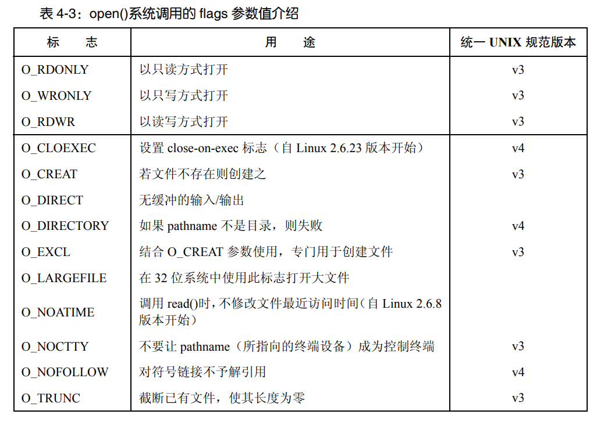

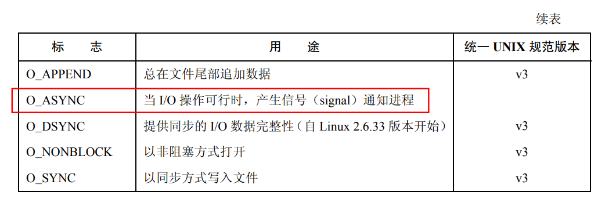

### 读取文件内容：read()

```c
#include <unistd.h>
ssize_t read(int fd,void *buffer,size_t count);
```

read()系统调用从文件描述符 fd 所指代的打开文件中读取数据。

count 参数指定最多能读取的字节数。（size_t 数据类型属于无符号整数类型。）

buffer 参数 提供用来存放输入数据的内存缓冲区地址。缓冲区至少应有 count 个字节。

### 数据写入文件：write()

```c
#include <unistd.h>
ssize_t write(int fd,void *buffer,size_t count);
```

write()系统调用将数据写入一个已打开的文件中。

buffer 参数为要写入文件中数据的内存地址，

count 参数为欲从 buffer 写入文件的数据字节数，

fd 参数为一文件描述符，指代数据要写入的文件

### 关闭文件：close()

```c
#include <unistd.h>
int close(int fd);
```

close()系统调用关闭一个打开的文件描述符，并将其释放回调用进程，供该进程继续使用。

### 改变文件偏移量：lseek()

```c
#include <unistd.h>
off_t lseek(int fd,off_t offset,int whence);
```

lseek()系统调用依照 offset 和 whence 参数值调整该文件的偏移量。

offset 参数指定了一个以字节为单位的数值。

whence 参数则表明应参照哪个基点来解释 offset 参数，应为下列其中之一：

-  SEEK_SET  将文件偏移量设置为从文件头部起始点开始的 offset 个字节。 
- SEEK_CUR  相对于当前文件偏移量，将文件偏移量调整 offset 个字节。 
- SEEK_END  将文件偏移量设置为起始于文件尾部的 offset 个字节。也就是说，offset 参数应该从文件 最后一个字节之后的下一个字节算起。

### 文件空洞

从文件结尾后到新写入数据间的这段空间被称为文件空洞。从编程角度看，文件空洞中是存在字节的，读取空洞将返回以 0（空字节）填充的缓冲区。

> 程序清单 4-3：read()、write()和 lseek()的使用示范 fileio/seek_io.c

### 非通用I/O模型：ioctl()

```c
#Include <sys/ioctl.h>
int ioctl(int fd,int request,...);
```

## Chapter5 深入探究文件I/O

### 原子操作和竞争

原子操作：内核保证了某系统调用中的所有步骤会作为独立操作而一次性加以执行，其间不会为其他进程或线程所中断。

在open()的时候可以使用O_CREAT和O_EXCL标志一次性调用，确保检查文件和创建文件的步骤属于一个原子操作。

在write()的时候，打开文件时加入O_APPEND标志，保证文件偏移量的移动与数据写操作纳入同一原子操作。

竞争状态：：操作共享资源的两个进程（或线程），其 结果取决于一个无法预期的顺序，即这些进程1 获得 CPU 使用权的先后相对顺序。

> 程序清单 5-1：试图以独占方式打开文件的错误代码 fileio/bad_exclusive_open.c

### 文件控制操作：fcntl()

```c
#include <fcntl.h>
int fcntl(int fd,int cmd,...);
```

fcntl()系统调用对一个打开的文件描述符执行一系列控制操作。cmd在后续章节中。

### 打开文件的状态标志

fcntl()用途

- 就是针对一个打开的文件，获取或修改其访问模式和状态标志。此时cmd参数为F_GETFL。

- 复制文件描述符，F_DUPFD操作

    `newfd = fcntl(oldfd,F_DUPFD,startfd);`

    该调用为 oldfd 创建一个副本，且将使用大于等于 startfd 的最小未用值作为描述符编号。 该调用还能保证新描述符（newfd）编号落在特定的区间范围内。

O_ACCMODE为0003，用于与flag相与获取访问模式。O_RDONLY(0)、O_WRONLY(1)和 O_RDWR(2)

```c
/* 修改一个文件的状态标志，添加O_APPEND标志 */

int flags;
/* 使用F_GETFL获取标志的副本 */
flags = fcntl(fd,F_GETFL);
if(flags == -1)
    errExit("fcntl");
/* 修改变更的比特位 */
flags |= O_APPEND;
/* 使用F_SETFL更新状态标志 */
if(fcntl(fd,F_SETFL,flags) == -1)
    errExit("fcntl");
```

### 文件描述符和打开文件之间的关系

内核维护的3个数据结构

1. 进程级的文件描述符表
    - 控制文件描述符操作的一组标志
    - 对打开文件句柄的引用
2. 系统级的打开文件表
    - 当前文件偏移量（调用 read()和 write()时更新，或使用 lseek()直接修改）
    - 打开文件时所使用的状态标志（即，open()的 flags 参数）
    - 文件访问模式（如调用 open()时所设置的只读模式、只写模式或读写模式）
    - 与信号驱动 I/O 相关的设置
    - 对该文件 i-node 对象的引用
3. 文件系统的 i-node 表
    - 文件类型（例如，常规文件、套接字或 FIFO）和访问权限
    - 一个指针，指向该文件所持有的锁的列表
    - 文件的各种属性，包括文件大小以及与不同类型操作相关的时间戳

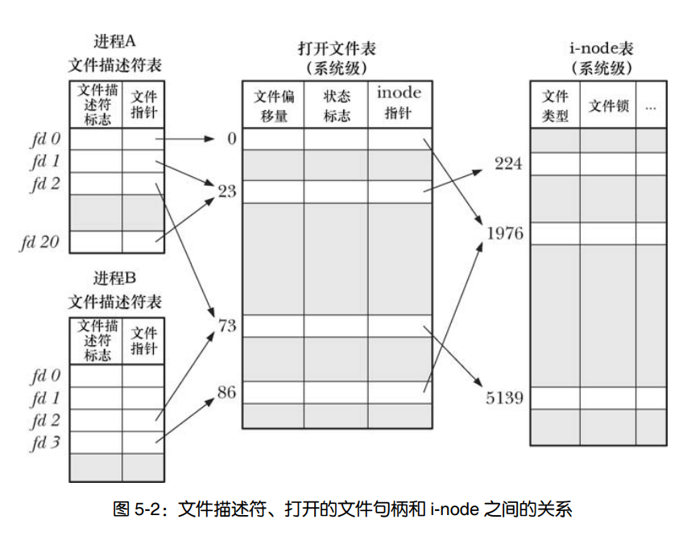

### 复制文件描述符dup/dup2

#### dup

```c
#include <unistd.h>
int dup(int oldfd);
```

dup()调用复制一个打开的文件描述符 oldfd，并返回一个新描述符，二者都指向同一打开 的文件句柄。系统会保证新描述符一定是编号值最低的未用文件描述符。

如果复制文件描述符1，希望返回文件描述符2，可以使用以下操作

```c
close(2);
newfd = dup(1);
```

#### dup2

```c
#include <unistd.h>
int dup2(int oldfd,int newfd);
```

dup2()系统调用会为 oldfd 参数所指定的文件描述符创建副本，其编号由 newfd 参数指定。 如果由 newfd 参数所指定编号的文件描述符之前已经打开，那么 dup2()会首先将其关闭。（dup2() 调用会默然忽略 newfd 关闭期间出现的任何错误。故此，编码时更为安全的做法是：在调用 dup2()之前，若 newfd已经打开，则应显式调用 close()将其关闭。

#### dup3（Linux特有）

```c
#define _GUN_SOURCE
#include <unistd.h>
int dup3(int oldfd,int newfd,int flags);
```

dup3()系统调用完成的工作与 dup2()相同，只是新增了一个附加参数 flag，这是一个可以 修改系统调用行为的位掩码。目前，dup3()只支持一个标志 O_CLOEXEC

### 在文件特定偏移量处的I/O：pread()和pwrite()

```c
#include <unistd.h>
ssize_t pread(int fd,void *buf,size_t count,off_t offset);
ssize_t pwrite(int fd,const void *buf,size_t count,off_t offset);
```

这两个系统调用只会在offset指定的位置进行I/O操作，不会改变当前文件的偏移量。常用于多线程编程。

### 分散输入和集中输出：readv()和writev()

```c
#include <sys/uio.h>
ssize_t readv(int fd,const struct iovec *iov,int iovcnt);
ssize_t writev(int fd,const struct iovec *iov,int iovcnt);
```

这些系统调用并非只对单个缓冲区进行读写操作，而是一次即可传输多个缓冲区的数据。 数组 iov 定义了一组用来传输数据的缓冲区。整型数 iovcnt 则指定了 iov 的成员个数。iov 中的每个成员都是如下形式的数据结构。

```c
struct iovec{
	void *iov_base;	/* Start address of buffer */
	size_t iov_len; /* Number of bytes to transfer to/from buffer */
}
```

> 程序清单 5-2：使用 readv()执行分散输入 fileio/t_readv.c

#### 在指定位置分散输入/集中输出

```c
#define _BSD_SOURCE
#include <sys/uio.h>
ssize_t preadv(int fd,const struct iovec *iov,int iovcnt,off_t offset);
ssize_t pwritev(int fd,const struct iovec *iov,int iovcnt,off_t offset);
```

上述两种系统调用的结合

### 截断文件：truncate()和ftruncate()

```c
#include <unistd.h>
int truncate(const cahr *pathname,off_t length);
int ftruncate(int fd,off_t length);
```

truncate()和 ftruncate()系统调用将文件大小设置为 length 参数指定的值。

truncate()指定路径，ftruncate()指定文件描述符。

> truncate()无需先以 open()（或是一些其他方法）来获取文件描述符，却可修改文件内容， 在系统调用中可谓独树一帜。

### 非阻塞I/O

打开文件时指定O_NONBLOCK标志

- 若 open()调用未能立即打开文件，则返回错误，而非陷入阻塞。
- 调用 open()成功后，后续的 I/O 操作也是非阻塞的。

管道、FIFO、套接字、设备（比如终端、伪终端）都支持非阻塞模式。（因为无法通过 open() 来获取管道和套字的文件描述符，所以要启用非阻塞标志，就必须使用fcntl()的 F_SETFL 命令。）

### 大文件I/O

文件偏移量的数据类型off_t是一个有符号的长整型。在32位体系架构中，该长度不超过2^31^-1个字节（2GB）。

所以需要使用LFS拓展，应用程序可以使用如下两种方式之一获得LFS功能：

- 使用支持大文件操作的备选 API。（过渡型拓展）

- 在编译应用程序时，将宏_FILE_OFFSET_BITS 的值定义为 64。（推荐使用）

#### 过渡型LFS API

在编译时定义_LARGEFILE64_SOURCE测试宏，可以通过命令行指定。

函数命名发生变化，包括：fopen64()、open64()、lseek64()、truncate64()、stat64()、mmap64()、setrlimit64()

新数据类型：

- struct stat64：类似于stat，支持大文件尺寸
- off64_t：64位类型，用于表示文件偏移量

> 程序清单 5-3：访问大文件 fileio/large_file.c

#### _FILE_OFFSET_BITS宏

1. 命令行编译时增加选项，例如`$ cc -D_FILE_OFFSET_BITS=64 prog.c`

2. 在所有头文件之前添加宏定义，#define _FILE_OFFSET_BITS 64

#### printf()传递off_t值

将off_t强制转换到long long类型，printf()使用%lld限定符。

### /dev/fd 目录

每个进程都会有个一个虚拟目录，其中包含“/dev/fd/n”形式的文件名，n就是文件描述符的编号。

符号链接： /dev/stdin /dev/stdout /dev/stderr 对应标准输入、标准输出、标准错误

### 创建临时文件

#### mkstemp()

```c
#include <stdlib.h>
int mkstemp(char *template);
```

模板参数采用路径名形式，其中最后 6 个字符必须为 XXXXXX。这 6 个字符将被替换，
以保证文件名的唯一性，且修改后的字符串将通过 template 参数传回。因为会对传入的 template
参数进行修改，所以必须将其指定为字符数组，而非字符串常量。

```c
char template[] = "/tmp/somestringXXXXXX";
fd = mkstemp(template);
if(fd == -1)
    prinf("mkstemp\n");
printf("Generated filename was: %s\n",template);
unlink(template); //删除临时文件
```

#### tmpfile()

```c
#include <stdio.h>
FILE *tmpfile(void);
```

tmpfile()函数会创建一个名称唯一的临时文件，并以读写方式将其打开。（打开该文件时 使用了 O_EXCL 标志，以防一个可能性极小的冲突，即另一个进程已经创建了一个同名文件。

tmpfile()函数执行成功，将返回一个文件流供 stdio 库函数使用。文件流关闭后将自动删除临时文件。为达到这一目的，tmpfile()函数会在打开文件后，从内部立即调用 unlink()来删除该文件名 。

## Chapter6 进程

### 进程和程序

进程（process）是一个可执行程序（program）的实例。程序是包含了一系列信息的文件，这些信息描述了如何在运行时创建一个进程。

### 进程号与父进程号

```c
#include <unistd.h>
pid_t getpid(void);
```

返回调用进程的进程号。进程号超过32767，会重置为300，低数值的进程号为系统进程和守护进程。

```c
#include <unistd.h>
pid_t getppid(void);
```

返回父进程的进程号。1 号进程—init 进程，即所有进程的始祖。

### 进程内存布局

1. 文本段，机器语言指令，只读

2. 数据段，显式初始化的全局变量和静态变量

3. BSS段，未初始化的全局变量和静态变量

4. 栈，系统分配

5. 堆，手动申请释放。堆顶端称作program break

> 程序清单 6-1：程序变量在进程内存各段中的位置 proc/mem_segments.c

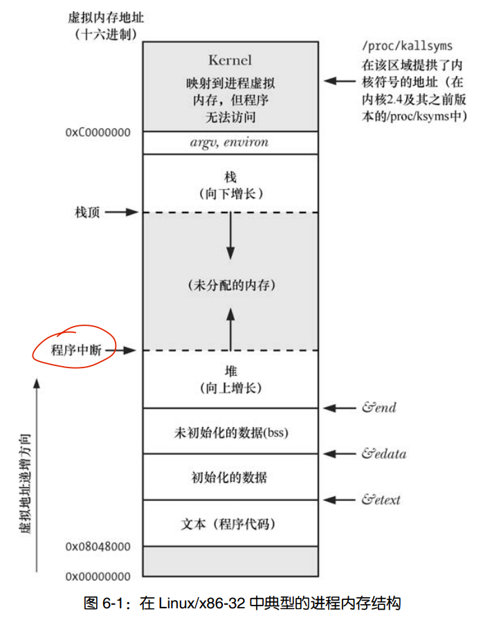

### 虚拟内存管理

虚拟内存技术：

- 空间局部性：是指程序倾向于访问在最近访问过的内存地址附近的内存
- 时间局部性：是指程序倾向于在不久的将来再次访问最近刚访问过的内存地址

虚拟内存的规划之一是将每个程序使用的内存切割成小型的、固定大小的“页”（page） 单元。相应地，将 RAM 划分成一系列与虚存页尺寸相同的页帧。任一时刻，每个程序仅有部分页需要驻留在物理内存页帧中。这些页构成了所谓驻留集（resident set）。程序未使用的页 拷贝保存在交换区（swap area）内—这是磁盘空间中的保留区域，作为计算机 RAM 的补充—  仅在需要时才会载入物理内存。若进程欲访问的页面目前并未驻留在物理内存中，将会发生页面错误（page fault），内核即刻挂起进程的执行，同时从磁盘中将该页面载入内存。

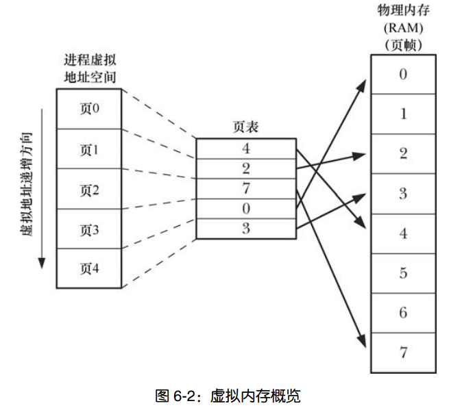

x86-32中，页面大小为4096个字节。

进程的有效虚拟地址范围在其生命周期中可以发生变化。

虚拟内存的优点；

- 进程与进程、进程与内核相互隔离，所以一个进程不能读取或修改另一进程或内核的内存。
- 适当情况下，两个或者更多进程能够共享内存。
- 便于实现内存保护机制。
- 程序员和编译器、链接器之类的工具无需关注程序在 RAM 中的物理布局。
- 因为需要驻留在内存中的仅是程序的一部分，所以程序的加载和运行都很快。
- 每个进程使用的 RAM 减少了，RAM 中同时可以容纳的进程数量就增多了。

### 栈和栈帧

栈驻留在内存的高端并向下增长，栈指针（stack pointer），用于跟踪当前栈顶。每次调用函数时，会在栈上新分配一帧，每当函数返回时，再从栈上将此帧移去。

每个（用户）栈帧包括以下信息：

- 函数实参和局部变量
- （函数）调用的链接信息

### 命令行参数（argc，argv）

int argc 命令行参数的个数

char *argv[ ] 指向命令行参数的指针数组，argv[argc]为 NULL

> 程序清单 6-2：回显命令行参数 proc/necho.c

### 环境列表

环境列表中每个字符串都以名称=值（name=value）形式定义。

新进程在创建之时，会继承其父进程的环境副本。这是一种原始的进程间通信方式，却颇为常用。（单向，一次性）

setenv设置环境变量，unset撤销环境变量，printenv显示当前环境变量

#### 从程序中访问环境

在 C 语言程序中，可以使用全局变量 char **environ 访问环境列表。

> 程序清单 6-3：显示进程环境 proc/display_env.c

另外，还可以通过声明 main()函数中的第三个参数来访问环境列表：

`int main(int argc,char *argv[],char *envp[])`

要避免使用，因为除了局限于作用域限制外， 该特性也不在 SUSv3 的规范之列。

```c
#include <stdlib.h>
char *getenv(const char *name);
```

向 getenv()函数提供环境变量名称，该函数将返回相应字符串指针。如果不存在指 定名称的环境变量，那么 getenv()函数将返回 NULL。

#### 修改环境

```c
#include <stdlib.h>
int putenv(char *string);
```

putenv()函数向调用进程的环境中添加一个新变量，或者修改一个已经存在的变量值。

putenv()调用失败返回非0值，而不是-1

```c
#include <stdlib.h>
int setenv(const char *name,const char *value,int overwrite);
```

name和value对应环境变量左右，setenv()会添加等号。

overwrite 为非0值，强制改变环境。如果环境中存在name标识的变量，且overwrite值为0，则不改变环境。

```c
#include <stdlib.h>
int unsetenv(const char *name);
```

unsetenv()函数从环境中移除由 name 参数标识的变量。

```c
#define _BSD_SOURCE		/* Or: #define _SVID_SOURCE */
#include <stdlib.h>
int clearenv(void);
```

清除整个环境。

> 程序清单 6-4：修改进程环境  proc/modify_env.c

### 非局部跳转：setjmp()和longjmp()

这两个函数可以实现跨函数的跳转。C 语言的 goto 语句存在一个限制，即不能从当前函数跳转到另一函数。

```c
#include <setjmp.h>
int setjmp(jmp_buf env);
void longjmp(jmp_buf env,int val);
```

初始调用返回值为 0，后续“伪”返回的返回值为 longjmp()调用中 val 参数所指定的任意值。

> 程序清单 6-5：展示函数 setjmp()和 longjmp()的用法 proc/longjmp.c

#### 优化编译器的问题

一般包含指针变量和 char、int、float、long 等任何简单类型的变量会受到longjmp()的干扰，将变量声明为 volatile，是告诉优化器不要对其进行优化，从而避免了代码重组。最好将所有局部变量都声明为volatile

> 程序清单 6-6：编译器的优化和 longjmp()函数相互作用的示例  proc/setjmp_vars.c

#### 尽可能避免使用 setjmp()函数和 longjmp()函数

## Chapter7 内存分配

### 在堆上分配内存

堆是一段长度可变的连续虚拟内存，通常将堆的当前内存边界称为“program break”堆顶

### 调整堆顶：brk()和sbrk()

```c
#include <unistd.h>
int brk(void *end_data_segment);
void *sbrk(intptr_t increment);		//sbrk是在brk基础上实现的一个库函数
```

系统调用 brk()会将 program break 设置为参数 end_data_segment 所指定的位置。不足一页会到下一个内存页的边界处。

调用 sbrk()将 program break 在原有地址上增加从参数 increment 传入的大小。sbrk()返回前一个 program break 的地址，指向这块新分配内存起始位置的指针。调用 sbrk(0)将返回 program break 的当前位置，追踪堆的大小。

### 在堆上分配内存：malloc()和free()

```c
#include <stdlib.h>
void *malloc(size_t size);
void free(void *ptr);
```

malloc( )函数在堆上分配参数 size 字节大小的内存（字节对齐），并返回指向新分配内存起始位置处的指针，其所分配的内存未经初始化。由于 malloc()的返回类型为 void*，因而可以将其赋给任意类型的 C 指针。

free()函数释放 ptr 参数所指向的内存块，并不降低 program break 的位置，而是将这块内存填加到空闲内存列表 中，供后续的 malloc()函数循环使用。

> 程序清单 7-1：示范释放内存时 program break 的行为 memalloc/free_and_sbrk.c

### 在堆上分配内存的其他方法

#### 使用calloc()和realloc()分配

```c
#include <stdlib.h>
void *calloc(size_t numitems,size_t size);
```

参数 mumitems 指定分配对象的数量，size 指定每个对象的大小。calloc()会将已分配的内存初始化为 0。

```c
#include <stdlib.h>
void *realloc(void *ptr,size_t size);
```

调整一块内存的大小，返回的位置可能不同。

若原内存块位于堆的顶部，将对堆空间进行拓展；若原内存在堆的中部，且紧邻其后的空闲内存空间大小不足，realloc()会分配一块新内存，并将原有数据复制到新内存块中。最后这种情况最为常见，还会占用大量 CPU 资源。一般情况下，应尽量避免调用 realloc()。

#### 分配对齐内存

```c
#include <malloc.h>
void *memalign(size_t boundary,size_t size);
```

函数 memalign()分配 size 个字节的内存，起始地址是参数 boundary 的整数倍，而 boundary 必须是 2 的整数次幂。函数返回已分配内存的地址。

```c
#include <stdlib.h>
int posix_memalign(void **memptr,size_t alignment,size_t size);
```

已分配的内存地址通过参数 memptr 返回。内存与 alignment 参数的整数倍对齐 ，alignment 必须是 sizeof（void*）（在大多数硬件架构上是 4 或 8 个字节）与 2 的整数次幂两者间的乘积。

### 在堆栈上分配内存：alloca()

```c
#include <alloca.h>
void *alloca(size_t size);
```

通过增加栈帧的大小从堆栈上分配。不需要使用free()来释放内存。也不可能调用 realloc()来调整由 alloca()分配的内存大小。

## Chapter8 用户与组

### 密码文件：/etc/passwd

bcl：x:1000:1000:bcl,,,:/home/bcl:/bin/bash

登录名 加密的密码：x 用户ID 组ID 注释 主目录 登录shell

### shadow密码文件：/etc/shadow

加密处理的密码则由 shadow 密码文件单独维护，仅供具有特权的程序读取。

### 组文件： /etc/group

users :x：100:

组名 加密过的密码 组ID 用户列表

### 获取用户和组的信息

#### 从密码文件获取记录

```c
#include <pwd.h>
struct passwd *getpwnam(const char *name);
struct passwd *getwuid(uid_t uid);
```

提供name，返回指针。

两者都不可重入。

> [C语言函数重入_c语言可重入函数有哪些_hNicholas的博客-CSDN博客](https://blog.csdn.net/zhongbeida_xue/article/details/81355641)

#### 从组文件获取记录

```c
#include <grp.h>
struct group *getgrnam(const char *name);
struct group *getgrgid(gid_t gid);
```

函数 getgrnam()和 getgrgid()分别通过组名和组 ID 来查找属组信息。

> 程序清单 8-1：在用户名/组名和用户 ID/组 ID 之间互相转换的函数 users_groups/ugid_functions.c

#### 扫描密码文件和组文件中的所有记录

```c
#include <pwd.h>
struct passwd *getwent(void);
void setpwent(void);
void endpwent(void);
```

函数 getpwent()能够从密码文件中逐条返回记录。

当密码文件处理完毕后，可调用 endpwent()将其关闭。

调用 setpwent()函数重返文件起始处。

#### 从 shadow 密码文件中获取记录

```c
#include <shadow.h>
struct spwd *getspnam(const char *name);
struct spwd *getspent(void);

void setspent(void);
void endspent(void);
```

下列函数的作用包括从 shadow 密码文件中获取个别记录，以及扫描该文件中的所有记录。

### 密码加密和用户认证

```c
#define _XOPEN_SOURCE
#include <unistd.h>
char *crypt(const char *key,const char *salt);
```

crypt()算法会接受一个最长可达 8 字符的密钥（即密码），并施之以数据加密算法（DES） 的一种变体。salt 参数指向一个两字符的字符串，用来扰动（改变）DES 算法，设计该技术， 意在使得经过加密的密码更加难以破解。该函数会返回一个指针，指向长度为 13 个字符的字符串，该字符串为静态分配而成，内容即为经过加密处理的密码。

==要想在 Linux 中使用 crypt()==，加入crypt.h文件，在编译程序时需在末尾添加–lcrypt 选项，以链接 crypt 库。

```c
#define _BSD_SOURCE
#include <unistd.h>
char *getpass(const char *prompt);
```

读取用户密码。该函数会打印出 prompt 所指向的字符串，读取一行输入，返回以 NULL 结尾的输入字符串（剥离尾部的换行符）作为函数结果。

> 程序清单 8-2：根据 shadow 密码文件验证用户 users_groups/check_password.c

```c
char *fgets(char *s,int size,FILE *stream);
```

s 代表要保存到的内存空间的首地址，可以是字符数组名，也可以是指向字符数组的字符指针变量名。size 代表的是读取字符串的长度。stream 表示从何种流中读取，可以是标准输入流 stdin，也可以是文件流。

获取Linux的root权限：

1. 在终端输入sudo passwd root，输入登录密码
2. 接着输入su，在输入一次密码获取root权限

## Chapter9 进程凭证

### 实际用户ID和实际组ID

实际用户ID为/etc/passwd文件中对应记录的第三字段

实际组ID为/etc/passwd文件中对应记录的第四字段

### 有效用户ID和有效组ID

用于确定授予进程的权限，有效用户ID为0（root的用户ID）的进程拥有超级用户的所有权限。

通常，有效用户ID及组ID与其对应的实际ID相等。有办法使两者不相同。

### Set-User-ID 和Set-Group-ID程序

设置了 set-user-ID 权限位，那么当运行该程序时，进程会取得超级用户权限

访问受保护的文件：创建一个具有对该文件访问权限的专用用户（组）ID，然后再创建一个 set-user-ID （set-group-ID）程序，将进程有效用户（组）ID 变更为这个专用 ID。这样，无需拥有超级用户的所有权限，程序就能访问该文件。

> 将8-2的程序设置为任意用户可以执行，设置为set-user-ID-root程序
>
> chown root check_password
>
> chmod u+s check_password
>
> ls -l check_password

### 保存Set-User-ID 和Set-Group-ID程序

举例说明上述操作的效果，假设某进程的实际用户 ID、有效用户 ID 和保存 set-user-ID 均 为 1000，当其执行了 root 用户（用户 ID 为 0）拥有的 set-user-ID 程序后，进程的用户 ID 将 发生如下变化：

real =1000,effective= 0,saved =0

### 文件系统用户ID和组ID

历史遗留问题，文件系统用户 ID 和组 ID 的值等同于相应的有效用户 ID 和组 ID。

### 辅助组ID

辅助组 ID 用于标识进程所属的若干附加的组。

### 获取和修改实际、有效和保存设置标识

#### 获取实际和有效ID

```c
#include <unistd.h>
uid_t getuid(void);
uid_t geteuid(void);
gid_t getgid(void);
gid_t getegid(void);
```

获取进程的有效ID。

#### 修改有效ID

```c
#include <unistd.h>
int setuid(uid_t uid);
int setgid(gid_t gid);
```

规则：

1. 当非特权进程调用 setuid()时，仅能修改进程的有效用户 ID。
2. 当特权进程以一个非 0 参数调用 setuid()时，其实际用户 ID、有效用户 ID 和保存 set-user-ID 均被置为 uid 参数所指定的值。（会失去特权，无法恢复）

```c
#include <unistd.h>
int seteuid(uid_t uid);
int setegid(gid_t gid);
```

跟上面类似，但是可以对特权收放自如

#### 修改实际ID和有效ID

```c
#include <unistd.h>
int setreuid(uid_t ruid,uid_t euid);
int setregid(gid_t rgid,gid_t egid);
```

这两个系统调用的第一个参数都是新的实际 ID，第二个参数都是新的有效 ID。若只想修 改其中的一个 ID，可以将另外一个参数指定为−1。

永久放弃特权的方法：`setreuid(getuid(),getuid())`

#### 获取实际、有效和保存设置ID

```c
#define _GNU_SOURCE
#include <unistd.h>
int getresuid(uid_t *ruid,uid_t *euid,uid_t *suid);
int getresgid(gid_t *rgid,git_t *egid,gid_t *sgid);
```

getresuid()系统调用将调用进程的当前实际用户 ID、有效用户 ID 和保存 set-user-ID 值返
回至给定 3 个参数所指定的位置。

#### 修改实际、有效和保存设置ID

```c
#define _GNU_SOURCE
#include <unistd.h>
int setresuid(uid_t ruid,uid_t euid,uid_t suid);
int setresgid(gid_t rgid,git_t egid,gid_t sgid);
```

无意修改的参数指定为-1

### 获取和修改文件系统ID

Linux 特有

```c
#include <sys/fsuid.h>
int setfsuid(uid_t fsuid);
int setfsgid(gid_t fsguid);
```

setfsuid()系统调用将进程文件系统用户 ID 修改为参数 fsuid 所指定的值。setfsgid()系统调用将文件系统组 ID 修改为参数 fsgid 所指定的值。

### 获取和修改辅助组ID

```c
#include <unistd.h>
int getgroups(int gidsetsize,gid_t grouplist[]);
```

getgroups()系统调用会将当前进程所属组的集合返回至由参数 grouplist 指向的数组中。

```c
#define _BSD_SOURCE
#include <grp.h>
int setgroups(size_t gidsetsize,const gid_t *grouplist);
int initgroups(const char *user,gid_t group);
```

特权进程能够使用这两个函数修改辅助组ID集合。

setgroups()系统调用用 grouplist 数组所指定的集合来替换调用进程的辅助组 ID。参数 gidsetsize 指定了置于参数 grouplist 数组中的组 ID 数量。

initgroups()函数将扫描/etc/groups 文件，为 user 创建属组列表，以此来初始化调用进程的辅助组 ID。另外，也会将参数 group 指定的组 ID 追加到进程辅助组 ID 的集合中。

### 修改进程凭证的系统调用总结

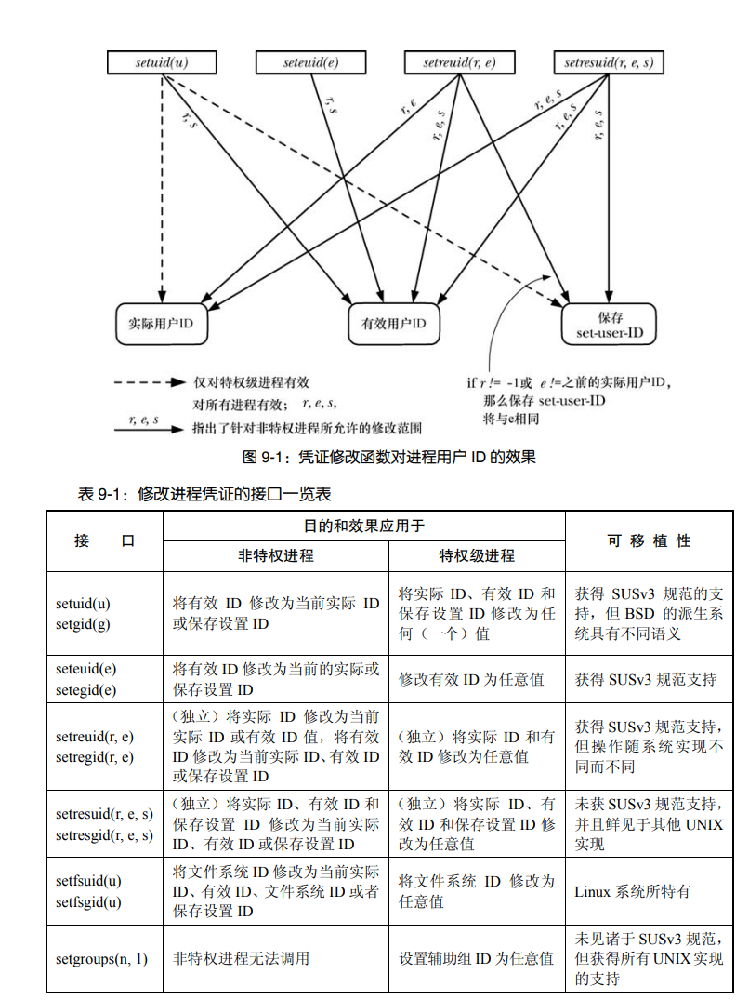

> 程序清单 9-1：显示进程的所有用户 ID 和组 ID proccred/idshow.c

## Chapter10 时间

### 日历时间

内部对时间的表达方式为从Epoch以来的秒数来度量。从格林威治标准时间1970 年 1 月 1 日早晨零点开始。存储在类型为time_t的变量中。

```c
#include <sys/time.h>
int gettimeofday(struct timeval *tv,struct timezone *tz);
```

tv为一个指针

```c
struct timeval{
	time_t 		tv_Sec;		/* Seconds since 00:00:00 ,1 Jan 1970 UTC */
	suseconds_t tv_usec;	/* Addtional microseconds (long int) */
}
```

tz已遭废弃，应始终置为NULL

```c
#include <time.h>
time_t time(time_t *timep);
```

time()系统调用返回自 Epoch 以来的秒数。如果 timep 参数不为 NULL，那么还会将自 Epoch 以来的秒数置于 timep 所指向的位置。

往往采用下面的调用，`t = time(NULL);`

### 时间转换函数

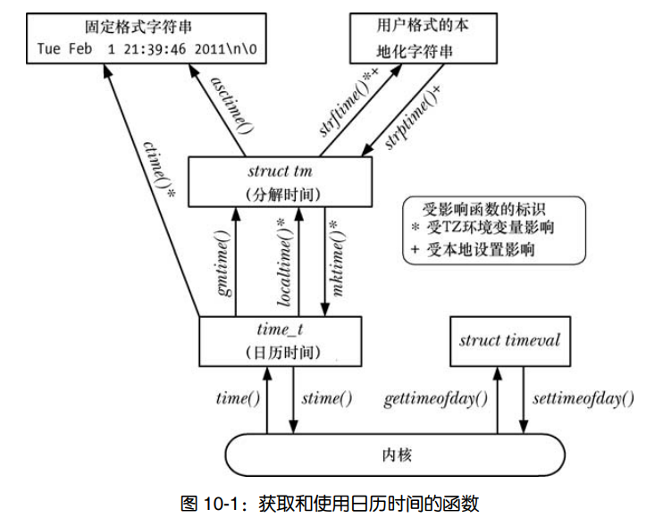

#### 将time_t转换为可打印格式

```c
#include <time.h>
char *ctime(const time_T *timep);
```

把一个指向 time_t 的指针作为 timep 参数传入函数 ctime()，将返回一个长达 26 字节的字符串，内含标准格式的日期和时间。

> ctime_r()是ctime()的可重入版本，需要额外指定一个指针参数，用于返回时间字符串。

#### time_t和分解时间之间的转换

```c
#include <time.h>
struct tm *gmtime(const time_t *timep);
struct tm *localtime(const time_t *timep);
```

函数 gmtime()和 localtime()可将一 time_t 值转换为一个所谓的分解时间。

gmtime()转换为对应于UTC的分解时间；localtime(）转换为系统本地时间的分解时间。

```c
#include <time.h>
time_t mktime(struct tm *timeptr);
```

函数 mktime() 将一个本地时区的分解时间翻译为 time_t 值，并将其作为函数结果返回。

mktime()在进行转换时会对时区进行设置。此外，DST 设置的使用与否取决于输入字段 tm_isdst 的值。 

- 若 tm_isdst 为 0，则将这一时间视为标准间（即，忽略夏令时，即使实际上每年的这 一时刻处于夏令时阶段）。 
- 若 tm_isdst 大于 0，则将这一时间视为夏令时（即，夏令时生效，即使每年的此时不 处于夏令时阶段）。 
- 若 tm_isdst 小于 0，则试图判定 DTS 在每年的这一时间是否生效。这往往是众望所归的设置。

#### 分解时间和打印时间的转换

```c
#include <time.h>
char *asctime(const struct tm *limeptr);
```

在参数 tm 中提供一个指向分解时间结构的指针，asctime()则会返回一指针，指向经由静态分配的字符串，内含时间，格式则与 ctime ()相同。

> 程序清单 10-1：获取和转换日历时间 time/calendar_time.c

```c
#include <time.h>
size_t strftime(char *outstr,size_t maxsize,const char *format,const struct tm *timeptr);
```

outstr 中返回的字符串按照 format 参数定义的格式做了格式化。Maxsize 参数指定 outstr 的最大长度。strftime()的 format 参数是一字符串，与赋予 printf()的参数相类似。strftime()返回 outstr 所指缓冲区的字节长度，且不包括终止空字节。

> 程序清单 10-2：返回当前时间的字符串的函数 curr_time.c

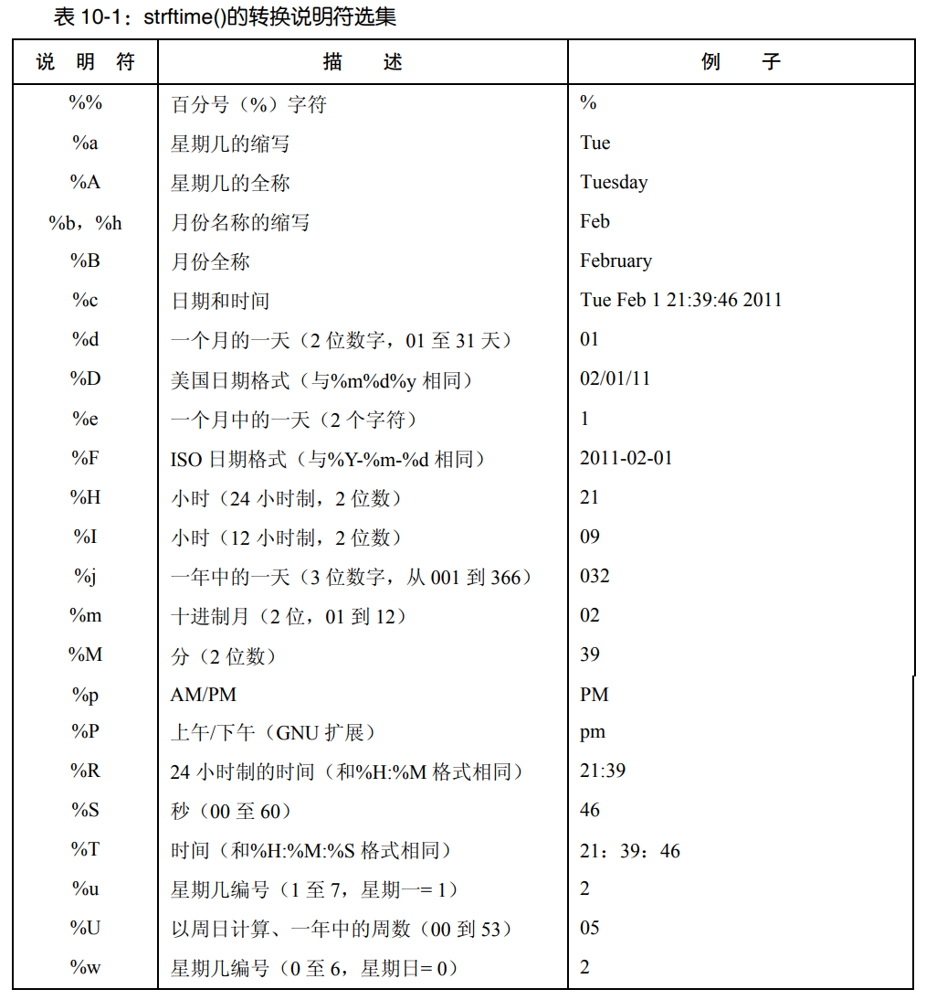

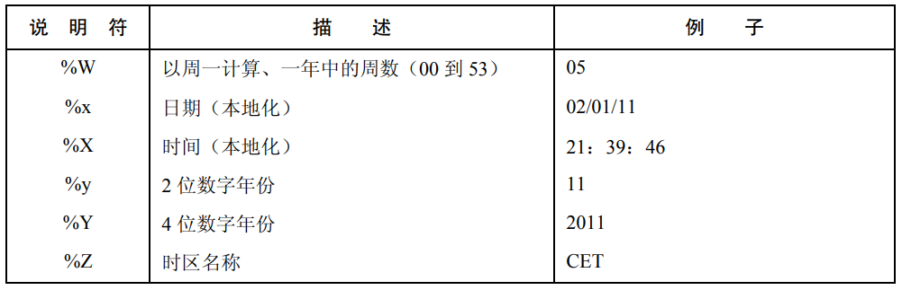

```c
#define _XOPEN_SOURCE
#include <time.h>
char *strptime(const char *str,const char *format,struct tm *timeptr);
```

函数strptime()按照参数format内的格式要求，对由日期和时间组成的字符串str加以解析， 并将转换后的分解时间置于指针 timeptr 所指向的结构体中。如果成功，strptime()返回一指针，指向 str 中下一个未经处理的字符。出错为NULL

> 程序清单 10-3：获取和转换日历时间 time/strtime.c

### 时区

#### 时区定义

在目录/usr/share/zoneinfo中，每个文件都包含一个特定国家或地区的相关信息

系统的本地时间由时区文件/etc/localtime 定义

#### 为程序指定时区

TZ环境变量设置为由一冒号(:)和时区名称组成的字符串。设置时区会自动影响到函数 ctime()、 localtime()、mktime()和 strftime()。上述函数都会调用 tzset(3)，对3个全局变量进行初始化。

> 程序清单 10-4：演示时区和地区的效果 time/show_time.c

### 地区

#### 地区定义

地区信息维护于/usr/share/local之下的目录

命名约定为 language[_territory[.codeeset]] [@modifier]，例如de_DE.utf-8@euro

命令locale -a将列出系统上定义的整套地区

#### 为程序设置地区

```c
#include <locale.h>
char *setlocale(int category,const char *locale);
```

函数 setlocale()既可设置也可查询程序的当前地区。

category 参数选择设置或查询地区的哪一部分，更多使用LC_ALL来指定设置地区的所有部分的值

locale 参数可能是一个字符串，指定系统上已定义的一个地区如 de_DE 或 en_US，空字符串从环境变量获取设置。

如果只需要查看地区设置不改变它，可以指定locale参数为NULL。

例如setlocale(LC_ALL," ");

### 更新系统时钟

这些接口很少被应用程序使用。

```c
#define _BSD_SOURCE
#include <sys/time.h>
int settimeofday(const struct timeval *tv,const struct timezone *tz);
```

tz以及被废弃，指定为NULL

```c
#define _BSD_SOURCE
#include <sys/time.h>
int adjtime(struct timeval *delta,struct timeval *olddelta);
```

当对时间做微小调整时（几秒钟误差），通常是推荐使用库函数 adjtime()， 它将系统时钟逐步调整到正确的时间。

delta 参数指向一个 timeval 结构体，指定需要改变时间的秒和微秒数。如果这个值是正数，那么每秒系统时间都会额外拨快一点点，直到增加完所需的时间。如果 delta 值为负时，时钟以类似的方式减慢。

### 软件时钟（jiffies）

系统软件时钟，根据时钟频率不同，对应的jiffy也不同。

### 进程时间

- 用户CPU时间：在用户模式下执行所花费的时间数量，又称作虚拟时间。
- 系统CPU时间：是在内核模式中执行所花费的时间数量。内核执行系统调用的时间。

进程时间是指处理过程中所消耗的总 CPU 时间

```c
#include <sys/time.h>
clock_t times(struct tms *buf);
```

系统调用 times()，检索进程时间信息，并把结果通过 buf 指向的结构体返回。

buf指向的结构体

```c
struct tms{
	clock_t tms_utime;	/* User CPU time used by caller */
	clock_t tms_stime;	/* System CPU time used by caller */
	clock_t tms_cutime;	/* User CPu time of all (waited for) children */
	clock_T tms_cstime;	/* System CPU time of all (wait for) children */
}
```

tms 结构体的前两个字段返回调用进程到目前为止使用的用户和系统组件的 CPU 时间。 最后两个字段返回的信息是：父进程（比如，times()的调用者）执行了系统调用 wait()的所有已经终止的子进程使用的 CPU 时间。

```c
#include <time.h>
clock_t clock(void);
```

它返回一个值描述了调用进程使用的总的 CPU 时间（包括用户和系统）。

> 程序清单 10-5：获取进程 CPU 时间 time/process_time.c

## Chapter11 系统限制和选项

### 系统限制

最小值定义为<limits.h>文件中的常量，其命名则冠以字符串\_POSIX\_，而且 （通常）还包含字符串\_MAX，因此，常量命名形如_POSIX_XXX_MAX

每个限制都有一个名称，与上述最小值的名称相对应，但缺少了_POSIX_前缀。某个实现可以在文件中以该名称定义一个常量，用以表示该实现的相应限制。若已然定义， 则该限制值总是至少等同于前述最大值（即 XXX_MAX >= _POSIX_XXX_MAX）。

#### 运行时恒定值

所谓运行时恒定值是指某一限制，若已然在文件中定义，则对于实现而言固定不变。然而该值可能是不确定的（因为该值可能依赖于可用的内存空间），因而在文 件中会忽略对其定义。在这种情况下（即使在文件中已然定义了该限制），应用程序 可以使用 sysconf()来获取运行时的值。

获取消息队列优先级限制：`lim = sysconf(_SC_MQ_PRIO_MAX);`

#### 路径变量值

在限制可能因路径名而发生变化的情况下，应用程序可以使用 pathconf()或 fpathconf()来获取该值。

NAME_MAX 限制是路径名变量值的例子之一。此限制定义了在一个特定文件系统中文件名的最大长度。

获取指定路径最大文件名长度：`lim = pathconf(directory_path,_PC_NAME_MAX);`

#### 运行时可增加值

运行时可增加值是指某一限制，相对于特定实现其值固定，且运行此实现的所有系统至少都应支持这一最小值。然而，特定系统在运行时可能会增加该值，应用程序可以使用 sysconf() 来获得系统所支持的实际值。

#### 限制总结

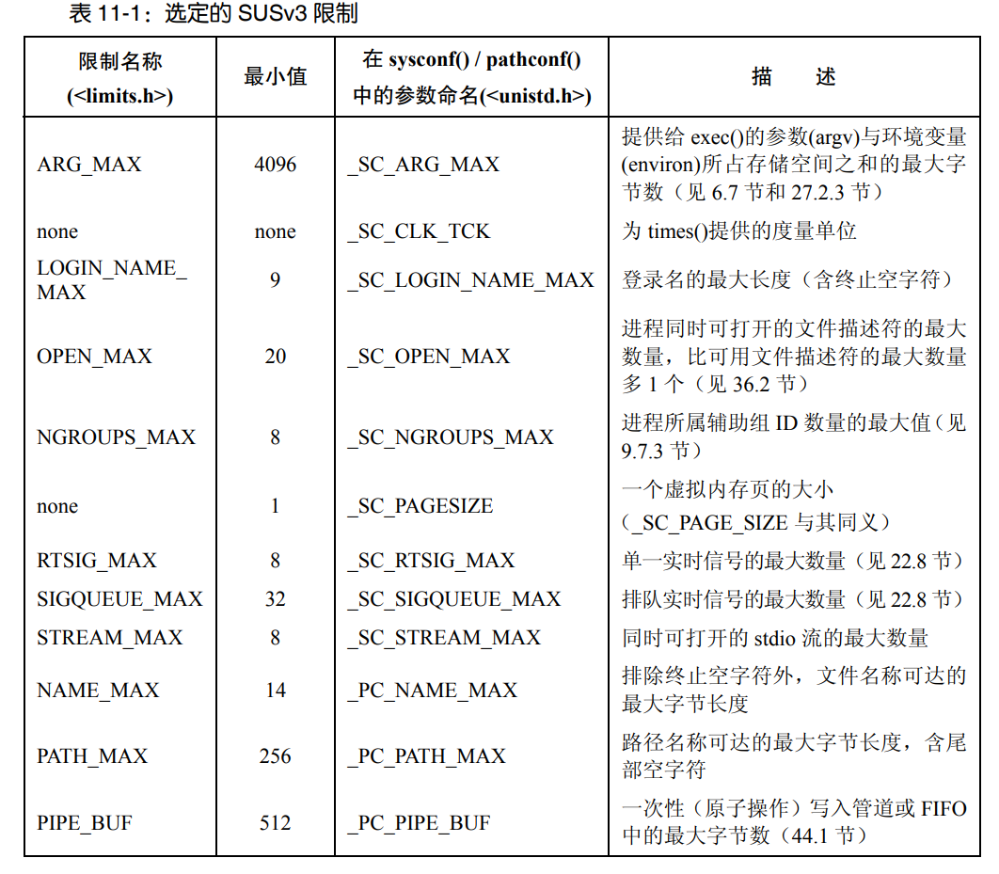

#### 在shell中获取限制：getconf

getconf variable-name [pathname]

### 在运行时获取系统限制

```c
#include <unistd.h>
long sysconf(int name);
```

参数 name 应为定义于文件中的_SC_系列常量之一，返回值为限制值。

当函数无法确定限制或者发生错误时都会返回-1，所以区分上述两种情况需要在调用函数前将errno置为0。若调用后errno不为0，则发生了错误。

> 程序清单 11-1：使用sysconf()函数 syslim/t_sysconf.c

### 运行时获取与文件相关的限制

```c
#include <unistd.h>
long pathconf(const char *pathname,int name);
long fpathconf(int fd,int name);
```

pathconf()和 fpathconf()之间唯一的区别在于对文件或目录的指定方式。pathconf()采用路径名方式来指定，而 fpathconf()则使用（之前已经打开的）文件描述符。

> 程序清单 11-2：使用 fpathconf()函数 syslim/t_fpathconf.c

## Chapter12 系统和进程信息

### /proc文件系统

许多现代 UNIX 实现提供了一个/proc 虚拟文 件系统。该文件系统驻留于/proc 目录中，包含了各种用于展示内核信息的文件，并且允许进 程通过常规文件 I/O 系统调用来方便地读取，有时还可以修改这些信息。

#### 获取与进程有关的信息：/proc/PID

在此目录中的各种文件和子目录包含了进程的相关信息。

通过查看/proc/1 目录下的文件，可以获取 init 进程的信息，该进程的 ID 总是为 1。

#### 线程：/proc/PID/task 目录

因为线程组中的一些属性对于线程而言是唯一的，所以 Linux 2.4 在/proc/PID 目录下增加了一个 task 子目录。针对进程中的每个线程，内核提供了以/proc/PID/task/TID 命名的子目录，其中 TID 是该线程的线程 ID。

#### /proc目录下的系统信息

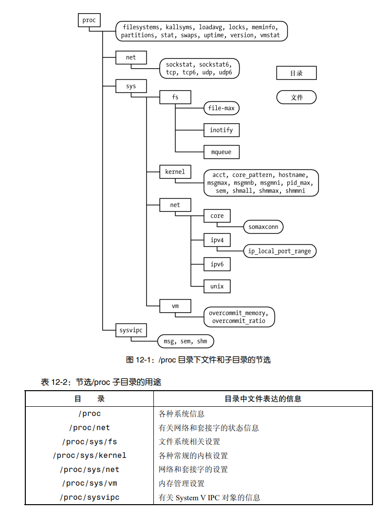

#### 访问/proc文件

shell命令

```shell
echo 100000 > /proc/sys/kernel/pid.max
cat /proc/sys/kernel/pid.max
100000
```

#### 访问/proc/PID目录中的文件

> 访问/proc/sys/kernel/pid_max 文件 sysinfo/procfs_pidmax.c

**%.*s 用途**

在printf中使用,\*表示用后面的形参替代\*的位置，实现动态格式输出。

例如：
printf("%*s", 10, s);
//意思是输出字符串s，但至少占10个位置，不足的在字符串s左边补空格，这里等同于printf("%10s", s);

### 系统标识：uname()

```c
#include <sys/utsname.h>
int uname(struct utsname *utsbuf);
```

uname()系统调用返回了一系列关于主机系统的标识信息，存储于 utsbuf 所指向的结构中。

utsbuf 参数是一个指向 utsname 结构的指针，其定义如下:

```c
struct utsname
{
    /* Name of the implementation of the operating system.  */
    char sysname[_UTSNAME_SYSNAME_LENGTH];

    /* Name of this node on the network.  */
    char nodename[_UTSNAME_NODENAME_LENGTH];

    /* Current release level of this implementation.  */
    char release[_UTSNAME_RELEASE_LENGTH];
    /* Current version level of this release.  */
    char version[_UTSNAME_VERSION_LENGTH];

    /* Name of the hardware type the system is running on.  */
    char machine[_UTSNAME_MACHINE_LENGTH];
    
    /* Name of the domain of this node on the network.  */
# ifdef __GNU_SOURCE
    char domainname[_UTSNAME_DOMAIN_LENGTH];
};
```

> 程序清单 12-1：使用 uname() sysinfo/t_uname.c

## Chapter13 文件I/O缓冲

### 文件I/O的内核缓冲

read()和write()系统调用在操作磁盘文件时不会直接发起磁盘访问，而是仅仅在用户空间 缓冲区与内核缓冲区高速缓存（kernel buffer cache）之间复制数据。

写入时，先写入缓冲区，在后续的某个时刻写入磁盘。读取时，内核会读取到内核缓冲区，直到缓冲区读取完，再将文件下一段读入缓冲区。

#### 缓冲区大小对 I/O 系统调用性能的影响

如果与文件发生大量的数据传输，通过采用大块空间缓冲数据，以及执行更少的系统调用，可以极大地提高 I/O 性能。

采用大缓冲区时的耗时绝大部 分花在了对磁盘的读取上。

若强制在数据传输到磁盘前阻塞输出操作，则调用 write()所需的时间会显著上升。

### stdio库的缓冲

当操作磁盘文件时，缓冲大块数据以减少系统调用，C 语言函数库的 I/O 函数（比如， fprintf()、fscanf()、fgets()、fputs()、fputc()、fgetc()）正是这么做的。

#### 设置一个 stdio 流的缓冲模式

```c
#include <stdio.h>
int setvbuf(FILE *stream,char *buf,int mode,size_t size);
```

setvbuf()出错返回非0值。

**参数 stream** 标识将要修改哪个文件流的缓冲。打开流后，必须在调用任何其他 stdio 函数之前先调用 setvbuf()。setvbuf()调用将影响后续在指定流上进行的所有 stdio 操作。

**参数buf**：

- 如果参数 buf 不为 NULL，那么其指向 size 大小的内存块以作为 stream 的缓冲区。因 为 stdio 库将要使用 buf 指向的缓冲区，所以应该以动态或静态在堆中为该缓冲区分配 一块空间(使用 malloc()或类似函数)，而不应是分配在栈上的函数本地变量。否则，函 数返回时将销毁其栈帧，从而导致混乱。
- 若 buf 为 NULL，那么 stdio 库会为 stream 自动分配一个缓冲区（除非选择非缓冲的 I/O，如下所述）。SUSv3 允许，但不强制要求库实现使用 size 来确定其缓冲区的大小。 glibc 实现会在该场景下忽略 size 参数。

**参数mode**：

- _IONBF 不缓冲，stdio库函数直接调用write()或者 read()。
- _IOLBF 行缓冲，对于输出流，在输出一个换行符 （除非缓冲区已经填满）前将缓冲数据。对于输入流，每次读取一行数据。
- _IOFBF 全缓冲，单次读、写数据（通过 read()或 write()系统调用）的大小与缓冲区相同。 指代磁盘的流默认采用此模式。

```c
#include <stdio.h>
void setbuf(FILE *stream,char *buf);
```

setbuf(fp,buf)调用除了不返回函数结果外，就相当于：

`setvbuf(fp,buf,(buf != NULL)?_IOFBF:_IONBF,BUFSIZ);`

要么将参数 buf 指定为 NULL 以表示无缓冲，要么指向由调用者分配的 BUFSIZ 个字节大小的缓冲区。

(BUFSIZ位于<stdio.h>中，通常数值为8192)

```c
#define _BSD_SOURCE
#include <stdio.h>
void setbuffer(FILE *stream,char *buf,size_t size);
```

对 setbuffer(fp,buf,size)的调用相当于如下调用：

`setvbuf(fp,buf,(buf != NULL)?_IOFBF:_IONBF,size);`

#### 刷新stdio缓冲区

```c
#include <stdio.h>
int fflush(FILE *stream);
```

无论当前采用何种缓冲区模式，在任何时候，都可以使用 fflush()库函数强制将 stdio 输出流中的数据（即通过 write()）刷新到内核缓冲区中。此函数会刷新指定 stream 的输出缓冲区。

若参数 stream 为 NULL，则 fflush()将刷新所有的 stdio 缓冲区。

### 控制文件I/O的内核缓冲

SUSv3 定义的第一种同步 I/O 完成类型是 synchronized I/O data integrity completion，旨在确保针对文件的一次更新传递了足够的信息（到磁盘），以便于之后对数据的获取。

Synchronized I/O file integrity completion 是 SUSv3 定义的另一种同步 I/O 完成，也是上述 synchronized I/O data integrity completion 的超集。该 I/O 完成模式的区别在于在对文件的一次 更新过程中，要将所有发生更新的文件元数据都传递到磁盘上，即使有些在后续对文件数据 的读操作中并不需要。

#### 用于控制文件 I/O 内核缓冲的系统调用

```c
#include <unistd.h>
int fsync(int fd);
```

fsync()系统调用将使缓冲数据和与打开文件描述符 fd 相关的所有元数据都刷新到磁盘 上。调用 fsync()会强制使文件处于 Synchronized I/O file integrity completion 状态。

```c
#include <unistd.h>
int fdatasync(int fd);
```

fdatasync()系统调用的运作类似于 fsync()，只是强制文件处于 synchronized I/O data  integrity completion 的状态。

fdatasync()可能会减少对磁盘操作的次数，由 fsync()调用请求的两次变为一次。例如，若修改了文件数据，而文件大小不变，那么调用 fdatasync()只强制进行了数据更新。（前面已然述及，针对 synchronized I/O data completion 状态，如果是诸如最近修改时间戳之类的元数据属性发生了变化，那么是无需传递到磁盘的。）相比之下，fsync()调用会强制将元数据传递到磁盘上。

```c
#include <unistd.h>
void sync(void);
```

sync()系统调用会使包含更新文件信息的所有内核缓冲区（即数据块、指针块、元数据等）刷新到磁盘上

#### 使所有写入同步：O_SYNC

为open函数中的标志，则会使所有后续输出同步。每个 write()调用会自动将文件数据和元数据刷新到磁盘上（即，按照 Synchronized I/O file integrity completion 的要求执行写操作）

#### O_SYNC 对性能的影响

采用 O_SYNC 标志（或者频繁调用 fsync()、fdatasync()或 sync()）对性能的影响极大。

### 就 I/O 模式向内核提出建议

```c
#define _XOPEN_SOURCE 600
#include <fcntl.h>
int posix_fadvise(int fd,off_t offset,off_t len,int advice);
```

posix_fadvise()系统调用允许进程就自身访问文件数据时可能采取的模式通知内核。

参数 fd 所指为一文件描述符，调用期望通知内核进程对 fd 指代文件的访问模式。

参数 offset 和 len 确定了建议所适用的文件区域。offset 指定了区域起始的偏移量，len 指定了区域 的大小（以字节数为单位）。len 为 0 表示从 offset 开始，直至文件结尾。

参数advice：

- POSIX_FADV_NORMAL 默认行为
- POSIX_FADV_SEQUENTIAL 进程预计会从低偏移量到高偏移量顺序读取数据。在 Linux 中，该操作将文件预读窗口大 小置为默认值的两倍。
- POSIX_FADV_RANDOM 进程预计以随机顺序访问数据。在 Linux 中，该选项会禁用文件预读。
- POSIX_FADV_WILLNEED 进程预计会在不久的将来访问指定的文件区域。内核将由 offset 和 len 指定区域的文件数 据预先填充到缓冲区高速缓存中。
- POSIX_FADV_DONTNEED 进程预计在不久的将来将不会访问指定的文件区域。这一操作给内核的建议是释放相关的 高速缓存页面
- POSIX_FADV_NOREUSE 进程预计会一次性地访问指定文件区域，不再复用。在 Linux 中，该操作目前不起作用。

### 绕过缓冲区高速缓存：直接 I/O 

可针对一个单独文件或块设备（比如，一块磁盘）执行直接 I/O。要做到这点，需要在调用 open()打开文件或设备时指定 O_DIRECT 标志。

#### 直接 I/O 的对齐限制

遵守限制：

- 用于传递数据的缓冲区，其内存边界必须对齐为块大小的整数倍。
- 数据传输的开始点，亦即文件和设备的偏移量，必须是块大小的整数倍。
- 待传递数据的长度必须是块大小的整数倍。

> 程序清单 13-1：使用 O_DIRECT 跳过缓冲区高速缓存 filebuff/direct_read.c

### 混合使用库函数和系统调用进行文件 I/O

```c
#include <stdio.h>
int fileno(FILE *stream);
FILE *fdopen(int fd,const char *mode);
```

给定一个（文件）流，fileno()函数将返回相应的文件描述符（即 stdio 库在该流上已经打开的文件描述符）。随即可以在诸如 read()、write()、dup()和 fcntl()之类的 I/O 系统调用中正常使用该文件描述符。

fdopen()函数与 fileno()函数的功能相反。给定一个文件描述符，该函数将创建了一个使用该描述符进行文件 I/O 的相应流。mode 参数与 fopen()函数中 mode 参数含义相同。例如，r 为读，w 为写，a 为追加。若该参数与文件描述符 fd 的访问模式不一致，则对 fdopen()的调用将失败。

## Chapter14 系统编程概念

### 设备专用文件

设备专用文件与系统的某个设备相对应。

由设备驱动程序提供的 API 是固定的，包含的操作对应于系统调用 open()、close()、read()、write()、mmap()以及 ioctl()。

设备划分为以下两种类型：

- **字符型设备**基于每个字符来处理数据。终端和键盘都属于字符型设备。
- **块设备**则每次处理一块数据。块的大小取决于设备类型，但通常为 512 字节的倍数。 磁盘和磁带设备都属于块设备。

#### 设备ID

每个设备文件都有主、辅 ID 号各一。主 ID 号标识一般的设备等级，内核会使用主 ID 号 查找与该类设备相应的驱动程序。辅 ID 号能够在一般等级中唯一标识特定设备。命令 ls –l 可显示出设备文件的主、辅 ID。

Linux2.6主ID12位 辅ID20位

### 磁盘与分区

#### 磁盘驱动器

磁盘表面信息物理上存储于称为磁道（track）的一组同心圆上。磁道自身又被划分为若干扇区，每个扇区则包含一系列物理块。物理块的容量一般为 512 字节（或 512 的倍数），代表了驱动器可 读/写的最小信息单元。

#### 磁盘分区

系统管理员可使用 fdisk 命令来决定磁盘分区的编号、大小和类型。命令 fdisk –l 会列 出磁盘上的所有分区。Linux 专有文件/proc/partitions 记录了系统中每个磁盘分区的主辅设 备编号、大小和名称。

### 文件系统

文件系统是对常规文件和目录的组织集合。用于创建文件系统的命令是 mkfs。
Linux 的强项之一便是支持种类繁多的文件系统。

#### ext2文件系统

ext2（扩展文件系统二世）是 Linux 上使用最为广泛的文件系统，也是原始 Linux 文件系统——ext 的继任者。

#### 文件系统结构

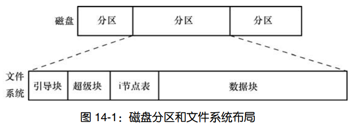

### i节点

i节点维护的信息

- 文件类型
- 文件属主
- 文件属组
- 3 类用户的访问权限：属主、属组以及其他用户
- 3 个时间戳：对文件的最后访问时间、对文件的最后修改时间、以及文件状态的最后改变时间
- 指向文件的硬链接数量
- 文件的大小，以字节为单位
- 实际分配给文件的块数量，以 512 字节块为单位
- 指向文件数据块的指针

#### ext2的i节点和数据块指针

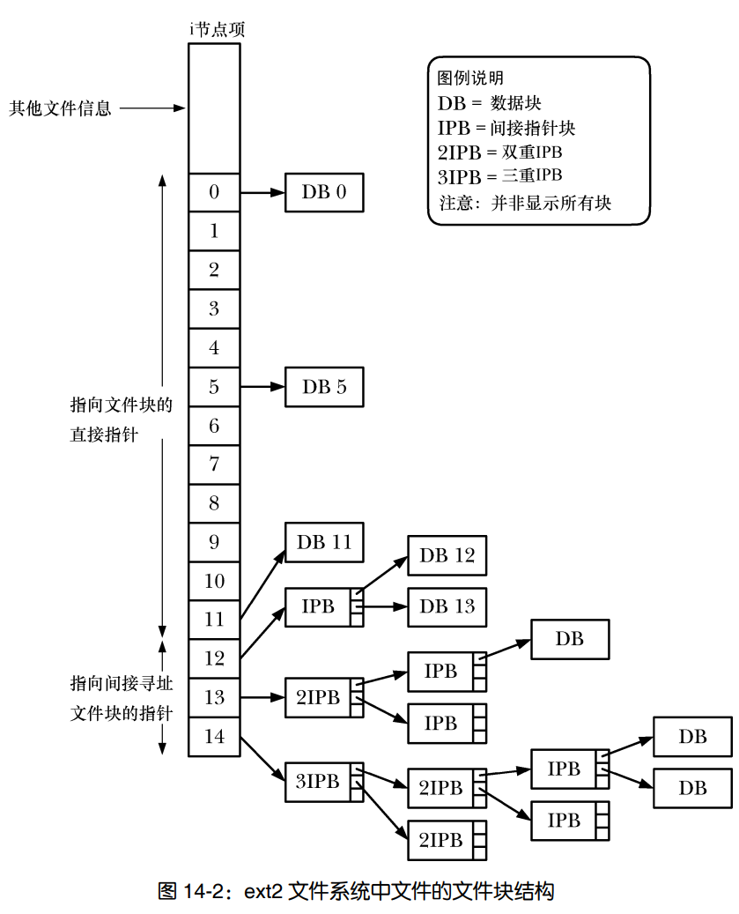

在 ext2 中，每个 i 节点包含 15 个指针。其中的前 12 个指针（图 14-2 中编号为 0～11 的 指针）指向文件前 12 个块在文件系统中的位置。接下来，是一个指向指针块的指针，提供了 文件的第 13 个以及后续数据块的位置。指针块中指针的数量取决于文件系统中块的大小。每个指针需占用 4 字节，因此指针的数量可能在 256（块容量为 1024 字节）～1024（块容量为 4096 字节）之间。这样就考虑了大型文件的情况。即便是对于巨型文件，第 14 个指针（图中 编号为 13）是一个双重间接指针—指向指针块，其块中指针进而指向指针块，此块中指针 最终才指向文件的数据块。只要有体量巨大的文件，就会随之产生更深一层的递进：图中 i 节点的最后一个指针属于三重间接指针。

### 虚拟文件系统

虚拟文件系统 （VFS，有时也称为虚拟文件交换）是一种内核特性，通过为文件系统操作创建抽象层来解决上述问题。

VFS 接口的操作与涉及文件系统和目录的所有常规系统调用相对应，这些系统调用有 open()、read()、write()、lseek()、close()、truncate()、stat()、mount()、umount()、mmap()、mkdir()、 link()、unlink()、symlink()以及 rename()。

### 日志文件系统

ext2文件系统在崩溃后，为确保文件系统的完整性，重启时必须对文件系统的一致性进行检查。

日志文件系统最为昭著的臭名在于增加了文件更新的时间，当然，良好的设计可以降低这方面的开销。

### 单根目录层级和挂载点

Linux 上所有文件系统中的文件都位于单根目录树下，树根就是根目录“/”。其他的文件系统都挂载在根目录之下，被视为整个目录层级的子树（subtree）。

不带任何参数来执行 mount 命令，可以列出当前已挂载的文件系统。

挂载点实际上是Linux中磁盘文件系统的入口目录，类似Windows中的C:D:E:盘符。

### 文件系统的挂载和卸载

系统调用 mount()和 umount()运行特权级进程(CAP_SYS_ADMIN)以挂载或卸载文件系统。

- Linux 专有的虚拟文件/proc/mounts，可查看当前已挂载文件系统的列表。 /proc/mounts 是内核数据结构的接口，因此总是包含已挂载文件系统的精确信息。
- /etc/mtab 文件内容与/proc/mounts类似，但是系统调用不会更新该文件，所以该文件并不是很准确。
- /etc/fstab包含了对系统支持的所有文件系统的描述，可供系统调用使用。

`/dev/sda9 /boot ext3 rw 0 0`

这条记录包含6个字段：

1. 已挂载设备名
2. 设备的挂载点
3. 文件系统类型
4. 挂载标志。上例的 rw 表示以可读写方式挂载文件系统
5. 一个数字，dump(8)会使用其来控制对文件系统的备份操作。只有/etc/fstab 文件才会用到该字段和第 6 个字段，在/proc/mounts 和/etc/mtab 中，该字段总是为 0
6. 一个数字，在系统引导时，用于控制 fsck(8)对文件系统的检查顺序。 getfsent(3)和 getmntent(3)手册页记录了用于从上述文件中读取记录的函数

#### 挂载文件系统：mount()

```c
#include <sys/mount.h>
int mount(const char *source,const char *targe,const char *fstype,unsigned long mountflags,const void *data);
```

mount()系统调用将由 参数source 指定设备所包含的文件系统，挂载到由 参数target 指定的目录下。

参数 fstype 是一字符串，用来标识设备所含文件系统的类型，比如，ext4 或 btrfs。

参数 mountflags 为一位掩码，可选标志如下

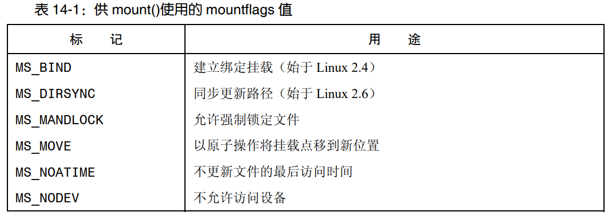

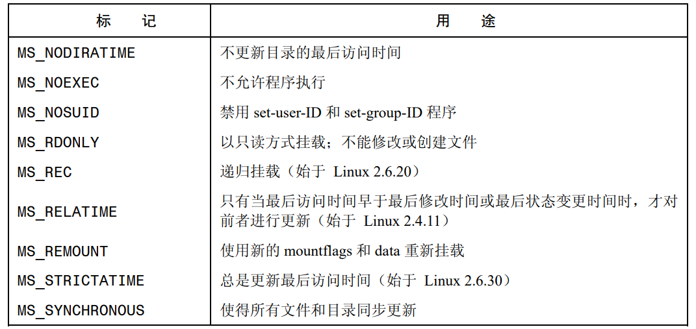

mount()的最后一个参数 data 是一个指向信息缓冲区的指针，对其信息的解释则取决于文件系统。

> 程序清单 14-1：使用 mount() filesys/t_mount.c

#### 卸载文件系统：umount()和umount2()

```c
#include <sys/mount.h>
int umount(const char *target);
```

target 参数指定待卸载文件系统的挂载点。

```c
#include <sys/mount.h>
int umount2(const char *target，int flags);
```

系统调用 umount2()是 umount()的扩展版。通过 flags 参数，umount2()可对卸载操作施以更精密的控制。

flags参数查书P223页

### 高级挂载特性

#### 在多个挂载点挂载文件系统

将一 个文件系统挂载于文件系统内的多个位置，其中一个挂载点下的目录子树发生改变，在其他挂载点下也会随之改变。

#### 基于每次挂载的挂载标志

文件系统和挂载点不再是一一对应，每次挂载都可以设置不同的标志。

#### 绑定挂载

绑定挂载（由使用 MS_BIND 标志的 mount() 调用来创建）是指在文件系统目录层级的另一处挂载目录或文件。这将导致文件或目录在两处同时可见。绑定挂载有些类似于硬链接，但存在两个方面的差异。

应用场景之一创建监禁区

#### 递归绑定挂载

采用 mount(8)命令所提供的--rbind 选项完成，套娃。

### 虚拟内存文件系统：tmpfs

tmpfs 文件系统是一个 Linux 内核的可选组件，通过 CONFIG_TMPFS 选项加以配置。

创建一 tmpfs 文件系统并将其挂载至/tmp

```shell
mount -t tmpfs nuwtmp /tmp
cat /proc/mounts | grep tmp
```

### 获得与文件系统有关的信息：statvfs()

```c
#include <sys/statvfs.h>
int statvfs(const char *pathname,struct statvfs *statvfsbuf);
int fstatvfs(int fd,struct statvfs *statvfsbuf);
```

两者之间唯一的区别在于其标识文件系统的方式。statvfs()需使用 pathname 来指定文件系统中任一文件的名称。而 fstatvfs()则需使用打开文件描述符 fd，来指代文件系统中的任一文件。二者均返回一个 statvfs 结构，属于由 statvfsbuf 所指向的缓冲区，其中包含了关乎文件系统的信息。statvfs 结构的形式如下：

```c
struct statvfs
  {
    unsigned long int f_bsize;
    unsigned long int f_frsize;
#ifndef __USE_FILE_OFFSET64
    __fsblkcnt_t f_blocks;
    __fsblkcnt_t f_bfree;
    __fsblkcnt_t f_bavail;
    __fsfilcnt_t f_files;
    __fsfilcnt_t f_ffree;
    __fsfilcnt_t f_favail;
#else
    __fsblkcnt64_t f_blocks;
    __fsblkcnt64_t f_bfree;
    __fsblkcnt64_t f_bavail;
    __fsfilcnt64_t f_files;
    __fsfilcnt64_t f_ffree;
    __fsfilcnt64_t f_favail;
#endif
    unsigned long int f_fsid;
#ifdef _STATVFSBUF_F_UNUSED
    int __f_unused;
#endif
    unsigned long int f_flag;
    unsigned long int f_namemax;
    int __f_spare[6];
  };
```

## Chapter15 文件属性

### 获取文件信息

```c
#include <sys/stat.h>
int stat(const char *pathname,struct stat *stabuf);
int lstat(const char *pathname,struct stat *stabuf);
int fstat(int fd,struct stat *statbuf);
```

三个调用的区别：

- stat()会返回所命名文件的相关信息
- lstat()与 stat()类似，区别在于如果文件属于符号链接，那么所返回的信息针对的是符号链接自身（而非符号链接所指向的文件）
- fstat()则会返回由某个打开文件描述符所指代文件的相关信息

返回结构体为

```c
struct stat{
	__dev_t st_dev;		/* Device.  */
	__ino_t st_ino;		/* File serial number.	*/
	__nlink_t st_nlink;		/* Link count.  */
    __mode_t st_mode;		/* File mode.  */
    __uid_t st_uid;		/* User ID of the file's owner.	*/
    __gid_t st_gid;		/* Group ID of the file's group.*/
    __dev_t st_rdev;		/* Device number, if device.  */
    __off_t st_size;			/* Size of file, in bytes.  */
    __blksize_t st_blksize;	/* Optimal block size for I/O.  */
    __blkcnt_t st_blocks;		/* Number 512-byte blocks allocated. */
    __time_t st_atime;			/* Time of last access.  */
    __time_t st_mtime;			/* Time of last modification.  */
    __time_t st_ctime;			/* Time of last status change.  */
};
```

#### 设备ID和i节点号

dev_t记录了设备的主、辅ID

如果是设备的i节点，st_rdev包含设备的主、辅ID

利用宏 major()和 minor()，可提取 dev_t 值的主、辅 ID。获取对两个宏声明的头文件则随 UNIX 实现而各异。在 Linux 系统上，若定义了~~_BSD_SOURCE~~ _DEFAULT_SOURCE宏，则两个宏定义于中。需要#include <sys/sysmacros.h>

#### 文件所有权

st_uid 和 st_gid 字段分别标识文件的属主（用户 ID）和属组（组 ID）

#### 链接数

st_nlink 字段包含了指向文件的（硬）链接数。

#### 文件类型及权限

st_mode 字段内含有位掩码（高4位为文件类型，低12位为权限），与常量 S_IFMT 相与（&），可从该字段中析取文件类型。

```c
if((statbuf.st_mode & S_IFMT) == S_IfREG)
	prinf("regular file\n");
```

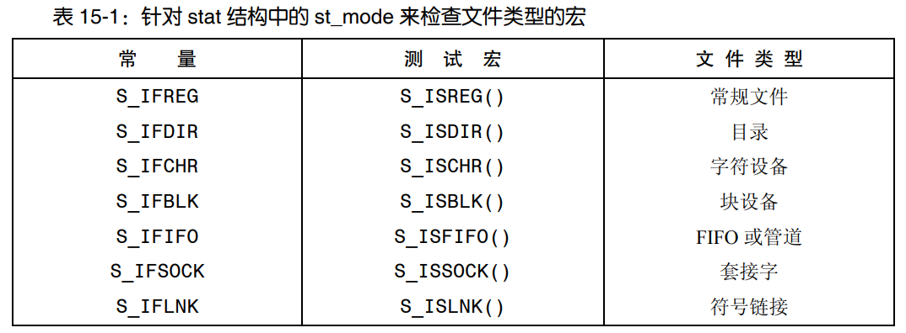

#### 文件大小、已分配块以及最优 I/O 块大小

- 对于常规文件，st_size 字段表示文件的字节数。对于符号链接，则表示链接所指路径名的长度，以字节为单位。对于共享内存对象，该字段则表示对象的大小。
- st_blocks 字段表示分配给文件的总块数，块大小为 512 字节。
- st_blksize 字段针对文件系统上文件进行 I/O 操作时的最优块大小，若 I/O 所采用的块大小小于 该值，则被视为低效。一般而言，st_blksize 的返回值为 4096。

#### 文件时间戳字段

st_atime、st_mtime 和 st_ctime 字段，分别记录了对文件的上次访问时间、上次修改时间， 以及文件状态发生改变的上次时间。

> 程序清单 15-1：获取并解释文件的 stat 信息 files/t_stat.c 

### 文件时间戳

#### 纳秒时间戳

对于 stat 结构所含的 3 个时间戳字段，Linux 从 2.6 版本将其精度提升至纳秒级。纳秒级分辨率将提高某些程序的精度，因为此类程序需要根据文件时间戳的先后顺序来作决定。

#### 使用utime()和utimes()改变时间戳

```c
#include <utime.h>
int utime(const char *pathname,const struct utimbuf *buf);
```

参数 pathname 用来标识欲修改时间的文件。若该参数为符号链接，则会进一步解除引用。 参数 buf 既可为 NULL，也可为指向 utimbuf 结构的指针。

```c
struct utimbuf{
	time_t actime;	/* Access time */
	time_T modtime;	/* Modification time */
};
```

- 参数buf为NULL时，那么会将文件的上次访问和修改时间同时置为当前时间。
- 参数buf为指向utimbuf的指针时，则会使用该结构的相应字段去更新文件的上次访问和修改时间。

```c
#include <sys/time.h>
int utimes(const char *pathname,const struct timeval tv[2]);
```

utime()与 utimes()之间最显著的差别在于后者可以以==微秒==级精度来指定时间值。

新的文件访问时间在 tv[0]中指定，新的文件修改时间在 tv[1]中指定。

```c
#include <Sys/time.h>
int futimes(int fd,const struct timeval tv[2]);
int lutimes(const char *pathname,const struct timeval tv[2]);
```

这两个函数功能与utimes()相同，但是也有些许差异。

调用 futimes()时，使用打开文件描述符 fd 来指定文件。

调用 lutimes()时，使用路径名来指定文件，有别于调用 utimes()的是：对于 lutimes()，若路径名指向一符号链接，则调用不会对该链接进行解引用，而是更改链接自身的时间戳。

#### 使用utimensat()和futimens()改变文件时间戳

优点：

1. 可按纳秒级精度设置时间戳。
2. 可以独立设置某一时间戳。
3. 可以独立将任意时间戳置为当前时间。

```c
#define _XOPEN_SOURCE 700
#include <sys/stat.h>
int utimensat(int dirfd,const char *pathname,
			const struct timespec times[2],int flags);
```

参数dirfd指定为 AT_FDCWD，此时对 pathname 参数的解读与 utimes()相类似。 或者，也可以将其指定为指代目录的文件描述符。

参数flags：0或者 AT_SYMLINK_NOFOLLOW，意即当 pathname 为符号链接时， 不会对其解引用，只改变符号链接本身的时间戳。

若将 times 指定为 NULL，则会将以上两个文件时间戳都更新为当前时间。若 times 值为 非 NULL，则会针对指定文件在 times[0]中放置新的上次访问时间，在 times[1]中放置新的上次修改时间。

数组 times 所含的每一元素都是如下格式的一个结构：

```c
struct timespec{
	time_t tv_sec;	/* seconds */
	long   tv_nsec;	/* Nanoseconds */
};
```

若有意将时间戳之一置为当前时间，则可将相应的 tv_nsec 字段指定为特殊值 UTIME_NOW。

若希望某一时间戳保持不变，则需把相应的 tv_nsec 字段指定为特殊值 UTIME_OMIT。

无论是上述哪一种情况，都将忽略相应 tv_sec 字段中的值。

```c
#include _GUN_SOURCE
#include <sys/stat.h>
int futimens(int fd,const struct timespec times[2]);
```

与utimensat()的不同之处在于使用的是文件描述符fd。

### 文件属主

#### 新建文件的属主

文件创建时，其用户 ID“取自”进程的有效用户 ID。而新建文件的组 ID 则“取自”进程的有效组 ID。

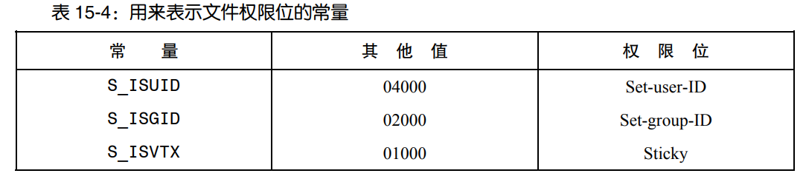

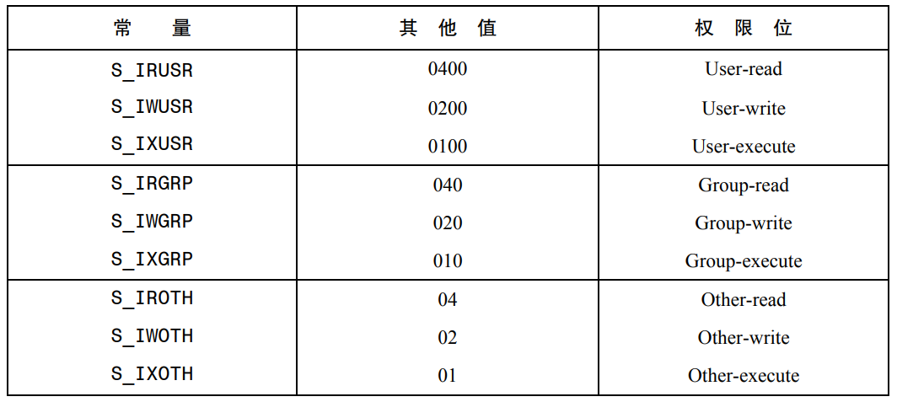

#### 改变文件属主：chown()、fchown()和lchowm()

```c
#include <unistd.h>
int chown(const char *pathname,uid_t owner,gid_t group);

#define _XOPEN_SOURCE 500
#include <unistd.h>
int lchown(const char *pathname,uid_t owner,gid_t group);
int fchown(int fd,uid_t owner,gid_t group);
```

- chown()改变由 pathname 参数命名文件的所有权。
- lchown()用途与 chown()相同，不同之处在于若参数 pathname 为一符号链接，则将会改变链接文件本身的所有权，而与该链接所指代的文件无干。
- fchown()也会改变文件的所有权，只是文件由打开文件描述符 fd 所引用。

若只想改变其中之一，只需将另一参数设置为-1。

> 程序清单 15-2：改变文件的属主和属组 files/t_chown.c

### 文件权限

#### 普通文件的权限

stat 结构中 st_mod 字段的低 12 位定义了文件权限。

其中的前 3 位为专用 位，分别是 set-user-ID 位、set-group-ID 位和 sticky 位。

其余 9 位则构成了定义权限的掩码，分别授予访问文件的各 类用户。文件权限掩码分为 3 类。

执行ls -l 命令可以查看文件的权限和所有权，下面进行举例：

```shell
ls -l myscript.sh
-rwxr-x---		1 mtk	users	...
```

该字符串起始处的连接号“-”表明该文件属于普通文件。文件权限显示为“rwxr-x---”

查看权限时，需将9位分成三组。

- 第一组表示文件属主的权限，上述例子中为rwx，即表示为可读、可写、可执行都具备
- 第二组表示属组的权限，上述例子中为r-x，即表示组内用户可读、可执行
- 第三组表示其他用户的权限，上述例子中为---，即表示都没有权限

#### 目录权限

- 读权限：可列出（比如，通过 ls 命令）目录之下的内容（即目录下的文件名）。
- 写权限：可在目录内创建、删除文件。注意，要删除文件，对文件本身无需有任何权限。
- 可执行权限：可访问目录中的文件。因此，有时也将对目录的执行权限称为 search（搜 索）权限。

#### 权限检查算法

给定路径名称，内核会对文件权限进行检查，其次对路径上的目录进行检查，使用的是文件系统ID和组ID

#### 检查特权级别进程的权限

对于非目录文件，仅当该文件的 3 种权限类型（至少）之一具有可执行权限时，Linux 才会将该权限赋予一特权级进程。

#### 检查对文件的访问权限：access()

```c
#include <unistd.h>
int access(const char *pathname,int mode);
```

系统调用 access()就是根据进程的真实用户 ID 和组 ID（以及附属组 ID），去检查对 pathname 参数所指定文件的访问权限。

若 pathname 为符号链接，access()将对其解引用。 参数 mode 是由表 15-5 中常量相或（|）而成的位掩码。若由 pathname 所指定的文件具备 mode 参数包含的所有权限，access()将返回 0；只要有一项权限未得到满足（或者有错误发生）， access()则返回−1。

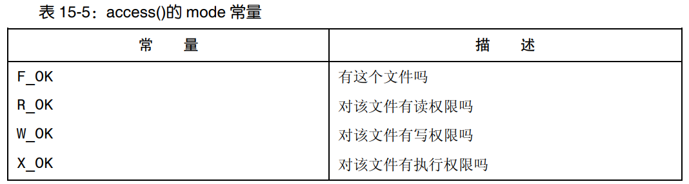

<font color=red>Tips:</font>建议杜绝使用access()，因为调用access()与对同一文件的后续操作存在时间差，不能保证access()返回信息的准确性

#### Set-User-ID、Set-Group-ID 和 Sticky 位

set-group-ID 位还有两种其他用途：对于在以 nogrpid 选项装配的目录下所新建的文件，控制其群组从属关系；可用于强制锁定文件。

sticky位的目的在于让常用程序的运行速度更快。

若对某程序文件设置了 sticky 位，则首次执行程序时，系统会将其文本拷贝保存于交换区中，即“粘” （stick）在交换区内，故而能提高后续执行的加载速度。

作用于目录时，sticky 权限位起限制删除位的作用。为目录设置该位，则表明仅当非特权进程具有对目录的写权限，且为文件或目录的属主时，才能对目录下的文件进行删除（unlink()、 rmdir()）和重命名（rename()）操作。（具有 CAP_FOWNER 能力的进程可省去对属主的检查。） 可藉此机制来创建为多个用户共享的一个目录，各个用户可在其下创建或删除属于自己的文 件，但不能删除隶属于其他用户的文件。为/tmp 目录设置 sticky 权限位，原因正在于此。

可通过 chmod 命令(chmod +t file)或 chmod()系统调用来设置文件的 sticky 权限位。若对某文件设置了 sticky 权限位，则当执行 ls–l 命令显示该文件时，会在其他用户执行权限字段上看到字母 T，其大小写则要取决于是否对文件开启了其他用户执行权限位

#### 进程的文件模式创建掩码：umask()

umask 是一种进程属性，当进程新建文件或目录时，该属性用于指明应屏蔽哪些权限位。

大多数 shell 的初始化文件会将 umask 默认置为八进制值 022 (----w--w-)。其含义为对于同组或其他用户，应总是屏蔽写权限。

```c
#include <sys/stat.h>
mode_t umask(mode_t mask);
```

可以以八进制数或是表 15-4 中所列常量相或（|）来指定 mask 参数。

> 程序清单 15-5：使用 umask() files/t_umask.c

#### 更改文件权限：chmod()和 fchmod() 

```c
#include <sys/stat.h>
int chmod(const char *pathname,mode_t mode);

#define _XOPEN_SOURCE 500		/* Or: #define _BSD_SOURCE */
#include <sys/stat.h>
int fchmod(int fd,mode_t mode);
```

系统调用 chmod()更改由 pathname 参数所指定文件的权限。若该参数所指为符号链接， 调用 chmod()会改变符号链接所指代文件的访问权限，而非对符号链接自身的访问权限。

系统调用 fchmod()更改由打开文件描述符 fd 所指代文件的权限。

参数mode从表15-4中得到

### i节点标志（ext2 扩展文件属性）

在程序中，可利用 ioctl()系统调用来获取并修改 i 节点标志。

对普通文件或目录均可设置 i 节点标志。大多数 i 节点标志是供普通文件使用的，也有少部分兼供（或专供）目录使用。（定义于<linux/fs.h>中 ）

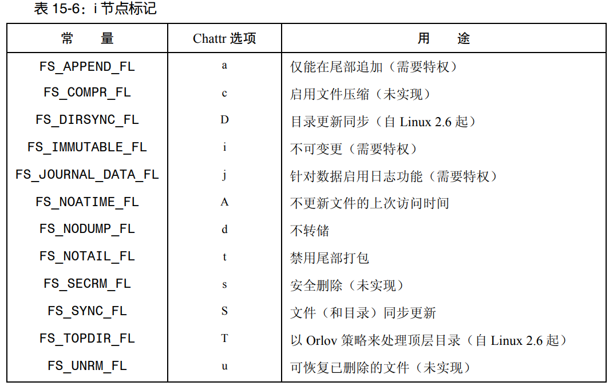

## Chapter16 扩展属性

### 概述

扩展属性EA的命名格式为namespace.name

namespace可用值为4个：

1. user EA 将在文件权限检查的制约下由非特权级进程操控。
2. trusted EA 也可由用户进程“驱使”，这点与 user EA 相似。而区别则在于，要操纵 trusted  EA，进程必须具有特权（CAP_SYS_ADMIN）
3. system EA 供内核使用，将系统对象与一文件关联。目前仅支持访问控制列表
4. security EA 的作用有二：其一，用来存储服务于操作系统安全模块的文件安全标签； 其二，将可执行文件与能力关联起来

一个 i 节点可以拥有多个相关 EA，其所从属的命名空间可以相同，也可不同。在各命名空间内的 EA 名均自成一体。在 user 和 trusted 命名空间内，EA 名可以为任意字符串。而在 system 命名空间内，只有经内核明确认可的（例如，用于访问控制列表的）命名方可使用。

#### 通过 shell 创建并查看 EA

```shell
bcl@bcl-virtual-machine:~/Desktop$ touch tfile
bcl@bcl-virtual-machine:~/Desktop$ setfattr -n user.x -v "The past is not dead." tfile
bcl@bcl-virtual-machine:~/Desktop$ getfattr -n user.x tfile
# file: tfile
user.x="The past is not dead."

bcl@bcl-virtual-machine:~/Desktop$ getfattr -d tfile			#显示所有EA
# file: tfile
user.x="The past is not dead."

bcl@bcl-virtual-machine:~/Desktop$ setfattr -n user.x tfile 	#清空user.x
bcl@bcl-virtual-machine:~/Desktop$ getfattr -d tfile
# file: tfile
user.x=""

bcl@bcl-virtual-machine:~/Desktop$ setfattr -x user.x tfile 	#删除user.x
bcl@bcl-virtual-machine:~/Desktop$ getfattr -d tfile

```

### 扩展属性的实现细节

user EA 只能施之于文件或目录，符号链接、设备文件、套接字及FIFO都不行

#### EA 在实现方面的限制

EA 名称的长度不能超过 255 个字节。EA 值的容量为 64KB。

### 操控扩展属性的系统调用

#### 创建和修改EA

```c
#include <sys/xattr.h>
int setxattr(const char *pathname,const char *name,const void *value,
			size_t size,int flags);
int lsetxattr(const char *pathname,const char *name,const void *value,
			size_t size,int flags);
int fsetxattr(int fd,const char *name,const void *value,
			size_t size,int flags);
```

setxattr()通过 pathname 来标识文件，若文件名为符号链接，则对其解引用。 

lsetxattr()通过 pathname 来标识文件，但不会对符号链接解引用。 

fsetxattr()则通过打开文件描述符 fd 来标识文件。

参数 name 是一个以空字符结尾的字符串，定义了 EA 的名称。

参数 value 是一个指向缓 冲区的指针，包含了为 EA 定义的新值。

参数 size 则指明了缓冲区大小。

参数flags 0为默认值，其他参数可选：1.XATTR_CREATE 若具有给定名称（name）的 EA 已经存在，则失败。2. XATTR_REPLACE 若具有给定名称（name）的 EA 不存在，则失败。

#### 获取EA

```c
#include <sys/xattr.h>
ssize_t getxattr(const char *pathname,const char *name,void *value,
				size_t size);
ssize_t lgetxattr(const char *pathname,const char *name,void *value,
				size_t size);
ssize_t fgetxattr(int fd,const char *name,void *value,
				size_t size);
```

参数 name 是一个以空字符结尾的字符串，用来标识欲取值的 EA。返回的 EA 值保存于参数 value 所指向的缓冲区中。该缓冲区必须由调用者分配，其大小应在 size 中指定。若调用 成功，上述系统调用会返回复制到 value 所指缓冲区中的字节数。

#### 删除EA

```c
#include <sys/xattr.h>
int removeattr(const char *pathname,const char *name);
int lremoveattr(const char *pathname,const char *name);
int fremoveattr(int fd,const char *name);
```

name 所含以空字符结尾的字符串，用于标识打算删除的 EA。若试图删除不存在的 EA， 调用将失败，并会返回错误 ENODATA。

#### 获取与文件相关联的所有 EA 的名称

```c
#include <sys/xattr.h>
ssize_t listxattr(const char *pathname,char *list,size_t size);
ssize_t llistxattr(const char *pathname,char *list,size_t size);
ssize_t flistxattr(int fd,char *list,size_t size);
```

调用将 EA 的名称列表以一系列以空字符结尾的字符串形式置于 list 所指向的缓冲区中。缓冲区的大小由 size 指定。一旦成功，上述系统调用会返回复制到 list 中的字节数。

> 程序清单 16-1：显示文件的扩展属性 xattr/xattr_view.c

## Chapter17 访问控制列表

### 概述

利用 ACL，可以在任意数量的用户和组之中，为单个用户或组指定文件权限。

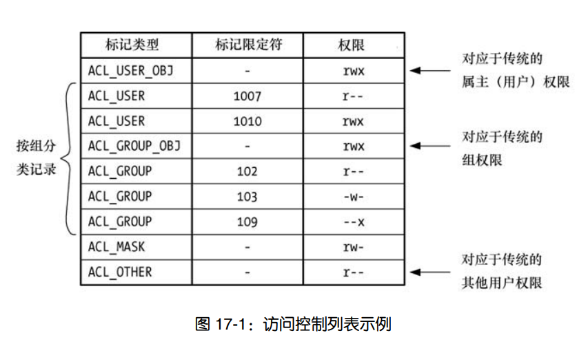

只有标记类型为“ACL_USER”和“ACL_GROUP”的记录，才会采用标记限定符来指 定用户 ID 和组 ID。

#### 最小 ACL 和扩展 ACL 

最小化（minimal）ACL 语义上等同于传统的文件权限集合，恰好由 3 条记录组成。每条标记的类型分别为 ACL_USER_OBJ、ACL_GROUP_OBJ 以及 ACL_OTHER。

扩展 ACL 则是指除此之外，还包含标记类型为 ACL_USER、ACL_GROUP 和 ACL_MASK 的记录。

### ACL 的长、短文本格式

长文本格式的 ACL：每行都包含一条 ACE，还可以包含注释，注释需以“#”开始， 直至行尾结束。getfacl 命令的输出会以长文本格式显示 ACL。getfacl 命令的-M acl-file 选项从指定文件中“提取”长文本格式的 ACL 定义。

短文本格式的 ACL：包含一系列以“，”分隔的 ACE。

举例对应传统权限掩码0650：

```
u::rw-,g::r-x,o::---
u::rw,g::rx,o::-
user::rw,group::rx,other::-
```

### getfacl 和 setfacl 命令

在 shell 中运行 getfacl 命令，可查看到应用于文件的 ACL。

新建文件具有最小的 ACL 权限。getfacl 命令会在输出 ACL 记录的文本格式之前，显示该文件的名称和属主、属组。执行 getfacl 命令时，如带有 --omit–header 选项，可省略上述内容。

执行传统的 chmod 命令来改变文件访问权限时，其效果贯穿到文件的 ACL 上。

```shell
bcl@bcl-virtual-machine:~/Desktop$ rm tfile 
bcl@bcl-virtual-machine:~/Desktop$ touch tfile
bcl@bcl-virtual-machine:~/Desktop$ getfacl tfile 
# file: tfile
# owner: bcl
# group: bcl
user::rw-
group::r--
other::r--
```

setfacl 命令可用来修改文件的 ACL。下例中执行 setfacl –m 命令，为文件的 ACL 追加标 记类型为 ACL_USER 和 ACL_GROUP 的记录。

```shell
bcl@bcl-virtual-machine:~/Desktop$ setfacl -m user::rx,group::x tfile
bcl@bcl-virtual-machine:~/Desktop$ getfacl --omit-header tfile
user::r-x
group::--x
other::r--
```

追加了 ACL_USER 和 ACL_GROUP 标记类型的记录会将该 ACL 转变为扩展 ACL。因此， 在执行 ls –l 命令时，会在文件的传统权限掩码之后多一个加号（“+”）

### 默认ACL与文件创建

针对目录，还 可创建第二种 ACL：默认型（default）ACL。

访问目录时，默认型 ACL 并不参与判定所授予的权限。相反，默认型 ACL 的存在与否决定了在目录下所创建文件或子目录的 ACL 和权限。

执行带有–k 选项的 setfacl 命令，可删除针对目录而设的默认型 ACL。

若针对目录设置了默认型 ACL，则：

- 新建于目录下的子目录会将该目录的默认型 ACL 继承为其默认型 ACL。换言之，默认型 ACL 会随子目录的创建而沿目录树传播开来。
- 新建于目录下的文件或子目录会将该目录的默认型 ACL 继承为其访问型 ACL。与传统文件权限位相对应的 ACL 记录将和创建文件或子目录时系统调用（open()、 mkdir()等等）中的 mode 参数相与（&）。

若该目录并无默认 ACL，则：

- 新建于该目录下的子目录也不存在默认 ACL。
- 会沿用传统规则来设置目录下新建文件或目录的权限。除去按进程的 umask 而屏蔽权限位之外，将文件权限置为（open()、mkdir()等调用中）mode 参数的值。这时，新文件将拥有最小化的 ACL。

### ACL API

程序要使用 ACL API，就应包含。如果还用到了 POSIX.1e 标准草案中的各种 Linux 扩展（acl(5)手册页罗列了一系列 Linux 扩展），程序可能还需要包含。为与 libacl 库链接，编译此类程序时需带有-lacl 选项。

#### 将文件的ACL读入内存

```c
acl_t acl;
acl = acl_get_file(pathname,type);
```

acl_get_file()函数可用来获取（由 pathname 所标识）文件的 ACL 副本。

取决于参数 type 的值（ACL_TYPE_ACCESS 或 ACL_TYPE_DEFAULT），可调用该函数来获取访问型 ACL 或默认型 ACL。

#### 从内存ACL中获取记录

```c
acl_entry_t entry;
status = acl_get_entry(acl,entry_id,&entry);
```

acl_get_entry()函数会返回一句柄，指向内存 ACL（由函数的 acl 参数指代）中的记录之 一。句柄的返回位置由函数的最后一个参数指定。

entry_id 参数决定返回那条记录的句柄。若将其指定为 ACL_FIRST_ENTRY，则会返回的句柄指向 ACL 中的首条 ACE。若将该参数指定为 ACL_NEXT_ENTRY，则所返回的句柄将指向上次所获取记录之后的 ACE。

若成功获取到一条 ACE，acl_get_entry()函数将返回 1；如无记录可取，则返回 0；失败， 则返回−1。

#### 获取并修改 ACL 记录中的属性

函数 acl_get_tag_type()和 acl_set_tag_type()可分别用来获取和修改（由 entry 参数所指定） ACL 记录中的**标记类型**。

```c
acl_tag_t tag_type;
status = acl_get_tag_type(entry,&tag_type);
status = acl_set_tag_type(entry,tag_type);
```

函数 acl_get_qualifier()和 acl_set_qualifier()可分别用来获取和修改（由 entry 参数所指定） ACL 记录中的**标记限定符**。

```c
uid_t *qualp;
qualp = acl_get_qualifier(entry);
status = acl_set_qualifier(entry,qualp);
```

函数 acl_get_permset()和 acl_set_permset()则可分别用来获取和修改（由 entry 参数所指代） ACE 中的**权限集合**。

```c
acl_permset_t permset;
status = acl_get_permset(entry,&permset);
status = acl_set_permset(entry,permset);
```

#### 创建和删除ACE

```c
acl_entry_t entry;
status = acl_create_entry(&acl,&entry);
status = acl_delete_entry(acl,entry);
```

#### 更新文件的ACL

acl_set_file()函数的作用与 acl_get_file()相反，将使用驻留于内存的 ACL 内容（由 acl 参 数所指代）来更新磁盘上的 ACL。

```c
int status;
status = acl_set_file(pathname,type,acl);
```

#### ACL在内存和文本格式之间的转换

```c
acl = acl_from_text(acl_string);

char *str;
ssize_t len;
str = acl_to_text(acl,&len);
```

> 程序清单 17-1：显示与文件挂钩的访问或默认 ACL  acl/acl_view.c

## Chapter18 目录与链接

### 目录和硬链接

在文件系统中，目录的存储方式类似于普通文件。目录与普通文件的区别有二。

- 在其 i-node 条目中，会将目录标记为一种不同的文件类型
- 目录是经特殊组织而成的文件。本质上说就是一个表格，包含文件名和 i-node 编号。

i-node 表的编号始于 1，而非 0，因为若目录条目的 i-node 字段值为 0，则表明该条目尚未使用。

**i-node 1** 用来记录文件系统的**坏块**。

**文件系统根目录(/)**总是存储在 **i-node 条目 2** 中（如图 18-1 所示），所以内核在解析路径名时就知道该从哪里着手。

i-node存储的信息列表其中并未包含文件名，而仅通过目录列表内的一个映射来定义文件名称。能够在相同或者不同目录中创建多个名称，每个均指向相同的 i-node 节点。也将这些名称称为链接，有时也称之为**硬链接**。

```shell
# 在 shell 中利用 ln 命令为一个业已存在的文件创建新的硬链接
bcl@bcl-virtual-machine:~/Desktop$ echo -n 'It is good to collect things,' > abc
bcl@bcl-virtual-machine:~/Desktop$ ls -li abc
2626420 -rw-rw-r-- 1 bcl bcl 29 3月  29 13:56 abc
bcl@bcl-virtual-machine:~/Desktop$ ln abc xyz
bcl@bcl-virtual-machine:~/Desktop$ echo 'but it is better to go on walks.' >> xyz
bcl@bcl-virtual-machine:~/Desktop$ cat abc
It is good to collect things,but it is better to go on walks.
bcl@bcl-virtual-machine:~/Desktop$ ls -li abc xyz
2626420 -rw-rw-r-- 2 bcl bcl 62 3月  29 13:57 abc
2626420 -rw-rw-r-- 2 bcl bcl 62 3月  29 13:57 xyz
```

同一文件所有链接地位平等。

在程序中如何找到与文件描述符 X 相关联的文件名？答案是==不能==

硬链接有两个限制：

1. 硬链接采用的是i-node编号，所以要和与指代文件处于同一个文件系统中。
2. 不能为目录创建硬链接，避免陷入混乱的链接环路。

### 符号（软）链接

符号链接的数据是另一文件的名称。

在shell中，符号链接是由ln-s命令创建的，ls-F命令的输出结果中会在符号链接的尾部标记@。

符号链接地位不如硬链接，在文件链接计数中并未将符号链接记录在内。

如果移除了符号链接所指向的文件名，符号链接依旧存在，称作悬空链接。

总是会对路径名中目录部分的符号链接进行解除引用操作，例如路径/somedir/somesubdir/file 中，若 somedir 和somesubdir 属于符号链接，则一定会解除对这两个目录的引用，而针对 file 是否进行解引用与否，则取决于路径名所传入的系统调用。

### 创建和移除硬链接：link()和 unlink()

```c
#include <unistd.h>
int link(const char *oldpath,const char *newpath);
```

若 oldpath 中提供的是一个已存在文件的路径名，则系统调用 link()将以 newpath 参数所指定的路径名创建一个新链接。

在 Linux 中，link()系统调用不会对符号链接进行解引用操作，若oldpath为符号链接，newpath也将会是符号链接。

```c
#include <unistd.h>
int unlink(const char * pathname);
```

unlink()系统调用移除一个链接（删除一个文件名）。

unlink()不能移除一个目录，完成这一任务需要使用 rmdir()或 remove()。

unlink()系统调用不会对符号链接进行解引用操作。

> 程序清单 18-1：使用 unlink()移除一个链接 dirs_links/t_unlink.c

### 更改文件名：rename()

```c
#include <stdio.h>
int rename(const char *oldpath,const char *newpath);
```

调用会将现有的一个路径名 oldpath 重命名为 newpath 参数所指定的路径名。

rename()调用仅操作目录条目，而不移动文件数据。改名既不影响指向该文件的其他硬链接，也不影响持有该文件打开描述符的任何进程，因为这些文件描述符指向的是打开文件描 述，（在调用 open()之后）与文件名并无瓜葛。

- 可以使用`rename("sub1/x","sub2/y");`将一个文件移动到另一目录中，同时将其改名。

- 若 oldpath 是一目录，则 newpath 不能包含 oldpath 作为其目录前缀。例如，不能将 /home/mtk 重命名为/home/mtk/bin（错误为 EINVAL）。

### 使用符号链接：sysmlink()和readlink()

```c
#include <unistd.h>
int symlink(const char *filepath,const char *linkpath);
```

symlink()系统调用会针对由 filepath 所指定的路径名创建一个新的符号链接—linkpath。（想移除符号链接，需使用 unlink()调用。）

```c
#include <unistd.h>
ssize_t readlink(const char *pathname,char *buffer,size_t bufsiz);
```

readlink()将符号链接字符串的一份副本置于 buffer 指向的字符数组中。

bufsiz 是一个整型参数，用以告知 readlink()调用 buffer 中的可用字节数。

### 创建和移除目录：mkdir()和rmdir()

```c
#include <sys/stat.h>
int mkdir(const char *pathname,mode_t mode);
```

pathname 参数指定了新目录的路径名。该路径名可以是相对路径，也可以是绝对路径。 若具有该路径名的文件已经存在，则调用失败并将 errno 置为 EEXIST。

mode 参数指定了新目录的权限。

```c
#include <unistd.h>
int rmdir(const char *pathname);
```

rmdir()系统调用移除由 pathname 指定的目录，该目录可以是绝对路径名，也可以是相对路径名。

要删除的目录必须为空才能成功。

### 移除一个文件或者目录：remove()

```c
#include <stdio.h>
int remove(const char *pathname);
```

如果 pathname 是一文件，那么 remove()去调用 unlink()；如果 pathname 为一目录，那么 remove()去调用 rmdir()。

remove()不会进行解引用操作。

### 读目录：opendir()和readdir()

```c
#include <dirent.h>
DIR *opendir(const char *dirpath);
DIR *fdopendir(int fd);
```

指定路径或者文件描述符返回一个目录流。

```c
#include <dirent.h>
struct dirent *readdir(DIR *dirp);
```

readdir()函数从一个目录流中读取连续的条目。每调用 readdir()一次，就会从 dirp 所指代的目录流中读取下一目录条目，并返回一枚指针， 指向经静态分配而得的 dirent 类型结构，每次调用都会覆盖，内含与该条目相关的如下信息：

```c
struct dirent{
	ino_t d_ino;		/* File i-node number */
	char d_name[];		/* Null-terminated name of file */
};
```

```c
#include <dirent.h>
void rewinddir(DIR *dirp);
int closedir(DIR *dirp);
```

rewinddir()函数可将目录流回移到起点，以便对 readdir()的下一次调用将从目录的第一个文件开始。

closedir()函数将由 dirp 指代、处于打开状态的目录流关闭，同时释放流所使用的资源。

#### 目录流与文件描述符

```c
#include <dirent.h>
int dirfd(DIR *dirp);
```

dirfd()函数返回与 dirp 目录流相关联的文件描述符。

> 程序清单 18-2：扫描一个目录 dirs_links/list_files.c

#### readdir_r()函数

```c
#include <dirent.h>
int readdir_r(DIR  *dirp,struct dirent *entry,struct dirent **result);
```

readdir_r()函数是 readdir()的变体。

readdir_r()对文件条目的返回利用的是由调用者分配的 entry 参数，而 readdir()则是将信息置于静态分配的结构并返回其指针。

### 文件树遍历：nftw()

```c
#define _XOPEN_SOURCE 500
#include <ftw.h>
int nftw(const char *dirpath,
		int (*func)(const char *pathname,const struct stat *statbuf,
					int typeflag,struct FTW *ftwbuf),
		int nopenfd,int flags);
```

nftw()函数允许程序对整个目录子树进行递归遍历，并为子树中的每个文件执行某些操作。

nftw()函数遍历由 dirpath 指定的目录树，并为目录树中的每个文件调用一次由程序员定义的 func 函数。

nopenfd参数为同时持有的描述符数目突破上限。

flags参数可选FTW_CHDIR、FTW_DEPTH 、FTW_MOUNT 、FTW_PHYS、FTW_D 、FTW_DNR、FTW_DP、FTW_F 、FTW_NS 、FTW_SL、FTW_SLN

每次调用 func 都必须返回一个整型值，由 nftw()加以解释。如果返回 0，nftw()会继续对树进行遍历，如果所有对 func 的调用均返回 0，那么 nftw()本身也将返回 0 给调用者。若返回非 0 值，则通知 nftw()立即停止对树的遍历，这时 nftw()也会返回相同的非 0 值。

应用程序提前终止目录树遍历的唯一方法就是让func返回一个非0值。

> 程序清单 18-3：使用 nftw()遍历目录树 dirs_links/nftw_dir_tree.c

### 进程的当前工作目录

#### 获取当前工作目录

```c
#include <unistd.h>
char *getcwd(char *cwdbuf,size_t size);
```

getcwd()函数将内含当前工作目录绝对路径的字符串（包括结尾空字符）置于 cwdbuf 指向的已分配缓冲区中。

若 cwdbuf 为 NULL，且 size 为 0，则 glibc 封装函数会为 getcwd()按需分配一个缓冲区， 并将指向该缓冲区的指针作为函数的返回值。需要手动调用free()释放内存。

#### 改变当前工作目录

```c
#include <unistd.h>
int chdir(const char *pathname);
```

```c
#define _XOPEN_SOURCE 500
#include <unistd.h>
int fchdir(int fd);
```

两者的区别在于使用路径还是文件描述符。

### 目录文件描述符解释相对路径

以openat()为例。

```c
#define _XOPEN_SOURCE 700
#include <fcntl.h>
int openat(int dirfd,const char *pathname,int flags,...);
```

openat()系统调用类似于传统的 open()系统调用，只是添加了一个 dirfd 参数。

- 如果 pathname 中为一相对路径名，那么对其解释则以打开文件描述符 dirfd 所指向的 目录为参照点，而非进程的当前工作目录。
- 如果 pathname 中为一相对路径，且 dirfd 中所含为特殊值 AT_FDCWD，那么对 pathname 的解释则相对与进程当前工作目录（即与 open(2)行为一致）而言。
- 如果 pathname 中为绝对路径，那么将忽略 dirfd 参数。

### 改变进程的根目录：chroot()

根目录一般为解释绝对路径'/'

```c
#define _BSD_SOURCE
#include <unistd.h>
int chroot(const char *pathname);
```

chroot()系统调用将进程的根目录改为由 pathname 指定的目录（如果 pathname 是符号链接，还将对其解引用）

chroot()可以用来创建监禁区，但是在监禁区之外的某一目录中持有一打开的文件描述符，结合fchdir()和chroot()即可越狱成功。如以下代码。为了防止这种可能性，必须关闭所有指向监禁区外目录的文件描述符。

```c
fd = open("/",O_RDONLY);
chroot("/home/mtk");
fchdir(fd);
chroot(".");
```

### 解析路径名：realpath()

```c
#include <stdlib.h>
char *realpath(const char *pathname,char *resolved_path);
```

realpath()库函数对 pathname（以空字符结尾的字符串）中的所有符号链接一一解除引用， 并解析其中所有对/.和/..的引用，从而生成一个以空字符结尾的字符串，内含相应的绝对路径名。生成的字符串将置于 resolved_path 指向的缓冲区中。

> 程序清单 18-4：读取并解析一个符号链接 dirs_links/view_symlink.c

### 解析路径名字符串：dirname()和basename()

```c
#include <libgen.h>
char *dirname(char *pathname);
char *basename(char *pathname);
```

dirname()将路径截取目录部分，basename()将路径截取文件名部分。两者都会修改pathname指向的字符串，所以希望保留原有的字符串，需要传递字符串副本。

比如，给定路径名为/home/britta/prog.c，dirname()将返回/home/britta，而 basename()将返回 prog.c。将 dirname()返回的字符串与一斜线字符（/）以及 basename()返回的字符串拼接起来，将生成一条完整的路径名。

> 程序清单 18-5：dirname()和 basename()的应用 dirs_links/t_dirbasename.c

在程序中存在strdup函数，不是标准C函数，而strcpy为标准C函数。

strdup会将复制内容给没有初始化的指针，自动分配内存；strcpy的目标指针一定要已经分配内存的指针。

strdup需要手动free释放内存；strcpy需要事前确定src的大小。

## Chapter19 监控文件事件

inotify和dnotify都是Linux的专有机制。后者较为基本不使用，太老了。

### 概述

使用inotify API关键步骤

1. 应用程序使用 inotify_init()来创建一 inotify 实例
2. 应用程序使用 inotify_add_watch()向 inotify 实例（由步骤 1 创建）的监控列表添加条目，藉此告知内核哪些文件是自己的兴趣所在。
3. 为获得事件通知，应用程序需针对 inotify 文件描述符执行 read()操作。
4. 应用程序在结束监控时会关闭 inotify 文件描述符。

> inotify 机制属可选的 Linux 内核组件，可通过 CONFIG_INOTIFY 和 CONFIG_  INOTIFY_USER 选项进行配置。

### inotify API

```c
#include <sys/inotify.h>
int inotify_init(void);
```

inotify_init()系统调用可创建一新的 inotify 实例。返回一个文件描述符（句柄）后续操作使用此指代inotify实例。

```c
#include <sys/inotify.h>
int inotify_add_watch(int fd,uint32_t wd);
```

针对文件描述符 fd 所指代 inotify 实例的监控列表，系统调用 inotify_add_watch()既可以追加新的监控项，也可以修改现有监控项。

前提是调用程序必须要有对目标文件的读权限。只做一次检查，后续读权限不存在不会影响监控。

```c
#include <sys/inotify.h>
int inotify_rm_watch(int fd,uint32_t wd);
```

系统调用 inotify_rm_watch()会从文件描述符 fd 所指代的 inotify 实例中，删除由 wd 所定义的监控项。

删除监控项会为该监控描述符生成 IN_IGNORED 事件。

### inotify事件

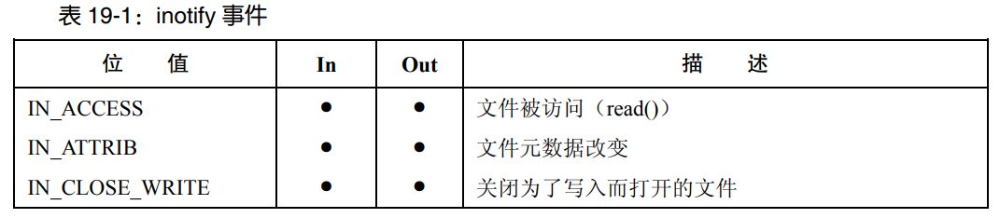

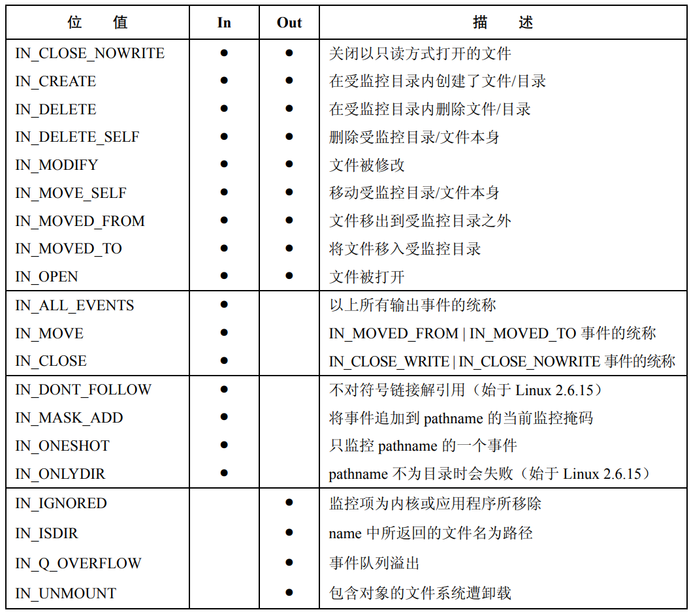

### 读取inotifiy事件

使用read()可以从inotify文件描述符中读取事件，返回一个缓冲区包含发生的事件，如果时至读取时未发生任何事件，read()会阻塞下去，直到事件产生。

```c
struct inotify_event
{
  int wd;		/* Watch descriptor.  */
  uint32_t mask;	/* Watch mask.  */
  uint32_t cookie;	/* Cookie to synchronize two events.  */
  uint32_t len;		/* Length (including NULs) of name.  */
  char name[];	/* Name.  */
};
```

- 字段 wd 指明发生事件的是那个监控描述符。
- mask 字段会返回描述该事件的位掩码。
- 使用 cookie 字段可将相关事件联系在一起。目前，只有在对文件重命名时才会用到该字段。
- 当受监控目录中有文件发生事件时，name 字段返回一个以空字符结尾的字符串，以标识该文件。若受监控对象自身有事件发生，则不使用 name 字段，将 len 字段置 0。
- len 字段用于表示实际分配给 name 字段的字节数。

> 程序清单 19-1：运用 inotify API  inotify/demo_intify.c

### 队列限制和/proc文件

对 inotify 事件做排队处理，需要消耗内核内存。超级用户可以配置/proc/sys/fs/inotify路径3个文件来调整限制：

- max_queued_events 设置事件数量上限
- max_user_instances 对每个真实用户ID创建的inotify实例数的限制
- max_user_watches 对每个真实用户ID创建的监控数的限制

默认值为16384、128、8192

### 旧有系统：dnotify

1. dnotify使用信号通告，inotify不使用信号
2. dnotify监控的是目录，inotify既可以是文件也可以是目录
3. dnotify会消耗大量的文件描述符，inotify不需要文件描述符
4. inotify信息更加详细

## Chapter20 信号：基本概念

### 概念

信号是事件发生时对进程的通知机制，也称作软件中断。

针对每个信号，都定义了一个唯一的（小）整数，从 1 开始顺序展开。以 SIGxxxx 形式的符号名对这些整数做了定义。

信号分为两大类。第一组用于内核向进程通知事件，构成所谓传统或者标准信号。Linux 中标准信号的编号范围为 1～31。另一组信号由实时信号构成。

信号到达后的默认操作：

- 忽略信号
- 终止进程
- 产生核心转储文件，同时进程终止
- 停止进程
- 与之前暂停后再度恢复进程的执行

对信号的处置以下之一：

- 采取默认行为
- 忽略信号
- 执行信号处理器程序

信号处理器程序是由程序员编写的函数，用于为响应传递来的信号而执行适当任务。

Linux 特有的/proc/PID/status 文件包含有各种位掩码字段，通过检查这些掩码可以确定进程对信号的处理。

### 信号类型和默认行为

 Linux 对标准信号的编号为 1～31，信号网上查

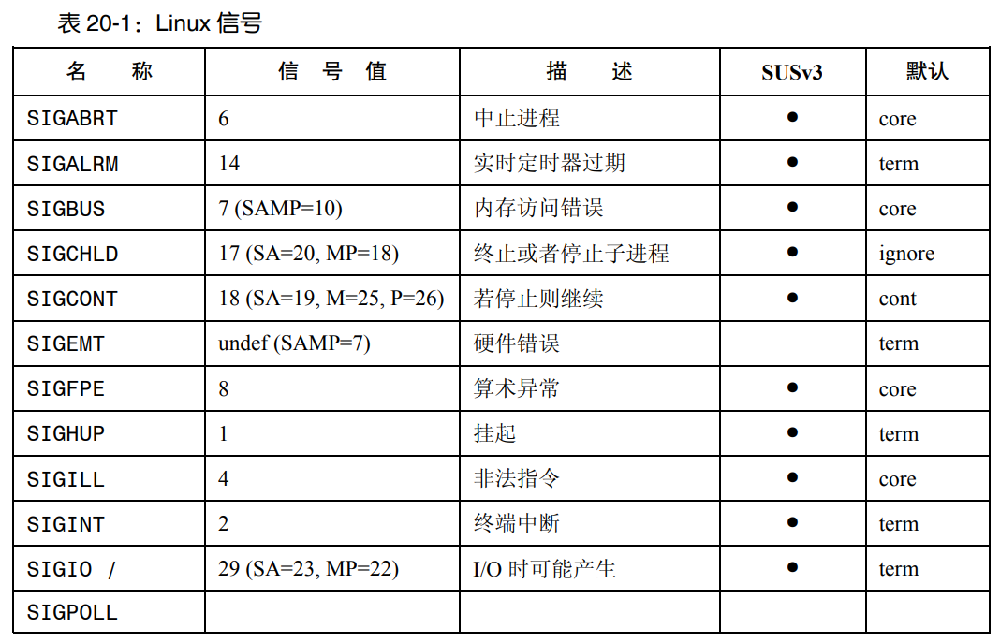

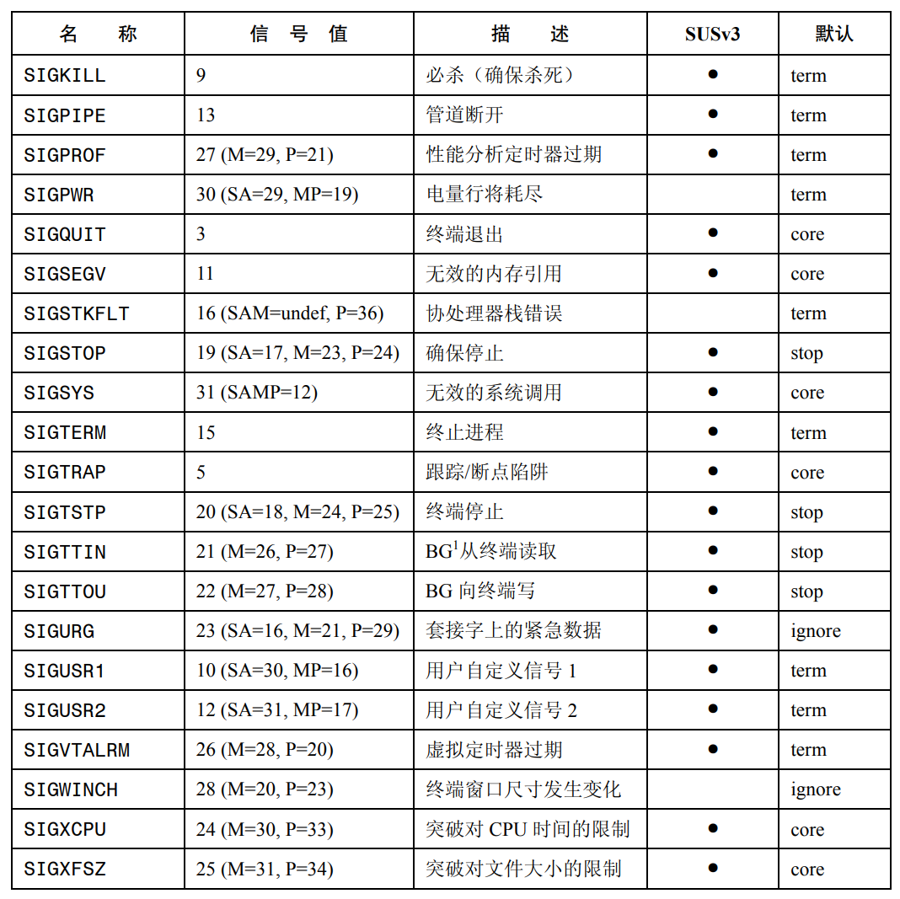

### 改变信号处置：signal()

该函数不如sigaction()，在不用UNIX下存在差异，强烈推荐使用sigaction()建立信号处理器。

```c
#include <signal.h>
void (*signal(int sig,void (*handler)(int)))(int);
```

第一个参数 sig，标识希望修改处置的信号编号。

第二个参数 handler，则标识信号抵达时所调用函数的地址。该函数无返回值（void），并接收一个整型参数。

signal()的返回值是之前的信号处置。

信号处理函数一般为以下形式，函数可以任取，与signal中相同即可

```c
void handler(int sig)
{
	/* Code for the handler */
}
```

### 信号处理器简介

调用信号处理器程序，可能会随时打断主程序流程；内核代表进程来调用处理器程序，当处理器返回时，主程序会在处理器打断的位置恢复执行。（类似于stm32中的中断服务函数）

> 程序清单 20-1：为 SIGINT 信号安装一个处理器程序  signals/ouch.c

信号处理器程序的整形参数（int sig）用于判定引发处理器调用的是何种信号，如果只有存在一种信号，该参数无效。程序20-2将会演示使用方法。

> 程序清单 20-2：为两个不同信号建立同一处理器函数 signals/intquit.c

==一般绝不会再信号处理器程序中使用stdio函数，例如printf()函数==，原因在21.1.2节

### 发送信号：kill()

```c
#include <signal.h>
int kill(pid_t pid,int sig);
```

pid参数标识一个或者多个进程，有以下四种情况

1. 如果pid > 0，那么会发送信号给由 pid **指定的进程**
2. 如果pid = 0，那么会发送信号给与调用进程**同组的每个进程**，包括调用进程自身
3. 如果pid < -1，那么会向**组 ID** 等于该 pid 绝对值的进程组内所有下属进程发送信号
4. 如果pid = -1，调用进程有权将信号发往的**每个目标进程**， 除去 init（进程 ID 为 1）和调用进程自身，称为广播信号

sig参数指定了要发送的信号

### 检查进程的存在

 kill()系统调用将sig指定为0，kill()回去检查是否能向目标进程发送信号。

可以使用其他技术来检查进程是否运行

- wait()系统调用
- 信号量和排他文件锁
- 诸如管道和 FIFO 之类的 IPC 通道
- /proc/PID 接口

### 发送信号的其他方式：raise()和killpg()

```c
#include <signal.h>
int raise(int sig);
```

raise()可以向自身发送信号，相当于`kill(getpid(),sig);`

调用 raise()唯一可能发生的错误为 EINVAL（非0值），即sig无效。

> 程序清单 20-3：使用 kill()系统调用 signals/t_kill.c

```c
#include <signal.h>
int killpg(pid_t pgrp,int sig);
```

killpg()相当于`kill(-pgrp,sig)`;如果指定 pgrp 的值为 0，那么会向调用者所属进程组的所有进程发送此信号。

### 显示信号描述

```c
#define _BSD_SOURCE
#include <signal.h>
extern const char *const sys_siglist[];

#define _GNU_SOURCE
#include <string.h>
char *strsignal(int sig);
```

每个信号都有一串与之相关的可打印说明。

可以使用sys_siglist[SIG...]来获取描述，或者使用strsignal()函数。

```c
#include <signal.h>
void psignal(int sig,const char *msg);
```

psignal()函数（在标准错误设备上）所示为 msg 参数所给定的字符串，后面跟有一个冒号， 随后是对应于 sig 的信号描述。

### 信号集

多个信号可使用一个称之为信号集的数据结构来表示，其系统数据类型为 sigset_t

```c
#include <signal.h>
int sigemptyset(sigset_t *set);
int sigfillset(sigset_t *set);
```

返回值 0 成功；-1失败

必须使用 sigemptyset()或者 sigfillset()来初始化信号集。

---

```c
#include <signal.h>
int sigaddset(sigset_t *set,int sig);
int sigdelset(sigset_t *set,int sig);
```

返回值 0 成功；-1失败

使用 sigaddset()和 sigdelset()函数向一个集合中添加或者移除单个信号。

---

```c
#include <signal.h>
int sigismember(const sigset_t *set,int sig);
```

sigismember()函数用来测试信号 sig 是否是信号集 set 的成员。

如果是set中的一员返回1，否则返回0

---

```c
#define _GNU_SOURCE
#include <signal.h>
int sigandset(sigset_t *set,sigset_t *left,sigset_t *right);
int sigorset(sigset_t *dset,sigset_t *left,sigset_t *right);
int sigisemptyset(const sigset_t *set);
```

- sigandset()将 left 集和 right 集的交集置于 dest 集。

- sigorset()将 left 集和 right 集的并集置于 dest 集。

- 若 set 集内未包含信号，则 sigisemptyset()返回 true。

> 程序清单 20-4：显示信号集的函数 signals/signal_functions.c

### 信号掩码（阻塞信号传递）

```c
#include <signal.h>
int sigprocmask(int how,const sigset_t *set,sigset_t oldset);
```

使用 sigprocmask()函数既可修改进程的信号掩码，又可获取现有掩码，或者两重功效兼具。

how 参数指定了 sigprocmask()函数想给信号掩码带来的变化，有以下三个可选项。

- **SIG_BLOCK** 将 set 指向信号集内的指定信号添加到信号掩码中。
- **SIG_UNBLOCK**  将 set 指向信号集中的信号从信号掩码中移除。
- **SIG_SETMASK**  将 set 指向的信号集赋给信号掩码。

若 oldset 参数不为空，则其指向一个 sigset_t 结构缓冲区，用于返回之前的信号掩码。

如果想**获取信号掩码**而又对其不作改动，那么可将 set 参数指定为空，这时将忽略 how 参数。

sigprocmask()函数不会区关注SIGKILL和SIGSTOP，除此之外都可以被阻塞。

```c
//Code20-5 展示阻塞信号传递
sigset_t blockSet,prevMask;

sigemptyset(&vlockSet);
sigaddset(&blockSet,SIGINT);

// 阻塞SIGINT,保存上一次的信号掩码
if(sigprocmask(SIG_BLOCK<&blockSet,&prevMask) == -1)
	errExit("sigprocmask1");

//写不应该被SIGINT打断的代码

//恢复前一次信号，不阻塞SIGINT
if(siprocmask(SIG_SETMASK,&prevMask,NULL) == -1)
    errExit("sigprocmask2");
```

### 处于等待状态的信号

```c
#include <signal.h>
int sigpending(sigset_t *set);
```

sigpending()系统调用为调用进程返回处于等待状态的信号集，并将其置于 set 指向的 sigset_t 结构中。随后可以使用sigismember()函数来检查 set。

### 不对信号进行排队处理

sig_sender.c可以接收四个命令行参数，./sig_sender PID num-sigs sig-num [sig-num2]

第一个参数是程序发送信号的目标进程 ID。第二个参数则指定发送给目标进程的信号数量。 第三个参数指定发往目标进程的信号编号。如果还提供了一个信号编号作为第四个参数。

> 程序清单 20-6：发送多个信号 signals/sig_sender.c
>
> 程序清单 20-7：捕获信号并对其计数  signals/sig_receiver.c

### 改变信号处置：sigaction()

sigaction()相比signal()更加复杂灵活，移植性好

```c
#include <signal.h>
int sigaction(int sig,const struct sigaction *act,struct sigaction *oldact);
```

sig 参数标识想要获取或改变的信号编号。

act和oldact参数都是一枚指针，有如下的数据结构

```c
struct sigaction
  {
    /* Signal handler.  */
#if defined __USE_POSIX199309 || defined __USE_XOPEN_EXTENDED
    union
      {
	/* Used if SA_SIGINFO is not set.  */
	__sighandler_t sa_handler;
	/* Used if SA_SIGINFO is set.  */
	void (*sa_sigaction) (int, siginfo_t *, void *);
      }
    __sigaction_handler;
# define sa_handler	__sigaction_handler.sa_handler
# define sa_sigaction	__sigaction_handler.sa_sigaction
#else
    __sighandler_t sa_handler;
#endif

    /* Additional set of signals to be blocked.  */
    __sigset_t sa_mask;

    /* Special flags.  */
    int sa_flags;

    /* Restore handler.  */
    void (*sa_restorer) (void);
  };
```

仅当 sa_handler 是信号处理程序的地址时，亦即 sa_handler 的取值在 SIG_IGN 和 SIG_DFL 之外，才会对 sa_mask 和 sa_flags 字段加以处理。 余下的字段 sa_restorer，则不适用于应用程序。

sa_restorer字段仅供内部使用，用以确保当信号处理器程序完成后，会去调用专用的 sigreturn()系统调用，借此来恢复进程的执行上下文。

sa_mask 字段定义了一组信号，在调用由 sa_handler 所定义的处理器程序时将阻塞该组信号。

sa_flags 字段是一个位掩码，指定用于控制信号处理过程的各种选项。该字段包含的位如下（可以相或（|））。

SA_NOCLDSTOP 、SA_NOCLDWAIT、SA_NODEFER 、SA_ONSTACK 、SA_RESETHAND、SA_RESTART 、SA_SIGINFO

### 等待信号：pause()

```c
#include <unistd.h>
int pause(void);
```

调用 pause()将暂停进程的执行，直至信号处理器函数中断该调用为止。

## Chapter21 信号：信号处理器函数

### 设计信号处理器函数

两中常见的设计：

1. 信号处理器函数设置全局性标志变量并退出。主程序对此标志进行周期性检查，一旦置位随即采取相应动作。
2. 信号处理器函数执行某种类型的清理动作，接着终止进程或者使用非本地跳转将栈解开并将控制返回到主程序中的预定位置。

### 可重入函数和异步信号安全函数

#### 可重入和非可重入函数

**可重入：**

如果同一个进程的多条线程可以同时安全地调用某一函数，那么该函数就是可重入的。此处，“安全”意味着，无论其他线程调用该函数的执行状态如何，函数均可产生预期结果。

**不可重入：**

更新**全局变量**或**静态数据结构**的函数可能是不可重入的。例如malloc()函数族和stdio函数库成员就不是可重入。

> 程序清单 21-1：在 main()以及信号处理函数中调用不可重入的函数 signals/nonreentrant.c

#### 标准的异步信号安全函数

异步信号安全的函数是指当从信号处理器函数调用时，可以保证其实现是安全的。

下表均为各种标准要求实现为异步信号安全的函数。


编写处理器函数有以下两种选择

- 确保信号处理器函数代码本身是可重入的，且只调用异步信号安全的函数。
- 当主程序执行不安全函数或是去操作信号处理器函数也可能更新的全局数据结构时， 阻塞信号的传递。

第2种在大型程序中难以实现，所以将规则简化为在==信号处理器函数中绝不调用不安全的函数==。

#### 信号处理器函数内部对 errno 的使用

errno在信号处理器函数中可以会改变，所以可以在函数入口处保存errno值，在出口处恢复之前的errno值

```c
void handler(int sig)
{
	int savedErrno;
	saveErrno = errno;
	
	/* code might modify errno */
    
	errno = savedErrno;
}
```

#### 全局变量和 sig_atomic_t 数据类型

一种常见的设计是，信号处理器函数只做一件事情，设置全局标志。 主程序则会周期性地检查这一标志，并采取相应动作来响应信号传递（同时清除标志）。当信号处理器函数以此方式来访问全局变量时，应该总是在声明变量时使用 volatile 关键字，从而防止编译器将其优化到寄存器中。

为了保证原子性，提供了一种整型数据类型sig_atomic_t，例如可以使用`volatile sig_atomic_t flag;`

！！！注意，C语言的++和--不在保障范围内。（硬件架构原因）

### 终止信号处理器函数的其他方法

1. 使用_exit()终止进程。处理器函数事先可以做一些清理工作。（不要使用exit(）不是安全函数)
2. 使用kill()发送信号来杀掉进程
3. 从信号处理函数中执行非本地跳转
4. 使用abort()函数终止进程，产生核心转储

#### 在信号处理器函数中执行非本地跳转

Linux 遵循 System V 的特性，longjmp()不会将信号掩码恢复，亦即在离开处理器函数时不会对遭阻塞的信号解除阻塞。使用 longjmp()来退出信号处理器函数将有损于程序的可移植性。

```c
#include <setjmp.h>
int sigsetjmp(sigjmp_buf env,int savesigs);
void siglongjmp(sigjmp_buf env,int val);
```

函数 sigsetjmp()和 siglongjmp()的操作与 setjmp()和 longjmp()类似。唯一的区别是参数 env 的类型不同（是 sigjmp_buf 而不是 jmp_buf），并且 sigsetjmp()多出一个参数 savesigs。如果指定 savesigs 为非 0，那么会将调用 sigsetjmp()时进程的当前信号掩码保存于 env 中，之后通过指定相同 env 参数的 siglongjmp()调用进行恢复。如果 savesigs 为 0，则不会保存和恢复进程的信号掩码。

> 程序清单 21-2：在信号处理器函数中执行非本地跳转 signals/sigmask_longjmp.c

#### 异常终止进程：abort()

```c
#include <stdlib.h>
void abort(void);
```

函数 abort()通过产生 SIGABRT 信号来终止调用进程。对 SIGABRT 的默认动作是产生核心转储文件并终止进程。

### 在备选栈中处理信号：sigaltstack()

调用信号处理器函数，会在进程栈中创建一帧，但是如果接近栈的上限RLIMIT_STACK时，需要使用备用栈。

当进程对栈的扩展试图突破其上限时，内核将为该进程产生 SIGSEGV 信号。栈空间已经耗尽，就不会调用处理器函数了。如果要确保SIGSEGV信号处理器函数的调用，需要做以下的工作。

1. 分配一块被称为“备选信号栈”的内存区域，作为信号处理器函数的栈帧。
2. 调用 sigaltstack()，告之内核该备选信号栈的存在。
3. 在创建信号处理器函数时指定 SA_ONSTACK 标志，亦即通知内核在备选栈上为处理器函数创建栈帧。

```c
#include <signal.h>
int sigaltstack(const stack_t *sigstack,stack_t *old_sigstack);
```

利用系统调用 sigaltstack()，既可以创建一个备选信号栈，也可以将已创建备选信号栈的相关信息返回。

参数 sigstack 所指向的数据结构描述了新备选信号栈的位置及属性。参数 old_sigstack 指向的结构则用于返回上一备选信号栈的相关信息（如果存在）。两个参数之一均可为 NULL。

```c
typedef struct{
	void *ss_sp;		/* Starting addresss of alternate stack */
	int ss_flags;		/* Flags:SS_ONSTACK,SS_DISABLE */
	size_t ss_size;		/* Size of alternate stack */
}stack_t;
```

字段 ss_sp 和 ss_size 分别指定了备选信号栈的位置和大小。内核会自动对齐。

备选信号栈可以静态分配，也可以动态分配。常量SIGSTKSZ为栈大小典型值为8192，常量MINSSIGSTKSZ为处理器函数最小值为2048。（Linux/x86-32）

flag参数可选：

- SS_ONSTACK 如果在获取已创建备选信号栈的当前信息时该标志已然置位，就表明进程正在备选信号栈上执行。
- SS_DISABLE 在 old_sigstack 中返回，表示当前不存在已创建的备选信号栈。如果在 sigstack 中指定，则会禁用当前已创建的备选信号栈。

> 程序清单 21-3：使用 sigaltstack() signals/t_sigaltstack.c

该程序中命令ulimit负责移除 shell 之前可能设置的任何 RLIMIT_STACK 资源限制。

### SA_SIGINFO 标志

在使用 sigaction()创建处理器函数时设置了 SA_SIGINFO 标志，可以在信号处理函数中获取该信号的一些信息。

函数声明需改成`void handler(int sig,siginfo_t *siginfo,void *ucontext);`

第 1 个参数 sig 表示信号编号。第 2 个参数 siginfo 是用于提供信号附加信息的一个结构。该结构会与最后一个参数 ucontext 一起。

下面是使用SA_SIGINFO创建信号处理器函数的例子

```c
struct sigaction act;

sigemptyset(&act.sa_mask);
act.sa_sigaction = handler;
act.sa_flags = SA_SIGINFO;

if(sigaction(SIGINT,&act,NULL) == -1)
	errExit("sigaction");
```

#### 结构siginfo_t

```c
typedef struct {
    int si_signo; /* Signal number */
    int si_code;  /* Signal code */
    int si_trapno;		/*Trap number for hardware-generated signal
    					(unused on most architectures)*/
    union sigval si_value;	/*Accompanying data from sigqueue()*/
    pid_t si_pid;		/*Process ID of sending process*/
    uid_t si_uid;		/*Real user ID of sender */
    int si_errno;		/*Error number (generally unused)*/
    void* si_addr;		/*Address that generated signal
						 (hardware-generated signals only)*/
    int si_overrun;		/* Overrun count (Linux 2.6，POSIX timers) */
    int si_timerid;		/*(Kernel-internal) Timer ID
    					(Linux 2.6，POSIX timers)*/
    long si_band;		/*Band event (SIGPOLL/SIGIO)*/
    int si_fd;			/*File descriptor (SIGPOLL/SIGIO)*/
    int si_status;		/*Exit status or signal (SIGCHLD)*/
    clock_t si_utime;	/*User CPU time (SIGCHLD) */
    clock_t si_stime;	/*System CPu time (SIGCHLD)*/
} siginfo_t;
```

该结构体位于<bits/types/siginfo_t.h>

#### 参数ucontext

一个指向ucontext_t类型的结构指针（定义于<ucontext.h>）

### 系统调用的中断与重启

在系统调用遭信号处理器中断的事件中，利用如下代码来手动重启系统调用。read()会阻塞到数据输入为止。

```c
while((cnt = read(fd,buf,BUF_SIZE))  == -1 && errno == EINTR)
	continue;		/* Do nothing loop body */

if(cnt == -1)		/* read() failed with other than EINTR */
	errExit("read");
```

如果需要频繁使用上述代码，那么定义成如下宏会很方便：

`#define NO_EINTR(stmt) while((stmt) == -1 && errno == EINTR);`

即使使用了宏，如果需要为每个阻塞的系统调用添加代码还是很麻烦，所以可以调用指定 了 SA_RESTART 标志的 sigaction()来创建信号处理器函数，从而令内核代表进程自动重启系统调用，还无需处理系统调用可能返回的 EINTR 错误。

#### SA_RESTART 标志对哪些系统调用（和库函数）有效

因为历史原因，不是所有的系统调用都可以通过该方式重启。具体需要自己在调查一下。

#### 为信号修改 SA_RESTART 标志

```c
#include <signal.h>
int siginterrupt(int sig,int flag);
```

若参数 flag 为真（1），则针对信号 sig 的处理器函数将会中断阻塞的系统调用的执行。如 果 flag 为假（0），那么在执行了 sig 的处理器函数之后，会自动重启阻塞的系统调用。

SUSv4 标记 sigterrupt()为已废止，并推荐使用 sigaction()加以替代。

#### 对于某些 Linux 系统调用，未处理的停止信号会产生 EINTR 错误

如果系统调用遭到阻塞，并且进程因信号（SIGSTOP、SIGTSTP、SIGTTIN 或 SIGTTOU）而停止，之后又因收到 SIGCONT 信号而恢复执行时，就会发生这种情况。

## Chapter22 信号：高级特性

### 核心转储文件

所谓核心转储是内含进程终止时内存映像的一个文件。将该内存映像加载到调试器中，即可查明信号到达时程序代码和数据的状态。

引发程序生成核心转储文件的方式之一是键入退出字符（通常为 Control-\），从而生成 SIGQUIT 信号。子线程被SIGQUIT所杀，并生成核心转储文件，在shell中显示”Quit（core dump）“的信息。

核心转储文件创建于进程的工作目录中，名为 core。这是核心转储文件的默认位置和名称。

#### 不产生核心转储文件的情况

- 进程对于核心转储文件没有写权限。
- 存在一个同名、可写的普通文件，但指向该文件的（硬）链接数超过一个。
- 将要创建核心转储文件的所在目录并不存在。
- 把进程“核心转储文件大小”这一资源限制置为 0。
- 将进程“可创建文件的大小”这一资源限制设置为 0。
- 对进程正在执行的二进制可执行文件没有读权限。
- 以只读方式挂载当前工作目录所在的文件系统，或者文件系统空间已满，又或者 i-node 资源耗尽。
- Set-user-ID（set-group-ID）程序在由非文件属主（或属组）执行时，不会产生核心转储文件。

#### 为核心转储文件命名：/proc/sys/kernel/core_pattern

根据 Linux 特有的/proc/sys/kernel/core_pattern 文件所包含的格式化字符串来控制对系统上生成的所有核心转储文件的命名。

### 传递、处置及处理的特殊情况

#### SIGKILL 和 SIGSTOP

SIGKILL 信号的默认行为是终止一个进程，SIGSTOP 信号的默认行为是停止一个进程，二者的默认行为均无法改变。同样不能被阻塞。

#### SIGCONT 和停止信号

如果一个进程处于停止状态，那么一个 SIGCONT 信号的到来总是会促使其恢复运行，即使该进程正在阻塞或者忽略 SIGCONT 信号。

#### 由终端产生的信号若已被忽略，则不应改变其信号处置

如果程序在执行时发现，已将对由终端产生信号的处置置为了 SIG_IGN（忽略），那么程序通常不应试图去改变信号处置。与之相关的信号有：SIGHUP、SIGINT、SIGQUIT、SIGTTIN、 SIGTTOU 和 SIGTSTP。

### 可中断和不可中断的进程睡眠状态

休眠分为两种

- TASK_INTERRUPTIBLE：进程正在等待某一事件。ps命令STAT（进程状态）字段标记为字母 S。
- TASK_UNINTERRUPTIBLE：进程正在等待某些特定类型的事件，比如磁盘 I/O 的完成。ps命令STAT 字段标记为字母 D。

Linux2.6.25

- TASK_KILLABLE：该状态类似于 TASK_UNINTERRUPTIBLE，但是会在进程收到一个致命信号（即一个杀死进程的信号）时将其唤醒。

### 硬件产生的信号

硬件异常可以产生 SIGBUS、SIGFPE、SIGILL，和 SIGSEGV 信号，调用 kill()函数来发送此类信号是另一种途径，但较为少见。

正确处理硬件产生信号的方法有二：要么接受信号的默认行为（进程终止）；要么为其编写不会正常返回的处理器函数。

除了正常返回之外，终结处理器执行的手段还包括调用_exit() 以终止进程，或者调用 siglongjmp()，确保将控制传递回程序中（产生信号的指令位置之外）的某一位置。

### 信号的同步生成和异步生成

同步生成——立即传递信号，例如之前提到的硬件异常信号，使用 raise()、kill()或者 killpg()向自身发送信号。

### 信号传递的时机与顺序

#### 何时传递一个信号？

- 进程在前度超时后，再度获得调度时（即，在一个时间片的开始处）。
- 系统调用完成时（信号的传递可能引起正在阻塞的系统调用过早完成）。

#### 解除对多个信号的阻塞时，信号的传递顺序

当sigprocmask()解除了对多个等待信号的阻塞，内核会按照信号编号的升序传递信号。

例如SIGINT（编号2号）总是先于SIGQUIT（编号3号）

### signal()的实现与可移植性

早期的signal()并不可靠

1. 如果想要在同一信号再度光临再次调用信号处理器函数函数，程序员必须在信号处理器函数内部调用signal()，显式重建处理器函数
2. 在信号处理器执行期间，不会对新产生的信号进行阻塞。同类信号会对处理器函数递归调用，过多的调用会导致堆栈溢出。

#### glibc 的一些细节

调用老版本不可靠语义的信号函数，可以使用sysv_signal()函数，参数与signal()相同。

### 实时信号

相较于标准信号，优势有：

- 使用范围扩大，自定义目的，任意使用的两个信号为：SIGUSR1 和 SIGUSR2。
- 采用队列化管理。
- 发送实时信号，可为信号指定伴随数据（整型数或者指针值），供接收进程的信号处理器获取。
- 不同实时信号的传递顺序得到保障。编号越小，优先级越高。

Linux 内核则定义了 32 个不同的实时信号，编号范围为 32～63。

程序员不能将实时信号的整型值写死，因为实时信号范围随着UNIX不同而不同，可以使用SIGRTMIN+x的形式表示。例如表达式 （SIGRTMIN + 1）就表示第二个实时信号。

#### 对排队实时信号的数量限制

不得少于_POSIX_SIGQUEUE_MAX（定义为 32）

#### 使用实时信号

- 发送进程使用 sigqueue()系统调用来发送信号及其伴随数据。
- 要为该信号建立了一个处理器函数，接收进程应以 SA_SIGINFO 标志发起对 sigaction() 的调用。因此，调用信号处理器时就会附带额外参数，其中之一是实时信号的伴随数据。

#### 发送实时信号

```c
#define _POXIX_C_SOURCE 199309
#include <signal.h>
int sigqueue(pid_t pid,int sig,const union sigval value);
```

使用 sigqueue()发送信号所需要的权限与 kill()的要求一致。

不同于 kill()，sigqueue()不能通过将 pid 指定为负值而向整个进程组发送信号。

```c
union sigval{
	int sival_int;		/* Inter value for accompanying data */
	void *sival_ptr;	/* Pointer value for accompanying data */
};
```

> 程序清单 22-2：使用 sigqueue()发送实时信号 signals/t_sigqueue.c

#### 处理实时信号

以用带有 3 个参数的信号处理器函数来处理实时信号，其建立则会用到 SA_SIGINFO 标志。

一旦采用了 SA_SIGINFO 标志，传递给信号处理器函数的第二个参数将是一个 siginfo_t 结构，内含实时信号的附加信息。

> 程序清单 22-3：处理实时信号 signals/catch_rtsigs.c

### 使用掩码来等待信号：sigsuspend()

```c
#include <signal.h>
int sigsuspend(const sitset_t *mask);
```

sigsuspend()系统调用将以 mask 所指向的信号集来替换进程的信号掩码，然后挂起进程的执行，直到其捕获到信号，并从信号处理器中返回。一旦处理器返回，sigsuspend()会将进程信号掩码恢复为调用前的值。

> 使用 sigsuspend() signals/t_sigsuspend.c

### 以同步方式等待信号

```c
#define _POSIX_C_SOURCE 199309
#include <signal.h>
int sigwaitinfo(const sigset_t *Set,siginfo_t *info);
```

sigwaitinfo()系统调用挂起进程的执行，直至 set 指向信号集中的某一信号抵达。如果调用 sigwaitinfo()时，set 中的某一信号已经处于等待状态，那么 sigwaitinfo()将立即返回。将返回信号编号作为函数结果。如果info参数不为空，会指向初始化处理的siginfo_t结构。

可以省去编写信号处理器函数。

> 程序清单 22-6：使用 sigwaitinfo()来同步等待信号 signals/t_sigwaitinfo.c

```c
#define _POSIX_C_SOURCE 199309
#include <signal.h>
int sigtimewait(const sigset_t *Set,siginfo_t *info,const struct timespec *timeout);
```

sigtimedwait()系统调用是 sigwaitinfo()调用的变体。唯一的区别是 sigtimedwait()允许指定等待时限。

### 通过文件描述符来获取信号

```c
#include <sys/signalfd.h>
int signalfd(int fd,const sigset_t *mask,int flags);
```

(非标准函数)利用该调用可以创建一个特殊文件描述符，发往调用者的信号都可从该描述符中读取。

返回值为一个特殊文件描述符。如果指定fd为-1，那么 signalfd()会创建一个新的文件描述符。

flag参数

- SFD_CLOEXEC 为新的文件描述符设置close-on-exec
- SFD_NONBLOCK 以确保不会阻塞未来的读操作。既省去了一个额外的 fcntl()调用，又获得了相同的结果。

可以通过read()去读取signalfd_siginfo结构。

> 程序清单 22-7：使用 signalfd()来读取信号 signals/signalfd_sigval.c

当不再需要 signalfd 文件描述符时，应当关闭 signalfd 以释放相关内核资源。

### 利用信号进行进程间通信

信号是进程间通信（IPC）的方式之一，但是信号编程既繁且难。

缺陷：

- 信号的异步本质就意味着需要面对各种问题，可重入，竞态条件、在信号处理器中正确处理全局变量。
- 没有对标准信号进行排队处理。
- 携带信息有限，带宽太低。

## Chapter23 定时器与休眠

### 间隔定时器

```c
#include <sys/time.h>
int setitimer(int which,const struct itimerval *new_value,struct itimerval *old_value);
```

系统调用 setitimer()创建一个间隔式定时器（interval timer)。

which参数可选：

- ITIMER_REAL 创建以真实时间倒计时的定时器。到期时会产生 SIGALARM 信号并发送给进程。
- ITIMER_VIRTUAL 创建以进程虚拟时间倒计时的定时器。到期时会产生信号 SIGVTALRM。
- ITIMER_PROF 创建一个 profiling 定时器，以进程时间倒计时。到期时，则会产生 SIGPROF 信号。

对所有这些信号的默认处置（disposition）均会终止进程。

参数 new_value 和 old_value 均为指向结构 itimerval 的指针

```c
struct itimerval
{
	struct timeval it_interval;		/* Interval for periodic timer */
	struct timeval it_value;		/* Current value */
}
```

参数 new_value 的下属结构 it_value 指定了距离定时器到期的延迟时间。另一下属结构 it_interval 则说明该定时器是否为周期性定时器。如果it_interval的两个字段都是0，说明是一次性定时器，两者之一不为0，就是周期性定时器。

进程只能有上述3种定时器中的一种。修改已有定时器需要符合参数which中的类型。new_value.it_value字段置为0，将会屏蔽任何已有的定时器。

若参数 old_value 不为 NULL，则以其所指向的 itimerval 结构来返回定时器的前一设置。

```c
#include <sys/time.h>
int getitimer(int which,struct itimerval *curr_value);
```

系统调用 getitimer()返回由 which 指定定时器的当前状态，并置于由 curr_value 所指向的缓冲区中。

> SUSv4 废止了 getitimer()和 setitimer()，同时推荐使用 POSIX 定时器 API（23.6 节）。

> 程序清单 23-1：实时定时器的使用 timers/real_timer.c

#### 更为简单的定时器接口 alarm()

```c
#include <unistd.h>
unsigned int alarm(unsigned int seconds);
```

一次性定时器。参数seconds为定时器到期的秒数，到期会发送SIGALRM，返回值为前一设置剩余秒数。

调用 alarm(0)可屏蔽现有定时器。

#### setitimer()和 alarm()之间的交互

Linux中，alarm()和setitimer()在同一进程中共享同一实时定时器。都可以改变定时器设置。

### 定时器的调度及精度

传统意义上定时器精度受软件时钟频率的影响，如果不能与其倍数匹配，将向上取整。例如19毫秒的定时器，jiffy（软件时钟周期）为4毫秒，定时器将20毫秒过期一次。

#### 高分辨率定时器

现代Linux内核不在受软件时钟影响。Linux 内核可选择是否支持高分辨率定时器。如果选择支持（通过内核配置选项 CONFIG_HIGH_RES_TIMERS），那么本章各种定时器以及休眠接口的的精度则不再受内核 jiffy（软件时钟周期）的影响，可以达到底层硬件所支持的精度。

### 为阻塞操作设置超时

实时定时器的用途之一是为某个阻塞系统调用设置其处于阻塞状态的时间上限。

> 程序清单 23-2：运行设置了超时的 read()  timers/timed_read.c

### 暂停运行（休眠）一段固定时间

#### 低分辨率休眠：sleep()

```c
#include <unistd.h>
unsigned int sleep(unsigned int seconds);
```

如果休眠正常结束，sleep()返回 0。如果因信号而中断休眠，sleep()将返回剩余（未休眠） 的秒数。

#### 高分辨率休眠：nanosleep()

```c
#define _POSIX_C_SOURCE 199309
#include <time.h>
int nanosleep(const struct timespec *request,struct timespec *remain);
```

参数 request 指定了休眠的持续时间，其中tv_nsec 字段为纳秒值，取值范围在 0～999999999 之间。

该函数也可以被中断，此时返回值为-1，并且将errno置为EINTR。若参数remain不为NULL，则剩余时间放入该结构中。

### POSIX 时钟

Linux 中，调用此 API 的程序必须以==-lrt== 选项进行编译，从而与 librt（realtime，实时）函数库相链接。

#### 获取时钟的值：clock_gettime()

```c
#define _POSIX_C_SOURCE 199309
#include <time.h>
int clock_gettime(clockid_t clockid,struct timespec *tp);
int clock_getres(clockid_t clockid,struct timespec *res);
```

clock_gettime()获取时钟当前值

clock_getres()返回时钟分辨率

|          时钟ID          |                   描述                   |
| :----------------------: | :--------------------------------------: |
|      CLOCK_REALTIME      |          可设定的系统级实时时钟          |
|     CLOCK_MONOTONIC      |           不可设定的恒定态时钟           |
| CLOCK_PROCESS_CPUTIME_ID | 每进程 CPU 时间的时钟（自 Linux 2.6.12） |
| CLOCK_THREAD_CPUTIME_ID  | 每线程 CPU 时间的时钟（自 Linux 2.6.12） |

#### 设置时钟的值：clock_settime() 

```c
#define _POSIX_C_SOURCE 199309
#include <time.h>
int clock_settime(clockid_t clockid,const struct timespec *tp);
```

系统调用 clock_settime()利用参数 tp 所指向缓冲区中的时间来设置由 clockid 指定的时钟。

特权级进程可以设置CLOCK_REALTIME时钟。

#### 获取特定进程或线程的时钟 ID

```c
#define _XOPEN_SOURCE 600
#include <time.h>
int clock_getcpuclockid(pid_t pid,clockid_t *clockid);
```

参数 pid 为 0 时，clock_getcpuclockid()返回调用进程的 CPU 时间时钟 ID。

```c
#define _XOPEN_SOURCE 600
#include <pthread.h>
#include <time.h>
int pthread_getcpuclockid(pthread_t thread,clockid_t *clockid);
```

参数 thread 是 POSIX 线程 ID，用于指定希望获取的 CPU 时钟 ID 所从属的线程。返回的时钟 ID 存放于 clockid 指针所指向的缓冲区中。

#### 高分辨率休眠的改进版：clock_nanosleep() 

该函数为Linux特有

```c
#define _XOPEN_SOURCE 600
#include <time.h>
int clock_nanosleep(clockid_t clockid,int flags,
					const struct timespec *request,struct timespec *remain);
```

参数 request 及 remain 同 nanosleep()中的对应参数目的相似。

默认情况下（即 flags 为 0），由 request 指定的休眠间隔时间是相对时间（类似于 nanosleep()）。

如果flag参数设置了TIMER_ABSTIME，request 则表示 clockid 时钟所测量的绝对时间。

指定TIMER_ABSTIME 时，不再（且不需要）使用参数 remain。如果信号处理器程序中断了 clock_nanosleep()调用，再次调用该函数来重启休眠时，request 参数不变。

**使用原因：**适用于需要准确定时的应用程序。如果只是先获取当前时间，计算与目标时间的差距，再以相对时间进行休眠，进程可能执行 到一半就被占先了，结果休眠时间比预期的要久。

### POSIX 间隔式定时器

之前的间隔定时器，都是经典UNIX中的。

接下来时POSIX.1b的定时器。

- 以系统调用 timer_create()创建一个新定时器，并定义其到期时对进程的通知方法。
- 以系统调用 timer_settime()来启动或停止一个定时器。
- 以系统调用 timer_delete()删除不再需要的定时器。

#### 创建定时器：timer_create() 

```c
#define _POSIX_C_SOURCE 199309
#include <signal.h>
#include <time.h>
int timer_create(clockid_t clockid,struct sigevent *evp,timer_t *timerid);
```

设置参数 clockid,可以使用表格中的，也可以使用clock_getcpuclocid()或 pthread_getcpuclockid()返回的 clockid 值。

参数timerid是函数返回时放置句柄。供后续调用使用。

参数evp可以决定定时器到期对应用程序的通知方式。

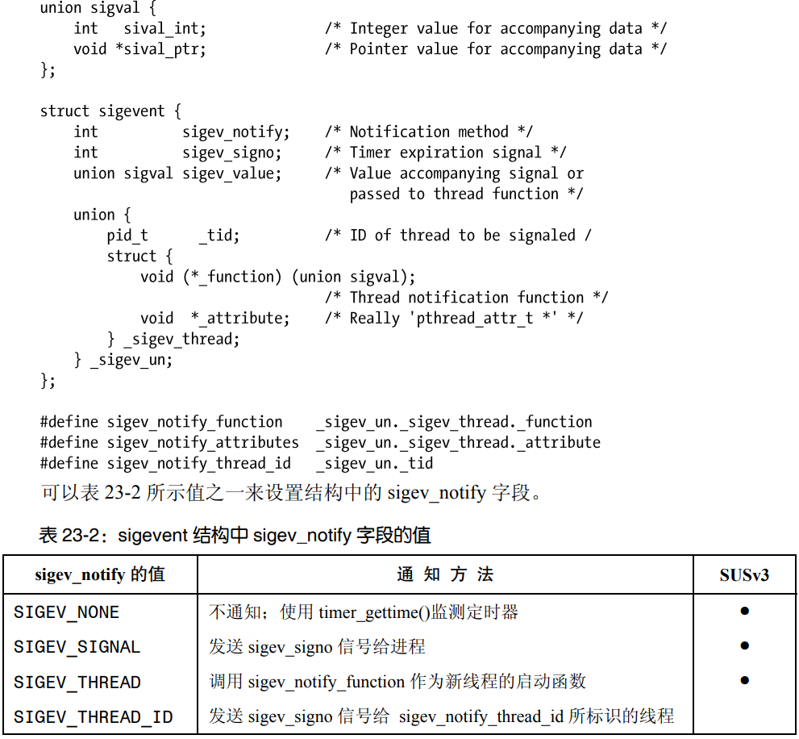

将参数 evp 置为 NULL，这相当于将 sigev_notify 置为 SIGEV_SIGNAL，同时将 sigev_signo置为 SIGALRM

#### 配备和解除定时器：timer_settime()

```c
#define _POSIX_C_SOURCE 199309
#include <time.h>
int timer_settime(timer_t timerid,int flags,const struct itimerspec *value,
				struct itimerspec *old_value);
```

函数 timer_settime()的参数 timerid 是句柄，由之前对 timer_create()的调用返回。

参数 value 和 old_value 则类似于函数 setitimer()的同名参数。

若将 flags 置为 0，则会将 value.it_value 视为始于 timer_settime()相对值。

如果将 flags 设为 TIMER_ABSTIME，那么 value.it_value 则是一个绝对时间。

#### 获取定时器的当前值：timer_gettime() 

```c
#define _POSIX_C_SOURCE 199309
#include <time.h>
int timer_gettime(timer_t timerid,struct itimerspec *curr_value);
```

curr_value 指针所指向的 itimerspec 结构中返回的是时间间隔以及距离下次定时器到期的时间。

#### 删除定时器：timer_delete()

```c
#define _POSIX_C_SOURCE 199309
#include <time.h>
int timer_delete(timer_t timerid);
```

每个 POSIX 定时器都会消耗少量系统资源。所以，一旦使用完毕，应当用 timer_delete()来移除定时器并释放这些资源。

> 程序清单 23-5：使用信号进行 POSIX 定时器通知 timers/ptmr_sigev_signal.c
>
> 程序清单 23-6：将“时间+间隔”的字符串转换为 itimerspec 的值 timers/itimerspec_from_str.c

所用到的strchr()函数。char *strchr(const char *str, int c)

在参数 **str** 所指向的字符串中搜索第一次出现字符 **c**（一个无符号字符）的位置。

#### 定时器溢出

```c
#define _POSIX_C_SOURCE 199309
#include <time.h>
int timer_getoverrun(timer_t timerid);
```

如何获取定时器溢出值：

- 调用timer_getoverrun()
- 使用随信号一同返回的结构 siginfo_t 中的 si_overrun 字段值。但此方法时Linux的拓展方法，无法移植。

#### 通过线程来通知

SIGEV_THREAD 标志允许程序从一个独立的线程中调用函数来获取定时器到期通知。

> 程序清单 23-7：使用线程函数发送 POSIX 定时器通知 timers/ptmr_sigev_thread

### 利用文件描述符进行通知的定时器：timerfd API 

Linux特有的API。

```c
#include <sys/timerfd.h>
int timerfd_create(int clockid,int flags);
```

创建一个定时器对象，返回指代对象的文件描述符。

参数flags可以设置为：TFD_CLOEXEC、TFD_NONBLOCK

使用完成之后应当使用close()关闭对应的文件描述符。

```c
#include <sys/timerfd.h>
int timerfd_settime(int fd,int flags,const struct itimerspec *new_value,
					struct itimerspec *old_value);
```

设置或者修改定时器。

参数new_value为定时器指定新设置。参数 old_value 可用来返回定时器的前一设置。

参数flag可以是0，也可以是为 TFD_TIMER_ABSTIME，绝对时间。

```c
 #include <sys/timerfd.h>
 int timerfd_gettime(int fd,struct itimerspec *curr_value);
```

系统调用 timerfd_gettime()返回文件描述符 fd 所标识定时器的间隔及剩余时间。放入curr_value指向的结构体中。

#### timerfd 与 fork()及 exec()之间的交互

调用 fork()期间，子进程会继承 timerfd_create()所创建文件描述符的拷贝。这些描述符与父进程的对应描述符均指代相同的定时器对象，任一进程都可读取定时器的到期信息。

#### 从 timerfd 文件描述符读取

使用read()，需要缓冲区足够容纳一个无符号8字节整型（uint64_t)

> 程序清单 23-8：使用 timerfd API timers/demo_timerfd.c
