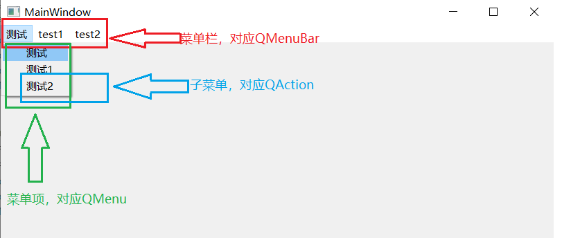

# 安装教程和学习教程

本文是我自己在学习QT的时候的心得，基本依照以下博客或者教程编写，方便开发。

> [(4条消息) qt6.4.0+visual studio2022+opencv配置教程（2022年最新版）_~幻化成风~的博客-CSDN博客_qt最新版本](https://blog.csdn.net/memorywithyou/article/details/126607163?spm=1001.2014.3001.5506)

> [【北京迅为】嵌入式学习之QT学习篇](https://www.bilibili.com/video/BV1tp4y1i7EJ?p=7&vd_source=b861809de5579169c2e8682cde41b2cd)

> [收藏】QT图形框架编程开发（层层到肉）_C++图形用户界面开发框架](https://www.bilibili.com/video/BV1Wf4y1Y7uh/?p=3&share_source=copy_web&vd_source=b861809de5579169c2e8682cde41b2cd)

***
# 开发中遇到一些问题

1. **遇到警告：**QT警告**Slots named on_foo_bar are error prone**

    **原因：**

    这个警告的出现，是因为我们在处理信号–槽关系时，是通过 ui designer中的"Go to slot" ，让程序自动生成。
    而这种自动生成的弱点就是也许有一天，你在 ui designer中改了控件的名字，但此时编译也不会报错。程序还是正常跑，编译也不提示错误。
    这样，控件就相当于连不到槽函数上去了，就失效了。

    **解决方法：**

    - 不要通过ui designer的 “Go to slot” 自动生成 信号–槽的连接关系。手动建立该关系即可。例如：
        connect(toolButton, &QPushButton::clicked,
        this, &YourClassName::nameOfYourSlot);
    - 不要管这个警告，无视他就行了。因为这只是一个善意的提醒。


2. **问题：**在开发Crucis上位机的时候，QPlainTextEdit控件显示的效果与正点原子差距较大，以下为两者比较图

    

    <center><p>自制的上位机</p></center>


<center><p>正点原子的XCOM</p></center>

从中会发现两个问题，第一是换行，源代码都是\r\n，但是自制上位机明显多换了一行；第二是自制上位机出现了串行的问题，J 2的数据到了下一行，这样会使得后面的数据库无法分析和存储数据。

**解决：**我分析是QT中接收槽函数出现了问题，最后发现是readAll( )和appendPlainText( )两个函数的问题。我分别换成了readLine( )和insertPlainText( )才解决问题。

**具体分析：**

- 下位机发送都是一行行发，发送速度较快，readAll( )会使得把后面的一些数据都读走了，出现了串行问题，要限制一下读取范围。readLine( )就是读到第一个\n结束

- appendPlainText( )的函数功能是Appends a new paragraph with text to the end of the text edit.就是新建一个段落，所以出现了换行再换行的问题。而insertPlainText( )的函数功能是Convenience slot that inserts text at the current cursor position.就是在当前光标位置插入文本，效果就和正点原子的类似。

```c++
 QString buf;
    buf = QString(serialPort->readAll()); //应该换成readLine( )
    ui->ReceivePTE->appendPlainText(buf); //应该换成insertPlainText(buf)
```

3. **问题：**上位机在接收STM32数据的时候，传输速率和数据量还没到达最大，就已经出现了卡顿情况

    **解决：**

    具体要求是STM32上传数据到上位机，上位机需要分析头部数据，并且存入数据库，最后显示在Table View中

    ```c++
    /* 老程序，速度慢 */
    //如果是JY901的数据
    if(data.at(0) == 'J')
    {
     	//查询数据表中是否已经存在数据
        QString checkstr = QString("SELECT * FROM jy901 WHERE ID = '%1'").arg(data.at(1));
        QSqlQuery query(checkstr);
        if(query.next()) //存在数据，执行更新操作
        {
            QString updatestr = QString("UPDATE jy901 SET Data = '%2', X = %3, Y = %4, Z = %5 WHERE ID = %1")
                                .arg(data.at(1),data.at(2),data.at(3),data.at(4),data.at(5));
            query.exec(updatestr);
        }
        else
        {
            QString insertstr = QString("INSERT INTO jy901 VALUES(%1,'%2',%3,%4,%5)")
                                .arg(data.at(1),data.at(2),data.at(3),data.at(4),data.at(5));
            query.exec(insertstr);
        }
        //Table View显示函数
    }
    ```

    分析上述原始程序，每次读取到新数据就打开一次数据库并且写入（更新），同时还要显示在Table View中，这样十分耗时。例如，JY901的四组数据，每组数据来都需要打开关闭数据库4次，严重拖慢了整体速度。下面是对此程序的优化。

    ```c++
    if(data.at(0) == 'J')
    {
        //查询数据表中是否已经存在数据
        QString checkstr = QString("SELECT * FROM jy901 WHERE ID = '%1'").arg(data.at(1));
        QSqlQuery query(checkstr);
        if(query.next() == false)
        {
            QString insertstr = QString("INSERT INTO jy901 VALUES(%1,'%2',%3,%4,%5)")
                                .arg(data.at(1),data.at(2),data.at(3),data.at(4),data.at(5));
            query.exec(insertstr);
        }
        else
        {
            JYdatalist << data; //将数据存入容器中 这里的容器定义为QVector<QStringList> JYdatalist;
            JYnum+=1;
            if(JYnum == 4) //收集完数据
            {
                db.transaction();   //事务处理开始
                for(int i=0;i<4;i++)
                {
                    QString updatestr = QString("UPDATE jy901 SET Data = '%2', X = %3, Y = %4, Z = %5 WHERE ID = %1")
                               .arg(JYdatalist[i].at(1),JYdatalist[i].at(2),JYdatalist[i].at(3),JYdatalist[i].at(4),JYdatalist[i].at(5));
                    query.exec(updatestr);
                }
                db.commit();    //事务处理结束
                JYdatalist.clear();
                JYnum = 0;
    		   //Table View显示函数
         	}
    	}
    }
    ```

    经过优化过后的程序，主要使用了C++的STL容器和SQLite中的事务处理函数。将收集到的数据存入容器中，等收集完成后再开启事务一次性写入到数据库中。事务处理函数在处理大量数据时，有着显著的优势。

    

***

# VS和QTcreator之间的转化

- 可以实现从VS到QTcreator的导入，在项目处选择create .pro文件，同时取消勾选create .pri文件选项。然后返回项目文件夹，双击打开pro文件进入QTcreator，需要在pro文件中添加模块定义，例如QT+=core gui widget，即可编译运行。

- 也可以实现从QTcreator到VS的导入，将QT生成的pro文件路径(创建工程时使用qmake)。进入VS，在拓展处open QT project .pro。可能会存在中文编码问题，需要修改，可以参考视频

> [Qt 5.14.2 下载、安装、使用教程，Qt+vs2019开发环境搭建](https://www.bilibili.com/video/BV1r54y1G7m4?p=7&vd_source=b861809de5579169c2e8682cde41b2cd）

## Qmake与Cmake的区别
> [(4条消息) Qmake VS Cmake_vbskj的博客-CSDN博客_qmake和cmake区别](https://blog.csdn.net/vbskj/article/details/7792061)

***

# QT注意事项

1. QT使用qDebug打印

2. 如果是输入密码的话，需要将line edit中的`echomode`改成password

3. 在QT中main.cpp中的固定写法为：

    ```c++
    int main(int argc, char *argv[])
    {
        QApplication a(argc, argv);
        Widget w;
        w.setWindowTitle(QString("串口调试助手")); //该行用来更改窗口标题，可加可不加
        w.show();
        return a.exec();
    }
    ```
4.emit是Qt的关键字，标记当前是发射信号，例如 `emit mySignal();`

***
# ~~QT中文编码转换~~

- 在默认情况下，QT可以正确理解UFT-8的编码，将其自动转化为内部的Unicode编码，如果使用Windows中常用的GBK编码，将可能出现乱码问题。

- 通过QTextCodec实现编码转换

    ```c++
    Qtextcodec *codec = QTextCode::codeForName("GBK");
    QString string = code->toUnicode("GBK编码的中文字符串")
    ```

    > <font color=red>Tips:</font>此类在QT6中被移除，使用前需在pro文件中添加代码
    >
    > [QT6中QTextcodec头文件找不到 - AlexSun_2021 - 博客园 (cnblogs.com)](https://www.cnblogs.com/AlexSun-2021/p/16043500.html#:~:text=QT6中QTextcodec头文件找不到,选择QT5的兼容模块 然后再重新打开QT6，在你的项目代码上添加一句代码就可以了)

***

# 父窗口

父窗口的析构函数回自动销毁所有子窗口的对象，所以子窗口对象是通过new操作符创建的，可以不显式执行delete操作，不会造成内存泄漏。

## 常用的父窗口类

- QWidget
- WMainWindow （主窗口）
- QDialog（对话框）

## 设置窗口的位置和大小函数

`void move(int x,int y);`

`void resize(int x,int y);`

## 在父窗口上创建对象

举例在<font color="red">栈区</font>创建一个label

`Qlabel label("我是标签",&widget); //后续使用.操作符`

举例在<font color="red">堆区</font>创建一个label

`Qlabel* label = new Qlabel("我是标签",&widget); //后续使用->操作符`

***

# 信号、槽、关联

## 信号的定义

```c++
class XX:public QObject
{
    Q_OBJECT	//宏定义，源对象编译器，语法拓展
signals:
    void signal_func(); //信号函数
};
```

> <font color=red>Tips:</font>信号函数只需声明，不能写定义

## 槽的定义

```c++
class XX:public QObject
{
    Q_OBJECT	//宏定义，源对象编译器，语法拓展
public slots:
    void sslot_func(); //槽函数
};
```

> <font color=red>Tips:</font>槽函数可以连接到某个信号上，当信号被发射时，槽函数将被触发和执行，另外槽函数也可以当作普通成员函数调用

槽函数声明写在对应类的private slots下<font color =red>（目前VS中使用ui不能转到槽的操作）</font>

## 关联

- 自动关联	在ui界面右键选择转到槽，后面再生成的函数块中写入执行的代码

- 手动关联	使用connect函数 connect(A,SIGNAL(B),C,SLOT(D));    <font style = "background:green">当对象A发出信号B，执行对象C中的槽函数D</font>

    函数原型：

    `QMetaObject::Connection QObject::connect(const QObject *sender, const char *signal, const QObject *receiver, const char *method);`

    参数：

    - sender：信号发送对象指针
    
    - signal：要发送的信号函数，可以使用`SIGNAL`宏进行类型转换
    
    - receiver：信号接收对象的指针
    
    - method：接收信号后要执行的槽函数，可以使用`SLOT`宏进行类型转换
    

> <font color=red>Tips:</font>可以多对一或者一对多关联
>
> 前提是信号函数的参数个数要==大于或者等于==槽函数的参数个数（可以有缺省值）

***

# MainWindow添加菜单栏

**QMenuBar** --菜单栏类，即下图中红色区域标记，菜单栏类给窗口提供水平菜单栏，此菜单栏占用窗口上方区域，垂直高度不变，水平宽度为窗口宽度，可随窗口大小变化而变化。如下图中“测试”，“test1”，"test2"所在的栏几位QMenuBar

**QMenu** --菜单项，即下图中绿色区域，下图中“测试”,"test1","test2"都是一个独立的菜单，包含各个子菜单。**QMenu还可以用来创建弹出菜单**。

**QAction** --子菜单，即下图中蓝色区域标记的内容，一个子菜单对应一个操作。



<center><p>菜单示例</p></center>

一般使用QT创造师进行ui编辑，进入“设计”页面，进入如下图所示的界面，具体操作方法见如下两张图，**注意：输入菜单名称后一定要按==“Enter”==键才能生效**。


<center><p>ui设计界面操作</p></center>


<center><p>修改相关属性</p></center>

> [Qt基础之菜单栏 - kyzc - 博客园 (cnblogs.com)](https://www.cnblogs.com/kyzc/p/11962903.html)

***
# 事件

- 在Qt中，事件被封装成对象，所有的事件对象类型都继承自抽象类QEvent
- 当事件发生时，首先被调用的是QObject类中的虚函数event( )，其参数(QEvent)标识了具体的事件类型
- 在Qt桌面应用开发中，QWidget类覆盖了其基类中的event( )虚函数，并根据具体事件调用具体事件处理函数：
    - `void QWidget::mousePressEvent(QMouseEvent* e);//鼠标按下事件`
    - `void QWidget::mouseReleaseEvent(QMouseEvent* e);//鼠标抬起事件`
    - `void QWidget::mouseMoveEvent(QMouseEvent* e);//鼠标移动事件`
    - `void QWidget::paintEvent(QPaintEvent* e);//绘图事件`

## 绘图事件
- 通过绘图事件，可以实现自定义的图像绘制，即QWidget类的paintEvent()虚函数被调用

- 如果希望在自己的窗口中显示某个图像，在Qwidget的窗口子类中重写绘图事件函数paintEvent，在其中可用QPainter实现指定的图像绘制、渲染等操作

- rect和painter的坐标系不一致，会有偏移，使用改语句使得坐标系统一，具体代码见==案例五==

    ```c++
    rect.translate(ui->frame->pos());
    ```

## 定时器事件

1.Qt通过两套机制为应用程序提供定时服务

   - 定时器事件，由QObject提供
   - 定时器信号，由QTimer提供

2.通过定时器事件实现定时器

   `int QObject::startTimer(int interval);`启动定时器，每隔x毫秒返回定时器ID

   `void QObject::timerEvent(QTimerEvent*)[virtual];`定时器事件处理函数

   `void Qobject::killTimer(int id);`关闭参数ID的定时器

## 鼠标和键盘事件

### 鼠标事件

QWidget类定义了以下的虚函数提供对鼠标事件的处理，其参数QMouseEvent描述了鼠标事件的细节，如引发事件的鼠标按键、鼠标所在位置等

- `virtual void mousePressEvent(QMouseEvent* e);//鼠标按下`
- `virtual void mouseReleaseEvent(QMouseEvent* e);//鼠标抬起`
- `virtual void mouseDoubleClickEvent(QMouseEvent* e);//鼠标双击`
- `virtual void mouseMoveEvent(QMouseEvent* e);//鼠标移动`

### 键盘事件

QWidget类定义了以下虚函数提供对键盘事件的处理，其参数QKeyEvent描述了键盘事件细节，如引发事件的键盘按键、文本等

- `virtual void keyPressEvent(QKeyEvent* e);//按键按下`
- `virtual void keyReleaseEvent(QKeyEvent* e);//按键抬起`

***

# 使用外部资源

## 静态加载

1.导入素材

- 在项目上右键 添加文件，选择Qt->Qt Resource File

- 打开.prc文件，右键open in editor，对前缀进行保存，一般是/，然后导入文件

    > <font color=red>Tips:</font>静态加载一般适用于资源较少或者资源名有规律的情况下使用，存在大量的资源最好还是使用下面的动态加载

2.引用素材

- 在label上右键，改变样式表
- 点击添加资源旁边的小箭头，加入合适的资源


<center><p>添加资源的示例</p></center>

## 动态加载

当文件的名字不是按照顺序来的时候，就需要使用动态加载了，可以不需要列举所使用的全部资源，而是在程序执行的时候去搜索。

- 主要是使用QDir类实现，具体实现方法可以看==案例六==中的`loadPhotos`函数，该函数实现了在当然目录寻找图片，同时递归在子目录寻找图片。

- 案例六中还使用了QVector来存储图片，因为图片是不定个数的，使用普通数组容易造成浪费。

- 语法是`QVector<类> 变量名` 该容器也可以使用数组的方式访问，例如变量名[i]。

***

# 布局

水平布局 垂直布局 栅格布局  

如果纯代码实现，可以使用`QHBoxLayout`类以及`QVBoxLayout`类，以下为示例，水平布局器从左往右，垂直布局器从上往下。

```c++
    //创建水平布局器
    QHBoxLayout* layout = new QHBoxLayout(this);
    //按水平方向加入布局器
    layout->addWidget(m_editX);
    layout->addWidget(m_label);
    layout->addWidget(m_editY);
    layout->addWidget(m_button);
    layout->addWidget(m_editZ);
    setLayout(layout);

	//创建垂直布局器
    QVBoxLayout* layout = new QVBoxLayout(this);
    layout->addWidget(m_label);
    layout->addWidget(m_button);
    setLayout(layout);
```


布局的意义在于窗口缩放不会改变对象的相对位置。

因此需要合理布局，在ui文件中布局后编译会自动产生对应的C++代码。

***

# 界面的切换

在项目右键，创建文件，选择Qt设计师界面类。在新的界面中进行布局，可以使用按钮进行两个界面之间的切换。

假如新创建的窗口名为ctrl

1.包含头文件ctrl.h

2.在转换按键槽函数中写入以下代码实现切换

```c++
void Widget::xxxx_Slots()
{
    ctrl *ct = new ctrl;
    ct->setGeometry(this->geometry());
    ct->show();
}
```

3.在关闭按键槽函数中写入以下代码实现关闭

```c++
void ctrl::xxxx_Solts()
{
    this->close();
}
```
***
# 串口相关组件

## 添加串口相关头文件

在QT中使用串口组件，首先需要在项目.pro文件中添加一句`QT += serialport`，保存后会将相关文件添加进入项目中，同时在.h文件中引入下面几个头文件

分别是 

**#include <QSerialPort>** 

**#include <QSerialPortInfo>**

QSerialPort是关于串口本身设置相关的头文件，例如修改停止位，数据位，校验位之类的

QSerialPortInfo是用于收集串口相关数据所使用，例如获取当前可用串口号

## 获取可用串口号

```c++
/*读取可使用的串口号*/
QStringList serialNamePort;
serialPort = new QSerialPort(this);
foreach (const QSerialPortInfo &info, QSerialPortInfo::availablePorts()) { //将可用的端口放入info中
    serialNamePort << info.portName();      //将端口名传给QStringList
}
ui->UartCB->addItems(serialNamePort);       //输出到串口号CB上
```

上述程序就是将可用串口号存入serialNamePort中，再将内容添加到对应的ComboBox中，该段程序可以放在窗口的构造函数中

## 串口开启配置

```c++

void MainWindow::on_OpenPB_clicked()
{
    //如果串口已经打开，先清除并关闭
    if(serialPort->isOpen())
    {
        serialPort->clear();
        serialPort->close();
    }
    QSerialPort::BaudRate baudRate = QSerialPort::Baud115200;
    QSerialPort::DataBits dataBits = QSerialPort::Data8;
    QSerialPort::StopBits stopBits = QSerialPort::OneStop;
    QSerialPort::Parity checkBits  = QSerialPort::NoParity;

    //获取波特率控件上面的数据
    if(ui->BaudCB->currentText() == "9600") baudRate = QSerialPort::Baud9600;
    else if (ui->BaudCB->currentText() == "115200") baudRate = QSerialPort::Baud115200;

    //获取数据位控件上面的数据
    if(ui->DataCB->currentText() == "5") dataBits = QSerialPort::Data5;
    else if(ui->DataCB->currentText() == "6") dataBits = QSerialPort::Data6;
    else if(ui->DataCB->currentText() == "7") dataBits = QSerialPort::Data7;
    else if(ui->DataCB->currentText() == "8") dataBits = QSerialPort::Data8;

    //获取停止位控件上面的数据
    if(ui->StopCB->currentText() == "1") stopBits = QSerialPort::OneStop;
    else if(ui->StopCB->currentText() == "1.5") stopBits = QSerialPort::OneAndHalfStop;
    else if(ui->StopCB->currentText() == "2") stopBits = QSerialPort::TwoStop;

    //获取校验位控件上面的数据
    if(ui->checkCB->currentText() == "None") checkBits = QSerialPort::NoParity;
    else if(ui->checkCB->currentText() == "Odd") checkBits = QSerialPort::OddParity;
    else if(ui->checkCB->currentText() == "Even") checkBits = QSerialPort::EvenParity;

    //为串口赋值
    serialPort->setPortName(ui->UartCB->currentText());
    serialPort->setBaudRate(baudRate);
    serialPort->setDataBits(dataBits);
    serialPort->setStopBits(stopBits);
    serialPort->setParity(checkBits);
    if(serialPort->open(QIODevice::ReadWrite)== true)
    {
        QMessageBox::information(this,"提示",ui->UartCB->currentText()+"打开成功");
    }
    else
    {
        QMessageBox::critical(this,"提示",ui->UartCB->currentText()+"打开失败");
    }
}
```

开启按键的槽函数，有相关设置的配置，可以参考修改

## 串口接收槽函数

当串口接收到数据后，我们需要继续解析数据并做出相应操作，需要写一个槽函数。

==注意：在窗口的构造函数或者开启槽函数中需要使用关联函数==，例如`connect(serialPort,SIGNAL(readyRead()),this,SLOT(serialPortReadReady_Slot()));`

readyRead( )函数是串口组件的信号，当可以读取时，就发射这个信号，槽函数我这边叫做serialPortReadReady_Slot( )，下面是模板，可以自行添加功能

```c++
void MainWindow::serialPortReadReady_Slot()
{
    QString buf;
    buf = QString(serialPort->readLine());
    ui->ReceivePTE->ensureCursorVisible(); //通过滚动文本编辑确保光标可见,始终显示最新一行
    ui->ReceivePTE->insertPlainText(buf);
    
    //这里可以写一些数据简析，数据库也行，要注意处理速度
}
```


***
# SQLite数据库

## 添加SQLite相关头文件

在QT中使用串口组件，首先需要在项目.pro文件中添加一句`QT += sql`，保存后会将相关文件添加进入项目中，同时在.h文件中引入下面几个头文件

分别是

**#include <QSqlDatabase>**
**#include <QSqlQuery>**
**#include <QSqlQueryModel>**
**#include <QSqlError>**

## 在QT中使用Sqlite数据库

- QSqlDatabase建立Qt应用程序和数据库的连接

```c++
//添加数据库驱动
db = QSqlDatabase::addDatabase("QSQLITE");
//设置数据库名字
db.setDatabaseName("menu.db");
//打开数据库
db.open();

```

<font color=red>Tips:</font>在使用Qt数据库模块需要在工程文件中添加"QT+=sql"

- QSqlQuery执行数据库操作的SQL语句

```c++
    QSqlQuery query;
    query.exec("SELECT\DELETE\INSERT\UPDATE等SQL语句");
```

- QSqlQueryModel获取结果集

```c++
QString str = QString("SELECT * FROM 表名");
QSqlQuery *model = new QSqlQueryModel;
model->setQuery(str);//执行查询操作，并将结果集保存到model对象中
ui->menuTableView->setModel(model);//显示查询结果

```
## SQLite创建表

```sqlite
CREATE TABLE database_name.table_name(
   column1 datatype  PRIMARY KEY(one or more columns),
   column2 datatype,
   column3 datatype,
   .....
   columnN datatype,
);
```

实例：

```sqlite
sqlite> CREATE TABLE COMPANY(
   ID INT PRIMARY KEY     NOT NULL,
   NAME           TEXT    NOT NULL,
   AGE            INT     NOT NULL,
   ADDRESS        CHAR(50),
   SALARY         REAL
);
```

这里涉及到了数据类型的问题，下表为SQLite所有的数据类型。

| **存储类** | 描述                                                         |
| ---------- | ------------------------------------------------------------ |
| NULL       | 值是一个 NULL 值。                                           |
| INTEGER    | 值是一个带符号的整数，根据值的大小存储在 1、2、3、4、6 或 8 字节中。 |
| REAL       | 值是一个浮点值，存储为 8 字节的 IEEE 浮点数字。              |
| TEXT       | 值是一个文本字符串，使用数据库编码（UTF-8、UTF-16BE 或 UTF-16LE）存储。 |
| BLOB       | 值是一个 blob 数据，完全根据它的输入存储。                   |

## SQLite常用语句

### Insert 语句

```sqlite
INSERT INTO TABLE_NAME [(column1, column2, column3,...columnN)]  
VALUES (value1, value2, value3,...valueN);
```
<font color=red>Tips:</font>当输入值和列表顺序一致时，可以不输入[ ]中的内容

### Select 语句

```sqlite
SELECT column1, column2, columnN FROM table_name;
```

如果想获取所有可用的字段

```sqlite
SELECT * FROM table_name;
```

### Update 语句

```sqlite
UPDATE table_name
SET column1 = value1, column2 = value2...., columnN = valueN
WHERE [condition]; //可以使用 AND 或 OR 运算符来结合 N 个数量的条件。
```

### Delete 语句

```sqlite
DELETE FROM table_name
WHERE [condition]; //可以使用 AND 或 OR 运算符来结合 N 个数量的条件。
```

### Like语句

SQLite 的 **LIKE** 运算符是用来匹配通配符指定模式的文本值。如果搜索表达式与模式表达式匹配，LIKE 运算符将返回真（true），也就是 1。这里有两个通配符与 LIKE 运算符一起使用：

- 百分号 （%）
- 下划线 （_）

```sqlite
SELECT column_list 
FROM table_name
WHERE column LIKE 'XXXX%'  --百分号（%）代表零个、一个或多个数字或字符。下划线（_）代表一个单一的数字或字符。这些符号可以被组合使用。
```

## Table View控件的使用

Table View控件一般用来显示SQLite数据库的数据，为了显示更加美观，有以下几个函数可以实现相应的美化（其中JY901TB为Table View名字）

```c++
ui->JY901TB->verticalHeader()->setHidden(true);//把QTableView中第一列的默认数字列去掉
ui->JY901TB->horizontalHeader()->setHidden(true);//把QTableView中第一行表头去掉

//设置列宽，第一个参数为列号，第二个参数为宽度，可以自己试验
ui->JY901TB->setColumnWidth(0,50);
ui->JY901TB->setColumnWidth(1,75);
ui->JY901TB->setColumnWidth(2,100);
ui->JY901TB->setColumnWidth(3,100);

ui->JY901TB->resizeColumnsToContents();//将列宽自适应数据长度
ui->JY901TB->resizeRowsToContents();//将行宽自适应数据长度

ui->JY901TB->setAlternatingRowColors(true);//QTableView隔行换色
```


***

# 打包和部署

完成上位机的编写后需要打包给其他人使用，需要经过更改图标，打包封装的过程。

## 更改图标

1. 将工程切换到<font color = red>release模式</font>，编译。

2. 去网上下载.ico的图标，添加到工程目录下。

3. 更改.pro文件，添加代码RC_ICONS = 文件名。

4. 再次编译，在工程目录下的release文件夹中，exe文件的图标完成了更改。

如果碰到以下类似报错：==[Makefile.Release:75:release/CrucisIPC_resource_res.o] Error 1==

有两种情况：

1. 你的图片icon，并不是真的.ico文件 ，比如jpg文件或者png文件，你为了方便偷偷的把它的后缀名字改成了.ico文件，说，你是不是这样干的（别问我咋知道的╮(￣▽￣")╭）。附带转换网站   [在线转换图片格式-在线图片转换器- JinaConvert.com](https://jinaconvert.com/cn/index.php)

2. 路径问题，一般和.pro文件放在一起，当然也可以放在其他文件夹，但是要写路径。

> [:-1: error: [Makefile.Debug:72: debug/QtIcon_resource_res.o\] Error 1 原因与彻底解决方案_比卡丘不皮的博客-CSDN博客](https://blog.csdn.net/weixin_42126427/article/details/106686824)

## 打包封装

1. 使用QT的控制台，新建一个文件夹<font color=red>（不能含有中文）</font>，放置生成的包。

2. 将release中的exe文件拷贝到上述新建文件夹中。

3. 用QT控制台移动到文件夹中，指令为cd /d （路径）。

4. 使用指令windeployqt （exe文件名），封包完成。

    

    <center><p>cd的示例</p></center>

***

# 相关案例

## 案例一	滑块与选值框

创建应用程序，包含滑块（QSlider）和选值框（QSpinBox），通过信号和槽关联，保持同步运行

```c++
int main(int argc, char *argv[])
{
    QApplication a(argc, argv);
    Widget w;

    //创建水平滑块
    QSlider slider(Qt::Horizontal,&w);
    slider.move(20,100);

    //创建选值框
    QSpinBox spinbox(&w);
    spinbox.move(220,100);
    
    //滑块改变，选值框改变
    QObject::connect(&slider,SIGNAL(valueChanged(int)),&spinbox,SLOT(setValue(int)));
    //选值框改变，滑块改变
    QObject::connect(&spinbox,SIGNAL(valueChanged(int)),&slider,SLOT(setValue(int)));

    w.show();
    return a.exec();
}
```

## 案例二	计算器

- 输入两个数字，按“=”按钮显示计算结果。
- 只要两个数使合法数字时，“=”按钮才被激活，否则禁用
- 显示结果控件只可查看不可修改，但支持复制到剪切板
- 所以子窗口大小和位置随主窗口的缩放自动调整至最佳

```c++
/*calculator.h*/
#ifndef __CALCULATOR_H
#define __CALCULATOR_H

#include <QWidget>
#include <QLabel>
#include <QPushButton>
#include <QLineEdit>
#include <QHBoxLayout>      //水平布局器
#include <QDoubleValidator> //验证器

QT_BEGIN_NAMESPACE
namespace Ui { class Calculator; }
QT_END_NAMESPACE

class Calculator : public QWidget
{
    Q_OBJECT

public:
    Calculator(QWidget *parent = nullptr);
    ~Calculator();

public slots:
    //使能按键
    void enableButton(void);
    //计算结果和显示的槽函数
    void calcClinked(void);
private:
    Ui::Calculator *ui;
    /*三个line edit*/
    QLineEdit* m_editX; //左操作数
    QLineEdit* m_editY; //右操作数
    QLineEdit* m_editZ; //结果

    QLabel* m_label;    //"+"
    QPushButton* m_button;   //"="
};
#endif // CALCULATOR_H

```

```c++
/*calculator.cpp*/
#include "calculator.h"
#include "ui_calculator.h"

Calculator::Calculator(QWidget *parent)
    : QWidget(parent)
    , ui(new Ui::Calculator)
{
    ui->setupUi(this);

    //界面初始化
    setWindowTitle("计算器");
    //左操作数创建
    m_editX = new QLineEdit(this);
    //文本右对齐
    m_editX->setAlignment(Qt::AlignRight);
    //设置数字验证器，只能输入数字形式
    m_editX->setValidator(new QDoubleValidator(this));

    //右操作数
    m_editY = new QLineEdit(this);
    m_editY->setAlignment(Qt::AlignRight);
    m_editY->setValidator(new QDoubleValidator(this));

    //显示结果
    m_editZ = new QLineEdit(this);
    m_editZ->setAlignment(Qt::AlignRight);
    //只读属性
    m_editZ->setReadOnly(true);

    //"+"
    m_label = new QLabel("+",this);
    //“=”
    m_button = new QPushButton("=",this);
    m_button->setEnabled(false);//设置禁用
    //创建布局器
    QHBoxLayout* layout = new QHBoxLayout(this);
    //按水平方向加入布局器
    layout->addWidget(m_editX);
    layout->addWidget(m_label);
    layout->addWidget(m_editY);
    layout->addWidget(m_button);
    layout->addWidget(m_editZ);
    //设置布局器
    setLayout(layout);

    //信号与槽的链接
    connect(m_editX,SIGNAL(textChanged(QString)),this,SLOT(enableButton(void)));
    connect(m_editY,SIGNAL(textChanged(QString)),this,SLOT(enableButton(void)));

    connect(m_button,SIGNAL(clicked(bool)),this,SLOT(calcClinked()));

}

Calculator::~Calculator()
{
    delete ui;
}

void Calculator::enableButton(void)
{
    bool bxok,byok;
    //判断是否为数字，如果是数字将bool赋值true
    m_editX->text().toDouble(&bxok);
    m_editY->text().toDouble(&byok);

    m_button->setEnabled(bxok && byok);
}

void Calculator::calcClinked(void)
{
    //计算值
    double res = m_editX->text().toDouble() + m_editY->text().toDouble();
    //转换成字符串
    QString str = QString::number(res);
    //显示
    m_editZ->setText(str);
}

```

## 案例三	获取系统时间

- 使用QT创建获取时间窗口

- 点击按钮，通过槽函数获取时间并且显示在标签中

```c++
/*timewidget.h*/
#ifndef TIMEWIDGET_H
#define TIMEWIDGET_H

#include <QWidget>
#include <QLabel>
#include <QPushButton>
#include <QVBoxLayout>  //垂直布局器
#include <QTime>
#include <QDebug>   //打印调试
#include <QFont>
QT_BEGIN_NAMESPACE
namespace Ui { class TimeWidget; }
QT_END_NAMESPACE

class TimeWidget : public QWidget
{
    Q_OBJECT

public:
    TimeWidget(QWidget *parent = nullptr);
    ~TimeWidget();

public slots:
    void getTime(void); //获取时间槽函数

private:
    Ui::TimeWidget *ui;

    QLabel* m_label;        //显示时间label
    QPushButton* m_button;  //获取时间button
};
#endif // TIMEWIDGET_H
```

```c++
/*timewidget.cpp*/
#include "timewidget.h"
#include "ui_timewidget.h"

TimeWidget::TimeWidget(QWidget *parent)
    : QWidget(parent)
    , ui(new Ui::TimeWidget)
{
    ui->setupUi(this);

    //初始化界面

    //初始化label
    m_label = new QLabel(this);
    //设置label边框效果:凹陷面板
    m_label->setFrameStyle(QFrame::Panel|QFrame::Sunken);
    //设置label文本的对齐方式：水平|垂直居中
    m_label->setAlignment(Qt::AlignHCenter|Qt::AlignVCenter);
    //设置label文本字体大小
    QFont font;
    font.setPointSize(20);
    m_label->setFont(font);

    //初始化button
    m_button = new QPushButton("获取当前时间",this);
    m_button->setFont(font);

    //创建垂直布局器
    QVBoxLayout* layout = new QVBoxLayout(this);
    layout->addWidget(m_label);
    layout->addWidget(m_button);
    setLayout(layout);

    //信号与槽函数链接
    connect(m_button,SIGNAL(clicked(void)),this,SLOT(getTime(void)));
}

TimeWidget::~TimeWidget()
{
    delete ui;
}

void TimeWidget::getTime()
{
    qDebug("getTime");

    //获取系统时间
    QTime time = QTime::currentTime();
    //将时间对象转换为字符串
    QString str = time.toString("hh:mm:ss");
    //放入label中
    m_label->setText(str);
}
```

## 案例四 登录对话框

- 点击“OK”按钮判断输入用户名和密码是否正确，如果错误弹出消息提示栏，可以重新登陆
- 点击“Cancel”按钮，则退出登录

```c++
/* loginwiget.h */
#ifndef LOGINWIDGET_H
#define LOGINWIDGET_H

#include <QWidget>
#include <QMessageBox>
#include <QDebug>

QT_BEGIN_NAMESPACE
namespace Ui { class LoginWidget; }
QT_END_NAMESPACE

class LoginWidget : public QWidget
{
    Q_OBJECT

public:
    LoginWidget(QWidget *parent = nullptr);
    ~LoginWidget();
public slots:
    //处理ok按钮的槽函数
    void onAccepted(void);
    //处理cancel按钮的槽函数
    void onRejected(void);
private:
    Ui::LoginWidget *ui;
};
#endif // LOGINWIDGET_H

```

```c++
/* loginwidget.cpp */
#include "loginwidget.h"
#include "ui_loginwidget.h"


LoginWidget::LoginWidget(QWidget *parent)
    : QWidget(parent)
    , ui(new Ui::LoginWidget)
{
    //界面初始化
    ui->setupUi(this);
    //信号与槽函数的链接
    connect(ui->m_btnBox,SIGNAL(accepted(void)),this,SLOT(onAccepted(void)));
    connect(ui->m_btnBox,SIGNAL(rejected(void)),this,SLOT(onRejected(void)));
}

LoginWidget::~LoginWidget()
{
    delete ui;
}

void LoginWidget::onAccepted(void)
{
    //如果用户名等于bcl，密码为123 提示登录成功，否则提示失败
    if(ui->m_usernameLE->text() == "bcl" && ui->m_passwordLE->text() == "123")
    {
        qDebug("登陆成功！");
        close();
    }
    else
    {
        QMessageBox msgbox(QMessageBox::Critical,   //图标
                           "Error",     //标题
                           "用户名或者密码错误", //提示消息
                           QMessageBox::Ok,  //按钮
                           this);   //父窗口指针
        msgbox.exec();
    }
}

void LoginWidget::onRejected(void)
{
    QMessageBox msgbox(QMessageBox::Question,
                       "登陆",
                       "是否确定要取消登录？",
                       QMessageBox::Yes|QMessageBox::No,
                       this);
    if(msgbox.exec() == QMessageBox::Yes)
    {
        close();
    }
}
```

## 案例五 基于资源的图片浏览器

使用两个按键实现上一张和下一张切换

```c++
/* showimagewidget.h */
#ifndef SHOWIMAGEWIDGET_H
#define SHOWIMAGEWIDGET_H

#include <QWidget>
#include <QPainter>
#include <QImage>

QT_BEGIN_NAMESPACE
namespace Ui { class ShowImageWidget; }
QT_END_NAMESPACE

class ShowImageWidget : public QWidget
{
    Q_OBJECT

public:
    ShowImageWidget(QWidget *parent = nullptr);
    ~ShowImageWidget();

private slots:
    void on_m_btnPrev_clicked();

    void on_m_btnNext_clicked();

private:
    Ui::ShowImageWidget *ui;
    int m_index;//图片索引

    //绘图事件处理函数
    void paintEvent(QPaintEvent*);
};
#endif // SHOWIMAGEWIDGET_H

```

```c++
/* showimagewidget.cpp */
#include "showimagewidget.h"
#include "ui_showimagewidget.h"

ShowImageWidget::ShowImageWidget(QWidget *parent)
    : QWidget(parent)
    , ui(new Ui::ShowImageWidget)
{
    ui->setupUi(this);
    m_index = 0;
}

ShowImageWidget::~ShowImageWidget()
{
    delete ui;
}


void ShowImageWidget::on_m_btnPrev_clicked()
{
    if(--m_index < 0) m_index = 5;
    update();
}


void ShowImageWidget::on_m_btnNext_clicked()
{
    if(++m_index > 5) m_index = 0;
    update();
}

//绘图事件处理函数
void ShowImageWidget::paintEvent(QPaintEvent*)
{
    //创建画家对象
    QPainter painter(this);
    //获取绘图所在的矩形区域
    QRect rect = ui->frame->frameRect();
    //坐标值平移
    rect.translate(ui->frame->pos());
    //构建要绘制的图形对象
    QImage image(":/image/IMG_067"+QString::number(m_index)+".JPG");
    //使用painter将image画到rect中
    painter.drawImage(rect,image);
}

```

## 案例六 图片摇奖器

```c++
/* rafflewidget.h */
#ifndef RAFFLEWIDGET_H
#define RAFFLEWIDGET_H

#include <QWidget>
#include <QTimer>
#include <QPainter>
#include <QDir>
#include <QTime>
#include <QVector>
#include <QImage>
#include <QDebug>

QT_BEGIN_NAMESPACE
namespace Ui { class RaffleWidget; }
QT_END_NAMESPACE

class RaffleWidget : public QWidget
{
    Q_OBJECT

public:
    RaffleWidget(QWidget *parent = nullptr);
    ~RaffleWidget();

private slots:
    //按钮点击后的槽函数
    void on_pushButton_clicked();
    //定时器到时后执行的槽函数
    void onTimeOut(void);
private:
    Ui::RaffleWidget *ui;
    QVector<QImage> m_vecPhotos; //保存图片的容器
    int m_index;    //图片索引
    QTimer m_timer; //定时器对象
    bool isStarted; //标志位：true在摇奖；false停止摇奖
    //加载图片容器功能
    void loadPhotos(const QString& path);
    //定时器事件
    //void timerEvent(QTimerEvent*);
    //绘画事件
    void paintEvent(QPaintEvent*);
};
#endif // RAFFLEWIDGET_H

```

```c++
/* rafflewidget.cpp */
#include "rafflewidget.h"
#include "ui_rafflewidget.h"

RaffleWidget::RaffleWidget(QWidget *parent)
    : QWidget(parent)
    , ui(new Ui::RaffleWidget)
{
    ui->setupUi(this);
    m_index = 0;
    isStarted = false;

    //设计随机数种子
    srand(QTime::currentTime().msec());
    //加载所有的图片到容器中
    loadPhotos("./photos");
    qDebug() << "加载图片个数" << m_vecPhotos.size();
    connect(&m_timer,SIGNAL(timeout()),this,SLOT(onTimeOut()));
}

RaffleWidget::~RaffleWidget()
{
    delete ui;
}


void RaffleWidget::on_pushButton_clicked()
{
    if(isStarted == false)
    {
        isStarted = true;//摇奖开始
        m_timer.start(50);
        ui->pushButton->setText("停止");
    }
    else
    {
        isStarted = false;//摇奖结束
        m_timer.stop();
        ui->pushButton->setText("开始");
    }
}

//加载图片容器功能
void RaffleWidget::loadPhotos(const QString& path)
{
    QDir dir(path);
    //遍历当前目录的所有图片
    QStringList list1 = dir.entryList(QDir::Files);
    for (int i = 0; i < list1.size(); ++i) {
        QImage image(path+"/"+list1.at(i));
        m_vecPhotos << image;
    }
    //递归遍历子目录的图片
    QStringList list2 = dir.entryList(QDir::Dirs|QDir::NoDotAndDotDot);
    for (int i = 0; i < list2.size(); ++i) {
        loadPhotos(path+"/"+list2.at(i));
    }
}
//定时器事件
//void RaffleWidget::timerEvent(QTimerEvent*)
//{
//    m_index = rand() % m_vecPhotos.size();
//    update();
//}
//绘画事件
void RaffleWidget::paintEvent(QPaintEvent*)
{
    QPainter painter(this);
    QRect rect = ui->frame->frameRect();
    rect.translate(ui->frame->pos());
    painter.drawImage(rect,m_vecPhotos[m_index]);
}

void RaffleWidget::onTimeOut(void)
{
    m_index = rand() % m_vecPhotos.size();
    update();
}

```

## 案例七 学生成绩管理系统

```c++
/* studentdialog.h */
#ifndef STUDENTDIALOG_H
#define STUDENTDIALOG_H

#include <QDialog>
#include <QSqlDatabase>
#include <QSqlQuery>
#include <QSqlQueryModel>
#include <QSqlError>
#include <QDebug>
#include <QMessageBox>

QT_BEGIN_NAMESPACE
namespace Ui { class StudentDialog; }
QT_END_NAMESPACE

class StudentDialog : public QDialog
{
    Q_OBJECT

public:
    StudentDialog(QWidget *parent = nullptr);
    ~StudentDialog();
private:
    //创建数据库
    void createDB();
    //创建数据表
    void createTable();
    //查询
    void queryTable();
private slots:
    //插入按钮对应的槽函数
    void on_insertButton_clicked();
    //删除按钮对应的槽函数
    void on_deleteButton_clicked();
    //修改按钮对应的槽函数
    void on_editButton_clicked();
    //排序按钮对应的槽函数
    void on_sortButton_clicked();

private:
    Ui::StudentDialog *ui;
    QSqlDatabase db;//建立QT和数据库连接
    QSqlQueryModel model;//保存结果集
    bool DataExists = false;//存在数据判断标识
};
#endif // STUDENTDIALOG_H

```

```c++
/* studentdialog.cpp */
#include "studentdialog.h"
#include "ui_studentdialog.h"

StudentDialog::StudentDialog(QWidget *parent)
    : QDialog(parent)
    , ui(new Ui::StudentDialog)
{
    ui->setupUi(this);
    createDB();
    createTable();
    queryTable();
}

StudentDialog::~StudentDialog()
{
    delete ui;
}

//创建数据库
void StudentDialog::createDB()
{
    //添加数据库的驱动
    db = QSqlDatabase::addDatabase("QSQLITE");
    //设置数据库名字（文件名）
    db.setDatabaseName("student.db");
    //打开数据库
    if(db.open()==true)
    {
        qDebug() << "创建或者打开数据库成功！";
    }
    else
    {
        qDebug() << "创建或者打开数据库失败！";
    }

}
//创建数据表
void StudentDialog::createTable()
{
    QSqlQuery query;
    QString str = QString("CREATE TABLE student ("
                          "id INT PRIMARY KEY NOT NULL,"
                          "name TEXT NOT NULL,"
                          "score REAL NOT NULL)");
    if(query.exec(str) == false)
    {
        qDebug() << str;
    }
    else
    {
        qDebug() << "创建数据表成功！";
    }
}
//查询
void StudentDialog::queryTable()
{
    QString str = QString("SELECT * FROM student");
    model.setQuery(str);
    ui->tableView->setModel(&model);
}

//插入按钮对应的槽函数
void StudentDialog::on_insertButton_clicked()
{
	QSqlQuery query;
    //获取id name score
    int id = ui->IDEdit->text().toInt();
    if(id == 0) QMessageBox::critical(this,"Error","ID输入错误！");

    QString name = ui->nameEdit->text();
    if(name == "") QMessageBox::critical(this,"Error","姓名输入错误！");

    double score = ui->scoreEdit->text().toDouble();
    if(score<0 || score>100) QMessageBox::critical(this,"Error","成绩输入错误！");

    if(DataExists == true)  //存在数据执行删除语句
    {
        QString str = QString("DELETE FROM student WHERE id = %1").arg(id);
        query.exec(str);
        qDebug() << str;
        DataExists = false;
    }

    QString str = QString("INSERT INTO student VALUES(%1,'%2',%3)").arg(id).arg(name).arg(score);
    if(query.exec(str)==false)
    {
        qDebug() << str;
    }
    else
    {
        qDebug() << "插入数据成功！";
        DataExists = true;//表示已有数据
        queryTable();
    }

}

//删除按钮对应的槽函数
void StudentDialog::on_deleteButton_clicked()
{
    QSqlQuery query;
    //获取id
    int id = ui->IDEdit->text().toInt();

    QString str = QString("DELETE FROM student WHERE id = %1").arg(id);

    if(QMessageBox::question(this,"删除","确定要删除吗？",QMessageBox::Yes|QMessageBox::No) == QMessageBox::No)
    {
        return;
    }

    if(query.exec(str)==false)
    {
        qDebug() << str;
    }
    else
    {
        qDebug() << "删除数据成功！";
        queryTable();
    }
}

//删除按钮对应的槽函数
void StudentDialog::on_deleteButton_clicked()
{
    QSqlQuery query;
    //获取id
    int id = ui->IDEdit->text().toInt();

    QString str = QString("DELETE FROM student WHERE id = %1").arg(id);

    if(QMessageBox::question(this,"删除","确定要删除吗？",QMessageBox::Yes|QMessageBox::No) == QMessageBox::No)
    {
        return;
    }

    if(query.exec(str)==false)
    {
        qDebug() << str;
    }
    else
    {
        qDebug() << "删除数据成功！";
        queryTable();
    }
}

//修改按钮对应的槽函数
void StudentDialog::on_editButton_clicked()
{
    QSqlQuery query;

    //获取id score
    int id = ui->IDEdit->text().toInt();
    double score = ui->scoreEdit->text().toDouble();

    QString str = QString("UPDATE student SET score=%1 WHERE id =%2").arg(score).arg(id);
    if(query.exec(str)==false)
    {
        qDebug() << str;
    }
    else
    {
        qDebug() << "修改数据成功！";
        queryTable();
    }
}

//排序按钮对应的槽函数
void StudentDialog::on_sortButton_clicked()
{
    //获取排序列名
    QString value = ui->valueComboBox->currentText();
    //排序排序方式
    QString condition;
    if(ui->condComboBox->currentIndex()==0)
    {
        condition = "ASC";//升序
    }
    else
    {
        condition = "DESC";//降序
    }
    QString str = QString("SELECT * FROM student ORDER BY %1 %2").arg(value).arg(condition);
    //查询与显示
    model.setQuery(str);
    ui->tableView->setModel(&model);
}


```

