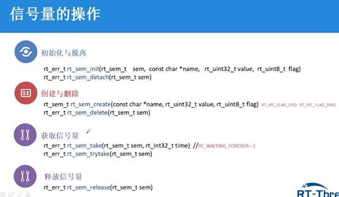
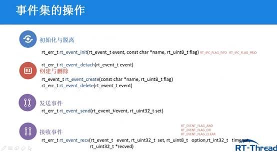
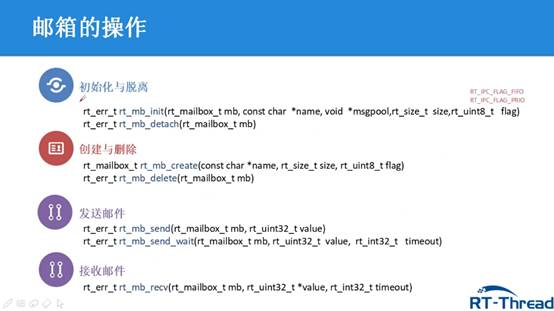
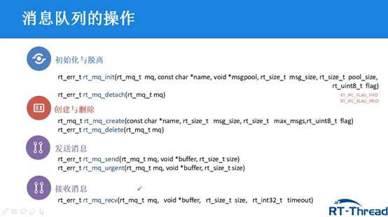
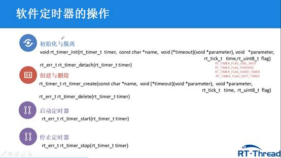
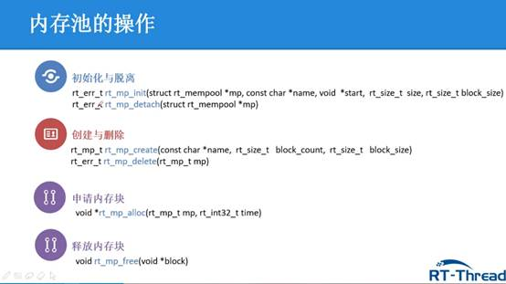

## RT-Thread相关文档和API参考手册

[RT-Thread 简介](https://www.rt-thread.org/document/site/#/rt-thread-version/rt-thread-standard/README)

[RT-Thread API参考手册: RT-Thread 简介](https://www.rt-thread.org/document/api/index.html)

[(5条消息) RT-Thread—RTT启动流程_Aspirant-GQ的博客-CSDN博客](https://blog.csdn.net/qq_43743762/article/details/103111767)

## 使用CubeMX移植RT-Thread

 

[(4条消息) RT-Thread的STM32CubMX与MKD的移植--RT-Thread&&STM32开发系列(1)_The Road of Engineer的博客-CSDN博客](https://blog.csdn.net/qq_36098477/article/details/118895348)

[(4条消息) STM32CubeMX完美RT-THREAD项目创建流程说明（仅限个人备注）_RaboLab的博客-CSDN博客_cubemx rtthread](https://blog.csdn.net/xbw3336661/article/details/118028482?spm=1001.2101.3001.6661.1&utm_medium=distribute.pc_relevant_t0.none-task-blog-2~default~CTRLIST~default-1-118028482-blog-116277424.pc_relevant_multi_platform_whitelistv3&depth_1-utm_source=distribute.pc_relevant_t0.none-task-blog-2~default~CTRLIST~default-1-118028482-blog-116277424.pc_relevant_multi_platform_whitelistv3&utm_relevant_index=1)

[(4条消息) 使用STM32Cube 创建RTthread 工程_JingZhe_HengJing的博客-CSDN博客](https://blog.csdn.net/JingZhe_HengJing/article/details/125066010?spm=1001.2101.3001.6650.12&utm_medium=distribute.pc_relevant.none-task-blog-2~default~CTRLIST~default-12-125066010-blog-118028482.pc_relevant_aa_2&depth_1-utm_source=distribute.pc_relevant.none-task-blog-2~default~CTRLIST~default-12-125066010-blog-118028482.pc_relevant_aa_2&utm_relevant_index=15)

 

## 使用Keil移植RT-Thread

[KEIL移植RT_THREAD_NANO_FINSH方法 - 哔哩哔哩 (bilibili.com)](https://www.bilibili.com/read/cv12373927/)

如果需要使用shell需要在rtconfig.h中，#define RT_USING_CONSOLE和#include "finsh_config.h"

 

遇到的相关问题

1. Please uncomment the line <#include "finsh_config.h"> in the rtconfig.h报错，只需要在rtconfig.h中引入"finsh_config.h"即可。
2. 文章中说huart1.Instance->RDR的RDR是接收缓存寄存器，在f103zet6中DR为接收缓存寄存器，在cubemx生成代码的时候已经放在board.c中了（3.15版本）。

关于时基的选择

[(4条消息) HAL库中的 SYS Timebase Source 和 SysTick_Handler()_拿破仑无线的博客-CSDN博客_systick_handler](https://blog.csdn.net/m0_38064214/article/details/84285587)

## 使用Keil模拟F103

使用Keil进行模拟时，可以使用虚拟串口，在Keil中view-serial windows-uart#1，按F5开启RT-Thread系统。

常用help命令，在命令行中按tab可以自动补全。

$Super$$main( )才是真正的main函数

## 动态内存堆

栈（stack）由编译器自动分配释放

堆（heap）一般由程序员分配和释放

普通变量命名是栈空间，使用malloc是堆空间

 

rt_system_heap_init((void *)HEAP_BEGIN, (void *)HEAP_END);

分配动态内存空间

Image$$RW_IRAM1$$ZI$$Limit链接器导出的符号代表ZI段的结束。执行区RAM未使用的起始地址。使用rt_malloc和rt_free去申请或者释放内存。如果不同时使用可能会造成内存泄漏。

## 线程的创建

线程由三部分组成：线程代码（入口函数）、线程控制块、线程堆栈

线程代码又分为无限循环结构和顺序执行结构

线程代码

Void thread_entry（void *parameter）

{

While(1) //无限循环     /事务1/ //顺序执行

{                     /事务2/

}                     /事务N/

}

创建线程

rt_thread_init() 静态线程

rt_thread_create() 动态线程

启动线程

rt_thread_startup() 

## 栈空间的分配技巧

系统心跳时钟，是stm32上一般设置系统滴答频率为100hz，10ms

 

系统时钟的优先级最高，工程优先使用，（cubemx不建议），但是系统时钟有缺陷，是因为如果系统太频繁，会导致负载过高，也就意味着，选系统时钟的话，任务调度的频率不能过快；频率过小，时间处理精度又不够。

Io初始化

void rt_pin_mode(rt_base_t pin,rt_base_t mode)

可使用模式PIN_MODE_OUTPUT|INOUT|INPUT_PULLUP….

io写入

void rt_pin_write(rt_base_t pin,rt_base_t value)

可使用值 PIN_HIGH|PIN_LOW

io读出

void rt_Pin_read(rt_base_t pin)

例如__STM32_PIN(4, E, 5),代表PE5，序号为4，所以此时的rt_base_t pin 为4。（相关代码在drv_gpio.c中）

rt_thread_delay(n); n为多少个时钟节拍，默认一个节拍为10ms

rt_thread_sleep(n);n为多少个时钟节拍

rt_thread_mdelay(n);n为多少ms

 

/* 导出到 msh 命令列表中 */

MSH_CMD_EXPORT（线程启动函数名，相关解释）

 

通过命令行中输入list_thread查看系统栈空间的使用。一般设置为最大使用量的70%

 

## 线程的时间片轮询调度

可以修改rt_config.h中RT_THREAD_PRIORITY_MAX宏来改变最大支持的优先级，最高为256个优先级。

 

时间片只会在相同优先级就绪态线程中起作用。相同优先级线程采用时间片轮询的方式进行调度。时间片可以约束线程单次运行的时长，单位为一个系统节拍。

 

## 空闲线程和两个常用的钩子函数

空闲线程是一个比较特殊的系统线程，它具备最低的优先级，当系统其他就绪线程可以运行时，调度器将调度到空闲线程。

负责一些系统资源回收以及将一些处于关闭态的线程从线程调度列表中移除的动作。本质上是一个无限循环结构并且永远挂起。

空闲线程相关源码在idle.c中。

**空闲任务钩子函数**

空闲任务钩子函数可以可以让系统在空闲时间执行一些非紧急事务，例如系统运行指示灯，CPU使用率统计。

rt_thread_idle_sethook(void (*hook)(void)) 设置钩子函数

rt_thread_idle_delhook(void (*hook)(void)) 删除钩子函数

注意在钩子函数中，例如rt_thread_delay(),rt_sem_take()等导致线程挂起的阻塞类函数不能使用。但是可以设置多个钩子函数。

更改idle.c中RT_IDEL_HOOK_LIST_SIZE宏可以更改钩子函数的个数。

**系统调度钩子函数**

   系统调度钩子函数可以在系统任务切换时运行，通过这个钩子函数，我们可以知道任务调度时的一些信息。数量只有一个。

   rt_scheduler_sethook(void(*hook)(struct rt_thread *from,struct rt_thread *to))

## 临界区保护

   临界资源是仅运行一个线程访问的共享资源。多个线程要互斥对临界资源经行访问。

   保护临界区有两种方法，关闭系统调度和互斥特性

   关闭系统调度又分为禁止调度和关闭中断

   禁止调度使用rt_enter_critical() rt_exit_critical()

   关闭中断使用level = rt_hw_interrupt_disable() rt_hw_interrupt_enable(level);

## 信号量的使用

IPC是进程间通信，通过IPC协调多个线程默契工作

定义静态信号量 struct rt_semaphore static_sem

定义动态信号量 re_sem_t dynamic_sem

[(4条消息) RT-Thread学习笔记——信号量_Sanjay_Wu的博客-CSDN博客_rt_sem_take有什么用](https://blog.csdn.net/Sanjay_Wu/article/details/86645741)

## 生产者和消费者问题（互斥和同步问题）

生产者消费者问题（英语：Producer-consumer problem），也称有限缓冲问题（英语：Bounded-buffer problem），是一个多线程同步问题的经典案例。该问题描述了共享固定大小缓冲区的两个线程——即所谓的“生产者”和“消费者”——在实际运行时会发生的问题。生产者的主要作用是生成一定量的数据放到缓冲区中，然后重复此过程。与此同时，消费者也在缓冲区消耗这些数据。该问题的关键就是要保证生产者不会在缓冲区满时加入数据，消费者也不会在缓冲区中空时消耗数据。

要解决该问题，就必须让生产者在缓冲区满时休眠（要么干脆就放弃数据），等到下次消费者消耗缓冲区中的数据的时候，生产者才能被唤醒，开始往缓冲区添加数据。同样，也可以让消费者在缓冲区空时进入休眠，等到生产者往缓冲区添加数据之后，再唤醒消费者。通常采用进程间通信的方法解决该问题。如果解决方法不够完善，则容易出现死锁的情况。出现死锁时，两个线程都会陷入休眠，等待对方唤醒自己。该问题也能被推广到多个生产者和消费者的情形。

互斥情况使用二值信号量 同步情况使用两个多值信号量（缓冲区大小）

## 互斥量的使用

定义静态互斥量 struct rt_mutex static_mutex

定义动态互斥量 rt_mutex_t dynamic_mutex

 

信号量可以在中断中释放，而互斥量则不行，互斥量只能在线程中释放

信号量会存在线程优先级翻转的问题，使用互斥量则没有（优先级继承）

使用注意事项：

1. 两个线程不能对同时持有同一个互斥量。如果某线程对已被持有的互斥量进行获取，则该线程会被挂起，直到持有该互斥量的线程将互斥量释放成功，其他线程才能申请这个互斥量。
2. 互斥量不能在中断服务程序中使用。
3. RT-Thread 作为实时操作系统需要保证线程调度的实时性，尽量避免线程的长时间阻塞，因此在获得互斥量之后，应该尽快释放互斥量。
4. 持有互斥量的过程中，不得再调用 rt_thread_control()等函数接口更改持有互斥量线程的优先级。

[(4条消息) RT-Thread学习笔记——互斥量_Sanjay_Wu的博客-CSDN博客_rtthread 互斥量](https://blog.csdn.net/Sanjay_Wu/article/details/86687838)

## 线程优先级的翻转

高优先级线程试图访问共享资源时，可能被低优先级线程持有，而低优先级又会被其他中优先级抢占，导致高优先级线程被阻塞。使得高优先级线程的实时性得不到保证。

优先级翻转现象提醒编程人员对共享资源进行互斥访问的代码尽量短。

## 事件集的使用

信号量主要用于一对一的线程同步，涉及到多个同步时需要使用事件集。

事件集用32位无符号整型变量表示，变量中的一个位代表一个事件，逻辑或和逻辑与。逻辑或只需要一个事件发生即满足条件。逻辑与需要同时发生事件即满足条件。

定义静态事件集 struct rt_event static_evt

定义动态事件集 rt_event_t dynamic_evt

[(4条消息) RT-Thread学习笔记——事件集_Sanjay_Wu的博客-CSDN博客_rt_event_init](https://blog.csdn.net/Sanjay_Wu/article/details/86701304)

## 邮箱的使用

定义静态邮箱 struct rt_mailbox static_mb

定义动态邮箱 rt_mailbox_t dynamic_mb

 

## 消息队列的使用

消息队列是对邮箱的拓展，能够接收来自线程或者中断服务例程中发出的不同固定长度的消息

定义静态消息队列 struct rt_messagequeue static_mq

定义动态消息队列 rt_mq_t dynamic_mq

 

普通消息放在链表尾部，紧急消息放在链表头部

消息队列容量的计算：（msg size对齐为4的倍数）

如果msg pool的大小为1024，msg size为4，则max msgs为1024/(4+4)=128 前面的4代表msg size，后面的4代表链表指针长度

## 软件定时器的使用

软件定时器可以提供不受数目限制的定时器服务，以系统节拍为时间长度，提供基于系统节拍整数倍的定时能力，比如OS Tick为10ms则可以使用10ms、20ms、30ms。达到定时时间后会调用回调函数

HARDTIMER模式，在中断上下文中执行，需要与中断相似，执行时间尽量短，为默认的模式。

SOFTTIMER模式，在线程上下文中执行，通过宏命令RT_USING_TIMER_SOFT来启动

定义静态软件定时器 struct rt_timer static_timer

定义动态软件定时器 rt_timer_t dynamic_timer

## 内存池的使用

动态内存堆可以分配任意大小的内存块，但是分配效率不高且容易产生碎片。RT-Thread使用内存池的方法来解决碎片化问题。

定义静态内存池 struct rt_mempool static_mp

定义动态内存池 rt_mp_t dynamic_mp

 