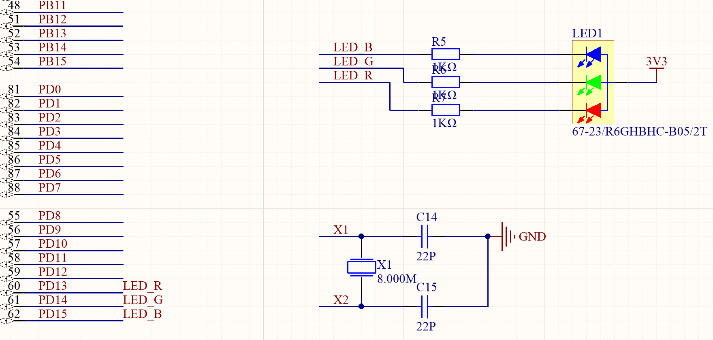
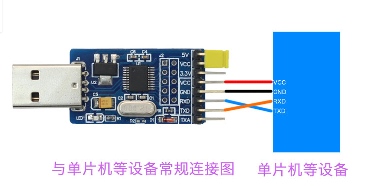
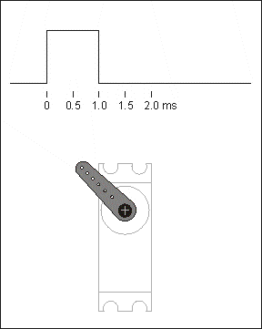
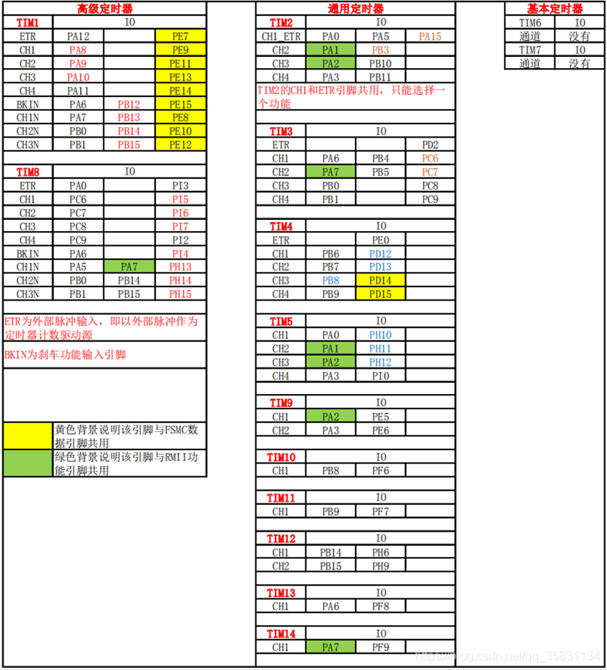
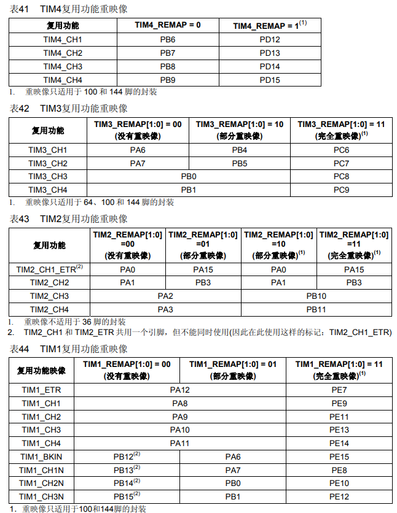
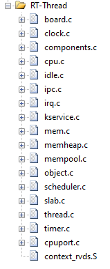
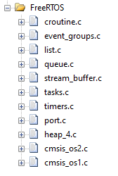

# SGA库开发指南（Beta）

## 概述

本指南为初次接触SGA库的用户指明方向，可以作为教程和工具书查阅。后续会从库函数框架、代码API、函数使用说明以及例程说明来书写本开发指南。因为在写例程的时候，库函数版本也在更新，所以有些例程中一些文件会和最新版有些出入。如有错误，还请指正。

项目链接：[PoisonNF/SGA_Demo: Repair and test of SGA Library. (github.com)](https://github.com/PoisonNF/SGA_Demo)

例程链接：https://pan.baidu.com/s/1JgBmoi0GzMfA20Ahl1H5_A  提取码：jao9

***

## Q&A

- 什么是SGA库？

SGA库是一套STM32F1系列和STM32L4系列的代码库，本代码库由杭州电子科技大学SIGMA团队制作。适用于绝大多数开发板，包括正点原子和野火的板子，最佳适配为IM板。

- SGA库是做什么的？

本意上，使用SGA库是为了在水下机器人方面发挥拳脚，内置的很多API都是方便水下机器人的代码编写，但在其他方面也可以使用。比如在库函数中有OLED等不常使用在水下机器人领域的模块驱动。

- 为什么要使用SGA库？

使用SGA库可以更加专注于顶层（应用层）的代码编写，花更多的精力在算法实现上，大家使用相同的API函数会减少由于代码差异带来的问题，在寻找错误时更加从容。同时，分层设计可以在换底层硬件后，ocd文件基本不需要更改就可以继续使用。

- 为什么我不使用CubeMX生成代码？

CubeMX确实是初学者非常好用的一个图形化生成代码的软件，在初学时我建议还是使用此软件，去熟悉HAL库相关的API，对理解SGA库内部有很大帮助。但是CubeMX生成的代码也有问题存在，首先，生成的代码中会夹杂很多软件必要的注释，其次必须在注释中写入代码，否则会在重新生成代码的时候被抹去。

***

## 工程目录说明

**Doc** : 工程记录文件

- 工程目录介绍.txt :工程文件目录
- 工程维护记录.txt : 工程文件修改、更新、增加、删除等系列维护记录，最新记录在最上面
- 句柄资源实例.txt : 库函数封装结构体句柄使用实例

**Apply** : 应用层

- **Logic** : 逻辑层——用户逻辑源代码（抽象执行逻辑）
- **Task** : 业务层——用户业务源代码（具体执行实现）

**Bsp**: 板级层

- **Algo** : 算法库——常用函数与控制算法
- **Dev** : 设备驱动——遥感以及电机驱动
- **OCD** : 片外外设——需要使用的片外外设驱动
- **FatFs** : 文件系统——开源文件系统
- **RTOS** : 实时操作系统——各第三方支持RTOS系统

**Driver** : 驱动层（非架构开发者不要轻易修改）

**Hardware**: 硬件抽象层

- STM32F1XX

  CMSIS :

    - core版本: V5.6.0_cm4
    - device F1版本：V4.3.2
    - STM32F1XX系列MCU的HAL固件库源代码、驱动程序版本: V1.1.7
  
- STM32L4XX

  CMSIS :

    - core版本: V5.4.0_cm4
    - device L4版本：V1.5.1
    - STM32L4XX系列MCU的HAL固件库源代码、驱动程序版本: V1.10.0

**Project** : 存放工程相关文件

***

## 库函数框架

在SGA库中，库函数一共有4大层，分别是Apply层（实现用户逻辑）、BSP层（存放外设、算法、第三方芯片驱动）、Driver层（在HAL库基础上再次封装）、Doc层（工程文档和帮助）。

### Apply层

一般的STM32开发只需要在此层修改。

在Apply层中有两个文件夹，分别是Logic和Task。

1. Logic中

    - **main.c** 

        最上层逻辑抽象，一般不需要更改
    - **usercode.c** 

        如果使用裸机模式，可以在/* 用户逻辑代码 */下直接书写代码
    - **threadpool.c** 

        在使用RTOS时，需要在工程目录中加入此文件，此时usercode文件将作为线程初始化使用，而threadpool中将存放对应的线程入口函数
    - **config.c** 

        该文件存放所有用到的I/O口初始化参数配置，在**句柄资源实例**中有相应的实例

2. Task中

    - **task_irq.c** 

        存放中断处理函数以及中断返回服务函数

    - **task_userinit.c** 

        存放所有的初始化，例如串口，IIC
    
    - **task_sysinit.c** 
    
        该文件为hal库启动，不需要做修改
    
    剩下其他自己实现的函数可以自建文件。例如，task_xxxx.c
    

### BSP层

BSP层是板级层，存放了一些设备驱动（遥感），算法（PID），第三方芯片（JY901、AT24XX）

#### BSP/Algo层

存放常用函数与控制算法

目前已有常用函数驱动：func、增量式PID

#### BSP/Dev层

存放设备驱动，例如遥感和电机驱动

目前已有ps2手柄驱动：PS2

#### BSP/OCD层

存放第三方芯片的驱动代码

目前已有的芯片驱动：ADS1256、AT24xx、DS3231、JY901、RM3100

目前已有的外设驱动：OLED、SDcard

### Driver层

Driver层是对HAL库进一步封装得到的，目前驱动层已有adc、dac、gpio、iic_soft、pwm、pwr、spi_soft、spi、timer、uart、wdg相关驱动可以直接使用。

### Doc层

存放工程相关文档。

### RT-Thread层/FreeRTOS层

该层仅存在于使用RTOS的工程中，且内核文件需要自己添加进工程中，如何添加内核，怎么添加内核，如何启用内核，都将会在后续章节中说明。

***

## 裸机开发

本章节将配合**SGA库例程**中的裸机代码讲解，一步一步讲解如何使用。会涉及到各个层的使用，着重讲解水下机器人最常用的部分，例如UART串口的使用，PWM波的生成，以及一些第三方芯片的使用。

### GPIO/LED点亮

GPIO是所有外设的基础，本节将使用GPIO进行点灯实验。在IM板上所使用的是三原色LED，需要使用3个GPIO去调色。

通过查看IM板原理图可知，三原色LED连接STM32 PD13 PD14 PD15三个I/O。分别对应RGB。且共阳级连接，程序里面输出低电平时，LED发光。



本节使用的例程名为`SGA点亮LED例程`，实现的效果就是每秒切换LED颜色。

**复现该代码：**

1. 打开一个SGA_Demo工程，编译一下整个工程。显示0Error，0Warning即可。

2. 在Doc文件夹中，找到`句柄资源示例.txt`,找到`/* GPIO句柄示例 */`，复制底下紧跟的结构体句柄。

3. 在Apply/Logic中的config.c中粘贴。根据原理图更改I/O配置。

4. 打开config.h文件，该文件在config.c最上面。

5. 在config.h文件中，添加`extern tagGPIO_T demoGPIO[];`，用于向外部声明此结构体。

6. 在Apply/Task->task_userinit.c ->Task_UserInit()函数中，调用`Drv_GPIO_Init(demoGPIO, 3);`

7. 在Apply/Logic->usercode.c中，写入以下代码

    ```c
    /* 用户逻辑代码 */
    void UserLogic_Code(void)
    {
        printf("SGA_DEMO\r\n");
    
    	//LED初始熄灭
    	Drv_GPIO_Set(&demoGPIO[0]);
    	Drv_GPIO_Set(&demoGPIO[1]);
    	Drv_GPIO_Set(&demoGPIO[2]);
    
    	while(1)
    	{
    		//红灯
    		Drv_GPIO_Reset(&demoGPIO[0]);
    		Drv_GPIO_Set(&demoGPIO[1]);
    		Drv_GPIO_Set(&demoGPIO[2]);
    
    		Drv_Delay_Ms(1000);
    
    		//绿灯
    		Drv_GPIO_Set(&demoGPIO[0]);
    		Drv_GPIO_Reset(&demoGPIO[1]);
    		Drv_GPIO_Set(&demoGPIO[2]);
    
    		Drv_Delay_Ms(1000);
    
    		//蓝灯
    		Drv_GPIO_Set(&demoGPIO[0]);
    		Drv_GPIO_Set(&demoGPIO[1]);
    		Drv_GPIO_Reset(&demoGPIO[2]);
    
    		Drv_Delay_Ms(1000);
    	}
    }
    ```

8. 至此，代码复现完毕，烧录程序即可产生现象。

**相关讲解：**

- 前6步在SGA_Demo工程中已经完成了，也可以自己操作一遍。
- 可以同时为两个I/O输出低电平达到调色的效果。

### UART串口

串口是STM32最常用的部分，使用串口可以在两个设备之间传递信息。

串口一般使用三根线，TX(发送)、RX(接收)、GND(地线)。两个设备之间GND相接，RX与TX交叉连接。

这里特别要说明的是CH340的使用。CH340是一个TTL转USB的模块，用于单片机与PC的通信。接线如下图。



#### 串口发送

本节使用的代码为`SGA串口普通发送例程`，该例程使用了USART1向外部发送一堆数据。

**复现该代码：**

1. 打开一个SGA_Demo工程，编译一下整个工程。显示0Error，0Warning即可。

2. 在Doc文件夹中，找到`句柄资源示例.txt`,找到`/* 串口句柄示例 */`，复制底下紧跟的结构体句柄。

3. 在Apply/Logic中的config.c中粘贴。完成对串口的配置。

4. 打开config.h文件，该文件在config.c最上面。

5. 在config.h文件中，添加`extern tagUART_T demoUart;`，用于向外部声明此结构体。

6. 在Apply/Task->task_userinit.c ->Task_UserInit()函数中，调用`Drv_Uart_ITInit(&demoUart);`

7. 此时串口初始化完毕，在Apply/Logic->usercode.c->UserLogic_Code()函数中，即可使用printf向外部发送数据。

8. 至此，代码复现完毕，烧录程序即可产生现象。

**相关讲解：**

- 在这个例程中，串口的结构体句柄名称不一定要是demoUart，这里只是一个示例，可以改成有意义的名字，例如，Uart1代表串口1。
- 结构体句柄中，大部分选项并不需要更改，按照需求更改串口号（.tUARTHandle.Instance）和波特率（.tUARTHandle.Init.BaudRate）即可。下面的数据位、停止位、校验位，一般都是81N，保持默认即可。
- 发送函数为什么可以使用printf？原因是在drv_hal.c中进行了重定向。SGA库默认使用串口1进行printf，可以在drv_hal_conf.h中看到这行宏定义`#define PRINTF_UART USART1	/* printf使用的串口 */`，可以修改换成USART2，printf将使用串口2打印。至于什么是重定向，可以网上找下资料。当然这边也可以使用`Drv_Uart_Transmit()`或者`HAL_UART_Transmit()`来发送。
- 为什么使用printf？因为方便。
- 为什么使用了`Drv_Uart_ITInit(&demoUart);`，这不是中断初始化API吗？实际上中断功能是在普通模式基础上增加的，这里使用`Drv_Uart_DMAInit(&demoUart);`也是可以使用的。

#### 串口接收

串口接收一般有三种方式，阻塞等待、中断、DMA。这边着重讲解中断模式和DMA模式。DMA模式尤为关键，效果最好，使用最方便。普通的阻塞等待模式存在很多功能问题，不建议在工程中使用。

##### 中断模式

在开启中断模式后，每当接收一个字节都会产生中断，库函数会对该字节进行识别，默认识别到‘\n’为结束。

中断模式好处的是在不接收数据时不会占用CPU的资源，CPU可以做其他事。

接下来两个例程都是使用了中断模式，由PC发送数据，STM32接收数据，并且在接收完成后，发送还给PC。实验效果应该是PC发送什么数据，会接收到一样的发送数据。两个例程不同之处则是一个使用的是结构体储存数据，一个使用的是数组存储数据。

###### 数组方式

本节使用的代码为`SGA串口中断接收数组例程`，数组方式采用的是数组和标识符来存储数据以及告知接收数据数量。

**复现该代码：**

1. 打开一个SGA_Demo工程，编译一下整个工程。显示0Error，0Warning即可。

2. 在Doc文件夹中，找到`句柄资源示例.txt`,找到`/* 串口句柄示例 */`，复制底下紧跟的结构体句柄。

3. 在Apply/Logic中的config.c中粘贴。完成对串口的配置。

4. 打开config.h文件，该文件在config.c最上面。

5. 在config.h文件中，添加`extern tagUART_T demoUart;`，用于向外部声明此结构体。

6. 在Apply/Task->task_userinit.c ->Task_UserInit()函数中，调用`Drv_Uart_ITInit(&demoUart);`

7. 此时串口初始化完毕，在Apply/Logic->usercode.c中，新建两个全局变量。分别是`uint8_t rData[100]`和`int rDataflag`，用于存储数据和标识目前数据存储数目。

8. 在Apply/Task->task_irq.c中加入以下代码

    ```c
    extern uint8_t rData[100];
    extern int rDataFlag;
    void HAL_UART_RxCpltCallback(UART_HandleTypeDef *huart)
    {
        //如果接收到了'\n'
    	if(demoUart.tRxInfo.ucpRxBuffer[0] == '\n')
      	{
          	rData[rDataFlag] = '\0';    //最后一位替换为'\0'（字符串结束符）
          	printf("%s\n",rData);       //打印rData中存储的数据
          	rDataFlag = 0;              //接收数量标识符清零
            
    		/***************其他标志位赋值**********************/
      	}
      	else    //还没接收到'\n'
      	{
            //且接收数据量没有到达上限
          	if(rDataFlag <100)
          	{
                //将数据保存，且标识符加一
              	rData[rDataFlag] = demoUart.tRxInfo.ucpRxBuffer[0];
              	rDataFlag += 1;
          	}
      	}
        
        //等待再接收到一个字节数据
      	while(HAL_UART_Receive_IT(&demoUart.tUARTHandle, demoUart.tRxInfo.ucpRxBuffer, 1) != HAL_OK); 
    }
    ```
    
9. 至此，代码复现完毕，烧录程序即可产生现象。

**相关讲解：**

- 前面的6步与串口发送中相同。

- 第7步中创建的两个全局变量命名是可以修改的。第一个rData数组的长度也可以按照需求进行更改，示例中是最多接收100个字节。

- 第8步的代码这边详细解释一下。

    - 需要在函数体外部声明之前新建的两个全局变量，让编译器能够找到这两个变量。

    - 为什么使用`void HAL_UART_RxCpltCallback(UART_HandleTypeDef *huart)`和这个函数的原型在哪？

        这个函数是串口接收完成回调函数，这从函数名上就能分析出来，意思就是当串口完成接收的时候做进行的函数操作。该函数的原型位于Hardware/stm32f1xx_hal_uart.c中第2199行。
    - 函数体内部是一个串口中断接收的典型代码，默认是接收到'\n'表示接收完毕。可以自己改成其他的字符作为结尾标识。其他都在代码中的注释中有所解释。
- 在主程序中就可以对rData数组进行通信协议校验等操作。例如帧头帧尾检验。
###### 结构体方式

本节使用的代码为`SGA串口中断接收结构体例程`，数组方式采用的是结构体内部成员来存储数据以及告知接收数据数量。

**复现该代码：**

1. 打开一个SGA_Demo工程，编译一下整个工程。显示0Error，0Warning即可。

2. 在Doc文件夹中，找到`句柄资源示例.txt`,找到`/* 串口句柄示例 */`，复制底下紧跟的结构体句柄。

3. 在Apply/Logic中的config.c中粘贴。完成对串口的配置。

4. 打开config.h文件，该文件在config.c最上面。

5. 在config.h文件中，添加`extern tagUART_T demoUart;`，用于向外部声明此结构体。

6. 在Apply/Task->task_userinit.c ->Task_UserInit()函数中，调用`Drv_Uart_ITInit(&demoUart);`

7. 在Apply/Task->task_irq.c中加入以下代码

    ```c
    void HAL_UART_RxCpltCallback(UART_HandleTypeDef *huart)
    {
        //如果接收到了'\n'
    	if(demoUart.tRxInfo.ucpRxBuffer[0] == '\n')
      	{
          	demoUart.tRxInfo.ucpITRxCache[demoUart.tRxInfo.usRxCnt] = '\0'; //最后一位替换为'\0'（字符串结束符）
          	printf("%s\n",demoUart.tRxInfo.ucpITRxCache);   //打印rData中存储的数据
          	demoUart.tRxInfo.usRxCnt = 0;   //接收数量标识符清零
    		
    		/***************其他标志位赋值**********************/
      	}
      	else    //还没接收到'\n'
      	{
            //且接收数据量没有到达上限
          	if(demoUart.tRxInfo.usRxCnt < UART_IT_RX_CACHE_SIZE)
          	{
                //将数据保存，且标识符加一
              	demoUart.tRxInfo.ucpITRxCache[demoUart.tRxInfo.usRxCnt] = demoUart.tRxInfo.ucpRxBuffer[0];
              	demoUart.tRxInfo.usRxCnt += 1;
          	}
      	}
        //等待再接收到一个字节数据
      	while(HAL_UART_Receive_IT(&demoUart.tUARTHandle, demoUart.tRxInfo.ucpRxBuffer, 1) != HAL_OK); 
    
    }
    ```

8. 至此，代码复现完毕，烧录程序即可产生现象。

**相关讲解：**

- 这边主要讲解一下与数组方式的差异性。主要集中在存储数据的介质以及接收数据的计数器有差异。在上节中所使用的一个数组加上一个int变量来实现；在结构体方式中，封装在了tagUART_T结构体中。具体细节可以找到Driver/drv_hal_uart.h中`/* 串口接收信息结构体 */`内部`/* 中断相关信息 */`里面的usRxCnt以及*ucpITRxCache成员。根据注释我们知道一个是计数器，一个是接收缓冲区的起始地址。在库函数内部使用malloc函数进行的内存分配，相当于建立了一个等同于rData的数组。
- UART_IT_RX_CACHE_SIZE是什么？这是一个宏，用于指定接收缓冲区的最大字节数，在初始化的时候会为*ucpITRxCache分配这个宏指定的长度。该宏也可以在Driver/drv_hal_uart.h查看并且按照需求自行修改。
- 在该回调函数内部所实现的逻辑与上节相同，将rData更换成了 demoUart.tRxInfo.ucpITRxCache，rDataFlag更换成了demoUart.tRxInfo.usRxCnt。
- 在主程序中可以先将demoUart.tRxInfo.ucpITRxCache进行memcpy()值拷贝到一个数组中，再进行通信协议校验等操作。在最新的库函数中可以使用`Drv_Uart_Receive_IT()`进行这部分操作。

###### API方法

在SGA库例程中还有一种API方法，该方法就是将上节结构体方式的回调函数内部实现封装成了一个函数，可以直接调用，该函数位于Driver/drv_hal_uart.c中470行`void Drv_Uart_IT_RxHandler(tagUART_T *_tUART, uint8_t _ucEndChar)`可以通过注释自行了解。

##### DMA模式

DMA即直接存储器访问，DMA传输将数据从一个地址空间复制到另一个地址空间，CPU只需要完成初始化传输动作即可，剩下的步骤由DMA控制器完成。可以大大减轻CPU的压力。是我==非常推荐==使用的串口模式，能用则用。<font color="red">（需要注意Uart5无法使用DMA）</font>

下面将通过一个例程来展示DMA模式的使用，所用到的例程名为`SGA串口DMA接收例程`。

该例程实现的效果与中断模式中相同，实现PC往STM32发送什么数据，就同样返还什么数据。

**复现该代码：**

1. 打开一个SGA_Demo工程，编译一下整个工程。显示0Error，0Warning即可。

2. 在Doc文件夹中，找到`句柄资源示例.txt`,找到`/* 串口句柄示例 */`，复制底下紧跟的结构体句柄。

3. 在Apply/Logic中的config.c中粘贴。完成对串口的配置。

4. 打开config.h文件，该文件在config.c最上面。

5. 在config.h文件中，添加`extern tagUART_T demoUart;`，用于向外部声明此结构体。

6. 在Apply/Task->task_userinit.c ->Task_UserInit()函数中，调用`Drv_Uart_DMAInit(&demoUart);`

7. 在Apply/Task->task_irq.c中加入以下代码，可以在原有的模板下书写

    ```c
    /**
     * @brief 串口1中断服务函数
     * @param null
     * @retval Null
    */
    void USART1_IRQHandler(void)
    {
    	Drv_Uart_DMA_RxHandler(&demoUart);	//该函数完成DMA相关的数据处理,例如存放数据，记录收到个数
    }
    ```

8. 在Apply/Logic->usercode.c中，写入以下代码

    ```c
    /* 用户逻辑代码 */
    void UserLogic_Code(void)
    {
        uint8_t num;        //用于记录接收到的数据字节数
    	uint8_t buf[150];   //用于存放接收到的数据
        
    	while(1)
    	{
            //调用接收函数，将收到的数据存入buf中，同时返回num
            num = Drv_Uart_Receive_DMA(&demoUart,buf);
            
            //当接收到的数据字节数不为0，打印返还给PC
            if(num != 0)
                printf("%s",buf);
    	}
    }
    ```

9. 至此，代码复现完毕，烧录程序即可产生现象。

**相关讲解：**

- 如果串口无法收到数据需要检查以下两点：1. 在复制串口结构体句柄时，检查`.tUartDMA.bRxEnable = true,	`是否使能接收。2. 在task_userinit.c中调用串口初始化函数时，注意是`Drv_Uart_DMAInit(&demoUart);`，与前几节中断模式所调用的API不同。
- 在本例中，buf的容量上限是150。实际上，上限值需要设置为接收数据==最大长度的两倍以上==才可以完美接收。
- 可以对buf进行帧头帧尾检测，符合通信协议要求。

### 定时器

在裸机开发中，定时器使用的非常多，通过使用定时器中断可以将CPU资源给其他的部分。就比如LED每1s闪烁一次，使用普通的delay延时函数会一直占用CPU资源，实际上在延时期间内CPU并不要空转等待，而是可以处理其他事务。在程序中使用较多的延时函数，会让整个系统变得迟缓，延时函数会作用在后续所有的代码上。

定时器就像一个闹钟，每当时间到达，就会发出一个中断信号，然后CPU才去执行中断服务函数中的代码。

接下来讲解一个实例，使用的例程名为`SGA定时器例程`。

例程效果就是，LED每0.1s翻转一次红灯，每1s翻转一次蓝灯，同时一直打印"SGA_DEMO"。

**复现该代码：**

1. 打开一个SGA_Demo工程，编译一下整个工程。显示0Error，0Warning即可。

2. 按照前面LED点亮章节，先配置LED，初始化PD13、PD14、PD15，并且将三个I/O都赋予高电平。

3. 在Doc文件夹中，找到`句柄资源示例.txt`,找到`/* 定时器Timer资源结构体示例 */`，复制底下紧跟的结构体句柄。

4. 在Apply/Logic中的config.c中粘贴。修改定时器的配置，一般更改定时器号和重载值（延时时间）。

5. 在config.h文件中，添加`extern tagTIM_T tTimer2;`，用于向外部声明此结构体。

6. 在Apply/Task->task_userinit.c ->Task_UserInit()函数中，调用`Drv_Timer_Init(&tTimer2);`进行初始化，再调用`Drv_Timer_Enable(&tTimer2);`使能定时器，开始计时。

7. 在Apply/Task->task_irq.c中加入以下代码，这里使用的是定时器2。

    ```c
    extern uint8_t Timeflag_100MS;
    extern uint8_t Timeflag_1000MS;
    extern uint8_t Timeflag_Count;
    /**
     * @brief 定时器2中断服务函数
     * @param null
     * @retval Null
    */
    void TIM2_IRQHandler(void)
    {
    	Drv_Timer_IRQHandler(&tTimer2);
    	
    	Timeflag_100MS = 1;	//100ms标志位置1
    	Timeflag_Count++;
    	if(Timeflag_Count >= 10)
    	{
    		Timeflag_Count = 0;
    		Timeflag_1000MS = 1;	//1s标志位置1
    	}
    }
    ```

8. 在Apply/Logic->usercode.c中，写入以下代码

    ```c
    uint8_t Timeflag_100MS;
    uint8_t Timeflag_1000MS;
    uint8_t Timeflag_Count;
    
    /* 用户逻辑代码 */
    void UserLogic_Code(void)
    {
    	printf("SGA_DEMO\r\n");
    
    	while(1)
    	{
    		//串口1一直打印
    		printf("SGA_DEMO\r\n");
    
    		if(Timeflag_100MS)
    		{
    			//红色LED翻转
    			Drv_GPIO_Toggle(&demoGPIO[0]);
    			//标志位清零
    			Timeflag_100MS = 0;
    		}
    
    		if(Timeflag_1000MS)
    		{
    			//蓝色LED翻转
    			Drv_GPIO_Toggle(&demoGPIO[2]);
    			//标志位清零
    			Timeflag_1000MS = 0;
    		}
    	}
    }
    ```

9. 至此，代码复现完毕，烧录程序即可产生现象。

**相关讲解：**

- 首先需要对LED进行配置初始化，步骤与LED点亮中相同，注意要将三个I/O赋予高电平（熄灭状态）。
- 在task_irq.c中，每次进入定时器服务函数都说明时间过去了0.1s，将Timeflag_100MS标志位置1，进入10次服务函数说明时间过去了1s，将Timeflag_1000MS标志位置1。在主函数中读取两个标志位来产生不同的效果。
- 在主程序中使用了相应的标志位后，需要手动将标志位清0，不然实际效果就是LED保持同一个状态。

### PWM波生成

PWM简称脉宽调制。推进器和舵机都需要PWM波去驱动。一般都是频率50HZ，占空比7.5%保持停转。这里要解释一下什么是占空比？简单来说就是高电平时间占总周期的百分比，也被称作脉冲宽度。

对推进器而言，小于7.5%（1.5ms）会反转，大于7.5%（1.5ms）会正转，存在上下限值，不确定，要看具体型号。

对舵机而言，等于7.5%（1.5ms）保持90角度，范围限制为0.5ms-2.5ms，完成0到180度的转动。



[(4条消息) PWM原理 PWM频率与占空比详解_Z小旋的博客-CSDN博客_pwm](https://blog.csdn.net/as480133937/article/details/103439546)

<font color=red>Tips:</font>在使用开发板产生PWM对舵机控制时，一定要共地，否则会不受控制。因为开发板一般使用的电脑电源，而舵机一般是直流电源供电。

接下来讲解一个实例来生成PWM波。使用的例程名为`SGA_PWM例程`。

本例程实现输出两个PWM，初始占空比分别为0%（PA6）、100%(PA7)，2s之后，PA6变为7.5%占空比，PA7变为7.5%占空比。

**复现该代码：**

1. 打开一个SGA_Demo工程，编译一下整个工程。显示0Error，0Warning即可。

2. 在Doc文件夹中，找到`句柄资源示例.txt`,找到`/* PWM示例 */`，复制底下紧跟的结构体句柄。

3. 在Apply/Logic中的config.c中粘贴。同时按照[0]的配置，对[1]PA7也进行配置，更改通道号和I/O。

4. 打开config.h文件，该文件在config.c最上面。

5. 在config.h文件中，添加`extern tagPWM_T tPWMDemo[];`，用于向外部声明此结构体。

6. 在Apply/Task->task_userinit.c ->Task_UserInit()函数中，调用`Drv_PWM_Init(tPWMDemo,2);`

7. 在Apply/Logic->usercode.c中，写入以下代码

    ```c
    /* 用户逻辑代码 */
    void UserLogic_Code(void)
    {
    	printf("SGA_DEMO\r\n");
    
    	//PA6初始为0% PA7为100%
    	Drv_PWM_DutyFactorSet(&tPWMDemo[0],0);
        Drv_PWM_DutyFactorSet(&tPWMDemo[1],100);
    
    	Drv_Delay_Ms(2000);
    
    	//2s后，PA6变为7.5% PA7变为7.5%
    	Drv_PWM_HighLvTimeSet(&tPWMDemo[0],1500);	//高电平时间为1.5ms，换算成百分比就是7.5
    	Drv_PWM_DutyFactorSet(&tPWMDemo[1],7.5);
    
    	while(1)
    	{
    
    	}
    }
    ```

8. 至此，代码复现完毕，烧录程序即可产生现象。

**相关讲解：**

- 在第3步中，为什么是PA6和PA7这两个I/O？这其实是STM32内部定死的，但是存在一定的改变空间，也被称作重映射。下面我放一张表格，上面就是SMT32F1定时器所有的映射表，表中TIMx代表定时器几，（TIM6和TIM7不能输出PWM波）。CHx代表通道几，CHxN代表互补通道。第一列为默认I/O，第二列为部分重映射，第三列为完全重映射，需要在I/O配置的时候将.tGPIO.ucAFMode成员赋予NO_REMAP（默认）、PARTIAL_REMAP（部分重映射）、PARTIAL_REMAP2（部分重映射2 仅TIM2独有）、FULL_REMAP（完全重映射）。按照例程中就是TIM3，通道1和2，保持默认，也就是PA6、PA7。

    
    
    
    
- 在对PWM输出引脚进行配置的时候，可以一次性配置多个，只需要按照顺序[0],[1],[2]写下去就行，并且在第6步初始化的时候，Drv_PWM_Init()中第二个参数中写上初始化PWM波的个数，本例中是2个。

- Drv_PWM_DutyFactorSet()函数用于对占空比调节，再次调用函数即可改变PWM占空比。

    Drv_PWM_HighLvTimeSet()函数用于对高电平时间调节（50HZ下），减少浮点数运算，再次调用函数即可改变PWM占空比。

### PID的使用

PID是控制所必须使用的一套算法，SGA库中所使用的是增量式PID，具体什么是增量式PID可以去网上寻找答案，关于这个的帖子很多。

我这边着重讲解如何使用SGA库中的PID。

本节所使用的例程名为`SGA使用PID例程`，所实现的功能是初始值为50，期望值为150，通过不断使用PID算法去逼近期望值，当连续3次PID后输出保持不变，则退出循环。

**复现该代码：**

1. 打开一个SGA_Demo工程，编译一下整个工程。显示0Error，0Warning即可。

2. 在Doc文件夹中，找到`句柄资源示例.txt`,找到`/* PID示例 */`，复制底下紧跟的结构体句柄。

3. 在Apply/Logic中的config.c中粘贴，此时结构体内部成员的值是初值，可以设置为0，等待后续赋值。

4. 在config.h文件中，添加`extern tagPID_T PID;`，用于向外部声明此结构体。

5. 在Apply/Logic->usercode.c最上面`#include "algo_conf.h"`，打开algo_conf.h写入`#include "algo_pid.h"`

6. 在Apply/Task->task_userinit.c ->Task_UserInit()函数中，调用`Algo_PID_Init(&PID);`

7. 在Apply/Logic->usercode.c中，写入以下代码

    ```c
    /* 用户逻辑代码 */
    void UserLogic_Code(void)
    {
    	printf("SGA_DEMO\r\n");
    
    	//期望值为150 初始值为50
    	float ExpectValue = 150.0f;
    	float CurrentValue = 50.0f;
    
    	// 存储输出值，连续稳定才算稳定
    	float Buffer[3] = {0};
    
    	//PID系数值
    	float PIDparameter[3] = {0.8, 0.25, 0.01};
    
    	//更新PID系数，默认与结构体中相同
    	Algo_PID_Update(&PID,PIDparameter);
    
    	do
    	{
    		//进行PID计算，返回值赋给当前值
    		CurrentValue = Algo_PID_Calculate(&PID,CurrentValue,ExpectValue);
    		printf("%d\r\n",(int)CurrentValue);
    
    		//数据寄存
    		Buffer[2] = Buffer[1];
    		Buffer[1] = Buffer[0];
    		Buffer[0] = CurrentValue;
    
    		//延时方便观察
    		Drv_Delay_Ms(50);
    
    	} while (!((Buffer[0] == Buffer[1]) 
    			&& (Buffer[0] == Buffer[2])
    			&& (Buffer[1] == Buffer[2])));	//连续稳定三拍跳出
        
        printf("达到稳定状态\r\n");
    	return;
    }
    ```

8. 至此，代码复现完毕，烧录程序即可产生现象。

**相关讲解：**

- 因为此例程中使用了printf函数，需要初始化串口1，在SGA_Demo的原始工程中，已经初始化了串口1了，所以可以忽略这一步。如果你需要使用其他串口，还是需要按照之前的串口章节部分，自己去写入新的结构体句柄，并初始化。如果还想方便使用printf，需要更改重定向串口号，更改方法见“串口发送”章节。
- 在主程序中，首先定义了起始值与期望值，同时使用了数组PIDparameter来存放PID三值，调用Algo_PID_Update()更新PID三值，经过不断的Algo_PID_Calculate()，直到连续三拍稳定才跳出循环。
- 因为PID相关代码属于Algo层，所以需要在`#include "algo_conf.h/* Algo层头文件配置 */"`添加`#include "algo_pid.h"`让编译器知道PID相关函数的声明。如果不包含头文件，将无法使用PID的功能。

### 独立看门狗

独立看门狗是看门狗中的一种，使用较为简单。什么是看门狗呢？本质就是一个倒计时定时器，当倒计时到0时，如果没有进行喂狗（重载倒计时）STM32将会重新启动，主要的目的就是防止死机，可以自行恢复。

本节所使用的例程名为`SGA独立看门狗例程`，本例程中最长喂狗时间为10s，在主程序里先在规定时间内喂狗两次，防止重启，后面将不再喂狗，让STM32重启，展示看门狗的作用。

**复现该代码：**

1. 打开一个SGA_Demo工程，编译一下整个工程。显示0Error，0Warning即可。

2. 在Doc文件夹中，找到`句柄资源示例.txt`,找到`/* 独立看门狗示例 */`，复制底下紧跟的结构体句柄。

3. 在Apply/Logic中的config.c中粘贴，可以更改.usResetTime的值来决定最长的喂狗时间。

4. 在config.h文件中，添加`extern tagIWDG_T demoIWDG;`，用于向外部声明此结构体。

5. 在Apply/Task->task_userinit.c ->Task_UserInit()函数中，调用`Drv_IWDG_Init(&demoIWDG);`。初始化完成就开始倒计时了。

6. 在Apply/Logic->usercode.c中，写入以下代码

    ```c
    //计算已经逝去的秒数
    uint8_t time = 0;
    
    /* 用户逻辑代码 */
    void UserLogic_Code(void)
    {
    	printf("SGA_DEMO\r\n");
    
    	Drv_IWDG_Feed(&demoIWDG);
    	printf("第一次喂狗\r\n");
        
        Drv_Delay_Ms(1000);
    
    	Drv_IWDG_Feed(&demoIWDG);
    	printf("第二次喂狗\r\n");
    
    	while(1)
    	{
    		printf("已经%ds没喂狗了,%ds后系统将会重启\r\n",time,demoIWDG.usResetTime/1000 - time);
            
    		//当下一秒就是溢出时间点，打印系统即将重启
            if ((time + 1) == demoIWDG.usResetTime/1000)
    			printf("系统即将重启！\r\n\r\n");
    
    		//延时1s,秒数加一
    		Drv_Delay_Ms(1000);
    		time += 1;
    	}
    }
    ```

7. 至此，代码复现完毕，烧录程序即可产生现象。

**相关讲解：**

- usResetTime最大值为26,208ms。具体计算可以看看门狗库函数中的注释。
- Drv_IWDG_Feed()是喂狗函数，使得重载值恢复。
- 在while中会打印剩余重启时间，因为不再不喂狗，在重载值归0时，系统重启，循环执行。

### 外部中断

外部中断是单片机实时地处理外部事件的一种内部机制。当外部事件发生时，单片机的中断系统将迫使CPU暂停正在执行的程序，转而去进行中断事件的处理，中断完毕后返回被中断的程序处，继续执行下去。最常见的就是按键的使用，按下按键时，触发外部中断。

本节所使用的例程名为`SGA外部中断例程`，主要的效果是，串口会每秒发送“SGA_DEMO”，当按下KEY0时，串口会立即发送"中断！" 和"回调！“（因为IM上没有其他按键，这里使用的是正点原子的精英板，使用的I/O为PE4）

**复现该代码：**

1. 打开一个SGA_Demo工程，编译一下整个工程。显示0Error，0Warning即可。

2. 在Doc文件夹中，找到`句柄资源示例.txt`,找到`/* GPIO示例 */`，复制底下紧跟的结构体句柄。

3. 在Apply/Logic中的config.c中粘贴，需要按照需求更改，这边使用的PE4，上升沿触发外部中断，按照下面代码写

    ```c
    tagGPIO_T demoGPIO[] =
    {
    	[0]=	//PE4,上升沿触发
    	{ 
    		.tGPIOInit.Pin 		= GPIO_PIN_4,				/* GPIO引脚 */
    		.tGPIOInit.Mode 	= GPIO_MODE_IT_RISING,		/* GPIO模式 */
    		.tGPIOInit.Pull 	= GPIO_PULLUP,				/* GPIO上下拉设置，是否需要上下拉看硬件 */
    		.tGPIOPort 			= GPIOE,					/* GPIO分组 */
    		.ucPriority			= 2,
    		.ucSubPriority		= 2,
    	},
    };
    ```

4. 在config.h文件中，添加`extern tagGPIO_T demoGPIO[];`，用于向外部声明此结构体。

5. 在Apply/Task->task_userinit.c ->Task_UserInit()函数中，调用`Drv_GPIO_Init(demoGPIO, 1);`初始化PE4。

6. Apply/Logic->usercode.c保持不变，找到Apply/Task->task_irq.c，写一下中断服务函数和中断回调函数，如下

    ```c
    void EXTI4_IRQHandler(void) 	//中断服务函数
    {
    	Drv_GPIO_EXTI_IRQHandler(&demoGPIO[0]);
    	printf("中断！\r\n");
    }
    
    void HAL_GPIO_EXTI_Callback(uint16_t GPIO_Pin)	//中断回调函数
    {
    	printf("回调！\r\n");
    }
    ```
7. 至此，代码复现完毕，烧录程序即可产生现象。
   

**相关讲解：**

- 首先说明一下中断服务函数的选取。每个I/O的Pin都会对应有个EXTI的服务函数，Pin1、2、3、4是独占的中断服务函数，函数名为EXTIx_IRQHandler；Pin5、6、7、8、9共享一个服务函数EXTI9_5_IRQHandler；Pin10、11、12、13、14、15共享一个服务函数EXTI15_10_IRQHandler。共享的服务函数需要在内部通过代码来区分是来自哪个Pin的中断。本例子中使用的是PE4这个引脚，所以使用的是EXTI4_IRQHandler。具体这些服务函数可以在哪查看呢？在startup_stm32f103xe.s启动文件中第60行开始。
- 再说明一下中断回调函数。如果在中断服务函数中使用`Drv_GPIO_EXTI_IRQHandler(&demoGPIO[0]);`底层会自动处理标志位。当外部中断完成时，会调用一个回调函数`HAL_GPIO_EXTI_Callback()`，该函数原型是弱函数（位于stm32f1xx_hal_gpio.c中第561行），因此可以需求自定义，主要是实现一些外部中断完成后的处理，例子里面就是打印一句”回调！“。
- 如果需要使用中断回调函数，==必须==在中断服务函数中使用`Drv_GPIO_EXTI_IRQHandler(&demoGPIO[0]);`。

### JY901S

JY901S是一个9轴姿态传感器，还可以检测磁场，功能很多。集成在IM板上，使用串口2与STM32通信。当然需要按照维特智能的私有协议进行通信，相关代码已经在SGA库内部了，只需要调用API即可。需要注意的是JY901S属于OCD层，使用前需要在ocd_conf.h中包含ocd_jy901.h。

本节所使用的例程名为`SGA_JY901S例程`，功能是读取JY901S的数据（加速度，角速度，欧拉角、磁场），由串口1发送给PC。

**复现该代码：**

1. 打开一个SGA_Demo工程，编译一下整个工程。显示0Error，0Warning即可。

2. 在Doc文件夹中，找到`句柄资源示例.txt`,找到`/* JY901S示例 */`，复制底下紧跟的结构体句柄。

3. 在Apply/Logic中的config.c中粘贴，一般保持默认不变就行。

4. 在config.h文件中，添加`extern tagJY901_T JY901S;`，用于向外部声明此结构体。

5. 在Apply/Logic->usercode.c最上面`#include "ocd_conf.h"`，打开ocd_conf.h写入`#include "ocd_jy901.h"`

6. 在Apply/Task->task_userinit.c ->Task_UserInit()函数中，调用`OCD_JY901_DMAInit(&JY901S);`

7. 在Apply/Logic->usercode.c中，写入以下代码

    ```c
    /* 用户逻辑代码 */
    void UserLogic_Code(void)
    {
    	printf("SGA_DEMO\r\n");
    	while(1)
    	{
            //如果数据获得并且处理完成
    		if(OCD_JY901_DataProcess(&JY901S))
            {
                OCD_JY901_DataConversion(&JY901S);	//数据转换
                OCD_JY901_Printf(&JY901S); 			//数据打印
                printf("\r\n");
            }
    	}
    }
    ```
7. 至此，代码复现完毕，烧录程序即可产生现象。
   

**相关讲解：**

- 在第3步中，如果需要更改读取数据类型，就更改成员usType。要更改传输频率，就更改成员ucRate。要更改传输波特率，就更改成员ucBaud。需要注意的是JY901传输波特率，要和串口2的传输波特率保持一致，默认都为9600。
- JY901的驱动本质是在Uart驱动的基础上套皮而来，具体协议可以查看[WIT私有协议 (yuque.com)](https://wit-motion.yuque.com/wumwnr/ltst03/vl3tpy?# 《WIT私有协议》)
- OCD_JY901_DataProcess()按照数据类型放入相对应的结构体成员中；OCD_JY901_DataConversion()按照数据转换为可读，存储至对应Con成员中；OCD_JY901_Printf()使用串口打印处理完成的数据。
- JY901驱动目前只写了最常用的几个数据类型，如果想获得其他数据类型，需要自己根据协议添加。
- JY901S就是JY901升级版，驱动相同。

### FATFS

FATFS是一个专为小型嵌入式系统设计的文件系统，需要配合存储介质使用，一般为SD卡。在IM板有SD卡的扩展，SD卡固定使用SPI1。如果使用了SD卡相关功能，需要规避使用SPI1。

在SGA库中，使用ocd_fatfs.c和ocd_sdcard.c共同完成读写操作。在使用FATFS前，先注意工程中是否有Bsp/FatFs的文件夹，里面包含了FATFS的源代码——ff.c 、diskio.c。（在SGA_Demo默认包含）

本节所使用的例程名为`SGA使用FATFS文件系统例程`，需要插上SD卡才能使用。

所实现的效果是，在SD卡创建一个“test”文件夹，在文件夹内新建一个“example.txt”。不断往SD卡中写入sendBuffer数组中的内容，同时写入长度如果不为0，就读出刚刚写的数据，并且从串口1打印出来。

**复现该代码：**

1. 打开一个SGA_Demo工程，编译一下整个工程。显示0Error，0Warning即可。

2. 在Doc文件夹中，找到`句柄资源示例.txt`,找到`/* SD卡，FATFS文件系统示例 */`，复制底下紧跟的结构体句柄。

3. 在Apply/Logic中的config.c中粘贴，一般保持默认不变就行。

4. 在config.h文件中，添加`extern tagFATFS_T tFATFS;`，用于向外部声明此结构体。

5. 在Apply/Logic->usercode.c最上面`#include "ocd_conf.h"`，打开ocd_conf.h写入`#include "ocd_fatfs.h"`

6. 在Apply/Task->task_userinit.c ->Task_UserInit()函数中，调用`OCD_FATFS_Init(&tFATFS);`

7. 在Apply/Logic->usercode.c中，写入以下代码

    ```c
    uint8_t File_Name[] = "/test/example.txt";
    uint8_t Path_Name[] = "/test";
    uint8_t sendBuffer[100] = "abcdefghijklmnopqrtsuvwxyz";
    uint8_t receBuffer[100] = {0};
    uint32_t sendNum = 0;
    uint32_t receNum = 0;
    uint32_t Offset = 0;
    
    int8_t ret;
    
    /* 用户逻辑代码 */
    void UserLogic_Code(void)
    {
    	printf("SGA_DEMO\r\n");
    	Drv_Delay_Ms(1000);
    
        //创建文件夹
    	ret = OCD_FATFS_CreateDir(&tFATFS,(char *)Path_Name);
        if(ret == FR_OK)
            printf("创建文件夹成功 %s\r\n",Path_Name);
        
        else if(ret == FR_EXIST)
            printf("文件夹已存在 %s\r\n",Path_Name);
        
    	while(1)
    	{
            //在末尾写入数据
    		if(OCD_FATFS_Write_End(&tFATFS, (char *)File_Name, sendBuffer, sizeof("abcdefghijklmnopqrtsuvwxyz") , &sendNum) == FR_OK)
    			printf("写入%d个字节 数据为%s\r\n",sendNum,sendBuffer);
    
    		Drv_Delay_Ms(500);
    
            //如果写入数据长度不为0
    		if(sendNum != 0)
                //从偏移量处读取相同长度数据
    			if(OCD_FATFS_Read_SpecifyIndex(&tFATFS, (char *)File_Name ,receBuffer,sendNum,Offset,&receNum) == FR_OK)
                {
                    printf("从偏移量%d 读到%d个字节 数据为%s\r\n",Offset,receNum,receBuffer);
                    //偏移量累加
                    Offset += receNum;
                }
    	}
    }
    ```
    
8. 至此，代码复现完毕，烧录程序即可产生现象。

**相关讲解：**

- 使用FATFS文件系统时，不需要手动去初始化SD卡，这个操作在`OCD_FATFS_Init(&tFATFS);`中已经完成了，其内部有关于SD卡的初始化。
- OCD_FATFS_Write_End()注意最后一个参数是记录发送数目的指针，是函数的返回值之一。读取函数同理。

### OLED

OLED可以显示很多数据信息，有各种各样的尺寸，一般使用0.96寸的。在SGA库中所使用的是4线IIC驱动方式。意思就是OLED只需要接4根线就可以完成显示，即VCC、GND、SCL、SDA。OLED在调试和交互中起到很大的作用，但在水下机器人领域没什么用。

本节所使用的例程名为`SGA_OLED例程`，需要接OLED才能使用。

所实现的效果是，OLED上显示各种大小的字母或者数字，还有浮点数。

**复现该代码：**

1. 打开一个SGA_Demo工程，编译一下整个工程。显示0Error，0Warning即可。

2. 在Doc文件夹中，找到`句柄资源示例.txt`,找到`/* OLED示例 */`，复制底下紧跟的结构体句柄。

3. 在Apply/Logic中的config.c中粘贴，一般保持默认不变就行。

4. 在config.h文件中，添加`extern tagOLED_T tOLED;`，用于向外部声明此结构体。

5. 在Apply/Logic->usercode.c最上面`#include "ocd_conf.h"`，打开ocd_conf.h写入`#include "ocd_oled.h"`

6. 在Apply/Task->task_userinit.c ->Task_UserInit()函数中，调用`OCD_OLED_Init(&tOLED);`

7. 在Apply/Logic->usercode.c中，写入以下代码

    ```c
    /* 用户逻辑代码 */
    void UserLogic_Code(void)
    {
    	printf("SGA_DEMO\r\n");
    
    	/* OLED显示各种不同的数据 */
    	OCD_OLED_ShowString(&tOLED,0,0,"OLED Test",16);
    	OCD_OLED_ShowString(&tOLED,0,2,"Menu",8);
    	OCD_OLED_ShowString(&tOLED,0,3,"Setting",8);
    	OCD_OLED_ShowString(&tOLED,0,4,"Exit",16);
    	OCD_OLED_ShowNum(&tOLED,0,6,12345678,8,8);
    	OCD_OLED_ShowFNum(&tOLED,0,7,0.111,8);
    
    	while(1)
    	{
    
    	}
    }
    ```

8. 至此，代码复现完毕，烧录程序即可产生现象。

**相关讲解：**

- 在句柄示例中，默认使用的是PA0（SCL）、PA1（SDA）。可以按照原理图自行更改，任选两个I/O即可。
- 字库里有6\*8以及8\*16两个规格的字体，由于0.96寸OLED是128\*64的大小，所以如果只使用8\*16的字体只能显示4排；如果只使用6\*8的字体只能显示8排。


***

## RTOS开发

本章节将配合**SGA库例程**中的RTOS代码讲解，一步一步讲解如何使用。着重讲解内核的导入与启用，会稍微讲解线程的创建，信号量与互斥量，消息队列的使用。

### RT-Thread内核移植

我所移植的RT-Thread版本为3.15。内核文件都在放在./Bsp/RTOS/RT-Thread下。

内核移植操作如下：

1. 在使用RT-Thread前，需要将内核文件放入工程中。在工程中创建一个文件夹名字叫RT-Thread。

2. 在内核文件夹中找到以下文件并且放入工程RT-Thread文件夹中。

    

3. 头文件路径的添加工程中已经处理好了，可以在Options for Target 中的 C/C++选项卡中include path查看。

当然在SGA库例程中也有对应的模板借鉴，也可以直接使用（版本定死了，推荐自己用最新版本移植一下）。

可以参考例程`SGA使用RT-Thread模板`

### FreeRTOS内核移植

我所移植的FreeRTOS内核版本为V10.0.1。内核文件都在放在./Bsp/RTOS/FreeRTOS下。

1. 在使用FreeRTOS前，需要将内核文件放入工程中。在工程中创建一个文件夹名字叫FreeRTOS。

2. 在内核文件夹中找到以下文件并且放入工程FreeRTOS文件夹中。

    

3. 头文件路径的添加工程中已经处理好了，可以在Options for Target 中的 C/C++选项卡中include path查看。

当然在SGA库例程中也有对应的模板借鉴，也可以直接使用（版本定死了，推荐自己用最新版本移植一下）。

可以参考例程`SGA使用FreeRTOS模板`

### RTOS的使用

上面只是将内核导入到SGA库中，下面要进行一步操作将RTOS启用。

1. 找到drv_hal_conf.h文件，在文件的顶部有关于RT-Thread和FreeRTOS的开关宏定义。

```c
/* RT-Thread开关 使用RTT时需解除注释，且在工程中导入RTT相关内核 */ 
//#define RTT_ENABLE               
#ifdef RTT_ENABLE
#include <rtthread.h>		/* RTT相关头文件 */
#include "threadpool.h"		/* threadpool头文件 */ 
#endif

/* FreeRTOS开关 使用时需解除注释，且在工程中导入FreeRTOS相关内核 */ 
#define FREERTOS_ENABLE
#ifdef FREERTOS_ENABLE
#include "cmsis_os.h"		/* FreeRTOS相关头文件 */
#include "croutine.h"
#include "event_groups.h"
#include "stream_buffer.h"
#include "threadpool.h"		/* threadpool头文件 */
#endif
```

2. 默认两者都是被注释掉的，选择其一解除注释，（不能同时解除）。当注释解除之后，库函数内部会将一些函数的实现变换为RTOS的方式，就比如延时函数。
3. 编译工程，如果没有报错即可使用，如果有报错，检查一下文件是否添加正确，宏定义是否解除注释。


下面将要讲解一下两个系统的简单使用，使用的例程为`SGA_RTOS例程`。

实现的效果是创建两个线程，两个线程会交替打印文本。其中还使用了信号量与互斥量。

这部分就不代码复现了，可以找到例程自行查看。

**主要说明要注意的点：**

1. 在使用RTOS的时候，我的建议是usercode.c写入线程的配置初始化，信号量互斥量的初始化，等等。线程的入口函数写在threadpool.c中。在本例中入口函数Task1和Task2就放在threadpool.c中。
2. 代码中支持RT-Thread和FreeRTOS的切换，在切换的时候需要再次导入内核文件，同时去drv_hal_conf.h更改一下宏定义的配置。
3. 本例中FreeRTOS使用的是CMSIS的API，与FreeRTOS原生API（xTask）不太一样，其实是对原生API的进一步封装。

