# 软件相关

## Keil可能遇到的问题

**Keil修改背景色**

> [Keil MDK背景颜色配置，实现仿Sublime效果，并且调用外部编辑器vscode - 知乎 (zhihu.com)](https://zhuanlan.zhihu.com/p/108523090)

> [(4条消息) MDK Keil配色方案及配置方法_荻夜的博客-CSDN博客_mdk 配色](https://blog.csdn.net/u012121390/article/details/111352819?spm=1001.2101.3001.6650.8&utm_medium=distribute.pc_relevant.none-task-blog-2%7Edefault%7EBlogCommendFromBaidu%7Edefault-8-111352819-blog-78342711.pc_relevant_aa&depth_1-utm_source=distribute.pc_relevant.none-task-blog-2%7Edefault%7EBlogCommendFromBaidu%7Edefault-8-111352819-blog-78342711.pc_relevant_aa&utm_relevant_index=13)

**STM32 Keil新建工程报错Loading PDSC Debug Description Failed for STMicroelectronics STM32Lxxxxxxx**

> [(4条消息) STM32 Keil新建工程报错“Loading PDSC Debug Description Failed for STMicroelectronics STM32Lxxxxxxx”_他乡&学子的博客-CSDN博客_loading pdsc](https://blog.csdn.net/weixin_40779546/article/details/81940587)

**STM32下载程序时提示“active write protected stm32 device detected this could”**

> [(4条消息) STM32下载程序时提示“active write protected stm32 device detected this could”_qq_888192的博客-CSDN博客](https://blog.csdn.net/qq_34447192/article/details/100582441)

**Keil退出DEBUG卡死**

> [keil5编译器退出调试时卡死_keil5编译卡住-CSDN博客](https://blog.csdn.net/zhzht19861011/article/details/111330781)

## Keil仿真

首先是调试设置，关注左下角的CPU DLL和DialogDLL，按照图片所示设置即可，参数设置根据芯片更改，例如我这里使用的是STM32F103VE系列。 

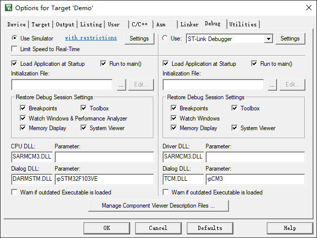

### 使用模拟器仿真串口

1. 使用VSPD创建并连接两个串口，一般为COM2和COM3。这里假设COM2关联单片机，COM3关联串口助手
2. 进入Keil的Debug模式，在左下角的命令行内输入`MODE COM2 115200,0,8,1`
3. 再输入`ASSIGN COM2 <S1IN> SIOUT` 完成绑定操作，此时单片机串口数据将会在串口助手中显示

> [keil调试串口的软件仿真方法_keil仿真串口_位文杰TOP的博客-CSDN博客](https://blog.csdn.net/qq_36958104/article/details/111815571)

### 使用模拟器中的示波器

> [如何使用Keil5中的虚拟示波器进行软件仿真_kile5示波器添加点_王开心.的博客-CSDN博客](https://blog.csdn.net/weixin_43737995/article/details/98049869)

***

## STM32CubeIDE可能遇到的问题

**STM32CubeIDE主题设置与汉化**

1.  help->Eclipse Market->输入"Devstyle"查找主题插件->install安装
2.  窗口->首选项 ->常规->外观 选择喜欢的主题
3.  设置完成后会提示重启，重启后完成xiu

> [(4条消息) 【分享】STM32CubeIDE汉化教程 直接在线安装或下载语言包安装 稳定可靠！_像河与海ywr的博客-CSDN博客_stm32cubeide汉化](https://blog.csdn.net/m0_46681107/article/details/119478800)

**STM32CubeIDE自动补全**

> [(4条消息) STM32CubeIDE 1.9.0 代码自动补全_藤一泓的博客-CSDN博客_cubeide自动补全](https://blog.csdn.net/qq_45507036/article/details/123133648)

**STM32添加.c和.h文件**

> [(3条消息) stm32CubeIDE 在自己工程中添加.c 和.h文件_超级网吧的博客-CSDN博客_stm32cubeide添加文件](https://blog.csdn.net/qq_36300069/article/details/103226568)

**STM32CubeIDE输入输出浮点数**

在project -> properties -> C/C++ build -> Setting -> MCU Setting -> 勾选`use float with printf from newlib-nano(-u _printf float)`和`use float with scanf from newlib-nano(-u _scanf float)`

**STM32CubeIDE调整优化等级**

芯片flash如果太小，则可以project -> properties -> C/C++ build -> Setting -> MCU GCC Compiler -> Optimization 

Optimization level选择 `optimize most (-o3)`

***
## VS Code搭环境

### keil Assistant插件
> [(3条消息) 如何利用VScode打造优雅的STM32开发环境(超详细，新手向)——Keil Assistant插件_WZH灬的博客-CSDN博客](https://blog.csdn.net/weixin_43395116/article/details/114238722?ops_request_misc=%257B%2522request%255Fid%2522%253A%2522166609830516782412548841%2522%252C%2522scm%2522%253A%252220140713.130102334..%2522%257D&request_id=166609830516782412548841&biz_id=0&utm_medium=distribute.pc_search_result.none-task-blog-2~blog~top_click~default-1-114238722-null-null.nonecase&utm_term=keil%20assistant&spm=1018.2226.3001.4450)

### EIDE插件
> [这是什么？ | Embedded IDE For VSCode (em-ide.com)](https://em-ide.com/zh-cn/docs/intro)

> [(3条消息) 一个超级好用的插件—EIDE，在VSCODE下快速创建ARM工程_小麦大叔的博客-CSDN博客](https://great.blog.csdn.net/article/details/119067457?spm=1001.2014.3001.5506)

### 使用插件Cortex-debug进行调试

> [(22条消息) 使用 VSCode、arm-none-eabi-gdb、J-Link GDB Server 调试RTThread_rtthread env工具 在线调试_zhang-ge的博客-CSDN博客](https://blog.csdn.net/weixin_40837318/article/details/105188523)

> [(22条消息) Cortex-debug 调试器使用介绍_cortex debug_「已注销」的博客-CSDN博客](https://blog.csdn.net/qq_40833810/article/details/106713462)

#### 使用jlink调试

1. 安装Cortex-debug插件

2. 安装jlinkGDB，这个可以在EIDE中安装，目录路径位于C盘用户名下.eide/tools中，名字叫做jlink

3. 在Cortex-debug插件json设置中，加入下面几行(用户名需要自己更改)

    ```json
    "cortex-debug.armToolchainPath": "C:\\Users\\bcl\\.eide\\tools\\gcc_arm\\bin",
    "cortex-debug.JLinkGDBServerPath":"C:\\Users\\bcl\\.eide\\tools\\jlink\\JLinkGDBServerCL.exe",
    ```

4. 在debug的launch.json中加入以下几行

    ```json
        "configurations": [
            {
                "cwd": "${workspaceRoot}",
                "type": "cortex-debug",
                "request": "launch",
                "name": "jlink",
                "servertype": "jlink",
                "interface": "swd",
                "executable": "build\\Demo\\STM32.elf",		//指定.elf路径
                "runToEntryPoint": "main",				   //起始点为main函数
                "device": "STM32F103VC"					   //要配置成所使用的芯片
            },
    ```

5. 按下键盘F5即可开始调试

#### 使用STlink或其他仿真器调试

1. 安装Cortex-debug插件

2. 安装openOCD，这个可以在EIDE中安装，目录路径位于C盘用户名下.eide/tools中，名字以openocd开头

3. 在Cortex-debug插件json设置中，加入下面几行(用户名需要自己更改)
    ```json
    "cortex-debug.armToolchainPath": "C:\\Users\\bcl\\.eide\\tools\\gcc_arm\\bin",
    "EIDE.OpenOCD.ExePath": "${userRoot}/.eide/tools/openocd_7a1adfbec_mingw32/bin/openocd.exe",
    "cortex-debug.openocdPath":
    "C:\\Users\\bcl\\.eide\\tools\\openocd_7a1adfbec_mingw32\\bin\\openocd.exe",
    ```

4. 在debug的launch.json中加入以下几行

    ```json
             "configurations": [
            {
                "cwd": "${workspaceRoot}",
                "type": "cortex-debug",
                "request": "launch",
                "name": "stlink",
                "servertype": "openocd",
                "executable": "build\\Demo\\STM32.elf", //指定.elf路径
                "runToEntryPoint": "main",			   //起始点为main函数
                "configFiles": [
                    "interface/stlink.cfg",
        //在openocd_7a1adfbec_mingw32\share\openocd\scripts\interface目录下寻找对应仿真器的cfg文件
                    "target/stm32f1x.cfg"
        //在openocd_7a1adfbec_mingw32\share\openocd\scripts\target目录下寻找对应芯片的cfg文件
                ]
            }
    ```

## STM32CubeMX

[【编辑器】STM32CubeMx生成的代码改为4空格制表符缩进_cubemx生成代码tab空格为4_菜老越的博客-CSDN博客](https://blog.csdn.net/spiremoon/article/details/111519064)

***
# 常见问题

- 功能配置中的结构体名要与具体操作中的结构体名保持一致，不然就会无效，详见MDK\_IIC\_EEPROM与MDK\_SPI\_FLASH。

- 若使用printf重定义时，显示FILE未定义，则需要引用`<stdio.h>`，同时打开`use microLIB`。重定义代码见UART

- `_weak` 修饰的函数是弱函数，用户可以在用户文件中重新定义一个同名函数，最终编译器编译的时候，会选择用户定义的函数

- C/C++语言中struct结构体定义中`__packed`的作用

    __packed是字节对齐的意思，比如说int float double char它的总大小是4 + 4 + 8 + 1 = 17。

    如果不用__packed，系统将以默认的方式对齐，不足4字节以4字节补齐。

    \_\_packed是进行一字节对齐。使用\_\_packed一般会以降低运行性能为代价，由于大多数cpu处理数据在合适的字节边界数的情况下会更有效，packed的使用会破坏这种自然的边界数。

- 注意要在LED点亮之前，对所有LED进行==熄灭==操作，不然所有都是点亮状态。

- 如果STM32 调试停留在 `LDR R0, =SystemInit` ,不能运行。原因是在程序中使用了C语言的标准库，例如stdio.h。解决方法是在魔术棒中开启`use microLIB`重映射问题，需要开启AFIO和相对应外设的重映射函数。具体实例参照

> [(4条消息) rtthread 重映射引脚输出pwm 注意事项\_arno-1104的博客-CSDN博客](https://blog.csdn.net/spu20134823091/article/details/123362385)

- ==Scanf不能放入提示字符串==，不然会无效，切记，只能写格式符。

- ->和.的区别：
    -> 的左边是结构体指针   .的左边是结构体名称。
    `a -> b == (\*a).b`

- C 语言不允许返回一个完整的数组作为函数的参数。但是，可以通过指定不带索引的数组名来返回一个指向数组的指针。例如在crucis中的水平航向计算函数。使用时需设定指针变量。

```c
/**
 * @brief 水平航向计算
 * @param Pro 总推进力    P的范围为[0,560]    经测试最大占空比为8.9(1780hz)，最小占空比为6(1200hz)
 * @param θ 与X轴的夹角 θ为[0,2*pi)
 * @retval Pout 存放四个推进器的分量数组的首地址
*/
float *Task_Horizontal_Heading_Calculation(uint16_t Pro,float θ)
{
    static float Pout[4];
    if(0 < Pro <= 560)
    {
        Pout[0] = 0.5*Pro*cos(θ+PI/4);     //P1的推进力
        Pout[1] = 0.5*Pro*cos(θ-5*PI/4);    //P2的推进力
        //Pout[2] = 0.5*Pro*cos((θ-135)*pi/180);    //P3的推进力
        //Pout[3] = 0.5*Pro*cos((θ-45)*pi/180);     //P4的推进力
        Pout[2] = -Pout[0];
        Pout[3] = -Pout[1];
    }
    return Pout;
}
```

- C 不支持在函数外返回局部变量的地址，除非定义数组（局部变量）为 `static`变量。

- Code是代码占用的空间:

RO-data是 Read Only 只读常量的大小，如const型;

RW-data是（Read Write） 初始化了的可读写变量的大小;

ZI-data是（Zero Initialize） 没有初始化的可读写变量的大小。

ZI-data不会被算做代码里因为不会被初始化;

在烧写的时候是FLASH中的被占用的空间为：     Code + RO Data + RW Data

程序运行的时候，芯片内部RAM使用的空间为：               RW Data + ZI Data

- 出现警告`variable "d" was set but never used`，原因是变量'd'定义但从未使用，或者是，虽然这个变量你使用了，但编译器认为变量d所在的语句没有意义，编译器把它优化了。排除未使用的情况，最佳解决办法就是在变量前加==volatile==的修饰符

- 如何相对准确定时1us？采用寄存器法会比较好。

    > [(29条消息) STM32延时函数的四种方法：普通延时（2种）、SysTick 定时器延时（2种）_stm32 中断延时和系统延时的区别_魏波.的博客-CSDN博客](https://blog.csdn.net/weibo1230123/article/details/81136564)
    
- 调用HAL_Delay()函数在极短延时时间（例如1ms）会多延时1ms，误差很大。原因在于其函数内部。

    ```c
    __weak void HAL_Delay(uint32_t Delay)
    {
      uint32_t tickstart = HAL_GetTick();
      uint32_t wait = Delay;
      /* Add a freq to guarantee minimum wait */
      if (wait < HAL_MAX_DELAY)
      {
        wait += (uint32_t)(uwTickFreq);
      }
      while ((HAL_GetTick() - tickstart) < wait);
    }
    ```

    为了防止**防止无意义延时（即0ms延时）的产生**，在HAL_Delay函数传入参数之后会对参数加1。对于任意延时而言都会比预想的多1ms。

    在SGA库中，我打算使用子函数Drv_Delay_Us()来进行准确延时，经过测试，误差缩小很多。缺点是延时的上限会少1000倍。

    [(32条消息) STM32使用HAL库自带延时函数HAL_Delay时存在1ms误差_Mr.Piece的博客-CSDN博客](https://blog.csdn.net/PianGe_zyl/article/details/108880981)
    
- MDK 出现#68-D: integer conversion resulted in a change of sign 

    因为我在函数返回值处写的是uint8_t，但是我想返回-1，导致无法返回负数，返回值改成int8_t即可。
    
- 编译出现explicit type is missing ("int" assumed)解决方法，在函数前面加个void

    [explicit type is missing ("int" assumed)解决方法_JaLLs的博客-CSDN博客](https://blog.csdn.net/JaLLs/article/details/100726066)
    
- STM32芯片出现读写保护如何解除？（我犯了选错启动文件的错误，导致芯片自锁）

    [STM32芯片解除写保护的方法（亲测有效）_stm32写保护如何解除-CSDN博客](https://blog.csdn.net/weixin_49805374/article/details/116604048)

    [STM32自锁如何解锁？(解锁方法)No Cortex-M SW Device Found/HardFault_Handler_no cotex-m-CSDN博客](https://blog.csdn.net/as480133937/article/details/103131038)

    [STM32 芯片锁死解决方法 - 壹点灵异 - 博客园 (cnblogs.com)](https://www.cnblogs.com/skullboyer/p/12951272.html)这个最方便，每次烧录按一下复位键就行
    
- 常总是会遇到double类型变量与0之间的比较。非严格情况下直接与0比较了，但实际上这是一种错误的写法

    例如if(buffer[0] < 0) buffer[0]为double类型，

    double为双精度类型，其一般保留15为小数。而Flaot单精度类型一般保留6为小数，故而不能直接与0进行比较。这里选择一个比较小的数1e-15，取其近似数来与double类型变量比较。

    [C++ float、double判断是否等于0_c语言判断double是否为0-CSDN博客](https://blog.csdn.net/xp178171640/article/details/104565053)
    
- [Stm32 调试时发生HardFault_Handler - R1chie - 博客园 (cnblogs.com)](https://www.cnblogs.com/r1chie/p/13558091.html)

***
# GPIO

- 在HAL库中所有外设的硬件初始化函数名`HAL_XXX_MspInit(xxx)`;可以在对应的XXX_Init(  )中找到。
- LED使用输出模式，按键使用输入模式。
- 可以使用`flag = （HAL_GPIO_ReadPin（GPIOx,GPIO_PIN_x）==GPIO_PIN_RESET）?0:1; //按下为0，松开为1` <font color =red>（仅针对正点原子的开发板）</font>
- 如果需要重映射I/O，需要先使用复用时钟`__HAL_RCC_AFIO_CLK_ENABLE( )`，对应的重映射函数可以在`stm32f1xx_hal_gpio_ex.h`查找。

## 一般GPIO初始化步骤

1.开启对应外设的时钟
2.构造结构体，为结构体成员赋值
3.调用库函数初始化函数，初始化I/O

> <font color=red>Tips:</font> 在GPIO模式设置为输出模式时，必须设置Speed；设置为输入模式时，必须设置Pull。

**举例说明**：

```c
__HAL_RCC_GPIOx_CLK_ENABLE( ); //使能哪个分区的I/O

GPIO_InitTypeDef GPIOINIT;
GPIOINIT.Mode = GPIO_MODE_OUTPUT_PP;//推挽输出
GPIOINIT.Pin = GPIO_PIN_x;//选择x号
GPIOINIT.Speed = GPIO_SPEED_FREQ_HIGH;//高速50mhz
HAL_GPIO_Init(GPIOx,&GPIOINIT); //调用hal库初始化函数，对GPIOx进行初始化

HAL_GPIO_WritePin(GPIOx,GPIO_PIN_x,GPIO_PIN_SET); //拉低电平
```

F4系列多了一个初始化配置选项Alternate

```c
GPIOINIT.Alternate = GPIO_AF7_USART1;	//复用为串口1
```


***
# RCC

## 时钟配置示例

```c
static void S_HAL_CLKConfig(void)
{
  RCC_OscInitTypeDef RCC_OscInitStruct = {0};
  RCC_ClkInitTypeDef RCC_ClkInitStruct = {0};
  /** Initializes the CPU, AHB and APB busses clocks
  */
  RCC_OscInitStruct.OscillatorType = RCC_OSCILLATORTYPE_HSE;
  RCC_OscInitStruct.HSEState = RCC_HSE_ON;
  RCC_OscInitStruct.HSEPredivValue = RCC_HSE_PREDIV_DIV1;
  RCC_OscInitStruct.HSIState = RCC_HSI_ON;
  RCC_OscInitStruct.PLL.PLLState = RCC_PLL_ON;
  RCC_OscInitStruct.PLL.PLLSource = RCC_PLLSOURCE_HSE;
  RCC_OscInitStruct.PLL.PLLMUL = RCC_PLL_MUL9;
    
  if (HAL_RCC_OscConfig(&RCC_OscInitStruct) != HAL_OK)
  {
    while(1);
  }

  /** Initializes the CPU, AHB and APB busses clocks
  */
  RCC_ClkInitStruct.ClockType = RCC_CLOCKTYPE_HCLK|RCC_CLOCKTYPE_SYSCLK
			                   |RCC_CLOCKTYPE_PCLK1|RCC_CLOCKTYPE_PCLK2;
  RCC_ClkInitStruct.SYSCLKSource = RCC_SYSCLKSOURCE_PLLCLK;
  RCC_ClkInitStruct.AHBCLKDivider = RCC_SYSCLK_DIV1;
  RCC_ClkInitStruct.APB1CLKDivider = RCC_HCLK_DIV2;
  RCC_ClkInitStruct.APB2CLKDivider = RCC_HCLK_DIV1;

  if (HAL_RCC_ClockConfig(&RCC_ClkInitStruct, FLASH_LATENCY_2) != HAL_OK)
  {
    while(1);
  }
}
```

其中`HAL_RCC_ClockConfig( )`函数中关于输入参数FLatency的选择
- 0 < SYSCLK <= 24      选择0WS(1CPU cycle)     <font style="background:green">FLASH_LATENCY_0</font>
- 24 < SYSCLK <= 48    选择1WS(2CPU cycle)     <font style="background:green">FLASH_LATENCY_1</font>
- 48 < SYSCLK <= 72    选择2WS(3CPU cycle)     <font style="background:green">FLASH_LATENCY_2</font>

***
# NVIC

- NVIC相关的库函数声明在`stm32f1xx_hal_cortex.h`
- NVIC中断向量表在启动文件`startup_stm32f103xe.h`
- 设置中断优先级可选参数`IRQn_Type`在`stm32f103xe.h`
> <font color =red>Tips:</font> 根据使用芯片库不同，文件名会有些许变化。

## 设置中断优先级相关的函数

1.`HAL_NVIC_SetPriorityGrouping(NVIC_PRIORITYGROUP_x)` 
设置优先级分组，根据参数`NVIC_PRIORITYGROUP_x`确定主优先级位数，最高为4位

2.`HAL_NVIC_SetPriority(IRQn_Type, 0, 0)`
设置中断优先级，第二参数为主优先级，第三参数为次优先级，数字越小优先级越高

3.`HAL_NVIC_EnableIRQ(IRQn_Type)`
使能中断优先级

## 常用中断写法

### 外部中断

外部中断多用于按键

```c
void EXTIx_IRQHandler(void)
{
   HAL_GPIO_EXTI_IRQHandler(GPIO_PIN_x); 
} //固定写法，交给HAL库处理

void HAL_GPIO_EXTI_Callback(uint16_t GPIO_Pin)
{
	//写中断发生时需要完成的事件  
}
```
> <font color =red>Tips:</font> EXTIx中x的取值与GPIO_PIN_x相关，具体看中断向量表

### 其他中断

例如串口、定时器、SPI等

```c
void xxxx_IRQHandler(void)
{
   HAL_xxxx_IRQHandler(&对应句柄); 
} //固定写法，交给HAL库处理

/*回调函数可以没有*/
void HAL_xxxx_Callback(&对应句柄)
{
	//写中断发生时需要完成的事件  
}
```
***

# OLED

不同的OLED驱动方式也不相同，根据引脚数量，有8080并口、SPI、IIC。

## 8080并口模式

- 8080的驱动可以参考正点原子的代码。并且正点原子的OLED在改变工作模式时需要用烙铁更改模块背后的BS1和BS2。

- 按照正点原子的写法，只输入数字和英文时：

	1.字号12 可以显示21列	5行
	2.字号16 可以显示16列	4行
	3.字号24 可以显示10列	2行

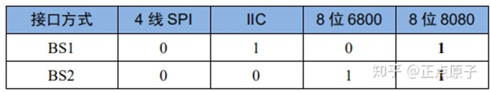


| 接口方式 | 4线SPI | IIC  | 8位6800 | 8位8080 |
| :------: | :----: | :--: | :-----: | :-----: |
|   BS1    |   0    |  1   |    0    |    1    |
|   BS2    |   0    |  0   |    1    |    1    |

> [(3条消息) OLED显示屏驱动：8080并口，IIC，SPI三种驱动方式_tutu-hu的博客-CSDN博客_8080并口屏](https://blog.csdn.net/weixin_42700740/article/details/94380147)


## SPI模式

### 硬件SPI
> [(5条消息) STM32 硬件 SPI 驱动 0.96 寸 的 OLED_霁风AI的博客-CSDN博客](https://blog.csdn.net/wwt18811707971/article/details/78681547)

### 软件SPI

> [(5条消息) 一步步学习0.96寸七针OLED显示屏SPI接口驱动(附移植代码)--基于STM32_hhh_little_hu的博客-CSDN博客_7针oled显示](https://blog.csdn.net/weixin_40134414/article/details/105308234)

## IIC模式

### 硬件IIC

> [STM32_HAL_IIC_SSD1306: 基于HAL库的SSD1306驱动 (gitee.com)](https://gitee.com/snitro/stm32_hal_iic_ssd1306)

> <font color = red>Tips:</font>一般不使用STM32的硬件IIC，一是有BUG，二是不如软件IIC方便，任意两个I/O口即可使用。

### 软件IIC

> [(4条消息) STM32之0.96寸 4针 OLED显示屏（IIC协议）驱动代码（程序稳定，清晰明了）_xiaohai@Linux的博客-CSDN博客](https://blog.csdn.net/qq_34885669/article/details/89847349)

> [(4条消息) 四针OLED驱动代码——IIC驱动_新时代城市农民工的博客-CSDN博客_oled驱动代码](https://blog.csdn.net/weixin_46199479/article/details/124454194)

## 其他问题

1.如何让屏幕显示浮点数？

> [(3条消息) STM32 OLED_I2C动态显示 float类型（浮点型）数据_Guard_Byte的博客-CSDN博客_oled显示浮点数stm32](https://blog.csdn.net/Guard_Byte/article/details/123675709)

***

# UART

## 串口初始化结构体

```c
typedef struct {
    uint32_t BaudRate;            //波特率
    uint32_t WordLength;          //字长
    uint32_t StopBits;            //停止位
    uint32_t Parity;              //校验位
    uint32_t Mode;                //UART模式
    uint32_t HwFlowCtl;           //硬件流控制
    uint32_t OverSampling;        // 过采样模式
    uint32_t CLKLastBit;          // 最尾位时钟脉冲
} USART_InitTypeDef;
```

1.BaudRate：波特率设置。一般设置为2400、9600、19200、115200。HAL库函数会根据设定值计算得到UARTDIV值，见公式 20‑1，并设置UART_BRR寄存器值。

2.WordLength：数据帧字长，可选8位或9位。它设定UART_CR1寄存器的M位的值。 如果没有使能奇偶校验控制，一般使用8数据位；如果使能了奇偶校验则一般设置为9数据位。

3.StopBits：停止位设置，可选0.5个、1个、1.5个和2个停止位， 它设定USART_CR2寄存器的STOP[1:0]位的值，一般我们选择1个停止位。

4.Parity：奇偶校验控制选择，可选USART_PARITY_NONE (无校验)、USART_PARITY_EVEN (偶校验)以及USART_PARITY_ODD (奇校验)，它设定UART_CR1寄存器的PCE位和PS位的值。

5.Mode：UART模式选择，有USART_MODE_RX和USART_MODE_TX， 允许使用逻辑或运算选择两个，它设定USART_CR1寄存器的RE位和TE位。

## 串口外设I/O表

### F1系列

|         | USART1 | USART2 | USART3 | UART4 | UART5 |
| :-----: | :----: | :----: | :----: | :---: | :---: |
| UART_TX |  PA9   |  PA2   |  PB10  | PC10  | PC12  |
| UART_RX |  PA10  |  PA3   |  PB11  | PC11  |  PD2  |

### F4系列

|        | TXD1 | RXD1 | TXD2     | RXD2     |
| ------ | ---- | ---- | -------- | -------- |
| USART1 | PA9  | PA10 | PB6      | PB7      |
| USART2 | PA2  | PA3  | PD5      | PD6      |
| USART3 | PB10 | PB11 | PC10/PD8 | PC11/PD9 |
| UART4  | PA0  | PA1  | PC10     | PC11     |
| UART5  | PC12 | PD2  |          |          |
| USART6 | PC6  | PC7  | PG14     | PG9      |

## 串口使用注意事项

1. STM32F1和F2单片机上用HAL库的USART串口接收函数HAL_UART_Receive_IT循环接收串口字符，串口接收大批量数据后突然死机，不能继续接收的解决办法

> [【BUG处理】STM32F1和F2单片机上用HAL库的USART串口接收函数HAL_UART_Receive_IT循环接收串口字符，串口接收大批量数据后突然死机，不能继续接收的解决办法_巨大八爪鱼的博客-CSDN博客](https://blog.csdn.net/ZLK1214/article/details/105624510)

2. 串口发送函数HAL_UART_Transmit和串口接收函数HAL_UART_Receive_IT不能并发调用，==必须用互斥量保护==。

3. 串口DMA收发相关帖子，可以参考

> [STM32_HAL库_CubeMx串口DMA通信（DMA发送+DMA空闲接收不定长数据）_何为其然的博客-CSDN博客_cubemx串口dma](https://blog.csdn.net/qq_30267617/article/details/118877845)

4. ==使用F4开发板的时候，发现RX脚，比如PA10必须设置为GPIO_MODE_AF_PP才能正常工作，相反F1系列则必须设置成GPIO_MODE_INPUT才能正常工作。==

## 串口工作模式初始化示例

```c
__HAL_RCC_USART1_CLK_ENABLE();
UART_HandleTypeDef huart1;

huart1.Instance = USART1;
huart1.Init.BaudRate = 115200;
huart1.Init.WordLength = UART_WORDLENGTH_8B;
huart1.Init.StopBits = UART_STOPBITS_1;
huart1.Init.Parity = UART_PARITY_NONE;
huart1.Init.Mode = UART_MODE_TX_RX;
huart1.Init.HwFlowCtl = UART_HWCONTROL_NONE;
huart1.Init.OverSampling = UART_OVERSAMPLING_16;
if (HAL_UART_Init(&huart1) != HAL_OK)
{
	Error_Handler();
}

//如果需要中断，添加下述代码（这里是以UART1中断举例）
HAL_NVIC_SetPriority(USART1_IRQn, 0, 0);
HAL_NVIC_EnableIRQ(USART1_IRQn);
  
//如果需要DMA，添加下述代码（这里是以UART1的发送举例）
DMA_HandleTypeDef hdma_usart1_tx;
  
hdma_usart1_tx.Instance = DMA1_Channel4;
hdma_usart1_tx.Init.Direction = DMA_MEMORY_TO_PERIPH;
hdma_usart1_tx.Init.PeriphInc = DMA_PINC_DISABLE;
hdma_usart1_tx.Init.MemInc = DMA_MINC_ENABLE;
hdma_usart1_tx.Init.PeriphDataAlignment = DMA_PDATAALIGN_BYTE;
hdma_usart1_tx.Init.MemDataAlignment = DMA_MDATAALIGN_BYTE;
hdma_usart1_tx.Init.Mode = DMA_NORMAL;
hdma_usart1_tx.Init.Priority = DMA_PRIORITY_LOW;
if (HAL_DMA_Init(&hdma_usart1_tx) != HAL_OK)
{
	Error_Handler();
}
__HAL_LINKDMA(uartHandle,hdmatx,hdma_usart1_tx); //链接两个设备，不能遗漏

//DMA也有中断优先级
HAL_NVIC_SetPriority(DMA1_Channel5_IRQn,0，0);
HAL_NVIC_EnableIRQ(DMA1_Channel5_IRQn);
```

> <font color=red>Tips:</font>
>
> 1.这里并没有将串口GPIO的初始化列出来，在实际中一定要初始化GPIO。
>
> 2.不要忘记开始对应时钟和链接设备。
>
> 3.UART 数据帧格式是低位先发。

## Printf重定向

串口输出函数一般使用HAL_UART_Transmit( ),但是这样调试不够方便，在标准C语言中，我们一般使用printf( )函数，因此需要些许调整，以使用该函数。

### Keil重定向方法

```c
extern UART_HandleTypeDef huart1;//根据需要修改huart,此处为UART1
//定义变量存储用户数据
uint8_t ch;
uint8_t ch_r;
//重写这个函数,重定向printf函数到串口
int fputc(int c, FILE * f)
{
   ch = c;//存储一个数据
   HAL_UART_Transmit(&huart1,&ch,1,1000);//通过串口发送这一个数据(超时时间1000毫秒)
   return c;//发送完成后返回这个数据
}

 //重定向scanf函数到串口 意思就是说接受串口发过来的数据
 int fgetc(FILE * F)
{
   HAL_UART_Receive(&huart1,&ch_r,1,0xffff);//通过串口接收数据(超时时间65535毫秒)
   return ch_r;//返回接收到的数据信息
}
```

> [keil工程当中实现printf重定向串口打印 (shuzhiduo.com)](https://www.shuzhiduo.com/A/QW5YGA73zm/)

### STM32CubeIDE重定向方法

> [在stm32使用printf的两种方法 - 知乎 (zhihu.com)](https://zhuanlan.zhihu.com/p/265612712)
>
> [(3条消息) 在STM32中使用printf()和scanf_Monster xn的博客-CSDN博客_stm32scanf](https://blog.csdn.net/weixin_45636061/article/details/117969437)

## 串口接收函数

### 串口中断接收服务函数示例

```c
//使用串口中断时，在服务函数中可以使用中断函数完成嵌套，继续接收下一位或者x位。
Void HAL_UART_RxCpltCallback(UART_HandleTypeDef *huart)
{
	/*自写处理buffer代码*/
	HAL_UART_Receive_IT(&huart1，buffer，1);
}
```

> <font color=red>Tips:</font>不要忘记先使用HAL_UART_Receive_IT(&huart1，buffer，x)接收一次数据，很容易遗忘。

### 串口DMA中断接收处理函数示例

```c
void USART1_IRQHandler(UART_HandleTypeDef *huart)
{
	if(__HAL_UART_GET_FLAG(&huart1,UART_FLAG_IDLE) != RESET) // 空闲中断标记被置位
	{
		__HAL_UART_CLEAR_IDLEFLAG(&huart1);// 清除中断标记
		HAL_UART_DMAStop(&huart1);// 停止DMA接收
		/* 可以加入计算接收数据长度代码 */
         DMARxCplt = 1;// 标记接收结束
         HAL_UART_Receive_DMA(&huart1,buffer,10);// 重新启动DMA接收
	}
}
```

> <font color=red>Tips:</font>
>
> 1.在主函数中判断接收标志位，如果为1，进行数据分析，并且在结束之后，要将接受标志位重新置0
>
> 2.在SGA库中这段代码也被封装了起来，成为一个通用的API。

## HAL库串口DMA数据收发参考

> [HAL UART DMA 数据收发 - DW039 - 博客园 (cnblogs.com)](https://www.cnblogs.com/dw039/p/11692472.html) 
>
> [STM32_HAL库_CubeMx串口DMA通信（DMA发送+DMA空闲接收不定长数据）_何为其然的博客-CSDN博客_dma_handletypedef](https://blog.csdn.net/qq_30267617/article/details/118877845#:~:text=进入到 HAL_UART_Transmit_DMA,这个函数中可以看到，它将DMA传输完成、半完成、错误的回调函数分别定向到了串口DMA传输完成、半完成、错误的回调函数 UART_DMATransmitCplt、UART_DMATxHalfCplt、UART_DMAError 。)

高波特率大数据量情况下使用fifo，F1只能使用半满半断的搬运模式，F4可以使用双缓存搬运模式。

> [一个严谨的STM32串口DMA发送&接收（1.5Mbps波特率）机制_1.5mbps串口_Acuity.的博客-CSDN博客](https://blog.csdn.net/qq_20553613/article/details/108367512)
>
> [STM32 HAL 库实现乒乓缓存加空闲中断的串口 DMA 收发机制，轻松跑上 2M 波特率 - 扑鱼 - 博客园 (cnblogs.com)](https://www.cnblogs.com/puyu9499/p/15914090.html)

***

# DMA

## DMA初始化结构体

```c
typedef struct {

    uint32_t Direction;            //传输方向
    uint32_t PeriphInc;            //外设递增
    uint32_t MemInc;               //存储器递增
    uint32_t PeriphDataAlignment;  //外设数据宽度
    uint32_t MemDataAlignment;     //存储器数据宽度
    uint32_t Mode;                 //模式选择
    uint32_t Priority;             //优先级

} DMA_InitTypeDef;
```

1.Direction：传输方向选择，可选外设到存储器、存储器到外设以及存储器到存储器。 它设定DMA_SxCR寄存器的DIR[1:0]位的值。ADC采集显然使用外设到存储器模式。

2.PeripheralInc：如果配置为DMA_PINC_ENABLE，使能外设地址自动递增功能， 它设定DMA_CCR寄存器的PINC位的值；一般外设都是只有一个数据寄存器，所以一般不会使能该位。

3.MemoryInc：如果配置为DMA_MINC_ENABLE，使能存储器地址自动递增功能，它设定DMA_CCR寄存器的MINC位的值； 我们自定义的存储区一般都是存放多个数据的，所以要使能存储器地址自动递增功能。

4.PeriphDataAlignment：外设数据宽度，可选字节(8位)、半字(16位)和字(32位)， 它设定DMA_SxCR寄存器的PSIZE[1:0]位的值。 ADC数据寄存器只有低16位数据有效，使用半字数据宽度。

5.Mode：DMA传输模式选择，可选一次传输或者循环传输，它设定DMA_SxCR寄存器的CIRC位的值。 我们希望ADC采集是持续循环进行的，所以使用循环传输模式。

6.软件设置数据流的优先级，有4个可选优先级分别为非常高、高、中和低，它设定DMA_SxCR寄存器的PL[1:0]位的值。 DMA优先级只有在多个DMA数据流同时使用时才有意义，一般设置为非常高优先级就可以了。

## DMA使用注意事项

1.在UART和DMA的使用中，<font color=red>关联函数`__HAL_LINKDMA()`非常重要，构建数据链路，必不可少</font>

2.==F1系列UART5没有DMA通道！！！==

3.在使用串口DMA传输时，记得打开串口的全局中断。以下两个中断函数（可以在startup中找到相对应的名字）都需要在stm32f1xx_it.c中出现

```c
void DMA1_Channel4_IRQHandler(void)
{
	HAL_DMA_IRQHandler(&hdma_usart1_tx);
}
void USART1_IRQHandler(void)
{
	HAL_UART_IRQHandler(&huart1);
}
```

4.在使用串口DMA时，记得将DMA初始化放在串口初始化之前，DMA的时钟开启必须在USART之前，否则USART是无法使用DMA进行数据接收的。

5.当DMA模式配置为串口发送时，DMA_NORMAL为单次发送，发完就停止了，DMA_CIRCULAR为一直发送。如果想要使用DMA_NORMAL，但是还想连续发送，需要在DMA中断函数中，关闭DMA，清除标志位TC，重载寄存器CNDTR，最后在打开DMA，即可继续发送。下面是标准库参考，API有些区别。

> [STM32的UART DMA传输总结_海鲜小王子的博客-CSDN博客_stm32 dma 传输完一帧数据](https://blog.csdn.net/u011388550/article/details/49965117)

## DMA外设通道图

### F1系列

#### DMA1

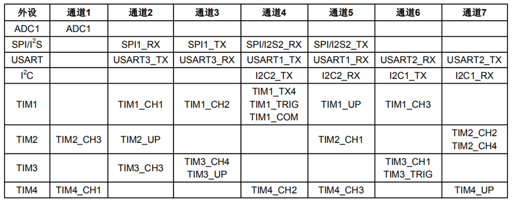

#### DMA2

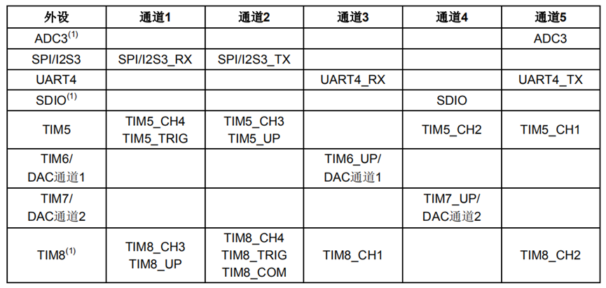

### F4系列

#### DMA1

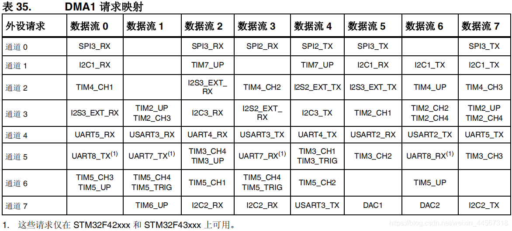

#### DMA2

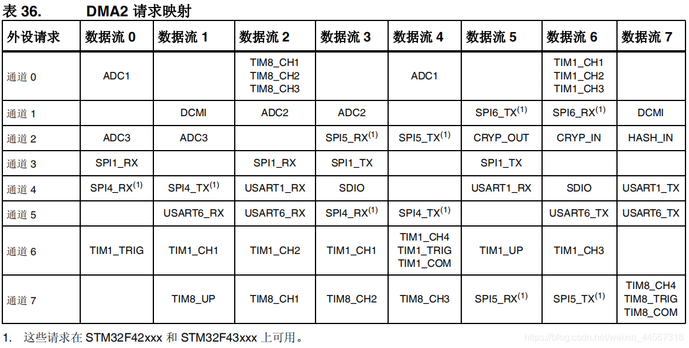

***

# ADC

## ADC初始化结构体

```c
typedef struct
{
    uint32_t Mode;                      // ADC 工作模式选择
    FunctionalState ScanConvMode;       /* ADC 扫描（多通道）
                                                或者单次（单通道）模式选择 */
    FunctionalState ContinuousConvMode; // ADC 单次转换或者连续转换选择
    uint32_t ExternalTrigConv;          // ADC 转换触发信号选择
    uint32_t DataAlign;                 // ADC 数据寄存器对齐格式
    uint8_t NbrOfChannel;               // ADC 采集通道数
} ADC_InitTypeDef;
```

Mode：配置ADC的模式，当使用一个ADC时是独立模式，使用两个ADC时是双模式，在双模式下还有很多细分模式可选，具体配置ADC_CR1:DUALMOD位。

ScanConvMode：可选参数为ENABLE和DISABLE，配置是否使用扫描。如果是单通道AD转换使用DISABLE，如果是多通道AD转换使用ENABLE，具体配置ADC_CR1:SCAN位。

ContinuousConvMode：可选参数为ENABLE和DISABLE，配置是启动自动连续转换还是单次转换。使用ENABLE配置为使能自动连续转换；使用DISABLE配置为单次转换，转换一次后停止需要手动控制才重新启动转换，具体配置ADC_CR2:CON位。

ExternalTrigConv：外部触发选择，图 29‑1中列举了很多外部触发条件，可根据项目需求配置触发来源。实际上，我们一般使用软件自动触发。

DataAlign：转换结果数据对齐模式，可选右对齐ADC_DataAlign_Right或者左对齐ADC_DataAlign_Left。一般我们选择右对齐模式。

NbrOfChannel：AD转换通道数目，根据实际设置即可。具体的通道数和通道的转换顺序是配置规则序列或注入序列寄存器。


## ADC通道配置结构体

```c
typedef struct 
{
  uint32_t Channel;      //通道设置
  uint32_t Rank;         //优先级    
  uint32_t SamplingTime;  //采样时间        
}ADC_ChannelConfTypeDef;
```

## ADC外设通道图

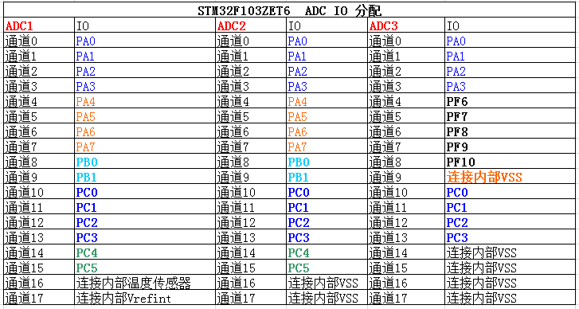

## ADC使用注意事项

- ADC有四种模式 单次非扫描 单次扫描 连续非扫描 连续扫描

- ADC采样频率不宜超过14Mhz，一般为PCLK的4分频。

- Stm32的ADC只能测量0-3.3v的电压，如果所测电压超过该值，需要外部分压电路。

- 使用`ADC_AnalogWDGConfTypeDef`定义模拟看门狗。、

- `ADC_vol = `<font color=red>(float)</font>`ADC_ConvertedValue/4096*`<font color=red>(float)</font>`3.3;`

    黑色表达会整除变成0（地板除）,需要==强制转换类型==来避免该问题

- 在使用HAL_ADC_Start_DMA时，该函数的参数中的存放数组为uint32_t，stm32的ADC位12位，一般采用Halfword(16bits)即可，所以一个32位数组中会有两次采集数据，如果要从中提取数据，需要进行与运算和位移运算实现高低16位分离。当然也可以直接改变buffer的数据类型为uint16_t。

- 在写ADC程序中，切记根据传输方式不同选择不同的启动函数，否则会一直显示0，可以写在MX_ADC1_Init()的最后

    |  函数名  | HAL_ADC_Start | HAL_ADC_Start_IT | HAL_ADC_Start_DMA |
    | :------: | :-----------: | :--------------: | :---------------: |
    | 使用场景 |   普通模式    |     中断模式     |      DMA模式      |

## 独立多通道采集

> [(4条消息) STM32使用ADC+DMA进行多通道模拟量采集 （踩坑及傻瓜式解析）_tpytpytpy的博客-CSDN博客_adcdma中断多通道采集](https://blog.csdn.net/tpytpytpy/article/details/122563117)

***

# IIC

## IIC初始化结构体

```c
 typedef struct {
     uint32_t ClockSpeed; /*!< 设置SCL时钟频率，此值要低于40 0000*/
     uint32_t DutyCycle;  /*指定时钟占空比，可选low/high = 2:1及16:9模式*/
     uint32_t OwnAddress1; /*指定自身的I2C设备地址1，可以是 7-bit或者10-bit*/
     uint32_t AddressingMode; /*指定地址的长度模式，可以是7bit模式或者10bit模式*/

     uint32_t DualAddressMode; /*设置双地址模式 */
     uint32_t OwnAddress2;   /*指定自身的I2C设备地址2，只能是 7-bit */
     uint32_t GeneralCallMode; /*指定广播呼叫模式 */
     uint32_t NoStretchMode; /*指定禁止时钟延长模式*/
 } I2C_InitTypeDef;
```

## EEPROM

EEPROM芯片的设备地址一共有7位，其中高4位固定为：1010 b，低3位则由A0/A1/A2信号线的电平决定。

且当R/W位为0时，表示写方向，所以加上7位地址，其值为“0xA0”，常称该值为I2C设备的“写地址”；当R/W位为1时，表示读方向，加上7位地址，其值为“0xA1”，常称该值为“读地址”。

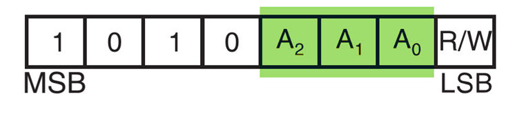

AT24C02的驱动分为硬件IIC和软件IIC，野火使用的硬件版，需要配置管脚和工作模式，配合HAL库写驱动。

软件IIC则更加麻烦，但是可以任意指定两个I/O作为SCL和SDA。

## IIC使用注意事项

- 由HAL库生成的IIC配置中缺少对主机地址的分配，例如hi2c1.Init.OwnAddress1 = 0，需要根据AT24C02的硬件连接取相应的地址，一般为0X0A。
- 如果遇到官方HAL库无法驱动EEPROM,可以去MDK_IIC_EEPROM工程中（或者网上寻找相应的驱动文件）的at24cxx.c中寻找相对应的初始化函数覆盖由HAL库生成的函数。

****

# SPI

## SPI初始化结构体

```c
typedef struct {
     uint32_t Mode;      /*设置SPI的主/从机端模式 */
     uint32_t Direction; /*设置SPI的单双向模式 */
     uint32_t DataSize;  /*设置SPI的数据帧长度，可选8/16位 */
     uint32_t CLKPolarity;/*设置时钟极性CPOL，可选高/低电平*/
     uint32_t CLKPhase; /*设置时钟相位，可选奇/偶数边沿采样 */
     uint32_t NSS;       /*设置NSS引脚由SPI硬件控制还是软件控制*/
     uint32_t BaudRatePrescaler; /*设置时钟分频因子，fpclk/分频数=fSCK */
     uint32_t FirstBit; /*设置MSB/LSB先行 */
     uint32_t TIMode;   /*指定是否启用TI模式 */
     uint32_t CRCCalculation; /*指定是否启用CRC计算*/
     uint32_t CRCPolynomial;  /*设置CRC校验的表达式*/
 } SPI_InitTypeDef;

```

## SPI外设I/O表

|      | SPI_MOSI | SPI_MISO | SPI_CLK | SPI_NSS |
| :--: | :------: | :------: | :-----: | :-----: |
| SPI1 |   PA7    |   PA6    |   PA5   |   PA4   |
| SPI2 |   PB15   |   PB14   |  PB13   |  PB12   |
| SPI3 |   PB5    |   PB4    |   PB3   |  PA15   |

## SPI使用注意事项

- SPI1挂载在APB2上，最高通信速度为36Mbits，2和3则位于APB1上，最高通信速度为18Mbits。==想使用SPI3需禁用原本的下载功能==。
- 在使用`SPI_FLASH_BufferWrite(uint8_t* pBuffer, uint32_t WriteAddr, uint16_t NumByteToWrite) `函数之前记得先擦除扇区。

## FLASH

flash的连接方式要查看当前板子的原理图。

若遇见flash的id和device的id都显示0xff时，注意NSS引脚的初始化。

例如正点原子的板子用的是PB12。按照如下配置：（普通推挽输出）

```c
/*Configure GPIO pin : PB12 */
GPIO_InitStruct.Pin = GPIO_PIN_12;
GPIO_InitStruct.Mode = GPIO_MODE_OUTPUT_PP;
GPIO_InitStruct.Pull = GPIO_NOPULL;
GPIO_InitStruct.Speed = GPIO_SPEED_FREQ_HIGH;
HAL_GPIO_Init(GPIOB, &GPIO_InitStruct);
```


***

# TIM

## 定时器分类

#### F1系列

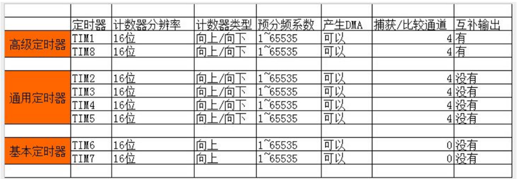

#### F4系列

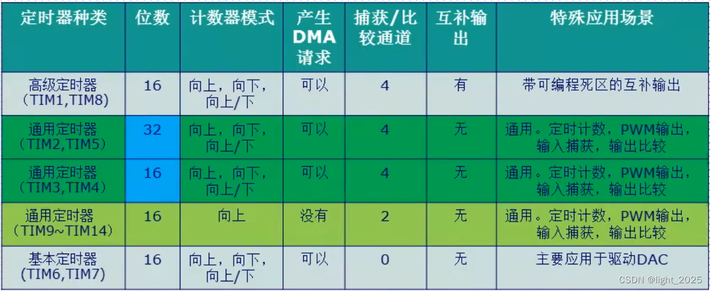

[stm32f4定时器时钟频率/选择_stm32f4时钟频率-CSDN博客](https://blog.csdn.net/weixin_45061010/article/details/118725485)

从时钟树中我们可以得知：
（1）高级定时器timer1, timer8以及通用定时器timer9, timer10, timer11的时钟来源是APB2总线
（2）通用定时器timer2-timer5，通用定时器timer12-timer14以及基本定时器timer6,timer7的时钟来源是APB1总线

**因为系统初始化SystemInit函数里初始化APB1总线时钟为4分频即42M，APB2总线时钟为2分频即84M，所以TIM1、TIM8-TIM11的时钟为APB2时钟的两倍即168M，TIM2-TIM7、TIM12-TIM14的时钟为APB1的时钟的两倍即84M。**

### 基础定时器

==基础定时器只能向上计数==

内部时钟CK_INT,经过APB1预分频器后分频提供。库函数中默认系数为2，即TIMxCLK=36*2=72M。

计数器时钟CK_CNT, 经过 PSC 预分频器之后, 可以对定时器时钟 TIMxCLK 进行 1~65536 之间的任何一个数进行分频。具体计算方式为：CK_CNT=TIMxCLK/(PSC+1)。

定时时间 = 计数器的中断周期 * 中断次数。计数器在 CK_CNT 的驱动下，计一个数的时间则是 CK_CLK 的倒数，等于：1/（TIMxCLK/(PSC+1)），产生一次中断的时间则等于：1/（CK_CLK * ARR）。如果在中断服务程序里面设置一个变量 time，用来记录中断的次数，那么就可以计算出我们需要的定时时间等于：1/CK_CLK * (ARR+1)*time。（ARR为手动设置可计数的最大值）

```c
typedef struct {
     uint32_t Prescaler;          // 预分频器
     uint32_t CounterMode;        // 计数模式  
     uint32_t Period;             // 定时器周期  即设置ARR的值
     uint32_t ClockDivision;      // 时钟分频  基本定时器没有此功能无需设置
     uint32_t RepetitionCounter;   // 重复计算器 高级定时器功能，控制PWM的个数
 } TIM_TimeBaseInitTypeDef;

```

### 高级定时器

时钟模式分为内部时钟源，外部时钟模式1（CH1/2/3/4），外部时钟模式2（ETR）,内部触发输入（主计时器控制从计时器）。

计数模式：递增计数模式、递减计数模式和递增/递减(中心对齐)计数模式

高级定时器特有的重复计数器，意思是每生成一次溢出事件，重复计数器内容-1，直到其内容为0时更新事件。

输入捕获功能可以对输入的信号的上升沿，下降沿或者双边沿进行捕获，常用的有测量输入信号的脉宽和测量PWM输入信号的频率和占空比这两种。

配置高级定时器有四个结构体，只有高级定时器可以使用断路和死区结构体

```c
 typedef struct {
     uint32_t OCMode;                // 比较输出模式
     uint32_t Pulse;                 // 脉冲宽度
     uint32_t OCPolarity;            // 输出极性
     uint32_t OCNPolarity;           // 互补输出极性
     uint32_t OCFastMode;            // 比较输出模式快速使能
     uint32_t OCIdleState;           // 空闲状态下比较输出状态
     uint32_t OCNIdleState;          // 空闲状态下比较互补输出状态
 } TIM_OCInitTypeDef;
```

```c
 typedef struct {
     uint32_t ICPolarity;   // 输入捕获触发选择
     uint32_t ICSelection;  // 输入捕获选择
     uint32_t ICPrescaler;  // 输入捕获预分频器
     uint32_t ICFilter;     // 输入捕获滤波器
 } TIM_IC_InitTypeDef;
```

```c
 typedef struct {
     uint32_t OffStateRunMode;        // 运行模式下的关闭状态选择
     uint32_t OffStateIDLEMode;       // 空闲模式下的关闭状态选择
     uint32_t LockLevel;              // 锁定配置
     uint32_t DeadTime;               // 死区时间
     uint32_t BreakState;             // 断路输入使能控制
     uint32_t BreakPolarity;          // 断路输入极性
     uint32_t BreakFilter;            // 断路输入滤波器
     uint32_t Break2State;            // 断路2输入使能控制
     uint32_t Break2Polarity;         // 断路2输入极性
     uint32_t Break2Filter;           // 断路2输入滤波器
     uint32_t AutomaticOutput;        // 自动输出使能
 } TIM_BreakDeadTimeConfigTypeDef;
```


|            |       时基结构体        |  输出比较结构体   |      输入捕获结构体      |       断路和死区结构体        |
| :--------: | :---------------------: | :---------------: | :----------------------: | :---------------------------: |
|  结构体名  | TIM_TimeBaseInitTypeDef | TIM_OCInitTypeDef |    TIM_ICInitTypeDef     |      TIM_BDTRInitTypeDef      |
| 配合函数名 |    TIM_TimeBaseInit     |    TIM_OCxInit    | HAL_TIM_IC_ConfigChannel | HAL_TIMEx_ConfigBreakDeadTime |

### 通用定时器

不能使用断路和死区结构体

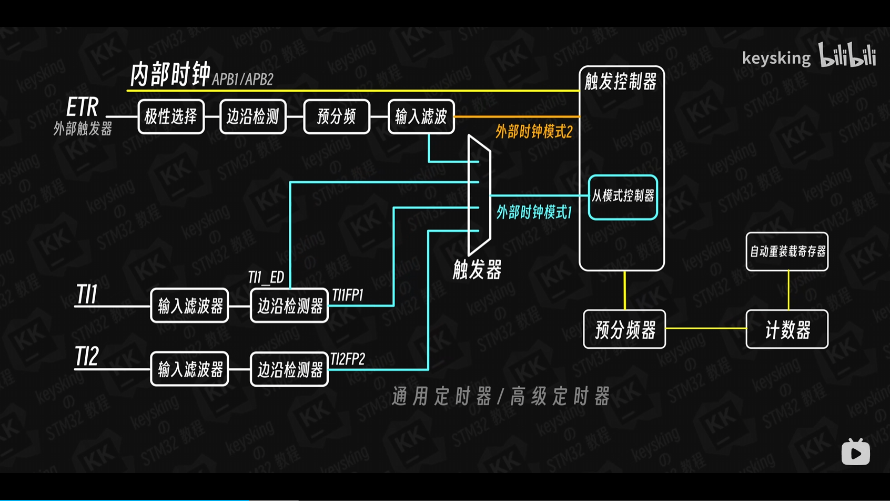

## TIM外设I/O表

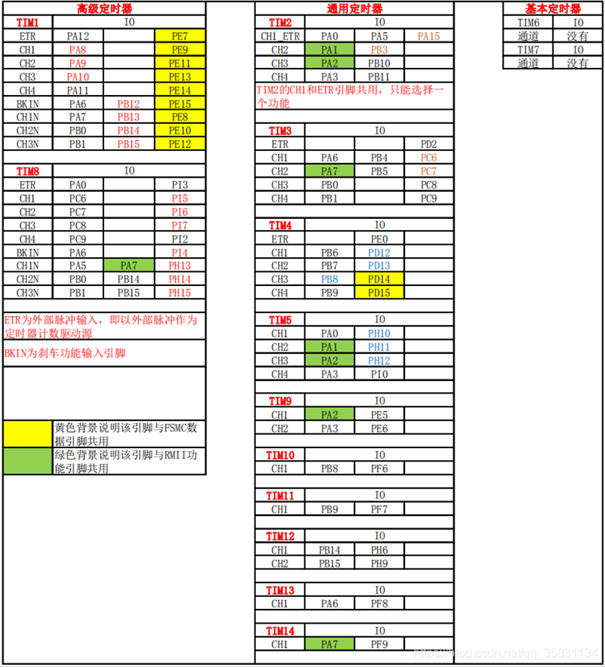

> <font color=red>Tips:</font>使用第二列的I/O口需要==部分重映射==。使用第三列需要==完全重映射==。对应的函数在`stm32f1xx_hal_gpio_ex.h`中

## TIM使用注意事项

- 如果要将Tim工作模式设置1ms，则将Prescaler设置为71，Period设置为1000。如果需要1s的定时，则使用中断，使用time循环1000次。（1MHZ为1 000 000HZ）

- PWM占空比等于sConfigOC.Pulse/htim8.Init.Period

    在Prescaler = 71 的情况下，Period =1000对应1000hz =10000对应100hz

## PWM与舵机

舵机的控制就是通过一个固定的频率，给其不同的占空比的，来控制舵机不同的转角

舵机的频率一般为频率为50HZ，也就是一个20ms左右的时基脉冲，而脉冲的高电平部分一般为0.5ms-2.5ms范围。来控制舵机不同的转角

以180度角度伺服为例，那么对应的控制关系是这样的：

0.5ms--------------0度；

1.0ms------------45度；

1.5ms------------90度；

2.0ms-----------135度；

2.5ms-----------180度；

而360度舵机不太一样，则占空比高于一定值，往一个方向转，低于那个值则会反向转动。pwm周期为20毫秒，高电平时间超过1.5毫秒，就会顺时针转，最高为2.5毫秒，且值越大转速越高，低于1.5毫秒控制逆时针转动，值越小转速越高。1.5毫秒使舵机停止。

> [(4条消息) PWM原理 PWM频率与占空比详解_Z小旋的博客-CSDN博客_pwm](https://blog.csdn.net/as480133937/article/details/103439546)
>
> [(4条消息) 360度MG996R舵机使用方法_耕耘在嵌入式的博客-CSDN博客_mg996r](https://blog.csdn.net/luoxianfadde/article/details/124534646)

>  <font color=red>Tips:</font>在使用开发板产生PWM对舵机控制时，一定要共地，否则会不受控制。因为开发板一般使用的电脑电源，而舵机一般是直流电源供电。

***

# SD卡

## SDIO驱动方式

三个初始化结构体，分别为SDIO初始化结构体`SDIO_InitTypeDef`、SDIO命令初始化结构体`SDIO_CmdInitTypeDef`和SDIO数据初始化结构体`SDIO_DataInitTypeDef`。

```c
typedef struct {
     uint32_t ClockEdge;              // 时钟沿  一般设置为高电平
     uint32_t ClockBypass;            // 旁路时钟  一般禁用时钟分频旁路
     uint32_t ClockPowerSave;         // 节能模式
     uint32_t BusWide;                // 数据宽度  可选 1 4 8 ，开发板上为4
     uint32_t HardwareFlowControl;    // 硬件流控制
     uint32_t ClockDiv;               // 时钟分频    CLK线时钟频=SDIOCLK/([CLKDIV+2])
 } SDIO_InitTypeDef;
typedef struct {
     uint32_t Argument; // 命令参数
     uint32_t CmdIndex; // 命令号
     uint32_t Response; // 响应类型
     uint32_t WaitForInterrupt; // 等待使能
     uint32_t CPSM;     // 命令路径状态机
 } SDIO_CmdInitTypeDef;
typedef struct {
     uint32_t DataTimeOut;    // 数据传输超时
     uint32_t DataLength;     // 数据长度
     uint32_t DataBlockSize;  // 数据块大小
     uint32_t TransferDir;    // 数据传输方向
     uint32_t TransferMode;   // 数据传输模式
     uint32_t DPSM;           // 数据路径状态机
 } SDIO_DataInitTypeDef;

```

主要的驱动还是参照野火HAL库中SD读写测试

[STM32CubeMX系列09——SDIO（SD卡读写、SD卡移植FATFS文件系统）_st cube sd卡-CSDN博客](https://blog.csdn.net/weixin_46253745/article/details/127865071)

## SPI驱动方式

下图为SPI驱动方式SD卡初始化并且进行卡类型识别流程图

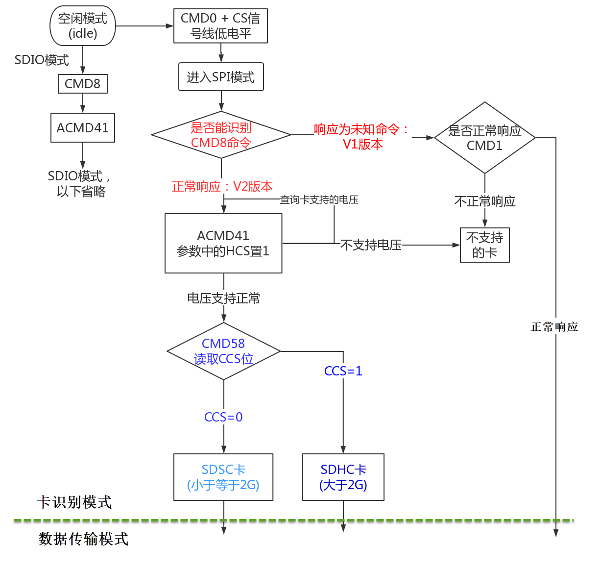

[36. SD卡—读写测试（SPI模式） — [野火\]STM32库开发实战指南——基于野火MINI开发板 文档 (embedfire.com)](https://doc.embedfire.com/mcu/stm32/f103mini/std/zh/latest/book/SDcard.html)

# FatFs

- 基于flash的基础上而来，先将FatFs的文件夹拷贝到对应目录下，同时在keil的工程管理（manage project items）中放入文件夹以及所需要的三个c文件，分别是`ff.c diskio.c cc936.c`，不要忘记指明编译路径。
- 如需要支持简体中文，需要把`ffconf.h`中的_CODE_PAGE 的宏改成936并把上面的`cc936.c`文件加入到工程之中。
- f_mount函数有三个形参，第一个参数是指向FATFS变量指针，如果赋值为NULL可以取消物 理设备挂载。第二个参数为逻辑设备编号，使用设备根路径表示，与物理设备编号挂钩。第三个参数可选0或1，1表示立即挂载，0表示不立即挂载，延迟挂载。
- f_open打开文件后一定要f_close关闭文件

## f_mount函数

fatfs库的`f_mount`函数用于挂载文件系统。文件系统的挂载必须在使用fatfs库的其他文件操作之前进行。一般来说，常见的使用方式如下：

1. 首先定义一个FATFS类型的结构体变量，用来存储文件系统相关的信息，例如：

```c
FATFS fs;
```

2. 在需要使用文件系统的时候，调用f_mount函数来挂载文件系统，例如：

```c
FRESULT res;
res = f_mount(&fs, "", 1);
if (res != FR_OK) {
    /* 文件系统挂载失败 */
}
```

这里的第一个参数是指向FATFS类型结构体的指针，第二个参数是要挂载的逻辑驱动器的路径，第三个参数是标志位，用于控制挂载模式。常用的挂载模式包括：

- 0：以只读方式挂载；
- 1：以可读/可写方式挂载；
- 2：以可读/可写方式打开根目录；
- 3：强制格式化并挂载。

3. 操作文件系统完成后，需要卸载文件系统。可以使用f_mount函数的调用参数为NULL，drive为0的方式卸载，例如：

```c
res = f_mount(NULL, 0, 1);
if (res != FR_OK) {
    /* 文件系统卸载失败 */
}
```

这里的第一个参数是NULL，表示卸载文件系统，第二个参数是驱动器序号，为0表示卸载所有驱动器，第三个参数没有实际意义。

第二个参数是要挂载的逻辑驱动器的路径，"0:"代表逻辑驱动器0。在FATFS库中，可以通过指定不同的逻辑驱动器号来访问不同的存储介质（例如SD卡、U盘等），每个逻辑驱动器号对应的实际存储介质路径需要在FATFS配置文件中设定。

在这个函数中，逻辑驱动器0被表示为"0:“，而逻辑驱动器1、2、3等可分别被表示为"1:”、“2:”、"3:"等。因此，f_mount函数中的第二个参数"0:"代表要将文件系统挂载到逻辑驱动器0上。一旦文件系统被挂载到某个逻辑驱动器上，就可以在这个驱动器上使用FATFS库提供的文件读写、目录操作等一系列函数了。

需要注意的是，文件系统的挂载和卸载都需要在文件操作前后进行，而且每个挂载点只能同时被一个进程挂载，否则将会出现文件系统的不稳定等问题。

## f_mkdir函数

FATFS库中f_mkdir函数创建目录的路径格式遵循FAT文件系统规范，一般采用类似"目录1/目录2"的形式，其中每个目录之间使用斜线“/”分隔。

在实际应用中，要根据需要创建的目录结构，构造相应的路径字符串。例如，要在SD卡根目录下创建一个名为"example"的目录，可以这样写：

```c
FRESULT res;  // 定义返回值变量
char path[] = "example";  // 定义目录路径字符串，不需要写成完整路径名
res = f_mkdir(path);  // 调用f_mkdir创建目录
if (res == FR_OK) {
    // 目录创建成功
} else {
    // 目录创建失败
}
```

在构造目录路径字符串时，可以使用已有的目录名称和路径分隔符组合起来，也可以使用字符串拼接函数等方式构造。需要注意的是，路径分隔符在Windows系统和Linux系统中是不同的，要根据具体情况选择正确的分隔符类型。

***

# DAC

使用DAC时要配置DAC的结构体，定时器结构体，DAC只能使用TIM2、4、6、7（6和7配合DMA输出），DMA的通道选择看DMA相关部分的插图。

```c
typedef struct {
   uint32_t DAC_Trigger;
   /*DAC触发方式 */
   uint32_t DAC_OutputBuffer;
   /*选择是否使能输出缓冲器 */
} DAC_ChannelConfTypeDef;
```

各个结构体成员的介绍如下，解说中各模式后括号内的英文为该模式在HAL库中使用宏：

1. DAC_Trigger

> 本成员用于配置DAC的触发模式，当DAC产生相应的触发事件时，才会把DHRx寄存器的值转移到DORx寄存器中进行转换。本结构体成员可以选择的触发模式如下：定时器触发模式（AC_TRIGGER_T2/4//6/7_TRGO），使用定时器2、4、6、7控制DHRx寄存器的数据按时间转移到DORx中进行转换，利用这种方式可以输出特定的波形；EXTI_9触发方式（DAC_TRIGGER_EXT_IT9），当产生EXTI_9事件时（如GPIO中断事件），触发转换；软件触发模式（DAC_TRIGGER_SOFTWARE），在本模式下，向DAC_SWTRIGR寄存器写入配置即可触发信号进行转换。

1. DAC_OutputBuffer

> 本结构体成员用于控制是否使能DAC的输出缓冲（DAC_OUTPUTBUFFER_ENABLE/DISABLE），使能了DAC的输出缓冲后可以减小输出阻抗，适合直接驱动一些外部负载。

HAL_DAC_SetValue()中设定的uint32_t范围在0到4095之间。

# CAN

can类似于485，也需要差分布线。根据CAN_H和CAN_L上的电位差判断总线电平。

## CAN特点

多主控制 每个设备都可以主动发送数据

系统的柔软性 没有类似地址的信息

通信速度 速度快、距离远

错误检测

|     电平      |   高速CAN    |
| :-----------: | :----------: |
| 显性电平（0） | Uh-Ul = 2.5V |
| 隐性电平（1） |  Uh-Ul = 0V  |

## 使用CAN遇到无法发送的问题

在调试STM32F103C8T6时，发现函数一直卡在`HAL_CAN_AddTxMessage(&_tCAN->tCANHandle,&_tCAN->tCANTxHeader,ucTemp,(uint32_t *)CAN_TX_MAILBOX1)`无法完成发送。

但是使用STM32F103ZET6一切正常（可能是芯片内部问题？），最后发现是函数参数输入有误，函数的最后一个参数不应该按照上面这样输入，而是传递一个指针。需要设定一个中间变量去赋值。例如

```c
uint32_t TX_MailBOX;
TX_MailBOX = CAN_TX_MAILBOX1;
HAL_CAN_AddTxMessage(&_tCAN->tCANHandle,&_tCAN->tCANTxHeader,ucTemp,&TX_MailBOX);
```

[关于使用STM32F103ZET6单片机CAN通讯无法正常发送问题 - STM32/STM8技术论坛 - 电子技术论坛 - 广受欢迎的专业电子论坛! (elecfans.com)](https://bbs.elecfans.com/jishu_1765541_1_1.html)

CAN连续发送丢失数据，经过测试有效

[工作记录1-CAN连续发送丢包_stm32f can发送丢帧-CSDN博客](https://blog.csdn.net/weixin_43214440/article/details/122241804)

## STM32 bxCAN

STM32 CAN控制器（bxCAN），支持CAN 2.0A 和 CAN 2.0B Active版本协议。CAN 2.0A 只能处理标准数据帧且扩展帧的内容会识别错误，而CAN 2.0B Active 可以处理标准数据帧和扩展数据帧。

1. 波特率最高可达1M bps
2. 支持时间触发通信（CAN的硬件内部定时器可以在TX/RX的帧起始位的采样点位置生成时间戳）
3. 具有3级发送邮箱
4. 具有3级深度的2个接收FIFO
5. 可变的过滤器组（最多28个）

## CAN控制器工作模式

**初始化模式、正常模式、睡眠模式**

上电复位处于睡眠模式，降低功耗

初始化后处于初始化模式

正常模式可以开始接收和发送报文

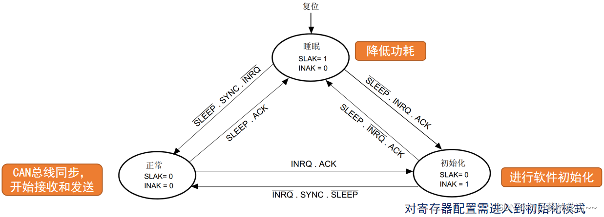

## CAN控制器测试模式

**静默模式、环回模式、环回静默模式**（需要在初始化模式下进行配置）

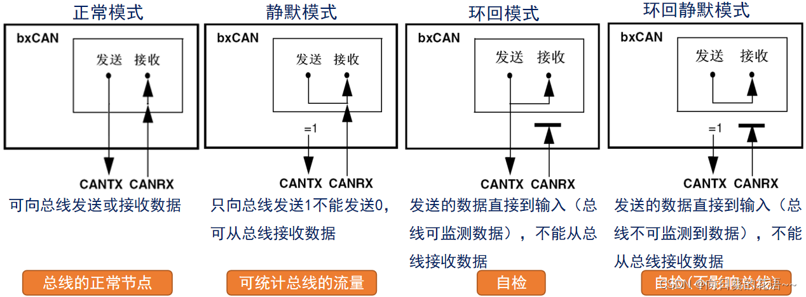

## CAN框图

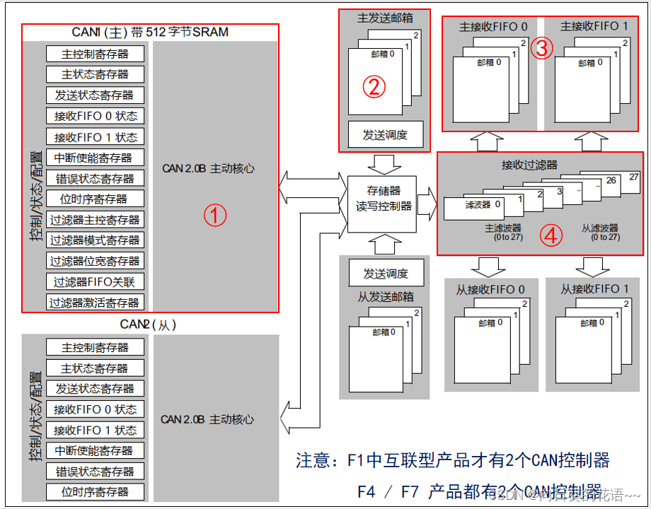

① CAN内核
包含各种控制/状态/配置寄存器，可以配置模式、波特率等
②发送邮箱
用来缓存待发送的报文，最多可以缓存3个报文
③接收FIFO
缓存接收到的有效报文
④接收过滤器
筛选有效报文

## CAN中断

STM32有2个3级深度的接收缓冲区：FIFO0和FIFO1，每个FIFO都可以存放3个完整的报文，它们完全由硬件来管理。如果是来自FIFO0的接收中断，则用CAN1_RX0_IRQn中断来处理。如果是来自FIFO1的接收中断，则用CAN1_RX1_IRQn中断来处理。在CAN的初始化配置过程中，用CAN_FilterFIFOAssignment来选择要使用FIFO。

STM32的CAN通信一共有四个专用中断，分别是：

1. **发送中断**
2. **FIFO0 接收中断**
3. **FIFO1 接收中断**
4. **错误中断**

```c
可选回调函数    
	//CAN通信-发送完成回调函数
    void HAL_CAN_TxMailbox0CompleteCallback(CAN_HandleTypeDef *hcan);
    void HAL_CAN_TxMailbox1CompleteCallback(CAN_HandleTypeDef *hcan);
    void HAL_CAN_TxMailbox2CompleteCallback(CAN_HandleTypeDef *hcan);
    //CAN通信-发送取消回调函数
    void HAL_CAN_TxMailbox0AbortCallback(CAN_HandleTypeDef *hcan);
    void HAL_CAN_TxMailbox1AbortCallback(CAN_HandleTypeDef *hcan);
    void HAL_CAN_TxMailbox2AbortCallback(CAN_HandleTypeDef *hcan);

    //CAN通信-FIFO0接收新消息回调函数
    void HAL_CAN_RxFifo0MsgPendingCallback(CAN_HandleTypeDef *hcan);
    //CAN通信-FIFO0接收满回调函数
    void HAL_CAN_RxFifo0FullCallback(CAN_HandleTypeDef *hcan);
    //CAN通信-FIFO1接收新消息回调函数
    void HAL_CAN_RxFifo1MsgPendingCallback(CAN_HandleTypeDef *hcan);
    //CAN通信-FIFO1接收满回调函数
    void HAL_CAN_RxFifo1FullCallback(CAN_HandleTypeDef *hcan);

    //CAN通信-休眠回调函数
    void HAL_CAN_SleepCallback(CAN_HandleTypeDef *hcan);
    //CAN通信-唤醒回调函数
    void HAL_CAN_WakeUpFromRxMsgCallback(CAN_HandleTypeDef *hcan);
    //CAN通信-错误回调函数
    void HAL_CAN_ErrorCallback(CAN_HandleTypeDef *hcan);
```

[【HAL库】STM32F407----CAN通信----中断详解_can发送中断和接收中断-CSDN博客](https://blog.csdn.net/MQ0522/article/details/130422992)

## CAN速率计算

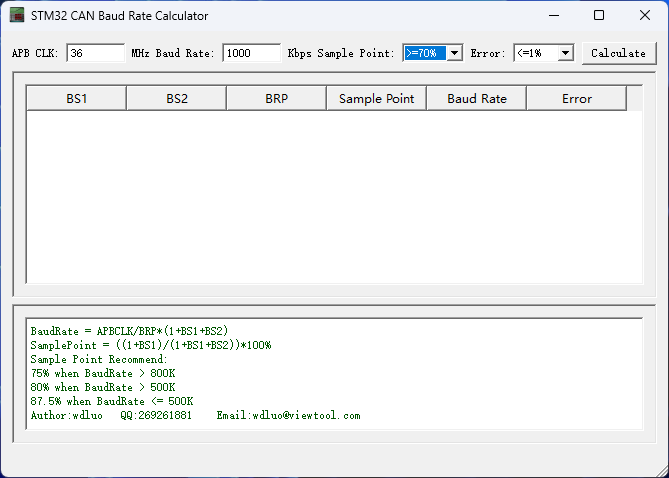

这里的APB CLK 在F1系列上速度为36MHZ 在F4上为42MHZ

[CAN总线通讯出错？检查您的采样点是否设置正确 - 知乎 (zhihu.com)](https://zhuanlan.zhihu.com/p/404208858)

## CAN过滤器

[STM32 CAN过滤器详解_stm32can过滤器掩码-CSDN博客](https://blog.csdn.net/qq_35480173/article/details/98878309)

# PWR电源管理

## WFI与WFE命令

```c
 /** brief  等待中断

     等待中断 是一个暂停执行指令
     暂停至任意中断产生后被唤醒
 */
 #define __WFI                             __wfi


 /** brief  等待事件

     等待事件 是一个暂停执行指令
     暂停至任意事件产生后被唤醒
 */
 #define __WFE                             __wfe
```

## STM32的功耗模式

| 模式 | 说明                                                         | 进入方式                                                 | 唤醒方式                                                     | 对1.8V区域时钟的影响                  | 对VDD区域 时钟的影响 | 调压器                                          |
| ---- | ------------------------------------------------------------ | -------------------------------------------------------- | ------------------------------------------------------------ | ------------------------------------- | -------------------- | ----------------------------------------------- |
| 睡眠 | 内核停止，所有外设包括M3核心的外设，如NVIC、系统时钟(SysTick)等仍在运行 | 调用WFI命令                                              | 任一中断                                                     | 内核时钟关，对其他时钟和ADC时钟无影响 | 无                   | 开                                              |
|      |                                                              | 调用WFE命令                                              | 唤醒事件                                                     |                                       |                      |                                                 |
| 停止 | 所有的时钟都已停止                                           | 配置PWR_CR寄存器的PDDS +LPDS 位+SLEEPDEEP位+WFI或WFE命令 | 任一外部中断( 在外部中断寄存器中设置)                        | 关闭所有1.8V区域的时钟                | HSI和HSE的振荡器关闭 | 开启或处于低功耗模式( 依据电源控制寄存器的设定) |
| 待机 | 1.8V 电源关闭                                                | 配置PWR_CR寄存器的PDDS +SLEEPDEEP位+WFI或WFE命令         | WKUP 引脚的上升沿、RTC闹钟事件、NRST 引脚上的外部复位、IWDG 复位 |                                       |                      | 关                                              |

## 进入停止模式

直接调用WFI和WFE指令可以进入睡眠模式，进入停止模式需要在调用指令前设置一些寄存器。可以使用void `HAL_PWR_EnterSTOPMode(uint32_t Regulator, uint8_t STOPEntry);`完成配置。

```c
 /**
 * @brief 进入停止模式
 * @note 在停止模式下所有I/O都会保持在停止前的状态
 * @note 从停止模式唤醒后，会使用HSI作为时钟源
 * @note 调压器若工作在低功耗模式，可减少功耗，但唤醒时会增加延迟
 * @param Regulator: 设置停止模式时调压器的工作模式
 *        @arg PWR_MAINREGULATOR_ON: 调压器正常运行
 *        @arg PWR_LOWPOWERREGULATOR_ON: 调压器低功耗运行
 * @param STOPEntry: 设置使用WFI还是WFE进入停止模式
 *        @arg PWR_STOPENTRY_WFI: WFI进入停止模式
 *        @arg PWR_STOPENTRY_WFE: WFE进入停止模式
 * @retval None
 */
void HAL_PWR_EnterSTOPMode(uint32_t Regulator, uint8_t STOPEntry)
```

要注意的是进入停止模式后，STM32的所有I/O都保持在停止前的状态，而当它被唤醒时，STM32使用HSI作为系统时钟(8MHz)运行，由于系统时钟会影响很多外设的工作状态，所以一般我们在唤醒后会重新开启HSE，把系统时钟设置回原来的状态。

### 重启HSE时钟

与睡眠模式不一样，系统从停止模式被唤醒时，是使用HSI作为系统时钟的，在STM32F103中，HSI时钟一般为8MHz， 与我们常用的72MHz相关太远，它会影响各种外设的工作频率。所以需要重新去开启HSE时钟、使能PLL并且选择PLL作为时钟源。

## 进入待机模式

```c
 /**
 * @brief 进入待机模式
 * @note 待机模式时，除了以下引脚，其余引脚都在高阻态：
 *          - 复位引脚
 *          - RTC_AF1 引脚 (PC13)(需要使能侵入检测、时间戳事件或RTC闹钟事件)
 *          - RTC_AF2 引脚 (PI8) (需要使能侵入检测或时间戳事件)
 *          - WKUP 引脚 (PA0) (需要使能WKUP唤醒功能)
 * @retval None
 */
 void HAL_PWR_EnterSTANDBYMode(void)
```

在进入待机模式后，除了被使能了的用于唤醒的I/O，其余I/O都进入高阻态，而从待机模式唤醒后，相当于复位STM32芯片，程序重新从头开始执行。

如果不初始化PA0的话，在正常运行模式中KEY1(PA0)按键是不能正常运行的，我们这里只是强调待机模式的WKUP唤醒不需要中断，也不需要像按键那样初始化。

有四种唤醒方式，分别是WKUP(PA0)引脚的上升沿，RTC闹钟事件，NRST引脚的复位和IWDG(独立看门狗)复位。

## 进入睡眠模式

```c
 /**
 * @brief 进入睡眠模式
 * @param Regulator: 设置停止模式时调压器的工作模式
 *        @arg PWR_MAINREGULATOR_ON: 调压器正常运行
 *        @arg PWR_LOWPOWERREGULATOR_ON: 调压器低功耗运行
 * @param STOPEntry: 设置使用WFI还是WFE进入停止模式
 *        @arg PWR_STOPENTRY_WFI: WFI进入停止模式
 *        @arg PWR_STOPENTRY_WFE: WFE进入停止模式
 * @retval None
 */
void HAL_PWR_EnterSLEEPMode(uint32_t Regulator, uint8_t SLEEPEntry)
```

需要注意的是，在使用`HAL_PWR_EnterSLEEPMode()`函数前，需要先使用`HAL_PWR_EnableSleepOnExit()`函数来开启唤醒后继续运行的状态。

## 一般流程

```c
//暂停滴答时钟，防止通过滴答时钟中断唤醒
HAL_SuspendTick();

	/*设置停止模式时，FLASH进入掉电状态*/
	HAL_PWREx_EnableFlashPowerDown();

/*
进入停止模式，设置电压调节器为低功耗模式，
等待中断唤醒 */
HAL_PWR_EnterSTOPMode(PWR_MAINREGULATOR_ON,PWR_STOPENTRY_WFI);

//进入睡眠模式
HAL_PWR_EnterSLEEPMode(PWR_MAINREGULATOR_ON,PWR_SLEEPENTRY_WFI);

/* 进入待机模式 */
HAL_PWR_EnterSTANDBYMode();

//被唤醒后，恢复滴答时钟
HAL_ResumeTick();
```

## PWR—PVD电源监控

PVD可监控VDD的电压，当它低于阈值时可产生PVD中断(EXTI16线中断)以让系统进行紧急处理，这个阈值可以直接使用库函数PWR_PVDLevelConfig。

| 阈值等级 | 条件   | 最小值 | 典型值 | 最大值 | 单位 |
| -------- | ------ | ------ | ------ | ------ | ---- |
| 级别0    | 上升沿 | 2.1    | 2.18   | 2.26   | V    |
|          | 下降沿 | 2      | 2.08   | 2.16   | V    |
| 级别1    | 上升沿 | 2.19   | 2.28   | 2.37   | V    |
|          | 下降沿 | 2.09   | 2.18   | 2.27   | V    |
| 级别2    | 上升沿 | 2.28   | 2.38   | 2.48   | V    |
|          | 下降沿 | 2.18   | 2.28   | 2.38   | V    |
| 级别3    | 上升沿 | 2.38   | 2.48   | 2.58   | V    |
|          | 下降沿 | 2.28   | 2.38   | 2.48   | V    |
| 级别4    | 上升沿 | 2.47   | 2.58   | 2.69   | V    |
|          | 下降沿 | 2.37   | 2.48   | 2.59   | V    |
| 级别5    | 上升沿 | 2.57   | 2.68   | 2.79   | V    |
|          | 下降沿 | 2.47   | 2.58   | 2.69   | V    |
| 级别6    | 上升沿 | 2.66   | 2.78   | 2.9    | V    |
|          | 下降沿 | 2.56   | 2.68   | 2.8    | V    |
| 级别7    | 上升沿 | 2.76   | 2.88   | 3      | V    |
|          | 下降沿 | 2.66   | 2.78   | 2.9    | V    |

1. 初始化PVD中断；
2. 设置PVD电压监控等级并使能PVD；
3. 编写PVD中断服务函数，处理紧急任务。 中断服务函数的名是PVD_IRQHandler。

```c
void PVD_Config(void)
 {
     PWR_PVDTypeDef sConfigPVD;

     /*使能 PWR 时钟 */
     __PWR_CLK_ENABLE();
     /* 配置 PVD 中断 */
     /*中断设置，抢占优先级0，子优先级为0*/
     HAL_NVIC_SetPriority(PVD_IRQn, 0 ,0);
     HAL_NVIC_EnableIRQ(PVD_IRQn);

     /* 配置PVD级别5 (PVD检测电压的阈值为2.8V，
     VDD电压低于2.8V时产生PVD中断，具体数据
     可查询数据手册获知) 具体级别根据自己的
     实际应用要求配置*/
     sConfigPVD.PVDLevel = PWR_PVDLEVEL_5;
     sConfigPVD.Mode = PWR_PVD_MODE_IT_RISING_FALLING;
     HAL_PWR_ConfigPVD(&sConfigPVD);
     /* 使能PVD输出 */
     HAL_PWR_EnablePVD();
 }
 
 void PVD_IRQHandler(void)
 {
     HAL_PWR_PVD_IRQHandler();
 }
 /**
 * @brief  PWR PVD interrupt callback
 * @param  None
 * @retval None
 */
 void HAL_PWR_PVDCallback(void)
 {
     /* 亮红灯，实际应用中应进入紧急状态处理 */
     LED_RED;
 }
```

[STM32 PVD的使用（掉电检测）_stm32掉电中断-CSDN博客](https://blog.csdn.net/qq_27575841/article/details/107602983)

[STM32 F103 使用HAL库配置PVD_stm32 cubemx如何配置pvd-CSDN博客](https://blog.csdn.net/chenjk10/article/details/104925946)

# DWT

在Cortex-M里面有一个外设叫DWT(Data Watchpoint and Trace)，是用于系统调试及跟踪，它有一个32位的寄存器叫CYCCNT， 它是一个向上的计数器，记录的是内核时钟运行的个数，内核时钟跳动一次，该计数器就加1，精度非常高。

对于模拟IIC或者模拟SPI在延时us的时候很有用。

```c
#define  DEM_CR      *(volatile u32 *)0xE000EDFC
#define  DWT_CR      *(volatile u32 *)0xE0001000
#define  DWT_CYCCNT  *(volatile u32 *)0xE0001004
#define  DEM_CR_TRCENA                   (1 << 24)
#define  DWT_CR_CYCCNTENA                (1 <<  0)

void DWT_Init()
{
    DEM_CR  |=  DEM_CR_TRCENA; /*对DEMCR寄存器的位24控制，写1使能DWT外设。*/
    DWT_CYCCNT = 0;/*对于DWT的CYCCNT计数寄存器清0。*/
    DWT_CR  |=  DWT_CR_CYCCNTENA;/*对DWT控制寄存器的位0控制，写1使能CYCCNT寄存器。*/
}

void DWT_DelayUS(uint32_t _ulDelayTime)
{
    uint32_t tCnt, tDelayCnt;
    uint32_t tStart;
           
    tStart = DWT_CYCCNT; /* 刚进入时的计数器值 */
    tCnt = 0;
    tDelayCnt = _ulDelayTime * (SystemCoreClock / 1000000);
    /* 需要的节拍数 */    /*SystemCoreClock :系统时钟频率*/                 

    while(tCnt < tDelayCnt)
      {
        tCnt = DWT_CYCCNT - tStart; 
        /* 求减过程中，如果发生第一次32位计数器重新计数，依然可以正确计算 */       
      }
}

void DWT_DelayMS(uint32_t _ulDelayTime)
{
        bsp_DelayUS(1000*_ulDelayTime);
}
```

优点：方便移植，经过测试在M3、M4、M7内核的MCU上都可以使用。
缺点：和定时器一样，都有一个延时的最大时间，测量代码运行时间的最大值。

[52. DWT—内核定时器 — [野火\]STM32库开发实战指南——基于野火霸道开发板 文档 (embedfire.com)](https://doc.embedfire.com/mcu/stm32/f103badao/std/zh/latest/book/DWT.html)

[FreeRTOS中实现精确的us级延时_freertos us延时-CSDN博客](https://blog.csdn.net/w237838/article/details/134771598)

# Bootloader

## Flash分区

既然我们写的程序都会变成二进制文件存放到Flash中, 那么我们就可以进一步对我们程序进行分区。

F1系列以页为单位，而F4以扇区为单位，这点在分区和擦除的时候需要格外小心。

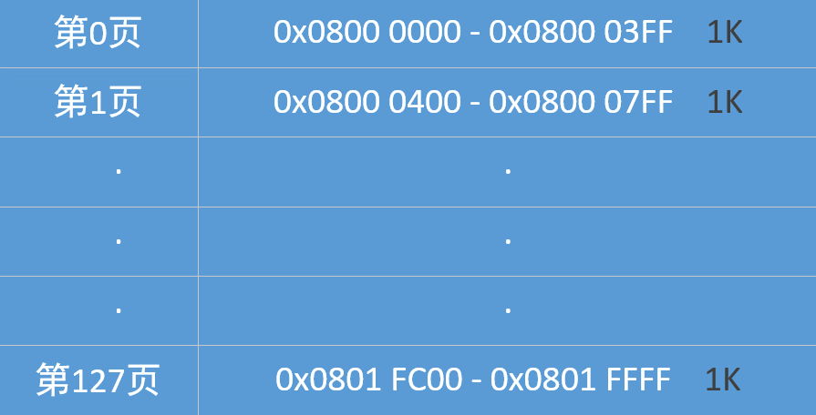

<center><p>F1系列Flash128K分布图</p></center>

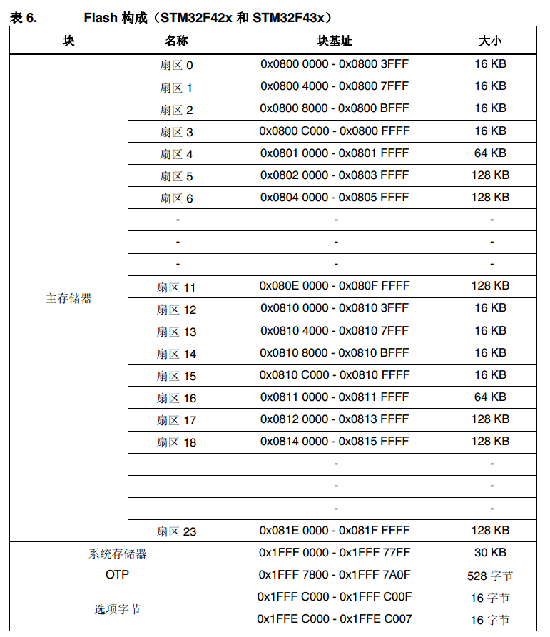

<center><p>F4系列Flash分布图</p></center>

我将它分为三个区`BootLoader区`、 `App1区`、 `App2区(备份区)`具体划分如下图:

- `BootLoader区`存放启动代码
- `App1区`存放应用代码
- `App2区`存放暂存的升级代码

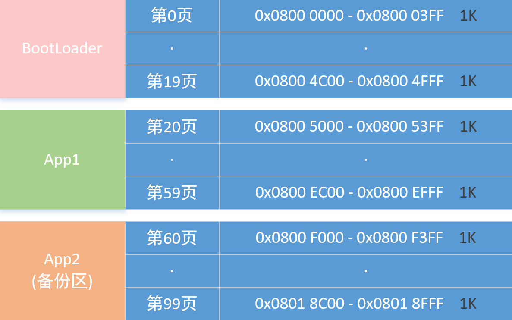

## 总体流程图

1. 先执行BootLoader程序, 先去检查APP2区有没有程序, 如果有就将App2区(备份区)的程序拷贝到App1区, 然后再跳转去执行App1的程序.
2. 然后执行App1程序, 因为BootLoader和App1这两个程序的向量表不一样, 所以跳转到App1之后第一步是先去更改程序的向量表. 然后再去执行其他的应用程序.
3. 在应用程序里面会加入程序升级的部分, 这部分主要工作是拿到升级程序, 然后将他们放到App2区(备份区), 以便下次启动的时候通过BootLoader更新App1的程序.

流程图如下图所示:

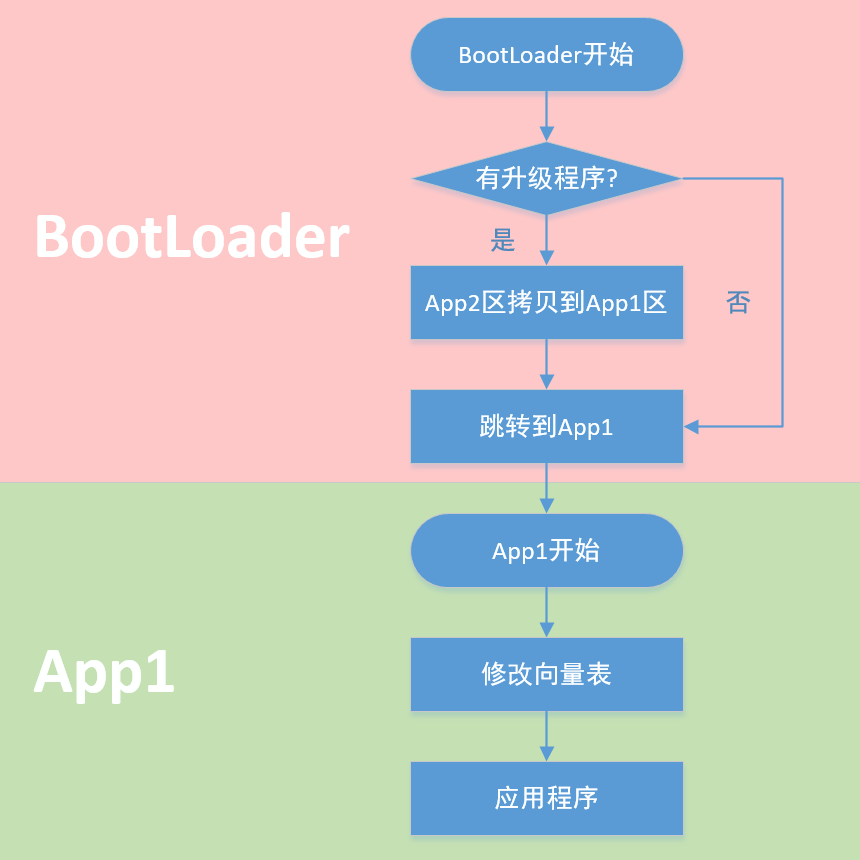

## BootLoader程序

> BootLoader 可以理解成是引导程序, 它的作用是启动正式的App应用程序。 换言之, BootLoader是一个程序, App也是一个程序, BootLoader程序是用于启动App程序的。类似于Linux下的Uboot或者Windows下的BIOS

将`App2区`的最后一个字节(`0x0801FFFC`)用来表示`App2区`是否有升级程序, STM32在擦除之后Flash的数据存放的都是`0xFFFFFFFF`, 如果有, 我们将这个地址存放`0xAAAAAAAA`。具体的流程图见下图所示

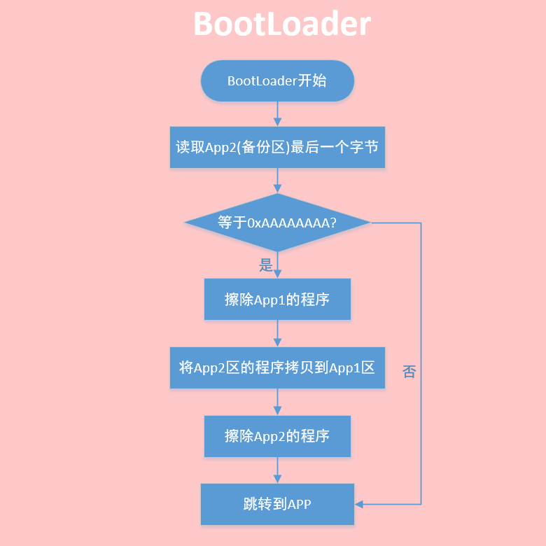

当然也可以产生变种，加入按键控制，更加与Uboot相似。

## APP程序

- 先修改向量表, 因为本程序是由BootLoader跳转过来的, 不修改向量表后面会出现问题

    重点：

    - 在裸机中应当在main()函数第一行加入SCB->VTOR = 0x8000000UL | 0x00005000UL;/* 更改中断向量表地址 */，根据实际情况更改，一般使用宏来指定地址
    - 在RT-Thread中需要在rt_application_init前修改向量表
    - SGA库中Drv_HAL_Init函数的第一行加入对向量表地址的更改，即可同时完成对裸机和RTOS的向量表更改

- 打印版本信息, 方便查看不同的App版本

- 本例程的升级程序采用串口的Ymoderm协议进行传输bin文件. 具体的流程图见下图所示

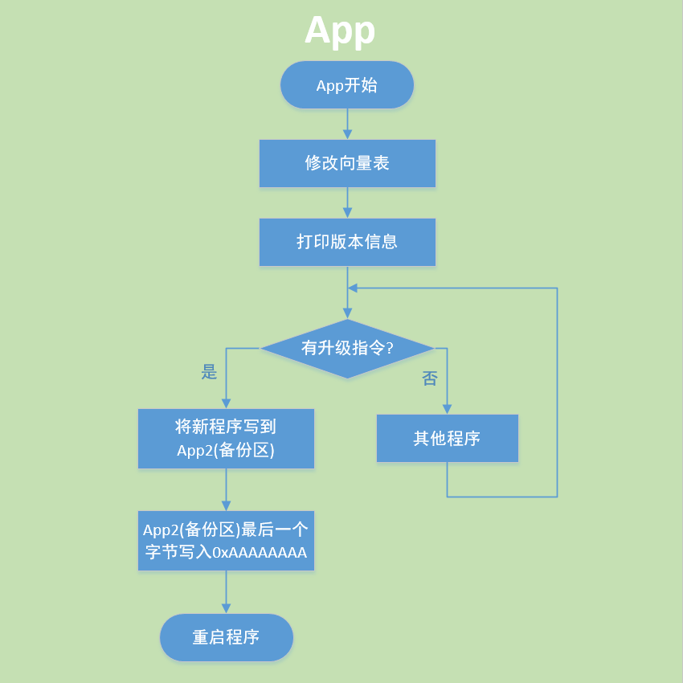

## 如何使用keil生成bin文件

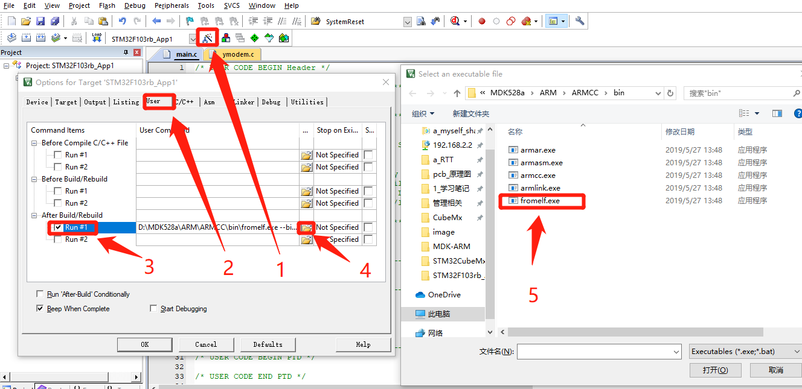

完成前五步后，Run1中会显示fromelf.exe的路径，后面需要添加如下代码 `--bin --output 目的文件 源文件`

`D:\Keil_v5\ARM\ARMCC\bin\fromelf.exe --bin --output .\STM32F103rb_App1\STM32F103rb_App1.bin .\STM32F103rb_App1\STM32F103rb_App1.axf`

上面这个命令就是根据我的电脑keil路径生成的app.bin。注意要选对打包工具路径和.axf文件的路径，最后想好.bin文件要放在哪。

同样可以用此方法生成STM32F103rb_bootloader.bin，可以查看bootloader的大小，以供给bootloader提供合适的分区大小。

[如何利用Keil生成.bin文件_iot 小胡的博客-CSDN博客](https://blog.csdn.net/weixin_41294615/article/details/104656577)

## BootLoader的下载

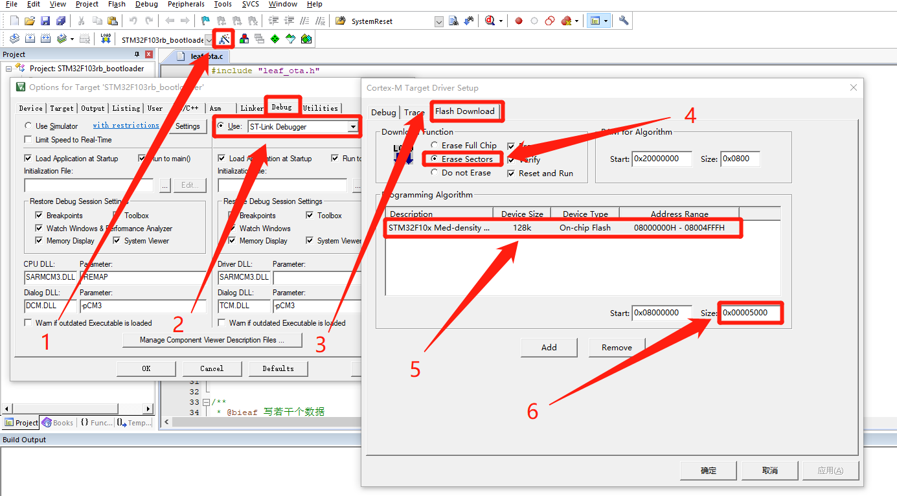

这里需要先通过生成bin文件查看bootloader的大小来决定分配给bootloader的大小。APP区也需要根据bootloader的大小进行调整。

## App1的下载

- App1稍微复杂一点, 需要将代码的起始位置设置为`0x08005000`（根据实际情况进行更改）
- Size如果是VCT6可以选择0x3b000，当然这是将APP2部分也占了。偏移量必须是0x200的整数倍。
- 同时也要修改擦除方式为`Erase Sectors`, 见下图

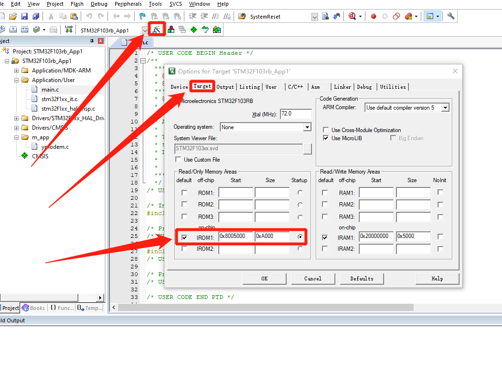

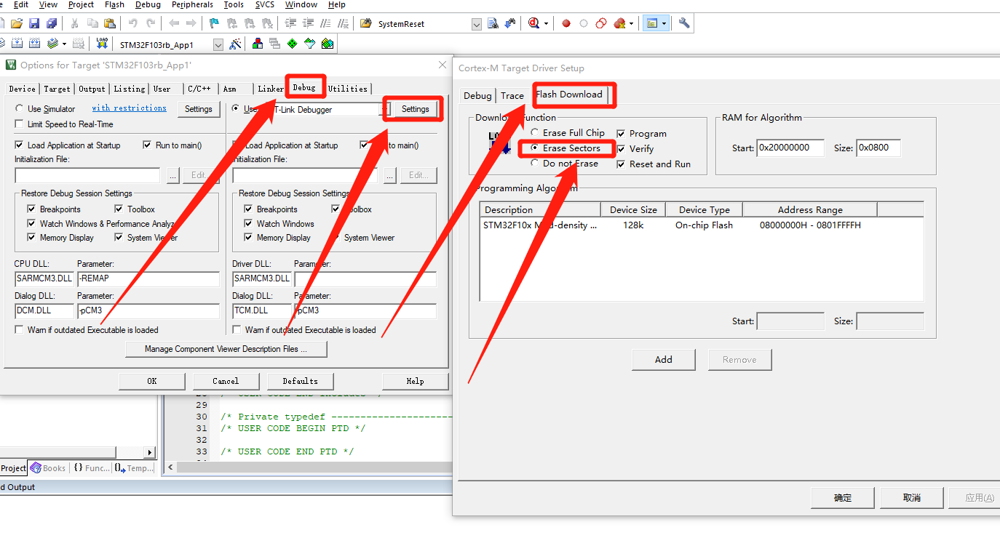

## 使用Xshell进行文件传输

串口1进行调试信息的打印, 串口2进行YModem升级

在Xshell界面中右键传输，选择YModem协议传输，将.bin文件发送到板子上完成更新。

如果一直卡在程序升级的地方，需要将整个flash重新烧写一次。

## Ymodem协议

Xmodem、Ymodem和Zmodem协议是最常用的三种通信协议。

Xmodem协议是最早的，传输128字节信息块。

Ymodem是Xmodem的改进版协议，具有传输快速稳定的优点。它可以一次传输1024字节的信息块，同时还支持传输多个文件。

平常所说的Ymodem协议是指的Ymodem-1K，除此还有Ymodem-g（没有CRC校验，不常用）。

YModem-1K用1024字节信息块传输取代标准的128字节传输，数据的发送回使用CRC校验，保证数据传输的正确性。它每传输一个信息块数据时，就会等待接收端回应ACK信号，接收到回应后，才会继续传输下一个信息块，保证数据已经全部接收。

### 起始帧

YModem的起始帧并不直接传输文件的数据，而是将文件名与文件的大小放在数据帧中传输，它的帧长=3字节数据首部+128字节数据+2字节CRC16校验码=133字节。它的数据结构如下：

**SOH 00 FF  filename filezise NUL  CRCH CRCL**

其中SOH=0x01，表示这个数据帧中包含着128个字节的数据（STX表示1024字节，初始帧只有128个），00表示数据帧序号，初始是0，依次向下排，FF是帧序号的取反。

filename是要传输的文件名，如STM320x10000.bin，它在数据帧中的格式为十六进制，要在文件名后会存在一个00，表示文件名的结束；filesize表示文件的大小，如上面的STM320x10000.bin大小是21.6KB(22164字节)，它在数据帧中的格式也为十六进制，同样最后要加上00表示结束。

NUL就是数据部分的128字节中除去文件名和文件大小占据的剩下的字节都用00填充，CRCH和CRCL分别表示16位CRC校验码的高8位与低8位。

### 数据帧

YModem的数据帧中会预留1024字节空间用来传输文件数据，它跟起始帧接收差不多，如下：

**STX 01 FEdata[1024] CRCH CRCL**

其中STX=0x02，表示这帧数据帧后面包含着1024字节的数据部分；01是表示帧序号，FE是它的取反，再下一帧数据就是02 FD，以此类推；data[1024]表示存放着1024字节的文件数据；CRCH与CRCL是CRC16检验码的高8位与低8位。

如果文件数据的最后剩余的数据在128~1024之前，则还是使用STX的1024字节传输，但是剩余空间全部用0x1A填充，如下结构：

STX 01 FE data[1024] 1A 1A……… CRCH CRCL

有一种特殊的情况：如果文件大小小于等于128字节或者文件数据最后剩余的数据小于128字节，则YModem会选择SOH数据帧用128字节来传输数据，如果数据不满128字节，剩余的数据用0x1A填充这是数据帧的结构就变成了：

文件大小小于128字节：               SOH 01 FE data[ ] 1A ...1A CRCH CRCL  

文件最后剩余数据小于128字节：  SOH 01 FE data[ ] 1A...1A CRCH CRCL

### 结束帧

YModem的结束帧数据也采用SOH的128字节数据帧，它的结构如下：

SOH 00 FF NUL[128] CRCH CRCL

结束帧同样以SOH开头，表示后面跟着128字节大小的数据；结束帧的帧序也认为是00 FF；结束帧的128字节的数据部分不存放任何信息，即全部用00填充。

特别注意的是，在文件传输结束时发送端发送了结束标识EOT之后待收到接收端的回复后，还会再发送一包空数据包以表示传输真正结束。

EOT >>>>>>>>>>>>>>>>>>>>>>>>>>>>>>>>>>>>>>>>>>>>>

<<<<<<<<<<<<<<<<<<<<<<<<<<<<<<<<<<<<<<<<<<<< NACK

EOT>>>>>>>>>>>>>>>>>>>>>>>>>>>>>>>>>>>>>>>>>>>>>>

<<<<<<<<<<<<<<<<<<<<<<<<<<<<<<<<<<<<<<<<<<<< ACK

<<<<<<<<<<<<<<<<<<<<<<<<<<<<<<<<<<<<<<<<<<<<<< C

SOH 00 FF NUL[128] CRCCRC>>>>>>>>>>>>>>>>>>>>>>>>>>

<<<<<<<<<<<<<<<<<<<<<<<<<<<<<<<<<<<<<<<<<<<< ACK

### 协议符号与数值


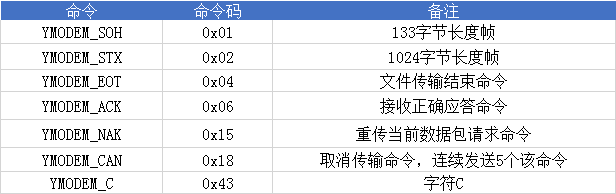

## F4的注意事项

F4以扇区Sector为单位，所以使用flash擦除函数的时候要格外小心，防止擦除其他分区。

在程序中最需要注意的是在使用Flash_Erase_page()函数时，第二个参数需要减1，没有这个减1可能会擦除下一个分区。例如：Flash_Erase_page(des_addr, des_addr + Application_Size - 1);

## F1与F4的代码差异

F1与F4的代码主要区别在于flash的擦除，F1对页进行操作，F4对扇区进行操作。

### F1擦除相关代码

```c
/**
 * @brief flash擦除页
 * @param pageaddr  起始地址	
 * @param num       擦除的页数
 * @return 0 成功 -1 失败
 */
static int Flash_Erase_Page(uint32_t pageaddr, uint32_t num)
{
	/* 解锁flash */
	HAL_FLASH_Unlock();
	
	/* 擦除FLASH*/
	FLASH_EraseInitTypeDef FlashSet;
	FlashSet.TypeErase = FLASH_TYPEERASE_PAGES;
	FlashSet.PageAddress = pageaddr;
	FlashSet.NbPages = num;
	
	/*设置PageError，调用擦除函数*/
	uint32_t PageError = 0;
	HAL_FLASHEx_Erase(&FlashSet, &PageError);
	
	/* 锁定flash */
	HAL_FLASH_Lock();
	return 0;
}
```

### F4擦除相关代码

```c
/**
 * @brief 获取地址所在的sector
 * @param address  起始地址	
 * @return sector
 */
uint32_t Get_Sector(uint32_t address)
{
    uint32_t sector = 0;

	(address <= 0x080FFFFF && address >= 0x080E0000)? sector = 11:
	(address >= 0x080C0000)? sector = 10:
	(address >= 0x080A0000)? sector = 9:
	(address >= 0x08080000)? sector = 8:
	(address >= 0x08060000)? sector = 7:
	(address >= 0x08040000)? sector = 6:
	(address >= 0x08020000)? sector = 5:
	(address >= 0x08010000)? sector = 4:
	(address >= 0x0800C000)? sector = 3:
	(address >= 0x08008000)? sector = 2:
	(address >= 0x08006000)? sector = 1:
	(address >= 0x08004000)? sector = 1:0;
	
    return sector;
}

/**
 * @brief flash擦除sector
 * @param start_addr  起始地址	
 * @param end_addr    结束地址
 * @return 0 成功 -1 失败
 */
static int Flash_Erase_Sector(uint32_t start_addr, uint32_t end_addr)
{
	uint32_t UserStartSector;
	uint32_t SectorError = 0;
	FLASH_EraseInitTypeDef FlashSet;

	/* 解锁flash */
	HAL_FLASH_Unlock();
	
	/* 获取起始地址的扇区，擦除FLASH*/
	UserStartSector = Get_Sector(start_addr);

	FlashSet.TypeErase = TYPEERASE_SECTORS;
	FlashSet.Sector = UserStartSector;
	FlashSet.NbSectors = Get_Sector(end_addr) - UserStartSector + 1;
	FlashSet.VoltageRange = VOLTAGE_RANGE_3;
	
	/*调用擦除函数*/
	HAL_FLASHEx_Erase(&FlashSet, &SectorError);
	
	/* 锁定flash */
	HAL_FLASH_Lock();
	return 0;
}
```

## 参考教程

[STM32单片机bootloader扫盲_stm32 bootloader_不咸不要钱的博客-CSDN博客](https://blog.csdn.net/weixin_42378319/article/details/120896348)

[ESA2GJK1DH1K升级篇: IAP详解 - 广源时代 - 博客园 (cnblogs.com)](https://www.cnblogs.com/yangfengwu/p/11639176.html)

[STM32CubeMx开发之路—在线升级OTA_stm32ota升级例程_iot 小胡的博客-CSDN博客](https://blog.csdn.net/weixin_41294615/article/details/104669766?spm=1001.2014.3001.5502)

[【STM32OTA】两节课4G模组升级STM32学不会直播吃......_哔哩哔哩_bilibili](https://www.bilibili.com/video/BV14K4y147x3/?spm_id_from=333.337.search-card.all.click&vd_source=6057f993f0b528310b130bbca1e824fa)

[[笔记\]STM32基于HAL编写Bootloader+App程序结构_stm32 hal hid bootloarder_Unit丶的博客-CSDN博客](https://blog.csdn.net/qq_33591039/article/details/121562204)

[STM32&4G模组实现OTA升级_stm32 ota升级 github_linggan17的博客-CSDN博客](https://blog.csdn.net/qq_42722691/article/details/113247862)

[【STM32】BootLoader介绍、编写 以及 OTA常见方案分析（差分升级 全量升级 AB面升级）_mcu的ab区升级_David 's blog的博客-CSDN博客](https://blog.csdn.net/zdavid_2018/article/details/109490846)

# OTA
## 阿里云操作

### 设备秘钥认证上云

#### 创建产品


#### 添加设备

下一步添加设备，产品选择之前添加的产品“test” 

“DeviceName”自定义填写，例“MQTTtest” 

 “备注名称”自定义，例“设备秘钥认证测试”

 点击“确认”完成设置

#### 设备配置

打开设置软件: 

(1) 打开串口

(2) 点击“进入配置状态” 

(3) 获取当前参数 

(4) 设置工作模式为“MQTT 模式” 

(5) MQTT 相关参数配置：

- 连接方式：阿里云 

- 地域信息：cn-shanghai 

- 产品密钥：配置与阿里云的 ProductKey 配置一致

- 设备秘钥：可从阿里云上查看 DeviceSecret

- 设备名称：配置与阿里云上的 DeviceName

- 设备 ID：自定义即可，填“123456” 

其余参数保持出厂默认，下面的设备证书为三元组。

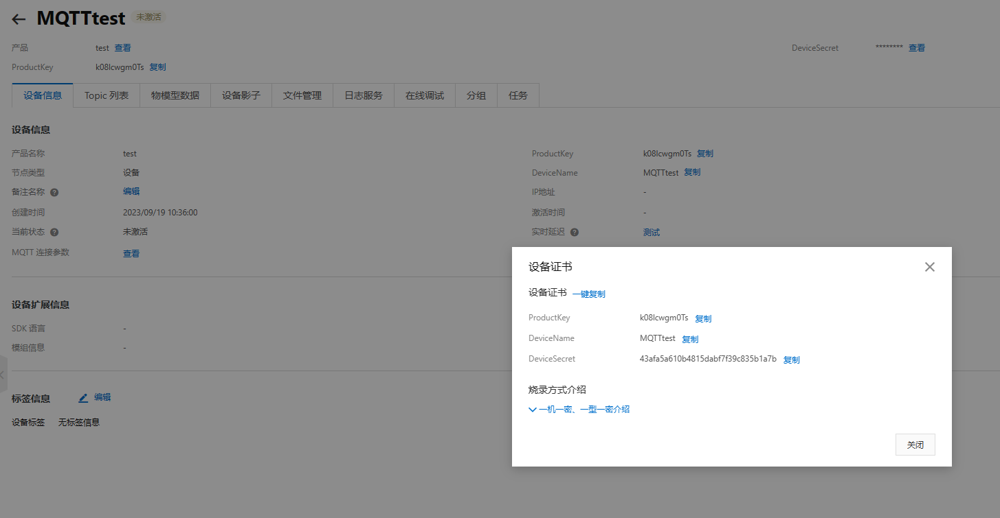

(6) 点击“设置并保存所有参数”，等待参数自动保存设备重启


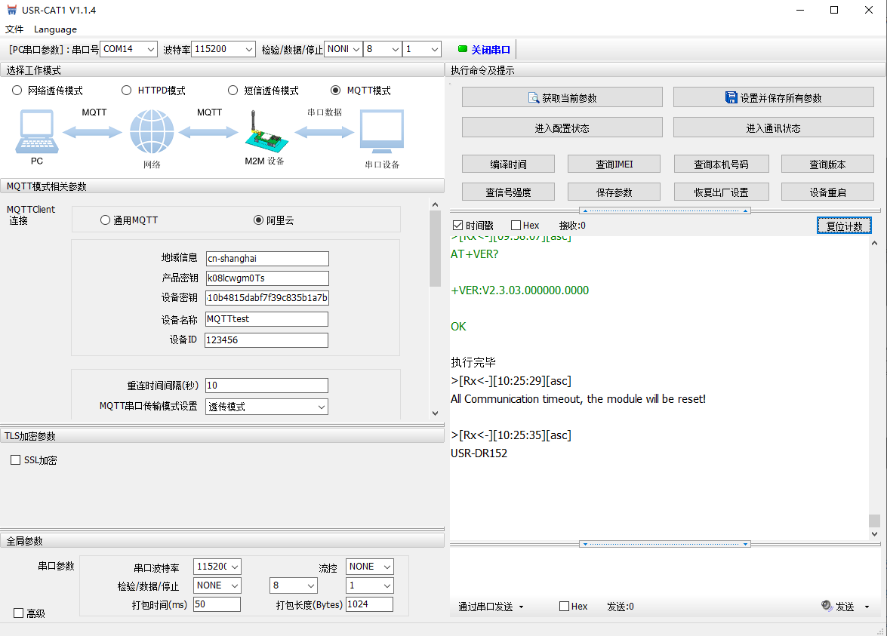

#### 查看设备上云

设备重启完成后，可以看到设备的 LINK1 指示灯亮起，且阿里云设备列表界面设备状态显示“在线”。

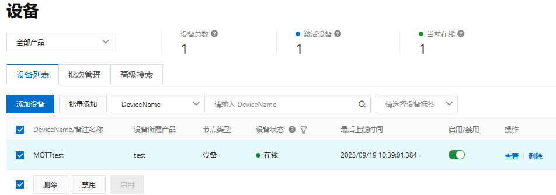

### 订阅与发布

#### 阿里云配置

在产品详情中可以自定义Topic

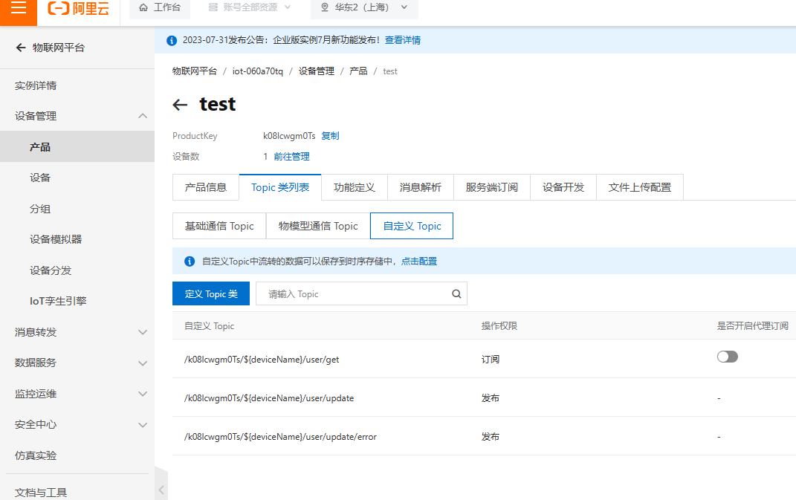

#### 设备配置

阿里云中操作权限为“发布”的主题，填写到设备的“推送主题”配置中，操作权限为“订阅”的主题，填写到设备的“订阅主题” 配置中，$(deviceName)要替换成当前设备名称，本例中为“MQTTtest”

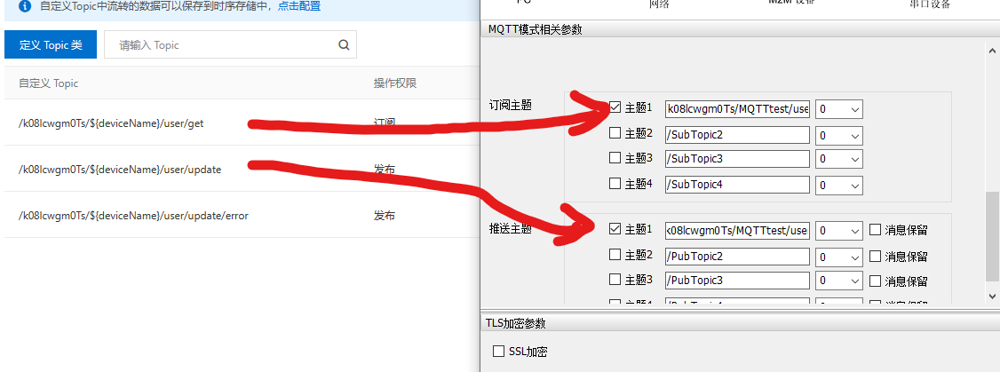


#### 透传模式

配置 MQTTtest的“MQTT 串口传输模式设置”为“透传模式”时，串口发送和接收的数据仅消息体：

服务器下发数据：

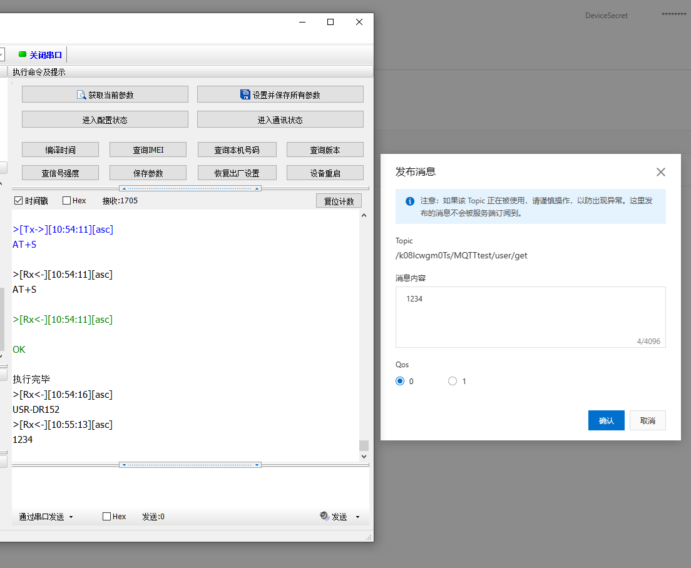

设备上报数据：（在监控运维的日志服务中查看）

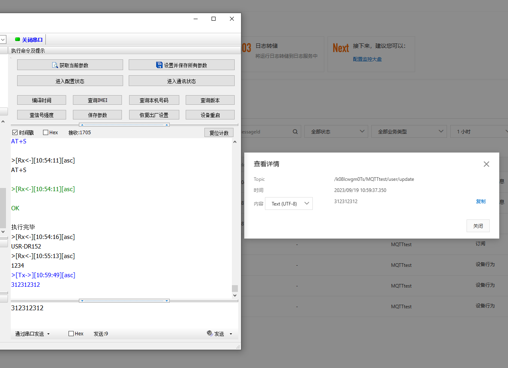

#### 分发模式

配置 MQTTtest的“MQTT 串口传输模式设置”为“分发模式”时，串口发送和接收的数据格式为：symbol,（symbol：主题 序号）：

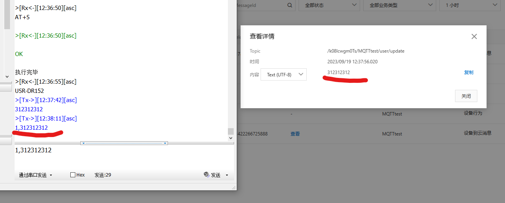

## 实际流程


### 上报OTA当前版本

（可选）设备连接OTA服务，上报版本号。

设备端通过MQTT协议推送当前设备OTA模块版本号到Topic：` /ota/device/inform/${productKey}/${deviceName}`。消息格式如下：

```json
{
    "id": "123",
    "params": {
        "version": "1.0.1",
        "module": "MCU"
    }
}

sprintf(temp,"{\"id\": \"1\",\"params\": {\"version\": \"%s\",\"module\": \"MCU\"}}",VERSION);
```


###　下发OTA升级包的URL给设备


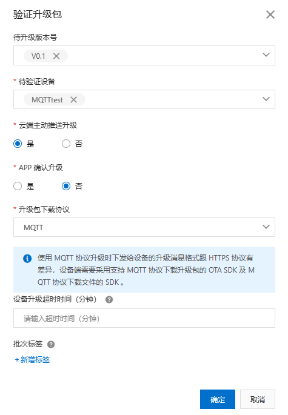

在控制台触发升级操作之后，设备会收到物联网平台OTA服务推送的升级包的URL地址。

设备端订阅Topic：`/ota/device/upgrade/${productKey}/${deviceName}`。物联网平台对设备发起OTA升级请求后，设备端会通过该Topic收到升级包的存储地址URL。

消息格式如下：

- 升级包下载协议为HTTPS：

    ```json
    {
        "id": "123",
        "code": 200,
        "data": {
            "size": 93796291,
            "sign": "f8d85b250d4d787a9f483d89a974***",
            "version": "10.0.1.9.20171112.1432",
            "isDiff": 1,
            "url": "https://the_firmware_url",
            "signMethod": "MD5",
            "md5": "f8d85b250d4d787a9f48***",
            "module": "MCU",
            "extData":{
                "key1":"value1",
                "key2":"value2",
                "_package_udi":"{\"ota_notice\":\"升级底层摄像头驱动，解决视频图像模糊的问题。\"}"
            }
        }
    }
    ```

- 升级包下载协议为MQTT：

    ```json
    {
        "id": "123",
        "code": 200,
        "data":{
            "size":432945,
            "digestsign":"A4WOP***SYHJ6DDDJD9***",
            "version":"2.0.0",
            "isDiff":1,
            "signMethod":"MD5",
            "dProtocol":"mqtt",
            "streamId":1397345,
            "streamFileId":1,
            "md5":"93230c3bde***",
            "sign":"93230c3bde42***",
            "module":"MCU",
            "extData":{
                "key1":"value1",
                "key2":"value2"
            }
        }
    }
    ```

实际举例

```json
30 a0 02 00 28 2f 6f 74 61 2f 64 65 76 69 63 65 2f 75 70 67 72 61 64 65 2f 6b 30 38 6c 63 77 67 6d 30 54 73 2f 4d 51 54 54 74 65 73 74 7b 22 63 6f 64 65 22 3a 22 31 30 30 30 22 2c 22 64 61 74 61 22 3a 7b 22 73 69 7a 65 22 3a 34 32 35 32 2c 22 73 74 72 65 61 6d 49 64 22 3a 31 32 33 33 32 2c 22 73 69 67 6e 22 3a 22 32 65 37 38 66 33 35 37 66 35 34 37 33 32 63 39 30 66 33 62 65 62 62 32 66 62 36 61 33 38 36 35 22 2c 22 64 50 72 6f 74 6f 63 6f 6c 22 3a 22 6d 71 74 74 22 2c 22 76 65 72 73 69 6f 6e 22 3a 22 31 2e 31 22 2c 22 73 69 67 6e 4d 65 74 68 6f 64 22 3a 22 4d 64 35 22 2c 22 73 74 72 65 61 6d 46 69 6c 65 49 64 22 3a 31 2c 22 6d 64 35 22 3a 22 32 65 37 38 66 33 35 37 66 35 34 37 33 32 63 39 30 66 33 62 65 62 62 32 66 62 36 61 33 38 36 35 22 7d 2c 22 69 64 22 3a 31 36 39 35 32 38 31 35 33 36 38 37 34 2c 22 6d 65 73 73 61 67 65 22 3a 22 73 75 63 63 65 73 73 22 7d 

/ota/device/upgrade/k08lcwgm0Ts/MQTTtest{"code":"1000","data":{"size":4252,"streamId":12332,"sign":"2e78f357f54732c90f3bebb2fb6a3865","dProtocol":"mqtt","version":"1.1","signMethod":"Md5","streamFileId":1,"md5":"2e78f357f54732c90f3bebb2fb6a3865"},"id":1695281536874,"message":"success"}
```

### 设备请求下载文件分片

升级包下载协议为MQTT时，设备端获取OTA升级包信息后，可通过以下Topic分片下载OTA升级包文件。

设备端通过MQTT协议下载的单个文件大小不能超过16 MB。

- 请求Topic：`/sys/${productKey}/${deviceName}/thing/file/download`
- 响应Topic：`/sys/${productKey}/${deviceName}/thing/file/download_reply`

请求数据格式：

```json
{
    "id": "123456",
    "version": "1.0",
    "params": {
        "fileToken":"1bb8***",
        "fileInfo":{
            "streamId":1234565,
            "fileId":1
        },
        "fileBlock":{
            "size":256,
            "offset":2
        }
    }
}
```

响应数据格式：

结构如下图：

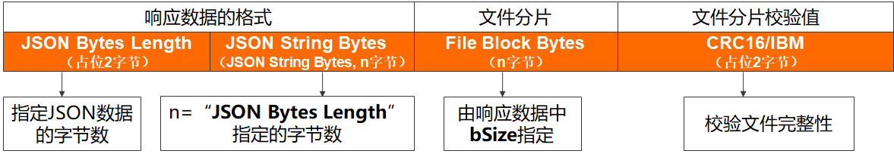

- 响应的JSON数据格式：

    ```json
    {
        "id": "123456",
        "code":200,
        "msg":"file size has exceeded the limit 16 MB",
        "data": {
            "fileToken":"1bb8***",
            "fileLength":1238848,
            "bSize":1491,
            "bOffset":2
        }
    }
    ```


OTA下载需要订阅对应的thing/file/download_reply。

目前所使用的是每256个字节为一包，下载到STM32F4内部的Flash中。

```c
        //收到download_reply,为bin文件的分片
        if(strstr((const char*)Aliyun_mqtt.CMD_buff,"/sys/k08lcwgm0Ts/MQTTtest/thing/file/download_reply"))
        {
            u1_printf("一共%d字节\r\n",datalen);
            for(int i = 0;i < datalen;i++)
                u1_printf("%02x ",data[i]);
            u1_printf("\r\n");

            u1_printf("第%d字节处存放 %02x\r\n",(Aliyun_mqtt.num-1) * 256 + datalen - Aliyun_mqtt.downlen -2,data[datalen - Aliyun_mqtt.downlen -2]);
            Flash_Write(Application_2_Addr + (Aliyun_mqtt.num-1) * 256,(uint32_t *)&data[datalen - Aliyun_mqtt.downlen -2],64);
            Aliyun_mqtt.num++;
            if(Aliyun_mqtt.num < Aliyun_mqtt.counter)
            {
                Aliyun_mqtt.downlen = 256;
                MQTT_OTA_Download(Aliyun_mqtt.downlen,(Aliyun_mqtt.num-1) * 256);
            }
            else if(Aliyun_mqtt.num == Aliyun_mqtt.counter)
            {
                if(Aliyun_mqtt.size % 256 == 0)
                {
                    Aliyun_mqtt.downlen = 256;
                    MQTT_OTA_Download(Aliyun_mqtt.downlen,(Aliyun_mqtt.num-1) * 256);
                }
                else
                {
                    Aliyun_mqtt.downlen = Aliyun_mqtt.size % 256;
                    MQTT_OTA_Download(Aliyun_mqtt.downlen,(Aliyun_mqtt.num-1) * 256);
                }
            }
            else
            {
                u1_printf("OTA下载完毕!\r\n");
                Code_Storage_Done();
                NVIC_SystemReset();
            }
        }

void MQTT_GetOTAInfo(char *data)
{
    if(sscanf(data,"/ota/device/upgrade/k08lcwgm0Ts/MQTTtest{\"code\":\"1000\",\"data\":{\"size\":%d,\"streamId\":%d,\"sign\":\"%*32s\",\"dProtocol\"  \
        :\"mqtt\",\"version\":\"%3s\",\"signMethod\":\"Md5\",\"streamFileId\":1,\"md5\":\"%*32s\"},\"id\":%*d,\"message\":\"success\"}",
        &Aliyun_mqtt.size,&Aliyun_mqtt.streamId,Aliyun_mqtt.OTA_VerTemp) == 3)
    {
        u1_printf("OTA固件大小:%d\r\n",Aliyun_mqtt.size);
        u1_printf("OTA固件ID:%d\r\n",Aliyun_mqtt.streamId);
        u1_printf("OTA固件版本:%s\r\n",Aliyun_mqtt.OTA_VerTemp);

        //计算下载总量
        if(Aliyun_mqtt.size%256 == 0){
            Aliyun_mqtt.counter = Aliyun_mqtt.size/256;
        }else{
            Aliyun_mqtt.counter = Aliyun_mqtt.size/256 + 1;
        }
        //初始化
        Aliyun_mqtt.num = 1;
        Aliyun_mqtt.downlen = 256;
        MQTT_OTA_Download(Aliyun_mqtt.downlen,(Aliyun_mqtt.num-1)*256);
    }
}
```


可以使用WinHex软件查看Bin文件的排列测试程序

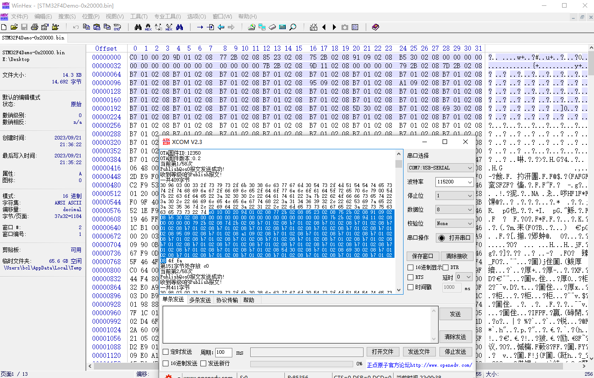

## 串口printf自定义

```c
static uint8_t USART1_TX_BUF[200];

#define u1_printf(...)  HAL_UART_Transmit(&huart1,USART1_TX_BUF,sprintf((char *)USART1_TX_BUF,__VA_ARGS__),0xffff)
                                                                                                                                                                    
static uint8_t USART3_TX_BUF[200];

#define u3_printf(...)  HAL_UART_Transmit(&huart3,USART3_TX_BUF,sprintf((char *)USART3_TX_BUF,__VA_ARGS__),0xffff)
```

## MQTT

### 下载MQTT.fx

[mqtt.fx | 一款超级好用的Mqtt客户端软件（下载、安装、使用详解）_Mculover666的博客-CSDN博客](https://blog.csdn.net/Mculover666/article/details/103799033)

### MQTT标准文档

[MQTT Version 3.1.1 (runoob.com)](https://www.runoob.com/manual/mqtt/protocol/MQTT-3.1.1-CN.pdf)

### MQTT协议头对应十六进制

|             |           |        |                                     |
| ----------- | --------- | ------ | ----------------------------------- |
| 控制报文    | 二进制    | 16进制 | 说明                                |
| CONNECT     | 0001 0000 | 0x10   |                                     |
| CONNACK     | 0010 0000 | 0x20   |                                     |
| PUBLISH     | 0011 0000 | 0x30   | 示例中DUP、两个QoS、RETAIN全填0为例 |
| PUBACK      | 0010 0000 | 0x40   |                                     |
| PUBREC      | 0011 0000 | 0x50   |                                     |
| PUBREL      | 0101 0000 | 0x60   |                                     |
| PUBCOMP     | 0111 0000 | 0x70   |                                     |
| SUBSCRIBE   | 1000 0010 | 0x82   |                                     |
| SUBACK      | 1001 0000 | 0x90   |                                     |
| UNSUBSCRIBE | 1010 0010 | 0xA2   |                                     |
| UNSUBACK    | 1011 0000 | 0xB0   |                                     |
| PINGREQ     | 1100 0000 | 0xC0   |                                     |
| PINGRESP    | 1110 0000 | 0XD0   |                                     |
| DISCONNECT  | 1111 0000 | 0xE0   |                                     |

### MQTT.fx连接阿里云

[MQTT.fx客户端MQTT接入阿里云物联网平台，登录、订阅、发布消息_云平台下物联网系统的搭建, 使用mqtt。fx完成于设备的主题订阅和发布-CSDN博客](https://blog.csdn.net/Mark_md/article/details/108316694)

### DTU透传模式与指令模式的切换

从网络透传切换至指令模式的时序： 

1) 串口设备给模块连续发送“+++”，模块收到“+++”后，会给设备发送一个‘a’。
2) 在发送“+++”之前的一个串口打包间隔时间内不可发送任何数据。 
3) 当设备接收‘a’后，必须在 3 秒内给模块发送一个‘a’。 
4) 模块在接收到‘a’后，给设备发送“+ok”，并进入“临时指令模式”。
5) 设备接收到“+ok”后，知道模块已进入“临时指令模式”，可以向其发送 AT 指令。

从指令模式切换回网络透传的时序： 

1. 串口设备给模块发送指令“AT+ENTM”后面加回车符，16 进制表示 0x0D 0x0A。 
2. 模块在接收到指令后，给设备发送“+OK”，并回到之前的工作模式。 
3. 设备接收到“+OK”后，知道模块已回到之前的工作模式。

### 配置服务器

```c
#define SERVER_CONFIG	"TCP,iot-060a70tq.mqtt.iothub.aliyuncs.com,1883"
/**
 * @brief DTU设置远程服务器
 * 
 */
void DTU_Set_Server(void)
{
    u3_printf("AT+SOCKA=%s\r\n",SERVER_CONFIG);     //设置服务器地址和端口
    HAL_Delay(30);

    u3_printf("AT+SOCKAEN=ON\r\n");                 //开启SOCKA
    HAL_Delay(30);

    u3_printf("AT+SOCKBEN=ON\r\n");                 //开启SOCKB
    HAL_Delay(30);

    u3_printf("AT+SOCKCEN=ON\r\n");                 //开启SOCKC
    HAL_Delay(30);
    
    u3_printf("AT+SOCKDEN=ON\r\n");                 //开启SOCKD
    HAL_Delay(30);

    u3_printf("AT+HEART=ON,NET,USER,60,C000\r\n");  //设置心跳
    HAL_Delay(30);

    u3_printf("AT+S\r\n");                          //保存配置
    HAL_Delay(30);
}
```

### Connect

```c
/**
 * @brief MQTT的Connect报文
 * 
 */
void MQTT_ConnectPack(void)
{
    Aliyun_mqtt.MessageID = 1;
    Aliyun_mqtt.Fixed_len = 1;
    Aliyun_mqtt.Variable_len = 10;
    Aliyun_mqtt.Payload_len = 2 + strlen(CLIENTID) + 2 + strlen(USERNAME) + 2 + strlen(PASSWORD);   //其中的2都表示为长度
    Aliyun_mqtt.Remaining_len = Aliyun_mqtt.Variable_len + Aliyun_mqtt.Payload_len;

    /* 固定报头 */
    Aliyun_mqtt.Pack_buff[0] = 0x10;    //connect报头

    //判断剩余长度是一个字节还是两个字节
    do{
        if(Aliyun_mqtt.Remaining_len/128 == 0)
            Aliyun_mqtt.Pack_buff[Aliyun_mqtt.Fixed_len] = Aliyun_mqtt.Remaining_len;
        else
            Aliyun_mqtt.Pack_buff[Aliyun_mqtt.Fixed_len] = (Aliyun_mqtt.Remaining_len%128) | 0x80;

        Aliyun_mqtt.Fixed_len++;
        Aliyun_mqtt.Remaining_len = Aliyun_mqtt.Remaining_len/128;
    }while(Aliyun_mqtt.Remaining_len);

    /* 可变报头 */
    Aliyun_mqtt.Pack_buff[Aliyun_mqtt.Fixed_len + 0] = 0x00;
    Aliyun_mqtt.Pack_buff[Aliyun_mqtt.Fixed_len + 1] = 0x04;
    Aliyun_mqtt.Pack_buff[Aliyun_mqtt.Fixed_len + 2] = 0x4D;    //'M'
    Aliyun_mqtt.Pack_buff[Aliyun_mqtt.Fixed_len + 3] = 0x51;    //'Q'
    Aliyun_mqtt.Pack_buff[Aliyun_mqtt.Fixed_len + 4] = 0x54;    //'T'
    Aliyun_mqtt.Pack_buff[Aliyun_mqtt.Fixed_len + 5] = 0x54;    //'T'
    Aliyun_mqtt.Pack_buff[Aliyun_mqtt.Fixed_len + 6] = 0x04;    //协议级别04
    Aliyun_mqtt.Pack_buff[Aliyun_mqtt.Fixed_len + 7] = 0xC2;    //连接标志
    Aliyun_mqtt.Pack_buff[Aliyun_mqtt.Fixed_len + 8] = 0x00;    //保持连接时间高字节（100）
    Aliyun_mqtt.Pack_buff[Aliyun_mqtt.Fixed_len + 9] = 0x64;    //保持连接时间低字节（100）

    /* 有效负载 */
    Aliyun_mqtt.Pack_buff[Aliyun_mqtt.Fixed_len + 10] = strlen(CLIENTID)/256;
    Aliyun_mqtt.Pack_buff[Aliyun_mqtt.Fixed_len + 11] = strlen(CLIENTID)%256;
    memcpy(&Aliyun_mqtt.Pack_buff[Aliyun_mqtt.Fixed_len + 12],CLIENTID,strlen(CLIENTID));

    Aliyun_mqtt.Pack_buff[Aliyun_mqtt.Fixed_len + 12 + strlen(CLIENTID)] = strlen(USERNAME)/256;
    Aliyun_mqtt.Pack_buff[Aliyun_mqtt.Fixed_len + 13 + strlen(CLIENTID)] = strlen(USERNAME)%256;
    memcpy(&Aliyun_mqtt.Pack_buff[Aliyun_mqtt.Fixed_len + 14 + strlen(CLIENTID)],USERNAME,strlen(USERNAME));

    Aliyun_mqtt.Pack_buff[Aliyun_mqtt.Fixed_len + 14 + strlen(CLIENTID) + strlen(USERNAME)] = strlen(PASSWORD)/256;
    Aliyun_mqtt.Pack_buff[Aliyun_mqtt.Fixed_len + 15 + strlen(CLIENTID) + strlen(USERNAME)] = strlen(PASSWORD)%256;
    memcpy(&Aliyun_mqtt.Pack_buff[Aliyun_mqtt.Fixed_len + 16 + strlen(CLIENTID) + strlen(USERNAME)],PASSWORD,strlen(PASSWORD));
    /* 使用DTU发送Connect报文给服务器 */
    if(DTU_SendData(Aliyun_mqtt.Pack_buff,Aliyun_mqtt.Fixed_len + Aliyun_mqtt.Variable_len + Aliyun_mqtt.Payload_len))
        u1_printf("Connect报文发送成功,等待服务器回应\r\n");

}
```

使用网络调试助手，选择TCP Client，输入阿里云上的url和端口，将Connect的报文以十六进制发送，接收区也以十六进制显示。最后显示20 02 00 00 ，代表连接服务器成功。

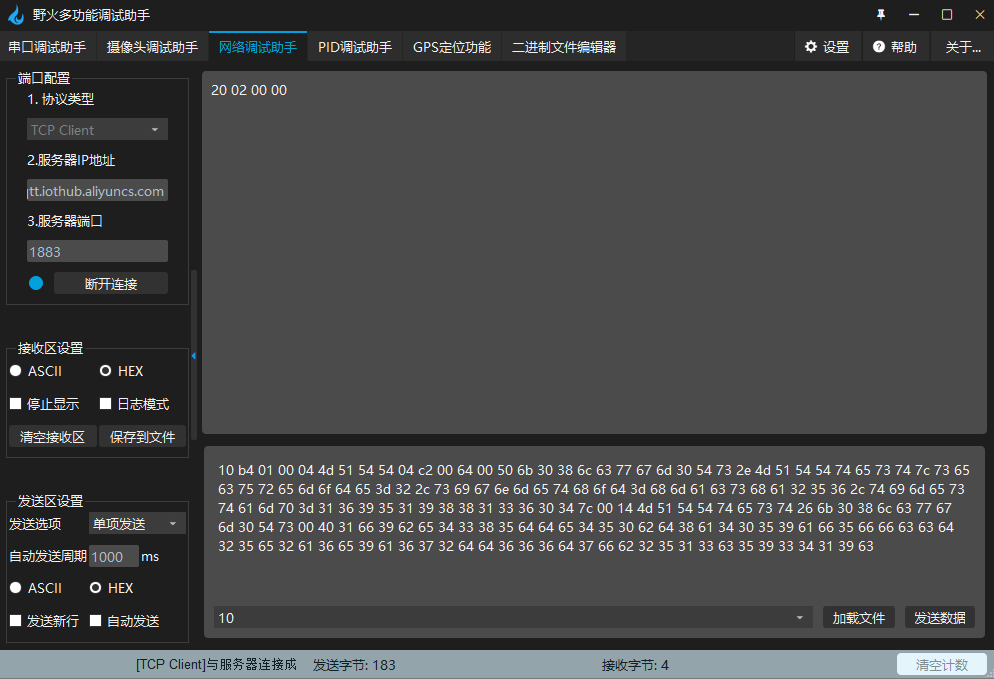

#### CONNACK

接收到的一般类似20 02 00 00

90为订阅应答头，02是剩余长度，等于可变报头的长度固定为2，第 1 个字节是连接确认标志，位 7-1 是保留位且必须设置为 0，连接返回码为可变报头的第二个字节，0x00 连接已接受，其他都是出错。

### Subscribe与UnSubscribe

#### Subscribe

```c
/**
 * @brief MQTT的Subscribe报文
 * 
 */
void MQTT_SubscribePack(char *topic)
{
    Aliyun_mqtt.Fixed_len = 1;
    Aliyun_mqtt.Variable_len = 2;
    Aliyun_mqtt.Payload_len = 2 + strlen(topic) + 1;   //其中的2都表示为长度,1代表服务质量等级
    Aliyun_mqtt.Remaining_len = Aliyun_mqtt.Variable_len + Aliyun_mqtt.Payload_len;

    /* 固定报头 */
    Aliyun_mqtt.Pack_buff[0] = 0x82;    //Subscrib报头

    //判断剩余长度是一个字节还是两个字节
    MQTT_Remaining_Len_Process();

    /* 可变报头 */
    Aliyun_mqtt.Pack_buff[Aliyun_mqtt.Fixed_len + 0] = Aliyun_mqtt.MessageID/256;
    Aliyun_mqtt.Pack_buff[Aliyun_mqtt.Fixed_len + 1] = Aliyun_mqtt.MessageID%256;
    Aliyun_mqtt.MessageID++;

    /* 有效负载 */
    Aliyun_mqtt.Pack_buff[Aliyun_mqtt.Fixed_len + 2] = strlen(topic)/256;
    Aliyun_mqtt.Pack_buff[Aliyun_mqtt.Fixed_len + 3] = strlen(topic)%256;
    memcpy(&Aliyun_mqtt.Pack_buff[Aliyun_mqtt.Fixed_len + 4],topic,strlen(topic));

    Aliyun_mqtt.Pack_buff[Aliyun_mqtt.Fixed_len + 4 + strlen(topic)] = 0;   //服务质量等级为0

    if(DTU_SendData(Aliyun_mqtt.Pack_buff,Aliyun_mqtt.Fixed_len + Aliyun_mqtt.Variable_len + Aliyun_mqtt.Payload_len))
        u1_printf("Subscribe报文发送成功,等待服务器回应\r\n");
}
```

#### SUBACK

接收到的一般类似90 03 00 01 01

90为订阅应答头，03是剩余长度，等于可变报头的长度加上有效载荷的长度，最后两个字节为报文标识符。

#### UnSubscribe

```c
/**
 * @brief MQTT的UnSubscribe报文
 * 
 */
void MQTT_UnSubscribePack(char *topic)
{
    Aliyun_mqtt.Fixed_len = 1;
    Aliyun_mqtt.Variable_len = 2;
    Aliyun_mqtt.Payload_len = 2 + strlen(topic);
    Aliyun_mqtt.Remaining_len = Aliyun_mqtt.Variable_len + Aliyun_mqtt.Payload_len;

    /* 固定报头 */
    Aliyun_mqtt.Pack_buff[0] = 0xA0;    //Subscrib报头

    //判断剩余长度是一个字节还是两个字节
    MQTT_Remaining_Len_Process();

    /* 可变报头 */
    Aliyun_mqtt.Pack_buff[Aliyun_mqtt.Fixed_len + 0] = Aliyun_mqtt.MessageID/256;
    Aliyun_mqtt.Pack_buff[Aliyun_mqtt.Fixed_len + 1] = Aliyun_mqtt.MessageID%256;
    Aliyun_mqtt.MessageID++;

    /* 有效负载 */
    Aliyun_mqtt.Pack_buff[Aliyun_mqtt.Fixed_len + 2] = strlen(topic)/256;
    Aliyun_mqtt.Pack_buff[Aliyun_mqtt.Fixed_len + 3] = strlen(topic)%256;
    memcpy(&Aliyun_mqtt.Pack_buff[Aliyun_mqtt.Fixed_len + 4],topic,strlen(topic));

    if(DTU_SendData(Aliyun_mqtt.Pack_buff,Aliyun_mqtt.Fixed_len + Aliyun_mqtt.Variable_len + Aliyun_mqtt.Payload_len))
        u1_printf("UnSubscribe报文发送成功,等待服务器回应\r\n");
}
```

#### UNSUBACK

接收到的一般类似b0 02 00 02 

B0为订阅应答头，02是剩余长度，为固定值，最后两个字节为报文标识符。

### Publish

#### 添加自定义功能

在产品->功能定义->编辑草稿->添加自定义功能

这边我们添加一个”开关1“的功能，设置为bool型

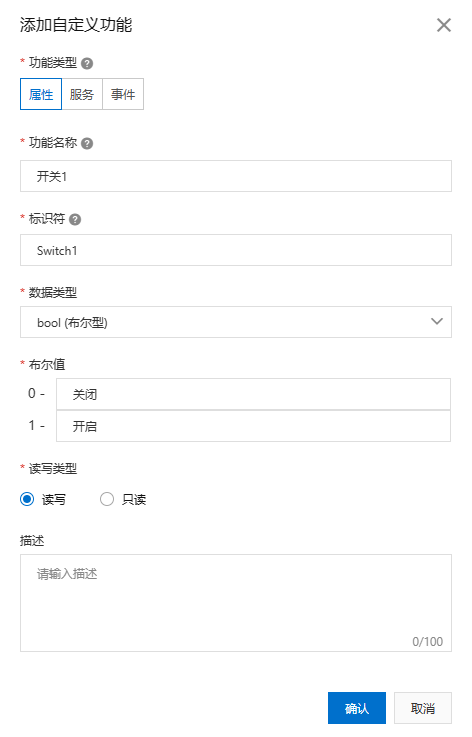

**确认**完之后，一定要点击"**发布上线**"

可以使用设备中的在线调试来初步调试代码。通过在线调试，设置开关的属性，STM32会通过DTU获得数据。

```c
/**
 * @brief MQTT的处理Publish报文（等级0）
 * 
 * @param data 数据指针
 * @param datalen 数据长度
 */
void MQTT_DealPublishData(uint8_t *data,uint16_t datalen)
{
    uint8_t i;

    //通过与0x80相与，判断剩余长度的位数
    for(i = 1;i < 5;i++)
    {
        if((data[i] & 0x80) == 0)
            break;
    }

    memset(Aliyun_mqtt.CMD_buff,0,512);
    memcpy(Aliyun_mqtt.CMD_buff,&data[1+i+2],datalen-1-i-2);

}

/**
 * @brief MQTT的发送Publish报文（等级0）
 * 
 * @param topic 订阅的标题
 * @param data 发送的数据
 */
void MQTT_PublishDataQos0(char *topic,char *data)
{
    Aliyun_mqtt.Fixed_len = 1;
    Aliyun_mqtt.Variable_len = 2 + strlen(topic);   //等级0没有报文标识符
    Aliyun_mqtt.Payload_len = strlen(data);
    Aliyun_mqtt.Remaining_len = Aliyun_mqtt.Variable_len + Aliyun_mqtt.Payload_len;

    /* 固定报头 */
    Aliyun_mqtt.Pack_buff[0] = 0x30;    //PublishQs0报头

    //判断剩余长度是一个字节还是两个字节
    MQTT_Remaining_Len_Process();

    /* 可变报头 */
    Aliyun_mqtt.Pack_buff[Aliyun_mqtt.Fixed_len + 0] = strlen(topic)/256;
    Aliyun_mqtt.Pack_buff[Aliyun_mqtt.Fixed_len + 1] = strlen(topic)%256;
    memcpy(&Aliyun_mqtt.Pack_buff[Aliyun_mqtt.Fixed_len + 2],topic,strlen(topic));

    /* 有效负载 */
    memcpy(&Aliyun_mqtt.Pack_buff[Aliyun_mqtt.Fixed_len + 2 + strlen(topic)],data,strlen(data));

    if(DTU_SendData(Aliyun_mqtt.Pack_buff,Aliyun_mqtt.Fixed_len + Aliyun_mqtt.Variable_len + Aliyun_mqtt.Payload_len))
        u1_printf("PublishQs0报文发送成功!\r\n");
}

/**
 * @brief MQTT的发送Publish报文（等级1）
 * 
 * @param topic 订阅的标题
 * @param data 发送的数据
 */
void MQTT_PublishDataQos1(char *topic,char *data)
{
    Aliyun_mqtt.Fixed_len = 1;
    Aliyun_mqtt.Variable_len = 2 + strlen(topic) + 2;
    Aliyun_mqtt.Payload_len = strlen(data);
    Aliyun_mqtt.Remaining_len = Aliyun_mqtt.Variable_len + Aliyun_mqtt.Payload_len;

    /* 固定报头 */
    Aliyun_mqtt.Pack_buff[0] = 0x32;    //PublishQos1报头

    //判断剩余长度是一个字节还是两个字节
    MQTT_Remaining_Len_Process();

    /* 可变报头 */
    Aliyun_mqtt.Pack_buff[Aliyun_mqtt.Fixed_len + 0] = strlen(topic)/256;
    Aliyun_mqtt.Pack_buff[Aliyun_mqtt.Fixed_len + 1] = strlen(topic)%256;
    memcpy(&Aliyun_mqtt.Pack_buff[Aliyun_mqtt.Fixed_len + 2],topic,strlen(topic));

    Aliyun_mqtt.Pack_buff[Aliyun_mqtt.Fixed_len + 2 + strlen(topic)] = Aliyun_mqtt.MessageID/256;
    Aliyun_mqtt.Pack_buff[Aliyun_mqtt.Fixed_len + 3 + strlen(topic)] = Aliyun_mqtt.MessageID%256;
    Aliyun_mqtt.MessageID++;

    /* 有效负载 */
    memcpy(&Aliyun_mqtt.Pack_buff[Aliyun_mqtt.Fixed_len + 4 + strlen(topic)],data,strlen(data));

    if(DTU_SendData(Aliyun_mqtt.Pack_buff,Aliyun_mqtt.Fixed_len + Aliyun_mqtt.Variable_len + Aliyun_mqtt.Payload_len))
        u1_printf("PublishQs1报文发送成功!\r\n");
}
```


#### PUBACK(Qs1)

PUBACK是对ＱｏＳ等级的ＰＵＢＬＩＳＨ报文的回复。

接收到的一般类似40 02 00 02 

４０为订阅应答头，02是剩余长度，为固定值，最后两个字节为报文标识符。

## 多设备OTA升级

之前都是一个设备的升级，在代码多将设备名固定。但实际情况都是很多个设备一起升级。

将报文的ProductKey和DeviceName都使用%s替换，采用sprintf保存在temp中，这样解决了多设备报文不一样的问题。

所以我打算在APP2结束之后的第一个word中加入标记，例如设备名为Dxxx，我将此word写入1代表D001设备。

应用程序需要在启动的时候去读取对应位置上的值，通过switch方式给设备信息结构体的各个成员赋值。这样只需要一套应用程序就可以满足所有的设备升级。麻烦在于需要在switch中写入所有设备的信息。

需要注意的是，在标记的时候，需要先对flash进行擦除，不然无法写入。F1由于使用页擦除，不容易损坏bootloader，可以将标记放入；F4使用扇区擦除，需要注意扇区的范围，不建议将标记放到bootloader中。

## 参考教程

[001-使用阿里云物联网平台 OTA 远程升级STM32程序-基于ESP8266 - 广源时代 - 博客园 (cnblogs.com)](https://www.cnblogs.com/yangfengwu/p/13591513.html)

[stm32 esp8266 ota升级-自建mqtt和文件服务器全量升级_esp8266 stm32 ota_hbwsmile的博客-CSDN博客](https://blog.csdn.net/a554521655/article/details/128492112)

[STM32&4G模组实现OTA升级_stm32 ota升级 github_linggan17的博客-CSDN博客](https://blog.csdn.net/qq_42722691/article/details/113247862)

[001-STM32+Air724UG(4G模组)基本控制篇(阿里云物联网平台)-使用MQTT接入阿里云物联网平台_杨奉武的博客-CSDN博客](https://blog.csdn.net/qq_14941407/article/details/115594411)

视频教程首推B站超子说物联网，里面都是关于物联网的视频

# ETH+LWIP

[38. ETH—Lwip以太网通信 — [野火\]STM32 HAL库开发实战指南——基于野火F4系列开发板 文档 (embedfire.com)](https://doc.embedfire.com/mcu/stm32/f4/hal_general/zh/latest/doc/chapter36_1/chapter36_1.html)

[STM32CubeMX学习笔记（41）——ETH接口+LwIP协议栈使用（DHCP）_stm32cubemx配置lwip-CSDN博客](https://blog.csdn.net/qq_36347513/article/details/125931365)

## 减少 lwip 消耗 的 RAM

使用正点原子的LWIP移植例程，发现其ZI-DATA巨大无比，所以需要想办法减小对RAM的占用

首先是不是用正点原子写的malloc函数，使用stdlib.h中的malloc函数。

1、修改最大一包数据的大小 **TCP_MSS** ， 即 TCP最大报文段大小，根据自己的应用进行修改，比如一包数据最大 256字节，在 **lwipopts.h** 文件中修改为

`\#define TCP_MSS             (300 - 40)  */\* TCP_MSS = (Ethernet MTU - IP header size - TCP header size) \*/`*

2、因为我使用 FreeRTOS 驱动 lwip,因此 lwip 的线程栈大小，也是 可以减少内存的，即设定 **TCPIP_THREAD_STACKSIZE** ，在 **lwipopts.h** 文件中，这个线程栈的单位是按照 **字** 计算的哦，要注意！！！

[减少 lwip 消耗 的 RAM - 所长 - 博客园 (cnblogs.com)](https://www.cnblogs.com/suozhang/p/8672264.html)

## 关于send和sendto

`sendto` 和 `send` 都是用于在套接字上发送数据的函数，但它们有一些区别：

1. **用途**：
    - `sendto`：通常用于在支持数据报的协议（如UDP）上发送数据。它可以在发送数据的同时指定目标地址和端口。
    - `send`：通常用于在面向连接的协议（如TCP）上发送数据。它发送数据到已连接的套接字，不需要再次指定目标地址和端口，因为连接已经建立。
2. **参数**：
    - `sendto`：除了要发送的数据外，还需要指定目标地址和端口等信息。
    - `send`：通常只需要提供要发送的数据即可，因为在使用 `send` 前已经建立了连接。
3. **返回值**：
    - `sendto`：返回实际发送的字节数或者错误码。
    - `send`：返回实际发送的字节数或者错误码。
4. **适用协议**：
    - `sendto`：主要用于UDP协议，因为UDP是面向数据报的，每个数据报都需要指定目标地址和端口。
    - `send`：主要用于TCP协议，因为TCP是面向连接的，发送数据时无需再次指定目标地址和端口。

总的来说，`sendto` 用于发送无连接的数据报，而 `send` 用于发送已建立连接的数据。

# CmBacktrace

按照教程安装到工程中，也搞了一个除0错误。

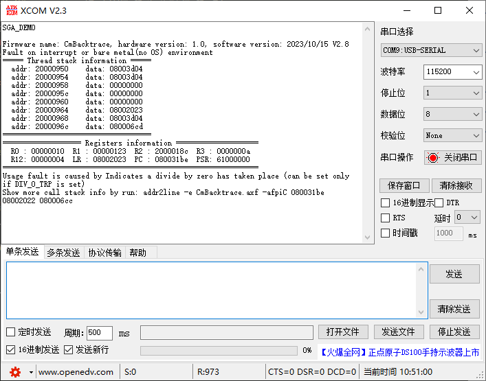

使用命令行cmd去寻找问题所在，首先要将addr2line这个exe文件放到axf文件的目录下，要选好操作系统的位数

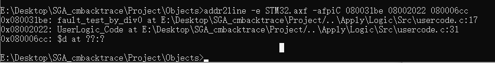

这里的.axf文件名称要按照实际的来

确实能够正确寻找到问题所在

[CmBacktrace使用方法-CSDN博客](https://blog.csdn.net/nicholas_duan/article/details/103470873)

[Hard Fault定位利器——开源组件CmBacktrace-CSDN博客](https://blog.csdn.net/ylzmm/article/details/135038843)

# RT-Thread内核移植

我所移植的RT-Thread版本为3.15。内核文件都在放在./Bsp/RTOS/RT-Thread下。

内核移植操作如下：

1. 在使用RT-Thread前，需要将内核文件放入工程中。在工程中创建一个文件夹名字叫RT-Thread。

2. 在内核文件夹中找到以下文件并且放入工程RT-Thread文件夹中。

    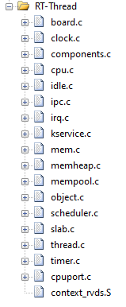

3. 头文件路径的添加工程中已经处理好了，可以在Options for Target 中的 C/C++选项卡中include path查看。

# FreeRTOS内核移植

我所移植的FreeRTOS内核版本为V10.0.1。内核文件都在放在./Bsp/RTOS/FreeRTOS下。

1. 在使用FreeRTOS前，需要将内核文件放入工程中。在工程中创建一个文件夹名字叫FreeRTOS。

2. 在内核文件夹中找到以下文件并且放入工程FreeRTOS文件夹中。

    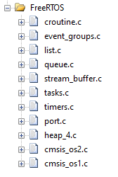

3. 头文件路径的添加工程中已经处理好了，可以在Options for Target 中的 C/C++选项卡中include path查看。

# F4-RT-Thread移植

在原有RT-Thread（3.1.5）的基础下移植，在F1上能够正常跑通。

1. 首先是去gitee上下载对应版本的内核文件，[rt-thread: RT-Thread是一个来自中国的开源物联网操作系统，它提供了非常强的可伸缩能力：从一个可以运行在ARM Cortex-M0芯片上的极小内核，到中等的ARM Cortex-M3/4/7系统，甚至是多核，64位的ARM Cortex-A，MIPS32/64处理器的功能丰富系统 (gitee.com)](https://gitee.com/rtthread/rt-thread)

2. F4最需要处理的是libcpu，也就是不同芯片内核对应的文件。将libcpu\arm\cortex-m4路径下的文件拷贝到工程文件夹中

3. 在keil中导入对应的内核文件，这里必须使用以rvds为后缀的启动文件

    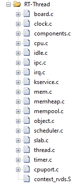

4. 因为F1和F4对串口的配置不太一样，所以要想显示RT-Thread的启动文件显示，需要改一下串口的配置，位于board.c中，void rt_hw_board_init(void)内。
5. 编译，无报错即可。

# F4-FreeRTOS移植

在原有FreeRTOS（10.0.1）的基础下移植，在F1上能够正常跑通。

1. 首先是去gitee上下载对应版本的内核文件，[FreeRTOS-Kernel: 官方库个人镜像 (gitee.com)](https://gitee.com/linlin-study/FreeRTOS-Kernel/)

2. F4最需要处理的是portable，也就是不同芯片内核对应的port文件。将portable\RVDS\ARM_CM4F路径下的文件拷贝到工程文件夹中

3. 在keil中导入对应的内核文件

    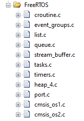

4. 编译。发现错误，无法找到某些函数的定义。

    ```
    .\Objects\STM32.axf: Error: L6218E: Undefined symbol traceISR_ENTER (referred from port.o).
    .\Objects\STM32.axf: Error: L6218E: Undefined symbol traceISR_EXIT (referred from port.o).
    .\Objects\STM32.axf: Error: L6218E: Undefined symbol traceISR_EXIT_TO_SCHEDULER (referred from port.o).
    ```

    这是SystemView，是嵌入式系统的实时记录和可视化工具。它揭示了应用程序的真实运行时行为，比调试器提供的系统洞察更深入。这在开发和处理由多线程和中断组成的复杂嵌入式系统时尤为有效。SystemView可确保系统按设计运行，跟踪低效情况，并发现意外的交互和资源冲突。

5. 从FreeRTOS源码中寻找对应的定义，在FreeRTOS.h中发现了。

    ```c
    #ifndef traceISR_EXIT_TO_SCHEDULER
        #define traceISR_EXIT_TO_SCHEDULER()
    #endif
    
    #ifndef traceISR_EXIT
        #define traceISR_EXIT()
    #endif
    
    #ifndef traceISR_ENTER
        #define traceISR_ENTER()
    #endif
    ```

6. 将其复制到自己工程中的对应位置，重新编译。无报错。

