# 软件安装

[vivado2019.2安装+license添加教程_vivado license_原地打转的瑞哥的博客-CSDN博客](https://blog.csdn.net/weixin_47730622/article/details/125623165)

vivado许可证

链接: https://pan.baidu.com/s/1-2QL3MCYhUh-qANEuxVHIQ 提取码: vh3h 

# 一些配置

## 使用无线网卡

1. 插入无线网卡
2. 输入ifconfig -a 找到wlan0设备
3. 输入ifconfig wlan0 up 打开设备
4. 输入iwlist wlan0 scan 扫描附近的WiFi
5. 关闭PS网口 ifconfig eth0 down
6. 连接WiFi /opt/hardwareTest/usb_wifi_setup.sh WiFi名称 密码 wlan0
7. 测试 ping -I wlan0 -c 10 www.baidu.com

# 常见问题

- 启动模式选择

| BOOT_CFG |  1   |  2   |
| :------: | :--: | :--: |
|   JTAG   |  ON  |  ON  |
|   NAND   | OFF  |  ON  |
|   QSPI   |  ON  | OFF  |
| SD Card  | OFF  | OFF  |

- 在写程序的时候遇到了中断会触发多次的问题，解决方法如下。

    [zynq中断之gpio中断，emio按键中断详解（解决重复中断）_卡ka罗特的博客-CSDN博客](https://blog.csdn.net/weixin_42628470/article/details/106752575)
    
- 开启仿真出现下面问题是因为有非语法性错误，例如拼写错误、顺序摆放。当然我是因为变量命名放在例化之后。类似C语言找不到定义。
  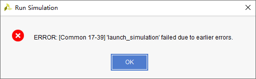

- [Place 30-574] Poor placement for routing between an IO pin and BUFG. If this sub optimal condition is acceptable for this design, you may use the CLOCK_DEDICATED_ROUTE constraint in the .xdc file to demote this message to a WARNING. However, the use of this override is highly discouraged. These examples can be used directly in the .xdc file to override this clock rule.
  	< set_property CLOCK_DEDICATED_ROUTE FALSE [get_nets clk_fx_IBUF] >

  [(33条消息) Vivado 报错：[Place 30-574\] Poor placement for routing between an IO pin and BUFG._耐心的小黑的博客-CSDN博客](https://blog.csdn.net/qq_39507748/article/details/115437791)

- 使用正点原子的串口代码一次性只能发送8位，而在频率计实验中，需要20位以上的发送，所以需要进行修改。

  [FPGA——串口通信——使用三状态的状态机实现任意字节的数据发送 - CNL中子 - 博客园 (cnblogs.com)](https://www.cnblogs.com/cnlntr/p/14318412.html)


# PL(FPGA)
## 开发流程

### 新建工程

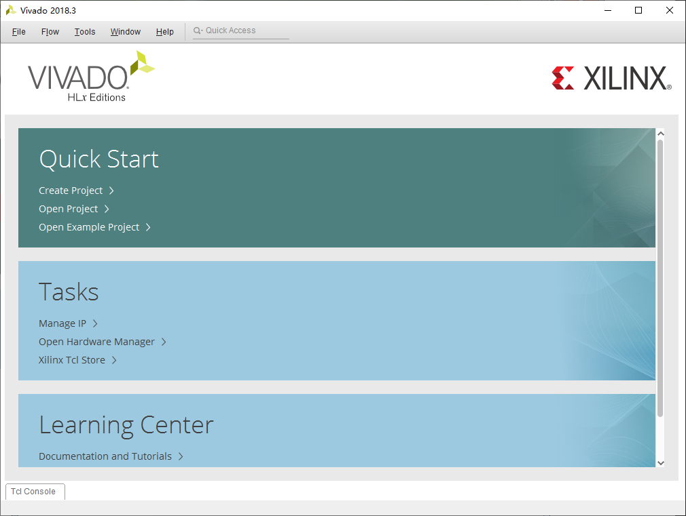

点击Create Project，然后点击Next。

输入工程名以及保存路径。默认勾选“Create project subdirectory”，该目录用于存放工程内的各种文件，方便管理。


再点击Next，选择RTL Project，不勾选“Do not specify sources at this time”，将会出现添加源文件的界面。

接下来是添加约束文件，我们也是直接点击“Next”。

接下来选择开发板的芯片型号，直接在搜素框中输入完整的芯片型号，xc7z010clg400-1，一直点Next就行。

### 设计输入

在Source中点击'+'添加源文件，定好文件名，基本不用怎么设置，一路next。(使用verilog语言)

### RTL分析

点击RTL ANALYSIS的Open Elaborated Designed，生成原理图

### 管脚约束

在右上角选择I/O Planning，通过查看原理图进行约束。主要是I/O口和电平。

### 生成比特流

点击Generate bitstream

### 烧录到开发板

连接开发板，点击Open Target，选择Auto Connect

## AXI总线

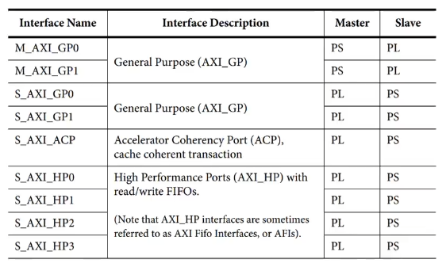


## 硬件调试

ILA 和 VIO 

### 例化ILA核

调用IP核库，搜索ILA，选择ILA(IntergrateLogic Analyzer)

配置探针数量以及位宽，进行编译

在IP sources中找到例化模板（.veo结尾），即可复制使用

### 网表加入探针

必须先综合

右上角选择Debug，打开网表，在需要查看的信号名上右键 Mark Debug

输入信号后缀为IBUF 输出信号为OBUF

如果不让vivado进行优化，变量前面需要添加(\*mark_debug = "true"\*)

## Vivado Simulator仿真

TB文件结构

```verilog
`timescale 仿真单位/仿真精度

module test_bench();
//通常testbench没有输入和输出端口

信号或者变量定义声明

使用initial或者always语句产生激励波形

例化设计模块

endmodule
```

在simulation sources创建testbench文件

### 时序约束

在时序约束之前，先分配管脚，因为管脚位置会影响时序约束。

在IMPLEMENTATION下选择Edit timing constraints

## Modelsim仿真

### Modelsim安装

[Modelsim 安装步骤详解_兄弟抱一下~的博客-CSDN博客](https://blog.csdn.net/QWERTYzxw/article/details/115350715)

### Modelsim使用

\# 等待

$stop 系统任务暂停

$stop(n) n可取0、1、2

$finish 退出仿真任务

Initial 初始化语句

### Modelsim仿真流程

1. Modelsim使用的是绝对路径，需要在使用前，File->Change Directory
2. 创建工程，加入模块文件和测试文件
3. 编译所有文件，显示勾勾说明编译成功
4. 运行仿真（在开始仿真前，需要取消勾选Enable optimization，防止波形被优化）


## LED实验

```verilog
`timescale 1ns / 1ps

module led_twinkle(
    input          sys_clk  ,  //系统时钟
    input          sys_rst_n,  //系统复位，低电平有效

    output  [1:0]  led         //LED灯
);

//reg define
reg  [25:0]  cnt ;

//*****************************************************
//**                    main code
//*****************************************************

//对计数器的值进行判断，以输出LED的状态
assign led = (cnt < 26'd2500_0000) ? 2'b01 : 2'b10 ;
//assign led = (cnt < 26'd5)         ? 2'b01 : 2'b10 ;  //仅用于仿真

//计数器在0~5000_000之间进行计数
always @ (posedge sys_clk or negedge sys_rst_n) begin
    if(!sys_rst_n)
        cnt <= 26'd0;
    else if(cnt < 26'd5000_0000)
//else if(cnt < 26'd10 - 1)  //仅用于仿真
        cnt <= cnt + 1'b1;
    else
        cnt <= 26'd0;
end

//ila_0 your_instance_name (
//	.clk(sys_clk), // input wire clk


//	.probe0(sys_rst_n), // input wire [0:0]  probe0  
//	.probe1(led), // input wire [1:0]  probe1 
//	.probe2(cnt) // input wire [25:0]  probe2
//);

endmodule
```

```verilog
`timescale 1ns / 1ps

module tb_led_twinkle();

reg sys_clk;
reg sys_rst_n;

wire [1:0] led;

initial begin
	sys_clk = 1'b0;
	sys_rst_n = 1'b0;
	#200
	sys_rst_n = 1'b1;
end

always #10 sys_clk = ~sys_clk;

led_twinkle u_led_twinkle(
	.sys_clk  	 (sys_clk),
	.sys_rst_n   (sys_rst_n),
	
	.led         (led)
);

endmodule
```

## 按键实验

```verilog
module key_led (
    input   sys_clk,
    input   sys_rst_n,
    
    input   	[1:0] key,  //按键
    output  reg [1:0] led   //LED
);

reg [24:0] cnt;     //计数值

reg led_ctrl;       //LED置位标志

//计数器
always @(posedge sys_clk or negedge sys_rst_n) begin
    if(!sys_rst_n)
        cnt <= 25'd0;
    //else if(cnt < 25'd2500_0000)    //未到0.25ms按位加一
    else if(cnt < 25'd25)    //未到0.25ms按位加一
        cnt <= cnt + 1'b1;
    else
        cnt <= 25'd0;           //到了就清零
end

//标志位
always @(posedge sys_clk or negedge sys_rst_n) begin
    if(!sys_rst_n)
        led_ctrl <= 1'b0;
    //else if(cnt == 25'd2500_0000)
    else if(cnt == 25'd25)
        led_ctrl <= ~led_ctrl;  //0,25ms翻转一次，0.5ms必然是0
end

//模式切换
always @(posedge sys_clk or negedge sys_rst_n) begin
    if(!sys_rst_n)
        led <= 2'b11;
    else case (key)
        2'b10:
            if(led_ctrl == 1'b0)
                led <= 2'b01;
            else
                led <= 2'b10;
        2'b01:
            if(led_ctrl == 1'b0)
                led <= 2'b11;
            else
                led <= 2'b00;
        2'b11:
            led <= 2'b11;
        default: 
            led <= 2'b11;
    endcase
end
    
endmodule
```

```verilog
`timescale 1ns/1ps
module tb_key_led ();

reg sys_clk;
reg sys_rst_n;

reg [1:0]  key;
wire [1:0] led;

initial begin
    sys_clk = 1'b0;
    sys_rst_n = 1'b0;
    key = 2'b11;
    #20 sys_rst_n = 1'b1;

    #400 key = 2'b10;
    #800 key = 2'b01;
    #800 key = 2'b11;
end

always #10 sys_clk <= ~sys_clk; //频率为50mhz


key_led u_key_led(
    .sys_clk    (sys_clk),
    .sys_rst_n  (sys_rst_n),

    .key        (key),
    .led        (led)
);

endmodule
```

## 按键控制蜂鸣器实验

顶层文件

```verilog
`timescale 1ns / 1ps

module top_key_beep(
	input sys_clk,
	input sys_rst_n,
	
	input key,
	output beep
);

wire key_value;
wire key_flag;

key_judge u_key_judge(
	.sys_clk    (sys_clk),
	.sys_rst_n  (sys_rst_n),
      
	.key        (key),
	.key_value  (key_value),
	.key_flag    (key_flag)
);

key_control u_key_control(
	.sys_clk		(sys_clk),
	.sys_rst_n      (sys_rst_n),

	.key_value      (key_value),
	.key_flag       (key_flag),
	.beep           (beep)
);
    
endmodule
```

按键状态判断

```verilog
`timescale 1ns / 1ps

module key_judge(
        input 	   sys_clk,
        input 	   sys_rst_n,

        input 	   key,
        output reg key_value,
        output reg key_flag
    );

reg [20:0] cnt;
reg         key_reg;

always @(posedge sys_clk or negedge sys_rst_n) begin
    if(!sys_rst_n)begin
        cnt <= 20'd0;
        key_reg <= 1'b1;    //按键不按下是高电平
    end
    else begin

        //寄存key的值
        key_reg <= key;
        //按键发生变化
        if(key_reg != key)begin
            cnt <= 20'd100_0000;   //按键消抖20ms
            //cnt <= 20'd10;   //仿真
        end
        else begin
            if(cnt > 20'd0)
                cnt <= cnt - 1;
            else 
                cnt <= 20'd0;
        end
    end
end

always @(posedge sys_clk or negedge sys_rst_n) begin
    if(!sys_rst_n)begin
        key_value <= 1'b1;
        key_flag  <= 1'b0;
    end

    //到20ms结束前判断，才能实现脉冲效果
    else if(cnt == 20'd1)begin
        key_value <= key;
        key_flag  <= 1'b1;
    end

    //在减数期间保持之前的数值
    else begin
        key_value <= key_value;
        key_flag  <= 1'b0;
    end
end

endmodule
```

蜂鸣器控制


```verilog
`timescale 1ns / 1ps
module key_control(
    input      sys_clk,
    input      sys_rst_n,

    input      key_value,
    input      key_flag,
    output reg beep

    );

always @(posedge sys_clk or negedge sys_rst_n) begin
    if(!sys_rst_n)
        beep <= 1'b0;   //上电不响
    else if(key_flag & key_value == 0)
        beep = ~ beep;
    else
        beep = beep;
end
endmodule
```


测试文件
```verilog
`timescale 1ns / 1ps

module tb_key_beep();

reg sys_clk;
reg sys_rst_n;
reg key;

wire beep; 

top_key_beep u_top_key_beep(
	.sys_clk 	(sys_clk),
	.sys_rst_n 	(sys_rst_n),
	.key		(key),
	.beep		(beep)
);

initial begin
	sys_clk = 1'b0;
	sys_rst_n = 1'b0;
	key = 1'b1;
	
	#60 sys_rst_n = 1'b1;
	#40 key = 1'b0;
	#100 key = 1'b1;
	#40 key = 1'b0;
	#100 key = 1'b1;
	#40 key = 1'b0;
	#100 key = 1'b1;
	
	key = 1'b1;
	
	# 200 key = 1'b0;
end

always #10 sys_clk=~sys_clk;

endmodule
```


## 呼吸灯实验

```verilog
`timescale 1ns / 1ps

module breath_led(
	input sys_clk,
	input sys_rst_n,
	
	output led
    );
    
reg [15:0] period_cnt;
reg [15:0] duty_cycle;
reg			inc_dec_flag;

parameter cnt_max = 16'd50000;  //周期1ms
parameter duty_inc = 16'd50;    //需要1000个周期到达最高

assign led = (period_cnt >= duty_cycle)? 1'b1:1'b0;	//led变化

always @(posedge sys_clk or negedge sys_rst_n)begin
	if(!sys_rst_n)
		period_cnt <= 16'd0;
	else if(period_cnt == cnt_max)
		period_cnt <= 16'd0;
	else
		period_cnt <= period_cnt + 1'b1;
end

always @(posedge sys_clk or negedge sys_rst_n)begin
	if(!sys_rst_n)begin
		duty_cycle <= 16'd0;
		inc_dec_flag <= 1'b0;	//0为逐渐增大，1为逐渐降低
	end

	else begin
		if(period_cnt == cnt_max)		//周期计数到达最高
			if(inc_dec_flag == 1'b0)	//如果为上升模式
				if(duty_cycle == cnt_max)	//如果占空比到达最大
					inc_dec_flag = 1'b1;	//变更为下降模式
				else
					duty_cycle <= duty_cycle + duty_inc;	//没到最大一直累加
			else
				if(duty_cycle == 16'd0)
					inc_dec_flag = 1'b0;   //变更为上升模式
				else
					duty_cycle <= duty_cycle - duty_inc;	//没到最小一直递减
	end

end

endmodule

```

```verilog
`timescale 1ns / 1ps

module tb_breath_led();

reg sys_clk;
reg sys_rst_n;

wire led;

breath_led u_breath_led(
	.sys_clk 	(sys_clk),
	.sys_rst_n 	(sys_rst_n),
	.led		(led)
);

initial begin
	sys_clk = 1'b0;
	sys_rst_n = 1'b0;
	#60 sys_rst_n = 1'b1;
end

always #10 sys_clk=~sys_clk;

endmodule

```


## 时钟IP核实验

7系列FPGA分为全局时钟核区域时钟。还有CMT提供时钟合成、倾斜校正、过滤抖动的功能。

在IP Catalog中找到Clocking Wizard，配置一下加入工程。注意将Reset Type设置为Acitve low，意思是低电平复位。

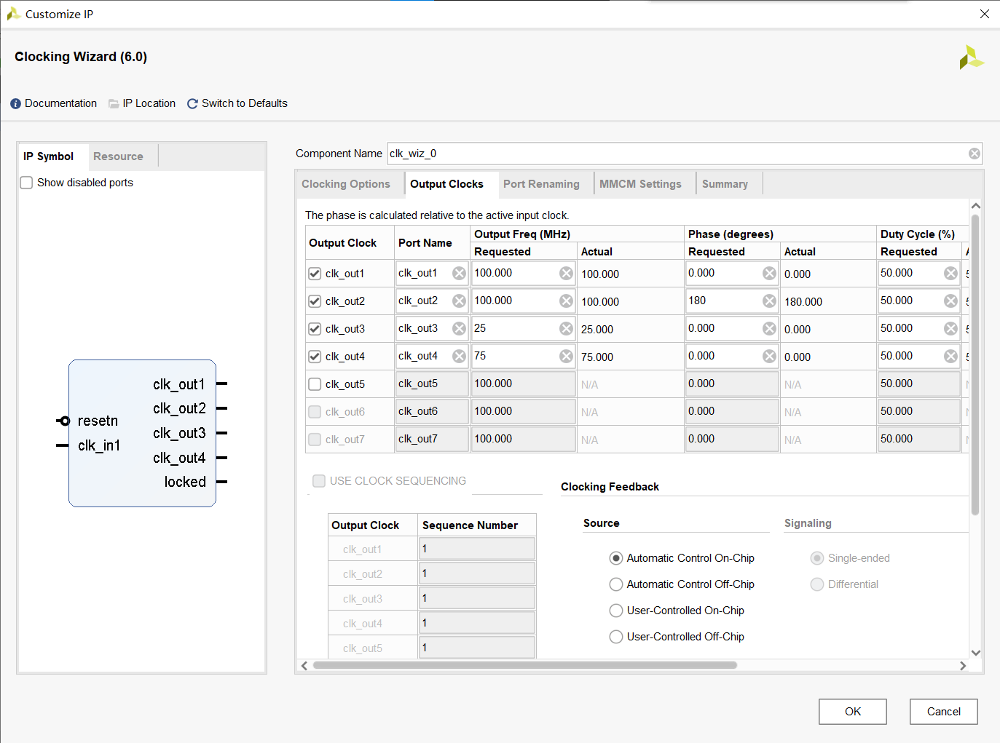

```verilog
`timescale 1ns / 1ps

module ip_clk_wiz(
    input sys_clk,
    input sys_rst_n,
    output  clk_out1,// 100mhz  K14
    output  clk_out2,// 100mhz 180相位    M15
    output  clk_out3,// 25mhz   J14
    output  clk_out4,// 75mhz   L16
    output locked    // k18
    );
    
clk_wiz_0 instance_name(
    // Clock out ports
    .clk_out1(clk_out1),     // output clk_out1
    .clk_out2(clk_out2),     // output clk_out2
    .clk_out3(clk_out3),     // output clk_out3
    .clk_out4(clk_out4),     // output clk_out4
    // Status and control signals
    .resetn(sys_rst_n), // input resetn
    .locked(locked),       // output locked
   // Clock in ports
    .clk_in1(sys_clk)
);      // input clk_in1

endmodule
```

## RAM IP核实验

- 单端口：只有一个端口，不能同时读写

- 伪双端口：一边是写端口，一边是读端口

- 真双端口：两边都可以读写

在IP Catalog中找到Block Memory Generator进行配置。

下面代码实现：

前32个周期写入RAM对应地址的对应数字，后32个周期读出RAM中写入的数据。

```verilog
`timescale 1ns / 1ps

module ip_ram(
    input sys_clk,
    input sys_rst_n
        );

wire ram_en;
wire rw;
wire [4:0] ram_addr;
wire [7:0] ram_wr_data;
wire [7:0] douta;

//RAM读写驱动
ram_rw u_ram_rw(
    .clk             (sys_clk),
    .rst_n           (sys_rst_n),
    .ram_en          (ram_en),
    .rw              (rw),
    .ram_addr        (ram_addr),
    .ram_wr_data     (ram_wr_data)
);

//RAM例化
blk_mem_gen_0 u_blk_mem_gen_0 (
  .clka(sys_clk),    // input wire clka
  .ena(ram_en),      // input wire ena
  .wea(rw),      // input wire [0 : 0] wea
  .addra(ram_addr),  // input wire [4 : 0] addra
  .dina(ram_wr_data),    // input wire [7 : 0] dina
  .douta(douta)  // output wire [7 : 0] douta
);

//ILA测试模块
ila_0 u_ila_0 (
	.clk(sys_clk), // input wire clk


	.probe0(ram_en), // input wire [0:0]  probe0  
	.probe1(rw), // input wire [0:0]  probe1 
	.probe2(ram_addr), // input wire [4:0]  probe2 
	.probe3(ram_wr_data), // input wire [7:0]  probe3 
	.probe4(douta) // input wire [7:0]  probe4
);


endmodule

```

```verilog
`timescale 1ns / 1ps

module ram_rw(
    input            clk,
    input            rst_n,
    output reg       ram_en,      //ram使能
    output reg       rw,          //读写方向控制
    output reg [4:0] ram_addr,      //ram地址
    output reg [7:0] ram_wr_data    //写入ram数据
    );
    
always @(posedge clk or negedge rst_n) begin
    if(!rst_n)
        ram_en <= 1'b0;
    else
        ram_en <= 1'b1;
end

reg [5:0] rw_cnt;   //模64计数器

always @(posedge clk or negedge rst_n) begin
    if(!rst_n)
        rw_cnt <= 6'd0;
    else if(rw_cnt == 6'd63)       //达到上限清零
        rw_cnt <= 6'd0;
    else
        rw_cnt <= rw_cnt + 6'd1;
end

always @(posedge clk or negedge rst_n) begin
    if(!rst_n)
        ram_wr_data <= 8'd0;
    else if(rw_cnt <= 6'd31 && ram_en)  //当计数器小于等于31，ram使能，data加一
        ram_wr_data <= ram_wr_data + 8'd1;
    else
        ram_wr_data <= 8'd0;    //超过31的部分就是在读取，应当归零

end

always @(posedge clk or negedge rst_n) begin
    if(!rst_n)
        rw <= 1'b1;
    else if(rw_cnt <= 6'd31)
        rw <= 1'b1;     //写使能
    else
        rw <= 1'b0;     //读使能
end

always @(posedge clk or negedge rst_n) begin
    if(!rst_n)
        ram_addr <= 5'd0;
    else
        ram_addr <= rw_cnt[4:0];    //地址值为计时器值
end

endmodule

```

## FIFO IP核实验

写模块往fifo中写入数据，写满触发full信号，读模块去读fifo中的数据，读完触发empty信号，再写入，往复循环。

```verilog
`timescale 1ns / 1ps

module ip_fifo(
    input sys_clk,
    input sys_rst_n
    );
    
wire almost_empty;
wire almost_full;
wire fifo_wr_en;
wire [7:0] fifo_wr_data;
wire fifo_rd_en;
wire [7:0] dout;
wire full;
wire empty;
wire [7:0]rd_data_count;
wire [7:0]wr_data_count;

fifo_write u_fifo_write(
    .clk            (sys_clk),
    .rst_n          (sys_rst_n),

    .almost_empty   (almost_empty),
    .almost_full    (almost_full),

    .fifo_wr_en     (fifo_wr_en),
    .fifo_wr_data   (fifo_wr_data)
);

fifo_read u_fifo_read(
    .clk            (sys_clk),
    .rst_n          (sys_rst_n),

    .almost_empty   (almost_empty),
    .almost_full    (almost_full),

    .fifo_rd_en     (fifo_rd_en)
    //.fifo_rd_data   ()
);
    
    
fifo_generator_0 u_fifo_generator_0 (
  .wr_clk(sys_clk),                // input wire wr_clk
  .rd_clk(sys_clk),                // input wire rd_clk
  .din(fifo_wr_data),                      // input wire [7 : 0] din
  .wr_en(fifo_wr_en),                  // input wire wr_en
  .rd_en(fifo_rd_en),                  // input wire rd_en
  .dout(dout),                    // output wire [7 : 0] dout
  .full(full),                    // output wire full
  .almost_full(almost_full),      // output wire almost_full
  .empty(empty),                  // output wire empty
  .almost_empty(almost_empty),    // output wire almost_empty
  .rd_data_count(rd_data_count),  // output wire [7 : 0] rd_data_count
  .wr_data_count(wr_data_count)  // output wire [7 : 0] wr_data_count
);

ila_0 u_ila_0 (
	.clk(sys_clk), // input wire clk


	.probe0(fifo_wr_en), // input wire [0:0]  probe0  
	.probe1(fifo_rd_en), // input wire [0:0]  probe1 
	.probe2(full), // input wire [0:0]  probe2 
	.probe3(almost_full), // input wire [0:0]  probe3 
	.probe4(fifo_wr_data), // input wire [7:0]  probe4 
	.probe5(dout), // input wire [7:0]  probe5 
	.probe6(rd_data_count), // input wire [7:0]  probe6 
	.probe7(wr_data_count), // input wire [7:0]  probe7 
	.probe8(empty), // input wire [0:0]  probe8 
	.probe9(almost_empty) // input wire [0:0]  probe9
);


endmodule

```

```verilog
`timescale 1ns / 1ps

module fifo_write(
    input           clk,
    input           rst_n,

    input           almost_empty,
    input           almost_full,

    output reg      fifo_wr_en,
    output reg [7:0]fifo_wr_data
    );

reg almost_empty_now;
reg almost_empty_last;
wire pose_flag;

reg [1:0] state;    //状态机
reg [3:0] dly_cnt;  //延时寄存器


//检测上升沿模块
assign pose_flag = (~almost_empty_last & almost_empty_now);

always @(posedge clk or negedge rst_n) begin
    if(!rst_n)begin
        almost_empty_now <= 1'b0;
        almost_empty_last <= 1'b0;
    end
    else begin
        almost_empty_now <= almost_empty;       //保存当前值
        almost_empty_last <= almost_empty_now;  //保存上次的值
    end
end

//写模块
always @(posedge clk or negedge rst_n) begin
    if(!rst_n)begin //复位全部清空
        fifo_wr_en <= 1'b0;
        fifo_wr_data <= 8'b0;
        state <= 2'd0;
        dly_cnt <= 4'b0;
    end
    else begin  
        case (state)
            2'd0:begin      //0状态：起始
                if(pose_flag)
                    state <= 2'd1;  //当检测到上升沿时，跳到1状态
                else
                    state <= state; //没有检测到上升沿，保持0状态
            end
            2'd1:begin      //1状态：保持10个周期，确保fifo可写
                if(dly_cnt == 4'd10)begin   //如果到达10个周期进入2状态
                    dly_cnt <= 4'd0;
                    state <= 2'd2;
                    fifo_wr_en <= 1'b1;    //写使能
                end
                else
                    dly_cnt <= dly_cnt + 4'd1;  //否则加一数值
            end 
            2'd2:begin
                if(almost_full)begin        //如果写满了
                    fifo_wr_en <= 1'b0;     //写使能失效
                    fifo_wr_data <= 8'b0;
                    state <= 2'd0;          //返回0状态
                end
                else
                    fifo_wr_en <= 1'b1;
                    fifo_wr_data <= fifo_wr_data + 8'd1;    //加一并且写入数值
            end
            default: 
                state <= 2'd0;
        endcase
    end
end

endmodule

```

```verilog
`timescale 1ns / 1ps

module fifo_read(
    input           clk,
    input           rst_n,

    input           almost_empty,
    input           almost_full,

    output reg      fifo_rd_en
    //input [7:0]     fifo_rd_data
    );

reg almost_full_now;
reg almost_full_last;
wire pose_flag;

reg [1:0] state;    //状态机
reg [3:0] dly_cnt;  //延时寄存器

assign pose_flag = (~almost_full_last & almost_full_now);

always @(posedge clk or negedge rst_n) begin
    if(!rst_n)begin
        almost_full_now <= 1'b0;
        almost_full_last <= 1'b0;
    end
    else begin
        almost_full_now <= almost_full;
        almost_full_last <= almost_full_now;
    end
end

always @(posedge clk or negedge rst_n) begin
    if(!rst_n)begin
        fifo_rd_en <= 1'b0;
        state <= 2'd0;
        dly_cnt <= 4'b0;
    end
    else begin  
        case (state)
            2'd0:begin
                if(pose_flag)
                    state <= 2'd1;
                else
                    state <= state;
            end
            2'd1:begin
                if(dly_cnt == 4'd10)begin
                    dly_cnt <= 4'd0;
                    state <= 2'd2;
                end
                else
                    dly_cnt <= dly_cnt + 4'd1;
            end 
            2'd2:begin
                if(almost_empty)begin
                    fifo_rd_en <= 1'b0;
                    state <= 2'd0;
                end
                else
                    fifo_rd_en <= 1'b1;
            end
            default: 
                state <= 2'd0;
        endcase
    end
end

endmodule

```

## UART串口实验

如果波特率为115200，相当于1个bit需要8.68us，PL部分时钟为50mhz，所以一个bit需要保持434个周期。

为什么会使用已经寄存两拍（打两拍）的值呢？

将亚稳态的概率降低，让信号稳定。因为数字电路具有再生性，通过插入多级缓冲器，将不确定信号再生到标准的0和1信号。

[(33条消息) 关于异步FIFO读写指针同步的理解（打两拍）_异步fifo为什么要打两拍_pp麻了的博客-CSDN博客](https://blog.csdn.net/weixin_46029080/article/details/123867610)

[(33条消息) FPGA 串口收发_fpga串口收发_学术萌新的博客-CSDN博客](https://blog.csdn.net/weixin_43506155/article/details/118278421)

<font color=red>Tips:</font> 在进行PL串口实验的时候，切记要将跳线帽跟换到PL端！！

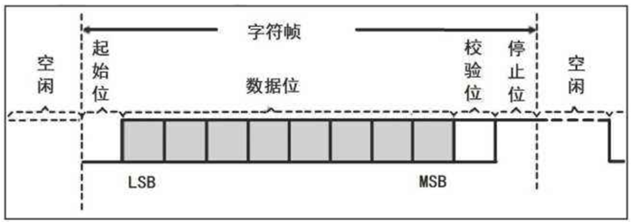

```verilog
module uart_loopback_top (
    input               sys_clk,
    input               sys_rst_n,

    input               uart_rxd,
    output              uart_txd
);

wire uart_en;
wire [7:0]uart_din;
wire [7:0]uart_data;
wire uart_done;
wire uart_tx_busy;

//parameter define
parameter  CLK_FREQ = 50000000;         //定义系统时钟频率
parameter  UART_BPS = 115200;           //定义串口波特率

uart_recv  #(                          
    .CLK_FREQ       (CLK_FREQ),         //设置系统时钟频率
    .UART_BPS       (UART_BPS))         //设置串口接收波特率
u_uart_recv
(
    .sys_clk        (sys_clk),
    .sys_rst_n      (sys_rst_n),
    .uart_rxd       (uart_rxd),
    .uart_data      (uart_data),
    .uart_done      (uart_done)
);

uart_send #(                          
    .CLK_FREQ       (CLK_FREQ),         //设置系统时钟频率
    .UART_BPS       (UART_BPS))         //设置串口接收波特率
u_uart_send(
    .sys_clk        (sys_clk),
    .sys_rst_n      (sys_rst_n),
    .uart_en        (uart_en),
    .uart_din       (uart_din),
    .uart_txd       (uart_txd),
    .uart_tx_busy   (uart_tx_busy)
);

uart_loop u_uart_loop(
    .sys_clk        (sys_clk),
    .sys_rst_n      (sys_rst_n),
    .recv_done      (uart_done),
    .recv_data      (uart_data),
    .tx_busy        (uart_tx_busy),
    .send_en        (uart_en),
    .send_data      (uart_din)
);
    
endmodule
```

```verilog
module uart_recv(
    input               sys_clk,
    input               sys_rst_n,

    input               uart_rxd,
    output reg [7:0]    uart_data,
    output reg          uart_done
);

reg uart_rxd_now;
reg uart_rxd_last;
wire start_flag;

reg rx_flag;
reg [3:0]rx_cnt;          //接收的bit数
reg [15:0]clk_cnt;        //周期数

reg [7:0]rx_data;

parameter CLK_FREQ = 50000000;
parameter UART_BPS = 115200;
parameter BPS_CNT = CLK_FREQ/UART_BPS;

//抓取下降沿
assign start_flag = ~uart_rxd_now & uart_rxd_last;

always @(posedge sys_clk or negedge sys_rst_n) begin
    if(!sys_rst_n)begin
        uart_rxd_now <= 1'd0;
        uart_rxd_last <= 1'd0;
    end
    else begin
        uart_rxd_now <= uart_rxd;
        uart_rxd_last <= uart_rxd_now;
    end 
end

//rx_flag
always @(posedge sys_clk or negedge sys_rst_n) begin
    if(!sys_rst_n)
        rx_flag <= 1'd0;
    else begin
        if(start_flag)  //start_flag置1时开始接收
            rx_flag <= 1'd1;
        else if(rx_cnt == 4'd9 && clk_cnt == BPS_CNT/2)//当接收完最后一位后将rx_flag归零
            rx_flag <= 1'd0;
        else            //都不满足，保持不动
            rx_flag <= rx_flag;
    end
end

//clk_cnt
always @(posedge sys_clk or negedge sys_rst_n) begin
    if(!sys_rst_n)
        clk_cnt <= 16'd0;
    else if(rx_flag)begin
        if(clk_cnt == BPS_CNT-1)  //如果达到最大周期数，清零
            clk_cnt <= 16'd0;
        else
            clk_cnt <= clk_cnt + 16'd1;
    end
    else
        clk_cnt <= 16'd0;
end

//rx_cnt
always @(posedge sys_clk or negedge sys_rst_n) begin
    if(!sys_rst_n)
        rx_cnt <= 4'd0;
    else if(rx_flag)begin
        if(clk_cnt == BPS_CNT-1)    //当数到最大周期时，rx_cnt加一
            rx_cnt <= rx_cnt + 4'd1;
        else
            rx_cnt <= rx_cnt;
    end
    else
        rx_cnt <= 4'd0;
end

//rx_data
always @(posedge sys_clk or negedge sys_rst_n) begin
    if(!sys_rst_n)
        rx_data <= 8'd0;
    else if(rx_flag)begin
        if(clk_cnt == BPS_CNT/2)begin   //中间值采样
            case (rx_cnt)
                4'd1: rx_data[0] <= uart_rxd_last;  //使用寄存过两次的值
                4'd2: rx_data[1] <= uart_rxd_last;
                4'd3: rx_data[2] <= uart_rxd_last;
                4'd4: rx_data[3] <= uart_rxd_last;
                4'd5: rx_data[4] <= uart_rxd_last;
                4'd6: rx_data[5] <= uart_rxd_last;
                4'd7: rx_data[6] <= uart_rxd_last;
                4'd8: rx_data[7] <= uart_rxd_last;
                default: ;
            endcase
        end
        else    //rx_flag置1，保持rx_data不动
            rx_data <= rx_data;
    end
    else
        rx_data <= 8'd0;
end

//uart_data 和 uart_done
always @(posedge sys_clk or negedge sys_rst_n) begin
    if(!sys_rst_n)begin
        uart_data <= 8'd0;
        uart_done <= 1'b0;
    end
    else if(rx_cnt == 4'd9)begin    //一帧接收完毕
        uart_data <= rx_data;       //数据传到uart_data中
        uart_done <= 1'b1;          //接收完成标志置1
    end
    else begin
        uart_data <= 8'd0;
        uart_done <= 1'b0;
    end
end      


endmodule
```

```verilog
module uart_send (
    input               sys_clk,
    input               sys_rst_n,

    input               uart_en,     //发送使能
    input [7:0]         uart_din,    //需要发送的数据
    output   reg        uart_txd,    //发送线
    output              uart_tx_busy //发送正忙

);

reg uart_en_now;
reg uart_en_last;
wire en_flag;

reg tx_flag;
reg [7:0]tx_data;         //临时数据寄存器
reg [3:0]tx_cnt;
reg [15:0]clk_cnt;        //周期数

parameter CLK_FREQ = 50000000;
parameter UART_BPS = 115200;
parameter BPS_CNT = CLK_FREQ/UART_BPS;

assign uart_tx_busy = tx_flag;

//抓取上升沿
assign en_flag = uart_en_now & ~uart_en_last;

always @(posedge sys_clk or negedge sys_rst_n) begin
    if(!sys_rst_n)begin
        uart_en_now <= 1'd0;
        uart_en_last <= 1'd0;
    end
    else begin
        uart_en_now <= uart_en;
        uart_en_last <= uart_en_now;
    end 
end

//tx_flag 和 tx_data
always @(posedge sys_clk or negedge sys_rst_n) begin
    if(!sys_rst_n)begin
        tx_flag <= 1'd0;
        tx_data <= 8'd0;
    end
    else if(en_flag)begin
        tx_flag <= 1'd1;
        tx_data <= uart_din;
    end
    else if(tx_cnt == 4'd9 && (clk_cnt == BPS_CNT -(BPS_CNT/16)))begin    //当发送完成时恢复
        tx_flag <= 1'd0;
        tx_data <= 8'd0;
    end
    else begin  //发送中保持不变
        tx_flag <= tx_flag;
        tx_data <= tx_data;
    end
end

//clk_cnt
always @(posedge sys_clk or negedge sys_rst_n) begin
    if(!sys_rst_n)
        clk_cnt <= 16'd0;
    else if(tx_flag)begin
        if(clk_cnt == BPS_CNT-1)  //如果达到最大周期数，清零
            clk_cnt <= 16'd0;
        else
            clk_cnt <= clk_cnt + 16'd1;
    end
    else
        clk_cnt <= 16'd0;
end

//tx_cnt
always @(posedge sys_clk or negedge sys_rst_n) begin
    if(!sys_rst_n)
        tx_cnt <= 4'd0;
    else if(tx_flag)begin
        if(clk_cnt == BPS_CNT-1)    //当数到最大周期时，tx_cnt加一
            tx_cnt <= tx_cnt + 4'd1;
        else
            tx_cnt <= tx_cnt;
    end
    else
        tx_cnt <= 4'd0;
end

always @(posedge sys_clk or negedge sys_rst_n) begin
    if(!sys_rst_n)
        uart_txd <= 1'd1;
    else if(tx_flag)begin
        case (tx_cnt)
            4'd0: uart_txd <= 1'd0;         //起始位，下降沿
            4'd1: uart_txd <= tx_data[0];   
            4'd2: uart_txd <= tx_data[1];
            4'd3: uart_txd <= tx_data[2];
            4'd4: uart_txd <= tx_data[3];
            4'd5: uart_txd <= tx_data[4];
            4'd6: uart_txd <= tx_data[5];
            4'd7: uart_txd <= tx_data[6];
            4'd8: uart_txd <= tx_data[7];
            4'd9: uart_txd <= 1'd1;         //表示发送完成
            default: ;
        endcase
    end
    else
        uart_txd <= 1'd1;
end

endmodule
```

```verilog
module uart_loop (
    input               sys_clk,
    input               sys_rst_n,

    input               recv_done,
    input     [7:0]     recv_data,  

    input               tx_busy,
    output reg          send_en,
    output reg [7:0]    send_data  
);


reg recv_done_now;
reg recv_done_last;
wire recv_done_flag;

reg tx_ready;       //准备发送标志

//抓取上升沿
assign recv_done_flag = recv_done_now & ~recv_done_last;

always @(posedge sys_clk or negedge sys_rst_n) begin
    if(!sys_rst_n)begin
        recv_done_now <= 1'd0;
        recv_done_last <= 1'd0;
    end
    else begin
        recv_done_now <= recv_done;
        recv_done_last <= recv_done_now;
    end 
end

//数据接收和发送
always @(posedge sys_clk or negedge sys_rst_n) begin
    if(!sys_rst_n)begin
        send_en <= 1'd0;
        send_data <= 8'd0;
        tx_ready <= 1'b0;
    end
    else begin
        if(recv_done_flag) begin //如果接收完成标志置1
            tx_ready <= 1'd1;
            send_data <= recv_data;     //数据挂载
            send_en <= 1'd0;
        end
        else if(~tx_busy && tx_ready) begin //如果发送不忙并且准备发送
            tx_ready <= 1'd0;
            send_en <= 1'd1;
        end
    end
end
    
endmodule
```

```verilog
`timescale 1ns / 1ps

module tb_uart_loopback_top();

reg sys_clk;
reg sys_rst_n;
reg uart_rxd;

wire uart_txd;

parameter utime = 1000; //波特率设置为1m

uart_loopback_top u_uart_loopback_top(
    .sys_clk       (sys_clk),
    .sys_rst_n     (sys_rst_n),

    .uart_rxd      (uart_rxd),
    .uart_txd      (uart_txd)
);

initial begin
	sys_clk = 1'b0;
	sys_rst_n = 1'b0;
	#60 sys_rst_n = 1'b1;

    //起始信号
    #100 uart_rxd = 1'b1;
    #utime uart_rxd = 1'b0;

    //8位数据 eb
    #utime uart_rxd = 1'b1;  //1
    #utime uart_rxd = 1'b1;
    #utime uart_rxd = 1'b0;
    #utime uart_rxd = 1'b1;
    
    #utime uart_rxd = 1'b0;
    #utime uart_rxd = 1'b1;
    #utime uart_rxd = 1'b1;
    #utime uart_rxd = 1'b1;

    //停止位
    #utime uart_rxd = 1'b1;
    
    
    //起始信号
    #1000 uart_rxd = 1'b1;
    #utime uart_rxd = 1'b0;

    //8位数据 aa
    #utime uart_rxd = 1'b0;  //1
    #utime uart_rxd = 1'b1;
    #utime uart_rxd = 1'b0;
    #utime uart_rxd = 1'b1;
    
    #utime uart_rxd = 1'b0;
    #utime uart_rxd = 1'b1;
    #utime uart_rxd = 1'b0;
    #utime uart_rxd = 1'b1;

    //停止位
    #utime uart_rxd = 1'b1;

end

always #10 sys_clk=~sys_clk;

endmodule

```

## 频率计实验

[(33条消息) FPGA频率测量的三种方法（直接测量法，间接测量法，等精度测量法）_fpga频率测量的三种方法(直接测量法,间接测量法,等精度测量法)_孤独的单刀的博客-CSDN博客](https://blog.csdn.net/wuzhikaidetb/article/details/112326945)

- 直接测量法适合测量高频信号；频率越高、测量时间越长，测量结果越精准；
- 间接测量法适合测量低频信号，但测量精度取决于自身频率；
- 等精度测量法相对误差与被测信号频率的大小无关，仅与闸门时间和基准时钟频率有关，即实现了整个测试频段的等精度测量。闸门时间越长，基准时钟频率越高，测频的相对误差就越小。


# PS(裸机)

## ZYNQ裸机开发流程

- 创建Vivado工程
- 使用IP Processor创建Processor System
- 生成顶层HDL
- 生成比特流导出到SDK（不使用FPGA就不用生成比特流）
- 在SDK中创建应用工程
- 板级验证

## ZYNQ最小系统

最小系统只需要ARM Cortex-A9加上DDR3和UART即可，不需要PL部分。

## 软件操作

在IP INTEGRATOR下中创建或者打开IP核，生成的文件后缀为.bd

### 配置外设

在DDR configuration中Memory Part选择需要更改。7010核心板选择MT41J128M16HA-125;7020核心板选择MT41J256M16RE-125

配置UART在peripheral I/O Pins中，根据板子的原理图选择对应的管脚，启明星是MIO14和15。

在PS-PL configuration中的General中配置串口的波特率

Bank500是bank0，Bank501是bank1，根据原理图选择IO电平

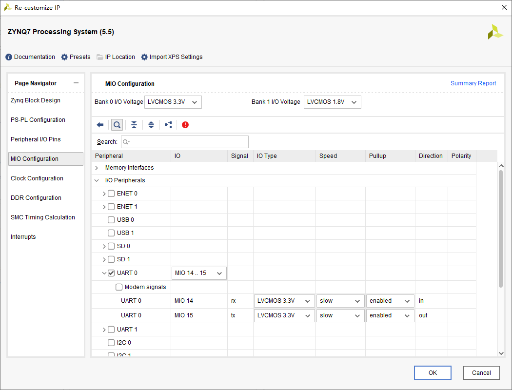

### 去掉不需要的接口

- 在PS-PL configuration中的AXI Non Secure Enavlement中的AXI GP0 interface，取消选择。

- 在Clock Configuration中的PL Fabric Clocks中关闭FCLK_CLK0

- 在PS-PL configuration中的General中的Enable Clock Resets关闭

### Run block Automation

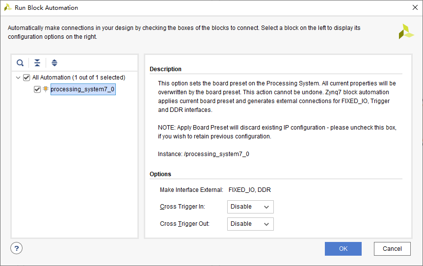

按F6或者菜单栏上的检查按钮，检查设计是否有误。

### 生成IP核

在.bd文件上右键选择Generate Output Products

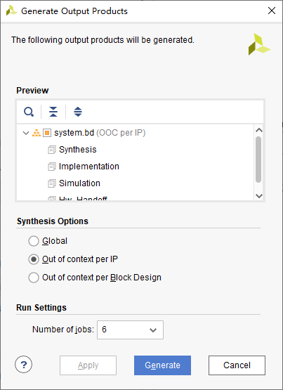

### 生成顶层HDL包装

在.bd文件上右键选择Create HDL Wrapper

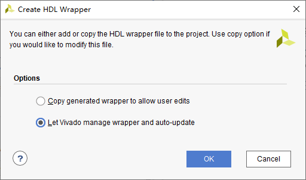

### 导出硬件

在菜单栏File->Export Hardware，可以选择是否包含比特流

### 启动SDK

在菜单栏File->Launch SDK

### 在SDK中创建工程

在SDK菜单栏File->New->Application Project

### SDK烧录程序

编译之后，在工程目录下Binaries下的.elf文件右键，选择Run As->Launch on Hardware

==如果使用用了PL资源，都需要在烧录PS之前，烧写PL部分==（SDK->Xilink->Program FPGA）

## GPIO

[FPGA学习日记（九）ZYNQ的GPIO—MIO接口控制_fpga mio_青雨qy的博客-CSDN博客](https://blog.csdn.net/weixin_45299680/article/details/108676984)

MIO 复用IO，全部都在PS端，分为Bank0和Bank1（54个）

EMIO 也是 PS 的资源，它接到了 PL 端，由 PL 端输出信号，分为Bank2和Bank3（64个）

### MIO
#### MIO的寄存器

DATA_RO用来反映GPIO连接器件引脚的状态；

DATA为32位，需要在一个周期进行写设置，当GPIO被设置为输出时，寄存器可以控制输出的数值；

MASK_DATA_LSW（16bit）屏蔽DATA低16位,MASK_DATA_MSW（16bit）屏蔽DATA高16位；

DIRM：控制引脚作为输入还是输出（1，使能输出驱动；0，关闭输出驱动）。

OEN: output  enable，当IO被配置成输出时，该寄存器用于打开（1）和关闭（0）输出寄存器使能。(当DIRM与OEN同时为1时，引脚为输出)

DIRM与OEN同时为1时，GPIO设置为输出状态。

#### MIO[8:7]可以作为输出使用

在系统复位的时候作为VMODE引脚（输入），配置MIO Bank电压。复位完成后，**MIO[8:7]只能做输出使用**

#### MIO点亮LED

```c
//三个LED每隔1s亮灭
#include <stdio.h>
#include "xparameters.h"
#include "xgpiops.h"
#include "xstatus.h"
#include "xplatform_info.h"
#include <xil_printf.h>
#include "sleep.h"


#define GPIO_DEVICE_ID  	XPAR_XGPIOPS_0_DEVICE_ID

#define GPIO_MIO_LED0		0
#define GPIO_MIO_LED7		7
#define GPIO_MIO_LED8		8

XGpioPs Gpio;
XGpioPs_Config *ConfigPtr;
int Status;

int main()
{
	printf("GPIO MIO TEST\r\n");

	//初始化GPIO的驱动

	//根据设备ID,查找器件配置信息
	ConfigPtr = XGpioPs_LookupConfig(GPIO_DEVICE_ID);
	//初始化GPIO驱动
	Status = XGpioPs_CfgInitialize(&Gpio, ConfigPtr,
					ConfigPtr->BaseAddr);
	if (Status != XST_SUCCESS) {
		return XST_FAILURE;
	}
	//把GPIO设置为输出模式
	XGpioPs_SetDirectionPin(&Gpio,GPIO_MIO_LED0,1);
	XGpioPs_SetDirectionPin(&Gpio,GPIO_MIO_LED7,1);
	XGpioPs_SetDirectionPin(&Gpio,GPIO_MIO_LED8,1);

	//设置输出使能
	XGpioPs_SetOutputEnablePin(&Gpio,GPIO_MIO_LED0,1);
	XGpioPs_SetOutputEnablePin(&Gpio,GPIO_MIO_LED7,1);
	XGpioPs_SetOutputEnablePin(&Gpio,GPIO_MIO_LED8,1);

	while(1)
	{
		//写数据1到GPIO的引脚
		XGpioPs_WritePin(&Gpio,GPIO_MIO_LED0,1);
		XGpioPs_WritePin(&Gpio,GPIO_MIO_LED7,1);
		XGpioPs_WritePin(&Gpio,GPIO_MIO_LED8,1);

		//延时1s
		sleep(1);

		//写数据0到GPIO的引脚
		XGpioPs_WritePin(&Gpio,GPIO_MIO_LED0,0);
		XGpioPs_WritePin(&Gpio,GPIO_MIO_LED7,0);
		XGpioPs_WritePin(&Gpio,GPIO_MIO_LED8,0);

		//延时1s
		sleep(1);
	}

	return 0;
}
```

#### MIO按键中断控制LED

中断ID表

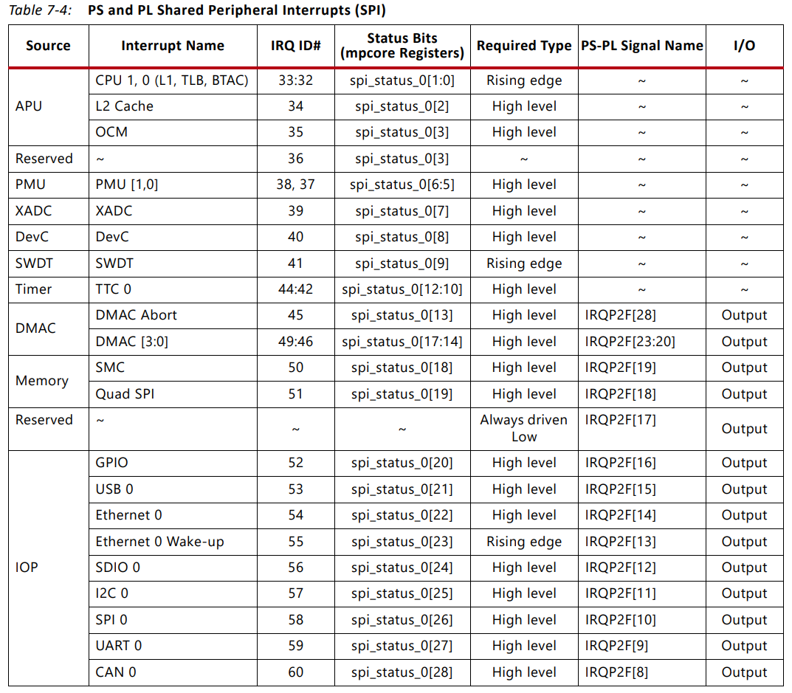

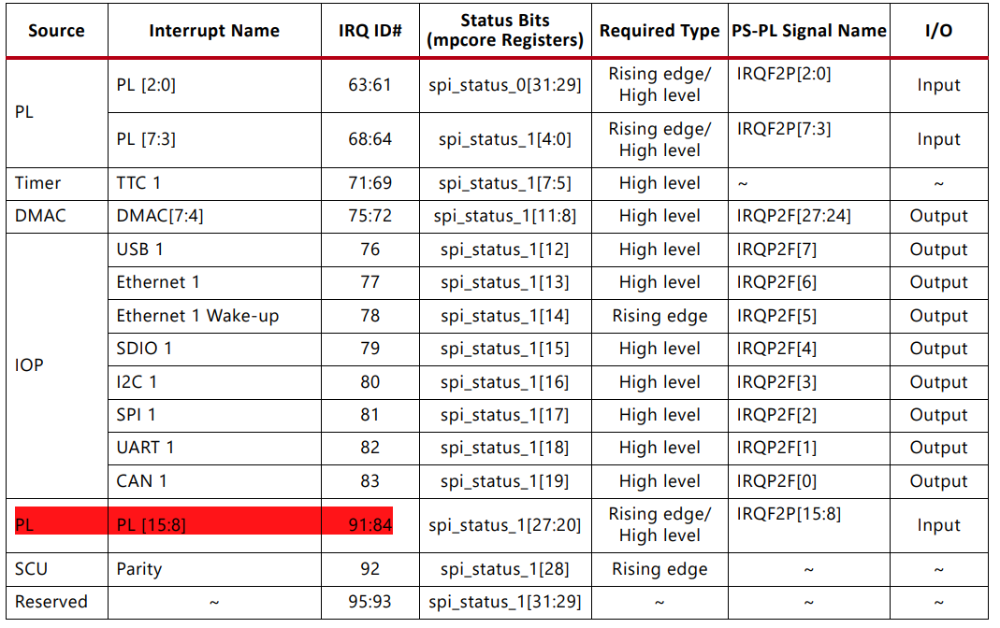

> 中断多次触发的原因查看**常见问题**中。

```c
//按键中断控制LED亮灭
#include <stdio.h>
#include "xparameters.h"
#include "xgpiops.h"
#include "xscugic.h"
#include "xstatus.h"
#include "xplatform_info.h"
#include <xil_printf.h>
#include "sleep.h"

//设备ID
#define GPIO_DEVICE_ID  	XPAR_XGPIOPS_0_DEVICE_ID
#define INTC_DEVICE_ID		XPAR_SCUGIC_SINGLE_DEVICE_ID

//GPIO中断ID #52
#define GPIO_INTERRUPT_ID	XPAR_XGPIOPS_0_INTR

#define GPIO_MIO_LED		8
#define GPIO_MIO_KEY		12

int SetupInterruptSystem(XScuGic *GicInstancePtr, XGpioPs *Gpio, u16 GpioIntrId);
void IntrHandler(void *CallBackRef);

XGpioPs Gpio; //GPIO实例
XGpioPs_Config *ConfigPtr;

XScuGic Intc; //中断控制器实例
XScuGic_Config *IntcConfig;

u8 flag;
u8 LED_value;
static u8 i = 1;

int main()
{
	printf("GPIO MIO TEST\r\n");

	//初始化GPIO的驱动

	//根据设备ID,查找器件配置信息
	ConfigPtr = XGpioPs_LookupConfig(GPIO_DEVICE_ID);

	//初始化GPIO驱动
	XGpioPs_CfgInitialize(&Gpio, ConfigPtr,
					ConfigPtr->BaseAddr);

	//把GPIO设置为输出模式
	XGpioPs_SetDirectionPin(&Gpio,GPIO_MIO_LED,1);

	//设置输出使能
	XGpioPs_SetOutputEnablePin(&Gpio,GPIO_MIO_LED,1);

	//设置按键为输入模式
	XGpioPs_SetDirectionPin(&Gpio,GPIO_MIO_KEY,0);

	//配置中断
	SetupInterruptSystem(&Intc, &Gpio, GPIO_INTERRUPT_ID);

	while(1)
	{
		if(flag)
		{
			//按键消抖
			usleep(200000);

			//LED状态取反
			LED_value = ~ LED_value;

			//为LED写入值
			XGpioPs_WritePin(&Gpio,GPIO_MIO_LED,LED_value);

			//清除中断状态
			XGpioPs_IntrClearPin(&Gpio, GPIO_MIO_KEY);      //清除按键KEY中断

			//使能MIO引脚中断
			XGpioPs_IntrEnablePin(&Gpio,GPIO_MIO_KEY);

			flag = 0;
		}
	}

	return 0;
}

int SetupInterruptSystem(XScuGic *GicInstancePtr, XGpioPs *Gpio,
				u16 GpioIntrId)
{
	int Status;

	//查找GIC器件配置信息，并进行初始化
	IntcConfig = XScuGic_LookupConfig(INTC_DEVICE_ID);
	if (NULL == IntcConfig) {
		return XST_FAILURE;
	}
	Status = XScuGic_CfgInitialize(GicInstancePtr, IntcConfig,
					IntcConfig->CpuBaseAddress);
	if (Status != XST_SUCCESS) {
		return XST_FAILURE;
	}

	//初始化ARM处理器异常句柄
	Xil_ExceptionInit();
	//给IRQ异常注册处理程序
	Xil_ExceptionRegisterHandler(XIL_EXCEPTION_ID_INT,
				(Xil_ExceptionHandler)XScuGic_InterruptHandler,
				GicInstancePtr);
	//使能处理器的中断
	Xil_ExceptionEnableMask(XIL_EXCEPTION_IRQ);

	//关联中断处理函数
	Status = XScuGic_Connect(GicInstancePtr, GpioIntrId,
				(Xil_ExceptionHandler)IntrHandler,
				(void *)Gpio);
	if (Status != XST_SUCCESS) {
		return Status;
	}
	//为GPIO器件使能中断
	XScuGic_Enable(GicInstancePtr, GpioIntrId);

	//设置MIO引脚中断类型，下降沿
	XGpioPs_SetIntrTypePin(Gpio, GPIO_MIO_KEY, XGPIOPS_IRQ_TYPE_EDGE_FALLING);

	/* Set the handler for gpio interrupts. */
	//XGpioPs_SetCallbackHandler(Gpio, (void *)Gpio, (XGpioPs_Handler)IntrHandler);

	//打开MIO引脚中断使能信号
	XGpioPs_IntrEnablePin(Gpio, GPIO_MIO_KEY);

	return XST_SUCCESS;
}

void IntrHandler(void *CallBackRef)
{
	XGpioPs *Gpio = (XGpioPs *)CallBackRef;

	//读取MIO引脚的中断状态
	if (XGpioPs_IntrGetStatusPin(Gpio, GPIO_MIO_KEY))
	{
		printf("interrupt %d!\r\n", i++ );

		//标志位置1
		flag = 1;

		//关闭MIO引脚的中断
		XGpioPs_IntrDisablePin(Gpio, GPIO_MIO_KEY);
	}
}


```

### EMIO

#### EMIO拓展按键控制LED

1. 在IP核设置里面激活EMIO，同时在图上GPIO_0上右键，make external，生成端口。可以修改端口名。
2. 需要根据原理图为EMIO配置管脚，不然会报错。
3. 生成比特流，重新将硬件系统导入到SDK（注意要勾选包含比特流）。

    

    

由EMIO拓展的IO在SDK的Pin号从54到117。

==用到PL资源的工程，都需要在烧录PS之前，烧写PL部分==（SDK->Xilink->Program FPGA）。烧写完成后PL的LED会点亮。

```c
//PL按键控制核心板的LED  PS按键控制底板PS的LED
#include <stdio.h>
#include "xparameters.h"
#include "xgpiops.h"
#include "xstatus.h"
#include "xplatform_info.h"
#include <xil_printf.h>
#include "sleep.h"

//设备ID
#define GPIO_DEVICE_ID  	XPAR_XGPIOPS_0_DEVICE_ID

//配置LED管脚
#define GPIO_MIO_LED0		0
#define GPIO_MIO_PSLED0		7

//配置按键管脚
#define GPIO_MIO_PSKEY0		12
#define GPIO_EMIO_PLKEY0	54

XGpioPs Gpio;
XGpioPs_Config *ConfigPtr;
int Status;
int KeyvaluePL = 0;
int KeyvaluePS = 0;

int main()
{
	printf("GPIO EMIO TEST\r\n");

	//初始化GPIO的驱动

	//根据设备ID,查找器件配置信息
	ConfigPtr = XGpioPs_LookupConfig(GPIO_DEVICE_ID);
	//初始化GPIO驱动
	Status = XGpioPs_CfgInitialize(&Gpio, ConfigPtr,
					ConfigPtr->BaseAddr);
	if (Status != XST_SUCCESS) {
		return XST_FAILURE;
	}
	//把GPIO设置为输出模式
	XGpioPs_SetDirectionPin(&Gpio,GPIO_MIO_LED0,1);
	XGpioPs_SetDirectionPin(&Gpio,GPIO_MIO_PSLED0,1);

	//设置输出使能
	XGpioPs_SetOutputEnablePin(&Gpio,GPIO_MIO_LED0,1);
	XGpioPs_SetOutputEnablePin(&Gpio,GPIO_MIO_PSLED0,1);

	//按键GPIO设置为输入模式
	XGpioPs_SetDirectionPin(&Gpio,GPIO_MIO_PSKEY0,0);
	XGpioPs_SetDirectionPin(&Gpio,GPIO_EMIO_PLKEY0,0);

	//默认LED熄灭
	XGpioPs_WritePin(&Gpio,GPIO_MIO_LED0,0);
	XGpioPs_WritePin(&Gpio,GPIO_MIO_PSLED0,0);

	while(1)
	{
		//PL按键控制核心板的LED
		KeyvaluePL = XGpioPs_ReadPin(&Gpio,GPIO_EMIO_PLKEY0);
		XGpioPs_WritePin(&Gpio,GPIO_MIO_LED0,~KeyvaluePL);

		//PS按键控制底板PS的LED
		KeyvaluePS = XGpioPs_ReadPin(&Gpio,GPIO_MIO_PSKEY0);
		XGpioPs_WritePin(&Gpio,GPIO_MIO_PSLED0,~KeyvaluePS);
	}

	return 0;
}

```

### AXI GPIO

软核IP 

AXI接口分为AXI_ACP、AXI_HP、AXI_GP

#### AXI GPIO IP核中断控制LED

通过调用AXI GPIO IO核，使用中断机制，实现底板PL端按键控制核心板PS的LED

三态缓冲器控制GPIO的输入输出方向。

在AXI GPIO的配置界面中：

- Tri State Value 的值配置方向，其中1代表输入，0代表输出。

- Output Value 的值配置初始值

- 勾选Enable interrupt才能使用中断

**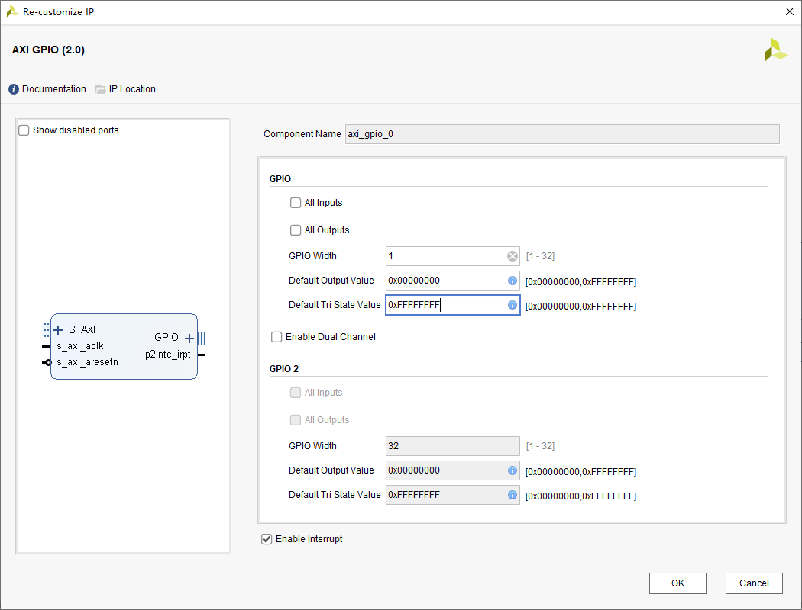**

在ZYNQ核中也要开启相应的PL到PS的中断模块，这样才能连接PL和PS的中断

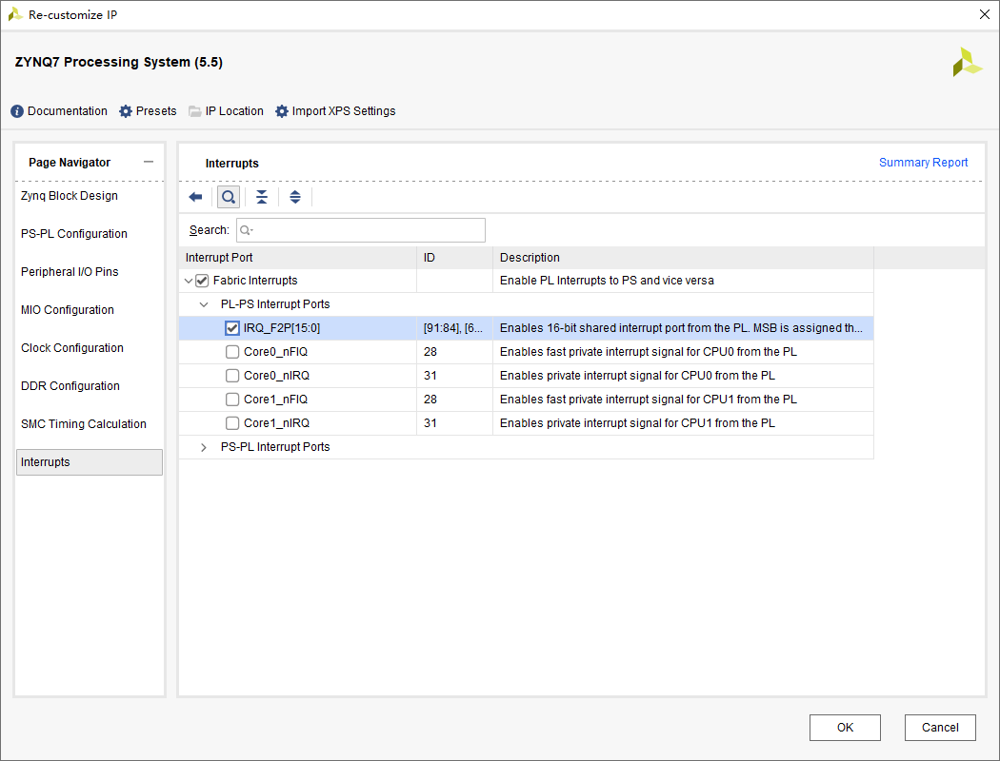

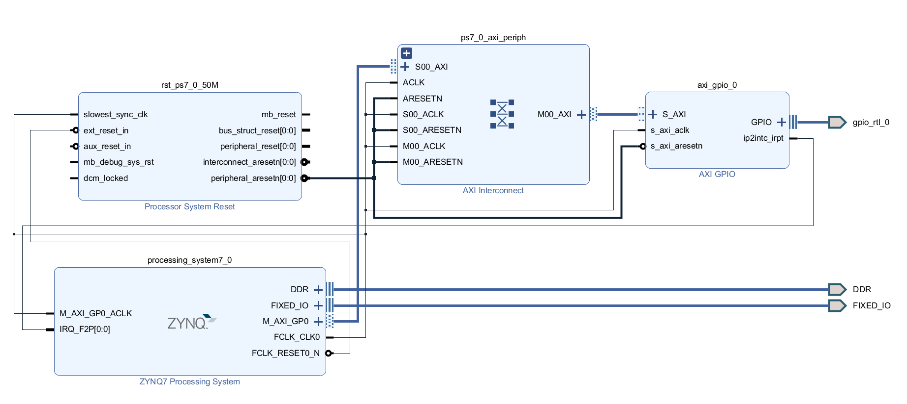

该实验原理图生成如上所示。

```c
#include <stdio.h>
#include "xparameters.h"
#include "xgpiops.h"
#include "xgpio.h"
#include "xscugic.h"
#include "xstatus.h"
#include "xplatform_info.h"
#include <xil_printf.h>
#include "sleep.h"

//设备ID
#define GPIO_DEVICE_ID  	XPAR_XGPIOPS_0_DEVICE_ID
#define INTC_DEVICE_ID		XPAR_SCUGIC_SINGLE_DEVICE_ID
#define AXI_GPIO_DEVICE_ID  XPAR_GPIO_0_DEVICE_ID

//AXIGPIO中断ID #61
#define AXI_GPIO_INTERRUPT_ID	XPAR_FABRIC_AXI_GPIO_0_IP2INTC_IRPT_INTR

//核心板PS的LED
#define GPIO_MIO_LED		8

//AXI GPIO通道1
#define GPIO_CHANNEL1		1

int SetupInterruptSystem(XScuGic *GicInstancePtr, XGpio *AXI_Gpio, u16 AXI_GpioIntrId);
void IntrHandler(void *CallBackRef);

XGpioPs Gpio; //GPIO实例
XGpioPs_Config *ConfigPtr;

XScuGic Intc; //中断控制器实例
XScuGic_Config *IntcConfig;

XGpio 	AXI_Gpio; //AXI GPIO实例

u8 flag;
u8 LED_value;
static u8 i = 1;

int main()
{
	printf("AXI GPIO INTERRUPT TEST\r\n");

	//初始化PS端的GPIO
	ConfigPtr = XGpioPs_LookupConfig(GPIO_DEVICE_ID);
	XGpioPs_CfgInitialize(&Gpio, ConfigPtr,
					ConfigPtr->BaseAddr);

	//初始化PL端的AXI GPIO
	XGpio_Initialize(&AXI_Gpio, AXI_GPIO_DEVICE_ID);

	//把PS端的GPIO设置为输出模式，并使能
	XGpioPs_SetDirectionPin(&Gpio,GPIO_MIO_LED,1);
	XGpioPs_SetOutputEnablePin(&Gpio,GPIO_MIO_LED,1);

	//把PL端的AXI GPIO设置为输入模式
	XGpio_SetDataDirection(&AXI_Gpio, GPIO_CHANNEL1, 0x00000001);

	//配置中断
	SetupInterruptSystem(&Intc, &AXI_Gpio, AXI_GPIO_INTERRUPT_ID);

	while(1)
	{
		if(flag)
		{
			//按键消抖
			usleep(20000);

			//判断当前按键状态，如果是按下就改变LED的状态
			if(XGpio_DiscreteRead(&AXI_Gpio, GPIO_CHANNEL1) == 0)
			//LED状态取反
				LED_value = ~ LED_value;

			//为LED写入值
			XGpioPs_WritePin(&Gpio,GPIO_MIO_LED,LED_value);

			//清除中断状态
			XGpio_InterruptClear(&AXI_Gpio, 0x00000001);     //清除按键KEY中断

			//使能AXI GPIO引脚中断
			XGpio_InterruptEnable(&AXI_Gpio, 0x00000001);

			flag = 0;
		}
	}

	return 0;
}

int SetupInterruptSystem(XScuGic *GicInstancePtr, XGpio *AXI_Gpio,
				u16 AXI_GpioIntrId)
{
	int Status;

	//查找GIC器件配置信息，并进行初始化
	IntcConfig = XScuGic_LookupConfig(INTC_DEVICE_ID);
	if (NULL == IntcConfig) {
		return XST_FAILURE;
	}
	Status = XScuGic_CfgInitialize(GicInstancePtr, IntcConfig,
					IntcConfig->CpuBaseAddress);
	if (Status != XST_SUCCESS) {
		return XST_FAILURE;
	}

	//初始化ARM处理器异常句柄
	Xil_ExceptionInit();
	//给IRQ异常注册处理程序
	Xil_ExceptionRegisterHandler(XIL_EXCEPTION_ID_INT,
				(Xil_ExceptionHandler)XScuGic_InterruptHandler,
				GicInstancePtr);
	//使能处理器的中断
	Xil_ExceptionEnableMask(XIL_EXCEPTION_IRQ);

	//关联中断处理函数
	Status = XScuGic_Connect(GicInstancePtr, AXI_GpioIntrId,
				(Xil_ExceptionHandler)IntrHandler,
				(void *)AXI_Gpio);
	if (Status != XST_SUCCESS) {
		return Status;
	}
	//为AXI GPIO器件使能中断
	XScuGic_Enable(GicInstancePtr, AXI_GpioIntrId);

	//中断类型为高有效电平敏感类型
	XScuGic_SetPriorityTriggerType(GicInstancePtr, AXI_GpioIntrId, 0xA0, 0x1);

	//AXI GPIO的中断使能
	XGpio_InterruptGlobalEnable(AXI_Gpio);		  //打开全局中断
	XGpio_InterruptEnable(AXI_Gpio, 0x00000001);  //打开通道对应的中断

	return XST_SUCCESS;
}

void IntrHandler(void *CallBackRef)
{
	XGpio *AXI_Gpio = (XGpio *)CallBackRef;

	//读取AXI GPIO的中断状态
	if (XGpio_InterruptGetStatus(AXI_Gpio))
	{
		printf("interrupt %d!\r\n", i++ );

		//标志位置1
		flag = 1;

		//关闭AXI GPIO的中断
		XGpio_InterruptDisable(AXI_Gpio, 0x00000001); //打开通道对应的中断
	}
}
```

## 自定义IP核


# PS(Linux)


