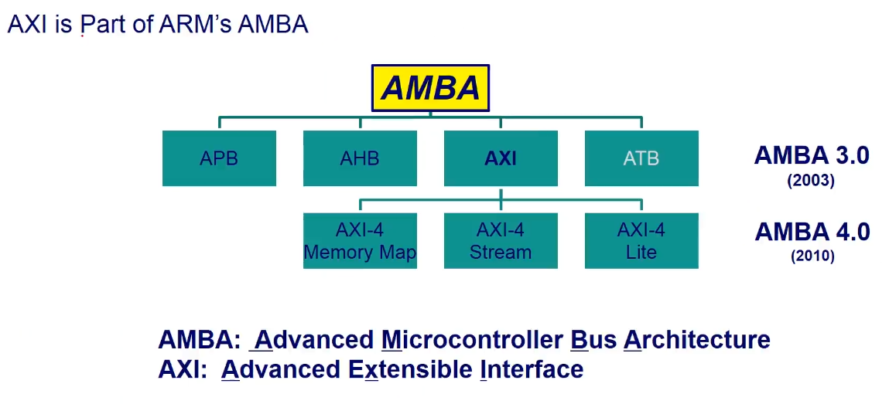
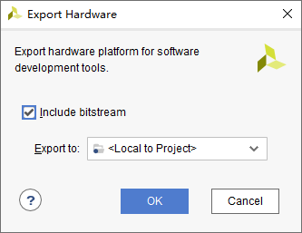

# 软件安装

[vivado2019.2安装+license添加教程_vivado license_原地打转的瑞哥的博客-CSDN博客](https://blog.csdn.net/weixin_47730622/article/details/125623165)

vivado许可证

链接: https://pan.baidu.com/s/1-2QL3MCYhUh-qANEuxVHIQ 提取码: vh3h 

# 一些配置

## 使用无线网卡

1. 插入无线网卡
2. 输入ifconfig -a 找到wlan0设备
3. 输入ifconfig wlan0 up 打开设备
4. 输入iwlist wlan0 scan 扫描附近的WiFi
5. 关闭PS网口 ifconfig eth0 down
6. 连接WiFi /opt/hardwareTest/usb_wifi_setup.sh WiFi名称 密码 wlan0
7. 测试 ping -I wlan0 -c 10 www.baidu.com

# 常见问题

- 启动模式选择

| BOOT_CFG |  1   |  2   |
| :------: | :--: | :--: |
|   JTAG   |  ON  |  ON  |
|   NAND   | OFF  |  ON  |
|   QSPI   |  ON  | OFF  |
| SD Card  | OFF  | OFF  |

- 在写程序的时候遇到了中断会触发多次的问题，解决方法如下。

    [zynq中断之gpio中断，emio按键中断详解（解决重复中断）_卡ka罗特的博客-CSDN博客](https://blog.csdn.net/weixin_42628470/article/details/106752575)

# PL(FPGA)
## 开发流程

### 新建工程


点击Create Project，然后点击Next。

输入工程名以及保存路径。默认勾选“Create project subdirectory”，该目录用于存放工程内的各种文件，方便管理。


再点击Next，选择RTL Project，不勾选“Do not specify sources at this time”，将会出现添加源文件的界面。

接下来是添加约束文件，我们也是直接点击“Next”。

接下来选择开发板的芯片型号，直接在搜素框中输入完整的芯片型号，xc7z010clg400-1，一直点Next就行。

### 设计输入

在Source中点击'+'添加源文件，定好文件名，基本不用怎么设置，一路next。(使用verilog语言)

### RTL分析

点击RTL ANALYSIS的Open Elaborated Designed，生成原理图

### 管脚约束

在右上角选择I/O Planning，通过查看原理图进行约束。主要是I/O口和电平。

### 生成比特流

点击Generate bitstream

### 烧录到开发板

连接开发板，点击Open Target，选择Auto Connect

## AXI总线




## 硬件调试

ILA 和 VIO 

### 例化ILA核

调用IP核库，搜索ILA，选择ILA(IntergrateLogic Analyzer)

配置探针数量以及位宽，进行编译

在IP sources中找到例化模板（.veo结尾），即可复制使用

### 网表加入探针

必须先综合

右上角选择Debug，打开网表，在需要查看的信号名上右键 Mark Debug

输入信号后缀为IBUF 输出信号为OBUF

如果不让vivado进行优化，需要添加(\*mark_debug = "true"\*)

## Vivado Simulator仿真

TB文件结构

```verilog
`timescale 仿真单位/仿真精度

module test_bench();
//通常testbench没有输入和输出端口

信号或者变量定义声明

使用initial或者always语句产生激励波形

例化设计模块

endmodule
```

在simulation sources创建testbench文件

### 时序约束

在时序约束之前，先分配管脚，因为管脚位置会影响时序约束。

在IMPLEMENTATION下选择Edit timing constraints

## Modelsim仿真

### Modelsim安装

[Modelsim 安装步骤详解_兄弟抱一下~的博客-CSDN博客](https://blog.csdn.net/QWERTYzxw/article/details/115350715)

### Modelsim使用

\# 等待

$stop 系统任务暂停

$stop(n) n可取0、1、2

$finish 退出仿真任务

Initial 初始化语句

### Modelsim仿真流程

1. Modelsim使用的是绝对路径，需要在使用前，File->Change Directory
2. 创建工程，加入模块文件和测试文件
3. 编译所有文件，显示勾勾说明编译成功
4. 运行仿真（在开始仿真前，需要取消勾选Enable optimization，防止波形被优化）


## LED实验

```verilog
`timescale 1ns / 1ps

module led_twinkle(
    input          sys_clk  ,  //系统时钟
    input          sys_rst_n,  //系统复位，低电平有效

    output  [1:0]  led         //LED灯
);

//reg define
reg  [25:0]  cnt ;

//*****************************************************
//**                    main code
//*****************************************************

//对计数器的值进行判断，以输出LED的状态
assign led = (cnt < 26'd2500_0000) ? 2'b01 : 2'b10 ;
//assign led = (cnt < 26'd5)         ? 2'b01 : 2'b10 ;  //仅用于仿真

//计数器在0~5000_000之间进行计数
always @ (posedge sys_clk or negedge sys_rst_n) begin
    if(!sys_rst_n)
        cnt <= 26'd0;
    else if(cnt < 26'd5000_0000)
//else if(cnt < 26'd10 - 1)  //仅用于仿真
        cnt <= cnt + 1'b1;
    else
        cnt <= 26'd0;
end

//ila_0 your_instance_name (
//	.clk(sys_clk), // input wire clk


//	.probe0(sys_rst_n), // input wire [0:0]  probe0  
//	.probe1(led), // input wire [1:0]  probe1 
//	.probe2(cnt) // input wire [25:0]  probe2
//);

endmodule
```

```verilog
`timescale 1ns / 1ps

module tb_led_twinkle();

reg sys_clk;
reg sys_rst_n;

wire [1:0] led;

initial begin
	sys_clk = 1'b0;
	sys_rst_n = 1'b0;
	#200
	sys_rst_n = 1'b1;
end

always #10 sys_clk = ~sys_clk;

led_twinkle u_led_twinkle(
	.sys_clk  	 (sys_clk),
	.sys_rst_n   (sys_rst_n),
	
	.led         (led)
);

endmodule
```

## 按键实验

```verilog
module key_led (
    input   sys_clk,
    input   sys_rst_n,
    
    input   	[1:0] key,  //按键
    output  reg [1:0] led   //LED
);

reg [24:0] cnt;     //计数值

reg led_ctrl;       //LED置位标志

//计数器
always @(posedge sys_clk or negedge sys_rst_n) begin
    if(!sys_rst_n)
        cnt <= 25'd0;
    //else if(cnt < 25'd2500_0000)    //未到0.25ms按位加一
    else if(cnt < 25'd25)    //未到0.25ms按位加一
        cnt <= cnt + 1'b1;
    else
        cnt <= 25'd0;           //到了就清零
end

//标志位
always @(posedge sys_clk or negedge sys_rst_n) begin
    if(!sys_rst_n)
        led_ctrl <= 1'b0;
    //else if(cnt == 25'd2500_0000)
    else if(cnt == 25'd25)
        led_ctrl <= ~led_ctrl;  //0,25ms翻转一次，0.5ms必然是0
end

//模式切换
always @(posedge sys_clk or negedge sys_rst_n) begin
    if(!sys_rst_n)
        led <= 2'b11;
    else case (key)
        2'b10:
            if(led_ctrl == 1'b0)
                led <= 2'b01;
            else
                led <= 2'b10;
        2'b01:
            if(led_ctrl == 1'b0)
                led <= 2'b11;
            else
                led <= 2'b00;
        2'b11:
            led <= 2'b11;
        default: 
            led <= 2'b11;
    endcase
end
    
endmodule
```

```verilog
`timescale 1ns/1ps
module tb_key_led ();

reg sys_clk;
reg sys_rst_n;

reg [1:0]  key;
wire [1:0] led;

initial begin
    sys_clk = 1'b0;
    sys_rst_n = 1'b0;
    key = 2'b11;
    #20 sys_rst_n = 1'b1;

    #400 key = 2'b10;
    #800 key = 2'b01;
    #800 key = 2'b11;
end

always #10 sys_clk <= ~sys_clk; //频率为50mhz


key_led u_key_led(
    .sys_clk    (sys_clk),
    .sys_rst_n  (sys_rst_n),

    .key        (key),
    .led        (led)
);

endmodule
```


# PS(裸机)

## ZYNQ裸机开发流程

- 创建Vivado工程
- 使用IP Processor创建Processor System
- 生成顶层HDL
- 生成比特流导出到SDK（不使用FPGA就不用生成比特流）
- 在SDK中创建应用工程
- 板级验证

## ZYNQ最小系统

最小系统只需要ARM Cortex-A9加上DDR3和UART即可，不需要PL部分。

## 软件操作

在IP INTEGRATOR下中创建或者打开IP核，生成的文件后缀为.bd

### 配置外设

在DDR configuration中Memory Part选择需要更改。7010核心板选择MT41J128M16HA-125;7020核心板选择MT41J256M16RE-125

配置UART在peripheral I/O Pins中，根据板子的原理图选择对应的管脚，启明星是MIO14和15。

在PS-PL configuration中的General中配置串口的波特率

Bank500是bank0，Bank501是bank1，根据原理图选择IO电平


### 去掉不需要的接口

- 在PS-PL configuration中的AXI Non Secure Enavlement中的AXI GP0 interface，取消选择。

- 在Clock Configuration中的PL Fabric Clocks中关闭FCLK_CLK0

- 在PS-PL configuration中的General中的Enable Clock Resets关闭

### Run block Automation


按F6或者菜单栏上的检查按钮，检查设计是否有误。

### 生成IP核

在.bd文件上右键选择Generate Output Products


### 生成顶层HDL包装

在.bd文件上右键选择Create HDL Wrapper


### 导出硬件

在菜单栏File->Export Hardware，可以选择是否包含比特流

### 启动SDK

在菜单栏File->Launch SDK

### 在SDK中创建工程

在SDK菜单栏File->New->Application Project

### SDK烧录程序

编译之后，在工程目录下Binaries下的.elf文件右键，选择Run As->Launch on Hardware

## GPIO

[FPGA学习日记（九）ZYNQ的GPIO—MIO接口控制_fpga mio_青雨qy的博客-CSDN博客](https://blog.csdn.net/weixin_45299680/article/details/108676984)

MIO 复用IO，全部都在PS端，分为Bank0和Bank1（54个）

EMIO 也是 PS 的资源，它接到了 PL 端，由 PL 端输出信号，分为Bank2和Bank3（64个）

### MIO的寄存器

DATA_RO用来反映GPIO连接器件引脚的状态；

DATA为32位，需要在一个周期进行写设置，当GPIO被设置为输出时，寄存器可以控制输出的数值；

MASK_DATA_LSW（16bit）屏蔽DATA低16位,MASK_DATA_MSW（16bit）屏蔽DATA高16位；

DIRM：控制引脚作为输入还是输出（1，使能输出驱动；0，关闭输出驱动）。

OEN: output  enable，当IO被配置成输出时，该寄存器用于打开（1）和关闭（0）输出寄存器使能。(当DIRM与OEN同时为1时，引脚为输出)

DIRM与OEN同时为1时，GPIO设置为输出状态。

### MIO[8:7]可以作为输出使用

在系统复位的时候作为VMODE引脚（输入），配置MIO Bank电压。复位完成后，**MIO[8:7]只能做输出使用**

### MIO点亮LED

```c
//三个LED每隔1s亮灭
#include <stdio.h>
#include "xparameters.h"
#include "xgpiops.h"
#include "xstatus.h"
#include "xplatform_info.h"
#include <xil_printf.h>
#include "sleep.h"


#define GPIO_DEVICE_ID  	XPAR_XGPIOPS_0_DEVICE_ID

#define GPIO_MIO_LED0		0
#define GPIO_MIO_LED7		7
#define GPIO_MIO_LED8		8

XGpioPs Gpio;
XGpioPs_Config *ConfigPtr;
int Status;

int main()
{
	printf("GPIO MIO TEST\r\n");

	//初始化GPIO的驱动

	//根据设备ID,查找器件配置信息
	ConfigPtr = XGpioPs_LookupConfig(GPIO_DEVICE_ID);
	//初始化GPIO驱动
	Status = XGpioPs_CfgInitialize(&Gpio, ConfigPtr,
					ConfigPtr->BaseAddr);
	if (Status != XST_SUCCESS) {
		return XST_FAILURE;
	}
	//把GPIO设置为输出模式
	XGpioPs_SetDirectionPin(&Gpio,GPIO_MIO_LED0,1);
	XGpioPs_SetDirectionPin(&Gpio,GPIO_MIO_LED7,1);
	XGpioPs_SetDirectionPin(&Gpio,GPIO_MIO_LED8,1);

	//设置输出使能
	XGpioPs_SetOutputEnablePin(&Gpio,GPIO_MIO_LED0,1);
	XGpioPs_SetOutputEnablePin(&Gpio,GPIO_MIO_LED7,1);
	XGpioPs_SetOutputEnablePin(&Gpio,GPIO_MIO_LED8,1);

	while(1)
	{
		//写数据1到GPIO的引脚
		XGpioPs_WritePin(&Gpio,GPIO_MIO_LED0,1);
		XGpioPs_WritePin(&Gpio,GPIO_MIO_LED7,1);
		XGpioPs_WritePin(&Gpio,GPIO_MIO_LED8,1);

		//延时1s
		sleep(1);

		//写数据0到GPIO的引脚
		XGpioPs_WritePin(&Gpio,GPIO_MIO_LED0,0);
		XGpioPs_WritePin(&Gpio,GPIO_MIO_LED7,0);
		XGpioPs_WritePin(&Gpio,GPIO_MIO_LED8,0);

		//延时1s
		sleep(1);
	}

	return 0;
}
```

### EMIO拓展按键控制LED

1. 在IP核设置里面激活EMIO，同时在图上GPIO_0上右键，make external，生成端口。可以修改端口名。
2. 需要根据原理图为EMIO配置管脚，不然会报错。
3. 生成比特流，重新将硬件系统导入到SDK（注意要勾选包含比特流）。

    

    

由EMIO拓展的IO在SDK的Pin号从54到117。

==用到PL资源的工程，都需要在烧录PS之前，烧写PL部分==（SDK->Xilink->Program FPGA）。烧写完成后PL的LED会点亮。

```c
//PL按键控制核心板的LED  PS按键控制底板PS的LED
#include <stdio.h>
#include "xparameters.h"
#include "xgpiops.h"
#include "xstatus.h"
#include "xplatform_info.h"
#include <xil_printf.h>
#include "sleep.h"

//设备ID
#define GPIO_DEVICE_ID  	XPAR_XGPIOPS_0_DEVICE_ID

//配置LED管脚
#define GPIO_MIO_LED0		0
#define GPIO_MIO_PSLED0		7

//配置按键管脚
#define GPIO_MIO_PSKEY0		12
#define GPIO_EMIO_PLKEY0	54

XGpioPs Gpio;
XGpioPs_Config *ConfigPtr;
int Status;
int KeyvaluePL = 0;
int KeyvaluePS = 0;

int main()
{
	printf("GPIO EMIO TEST\r\n");

	//初始化GPIO的驱动

	//根据设备ID,查找器件配置信息
	ConfigPtr = XGpioPs_LookupConfig(GPIO_DEVICE_ID);
	//初始化GPIO驱动
	Status = XGpioPs_CfgInitialize(&Gpio, ConfigPtr,
					ConfigPtr->BaseAddr);
	if (Status != XST_SUCCESS) {
		return XST_FAILURE;
	}
	//把GPIO设置为输出模式
	XGpioPs_SetDirectionPin(&Gpio,GPIO_MIO_LED0,1);
	XGpioPs_SetDirectionPin(&Gpio,GPIO_MIO_PSLED0,1);

	//设置输出使能
	XGpioPs_SetOutputEnablePin(&Gpio,GPIO_MIO_LED0,1);
	XGpioPs_SetOutputEnablePin(&Gpio,GPIO_MIO_PSLED0,1);

	//按键GPIO设置为输入模式
	XGpioPs_SetDirectionPin(&Gpio,GPIO_MIO_PSKEY0,0);
	XGpioPs_SetDirectionPin(&Gpio,GPIO_EMIO_PLKEY0,0);

	//默认LED熄灭
	XGpioPs_WritePin(&Gpio,GPIO_MIO_LED0,0);
	XGpioPs_WritePin(&Gpio,GPIO_MIO_PSLED0,0);

	while(1)
	{
		//PL按键控制核心板的LED
		KeyvaluePL = XGpioPs_ReadPin(&Gpio,GPIO_EMIO_PLKEY0);
		XGpioPs_WritePin(&Gpio,GPIO_MIO_LED0,~KeyvaluePL);

		//PS按键控制底板PS的LED
		KeyvaluePS = XGpioPs_ReadPin(&Gpio,GPIO_MIO_PSKEY0);
		XGpioPs_WritePin(&Gpio,GPIO_MIO_PSLED0,~KeyvaluePS);
	}

	return 0;
}

```

### MIO按键中断控制LED

中断ID表


> 中断多次触发的原因查看**常见问题**中。

```c
//按键中断控制LEDliang'mie
#include <stdio.h>
#include "xparameters.h"
#include "xgpiops.h"
#include "xscugic.h"
#include "xstatus.h"
#include "xplatform_info.h"
#include <xil_printf.h>
#include "sleep.h"

//设备ID
#define GPIO_DEVICE_ID  	XPAR_XGPIOPS_0_DEVICE_ID
#define INTC_DEVICE_ID		XPAR_SCUGIC_SINGLE_DEVICE_ID

//GPIO中断ID #52
#define GPIO_INTERRUPT_ID	XPAR_XGPIOPS_0_INTR

#define GPIO_MIO_LED		8
#define GPIO_MIO_KEY		12

int SetupInterruptSystem(XScuGic *GicInstancePtr, XGpioPs *Gpio, u16 GpioIntrId);
void IntrHandler(void *CallBackRef);

XGpioPs Gpio; //GPIO实例
XGpioPs_Config *ConfigPtr;

XScuGic Intc; //中断控制器实例
XScuGic_Config *IntcConfig;

u8 flag;
u8 LED_value;
static u8 i = 1;

int main()
{
	printf("GPIO MIO TEST\r\n");

	//初始化GPIO的驱动

	//根据设备ID,查找器件配置信息
	ConfigPtr = XGpioPs_LookupConfig(GPIO_DEVICE_ID);

	//初始化GPIO驱动
	XGpioPs_CfgInitialize(&Gpio, ConfigPtr,
					ConfigPtr->BaseAddr);

	//把GPIO设置为输出模式
	XGpioPs_SetDirectionPin(&Gpio,GPIO_MIO_LED,1);

	//设置输出使能
	XGpioPs_SetOutputEnablePin(&Gpio,GPIO_MIO_LED,1);

	//设置按键为输入模式
	XGpioPs_SetDirectionPin(&Gpio,GPIO_MIO_KEY,0);

	//配置中断
	SetupInterruptSystem(&Intc, &Gpio, GPIO_INTERRUPT_ID);

	while(1)
	{
		if(flag)
		{
			//按键消抖
			usleep(200000);

			//LED状态取反
			LED_value = ~ LED_value;

			//为LED写入值
			XGpioPs_WritePin(&Gpio,GPIO_MIO_LED,LED_value);

			//清除中断状态
			XGpioPs_IntrClearPin(&Gpio, GPIO_MIO_KEY);      //清除按键KEY中断

			//使能MIO引脚中断
			XGpioPs_IntrEnablePin(&Gpio,GPIO_MIO_KEY);

			flag = 0;
		}
	}

	return 0;
}

int SetupInterruptSystem(XScuGic *GicInstancePtr, XGpioPs *Gpio,
				u16 GpioIntrId)
{
	int Status;

	//查找GIC器件配置信息，并进行初始化
	IntcConfig = XScuGic_LookupConfig(INTC_DEVICE_ID);
	if (NULL == IntcConfig) {
		return XST_FAILURE;
	}
	Status = XScuGic_CfgInitialize(GicInstancePtr, IntcConfig,
					IntcConfig->CpuBaseAddress);
	if (Status != XST_SUCCESS) {
		return XST_FAILURE;
	}

	//初始化ARM处理器异常句柄
	Xil_ExceptionInit();
	//给IRQ异常注册处理程序
	Xil_ExceptionRegisterHandler(XIL_EXCEPTION_ID_INT,
				(Xil_ExceptionHandler)XScuGic_InterruptHandler,
				GicInstancePtr);
	//使能处理器的中断
	Xil_ExceptionEnableMask(XIL_EXCEPTION_IRQ);

	//关联中断处理函数
	Status = XScuGic_Connect(GicInstancePtr, GpioIntrId,
				(Xil_ExceptionHandler)IntrHandler,
				(void *)Gpio);
	if (Status != XST_SUCCESS) {
		return Status;
	}
	//为GPIO器件使能中断
	XScuGic_Enable(GicInstancePtr, GpioIntrId);

	//设置MIO引脚中断类型，下降沿
	XGpioPs_SetIntrTypePin(Gpio, GPIO_MIO_KEY, XGPIOPS_IRQ_TYPE_EDGE_FALLING);

	/* Set the handler for gpio interrupts. */
	//XGpioPs_SetCallbackHandler(Gpio, (void *)Gpio, (XGpioPs_Handler)IntrHandler);

	//打开MIO引脚中断使能信号
	XGpioPs_IntrEnablePin(Gpio, GPIO_MIO_KEY);

	return XST_SUCCESS;
}

void IntrHandler(void *CallBackRef)
{
	XGpioPs *Gpio = (XGpioPs *)CallBackRef;

	//读取MIO引脚的中断状态
	if (XGpioPs_IntrGetStatusPin(Gpio, GPIO_MIO_KEY))
	{
		printf("interrupt %d!\r\n", i++ );

		//标志位置1
		flag = 1;

		//关闭MIO引脚的中断
		XGpioPs_IntrDisablePin(Gpio, GPIO_MIO_KEY);
	}
}


```

# PS(Linux)


