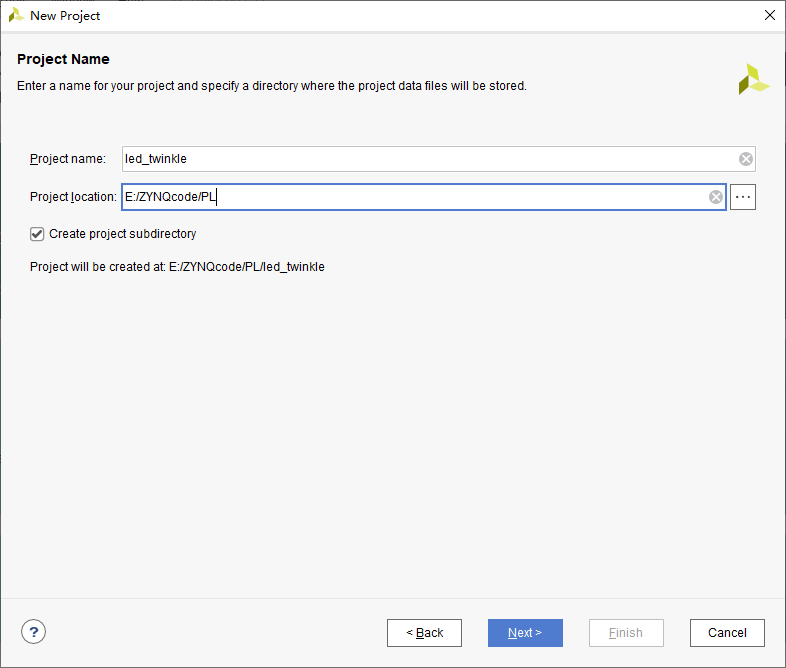

# 软件安装

[vivado2019.2安装+license添加教程_vivado license_原地打转的瑞哥的博客-CSDN博客](https://blog.csdn.net/weixin_47730622/article/details/125623165)

vivado许可证

链接: https://pan.baidu.com/s/1-2QL3MCYhUh-qANEuxVHIQ 提取码: vh3h 

# 常见问题

# PL(FPGA)

## 新建工程

点击Create Project，然后点击Next。

输入工程名以及保存路径。默认勾选“Create project subdirectory”，该目录用于存放工程内的各种文件，方便管理。

再点击Next，选择RTL Project，不勾选“Do not specify sources at this time”，将会出现添加源文件的界面。

接下来是添加约束文件，我们也是直接点击“Next”。

接下来选择开发板的芯片型号，直接在搜素框中输入完整的芯片型号，xc7z010clg400-1，一直点Next就行。

## 设计输入

在Source中点击'+'添加源文件，定好文件名，基本不用怎么设置，一路next。(使用verilog语言)

# PS(裸机)

## ZYNQ裸机开发流程

- 创建Vivado工程
- 使用IP Processor创建Processor System
- 生成顶层HDL
- 生成比特流导出到SDK（不使用FPGA就不用生成比特流）
- 在SDK中创建应用工程
- 板级验证

## ZYNQ最小系统

最小系统只需要ARM Cortex-A9加上DDR3和UART即可，不需要PL部分。

## 使用IP核

在IP INTEGRATOR下中创建或者打开IP核，生成的文件后缀为.bd

### 配置外设

在DDR configuration中Memory Part选择需要更改。7010核心板选择MT41J128M16HA-125;7020核心板选择MT41J256M16RE-125

配置UART在peripheral I/O Pins中，根据板子的原理图选择对应的管脚，启明星是Bank14和15。

在PS-PL configuration中的General中配置串口的波特率

Bank500是bank0，Bank501是bank1，根据原理图选择IO电平

### 去掉不需要的接口

在PS-PL configuration中的AXI Non Secure Enavlement中的AXI GP0 interface，取消选择。

在Clock Configuration中的PL Fabric Clocks中关闭FCLK_CLK0

# PS(Linux)

