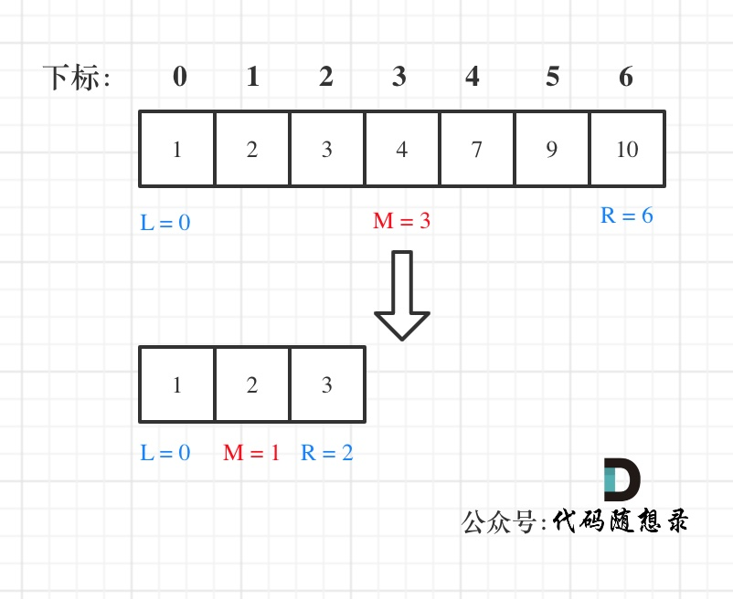

# 代码随想录刷题

## 数组

### 二分查找

**使用二分查找的前提是数组为有序数组**，同时题目还强调**数组中无重复元素**，因为一旦有重复元素，使用二分查找法返回的元素下标可能不是唯一的。

对于区间定义即不变量要清晰，例如到底是 `while(left < right)` 还是 `while(left <= right)`，到底是`right = middle`呢，还是要`right = middle - 1`呢？

常用



```c++
class Solution {
public:
    int search(vector<int>& nums, int target) {
        int left = 0;
        int right = nums.size() - 1; // 定义target在左闭右闭的区间里，[left, right]
        while (left <= right) { // 当left==right，区间[left, right]依然有效，所以用 <=
            int middle = left + ((right - left) / 2);// 防止溢出 等同于(left + right)/2
            if (nums[middle] > target) {
                right = middle - 1; // target 在左区间，所以[left, middle - 1]
            } else if (nums[middle] < target) {
                left = middle + 1; // target 在右区间，所以[middle + 1, right]
            } else { // nums[middle] == target
                return middle; // 数组中找到目标值，直接返回下标
            }
        }
        // 未找到目标值
        return -1;
    }
};
```

### 移除元素

最常用双指针即快慢指针法


```c++
// 时间复杂度：O(n)
// 空间复杂度：O(1)
class Solution {
public:
    int removeElement(vector<int>& nums, int val) {
        int slowIndex = 0;
        for (int fastIndex = 0; fastIndex < nums.size(); fastIndex++) {
            if (val != nums[fastIndex]) {
                nums[slowIndex++] = nums[fastIndex];		//此处slowIndex后自加
            }
        }
        return slowIndex;
    }
};
```

### 有序数组的平方

#### 双指针法

数组其实是有序的， 只不过负数平方之后可能成为最大数了。

那么数组平方的最大值就在数组的两端，不是最左边就是最右边，不可能是中间。

此时可以考虑双指针法了，i指向起始位置，j指向终止位置。

定义一个新数组result，和A数组一样的大小，让k指向result数组终止位置。

如果`A[i] * A[i] < A[j] * A[j]` 那么`result[k--] = A[j] * A[j];` 。

如果`A[i] * A[i] >= A[j] * A[j]` 那么`result[k--] = A[i] * A[i];` 。

如动画所示：


```c++
class Solution {
public:
    vector<int> sortedSquares(vector<int>& A) {
        int k = A.size() - 1;
        vector<int> result(A.size(), 0);
        for (int i = 0, j = A.size() - 1; i <= j;) { // 注意这里要i <= j，因为最后要处理两个元素
            if (A[i] * A[i] < A[j] * A[j])  {
                result[k--] = A[j] * A[j];
                j--;
            }
            else {
                result[k--] = A[i] * A[i];
                i++;
            }
        }
        return result;
    }
};
```

### 长度最小的子数组

使用滑动窗口的方式

所谓滑动窗口，**就是不断的调节子序列的起始位置和终止位置**，代码里面关于保存子窗口长度的+1很关键，植树问题。


```c++
class Solution {
public:
    int minSubArrayLen(int target, vector<int>& nums) {
        int sum = 0;    //子窗口数据之和
        int result = INT32_MAX; //返回结果，默认为int的最大值
        int length = 0;  //子窗口长度
        int i = 0 ; //子窗口左边的位置

        for (int j = 0; j < nums.size(); j++){
            sum += nums[j];     //将子窗口右边的位置的值保存在sum中

            while (sum >= target){
                length = j - i + 1; //保存子窗口的长度
                result = (result < length ? result : length);   //判断是不是最小的窗口

                sum -= nums[i];     //减去最左边位置的值
                i++;                //左边位置移位
            }
        }

        if(result == INT32_MAX) 
            return 0;
        else
            return result;
    }
};
```

[904. 水果成篮 - 力扣（LeetCode）](https://leetcode.cn/problems/fruit-into-baskets/description/)

### 螺旋矩阵

[59. 螺旋矩阵 II - 力扣（LeetCode）](https://leetcode.cn/problems/spiral-matrix-ii/)

```c++
class Solution {
public:
    vector<vector<int>> generateMatrix(int n) {
        vector<vector<int>> res(n,vector(n,0)); //使用vector定义一个二维数组
        int startx,starty; //每次开始的下标
        int i,j;    //用于循环
        int loop = n/2; //循环圈数
        int mid = n/2;  //中心点
        int count = 1; //用于给方格赋值
        int offset = 1; //控制每一条遍历的长度，每次循环到右边界收缩一格

        while(loop--)
        {
            i = startx;
            j = starty;

            // 下面开始模拟转一圈
            // 模拟填充上行从左到右(左闭右开)   i不变，j增加    需要考虑右边界收缩
            for(j = starty;j < n - offset;j++){
                res[i][j] = count++; 
            }

             // 模拟填充右列从上到下(左闭右开)  j不变，i增加    需要考虑右边界收缩
             for(i = startx;i < n - offset;i++){
                res[i][j] = count++;
             }

             // 模拟填充下行从右到左(左闭右开)  i不变，j减小
             for(;j > starty;j--){
                res[i][j] = count++;
             }

             // 模拟填充左列从下到上(左闭右开)  j不变，i减小
             for(;i > startx;i--){
                res[i][j] = count++;
             }

             //下一轮起始位置各加一
             startx++;
             starty++;

             //改变offset
             offset++;             
        }

        //奇数行需要单独填写最中间的值
        if(n % 2)
        {
            res[mid][mid] = count;
        }

        return res;
    }
};
```


## 链表

### 移除链表元素

[203. 移除链表元素 - 力扣（LeetCode）](https://leetcode.cn/problems/remove-linked-list-elements/)

虚拟头节点的方法更加容易理解


```c++
/**
 * Definition for singly-linked list.
 * struct ListNode {
 *     int val;
 *     ListNode *next;
 *     ListNode() : val(0), next(nullptr) {}
 *     ListNode(int x) : val(x), next(nullptr) {}
 *     ListNode(int x, ListNode *next) : val(x), next(next) {}
 * };
 */
class Solution {
public:
    ListNode* removeElements(ListNode* head, int val) {
        ListNode *fakehead = new ListNode(0);		//创建一个虚拟头节点
        fakehead->next = head;						//虚拟头节点的下一个指向head
        ListNode *cur = fakehead;					//使用cur作为当前节点

        while(cur->next != NULL)					//遍历，如果没有到链表尾部
        {
            if(cur->next->val == val)				//是要删除的值
            {
                ListNode *tmp = cur->next;			//使用中间变量保存要删除的节点
                cur->next = cur->next->next;		//节点下一个指向下一个的下一个
                delete tmp;							//释放要删除节点的内存
            }
            else
                cur = cur->next;					//移动cur
        }

        head = fakehead->next;						//返回虚拟节点的下一个
        delete fakehead;							//释放虚拟节点的内存
        return head;								//返回
    }
};
```

### 设计链表

[707. 设计链表 - 力扣（LeetCode）](https://leetcode.cn/problems/design-linked-list/)


```c++
class MyLinkedList {
public:
    struct ListNode{
        int val;                //值
        ListNode *Next;         //地址
        ListNode(int val):val(val),Next(nullptr){}      //构造函数初始化列表
    };

    MyLinkedList() {
        fakehead = new ListNode(0);
        size = 0;
    }
    
    int get(int index) {
        if(index > size - 1 || index < 0)   //输入参数有误
            return -1;
        
        ListNode *cur = fakehead->Next;

        while(index--)
        {
            cur = cur->Next;
        }

        return cur->val;
    }
    
    void addAtHead(int val) {
        ListNode *newNode = new ListNode(val);      //创建一个新节点同时赋值
        newNode->Next = fakehead->Next;             //将新节点挂到原链表的前面
        fakehead->Next = newNode;                   //将虚拟节点放到新节点前
        size++;                                     //链表长度加一
    }
    
    void addAtTail(int val) {
        ListNode *newNode = new ListNode(val);      //创建一个新节点同时赋值
        ListNode *cur = fakehead;

        while(cur->Next != NULL)                     //寻找链表尾
        {
            cur = cur->Next;
        }

        cur->Next = newNode;                         //新节点放在链表后
        size++;
    }
    
    void addAtIndex(int index, int val) {
        if(index > size) return;
        if(index < 0) index = 0;

        ListNode *newNode = new ListNode(val);       //创建一个新节点同时赋值
        ListNode *cur = fakehead;

        while(index--)
        {
            cur = cur->Next;
        }

        newNode->Next = cur->Next;                    //新节点的下一个为原链表的下一个
        cur->Next = newNode;                          //当前节点的下一个为新节点
        size++;
    }
    
    void deleteAtIndex(int index) {
        if(index >= size || index < 0)  return;       //index大于size或者小于0返回

        ListNode *newNode = new ListNode(0);          //创建一个新节点同时赋值
        ListNode *cur = fakehead;        

        while(index--)
        {
            cur = cur->Next;
        }

        ListNode *tmp = cur->Next;
        cur->Next = cur->Next->Next;

        delete tmp;                                   //释放tmp
        tmp = NULL;                                   //防止tmp变成野指针
        size--;
    }
private:
    ListNode *fakehead;
    int size;
};

/**
 * Your MyLinkedList object will be instantiated and called as such:
 * MyLinkedList* obj = new MyLinkedList();
 * int param_1 = obj->get(index);
 * obj->addAtHead(val);
 * obj->addAtTail(val);
 * obj->addAtIndex(index,val);
 * obj->deleteAtIndex(index);
 */
```

### 反转链表

[206. 反转链表 - 力扣（LeetCode）](https://leetcode.cn/problems/reverse-linked-list/)

#### 双指针法

最重要的思想就是用tmp保存cur->next，保证原链表不变动的情况下翻转。

首先定义一个cur指针，指向头结点，再定义一个pre指针，初始化为null。

然后就要开始反转了，首先要把 cur->next 节点用tmp指针保存一下，也就是保存一下这个节点。

为什么要保存一下这个节点呢，因为接下来要改变 cur->next 的指向了，将cur->next 指向pre ，此时已经反转了第一个节点了。

接下来，就是循环走如下代码逻辑了，先移动pre指针，再移动cur指针。

最后，cur 指针已经指向了null，循环结束，链表也反转完毕了。 此时我们return pre指针就可以了，pre指针就指向了新的头结点。

```c++
/**
 * Definition for singly-linked list.
 * struct ListNode {
 *     int val;
 *     ListNode *next;
 *     ListNode() : val(0), next(nullptr) {}
 *     ListNode(int x) : val(x), next(nullptr) {}
 *     ListNode(int x, ListNode *next) : val(x), next(next) {}
 * };
 */
class Solution {
public:
    ListNode* reverseList(ListNode* head) {
        ListNode* pre = NULL;
        ListNode* cur = head;

        while(cur != nullptr)
        {
            ListNode* tmp = cur->next;  //保存中间值
            cur->next = pre;    //翻转操作
            pre = cur;          //移动pre
            cur = tmp;          //移动到下一个节点
        }

        return pre;
    }
};
```

#### 递归法

```c++
class Solution {
public:
    ListNode* reverse(ListNode* pre,ListNode* cur){
        if(cur == NULL) return pre;
        ListNode* temp = cur->next;
        cur->next = pre;
        // 可以和双指针法的代码进行对比，如下递归的写法，其实就是做了这两步
        // pre = cur;
        // cur = temp;
        return reverse(cur,temp);
    }
    ListNode* reverseList(ListNode* head) {
        // 和双指针法初始化是一样的逻辑
        // ListNode* cur = head;
        // ListNode* pre = NULL;
        return reverse(NULL, head);
    }

};
```

### 两两交换链表中的节点

[24. 两两交换链表中的节点 - 力扣（LeetCode）](https://leetcode.cn/problems/swap-nodes-in-pairs/description/)

初始时，cur指向虚拟头结点，然后进行如下三步：


看这个可能就更直观一些了：


```c++
/**
 * Definition for singly-linked list.
 * struct ListNode {
 *     int val;
 *     ListNode *next;
 *     ListNode() : val(0), next(nullptr) {}
 *     ListNode(int x) : val(x), next(nullptr) {}
 *     ListNode(int x, ListNode *next) : val(x), next(next) {}
 * };
 */
class Solution {
public:
    ListNode* swapPairs(ListNode* head) {
        ListNode* fakenode = new ListNode(0);
        fakenode->next = head;
        ListNode* cur = fakenode;
        ListNode* tmp1;
        ListNode* tmp2;

        while(cur->next != nullptr && cur->next->next != nullptr)   //下一节点和下下节点不为空
        {
            tmp1 = cur->next;                   //暂存原节点下个节点
            tmp2 = cur->next->next->next;       //暂存原节点下下下个节点

            cur->next = cur->next->next;        //步骤一
            cur->next->next = tmp1;             //步骤二
            cur->next->next->next = tmp2;       //步骤三

            cur = cur->next->next;              //将cur移动两位，准备下一轮交换
        }

        ListNode* result = fakenode->next;
        delete fakenode;
        return result;
    }
};
```

### 删除链表的倒数第N个节点

[19. 删除链表的倒数第 N 个结点 - 力扣（LeetCode）](https://leetcode.cn/problems/remove-nth-node-from-end-of-list/)

核心思想是使用快慢指针，先让fast指针移动n+1步，在同时移动快慢指针直到检测到null。此时再去删除慢指针的下一个节点。下面是我自己写的代码。

```c++
/**
 * Definition for singly-linked list.
 * struct ListNode {
 *     int val;
 *     ListNode *next;
 *     ListNode() : val(0), next(nullptr) {}
 *     ListNode(int x) : val(x), next(nullptr) {}
 *     ListNode(int x, ListNode *next) : val(x), next(next) {}
 * };
 */
class Solution {
public:
    ListNode* removeNthFromEnd(ListNode* head, int n) {
        ListNode* fakenode = new ListNode(0);   //虚拟头节点
        fakenode->next = head;

        ListNode* fastcur = fakenode;       //快操作节点
        ListNode* slowcur = fakenode;       //慢操作节点

        n += 1;        //加1是因为虚拟头节点相比原来要多一个移位步骤

        while(n--)      //移动快指针
        {
            fastcur = fastcur->next;
        }

        while(fastcur != NULL)  //遍历链表，快指针没到末尾，快慢指针同时移动
        {
            fastcur = fastcur->next;
            slowcur = slowcur->next;
        }

        //用tmp保存slowcur的下一个节点，并且释放
        ListNode* tmp = slowcur->next;
        slowcur->next = slowcur->next->next;        //删除倒数位上的节点
        ListNode* result = fakenode->next;

        //内存释放
        delete tmp;
        delete fakenode;
        return result;
    }
};
```
下面是代码随想录写的例程代码

```c++
class Solution {
public:
    ListNode* removeNthFromEnd(ListNode* head, int n) {
        ListNode* dummyHead = new ListNode(0);
        dummyHead->next = head;
        ListNode* slow = dummyHead;
        ListNode* fast = dummyHead;
        while(n-- && fast != NULL) {
            fast = fast->next;
        }
        fast = fast->next; // fast再提前走一步，因为需要让slow指向删除节点的上一个节点
        while (fast != NULL) {
            fast = fast->next;
            slow = slow->next;
        }
        slow->next = slow->next->next; 
        
        // ListNode *tmp = slow->next;  C++释放内存的逻辑
        // slow->next = tmp->next;
        // delete tmp;
        
        return dummyHead->next;
    }
};
```

### 链表相交

[面试题 02.07. 链表相交 - 力扣（LeetCode）](https://leetcode.cn/problems/intersection-of-two-linked-lists-lcci/)

这道题关键在于将两个链表对齐。

1. 先计算两个链表的长度
2. 将curA和curB恢复到原始状态
3. 求两个链表长度的差值
4. 让curA移动到，和curB 末尾对齐的位置（这边是curA为长链表）
5. 依次比较curA和curB是否相同，如果不相同，同时向后移动curA和curB，如果遇到curA == curB，则找到交点。

将**指针恢复到初始状态**需要在长度判断之前，不然swap(curA,curB)将无法起作用。

```c++
/**
 * Definition for singly-linked list.
 * struct ListNode {
 *     int val;
 *     ListNode *next;
 *     ListNode(int x) : val(x), next(NULL) {}
 * };
 */
class Solution {
public:
    ListNode *getIntersectionNode(ListNode *headA, ListNode *headB) {
        ListNode* curA = headA;
        ListNode* curB = headB;

        //计算A和B链表的长度
        int lenA = 0,lenB = 0;

        while(curA != NULL)
        {
            lenA++;
            curA = curA->next;

        }
        while(curB != NULL)
        {
            lenB++;
            curB = curB->next;
        }

        //将指针恢复到初始状态
        curA = headA;
        curB = headB;

        //A和B两者长度取最高，放在A变量里面
        if(lenB > lenA)
        {
            swap(lenA,lenB);
            swap(curA,curB);
        }

        //将两个链表保持长度一致
        int gap = lenA - lenB;
        while(gap--)
        {
            curA = curA->next;
        }

        while(curA != NULL)
        {
            if(curA == curB)        //如果两个节点指针相同，说明是交叉点
                return curA;

            curA = curA->next;      //两个指针一起前进
            curB = curB->next;
        }

        return NULL;
    }
};
```

### 环形链表

[142. 环形链表 II - 力扣（LeetCode）](https://leetcode.cn/problems/linked-list-cycle-ii/)

[把环形链表讲清楚！ 如何判断环形链表？如何找到环形链表的入口？ LeetCode：142.环形链表II_哔哩哔哩_bilibili](https://www.bilibili.com/video/BV1if4y1d7ob/)

```c++
/**
 * Definition for singly-linked list.
 * struct ListNode {
 *     int val;
 *     ListNode *next;
 *     ListNode(int x) : val(x), next(NULL) {}
 * };
 */
class Solution {
public:
    ListNode *detectCycle(ListNode *head) {
        ListNode *fastnode = head;      //定义一个快指针指向链表头
        ListNode *slownode = head;      //定义一个慢指针指向链表头

        while(fastnode != NULL && fastnode->next != NULL)
        {
            fastnode = fastnode->next->next;        //快指针每次运动两个节点
            slownode = slownode->next;              //慢指针每次运动一个节点

            if(fastnode == slownode)        //快慢节点相遇
            {
                ListNode *index1 = fastnode;        //定义一个指向相遇点的指针
                ListNode *index2 = head;            //定义一个指向链表头的指针

                while(index1 != index2)             //同时运动找到入环处
                {
                    index1 = index1->next;
                    index2 = index2->next;
                }

                return index1;                      //返回两个指针中的任意一个都行
            }
        }

        return NULL;
    }
};
```

## 哈希表

**当我们遇到了要快速判断一个元素是否出现集合里的时候，就要考虑哈希法**。

### 有效的字母异位词

```c++
class Solution {
public:
    bool isAnagram(string s, string t) {
        int recode[26] = {0};       //记录26个小写字母的哈希表

        //遍历S字符串
        for(int i = 0; i < s.size(); i++)
        {
            recode[s[i] - 'a']++;
        }

        //遍历t字符串
        for(int i = 0; i < t.size(); i++)
        {
            recode[t[i] - 'a']--;
        }

        // record数组如果有的元素不为零0，说明字符串s和t 一定是谁多了字符或者谁少了字符。
        for(int i = 0; i < 26; i++)
        {
            if(recode[i] != 0)
                return false;
        }

        return true;
    }
};
```

定义一个数组叫做record用来上记录字符串s里字符出现的次数。

需要把字符映射到数组也就是哈希表的索引下标上，**因为字符a到字符z的ASCII是26个连续的数值，所以字符a映射为下标0，相应的字符z映射为下标25。**

再遍历 字符串s的时候，**只需要将 s[i] - ‘a’ 所在的元素做+1 操作即可，并不需要记住字符a的ASCII，只要求出一个相对数值就可以了。** 这样就将字符串s中字符出现的次数，统计出来了。

那看一下如何检查字符串t中是否出现了这些字符，同样在遍历字符串t的时候，对t中出现的字符映射哈希表索引上的数值再做-1的操作。

那么最后检查一下，**record数组如果有的元素不为零0，说明字符串s和t一定是谁多了字符或者谁少了字符，return false。**

最后如果record数组所有元素都为零0，说明字符串s和t是字母异位词，return true。

时间复杂度为O(n)，空间上因为定义是的一个常量大小的辅助数组，所以空间复杂度为O(1)。

#### 相关题目

[49. 字母异位词分组 - 力扣（LeetCode）](https://leetcode.cn/problems/group-anagrams/)

由于互为字母异位词的两个字符串包含的字母相同，因此对两个字符串分别进行**排序**之后得到的字符串一定是相同的，故可以将排序之后的字符串作为哈希表的键。

```c++
class Solution {
public:
    vector<vector<string>> groupAnagrams(vector<string>& strs) {
        unordered_map<string,vector<string>> mp;    //创建一个无序映射

        //遍历strs
        for(string& str : strs){
            string key = str;               //将str赋值给key
            sort(key.begin(),key.end());    //将key进行排序
            mp[key].emplace_back(str);      //将排序完的key作为键，str作为值放入映射中
        }

        vector<vector<string>> ans;         //创建一个二维向量用于返回
        for(auto it = mp.begin();it != mp.end();++it){
            ans.emplace_back(it->second);   //将所有值读出
        }
        return ans;
    }
};
```

### 快乐数

[202. 快乐数 - 力扣（LeetCode）](https://leetcode.cn/problems/happy-number/description/)

```c++
class Solution {
public:
    int GetNum(int n)
    {
        int sum = 0;
        while(n)
        {
            sum += (n%10) * (n%10);
            n /= 10;
        }
        return sum;
    }

    bool isHappy(int n) {
        unordered_set<int> set;
        while(1)
        {
            int sum = 0;
            sum = GetNum(n);

            if(sum == 1)
                return true;
            
            //如果在中间找到了，说明开始无限循环了，立刻返回false
            if(set.find(sum) != set.end()){
                return false;
            }else{
                set.insert(sum);	//集合中并不存在，插入集合中
            }
            n = sum;
        }
    }
};
```

代码随想录使用无序集合的方法，通过无限循环在集合中寻找是否有重复项，来判定是否为快乐数。

```c++
class Solution {
public:
    int GetNum(int n)
    {
        int sum = 0;
        while(n)
        {
            sum += (n%10) * (n%10);
            n /= 10;
        }
        return sum;
    }

    bool isHappy(int n) {
        int slow = n, fast = n;
        do{
            //慢指针动一步，快指针动两步
            slow = GetNum(slow);
            fast = GetNum(fast);
            fast = GetNum(fast);
        }while(slow != fast);   //两者不相等就继续

        return slow == 1;   //如果其中一个数是1代表是快乐数，否则不是
    }
};
```

力扣题解通过快慢指针解题，使用 “快慢指针” 思想，找出循环：“快指针” 每次走两步，“慢指针” 每次走一步，当二者相等时，即为一个循环周期。此时，判断是不是因为 1 引起的循环，是的话就是快乐数，否则不是快乐数。
注意：此题不建议用集合记录每次的计算结果来判断是否进入循环，因为这个集合可能大到无法存储；另外，也不建议使用递归，同理，如果递归层次较深，会直接导致调用栈崩溃。不要因为这个题目给出的整数是 int 型而投机取巧。

### 两数之和

[1. 两数之和 - 力扣（LeetCode）](https://leetcode.cn/problems/two-sum/)

```c++
class Solution {
public:
    vector<int> twoSum(vector<int>& nums, int target) {
        unordered_map<int,int> map;

        //遍历数组
        for(int i = 0; i < nums.size();i++)
        {
            auto res = map.find(target - nums[i]);  //寻找nums[i]和target的差值
            if(res != map.end())    //说明找到差值
            {
                return {res->second,i}; //返回下标值
            }
            else
            {
                //map.insert(pair<int,int>(nums[i],i));
                map.emplace(nums[i],i); //没找到差值就把当前值和下标存入map中
            }
        }
        return {};
    }
};
```

在遍历数组的时候，只需要向map去查询是否有和目前遍历元素匹配的数值，如果有，就找到的匹配对，如果没有，就把目前遍历的元素放进map中，因为map存放的就是我们访问过的元素。


- 为什么会想到用哈希表

    当我们需要查询一个元素是否出现过，或者一个元素是否在集合里的时候，就要第一时间想到哈希法。

- 哈希表为什么用map

    我们不仅要知道元素有没有遍历过，还要知道这个元素对应的下标，**需要使用 key value结构来存放，key来存元素，value来存下标，那么使用map正合适**。

- 本题map是用来存什么的

    map目的用来存放我们访问过的元素，因为遍历数组的时候，需要记录我们之前遍历过哪些元素和对应的下标，这样才能找到与当前元素相匹配的（也就是相加等于target）

- map中的key和value用来存什么的

    数组中的元素作为key，有key对应的就是value，value用来存下标。map中的存储结构为 {key：数据元素，value：数组元素对应的下标}。

### 四数相加Ⅱ

[454. 四数相加 II - 力扣（LeetCode）](https://leetcode.cn/problems/4sum-ii/)

```c++
class Solution {
public:
    int fourSumCount(vector<int>& nums1, vector<int>& nums2, vector<int>& nums3, vector<int>& nums4) {
        unordered_map<int,int> map;
        int count = 0;
        int target = 0;

        //遍历1和2数组
        for(int num1 : nums1){
            for(int num2 : nums2){
                map[num1 + num2]++;
            }
        }

        //遍历3和4数组，寻找map中的相反数
        for(int num3 : nums3){
            for(int num4 : nums4){
                target = -(num3 + num4);

                if(map.find(target) != map.end()){
                    count += map[target];       //找到了相反数就加上对应value
                }
            }
        }

        return count;
    }
};
```

本题解题步骤：

1. 首先定义 一个unordered_map，key放a和b两数之和，value 放a和b两数之和出现的次数。
2. 遍历大A和大B数组，统计两个数组元素之和，和出现的次数，放到map中。
3. 定义int变量count，用来统计 a+b+c+d = 0 出现的次数。
4. 在遍历大C和大D数组，找到如果 0-(c+d) 在map中出现过的话，就用count把map中key对应的value也就是出现次数统计出来。
5. 最后返回统计值 count 就可以了

### 救赎金

[383. 赎金信 - 力扣（LeetCode）](https://leetcode.cn/problems/ransom-note/description/)

```c++
class Solution {
public:
    bool canConstruct(string ransomNote, string magazine) {
        int record[26] = {0};
        //add
        if (ransomNote.size() > magazine.size()) {
            return false;
        }
        for (int i = 0; i < magazine.length(); i++) {
            // 通过record数据记录 magazine里各个字符出现次数
            record[magazine[i]-'a'] ++;
        }
        for (int j = 0; j < ransomNote.length(); j++) {
            // 遍历ransomNote，在record里对应的字符个数做--操作
            record[ransomNote[j]-'a']--;
            // 如果小于零说明ransomNote里出现的字符，magazine没有
            if(record[ransomNote[j]-'a'] < 0) {
                return false;
            }
        }
        return true;
    }
};
```

这道题和有效的字母异位词很相似，差异在于最后遍历记录数组的时候，判断条件不再是不等于0，因为存在后一个字符串比前一个长的情况，所以应该是大于0，代表前一个字符串在后一个字符串中找不到对应的字母。

### 三数之和

[15. 三数之和 - 力扣（LeetCode）](https://leetcode.cn/problems/3sum/)

```c++
class Solution {
public:
    vector<vector<int>> threeSum(vector<int>& nums) {
        vector<vector<int>> result;

        sort(nums.begin(),nums.end());      //从小到大排序

        for(int i = 0; i < nums.size(); i++){
            if(nums[i] > 0) return result;         //第一个数就大于0，不可能三数之和等于0

            if(i > 0 && nums[i] == nums[i-1]) continue;  //去重i

            int left = i + 1;               //左指针
            int right = nums.size() - 1;    //右指针

            while(right > left){
                if(nums[i] + nums[left] + nums[right] > 0) right--;
                else if(nums[i] + nums[left] + nums[right] < 0) left++;
                else{
                    result.push_back(vector<int>{nums[i],nums[left],nums[right]});

                    while(right > left && nums[left] == nums[left + 1]) left++;
                    while(right > left && nums[right] == nums[right - 1]) right--;

                    right--;
                    left++;
                }
            }
        }

        return result;
    }
};
```


解题思路：

1. 将数组从小到大排序，检查第一个元素是否大于0，如果第一个元素都已经大于0，说明数组内不可能有满足条件的三元组
2. 用下标i遍历数组，对i进行去重，注意使用当前值和上一个值比较，这里需要当心下标i需要大于0，不然会导致数组越界
3. 选取left和right指针，分别为i+1和最大长度减一
4. 当right大于left一直循环，判断三元组的值是否等于0。大于0则移动右指针，小于则移动左指针。
5. 直到找到满足要求的三元组，此时将三元组放入返回容器中。接下来就是进行去重操作。左指针和后一个比较，右指针和前一个比较。如果相同就继续移动
6. 最后返还结果容器

### 四数之和

[18. 四数之和 - 力扣（LeetCode）](https://leetcode.cn/problems/4sum/description/)

```c++
class Solution {
public:
    vector<vector<int>> fourSum(vector<int>& nums, int target) {
        vector<vector<int>> result;     //保存结果

        sort(nums.begin(),nums.end());  //排列一下

        for(int k = 0; k < nums.size(); k++){
            if(nums[k] > target && nums[k] >= 0) //如果第一个元素大于target说明没有符合
                break;
            
            if(k > 0 && nums[k] == nums[k - 1]) //去重
                continue;

            for(int i = k + 1; i < nums.size();i++){
                if(nums[k] + nums[i] > target && nums[k] + nums[i] >= 0)
                    break;

                if(i > k + 1 && nums[i] == nums[i - 1]) //去重
                    continue;

                //双指针
                int left = i + 1;
                int right = nums.size() - 1;

                while(right > left){
                    if((long)nums[k] + nums[i] + nums[left] + nums[right] > target) right--;
                    else if((long)nums[k] + nums[i] + nums[left] + nums[right] < target) left++;
                    else{
                        result.push_back(vector<int>{nums[k],nums[i],nums[left],nums[right]});

                        while(right >left && nums[left] == nums[left + 1]) left++;      //去重
                        while(right >left && nums[right] == nums[right - 1]) right--;   //去重

                        left++;
                        right--;
                    }
                }
            }
        }

        return result;
    }
};
```

该题和三数之和类似，区别在于多一层for循环，第二层的变量取值范围是第一层的变量加1。

## 字符串

### 反转字符串

[344. 反转字符串 - 力扣（LeetCode）](https://leetcode.cn/problems/reverse-string/description/)

我的代码

```c++
class Solution {
public:
    void reverseString(vector<char>& s) {
        int left = 0;
        int right = s.size()-1;
        char temp;  //中间保存

        while(right > left){
            //交换
            temp = s.at(left);
            s[left] = s[right];
            s[right] = temp;

            //移动下标
            left++;
            right--;
        }
    }
};
```

代码随想录给的解答

```c++
class Solution {
public:
    void reverseString(vector<char>& s) {
        for (int i = 0, j = s.size() - 1; i < s.size()/2; i++, j--) {
            swap(s[i],s[j]);
        }
    }
};
```

### 反转字符串Ⅱ

[541. 反转字符串 II - 力扣（LeetCode）](https://leetcode.cn/problems/reverse-string-ii/description/)

```c++
class Solution {
public:
    string reverseStr(string s, int k) {

        for(int i = 0; i < s.size();i+=2*k)
        {
            // 1. 每隔 2k 个字符的前 k 个字符进行反转
            if(i+k < s.size())
                reverse(s.begin() + i,s.begin() + i + k); // 2. 剩余字符小于 2k 但大于或等于 k 个，则反转前 k 个字符
            else
                reverse(s.begin() + i,s.end());    // 3. 剩余字符少于 k 个，则将剩余字符全部反转。
        }

        return s;
    }
};
```

### 替换数字

[54. 替换数字（第八期模拟笔试） (kamacoder.com)](https://kamacoder.com/problempage.php?pid=1064)

```c++
#include <iostream>
using namespace std;
int main() {
    string s;
    while (cin >> s) {
        int sOldIndex = s.size() - 1;
        int count = 0; // 统计数字的个数
        for (int i = 0; i < s.size(); i++) {
            if (s[i] >= '0' && s[i] <= '9') {
                count++;
            }
        }
        // 扩充字符串s的大小，也就是将每个数字替换成"number"之后的大小
        s.resize(s.size() + count * 5);
        int sNewIndex = s.size() - 1;
        // 从后往前将数字替换为"number"
        while (sOldIndex >= 0) {
            if (s[sOldIndex] >= '0' && s[sOldIndex] <= '9') {
                s[sNewIndex--] = 'r';
                s[sNewIndex--] = 'e';
                s[sNewIndex--] = 'b';
                s[sNewIndex--] = 'm';
                s[sNewIndex--] = 'u';
                s[sNewIndex--] = 'n';
            } else {
                s[sNewIndex--] = s[sOldIndex];
            }
            sOldIndex--;
        }
        cout << s << endl;       
    }
}
```

本题的关键在于统计字符串内数字的个数，通过数字的个数来扩容原来的字符串，然后从后往前填充对应的单词。

### 反转字符串中的单词

[151. 反转字符串中的单词 - 力扣（LeetCode）](https://leetcode.cn/problems/reverse-words-in-a-string/description/)

使用stringstream方法

[【C++】stringstream类 最全超详细解析（什么是stringstream？ stringstrem有哪些作用? 如何在算法中应用？）-CSDN博客](https://blog.csdn.net/weixin_45031801/article/details/136921743)

```c++
class Solution {
public:
    string reverseWords(string s) {
        string res,temp;
        stringstream ss(s);

        while(ss >> temp)   //从字符串流中按照空格分割提取
        {
            res = temp + " " + res; //调换顺序添加一个空格
        }
        if(!res.empty())        //移除最后添加的多余空格
            res.pop_back();
        return res;
    }
};
```

代码随想录不使用库函数的例子

```c++
class Solution {
public:
    void reverse(string& s, int start, int end){ //翻转，区间写法：左闭右闭 []
        for (int i = start, j = end; i < j; i++, j--) {
            swap(s[i], s[j]);
        }
    }

    void removeExtraSpaces(string& s) {//去除所有空格并在相邻单词之间添加空格, 快慢指针。
        int slow = 0;   //整体思想参考https://programmercarl.com/0027.移除元素.html
        for (int i = 0; i < s.size(); ++i) { //
            if (s[i] != ' ') { //遇到非空格就处理，即删除所有空格。
                if (slow != 0) s[slow++] = ' '; //手动控制空格，给单词之间添加空格。slow != 0说明不是第一个单词，需要在单词前添加空格。
                while (i < s.size() && s[i] != ' ') { //补上该单词，遇到空格说明单词结束。
                    s[slow++] = s[i++];
                }
            }
        }
        s.resize(slow); //slow的大小即为去除多余空格后的大小。
    }

    string reverseWords(string s) {
        removeExtraSpaces(s); //去除多余空格，保证单词之间之只有一个空格，且字符串首尾没空格。
        reverse(s, 0, s.size() - 1);
        int start = 0; //removeExtraSpaces后保证第一个单词的开始下标一定是0。
        for (int i = 0; i <= s.size(); ++i) {
            if (i == s.size() || s[i] == ' ') { //到达空格或者串尾，说明一个单词结束。进行翻转。
                reverse(s, start, i - 1); //翻转，注意是左闭右闭 []的翻转。
                start = i + 1; //更新下一个单词的开始下标start
            }
        }
        return s;
    }
};
```

### 右旋字符串

[55. 右旋字符串（第八期模拟笔试） (kamacoder.com)](https://kamacoder.com/problempage.php?pid=1065)

```c++
#include <iostream>
#include <algorithm>

using namespace std;

int main(){
    int num;
    string s;
    cin >> num;
    cin >> s;
    int lenth = s.size();
    
    reverse(s.begin(),s.begin() + lenth);       //全部反转
    reverse(s.begin(),s.begin() + num);         //前n个反转
    reverse(s.begin() + num,s.end());         //反转length-n个
    
    cout << s << endl;  //结果输出
}
```

思路：将字符串先整个颠倒，然后根据输入的n去颠倒两个子字符串

### 找出字符串中第一个匹配的下标

[28. 找出字符串中第一个匹配项的下标 - 力扣（LeetCode）](https://leetcode.cn/problems/find-the-index-of-the-first-occurrence-in-a-string/description/)

```c++
class Solution {
public:
    int strStr(string haystack, string needle) {
        int haystacklength = haystack.size();
        int needlelength = needle.size();

        if(haystacklength < needlelength) //haystack长度小于needle，不可能
            return -1;

        int hindex = 0;     //haystack的指针
        int hindexcp = 0;   //haystack的复制指针，用于小窗内遍历检测
        int nindex = 0;     //needle的指针

        for(hindex = 0;hindex < haystacklength;hindex++){
            hindexcp = hindex;  //复制指针，用于小窗匹配
            while(haystack[hindexcp] == needle[nindex]){
                if(nindex == needlelength -1)
                    return hindex;
                hindexcp++;
                nindex++;
            }
            nindex = 0; //匹配错误，needle的指针归零
        }
        return -1;      //没有找到
    }
};
```

我自己的思路就是通过遍历haystack的下标，然后根据needle的长度用一个小窗去匹配。

KMP算法

前缀表（不减一）C++实现

```c++
class Solution {
public:
    void getNext(int* next, const string& s) {
        int j = 0;
        next[0] = 0;
        for(int i = 1; i < s.size(); i++) {
            while (j > 0 && s[i] != s[j]) {
                j = next[j - 1];
            }
            if (s[i] == s[j]) {
                j++;
            }
            next[i] = j;
        }
    }
    int strStr(string haystack, string needle) {
        if (needle.size() == 0) {
            return 0;
        }
        vector<int> next(needle.size());
        getNext(&next[0], needle);
        int j = 0;
        for (int i = 0; i < haystack.size(); i++) {
            while(j > 0 && haystack[i] != needle[j]) {		//不匹配跳回前缀表上一个下标
                j = next[j - 1];
            }
            if (haystack[i] == needle[j]) {	//部分匹配移动下标
                j++;
            }
            if (j == needle.size() ) {	//匹配完成，返回下标
                return (i - needle.size() + 1);
            }
        }
        return -1;
    }
};
```

### 重复的子字符串

#### 移动匹配

判断字符串s是否由重复子串组成，只要两个s拼接在一起，里面还出现一个s的话，就说明是由重复子串组成。

当然，我们在判断 s + s 拼接的字符串里是否出现一个s的的时候，**要刨除 s + s 的首字符和尾字符**，这样避免在s+s中搜索出原来的s，我们要搜索的是中间拼接出来的s。

```c++
class Solution {
public:
    bool repeatedSubstringPattern(string s) {
        string t = s + s;
        t.erase(t.begin()); t.erase(t.end() - 1); // 掐头去尾
        if (t.find(s) != std::string::npos) return true; // r
        return false;
    }
};
```

#### KMP算法

```c++
class Solution {
public:
    void getNext(int *next,const string& s){
        int j = 0;
        next[0] = 0;
        for(int i = 1;i < s.size(); i++){
            while(j > 0 && s[i] != s[j]){
                j = next[j - 1];
            }
            if(s[i] == s[j]){
                j++;
            }
            next[i] = j;
        }
    }

    bool repeatedSubstringPattern(string s) 
    {
        vector<int> next(s.size());
        getNext(&next[0],s);        //获取前缀表

        int len = s.size();

        if(next[len-1] != 0 && len % (len - next[len - 1]) == 0)  //判断最长前后缀多余的部分能否被总长度整除
            return true;
        else
            return false;
    }
};
```

## 双指针法

该章节内部基本都是之前的题目

### 移除元素

[27. 移除元素 - 力扣（LeetCode）](https://leetcode.cn/problems/remove-element/)

我自己的解答

```c++
class Solution {
public:
    int removeElement(vector<int>& nums, int val) {
        int i = 0;  //首指针
        int j = nums.size() - 1;    //尾指针
        int count = 0;

        if(nums.size() == 0) return 0;  //如果是空数组，则直接返回0

        sort(nums.begin(),nums.end());

        //统计符合val的个数
        for(auto num : nums)
        {
            if(num == val)
                count++;
        }

        while(i<j)
        {
            if(nums[i] == val){     //找到需要移除的元素
                nums[i] = nums[j];  //获取尾指针的数值
                j--;
            }
            i++;
        }
        return nums.size() - count; //返回总长度减去符合val的个数
    }
};
```

我的思路是先判断数组是否为空，如果为空立即返回0。然后开始对数组进行排序，遍历数组，寻找等于val的个数，最后的返回值就是总长度减找到的个数，通过双指针，一前一尾，如果等于val就和最后的交换（因为已经排过序所以不担心尾指针指向val）。

代码随想录的示例代码，该题和数组里面的移除元素一致

```c++
class Solution {
public:
    int removeElement(vector<int>& nums, int val) {
        int slowIndex = 0;
        for (int fastIndex = 0; fastIndex < nums.size(); fastIndex++) {
            if (val != nums[fastIndex]) {
                nums[slowIndex] = nums[fastIndex];
                slowIndex++;
            }
        }
        return slowIndex;
    }
};
```

## 栈与队列

### 用栈实现队列 

```c++
class MyQueue {
public:
    stack<int> stack_in;        //入栈
    stack<int> stack_out;       //出栈

    MyQueue() {

    }
    
    void push(int x) {
        stack_in.push(x);
    }
    
    int pop() {
        int result = 0;

        //如果出栈为空，去入栈获取所有数据
        if(stack_out.empty()){
            while(!stack_in.empty()){
                stack_out.push(stack_in.top());
                stack_in.pop();
            }
        }
        result = stack_out.top();
        stack_out.pop();
        return result;
    }
    
    int peek() {
        int result = 0;
        result = this->pop();
        stack_out.push(result);
        return result;
    }
    
    bool empty() {
        if(stack_out.empty() && stack_in.empty())
            return true;
        else
            return false;
    }
};

/**
 * Your MyQueue object will be instantiated and called as such:
 * MyQueue* obj = new MyQueue();
 * obj->push(x);
 * int param_2 = obj->pop();
 * int param_3 = obj->peek();
 * bool param_4 = obj->empty();
 */
```

### 用队列实现栈

[225. 用队列实现栈 - 力扣（LeetCode）](https://leetcode.cn/problems/implement-stack-using-queues/)

我的思路如下，将入队列和出队列的转移数据单独写成一个函数

```c++
class MyStack {
public:
    queue<int> queue_in;        //入队列
    queue<int> queue_out;       //出队列
    vector<int> temp;

    MyStack() {

    }

    void queue_in_to_queue_out(){

        //如果入队列有数据，全部放到temp中
        while(!queue_in.empty()){
            temp.push_back(queue_in.front());
            queue_in.pop();
        }

        reverse(temp.begin(),temp.end());  //翻转容器，让入队列的值在最前面

        //如果出队列有数据，全部放到temp中
        while(!queue_out.empty()){
            temp.push_back(queue_out.front());
            queue_out.pop();
        }

        //将temp中的值放回出队列中
        for(int i = 0; i < temp.size(); i++)
        {
            queue_out.push(temp[i]);
        }
        temp.clear();
    }
    
    void push(int x) {
        queue_in.push(x);
    }
    
    int pop() {
        this->queue_in_to_queue_out();  //队列操作

        int result = queue_out.front();
        queue_out.pop();    //pop处理
        return result;
    }
    
    int top() {
        this->queue_in_to_queue_out();  //队列操作

        int result = queue_out.front();
        return result;
    }
    
    bool empty() {
        if(queue_in.empty() && queue_out.empty())
            return true;
        else
            return false;
    }
};

/**
 * Your MyStack object will be instantiated and called as such:
 * MyStack* obj = new MyStack();
 * obj->push(x);
 * int param_2 = obj->pop();
 * int param_3 = obj->top();
 * bool param_4 = obj->empty();
 */
```

代码随想录的方法用一个队列就能实现

使用类似循环队列的思路完成

```c++
class MyStack {
public:
    queue<int> queue;

    MyStack() {

    }

    void push(int x) {
        queue.push(x);
    }
    
    int pop() {
        //使用循环队列的方式，将size-1个元素移动到尾部
        int size = queue.size();
        size--;

        while(size--)
        {
            queue.push(queue.front());
            queue.pop();
        }

        int result = queue.front();
        queue.pop();    //pop处理
        return result;
    }
    
    int top() {
        int result = queue.back();
        return result;
    }
    
    bool empty() {
        if(queue.empty())
            return true;
        else
            return false;
    }
};

/**
 * Your MyStack object will be instantiated and called as such:
 * MyStack* obj = new MyStack();
 * obj->push(x);
 * int param_2 = obj->pop();
 * int param_3 = obj->top();
 * bool param_4 = obj->empty();
 */
```

### 有效的括号

[20. 有效的括号 - 力扣（LeetCode）](https://leetcode.cn/problems/valid-parentheses/description/)

我的想法用switch，确实会比else if麻烦

```c++
class Solution {
public:
    bool isValid(string s) {
        stack<char> m_stack;
        char rightchar;

        int size = s.size();
        if(size%2 != 0) return false;       //s长度为奇数必然不匹配

        for(int i = 0; i < s.size(); i++){
            switch(s[i]){
                //根据左括号往栈中加入右括号
                case '(': m_stack.push(')');break;
                case '[': m_stack.push(']');break;
                case '{': m_stack.push('}');break;

                //遇到右括号去栈顶寻找
                case ')': 
                    if(m_stack.empty())   return false; //如果空栈说明不匹配，直接退出
                    rightchar = m_stack.top();          //取栈顶元素
                    if(rightchar != s[i])   return false;   //如果不匹配就错误退出
                    m_stack.pop();                      //匹配则弹出，继续下一个匹配
                    break;

                case ']': 
                    if(m_stack.empty())   return false;
                    rightchar = m_stack.top();
                    if(rightchar != s[i])   return false;
                    m_stack.pop();
                    break;

                case '}': 
                    if(m_stack.empty())   return false;
                    rightchar = m_stack.top();
                    if(rightchar != s[i])   return false;
                    m_stack.pop();
                    break;
            }
        }

        return m_stack.empty(); //遍历完字符串，栈为空说明匹配成功
    }
};
```

代码随想录的方法

```c++
class Solution {
public:
    bool isValid(string s) {
        if (s.size() % 2 != 0) return false; // 如果s的长度为奇数，一定不符合要求
        stack<char> st;
        for (int i = 0; i < s.size(); i++) {
            if (s[i] == '(') st.push(')');
            else if (s[i] == '{') st.push('}');
            else if (s[i] == '[') st.push(']');
            // 第三种情况：遍历字符串匹配的过程中，栈已经为空了，没有匹配的字符了，说明右括号没有找到对应的左括号 return false
            // 第二种情况：遍历字符串匹配的过程中，发现栈里没有我们要匹配的字符。所以return false
            else if (st.empty() || st.top() != s[i]) return false;
            else st.pop(); // st.top() 与 s[i]相等，栈弹出元素
        }
        // 第一种情况：此时我们已经遍历完了字符串，但是栈不为空，说明有相应的左括号没有右括号来匹配，所以return false，否则就return true
        return st.empty();
    }
};
```

第一种情况：已经遍历完了字符串，但是栈不为空，说明有相应的左括号没有右括号来匹配，所以return false

第二种情况：遍历字符串匹配的过程中，发现栈里没有要匹配的字符。所以return false

第三种情况：遍历字符串匹配的过程中，栈已经为空了，没有匹配的字符了，说明右括号没有找到对应的左括号return false

### 删除字符串中的所有相邻重复项

[1047. 删除字符串中的所有相邻重复项 - 力扣（LeetCode）](https://leetcode.cn/problems/remove-all-adjacent-duplicates-in-string/)

我的写法

```c++
class Solution {
public:
    string removeDuplicates(string s) {
        stack<char> st;
        string res;

        for(int i = 0; i < s.size(); i++){
            if(st.empty()){   //如果栈为空先放入
                st.push(s[i]);   
                continue;
            }

            if(st.top() == s[i]){
                st.pop();       //相同则弹出，消去
            }else{
                st.push(s[i]);  //不同则压入
            }
        }

        //如果栈非空意味着有剩余字符串，放到res中
        while(!st.empty())
        {
            res.push_back(st.top());
            st.pop();
        }

        //栈中为倒序，需要在颠倒一下
        reverse(res.begin(),res.end());

        return res;
    }
};
```

代码随想录还有一种用字符串模拟栈的方法

```c++
class Solution {
public:
    string removeDuplicates(string s) {
        string res;

        for(char c :s){     //遍历字符串
            if(res.empty() || res.back() != c){ //字符串为空或者最后一个元素不等于c
                res.push_back(c);   //将c放到字符串尾部
            }else{
                res.pop_back();     //删除字符串尾部
            }
        }
        return res;
    }
};
```

### 逆波兰表达式求值

[150. 逆波兰表达式求值 - 力扣（LeetCode）](https://leetcode.cn/problems/evaluate-reverse-polish-notation/description/)

我的思路

```c++
class Solution {
public:
    int evalRPN(vector<string>& tokens) {
        stack<int> st;
        int temp1,temp2,tempres;       //中间变量

        for(int i = 0; i < tokens.size();i++){
            if(tokens[i] >= "0" && tokens[i] <= "9" || tokens[i].size() > 1){    //如果是数字
                st.push(stoi(tokens[i]));
            }else{              //运算符
                temp1 = st.top();
                st.pop();
                temp2 = st.top();
                st.pop();

                if(tokens[i] == "+"){
                    tempres = temp1 + temp2;
                }else if(tokens[i] == "-"){
                    tempres = temp2 - temp1;
                }else if(tokens[i] == "*"){
                    tempres = temp1 * temp2;
                }else if(tokens[i] == "/"){
                    tempres = temp2 / temp1 ;
                }

                st.push(tempres);       //结果压入栈内
            }
            if(i == tokens.size() - 1)
                return st.top();
        }
        return 0;
    }
};
```

代码随想录的代码，如果先判断运算符可以简化不少

```c++
class Solution {
public:
    int evalRPN(vector<string>& tokens) {
        // 力扣修改了后台测试数据，需要用longlong
        stack<long long> st; 
        for (int i = 0; i < tokens.size(); i++) {
            if (tokens[i] == "+" || tokens[i] == "-" || tokens[i] == "*" || tokens[i] == "/") {
                long long num1 = st.top();
                st.pop();
                long long num2 = st.top();
                st.pop();
                if (tokens[i] == "+") st.push(num2 + num1);
                if (tokens[i] == "-") st.push(num2 - num1);
                if (tokens[i] == "*") st.push(num2 * num1);
                if (tokens[i] == "/") st.push(num2 / num1);
            } else {
                st.push(stoll(tokens[i]));
            }
        }

        int result = st.top();
        st.pop(); // 把栈里最后一个元素弹出（其实不弹出也没事）
        return result;
    }
};
```

### 滑动窗口最大值

[239. 滑动窗口最大值 - 力扣（LeetCode）](https://leetcode.cn/problems/sliding-window-maximum/description/)

我自己的写法在超大数据量是直接超出时间，不可用。

难点是如何求一个区间里的最大值呢？ （这好像是废话），暴力一下不就得了。

暴力方法，遍历一遍的过程中每次从窗口中再找到最大的数值，这样很明显是O(n × k)的算法。

```c++
class Solution {
public:
    vector<int> maxSlidingWindow(vector<int>& nums, int k) {
        vector<int> res;        //返回数组
        queue<int> que;         //整形队列
        int max = INT_MIN;            //最大值记录
        int temp = INT_MIN;

        int size = nums.size();

        for(int i = 0; i < size; i++){
            if(que.size() < k){
                que.push(nums[i]);  //队列长度不到k则加入元素
            }
            if(que.size() == k){
                //取出数比较
                for(int j = 0; j < k; j++){
                    //取值并弹出
                    temp = que.front();
                    que.pop();
                    //如果为最大则记录
                    if(temp > max){
                        max = temp;
                    }
                    que.push(temp); //放回到末尾
                }
                res.push_back(max); 
                que.pop();  //移动去掉头
                max = INT_MIN;    //最大值赋值int最小
            }
        }
        return res;
    }
};
```

代码随想录的方法，自定义一个单调递减的队列

```c++
class Solution {
private:
    class Myqueue{  //单调队列（从大到小）
        public:
        deque<int> que;
        // 每次弹出的时候，比较当前要弹出的数值是否等于队列出口元素的数值，如果相等则弹出。
        // 同时pop之前判断队列当前是否为空。
        void pop(int value){
            if(!que.empty() && que.front() == value)
                que.pop_front();
        }
        // 如果push的数值大于入口元素的数值，那么就将队列后端的数值弹出，直到push的数值小于等于队列入口元素的数值为止。
        // 这样就保持了队列里的数值是单调从大到小的了。
        void push(int value){
            while(!que.empty() && que.back() < value)   //将队列中所以小于value的值全部弹出
                que.pop_back();
            que.push_back(value);
        }
        // 查询当前队列里的最大值 直接返回队列前端也就是front就可以了。
        int GetMaxValue()
        {
            return que.front();     //队列最前面为最大值
        }
    };
public:
    vector<int> maxSlidingWindow(vector<int>& nums, int k) {
        Myqueue que;    //自定义队列
        vector<int> res;

        for(int i = 0; i < k;i++){  //将前k个先放入队列
            que.push(nums[i]);
        }
        res.push_back(que.GetMaxValue());

        for(int i = k; i < nums.size(); i++){
            que.pop(nums[i-k]); // 滑动窗口移除最前面元素
            que.push(nums[i]);  // 滑动窗口前加入最后面的元素
            res.push_back(que.GetMaxValue());   // 记录对应的最大值
        }
        return res;
    }
};
```

### 前K个高频元素

[347. 前 K 个高频元素 - 力扣（LeetCode）](https://leetcode.cn/problems/top-k-frequent-elements/description/)

本题主要考察对优先级队列的使用，同时需要考虑使用大堆顶还是小堆顶。

大堆顶每次pop的时候会将内部最大的值弹出，小队顶每次pop的时候会将内部最小的值弹出。

**所以我们要用小顶堆，因为要统计最大前k个元素，只有小顶堆每次将最小的元素弹出，最后小顶堆里积累的才是前k个最大元素。**

这边需要自己重写operator，完成从小到大的排序。

我自己稍作修改的写法

```c++
class Solution {
    // 小堆顶
    class mycomparsion {
    public:
        bool operator()(const pair<int, int>& lhs, const pair<int, int>& rhs) {
            return lhs.second > rhs.second;
        }
    };

public:
    vector<int> topKFrequent(vector<int>& nums, int k) {
        unordered_map<int, int> map;

        // 统计各元素出现的次数
        for (int num : nums) {
            map[num]++;
        }

        // 遍历容器寻找出现次数最多的k个
        priority_queue<pair<int, int>, vector<pair<int, int>>, mycomparsion> pri_que;
        for (auto it = map.begin(); it != map.end(); it++) { // 遍历容器
            pri_que.push(*it);
            if (pri_que.size() > k) { // 当堆中数量超过k时，pop会将频率最小的弹出
                pri_que.pop();
            }
        }

        // 倒序输出前K个高频
        vector<int> res(k); // 一个长度为k的容器
        for (int i = k - 1; i >= 0; i--) {
            res[i] = pri_que.top().first; // 将键放入容器中
            pri_que.pop();
        }

        return res;
    }
};
```

代码随想录的写法

```c++
class Solution {
public:
    // 小顶堆
    class mycomparison {
    public:
        bool operator()(const pair<int, int>& lhs, const pair<int, int>& rhs) {
            return lhs.second > rhs.second;
        }
    };
    vector<int> topKFrequent(vector<int>& nums, int k) {
        // 要统计元素出现频率
        unordered_map<int, int> map; // map<nums[i],对应出现的次数>
        for (int i = 0; i < nums.size(); i++) {
            map[nums[i]]++;
        }

        // 对频率排序
        // 定义一个小顶堆，大小为k
        priority_queue<pair<int, int>, vector<pair<int, int>>, mycomparison> pri_que;

        // 用固定大小为k的小顶堆，扫面所有频率的数值
        for (unordered_map<int, int>::iterator it = map.begin(); it != map.end(); it++) {
            pri_que.push(*it);
            if (pri_que.size() > k) { // 如果堆的大小大于了K，则队列弹出，保证堆的大小一直为k
                pri_que.pop();
            }
        }

        // 找出前K个高频元素，因为小顶堆先弹出的是最小的，所以倒序来输出到数组
        vector<int> result(k);
        for (int i = k - 1; i >= 0; i--) {
            result[i] = pri_que.top().first;
            pri_que.pop();
        }
        return result;

    }
};
```

# 笔试遇到的题目

## 大疆

### 合并K个升序链表

[23. 合并 K 个升序链表 - 力扣（LeetCode）](https://leetcode.cn/problems/merge-k-sorted-lists/)

优先级队列 小堆顶法

```c++
class Solution {
public:
    struct compare{
        bool operator()(ListNode* a,ListNode* b){
            return a->val > b->val;
        }
    };

    ListNode* mergeKLists(vector<ListNode*>& lists) {
        priority_queue<ListNode*,vector<ListNode*>,compare> pq;     //优先级队列，小堆顶

        // 将每个链表的首节点放入优先队列
        for(auto list:lists){
            if(list)
                pq.push(list);
        }

        //虚拟头节点
        ListNode* dummy = new ListNode(0);
        ListNode* current = dummy;

        // 不断从优先队列中取出最小的节点，连接到合并后的链表上
        while(!pq.empty()){
            ListNode* node = pq.top();
            pq.pop();
            current->next = node;
            current = current->next;

             // 如果该节点后面还有节点，继续放入优先队列
            if(node->next) {
                pq.push(node->next);
            }
        }

        return dummy->next;
    }
};
```

顺序合并 用一个变量 p来维护以及合并的链表，第 i 次循环把第 i个链表和 p合并，答案保存到 p中

```c++
/**
 * Definition for singly-linked list.
 * struct ListNode {
 *     int val;
 *     ListNode *next;
 *     ListNode() : val(0), next(nullptr) {}
 *     ListNode(int x) : val(x), next(nullptr) {}
 *     ListNode(int x, ListNode *next) : val(x), next(next) {}
 * };
 */
class Solution {
public:

    ListNode *merge2(ListNode *l1,ListNode *l2){
        ListNode* dummy = new ListNode(-1);
        ListNode* p = dummy;

        //l1和l2都没遍历完，选择小的挂在链表
        while(l1 and l2){
            if(l1->val<l2->val){
                p->next = l1;
                l1 = l1->next;
            }
            else{
                p->next = l2;
                l2 = l2->next;
            }
            p=p->next;
        }

        //l1和l2其中一个如果遍历完了
        p->next = l1 ? l1 : l2; //直接挂在链表
        return dummy->next;
    }

    ListNode* mergeKLists(vector<ListNode*>& lists) {
        int size = lists.size();
        if (size == 0){
            return nullptr;
        }
        if (size == 1){
            return lists[0];
        }
        auto p = lists[0];
        for(int i = 1;i<size;i++){
             p=merge2(p,lists[i]);
        }
        return p;
    }
};
```

[21. 合并两个有序链表 - 力扣（LeetCode）](https://leetcode.cn/problems/merge-two-sorted-lists/description/)

该题为简化版，两个链表合并

```c++
/**
 * Definition for singly-linked list.
 * struct ListNode {
 *     int val;
 *     ListNode *next;
 *     ListNode() : val(0), next(nullptr) {}
 *     ListNode(int x) : val(x), next(nullptr) {}
 *     ListNode(int x, ListNode *next) : val(x), next(next) {}
 * };
 */
class Solution {
public:
    ListNode* mergeTwoLists(ListNode* list1, ListNode* list2) {
        ListNode* dummy = new ListNode(0);
        ListNode* current = dummy;

        while(list1 != nullptr && list2 != nullptr){
            if(list1->val < list2->val){    //小的先进入链表
                current->next = list1;
                list1 = list1->next;
            }else{
                current->next = list2;
                list2 = list2->next;
            }

            current = current->next;    //移动到下一个
        }

        //如果list1非空，就将list1挂在链表尾部
        if(list1 != nullptr) 
            current->next = list1;
        else
            current->next = list2;

        return dummy->next;
    }
};
```


### 二分查找

[704. 二分查找 - 力扣（LeetCode）](https://leetcode.cn/problems/binary-search/description/)

```c++
class Solution {
public:
    int search(vector<int>& nums, int target) {
        int left = 0;
        int right = nums.size() - 1; // 定义target在左闭右闭的区间里，[left, right]
        while (left <= right) { // 当left==right，区间[left, right]依然有效，所以用 <=
            int middle = left + ((right - left) / 2);// 防止溢出 等同于(left + right)/2
            if (nums[middle] > target) {
                right = middle - 1; // target 在左区间，所以[left, middle - 1]
            } else if (nums[middle] < target) {
                left = middle + 1; // target 在右区间，所以[middle + 1, right]
            } else { // nums[middle] == target
                return middle; // 数组中找到目标值，直接返回下标
            }
        }
        // 未找到目标值
        return left;	//这里是大疆题目和704二分查找的差异，要求返回target的插入位置
    }
};
```


# 力扣最热100

## [两数之和](https://leetcode.cn/problems/two-sum/)

```c++
class Solution {
public:
    vector<int> twoSum(vector<int>& nums, int target) {
        unordered_map<int,int> map;     //键为nums数值，值为下标

        for(int i = 0;i < nums.size();i++)
        {
            auto iter = map.find(target - nums[i]); //寻找差值

            if(iter != map.end())   //找到就返回下标
                return {iter->second,i};
            else                    //没找到就存入map
                map.insert(pair<int,int>(nums[i],i));
        }
        return {0,0};
    }
};
```


## [字母异位词分组](https://leetcode.cn/problems/group-anagrams/)

```c++
class Solution {
public:
    vector<vector<string>> groupAnagrams(vector<string>& strs) {
        unordered_map<string,vector<string>> mp;    //创建一个无序映射
        string key;

        //遍历输入，将每个项排序，字母异位词排序后相同
        for(int i = 0;i < strs.size();i++)
        {
            key = strs[i];
            sort(key.begin(),key.end()); //排序
            mp[key].emplace_back(strs[i]);
        }

        vector<vector<string>> res;
        //遍历map将所有值输出
        for(auto iter = mp.begin();iter != mp.end();iter++)
        {
            res.push_back(iter->second);
        }
        return res;
    }
};
```

## [最长连续序列](https://leetcode.cn/problems/longest-consecutive-sequence/)

```c++
class Solution {
public:
    int longestConsecutive(vector<int>& nums) {
        if(nums.empty())    //数组为空
            return 0;

        //排序，从小到大
        sort(nums.begin(),nums.end());

        int length = 1;         //长度统计
        int maxlength = 1;      //最长长度
        int temp = nums[0];

        for(int i = 1; i < nums.size();i++)
        {
            if(nums[i] == temp) //重复跳过
            {
                temp = nums[i];
                continue;
            }
            if(nums[i] == temp + 1) //符合要求，长度加一
            {
                length++;
            }
            else
            {
                maxlength = max(maxlength,length);      //保存最长的长度
                length = 1;
            }
            temp = nums[i];
        }
        return max(maxlength,length);   //返回最长的长度
    }
};
```

## [移动零](https://leetcode.cn/problems/move-zeroes/)

```c++
class Solution {
public:
    void moveZeroes(vector<int>& nums) {
        if(nums.empty())    return;

        int SlowIndex = 0;  //慢指针
        //快指针遍历，将非0元素保存到慢指针上
        for(int FastIndex = 0; FastIndex < nums.size();FastIndex++)
        {
            if(nums[FastIndex] != 0)
            {
                nums[SlowIndex++] = nums[FastIndex];
            }
        }

        //将慢指针到结尾的地方补上0
        for(;SlowIndex < nums.size();SlowIndex++)
        {
            nums[SlowIndex] = 0;
        }
    }
};
```

## [盛最多水的容器](https://leetcode.cn/problems/container-with-most-water/)

```c++
class Solution {
public:
    int maxArea(vector<int>& height) {
        int MaxResult = 0;
        int CurrentResult = 0;

        if(height.empty()) return 0;

        int LeftIndex = 0;
        int RightIndex = height.size()-1;

        //两边指针往中间动
        while(LeftIndex < RightIndex)
        {
            //计算水量
            CurrentResult = (RightIndex-LeftIndex)*min(height[RightIndex],height[LeftIndex]);
            //取两者最大
            MaxResult = max(MaxResult,CurrentResult);
            //移动指针，那块板小，移动那边的指针
            if(height[RightIndex] < height[LeftIndex])
                RightIndex--;
            else
                LeftIndex++;
        }
        return MaxResult;
    }
};
```

