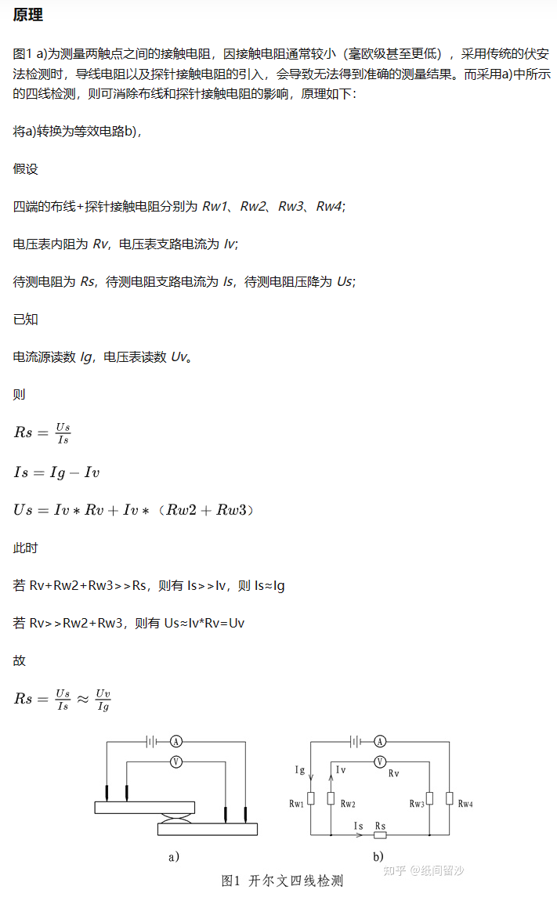
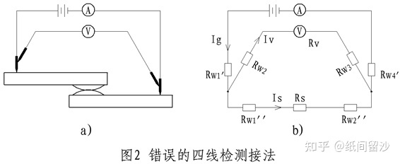
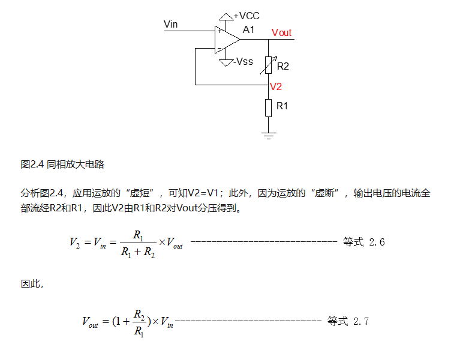

# 电阻率测量项目

## 四端法测电阻

[四端法测接触电阻 - 知乎 (zhihu.com)](https://zhuanlan.zhihu.com/p/361638843)

注意：

1. 四线法的关键在于电压表内阻足够大，使其支路电流以及布线压降的影响可以忽略。
2. 电压检测两探针须与电流源两探针分离，因电压检测两探针所接之处，两点之间所有的主回路电阻都将计入测量电阻。如图2所示，探针短接，则有可能将电流源探针接触电阻带入测量结果。

## 电路图芯片资料

ADUM1201BRZ是数字隔离器，RS-232/RS-422/RS-485收发器隔离

[ADUM1201 | 标准数字隔离器 | 亚德诺（ADI）半导体 (analog.com)](https://www.analog.com/cn/products/adum1201.html)

LT3042是线性稳压器

[LT3042 | LDO+ | 亚德诺（ADI）半导体 (analog.com)](https://www.analog.com/cn/products/lt3042.html#product-overview)

LT3042 是一款高性能低压降线性稳压器，其第7脚 SET 是用于设置输出电压的引脚。

具体来说，第7脚 SET 引脚接受来自外部电路的电压，通过与芯片内部的比较电压进行比较，**控制输出引脚（OUT）的电压值**，从而实现输出电压的精度调整和稳定性控制。

在使用 LT3042 时，可以通过选择合适的外部电路，将带电阻分压器的电压输出到第7脚 SET 引脚，以达到所需的输出电压值。需要注意的是，**由于第7脚 SET 引脚电流非常小**，因此在连接带电阻分压器的电路时，要选择合适的电阻值，以保证电路的可靠性和精度。

总结：LT3042_VOUT会跟随着SET(DAC1输出)变化

LM358 运算放大器

[LM358 数据表、产品信息和支持 | 德州仪器 TI.com.cn](https://www.ti.com.cn/product/cn/LM358#features)

INA105精密单位增益差分放大器

[INA105 数据表、产品信息和支持 | 德州仪器 TI.com.cn](https://www.ti.com.cn/product/cn/INA105#tech-docs)

CD74HCT4067具有 TTL 输入的 5V、16:1、单通道模拟多路复用器

[CD74HCT4067 数据表、产品信息和支持 | 德州仪器 TI.com.cn](https://www.ti.com.cn/product/cn/CD74HCT4067)

CD74HCT4067 是一款高速 CMOS 十六通道模拟多路开关。其中的“common”引脚通常用于控制开关选通的方式。

具体来说，CD74HCT4067 的16个开关引脚以及“common”引脚可以看做一个由16个单刀双掷开关组成的矩阵，其中每个开关分别连接到一个输入端和一个输出端。通过控制“common”引脚的电平，可以选择一个输入端与一个输出端连接，从而实现模拟信号的多路复用。

一般情况下，“common”引脚需要连接到一个控制信号。当控制信号为低电平时，CD74HCT4067 的16个开关引脚中的一个会与“common”引脚连接，从而实现模拟信号的多路复用；当控制信号为高电平时，则会断开所有的开关通路，从而关闭所有选择通路。

INA282

[INA282电流采集芯片_中间态BUG的博客-CSDN博客](https://blog.csdn.net/m0_62672176/article/details/125363847)

在此电路图中，REF1接地，REF2接2.5v

当REF1与REF2任意一个引脚接地，一个引脚接VCC时，Vout=I\*R\*50+1/2*VCC，其中50为INA282芯片电压采集增益。

所以代码中应该是已知Vout求I，代码中的R不是0.2欧姆，写的是0.33欧，需要验证。

OPA2376运算放大器

第一级是电压跟随器，第二级是一个同向放大电路

第一级

VOUT进行分压输入第一级同向端。V = （10/ 91+10）VOUT = 0.1 VOUT  

91k欧有点问题，我觉得应该是10k欧

第二级

由原理图得，VOUT_AD = 2 Vin =  2VOUT

## 代码相关

第一次测量

假设Pin_cont = 0 ,pin_change_1的两个参数分别为0，3 ，pin_change_2的两个参数分别为1，2。

进入pin_change_1函数，wxV = 0，wxA = 3 ，pxV = 0，pxA = 0。

因为pxV = 0 ，CD74P1_EN1 = 0 ，所控制的U17选中；

因为pxA = 0 ,   CD74P2_EN1 = 0 ,   所控制的U9选中；

wxV = 15 - wxV -> wxV  = 15 ，15的二进制为 1111 所以 S3S2S1S0为1111。VOUT_CONT15_1连接VIN_LT3042，Tanzhen15_1与VOUT相连。

wxA = 15 - wxA -> wxA = 12  ,  12的二进制为 1100 所以 S7S6S5S4为1100。AIN_CONT12_P1连接VIN_LT3042，

Tanzhen12_1与GND相连。

此时VOUT 连接 Tanzhen15_1  Tanzhen12_1接地。

进入pin_change_2函数，wxV = 1，wxA = 2，pxV = 0，pxA = 0。

因为pxV = 0 ，CD74P3_EN1 = 0 ，所控制的U15选中；

因为pxA = 0 ,   CD74P4_EN1 = 0 ,   所控制的U16选中；

wxV = 15 - wxV -> wxV  = 14 ，14的二进制为 1110 所以 S11S10S9S8为1110。Tanzhen14_1 连接VIN+

wxA = 15 - wxA -> wxA = 13  ,  13的二进制为 1101 所以S15S14S13S12为1101。Tanzhen13_1选中VIN-

第二次测量

假设Pin_cont = 0 ,pin_change_2的两个参数分别为3，0 ，pin_change_2的两个参数分别为2，1。

片选不变，两个探针换下位置。

相当于VOUT 连接 Tanzhen12_1  Tanzhen15_1接地。

## 明瑄讲解

检查I/O和三级管情况。

考虑更换LT3042芯片，搞一个宽幅，高功率芯片。或者找一个可以由单片机代码指定的恒流源模块。

考虑STM32低功耗模式。使用D3231闹钟唤醒，不需要实时检测。