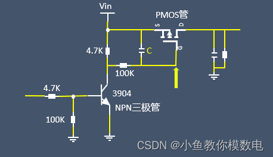
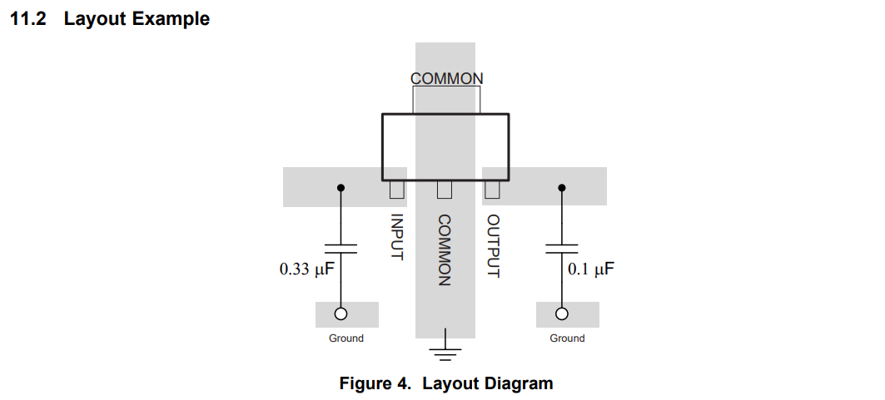

# 轨道衡智能采集站

## 一些注意的地方

PCIE金手指Bx为顶面，Ax为底面，1-11为第一段，12-18为第二段

## 采集板卡

### STM32F103C8T6

STM32F103模块主要负责获取AD4111的数据以及和采集站主板的CAN通信。

### AD4111

AD采集

### AD620

低通滤波，差分变成单端

### AD24C02

负责存储出厂校准数据

### NE5532

运放，负责放大信号

### TPS60400替换LM2662

完成5V到-5V的转化

官方测试电路参数V+ = 5 V, FC = Open, C1 = C2 = 47 μF，LV = Open

### UA78M05IDCYR

12V转5V

### AMS1117

5V输入，3.3V输出为单片机供电

### TJA1050

CAN通信芯片

### ICL7662

正10V至负10V

### UA78M10

将电源模块接出的12V转换为10V,5W

### MAX3485

备用485通信（串口1）

### 金手指部分

金手指检测板卡是否插入完全，可以使用或门芯片去检测两个金手指的电平。默认是使用上拉电阻接到3.3V。

### 板上的电源种类

12V 10V -10V 5V -5V 3.3V

GND AGND

## 采集站主板

### STM32F407ZGT6

负责通信，CAN通信获取所有采集板的数据等一系列功能

### IS62WV51216

ADC数据缓存SRAM

### ADM3251

带有隔离的RS232芯片

### LAN8720

百兆网口PHY

### AMS1117

5V输入，3.3V输出为单片机供电

### CH340N

用于USB口直连电脑，用于测试

### TF卡槽

放置TF卡存储log信息

### TJA1050

CAN通信芯片

### TPS5430

宽电压输入，5V输出

### MAX3485

备用485通信

### XL74LS02

4个二输入或非门，用于金手指安装检测，一个XL74LS02带4个板卡

### 板上的电源种类

12V 5V 3.3V

GND

### 空余的IO

PA 6个 PB 7个 PC 8个 PD 2个 PE5个 PF6个 PG5个  一共39个

### 串口的用途

串口1

串口3

串口6

## 底板上可以使用MOS管去控制电源

1.MOS管导通电流大，

2.MOS管导通时内阻小，压降小。

三极管这里主要做电平转换用，MOS管的左边是输入的电压，右边是输出的电压，当三极管输入为低电平时，三极管截止，MOS管的栅极为高电平，MOS管截止，电源输出关断，当三极管输入为高电平，三极管导通，PMOS栅极为低电平，MOS管导通，电源输出开启。

并且由于有些电源存在大电容的负载，如果上电很陡峭的话，会导致瞬间电流会很大，很容易损坏器件。所以我们有时候会要求电源能够慢慢的从0到VCC，其实我们在上面的电路加一个电阻和电容后就能达到缓启动的目的。

最少需要24个IO，使用或门芯片去识别。

[如何通过MOS管控制电源通断以及缓启动_mos电源控制-CSDN博客](https://blog.csdn.net/weixin_42693097/article/details/126887541)

[基于MOS管实现的电源开关电路设计 - 苍月代表我 - 博客园 (cnblogs.com)](https://www.cnblogs.com/lifan3a/articles/15215585.html)

## 芯片手册layout

### UA78MXX

