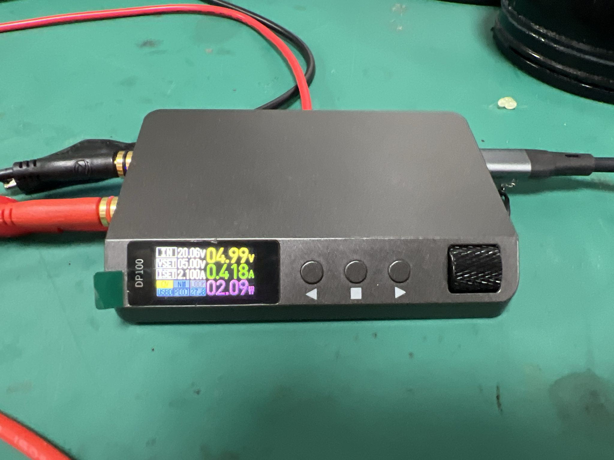
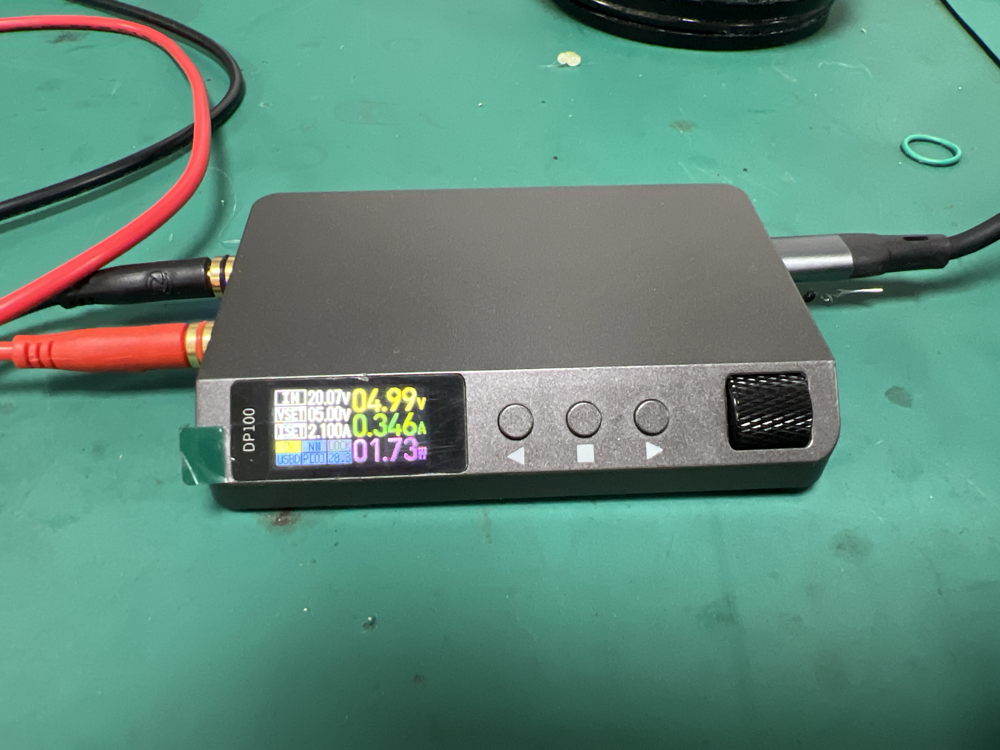
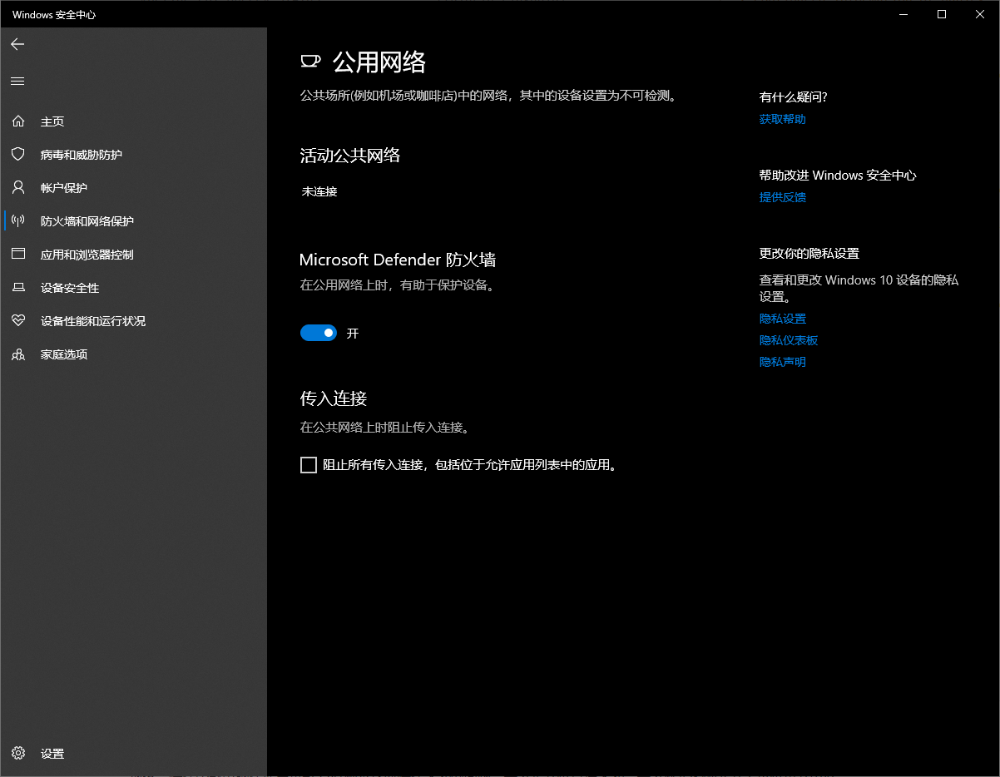

# 调试注意事项

1. 调试的时候出现过CAN无法通信，原因发现是CAN波特率不同，因为F1和F4的工作频率不一样，句柄配置需要更改。同时主板初始化了控制IO口，并没有指定控制IO口的电平高低，导致采集板卡一直处于复位状态，无法通过CAN发送。

# 存在的问题

采集板卡V1.0

1. -10V输出不准，目前只有-3V到-4V，实验发现是ne5532的问题，**更换TL062**后大幅度改善
2. CAN芯片的**2脚地没有接好**，但是实测不接地也可以正常工作，后续原理图还是改正
3. 部分元器件布局没有对称
4. C8T6烧录VCT6或者ZET6的代码会使得芯片锁死，后续调试注意一下，现在烧录有时候需要按一下复位键
5. 烧录口最好是弯排，**放在板的边缘**，方便后期对单一板卡进行烧录程序
6. 第六路的丝印需要调整一下
7. 指示灯亮度不一致，3.3v的阻值需要更改。
8. UA78M05 12V至5V芯片带载发热严重。该芯片只能输出5V500mA即2.5W。

采集板卡V2.0

1. -5V的带载能力还是有些不足，可以试着再增加一路供电
2. 烧录之后需要重启电源才能调试，USB处增加一个二极管，方便调试的时候无需按复位键，缺点是无法使用USB供电；或者将CH340N的电源与单片机分离
3. 板卡工作一段时间后，出现AD620放大倍数降低的问题，重新上电后恢复。目前估计是芯片质量问题。（后经测试，接实际传感器没有问题，虚惊一场）
4. DB37接口的正负5V输入口只有6组，缺少2组，需要补齐
5. INA828或许是AD620不错的替代，性能更好，价格更低，但是放大倍数计算公式变化
6. DB37的接线定义可能需要更改，最好能做一个接线盒，方便下次的调试
7. 金手指上增加复位线，用于和主板一起复位

采集站主板V1.0

1. 5V电源附近三个大电容并没有储能的功能，测试可以**采用超级电容的方式供电**

2. CAN芯片的**2脚地没有接好**，但是实测不接地也可以正常工作，后续原理图还是改正

3. PCIeX16底座上面的**一个孔没有打穿**，现在只能磨掉焊接

4. 底板上关于**SYNC和NRST引脚最好加一个测试点**，方便后续测试

5. 网口部分能够连上路由器，且能用ping通，但是指示灯不亮，原因是原理图画错。需要修改网口指示灯位置原理图，晶振的起振电容的容值从**100nf改为22pf**。

6. 跳线帽位置**丝印应该改成USB**，而不是TTL，更加严谨

7. 电源检测，硬件分压部分正常，电阻分压测得2.78V，满足小于3.3V的要求，但是单片机VREF+没有接参考电压，VREF+ 是 ADC 的正参考电压，通常被连接到一个稳定的参考电压源，这导致程序一直输出3.3V和实际完全不符。后经测试，将**VREF+短接到VCC**上恢复正常。

8. S8050缺货，更换为SS8050，性能更好。

采集站主板V2.0

1. 现在所有板卡和主板的复位线都相连，主板还需要给板卡提供电源，这导致在关机时，不能够正确将log信息写入TF卡，最后通过将主板上的复位线用刻刀断开，测试发现恢复正常。后续修改版本可以用一个0欧电阻跳接一下。

## 采集站主板V2.0的改进之处

1. 烧录之后需要重启电源才能调试，USB处增加一个二极管，方便调试的时候无需按复位键，缺点是无法使用USB供电；或者将CH340N的电源与单片机分离
1. 串口屏的接口接线定义有问题，现在正好是相反的，或者购买相应线序的线
1. 增加一个网络连接正常的指示灯，使用0805封装
1. 增加5.5V 0.22F的超级电容器，用于关机时的TF卡日志记录
1. 增加一个复位接口，用于面板上的复位按键使用

# 测试已经没问题的功能

## 采集板卡

USB-TTL通信 正常

RS485通信 正常

AD4111 8路采集正常

AT24C02正常

CAN 正常 但是需要将2脚连接到GND

使用源表输出mv电压，放大倍数正常，AD能给出的最高电压上限为9.15V

## 采集站主板

USB-TTL通信 正常

RS485通信 正常

带隔离的RS232通信 正常，需注意要接GND_ISO

SD卡 正常

CAN 正常 但是需要将2脚连接到GND

网口能够ping通，并且DHCP分配IP地址

对于板卡的复位控制 正常

AT24C02正常

DS1337正常

# 采集板卡V1.0的-10V测试

V1.0版测量-10V输出位置为-4.3V

去掉在-10V和-10VA之间的0欧电阻后，-10V输出位置为-9.4V，鉴定完毕，就是运放需要的电流太大，将电源电压下拉。

去掉8个NE5532后，-10V输出位置为-8.9V

装上8个TL062后，-10V输出位置为-8.67V

ICL7662更换LT1054后，-10V输出位置为-9.44V

去掉-10VLED上的电阻后，-10V输出位置为-9.54V

更换-10VLED串联电阻值从1K到4.7K，-10V输出位置为-9.47V

# 电源需求（V1.0）

PS：该测试在只插12V供电情况下，不插USB和J-Link，不插传感器

单采集板卡V1.0，台式电源显示12V，0.14A

插入一张原版V1.0板卡后，台式电源显示12V，0.35A


原版V1.0板卡单板0.22A，更换TL062运放后，单板0.11A

ICL7662更换LT1054后，单板0.12A


通过电子负载测试，50欧情况下，0.183A，9.5V左右。

# 采集板卡电源测试

## V1.0

8个传感器接满时
（原因是12V转5V芯片发热严重，效率下降）
传感器两端相对电压8V
-5V输出为-3.5V
5V输出为4.11V
-10V输出为-8.18V
10V输出为9.88V

使用外接5V供电测试情况
使用电子负载50欧


实际8个传感器



5V位置4.99V
-5V位置-4.47V
-10V位置-8V 更换LT1054后为-9.39V
10V位置9.89V


功耗测试
单板接50欧电子负载


主板


电子负载100欧（刚刚开始未发热)

## V2.0
V2.0板卡测试
空载情况
5V位置5.02V
-5V位置-5.01V
10V位置9.94V
-10V位置-9.57V
3.3V位置3.29V
总供电12V 0.11A

电子负载50欧
5V位置5.01V
-5V位置-4.68V
10V位置9.94V
-10V位置-9.56V
3.3V位置3.29V
总供电12V 0.36A


电子负载90欧

# 芯片测试

使用4号板卡作为实验板卡，接入20mv的源，输出数据如下

V0 4.015198
V1 4.025012
V2 4.020882
V3 4.016075
V4 4.017246
V5 4.022518
V6 4.017186
V7 4.015803

更换7通道芯片为INA129

更换8通道芯片为INA828


2号板卡全部更换为INA828，实际测试，功率和原版一致，12V 0.11A


# 接插件线序

## 五芯颜色对应

| 1号  | 白色 |  +5V  |
| :--: | :--: | :---: |
| 2号  | 褐色 |  -5V  |
| 3号  | 黑色 | 信号- |
| 4号  | 蓝色 | 信号+ |
| 5号  | 灰色 |  GND  |

# 传感器线序

| 红色 | +5V   |
| ---- | ----- |
| 黑色 | -5V   |
| 白色 | 信号+ |
| 绿色 | 信号- |


# FreeRTOS移植LwIP遇到的问题

1. lwipopts.h文件

```c
/**
SYS_LIGHTWEIGHT_PROT==1:如果您确实需要任务间保护
*/
#define SYS_LIGHTWEIGHT_PROT            1
    
/* NO_SYS 表示无操作系统模拟层，无操作系统为1，有操作系统设置为0 
   注意这个参数设置会编译不同 */
#define NO_SYS                          0
```

2. PHY芯片的初始化，ETH中断优先级要在5-15之间，不然会导致FreeRTOS卡死

```c
HAL_NVIC_SetPriority(ETH_IRQn, 6, 0);           /* 网络中断优先级应该高一点 */
HAL_NVIC_EnableIRQ(ETH_IRQn);
```

3. stm32f4xx_hal_conf.h 有差异，缺少拓展PHY芯片的寄存器 主要是PHY地址#define ETHERNET_PHY_ADDRESS              0x00(硬件相关)

```C
/* Section 4: Extended PHY Registers */

//#define PHY_SR                          ((uint16_t)0x0010)  /*!< PHY status register Offset                      */
#define PHY_MICR                        ((uint16_t)0x0011)  /*!< MII Interrupt Control Register                  */
#define PHY_MISR                        ((uint16_t)0x0012)  /*!< MII Interrupt Status and Misc. Control Register */

#define PHY_LINK_STATUS                 ((uint16_t)0x0001)  /*!< PHY Link mask                                   */
//#define PHY_SPEED_STATUS                ((uint16_t)0x0002)  /*!< PHY Speed mask                                  */
//#define PHY_DUPLEX_STATUS               ((uint16_t)0x0004)  /*!< PHY Duplex mask                                 */

#define PHY_MICR_INT_EN                 ((uint16_t)0x0002)  /*!< PHY Enable interrupts                           */
#define PHY_MICR_INT_OE                 ((uint16_t)0x0001)  /*!< PHY Enable output interrupt events              */

#define PHY_MISR_LINK_INT_EN            ((uint16_t)0x0020)  /*!< Enable Interrupt on change of link status       */
#define PHY_LINK_INTERRUPT              ((uint16_t)0x2000)  /*!< PHY link status interrupt mask                  */

/* 网卡PHY地址设置 */
#define ETHERNET_PHY_ADDRESS              0x00

/* 选择PHY芯片 */
#define LAN8720                          0
#define SR8201F                          1
#define YT8512C                          2
#define RTL8201                          3
#define PHY_TYPE                         LAN8720


#if(PHY_TYPE == LAN8720) 
#define PHY_SR                           ((uint16_t)0x1F)                       /*!< tranceiver status register */
#define PHY_SPEED_STATUS                 ((uint16_t)0x0004)                     /*!< configured information of speed: 100Mbit/s */
#define PHY_DUPLEX_STATUS                ((uint16_t)0x0010)                     /*!< configured information of duplex: full-duplex */
#elif(PHY_TYPE == SR8201F)
#define PHY_SR                           ((uint16_t)0x00)                       /*!< tranceiver status register */
#define PHY_SPEED_STATUS                 ((uint16_t)0x2020)                     /*!< configured information of speed: 100Mbit/s */
#define PHY_DUPLEX_STATUS                ((uint16_t)0x0100)                     /*!< configured information of duplex: full-duplex */
#elif(PHY_TYPE == YT8512C)
#define PHY_SR                           ((uint16_t)0x11)                       /*!< tranceiver status register */
#define PHY_SPEED_STATUS                 ((uint16_t)0x4010)                     /*!< configured information of speed: 100Mbit/s */
#define PHY_DUPLEX_STATUS                ((uint16_t)0x2000)                     /*!< configured information of duplex: full-duplex */
#elif(PHY_TYPE == RTL8201)
#define PHY_SR                           ((uint16_t)0x10)                       /*!< tranceiver status register */
#define PHY_SPEED_STATUS                 ((uint16_t)0x0022)                     /*!< configured information of speed: 100Mbit/s */
#define PHY_DUPLEX_STATUS                ((uint16_t)0x0004)                     /*!< configured information of duplex: full-duplex */

#endif /* PHY_TYPE */
```

   

4. 需要注释lwip_comm.c中第309行 g_lwipdev.lwip_display_fn(2); 这个函数和显示相关，不注释会导致可以DHCP分配IP但是无法Ping通

```
C:\Users\bcl>ping 10.23.11.241

正在 Ping 10.23.11.241 具有 32 字节的数据:
请求超时。
请求超时。
来自 10.23.11.145 的回复: 无法访问目标主机。
来自 10.23.11.145 的回复: 无法访问目标主机。

10.23.11.241 的 Ping 统计信息:
    数据包: 已发送 = 4，已接收 = 2，丢失 = 2 (50% 丢失)，
```

# 测试发现的网络问题

现象：存在小数电脑在使用拼4包为1帧发送时存在卡死的问题。要么是开机直接卡死，要么就是必须先开上位机再开电源

排查：我首先将拼4包改为不拼包，发现效果很不错，至少在原本不能用的电脑上也能够正常使用了。

原因：最后发现可能是防火墙的问题，主要在于公用网络防火墙，该防火墙开启时一切正常，关闭之后会复现之前的问题。所以使用时需要开启电脑的公用网络防火墙。


